# Design Document: UC Multilingual README & EDA Demo Proposal

## Overview

本設計は2つの独立したサブシステムで構成される:

1. **Translation System** — 14 UC フォルダの README を8言語に展開し、統一された Language Switcher を注入するプロセス
2. **EDA Demo Proposal** — UC6 (semiconductor-eda) の EDA Summit 向けデモ動画企画書

Translation System は Python スクリプトとして実装し、AI 翻訳 API（Amazon Bedrock）を活用して自然な翻訳を生成する。Language Switcher の注入は決定論的な文字列操作で行い、翻訳品質は人間レビューで最終確認する。

EDA Demo Proposal は markdown ドキュメントとして `semiconductor-eda/docs/eda-summit-demo-proposal.md` に配置し、EDA エンドユーザー（設計エンジニア）視点のストーリーボードを含む。

## Architecture

```mermaid
flowchart TB
    subgraph TRANSLATION["翻訳生成システム"]
        SRC["Source README.md (ja)"]
        SCRIPT["translate_readmes.py"]
        BEDROCK["Amazon Bedrock<br/>(Claude / Nova)"]
        INJECT["Language Switcher Injector"]
        
        SRC --> SCRIPT
        SCRIPT --> BEDROCK
        BEDROCK --> INJECT
        INJECT --> OUTPUT_FILES["README.{lang}.md × 7<br/>(per UC folder)"]
    end

    subgraph SWITCHER["Language Switcher 注入"]
        PARSE["Markdown H1 検出"]
        INSERT["Switcher 行挿入"]
        HIGHLIGHT["現在言語のリンク除去"]
        
        PARSE --> INSERT --> HIGHLIGHT
    end

    subgraph DEMO["EDA Demo Proposal"]
        PROPOSAL["eda-summit-demo-proposal.md"]
        STORYBOARD["Storyboard (5 sections)"]
        RECORDING["Recording Plan"]
        
        PROPOSAL --> STORYBOARD
        PROPOSAL --> RECORDING
    end
```



### Translation System アーキテクチャ

翻訳生成は以下のパイプラインで実行する:

1. **Source Discovery** — 各 UC フォルダの `README.md` を検出
2. **Content Extraction** — Markdown をセクション単位に分割（コードブロック・Mermaid は翻訳対象外として分離）
3. **Translation** — Amazon Bedrock で prose セクションのみ翻訳
4. **Reassembly** — 翻訳済み prose + 未翻訳コードブロックを再結合
5. **Switcher Injection** — H1 直後に Language Switcher を挿入（現在言語はプレーンテキスト化）
6. **Output** — `README.{lang}.md` として書き出し

### EDA Demo Proposal アーキテクチャ

デモ企画書は静的 markdown ドキュメントとして作成し、既存の UC6 実装（Step Functions, Lambda, Athena, Bedrock）のみを使用する。

## Components and Interfaces

### Component 1: `scripts/translate_readmes.py`

翻訳生成の主スクリプト。

```python
class TranslationConfig:
    """翻訳設定"""
    source_lang: str = "ja"
    target_languages: list[str] = ["en", "ko", "zh-CN", "zh-TW", "fr", "de", "es"]
    uc_folders: list[str]  # 14 UC folder names
    bedrock_model_id: str = "anthropic.claude-3-haiku-20240307-v1:0"

class LanguageSwitcherInjector:
    """Language Switcher の注入・管理"""
    
    SWITCHER_TEMPLATE = '🌐 **Language / 言語**: {links}'
    LANG_LABELS = {
        "ja": "日本語", "en": "English", "ko": "한국어",
        "zh-CN": "简体中文", "zh-TW": "繁體中文",
        "fr": "Français", "de": "Deutsch", "es": "Español"
    }
    LANG_FILES = {
        "ja": "README.md", "en": "README.en.md", "ko": "README.ko.md",
        "zh-CN": "README.zh-CN.md", "zh-TW": "README.zh-TW.md",
        "fr": "README.fr.md", "de": "README.de.md", "es": "README.es.md"
    }
    
    def generate_switcher(self, current_lang: str) -> str:
        """現在言語をプレーンテキスト、他言語をリンクとして Switcher 行を生成"""
        ...
    
    def inject_into_markdown(self, content: str, current_lang: str) -> str:
        """H1 直後に Switcher を挿入（既存 Switcher があれば置換）"""
        ...

class MarkdownTranslator:
    """Markdown コンテンツの翻訳"""
    
    def split_translatable(self, content: str) -> list[ContentBlock]:
        """コードブロック・Mermaid・テーブル構造を分離"""
        ...
    
    def translate_prose(self, text: str, target_lang: str) -> str:
        """Bedrock で prose を翻訳（AWS サービス名等は保持）"""
        ...
    
    def reassemble(self, blocks: list[ContentBlock]) -> str:
        """翻訳済みブロックを再結合"""
        ...

class ReadmeGenerator:
    """UC フォルダ単位の README 生成オーケストレーター"""
    
    def generate_for_folder(self, folder_path: str) -> dict[str, str]:
        """1 UC フォルダの全言語版を生成"""
        ...
    
    def generate_all(self) -> None:
        """全14フォルダを処理"""
        ...
```

### Component 2: `LanguageSwitcherInjector`

Language Switcher の生成と注入を担当する純粋関数的コンポーネント。

**インターフェース:**
- Input: Markdown 文字列 + 現在の言語コード
- Output: Switcher が注入された Markdown 文字列

**ルール:**
- H1 (`# ...`) の直後の行に挿入
- 既存の Switcher 行（`🌐` で始まる行）があれば置換
- 現在言語はリンクなし（プレーンテキスト）、他言語はリンク付き
- 相対パス（同一ディレクトリ内）を使用

### Component 3: `MarkdownTranslator`

Markdown の構造を保持しながら翻訳を行うコンポーネント。

**翻訳対象:**
- 見出しテキスト
- 段落テキスト
- リスト項目のテキスト部分
- テーブルのテキストセル

**翻訳対象外（保持）:**
- コードブロック（```...```）
- インラインコード（`...`）
- Mermaid ダイアグラム
- ファイルパス
- URL / リンク先
- AWS サービス名
- 技術用語（GDSII, DRC, OASIS 等）

### Component 4: EDA Demo Proposal Document

`semiconductor-eda/docs/eda-summit-demo-proposal.md` として作成する静的ドキュメント。

**構成:**
1. Executive Summary
2. Target Audience & Persona
3. Demo Scenario (Pre-tapeout Quality Review)
4. Storyboard (5 sections, 3-5 min total)
5. Screen Capture Plan
6. Narration Outline
7. Sample Data Requirements
8. Timeline (1-week achievable vs. future)

## Data Models

### ContentBlock（翻訳パイプライン内部モデル）

```python
from dataclasses import dataclass
from enum import Enum

class BlockType(Enum):
    PROSE = "prose"           # 翻訳対象
    CODE = "code"             # 保持（コードブロック）
    MERMAID = "mermaid"       # 保持（Mermaid ダイアグラム）
    TABLE = "table"           # テキストセルのみ翻訳
    HEADING = "heading"       # テキスト部分を翻訳
    SWITCHER = "switcher"     # 置換対象

@dataclass
class ContentBlock:
    block_type: BlockType
    content: str
    translated: str | None = None  # 翻訳後のコンテンツ
```

### TranslationResult（生成結果モデル）

```python
@dataclass
class TranslationResult:
    uc_folder: str
    lang: str
    output_path: str
    source_hash: str       # ソース README の SHA256（変更検知用）
    success: bool
    error: str | None = None
```

### LanguageSwitcherConfig（Switcher 設定）

```python
@dataclass
class LanguageSwitcherConfig:
    languages: dict[str, str]  # lang_code -> display_label
    file_map: dict[str, str]   # lang_code -> filename
    current_lang: str          # 現在のファイルの言語
```

### Demo Proposal Structure（EDA デモ企画書構造）

```python
@dataclass
class DemoSection:
    title: str
    duration_seconds: int
    description: str
    screen_capture_points: list[str]
    narration_key_points: list[str]

@dataclass
class DemoProposal:
    title: str
    target_audience: str
    total_duration_minutes: int  # 3-5 min
    scenario: str
    sections: list[DemoSection]
    sample_data_requirements: list[str]
    achievable_within_1_week: list[str]
    future_enhancements: list[str]
```

## Correctness Properties

*A property is a characteristic or behavior that should hold true across all valid executions of a system — essentially, a formal statement about what the system should do. Properties serve as the bridge between human-readable specifications and machine-verifiable correctness guarantees.*

### Property 1: Language Switcher placement after H1

*For any* valid Markdown string containing an H1 heading (`# ...`), after Language Switcher injection, the switcher line (starting with `🌐`) SHALL appear on the first non-empty line immediately following the H1 heading line.

**Validates: Requirements 1.2, 2.2**

### Property 2: Current language is plain text in switcher

*For any* valid language code from the set {ja, en, ko, zh-CN, zh-TW, fr, de, es}, the generated Language Switcher SHALL contain exactly 7 markdown links (`[label](file)`) and exactly 1 plain-text label (no link) corresponding to the current language.

**Validates: Requirements 2.3**

### Property 3: Document structure invariant across translation

*For any* Markdown document, after translation to any target language, the output SHALL preserve: (a) the same number of headings at each level, (b) the same number of fenced code blocks, (c) the same number of Mermaid diagram blocks, and (d) the same number of table rows.

**Validates: Requirements 1.3, 7.3**

### Property 4: Untranslatable content preservation

*For any* Markdown document containing fenced code blocks, inline code spans, AWS service names, or domain-specific terms (GDSII, DRC, OASIS, Athena, Bedrock, etc.), after translation those elements SHALL appear byte-for-byte identical in the output.

**Validates: Requirements 1.4, 3.3, 7.2**

### Property 5: Hyperlink target preservation

*For any* Markdown document containing hyperlinks (`[text](target)`), after translation all link targets (URLs and relative paths) SHALL remain unchanged, while link display text may be translated.

**Validates: Requirements 7.4**

### Property 6: Content preservation on switcher injection

*For any* existing README content (with or without a pre-existing Language Switcher), after switcher injection, all original content lines excluding the old switcher line SHALL be preserved in the output in their original order.

**Validates: Requirements 3.2**

## Error Handling

### Translation System Errors

| Error Scenario | Handling Strategy |
|---|---|
| Bedrock API rate limit | Exponential backoff with max 3 retries per file |
| Bedrock API timeout | 60s timeout, retry once, then mark file as failed |
| Invalid Markdown structure (no H1) | Skip switcher injection, log warning, continue |
| Source README not found | Skip UC folder, log error, continue with others |
| Existing file write conflict | Backup existing file as `.bak`, then overwrite |
| Network error | Retry 3x with backoff, then fail gracefully |

### Error Reporting

- 各 UC フォルダの処理結果を `TranslationResult` として収集
- 全処理完了後にサマリーレポートを stdout に出力
- 失敗したファイルのリストを `translation_errors.log` に記録

### EDA Demo Proposal Errors

デモ企画書は静的ドキュメントのため、ランタイムエラーは発生しない。ただし、デモ実行時のエラーシナリオとして以下を企画書内に記載:

- Step Functions 実行失敗時のフォールバック（事前録画済み結果を表示）
- Bedrock レスポンス遅延時のスキップ（事前生成レポートを使用）

## Testing Strategy

### Property-Based Tests (Hypothesis)

Translation System のコアロジック（Language Switcher 注入、構造保持）に対して property-based testing を適用する。

**ライブラリ**: [Hypothesis](https://hypothesis.readthedocs.io/) (Python)
**最小イテレーション数**: 100 回/プロパティ

各プロパティテストは以下のタグ形式でコメントする:
```python
# Feature: uc-multilingual-readme-and-eda-demo, Property 1: Language Switcher placement after H1
```

**テスト対象コンポーネント:**
- `LanguageSwitcherInjector.generate_switcher()` — Property 2
- `LanguageSwitcherInjector.inject_into_markdown()` — Property 1, 6
- `MarkdownTranslator.split_translatable()` + `reassemble()` — Property 3, 4, 5

### Unit Tests (pytest)

- Language Switcher フォーマットが Root README と完全一致すること (Req 2.1, 3.1)
- 全8言語のファイル名マッピングが正しいこと (Req 1.1)
- 既知の技術用語が翻訳後も保持されること (Req 7.5)
- EDA Demo Proposal に必須セクションが含まれること (Req 4.2, 4.3, 4.4)
- デモで使用するコンポーネントが既存実装に存在すること (Req 6.1)

### Integration Tests

- 実際の UC フォルダ README に対して翻訳パイプラインを実行し、出力ファイルが正しく生成されること
- 生成された README の Language Switcher リンクが実在するファイルを指していること

### Manual Review

- 翻訳の自然さ・正確性（各言語ネイティブスピーカーによるレビュー）
- EDA Demo Proposal の技術的正確性（EDA ドメイン専門家によるレビュー）
- デモシナリオの EDA エンドユーザー視点の妥当性

