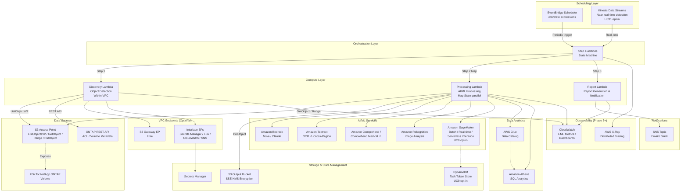

# FSx for ONTAP S3 Access Points Serverless Patterns

🌐 **Language / 言語**: [日本語](README.md) | [English](README.en.md) | [한국어](README.ko.md) | [简体中文](README.zh-CN.md) | [繁體中文](README.zh-TW.md) | [Français](README.fr.md) | [Deutsch](README.de.md) | [Español](README.es.md)

Sammlung branchenspezifischer serverloser Automatisierungsmuster auf Basis von Amazon FSx for NetApp ONTAP S3 Access Points.

> **Positionierung dieses Repositories**: Dies ist eine „Referenzimplementierung zum Erlernen von Designentscheidungen". Einige Anwendungsfälle wurden in einer AWS-Umgebung vollständig E2E-verifiziert, während andere durch CloudFormation-Deployment, gemeinsames Discovery Lambda und Tests der Hauptkomponenten validiert wurden. Ziel ist es, Designentscheidungen zu Kostenoptimierung, Sicherheit und Fehlerbehandlung durch konkreten Code zu demonstrieren — mit einem Pfad vom PoC zur Produktion.

## Verwandter Artikel

Dieses Repository liefert die Implementierungsbeispiele für die im folgenden Artikel beschriebene Architektur:

- **FSx for ONTAP S3 Access Points as a Serverless Automation Boundary — AI Data Pipelines, Volume-Level SnapMirror DR, and Capacity Guardrails**
  https://dev.to/yoshikifujiwara/fsx-for-ontap-s3-access-points-as-a-serverless-automation-boundary-ai-data-pipelines-ili

Der Artikel erklärt die architektonischen Überlegungen und Kompromisse. Dieses Repository liefert konkrete, wiederverwendbare Implementierungsmuster.

## Überblick

Dieses Repository bietet **5 branchenspezifische Muster** für die serverlose Verarbeitung von Unternehmensdaten, die auf FSx for NetApp ONTAP über **S3 Access Points** gespeichert sind.

> Im Folgenden wird FSx for ONTAP S3 Access Points als **S3 AP** abgekürzt.

Jeder Anwendungsfall ist als eigenständiges CloudFormation-Template umgesetzt. Gemeinsam genutzte Module (ONTAP REST API Client, FSx Helper, S3 AP Helper) befinden sich in `shared/` zur Wiederverwendung.

### Hauptmerkmale

- **Polling-basierte Architektur**: Da S3 AP `GetBucketNotificationConfiguration` nicht unterstützt, periodische Ausführung über EventBridge Scheduler + Step Functions
- **Getrennte gemeinsame Module**: OntapClient / FsxHelper / S3ApHelper werden in allen Anwendungsfällen wiederverwendet
- **CloudFormation / SAM Transform basiert**: Jeder Anwendungsfall ist ein eigenständiges CloudFormation-Template mit SAM Transform
- **Sicherheit zuerst**: TLS-Verifizierung standardmäßig aktiviert, IAM mit minimalen Berechtigungen, KMS-Verschlüsselung
- **Kostenoptimiert**: Kostenintensive Dauerressourcen (Interface VPC Endpoints usw.) sind optional

## Architektur



> Das Diagramm zeigt die Gesamtarchitektur über alle Phasen (Phase 1-5). SageMaker, Kinesis und DynamoDB werden über CloudFormation Conditions (Opt-in) gesteuert und verursachen keine zusätzlichen Kosten, solange sie nicht aktiviert sind. Für PoC/Demo-Zwecke kann auch eine Lambda-Konfiguration außerhalb des VPC gewählt werden.

### Workflow-Übersicht

```
EventBridge Scheduler (periodische Ausführung)
  └─→ Step Functions State Machine
       ├─→ Discovery Lambda: Objektliste von S3 AP abrufen → Manifest generieren
       ├─→ Map State (parallele Verarbeitung): Jedes Objekt mit AI/ML-Diensten verarbeiten
       └─→ Report/Notification: Ergebnisbericht generieren → SNS-Benachrichtigung
```

## Liste der Anwendungsfälle

### Phase 1 (UC1–UC5)

| # | Verzeichnis | Branche | Muster | Verwendete AI/ML-Dienste | ap-northeast-1 Verifizierungsstatus |
|---|-------------|---------|--------|--------------------------|-------------------------------------|
| UC1 | `legal-compliance/` | Recht und Compliance | Dateiserver-Audit und Data Governance | Athena, Bedrock | ✅ E2E erfolgreich |
| UC2 | `financial-idp/` | Finanz- und Versicherungswesen | Automatisierte Vertrags- und Rechnungsverarbeitung (IDP) | Textract ⚠️, Comprehend, Bedrock | ⚠️ Nicht in Tokyo (unterstützte Region nutzen) |
| UC3 | `manufacturing-analytics/` | Fertigung | IoT-Sensorprotokoll- und Qualitätsprüfungsbildanalyse | Athena, Rekognition | ✅ E2E erfolgreich |
| UC4 | `media-vfx/` | Medien | VFX-Rendering-Pipeline | Rekognition, Deadline Cloud | ⚠️ Deadline Cloud-Einrichtung erforderlich |
| UC5 | `healthcare-dicom/` | Gesundheitswesen | Automatische DICOM-Bildklassifizierung und Anonymisierung | Rekognition, Comprehend Medical ⚠️ | ⚠️ Nicht in Tokyo (unterstützte Region nutzen) |

### Phase 2 (UC6–UC14)

| # | Verzeichnis | Branche | Muster | Verwendete AI/ML-Dienste | ap-northeast-1 Verifizierungsstatus |
|---|-------------|---------|--------|--------------------------|-------------------------------------|
| UC6 | `semiconductor-eda/` | Halbleiter / EDA | GDS/OASIS-Validierung, Metadatenextraktion, DRC-Aggregation | Athena, Bedrock | ✅ Tests bestanden |
| UC7 | `genomics-pipeline/` | Genomik | FASTQ/VCF-Qualitätsprüfung, Variantenaufruf-Aggregation | Athena, Bedrock, Comprehend Medical ⚠️ | ⚠️ Cross-Region (us-east-1) |
| UC8 | `energy-seismic/` | Energie | SEG-Y-Metadatenextraktion, Bohrloch-Anomalieerkennung | Athena, Bedrock, Rekognition | ✅ Tests bestanden |
| UC9 | `autonomous-driving/` | Autonomes Fahren / ADAS | Video/LiDAR-Vorverarbeitung, QC, Annotation | Rekognition, Bedrock, SageMaker | ✅ Tests bestanden |
| UC10 | `construction-bim/` | Bauwesen / AEC | BIM-Versionsverwaltung, Zeichnungs-OCR, Sicherheits-Compliance | Textract ⚠️, Bedrock, Rekognition | ⚠️ Cross-Region (us-east-1) |
| UC11 | `retail-catalog/` | Einzelhandel / E-Commerce | Produktbild-Tagging, Katalog-Metadatengenerierung | Rekognition, Bedrock | ✅ Tests bestanden |
| UC12 | `logistics-ocr/` | Logistik | Lieferschein-OCR, Lagerbestandsbildanalyse | Textract ⚠️, Rekognition, Bedrock | ⚠️ Cross-Region (us-east-1) |
| UC13 | `education-research/` | Bildung / Forschung | PDF-Klassifizierung, Zitationsnetzwerkanalyse | Textract ⚠️, Comprehend, Bedrock | ⚠️ Cross-Region (us-east-1) |
| UC14 | `insurance-claims/` | Versicherung | Unfallfotos-Schadensbewertung, Kostenvoranschlag-OCR, Schadenbericht | Rekognition, Textract ⚠️, Bedrock | ⚠️ Cross-Region (us-east-1) |

> **Regionale Einschränkungen**: Amazon Textract und Amazon Comprehend Medical sind in ap-northeast-1 (Tokyo) nicht verfügbar. Phase 2 UCs (UC7, UC10, UC12, UC13, UC14) verwenden Cross_Region_Client, um API-Aufrufe an us-east-1 weiterzuleiten. Rekognition, Comprehend, Bedrock und Athena sind in ap-northeast-1 verfügbar.
> 
> Referenz: [Von Textract unterstützte Regionen](https://docs.aws.amazon.com/general/latest/gr/textract.html) | [Von Comprehend Medical unterstützte Regionen](https://docs.aws.amazon.com/general/latest/gr/comprehend-med.html)

## Leitfaden zur Regionsauswahl

Diese Mustersammlung wurde in **ap-northeast-1 (Tokyo)** verifiziert, kann aber in jeder AWS-Region bereitgestellt werden, in der die erforderlichen Dienste verfügbar sind.

### Checkliste vor der Bereitstellung

1. Dienstverfügbarkeit in der [AWS Regional Services List](https://aws.amazon.com/about-aws/global-infrastructure/regional-product-services/) prüfen
2. Phase 3 Dienste überprüfen:
   - **Kinesis Data Streams**: In fast allen Regionen verfügbar (Shard-Preise variieren je nach Region)
   - **SageMaker Batch Transform**: Verfügbarkeit von Instanztypen variiert je nach Region
   - **X-Ray / CloudWatch EMF**: In fast allen Regionen verfügbar
3. Zielregionen für Cross-Region-Dienste (Textract, Comprehend Medical) bestätigen

Siehe [Regionale Kompatibilitätsmatrix](docs/region-compatibility.md) für Details.

### Phase 3 Funktionsübersicht

| Funktion | Beschreibung | Ziel-UC |
|----------|-------------|---------|
| Kinesis Streaming | Nahezu-Echtzeit-Erkennung und -Verarbeitung von Dateiänderungen | UC11 (Opt-in) |
| SageMaker Batch Transform | Punktwolken-Segmentierungsinferenz (Callback Pattern) | UC9 (Opt-in) |
| X-Ray Tracing | Verteiltes Tracing zur Visualisierung von Ausführungspfaden | Alle 14 UCs |
| CloudWatch EMF | Strukturierte Metrikausgabe (FilesProcessed, Duration, Errors) | Alle 14 UCs |
| Observability Dashboard | Zentralisierte Metrikanzeige über alle UCs | Gemeinsam |
| Alert-Automatisierung | SNS-Benachrichtigungen basierend auf Fehlerratenschwellenwerten | Gemeinsam |

Siehe [Streaming vs Polling Auswahlhilfe](docs/streaming-vs-polling-guide-de.md) für Details.

### Phase 4 Funktionsübersicht

| Funktion | Beschreibung | Ziel-UC |
|----------|-------------|---------|
| DynamoDB Task Token Store | Produktionssichere Token-Verwaltung für SageMaker Callback Pattern (Correlation ID Ansatz) | UC9 (Opt-in) |
| Real-time Inference Endpoint | Inferenz mit niedriger Latenz über SageMaker Real-time Endpoint | UC9 (Opt-in) |
| A/B Testing | Modellversionsvergleich über Multi-Variant Endpoint | UC9 (Opt-in) |
| Model Registry | Modell-Lebenszyklusverwaltung über SageMaker Model Registry | UC9 (Opt-in) |
| Multi-Account Deployment | Multi-Account-Unterstützung über StackSets / Cross-Account IAM / S3 AP-Richtlinien | Alle UCs (Vorlagen bereitgestellt) |
| Event-Driven Prototype | S3 Event Notifications → EventBridge → Step Functions Pipeline | Prototyp |

Alle Phase 4 Funktionen werden durch CloudFormation Conditions gesteuert (Opt-in). Es entstehen keine zusätzlichen Kosten, solange sie nicht explizit aktiviert werden.

Siehe folgende Dokumente für Details:
- [Inferenzkosten-Vergleichsleitfaden](docs/inference-cost-comparison.md)
- [Model Registry Leitfaden](docs/model-registry-guide.md)
- [Multi-Account PoC Ergebnisse](docs/multi-account/poc-results.md)
- [Event-Driven Architekturdesign](docs/event-driven/architecture-design.md)

### Phase 5 Funktionsübersicht

| Funktion | Beschreibung | Ziel-UC |
|----------|-------------|---------|
| SageMaker Serverless Inference | 3. Routing-Option (3-Wege-Auswahl: Batch / Real-time / Serverless) | UC9 (Opt-in) |
| Scheduled Scaling | Geschäftszeiten-basierte automatische Skalierung von SageMaker Endpoints | UC9 (Opt-in) |
| CloudWatch Billing Alarms | Warning / Critical / Emergency 3-stufige Kostenwarnungen | Allgemein (Opt-in) |
| Auto-Stop Lambda | Automatische Erkennung und Herunterskalierung inaktiver SageMaker Endpoints | Allgemein (Opt-in) |
| CI/CD Pipeline | GitHub Actions Workflow (cfn-lint → pytest → cfn-guard → Bandit → deploy) | Alle UCs |
| Multi-Region | DynamoDB Global Tables + CrossRegionClient Failover | Allgemein (Opt-in) |
| Disaster Recovery | DR Tier 1/2/3 Definitionen, Failover-Runbook | Allgemein (Design-Docs) |

Alle Phase 5 Funktionen werden ebenfalls durch CloudFormation Conditions gesteuert (Opt-in). Es entstehen keine zusätzlichen Kosten, solange sie nicht explizit aktiviert werden.

Siehe folgende Dokumente für Details:
- [Serverless Inference Kaltstart-Eigenschaften](docs/serverless-inference-cold-start.md)
- [Kostenoptimierung Best Practices Leitfaden](docs/cost-optimization-guide.md)
- [CI/CD Leitfaden](docs/ci-cd-guide.md)
- [Multi-Region Step Functions Design](docs/multi-region/step-functions-design.md)
- [Disaster Recovery Leitfaden](docs/multi-region/disaster-recovery.md)

### Screenshots

> Die folgenden Bilder sind Beispiele aus einer Verifizierungsumgebung. Umgebungsspezifische Informationen (Konto-IDs usw.) wurden maskiert.

#### Step Functions Bereitstellung und Ausführungsverifizierung für alle 5 UCs


> UC1 und UC3 wurden vollständig E2E verifiziert, während UC2, UC4 und UC5 durch CloudFormation-Bereitstellung und operative Verifizierung der Hauptkomponenten validiert wurden. Bei Verwendung von AI/ML-Diensten mit regionalen Einschränkungen (Textract, Comprehend Medical) ist ein regionsübergreifender Aufruf in unterstützte Regionen erforderlich. Bitte überprüfen Sie die Anforderungen an Datenresidenz und Compliance.

#### Phase 2: CloudFormation-Bereitstellung und Step Functions-Ausführung für alle 9 UCs erfolgreich


> Alle 9 Stacks (UC6–UC14) haben CREATE_COMPLETE / UPDATE_COMPLETE erreicht. Insgesamt 205 Ressourcen.


> Alle 9 Workflows aktiv. Alle SUCCEEDED nach E2E-Ausführung mit Testdaten bestätigt.


> UC6 (Halbleiter-EDA) Step Functions Ausführungsdetail. Alle Zustände erfolgreich: Discovery → ProcessObjects (Map) → DrcAggregation → ReportGeneration.


> Alle 9 UC EventBridge Scheduler-Zeitpläne (rate(1 hour)) sind aktiviert.

#### AI/ML-Dienst-Bildschirme (Phase 1)

##### Amazon Bedrock — Modellkatalog


##### Amazon Rekognition — Label-Erkennung


##### Amazon Comprehend — Entitätserkennung


#### AI/ML-Dienst-Bildschirme (Phase 2)

##### Amazon Bedrock — Modellkatalog (UC6: Berichtsgenerierung)


> Verwendet für DRC-Berichtsgenerierung mit Nova Lite-Modell in UC6 (Halbleiter-EDA).

##### Amazon Athena — Abfrageausführungsverlauf (UC6: Metadaten-Aggregation)


> Athena-Abfragen (cell_count, bbox, naming, invalid) im UC6 Step Functions-Workflow ausgeführt.

##### Amazon Rekognition — Label-Erkennung (UC11: Produktbild-Tagging)


> 15 Labels erkannt (Lighting 98,5%, Light 96,0%, Purple 92,0% usw.) aus Produktbildern in UC11 (Einzelhandelskatalog).

##### Amazon Textract — Dokument-OCR (UC12: Lieferschein-Lesung)


> Textextraktion aus Lieferschein-PDF in UC12 (Logistik-OCR). Ausgeführt über Cross-Region (us-east-1).

##### Amazon Comprehend Medical — Medizinische Entitätserkennung (UC7: Genomik-Analyse)


> Gennamen (GC) aus VCF-Analyseergebnissen mit DetectEntitiesV2 API in UC7 (Genomik-Pipeline) extrahiert. Ausgeführt über Cross-Region (us-east-1).

##### Lambda-Funktionen (Phase 2)


> Alle Phase 2 Lambda-Funktionen (Discovery, Processing, Report usw.) erfolgreich bereitgestellt.

#### Phase 3: Echtzeit-Verarbeitung, SageMaker-Integration & Observability

##### Step Functions E2E-Ausführung erfolgreich (UC11)


> UC11 Step Functions-Workflow E2E-Ausführung erfolgreich. Discovery → ImageTagging Map → CatalogMetadata Map → QualityCheck alle Zustände erfolgreich (8,974s). X-Ray-Trace-Generierung bestätigt.

##### Kinesis Data Streams (UC11 Streaming-Modus)


> UC11 Kinesis Data Stream (1 Shard, Provisioned-Modus) im aktiven Zustand. Überwachungsmetriken angezeigt.

##### DynamoDB-Zustandsverwaltungstabellen (UC11 Änderungserkennung)


> UC11 DynamoDB-Tabellen zur Änderungserkennung. streaming-state (Zustandsverwaltung) und streaming-dead-letter (DLQ).

##### Observability-Stack


> X-Ray-Traces. Stream Producer Lambda-Ausführungstraces im 1-Minuten-Intervall (alle OK, Latenz 7-11ms).


> Zentrales CloudWatch-Dashboard zur Überwachung aller 14 Anwendungsfälle. Step Functions Erfolg/Fehler, Lambda-Fehlerraten, EMF-benutzerdefinierte Metriken.


> Phase 3 Alarm-Automatisierung. Schwellenwert-basierte Alarme für Step Functions-Fehler, Lambda-Fehlerraten und Kinesis Iterator Age (alle im OK-Zustand).

##### S3 Access Point-Überprüfung


> FSx for ONTAP S3 Access Point (fsxn-eda-s3ap) im Available-Zustand. Über die FSx-Konsole im Volume S3-Tab bestätigt.

#### Phase 4: Produktions-SageMaker-Integration, Echtzeit-Inferenz, Multi-Account, Event-Driven

##### DynamoDB Task Token Store


> DynamoDB Task Token Store-Tabelle. Speichert Task Tokens mit 8-Zeichen-Hex-Correlation-ID als Partitionsschlüssel. TTL aktiviert, PAY_PER_REQUEST-Modus, GSI (TransformJobNameIndex) konfiguriert.

##### SageMaker Real-time Endpoint (Multi-Variant A/B Testing)


> SageMaker Real-time Inference Endpoint. Multi-Variant-Konfiguration (model-v1: 70%, model-v2: 30%) für A/B-Tests. Auto Scaling konfiguriert.

##### Step Functions Workflow (Realtime/Batch-Routing)


> UC9 Step Functions Workflow. Choice State routet bei file_count < threshold zum Real-time Endpoint, andernfalls zu Batch Transform.

##### Event-Driven Prototype — EventBridge-Regel


> EventBridge-Regel des Event-Driven Prototype. Filtert S3 ObjectCreated-Events nach Suffix (.jpg, .png) + Prefix (products/) und löst Step Functions aus.

##### Event-Driven Prototype — Step Functions Ausführung erfolgreich


> Event-Driven Prototype Step Functions Ausführung erfolgreich. S3 PutObject → EventBridge → Step Functions → EventProcessor → LatencyReporter alle Zustände erfolgreich.

##### CloudFormation Phase 4 Stacks


> Phase 4 CloudFormation Stacks. UC9-Erweiterung (Task Token Store + Real-time Endpoint) und Event-Driven Prototype CREATE_COMPLETE.

#### Phase 5: Serverless Inference, Kostenoptimierung & Multi-Region

##### SageMaker Serverless Inference Endpoint


> SageMaker Serverless Inference Endpoint Einstellungen. Speicher 4096 MB, max. Parallelität 5.

##### CloudWatch Billing Alarms (3-stufige Kostenalarme)


> Warning / Critical / Emergency 3-stufige Billing Alarms. SNS-Benachrichtigung bei Schwellenwertüberschreitung.

##### DynamoDB Global Table (Multi-Region)


> DynamoDB Global Table Konfiguration. Multi-Region Replikation aktiviert.


> Global Table Replikat-Konfiguration. Datensynchronisation über mehrere Regionen.

## Technologie-Stack

| Schicht | Technologie |
|---------|------------|
| Sprache | Python 3.12 |
| IaC | CloudFormation (YAML) + SAM Transform |
| Compute | AWS Lambda (Produktion: innerhalb VPC / PoC: außerhalb VPC möglich) |
| Orchestrierung | AWS Step Functions |
| Planung | Amazon EventBridge Scheduler |
| Speicher | FSx for ONTAP (S3 AP) + S3 Output Bucket (SSE-KMS) |
| Benachrichtigung | Amazon SNS |
| Analytik | Amazon Athena + AWS Glue Data Catalog |
| AI/ML | Amazon Bedrock, Textract, Comprehend, Rekognition |
| Sicherheit | Secrets Manager, KMS, IAM minimale Berechtigungen |
| Tests | pytest + Hypothesis (PBT), moto, cfn-lint, ruff |

## Voraussetzungen

- **AWS-Konto**: Ein gültiges AWS-Konto mit entsprechenden IAM-Berechtigungen
- **FSx for NetApp ONTAP**: Ein bereitgestelltes Dateisystem
  - ONTAP-Version: Eine Version, die S3 Access Points unterstützt (verifiziert mit 9.17.1P4D3)
  - Ein FSx for ONTAP Volume mit zugeordnetem S3 Access Point (Network Origin je nach Anwendungsfall; `internet` empfohlen bei Athena / Glue)
- **Netzwerk**: VPC, private Subnetze, Routentabellen
- **Secrets Manager**: ONTAP REST API-Anmeldedaten vorab registrieren (Format: `{"username":"fsxadmin","password":"..."}`)
- **S3-Bucket**: Vorab einen Bucket für Lambda-Bereitstellungspakete erstellen (z.B.: `fsxn-s3ap-deploy-<account-id>`)
- **Python 3.12+**: Für lokale Entwicklung und Tests
- **AWS CLI v2**: Für Bereitstellung und Verwaltung

### Vorbereitungsbefehle

```bash
# 1. Bereitstellungs-S3-Bucket erstellen
ACCOUNT_ID=$(aws sts get-caller-identity --query Account --output text)
aws s3 mb "s3://fsxn-s3ap-deploy-${ACCOUNT_ID}" --region $AWS_DEFAULT_REGION

# 2. ONTAP-Anmeldedaten in Secrets Manager registrieren
aws secretsmanager create-secret \
  --name fsxn-ontap-credentials \
  --secret-string '{"username":"fsxadmin","password":"<your-ontap-password>"}' \
  --region $AWS_DEFAULT_REGION

# 3. Vorhandenen S3 Gateway Endpoint prüfen (um Duplizierung zu vermeiden)
aws ec2 describe-vpc-endpoints \
  --filters "Name=vpc-id,Values=<your-vpc-id>" "Name=service-name,Values=com.amazonaws.${AWS_DEFAULT_REGION}.s3" \
  --query 'VpcEndpoints[*].{Id:VpcEndpointId,State:State}' \
  --output table
# → Falls Ergebnisse vorhanden, mit EnableS3GatewayEndpoint=false bereitstellen
```

### Leitfaden zur Lambda-Platzierung

| Zweck | Empfohlene Platzierung | Grund |
|-------|----------------------|-------|
| Demo / PoC | Lambda außerhalb VPC | Kein VPC Endpoint erforderlich, geringe Kosten, einfache Konfiguration |
| Produktion / private Netzwerkanforderungen | Lambda innerhalb VPC | Secrets Manager / FSx / SNS über PrivateLink zugänglich |
| UCs mit Athena / Glue | S3 AP Network Origin: `internet` | Zugriff von AWS-verwalteten Diensten erforderlich |

### Hinweise zum Zugriff auf S3 AP von Lambda innerhalb des VPC

> **Wichtige Erkenntnisse aus der UC1-Bereitstellungsverifizierung (2026-05-03)**

- **Die Routentabellen-Zuordnung des S3 Gateway Endpoint ist erforderlich**: Wenn Sie die Routentabellen-IDs der privaten Subnetze nicht in `RouteTableIds` angeben, wird der Zugriff von Lambda innerhalb des VPC auf S3 / S3 AP zeitüberschritten
- **VPC-DNS-Auflösung überprüfen**: Stellen Sie sicher, dass `enableDnsSupport` / `enableDnsHostnames` im VPC aktiviert sind
- **Lambda außerhalb des VPC wird für PoC / Demo-Umgebungen empfohlen**: Wenn der S3 AP Network Origin `internet` ist, kann Lambda außerhalb des VPC problemlos darauf zugreifen. Kein VPC Endpoint erforderlich, Kosten werden reduziert und die Konfiguration vereinfacht
- Siehe [Fehlerbehebungsleitfaden](docs/guides/troubleshooting-guide.md#6-lambda-vpc-内実行時の-s3-ap-タイムアウト) für Details

### Erforderliche AWS-Service-Kontingente

| Dienst | Kontingent | Empfohlener Wert |
|--------|-----------|-----------------|
| Lambda gleichzeitige Ausführungen | ConcurrentExecutions | 100 oder mehr |
| Step Functions Ausführungen | StartExecution/Sek | Standard (25) |
| S3 Access Point | APs pro Konto | Standard (10.000) |

## Schnellstart

### 1. Repository klonen

```bash
git clone https://github.com/Yoshiki0705/FSx-for-ONTAP-S3AccessPoints-Serverless-Patterns.git
cd FSx-for-ONTAP-S3AccessPoints-Serverless-Patterns
```

### 2. Abhängigkeiten installieren

```bash
pip install -r requirements.txt
pip install -r requirements-dev.txt
```

### 3. Tests ausführen

```bash
# Unit-Tests (mit Abdeckung)
pytest shared/tests/ --cov=shared --cov-report=term-missing -v

# Eigenschaftsbasierte Tests
pytest shared/tests/test_properties.py -v

# Linter
ruff check .
ruff format --check .
```

### 4. Anwendungsfall bereitstellen (Beispiel: UC1 Recht und Compliance)

> ⚠️ **Wichtige Hinweise zu Auswirkungen auf bestehende Umgebungen**
>
> Bitte überprüfen Sie vor der Bereitstellung Folgendes:
>
> | Parameter | Auswirkung auf bestehende Umgebung | Überprüfungsmethode |
> |-----------|-----------------------------------|-------------------|
> | `VpcId` / `PrivateSubnetIds` | Lambda-ENIs werden im angegebenen VPC/Subnetzen erstellt | `aws ec2 describe-network-interfaces --filters Name=group-id,Values=<sg-id>` |
> | `EnableS3GatewayEndpoint=true` | Ein S3 Gateway Endpoint wird dem VPC hinzugefügt. **Auf `false` setzen, wenn bereits ein S3 Gateway Endpoint im selben VPC existiert** | `aws ec2 describe-vpc-endpoints --filters Name=vpc-id,Values=<vpc-id>` |
> | `PrivateRouteTableIds` | S3 Gateway Endpoint wird mit Routentabellen verknüpft. Keine Auswirkung auf bestehendes Routing | `aws ec2 describe-route-tables --route-table-ids <rtb-id>` |
> | `ScheduleExpression` | EventBridge Scheduler führt Step Functions periodisch aus. **Der Zeitplan kann nach der Bereitstellung deaktiviert werden, um unnötige Ausführungen zu vermeiden** | AWS-Konsole → EventBridge → Schedules |
> | `NotificationEmail` | Eine SNS-Abonnementbestätigungs-E-Mail wird gesendet | E-Mail-Posteingang prüfen |
>
> **Hinweise zur Stack-Löschung**:
> - Die Löschung schlägt fehl, wenn Objekte im S3-Bucket (Athena Results) verbleiben. Leeren Sie ihn zuerst mit `aws s3 rm s3://<bucket> --recursive`
> - Bei Buckets mit aktiviertem Versioning müssen alle Versionen mit `aws s3api delete-objects` gelöscht werden
> - Die Löschung von VPC Endpoints kann 5-15 Minuten dauern
> - Die Freigabe von Lambda-ENIs kann Zeit in Anspruch nehmen und die Löschung der Security Group fehlschlagen lassen. Warten Sie einige Minuten und versuchen Sie es erneut

```bash
# Region festlegen (über Umgebungsvariable verwaltet)
export AWS_DEFAULT_REGION=us-east-1  # Region mit Unterstützung aller Dienste empfohlen

# Lambda-Paketierung
./scripts/deploy_uc.sh legal-compliance package

# CloudFormation-Bereitstellung
aws cloudformation create-stack \
  --stack-name fsxn-legal-compliance \
  --template-body file://legal-compliance/template-deploy.yaml \
  --capabilities CAPABILITY_NAMED_IAM \
  --parameters \
    ParameterKey=DeployBucket,ParameterValue=<your-deploy-bucket> \
    ParameterKey=S3AccessPointAlias,ParameterValue=<your-volume-ext-s3alias> \
    ParameterKey=S3AccessPointName,ParameterValue=<your-s3ap-name> \
    ParameterKey=S3AccessPointOutputAlias,ParameterValue=<your-output-volume-ext-s3alias> \
    ParameterKey=OntapSecretName,ParameterValue=<your-ontap-secret-name> \
    ParameterKey=OntapManagementIp,ParameterValue=<your-ontap-management-ip> \
    ParameterKey=SvmUuid,ParameterValue=<your-svm-uuid> \
    ParameterKey=VolumeUuid,ParameterValue=<your-volume-uuid> \
    ParameterKey=VpcId,ParameterValue=<your-vpc-id> \
    'ParameterKey=PrivateSubnetIds,ParameterValue=<subnet-1>,<subnet-2>' \
    'ParameterKey=PrivateRouteTableIds,ParameterValue=<rtb-1>,<rtb-2>' \
    ParameterKey=NotificationEmail,ParameterValue=<your-email@example.com> \
    ParameterKey=EnableVpcEndpoints,ParameterValue=true \
    ParameterKey=EnableS3GatewayEndpoint,ParameterValue=true
```

> **Hinweis**: Ersetzen Sie die `<...>`-Platzhalter durch Ihre tatsächlichen Umgebungswerte.
>
> **Zu `EnableVpcEndpoints`**: Der Schnellstart gibt `true` an, um die Konnektivität von Lambda innerhalb des VPC zu Secrets Manager / CloudWatch / SNS sicherzustellen. Wenn bereits Interface VPC Endpoints oder ein NAT Gateway vorhanden sind, können Sie `false` angeben, um Kosten zu reduzieren.
> 
> **Regionsauswahl**: `us-east-1` oder `us-west-2` wird empfohlen, wo alle AI/ML-Dienste verfügbar sind. Textract und Comprehend Medical sind in `ap-northeast-1` nicht verfügbar (regionsübergreifender Aufruf kann als Workaround verwendet werden). Siehe [Regionskompatibilitätsmatrix](docs/region-compatibility.md) für Details.
>
> **VPC-Konnektivität**: Discovery Lambda wird innerhalb des VPC platziert. Der Zugriff auf die ONTAP REST API und den S3 Access Point erfordert ein NAT Gateway oder Interface VPC Endpoints. Setzen Sie `EnableVpcEndpoints=true` oder verwenden Sie ein vorhandenes NAT Gateway.

### Verifizierte Umgebung

| Element | Wert |
|---------|------|
| AWS-Region | ap-northeast-1 (Tokyo) |
| FSx ONTAP-Version | ONTAP 9.17.1P4D3 |
| FSx-Konfiguration | SINGLE_AZ_1 |
| Python | 3.12 |
| Bereitstellungsmethode | CloudFormation (mit SAM Transform) |

Die CloudFormation-Stack-Bereitstellung und die operative Verifizierung des Discovery Lambda wurden für alle 5 Anwendungsfälle durchgeführt.
Siehe [Verifizierungsergebnisse](docs/verification-results.md) für Details.

## Zusammenfassung der Kostenstruktur

### Kostenschätzungen nach Umgebung

| Umgebung | Fixkosten/Monat | Variable Kosten/Monat | Gesamt/Monat |
|----------|----------------|----------------------:|-------------|
| Demo/PoC | ~0 $ | ~1–3 $ | **~1–3 $** |
| Produktion (1 UC) | ~29 $ | ~1–3 $ | **~30–32 $** |
| Produktion (alle 5 UCs) | ~29 $ | ~5–15 $ | **~34–44 $** |

### Kostenklassifizierung

- **Anforderungsbasiert (nutzungsabhängig)**: Lambda, Step Functions, S3 API, Textract, Comprehend, Rekognition, Bedrock, Athena — 0 $ bei Nichtnutzung
- **Dauerbetrieb (Fixkosten)**: Interface VPC Endpoints (~28,80 $/Monat) — **Optional (Opt-in)**

> Der Schnellstart gibt `EnableVpcEndpoints=true` an, um die Konnektivität von Lambda innerhalb des VPC zu priorisieren. Für ein kostengünstiges PoC erwägen Sie Lambda außerhalb des VPC oder die Nutzung vorhandener NAT / Interface VPC Endpoints.

> Siehe [docs/cost-analysis.md](docs/cost-analysis.md) für eine detaillierte Kostenanalyse.

### Optionale Ressourcen

Kostenintensive Dauerressourcen werden über CloudFormation-Parameter optional gemacht.

| Ressource | Parameter | Standard | Monatliche Fixkosten | Beschreibung |
|-----------|-----------|----------|---------------------|-------------|
| Interface VPC Endpoints | `EnableVpcEndpoints` | `false` | ~28,80 $ | Für Secrets Manager, FSx, CloudWatch, SNS. `true` für Produktion empfohlen. Der Schnellstart gibt `true` für Konnektivität an |
| CloudWatch Alarms | `EnableCloudWatchAlarms` | `false` | ~0,10 $/Alarm | Überwachung der Step Functions-Fehlerrate, Lambda-Fehlerrate |

> Der **S3 Gateway VPC Endpoint** hat keine zusätzlichen stündlichen Gebühren, daher wird seine Aktivierung für Konfigurationen empfohlen, bei denen Lambda innerhalb des VPC auf S3 AP zugreift. Geben Sie jedoch `EnableS3GatewayEndpoint=false` an, wenn bereits ein S3 Gateway Endpoint existiert oder Lambda für PoC / Demo außerhalb des VPC platziert wird. Standardgebühren für S3 API-Anfragen, Datenübertragung und individuelle AWS-Dienstnutzung fallen weiterhin an.

## Sicherheits- und Autorisierungsmodell

Diese Lösung kombiniert **mehrere Autorisierungsschichten**, die jeweils eine unterschiedliche Rolle erfüllen:

| Schicht | Rolle | Kontrollbereich |
|---------|-------|----------------|
| **IAM** | Zugriffskontrolle für AWS-Dienste und S3 Access Points | Lambda-Ausführungsrolle, S3 AP-Richtlinie |
| **S3 Access Point** | Definiert Zugriffsgrenzen über Dateisystembenutzer, die dem S3 AP zugeordnet sind | S3 AP-Richtlinie, Network Origin, zugeordnete Benutzer |
| **ONTAP-Dateisystem** | Erzwingt Berechtigungen auf Dateiebene | UNIX-Berechtigungen / NTFS ACL |
| **ONTAP REST API** | Stellt nur Metadaten und Control-Plane-Operationen bereit | Secrets Manager-Authentifizierung + TLS |

**Wichtige Designüberlegungen**:

- Die S3 API stellt keine ACLs auf Dateiebene bereit. Dateiberechtigungsinformationen können **nur über die ONTAP REST API** abgerufen werden (die ACL-Sammlung von UC1 verwendet dieses Muster)
- Der Zugriff über S3 AP wird auf ONTAP-Seite als der dem S3 AP zugeordnete UNIX / Windows-Dateisystembenutzer autorisiert, nachdem er durch IAM / S3 AP-Richtlinien genehmigt wurde
- ONTAP REST API-Anmeldedaten werden in Secrets Manager verwaltet und nicht in Lambda-Umgebungsvariablen gespeichert

## Kompatibilitätsmatrix

| Element | Wert / Verifizierungsdetails |
|---------|----------------------------|
| ONTAP-Version | Verifiziert mit 9.17.1P4D3 (eine Version, die S3 Access Points unterstützt, ist erforderlich) |
| Verifizierte Region | ap-northeast-1 (Tokyo) |
| Empfohlene Region | us-east-1 / us-west-2 (bei Nutzung aller AI/ML-Dienste) |
| Python-Version | 3.12+ |
| CloudFormation Transform | AWS::Serverless-2016-10-31 |
| Verifizierter Volume Security Style | UNIX, NTFS |

### Von FSx ONTAP S3 Access Points unterstützte APIs

Über S3 AP verfügbare API-Teilmenge:

| API | Unterstützung |
|-----|--------------|
| ListObjectsV2 | ✅ |
| GetObject | ✅ |
| PutObject | ✅ (max 5 GB) |
| HeadObject | ✅ |
| DeleteObject | ✅ |
| DeleteObjects | ✅ |
| CopyObject | ✅ (innerhalb desselben AP, derselben Region) |
| GetObjectAttributes | ✅ |
| GetObjectTagging / PutObjectTagging | ✅ |
| CreateMultipartUpload | ✅ |
| UploadPart / UploadPartCopy | ✅ |
| CompleteMultipartUpload | ✅ |
| AbortMultipartUpload | ✅ |
| ListParts / ListMultipartUploads | ✅ |
| HeadBucket / GetBucketLocation | ✅ |
| GetBucketNotificationConfiguration | ❌ (Nicht unterstützt → Grund für Polling-Design) |
| Presign | ❌ |

### S3 Access Point Network Origin-Einschränkungen

| Network Origin | Lambda (außerhalb VPC) | Lambda (innerhalb VPC) | Athena / Glue | Empfohlene UCs |
|---------------|----------------------|----------------------|--------------|----------------|
| **internet** | ✅ | ✅ (über S3 Gateway EP) | ✅ | UC1, UC3 (nutzt Athena) |
| **VPC** | ❌ | ✅ (S3 Gateway EP erforderlich) | ❌ | UC2, UC4, UC5 (ohne Athena) |

> **Wichtig**: Athena / Glue greifen von der AWS-verwalteten Infrastruktur zu und können daher nicht auf S3 APs mit VPC Origin zugreifen. UC1 (Recht) und UC3 (Fertigung) verwenden Athena, daher muss der S3 AP mit **internet** Network Origin erstellt werden.

### S3 AP-Einschränkungen

- **Maximale PutObject-Größe**: 5 GB. Multipart-Upload-APIs werden unterstützt, aber überprüfen Sie die Upload-Machbarkeit für Objekte über 5 GB je nach Anwendungsfall.
- **Verschlüsselung**: Nur SSE-FSX (FSx verarbeitet transparent, kein ServerSideEncryption-Parameter erforderlich)
- **ACL**: Nur `bucket-owner-full-control` unterstützt
- **Nicht unterstützte Funktionen**: Object Versioning, Object Lock, Object Lifecycle, Static Website Hosting, Requester Pays, Presigned URL

## Dokumentation

Detaillierte Anleitungen und Screenshots sind im Verzeichnis `docs/` gespeichert.

| Dokument | Beschreibung |
|----------|-------------|
| [docs/guides/deployment-guide.md](docs/guides/deployment-guide.md) | Bereitstellungsleitfaden (Voraussetzungsprüfung → Parametervorbereitung → Bereitstellung → Verifizierung) |
| [docs/guides/operations-guide.md](docs/guides/operations-guide.md) | Betriebsleitfaden (Zeitplanänderungen, manuelle Ausführung, Protokollprüfung, Alarmreaktion) |
| [docs/guides/troubleshooting-guide.md](docs/guides/troubleshooting-guide.md) | Fehlerbehebung (AccessDenied, VPC Endpoint, ONTAP-Timeout, Athena) |
| [docs/cost-analysis.md](docs/cost-analysis.md) | Kostenstrukturanalyse |
| [docs/references.md](docs/references.md) | Referenzlinks |
| [docs/extension-patterns.md](docs/extension-patterns.md) | Leitfaden für Erweiterungsmuster |
| [docs/region-compatibility.md](docs/region-compatibility.md) | AI/ML-Dienstverfügbarkeit nach AWS-Region |
| [docs/article-draft.md](docs/article-draft.md) | Originalentwurf des dev.to-Artikels (siehe Verwandter Artikel oben im README für die veröffentlichte Version) |
| [docs/verification-results.md](docs/verification-results.md) | AWS-Umgebungsverifizierungsergebnisse |
| [docs/screenshots/](docs/screenshots/README.md) | AWS-Konsolen-Screenshots (maskiert) |

## Verzeichnisstruktur

```
fsxn-s3ap-serverless-patterns/
├── README.md                          # Diese Datei
├── LICENSE                            # MIT License
├── requirements.txt                   # Produktionsabhängigkeiten
├── requirements-dev.txt               # Entwicklungsabhängigkeiten
├── shared/                            # Gemeinsame Module
│   ├── __init__.py
│   ├── ontap_client.py               # ONTAP REST API Client
│   ├── fsx_helper.py                 # AWS FSx API Helper
│   ├── s3ap_helper.py                # S3 Access Point Helper
│   ├── exceptions.py                 # Gemeinsame Ausnahmen und Fehlerbehandler
│   ├── discovery_handler.py          # Gemeinsames Discovery Lambda Template
│   ├── cfn/                          # CloudFormation-Snippets
│   └── tests/                        # Unit-Tests und Eigenschaftstests
├── legal-compliance/                  # UC1: Recht und Compliance
├── financial-idp/                     # UC2: Finanz- und Versicherungswesen
├── manufacturing-analytics/           # UC3: Fertigung
├── media-vfx/                         # UC4: Medien
├── healthcare-dicom/                  # UC5: Gesundheitswesen
├── scripts/                           # Verifizierungs- und Bereitstellungsskripte
│   ├── deploy_uc.sh                  # UC-Bereitstellungsskript (generisch)
│   ├── verify_shared_modules.py      # Verifizierung gemeinsamer Module in AWS-Umgebung
│   └── verify_cfn_templates.sh       # CloudFormation-Template-Verifizierung
├── .github/workflows/                 # CI/CD (lint, test)
└── docs/                              # Dokumentation
    ├── guides/                        # Betriebsanleitungen
    │   ├── deployment-guide.md       # Bereitstellungsleitfaden
    │   ├── operations-guide.md       # Betriebsleitfaden
    │   └── troubleshooting-guide.md  # Fehlerbehebung
    ├── screenshots/                   # AWS-Konsolen-Screenshots
    ├── cost-analysis.md               # Kostenstrukturanalyse
    ├── references.md                  # Referenzlinks
    ├── extension-patterns.md          # Leitfaden für Erweiterungsmuster
    ├── region-compatibility.md        # Regionskompatibilitätsmatrix
    ├── verification-results.md        # Verifizierungsergebnisse
    └── article-draft.md               # Originalentwurf des dev.to-Artikels
```

## Gemeinsame Module (shared/)

| Modul | Beschreibung |
|-------|-------------|
| `ontap_client.py` | ONTAP REST API Client (Secrets Manager-Auth, urllib3, TLS, Retry) |
| `fsx_helper.py` | AWS FSx API + CloudWatch-Metrikabruf |
| `s3ap_helper.py` | S3 Access Point Helper (Paginierung, Suffix-Filter) |
| `exceptions.py` | Gemeinsame Ausnahmeklassen, `lambda_error_handler`-Dekorator |
| `discovery_handler.py` | Gemeinsames Discovery Lambda Template (Manifest-Generierung) |

## Entwicklung

### Tests ausführen

```bash
# Alle Tests
pytest shared/tests/ -v

# Mit Abdeckung
pytest shared/tests/ --cov=shared --cov-report=term-missing --cov-fail-under=80 -v

# Nur eigenschaftsbasierte Tests
pytest shared/tests/test_properties.py -v
```

### Linter

```bash
# Python-Linter
ruff check .
ruff format --check .

# CloudFormation-Template-Verifizierung
cfn-lint */template.yaml */template-deploy.yaml
```

## Wann diese Mustersammlung verwenden / Wann nicht verwenden

### Wann verwenden

- Sie möchten bestehende NAS-Daten auf FSx for ONTAP serverlos verarbeiten, ohne sie zu verschieben
- Sie möchten Dateien auflisten und Vorverarbeitung von Lambda aus durchführen, ohne NFS / SMB-Montage
- Sie möchten die Aufgabentrennung zwischen S3 Access Points und ONTAP REST API erlernen
- Sie möchten branchenspezifische AI / ML-Verarbeitungsmuster schnell als PoC validieren
- Polling-basiertes Design mit EventBridge Scheduler + Step Functions ist akzeptabel

### Wann nicht verwenden

- Echtzeit-Dateiänderungsereignisverarbeitung ist erforderlich (S3 Event Notification nicht unterstützt)
- Vollständige S3-Bucket-Kompatibilität wie Presigned URLs wird benötigt
- Sie verfügen bereits über eine Dauerbetrieb-Batch-Infrastruktur auf EC2 / ECS-Basis und NFS-Montage-Betrieb ist akzeptabel
- Dateidaten existieren bereits in Standard-S3-Buckets und können mit S3-Ereignisbenachrichtigungen verarbeitet werden

## Zusätzliche Überlegungen für den Produktionseinsatz

Dieses Repository enthält Designentscheidungen für den Produktionseinsatz, aber bitte berücksichtigen Sie zusätzlich Folgendes für tatsächliche Produktionsumgebungen.

- Abstimmung mit organisatorischen IAM / SCP / Permission Boundary
- Überprüfung der S3 AP-Richtlinien und ONTAP-seitigen Benutzerberechtigungen
- Aktivierung von Audit-Protokollen und Ausführungsprotokollen für Lambda / Step Functions / Bedrock / Textract usw. (CloudTrail / CloudWatch Logs)
- CloudWatch Alarms / SNS / Incident Management-Integration (`EnableCloudWatchAlarms=true`)
- Branchenspezifische Compliance-Anforderungen wie Datenklassifizierung, personenbezogene Daten und medizinische Informationen
- Überprüfung der Datenresidenz bei regionalen Einschränkungen und regionsübergreifenden Aufrufen
- Aufbewahrungszeitraum der Step Functions-Ausführungshistorie und Protokollierungseinstellungen
- Lambda Reserved Concurrency / Provisioned Concurrency-Einstellungen

## Mitwirken

Issues und Pull Requests sind willkommen. Siehe [CONTRIBUTING.md](CONTRIBUTING.md) für Details.

## Lizenz

MIT License — Siehe [LICENSE](LICENSE) für Details.
