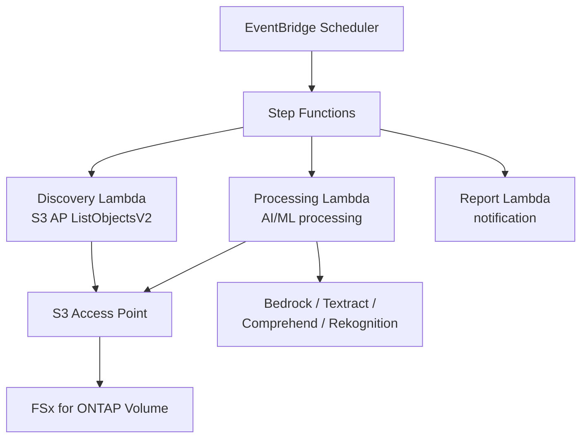

# FSx for ONTAP S3 Access Points — Serverless-Muster

    

🌐 [日本語](README.md) | [English](README.en.md) | [한국어](README.ko.md) | [简体中文](README.zh-CN.md) | [繁體中文](README.zh-TW.md) | [Français](README.fr.md) | [Deutsch](README.de.md) | [Español](README.es.md)

---

> **42 Referenzmuster** für die serverlose Verarbeitung von Enterprise-NAS-Daten auf FSx for ONTAP über S3 Access Points — **keine Datenkopie erforderlich**.
>
> 28 Branchen-UCs + 7 FlexCache/FlexClone + 2 GenAI + SAP + HA-Überwachung + Event-Driven + Edge-Bereitstellung + File Portal UI

---

## Erste Schritte

| Ich möchte... | Anleitung | Dauer |
|---|---|---|
| Eine Demo ohne FSx ausprobieren | [Demo Mode Guide](docs/demo-mode-guide.md) | 5 Min. |
| Dateien über ein Webportal durchsuchen | [File Portal UI (Amplify / Nextcloud)](docs/file-portal-amplify-gen2.en.md) | 10 Min. |
| Ein Muster auf AWS bereitstellen | [Deployment Guide](docs/guides/deployment-guide.md) | 30 Min. |
| Das richtige Muster für meine Workload finden | [Pattern Selection Guide](docs/pattern-selection-guide.md) | 15 Min. |
| Kosten schätzen | [Cost Calculator](docs/cost-calculator.md) | 5 Min. |
| Eine Hands-on-Lab-Umgebung aufbauen | [Hands-on Lab IaC](infrastructure/handson-lab/) | 60 Min. |

---

<details>
<summary><strong>📂 Alle Muster (klicken zum Aufklappen)</strong></summary>

### Branchen-Anwendungsfälle (UC1-UC28 + SAP)

| # | Verzeichnis | Branche | Zusammenfassung |
|---|---|---|---|
| UC1 | [`legal-compliance/`](solutions/industry/legal-compliance/) | Recht | NTFS-ACL-Audit und Compliance-Berichte |
| UC2 | [`financial-idp/`](solutions/industry/financial-idp/) | Finanzen | Rechnungs-OCR und Entitätsextraktion |
| UC3 | [`manufacturing-analytics/`](solutions/industry/manufacturing-analytics/) | Fertigung | IoT-Sensoren und Qualitätsprüfung |
| UC4 | [`media-vfx/`](solutions/industry/media-vfx/) | Medien | VFX-Rendering-Qualitätsprüfung |
| UC5 | [`healthcare-dicom/`](solutions/industry/healthcare-dicom/) | Gesundheit | DICOM-Anonymisierung |
| UC6 | [`semiconductor-eda/`](solutions/industry/semiconductor-eda/) | Halbleiter | GDS/OASIS-Validierung |
| UC7 | [`genomics-pipeline/`](solutions/industry/genomics-pipeline/) | Genomik | FASTQ/VCF-Qualitätsprüfung |
| UC8 | [`energy-seismic/`](solutions/industry/energy-seismic/) | Energie | SEG-Y-Seismikdatenanalyse |
| UC9 | [`autonomous-driving/`](solutions/industry/autonomous-driving/) | Automobil | Video/LiDAR-Vorverarbeitung |
| UC10 | [`construction-bim/`](solutions/industry/construction-bim/) | Bau | BIM-Modellverwaltung |
| UC11 | [`retail-catalog/`](solutions/industry/retail-catalog/) | Einzelhandel | Produktbild-Tagging |
| UC12 | [`logistics-ocr/`](solutions/industry/logistics-ocr/) | Logistik | Versanddokument-OCR |
| UC13 | [`education-research/`](solutions/industry/education-research/) | Bildung | Artikelklassifizierung |
| UC14 | [`insurance-claims/`](solutions/industry/insurance-claims/) | Versicherung | Schadensbewertung |
| UC15 | [`defense-satellite/`](solutions/industry/defense-satellite/) | Verteidigung | Satellitenbildanalyse |
| UC16 | [`government-archives/`](solutions/industry/government-archives/) | Regierung | Öffentliche Archive und Informationsfreiheit |
| UC17 | [`smart-city-geospatial/`](solutions/industry/smart-city-geospatial/) | Smart City | Geodatenanalyse |
| UC18 | [`telecom-network-analytics/`](solutions/industry/telecom-network-analytics/) | Telekommunikation | CDR/Netzwerkprotokollanalyse |
| UC19 | [`adtech-creative-management/`](solutions/industry/adtech-creative-management/) | Werbung | Creative-Asset-Verwaltung |
| UC20 | [`travel-document-processing/`](solutions/industry/travel-document-processing/) | Reise | Buchungsdokumentverarbeitung |
| UC21 | [`agri-food-traceability/`](solutions/industry/agri-food-traceability/) | Landwirtschaft | Rückverfolgbarkeit |
| UC22 | [`transportation-maintenance/`](solutions/industry/transportation-maintenance/) | Transport | Geräteinspektionen |
| UC23 | [`sustainability-esg-reporting/`](solutions/industry/sustainability-esg-reporting/) | ESG | Metrikextraktion |
| UC24 | [`nonprofit-grant-management/`](solutions/industry/nonprofit-grant-management/) | Gemeinnützig | Fördermittelverwaltung |
| UC25 | [`utilities-asset-inspection/`](solutions/industry/utilities-asset-inspection/) | Versorgung | Drohnen/SCADA-Analyse |
| UC26 | [`real-estate-portfolio/`](solutions/industry/real-estate-portfolio/) | Immobilien | Objektbilder und Verträge |
| UC27 | [`hr-document-screening/`](solutions/industry/hr-document-screening/) | HR | Lebenslauf-Screening |
| UC28 | [`chemical-sds-management/`](solutions/industry/chemical-sds-management/) | Chemie | SDB und Labornotizen |
| SAP | [`sap/erp-adjacent/`](solutions/sap/erp-adjacent/) | SAP/ERP | IDoc- und EDI-Verarbeitung |

### FlexCache / FlexClone (FC1-FC7)

| # | Verzeichnis | Muster |
|---|---|---|
| FC1 | [`flexcache/anycast-dr/`](solutions/flexcache/anycast-dr/) | AnyCast / DR-Failover |
| FC2 | [`flexcache/dynamic-render-workflow/`](solutions/flexcache/dynamic-render-workflow/) | Dynamischer FlexCache pro Auftrag |
| FC3 | [`flexcache/rag-enterprise-files/`](solutions/flexcache/rag-enterprise-files/) | Berechtigungsbewusstes RAG |
| FC4 | [`flexcache/automotive-cae/`](solutions/flexcache/automotive-cae/) | CAE-Simulationsanalyse |
| FC5 | [`flexcache/life-sciences-research/`](solutions/flexcache/life-sciences-research/) | Forschungsdatenklassifizierung |
| FC6 | [`flexcache/gaming-build-pipeline/`](solutions/flexcache/gaming-build-pipeline/) | Game-Asset-Qualitätsprüfung |
| FC7 | [`flexcache/devops-cicd/`](solutions/flexcache/devops-cicd/) | FlexClone Dev/Test und CI/CD |

### GenAI / HA / Event-Driven / Edge / File Portal

| Verzeichnis | Zusammenfassung |
|---|---|
| [`genai/kb-selfservice-curation/`](solutions/genai/kb-selfservice-curation/) | Bedrock KB Self-Service-Betrieb |
| [`genai/quick-agentic-workspace/`](solutions/genai/quick-agentic-workspace/) | Agentischer Arbeitsbereich |
| [`ha/lifekeeper-monitoring/`](solutions/ha/lifekeeper-monitoring/) | HA LifeKeeper KI-Überwachung |
| [`event-driven/fpolicy/`](solutions/event-driven/fpolicy/) | FPolicy-ereignisgesteuerte Pipeline |
| [`edge/content-delivery/`](solutions/edge/content-delivery/) | CDN/Edge-Bereitstellung (anbieterneutral) |
| [`amplify-portal/`](solutions/amplify-portal/) | File Portal UI (Amplify Gen2) |
| [`nextcloud-test/`](solutions/nextcloud-test/) | File Portal UI (Nextcloud Docker) |

### Infrastruktur und gemeinsame Module

| Verzeichnis | Zusammenfassung |
|---|---|
| [`shared/`](shared/) | Gemeinsame Python-Module (S3ApHelper, OntapClient, Observability) |
| [`operations/`](operations/) | 6 Betriebsoptimierungsmuster |
| [`infrastructure/handson-lab/`](infrastructure/handson-lab/) | Hands-on Lab IaC (VPC/AD/FSx/EC2/S3AP) |
| [`docs/`](docs/) | Designleitfäden und Benchmarks (40+ Dokumente) |
| [`scripts/`](scripts/) | Bereitstellung, Benchmarks, Hilfsprogramme |
| [`.github/workflows/`](.github/workflows/) | CI/CD (lint → test → security → deploy) |

</details>

---

## Architektur

```
EventBridge Scheduler (periodischer Auslöser)
  └→ Step Functions State Machine
      ├→ Discovery Lambda: Dateien über S3 AP auflisten
      ├→ Map State (parallel): Jede Datei mit AI/ML verarbeiten
      └→ Report Lambda: Ergebnisse generieren → SNS-Benachrichtigung
```

Dies ist der gemeinsame Ablauf aller Muster. Die AI/ML-Dienste (Bedrock, Textract, Comprehend, Rekognition) variieren je nach Anwendungsfall.

<details>
<summary><strong>Mermaid-Diagramm (klicken zum Aufklappen)</strong></summary>



</details>

<details>
<summary><strong>Kategoriespezifische Architekturen (FlexCache, GenAI, HA, Event-Driven, Edge)</strong></summary>

Detaillierte Architekturdiagramme je Kategorie:
- [FlexCache / FlexClone](docs/industry-workload-mapping.md)
- [GenAI (Bedrock KB / Agentic)](solutions/genai/kb-selfservice-curation/docs/architecture.md)
- [HA LifeKeeper Monitoring](solutions/ha/lifekeeper-monitoring/README.md)
- [Event-Driven FPolicy](solutions/event-driven/fpolicy/README.md)
- [Edge / CDN](solutions/edge/content-delivery/docs/architecture.md)
- [File Portal (Amplify Gen2)](solutions/amplify-portal/README.md)

</details>

---

## Wichtige S3 Access Point-Einschränkungen

| Einschränkung | Workaround |
|---|---|
| Keine S3 Event Notifications | EventBridge Scheduler-Polling oder FPolicy |
| Presigned URLs inoffiziell | Funktionieren in der Praxis, aber nicht für Produktion empfohlen |
| 5-GB-Upload-Limit | Multipart Upload |
| Athena-Ergebnisse können nicht auf S3AP geschrieben werden | Ausgabe in Standard-S3-Bucket |
| Nur SSE-FSX | Volume-Level-KMS-Verschlüsselung verwenden |

Details: [S3AP Compatibility Notes](docs/s3ap-compatibility-notes.en.md) | [Compatibility Matrix (von AWS bestätigt)](https://github.com/Yoshiki0705/fsxn-lakehouse-integrations/blob/main/docs/en/compatibility-matrix.md)

---

<details>
<summary><strong>📚 Verwandte Artikel und Repositories</strong></summary>

### Artikelserie

| Thema | Japanisch | Englisch |
|---|---|---|
| Vorstellung der 42 Muster | [Hatena](https://hakobiya.hatenablog.com/entry/fsxn-s3ap-serverless-part1-introduction) | [dev.to](https://dev.to/aws-builders/industry-specific-serverless-automation-patterns-with-fsx-for-ontap-s3-access-points-3e0a) |
| Produktionsarchitektur | [Hatena](https://hakobiya.hatenablog.com/entry/fsxn-s3ap-serverless-part2-production-architecture) | — |
| Betriebsbaseline | [Hatena](https://hakobiya.hatenablog.com/entry/fsxn-s3ap-serverless-part3-operational-baseline) | [dev.to](https://dev.to/aws-builders/production-rollout-vpc-endpoint-auto-detection-and-the-cdk-no-go-fsx-for-ontap-s3-access-3lni) |
| FPolicy Event-Driven | [Hatena](https://hakobiya.hatenablog.com/entry/fsxn-s3ap-serverless-part4-event-driven-fpolicy) | [dev.to](https://dev.to/aws-builders/fpolicy-event-driven-pipeline-multi-account-stacksets-and-cost-optimization-fsx-for-ontap-s3-5bd6) |
| 28 Branchenmuster | [Hatena](https://hakobiya.hatenablog.com/entry/fsxn-s3ap-serverless-part5-field-ready-28-patterns) | [dev.to](https://dev.to/aws-builders/from-serverless-patterns-to-field-ready-reference-architecture-fsx-for-ontap-s3-access-points-dhj) |
| GenAI-Integration | [Hatena](https://hakobiya.hatenablog.com/entry/fsxn-s3ap-serverless-part6-genai-42-patterns) | — |

### Verwandte Repositories

| Repository | Zusammenfassung |
|---|---|
| [Permission-aware-RAG-FSxN-CDK](https://github.com/Yoshiki0705/Permission-aware-RAG-FSxN-CDK-github) | Berechtigungsbewusster RAG-Chatbot (CDK + Next.js + ECS) |
| [fsxn-lakehouse-integrations](https://github.com/Yoshiki0705/fsxn-lakehouse-integrations) | Lakehouse-Integration (Databricks, Snowflake, Athena, Glue, EMR) |
| [vmware-migration-ec2-ontap](https://github.com/Yoshiki0705/vmware-migration-ec2-ontap) | VMware → EC2 + FSx for ONTAP-Migration |

</details>

<details>
<summary><strong>🔧 Entwicklerhandbuch (Tests und Beiträge)</strong></summary>

### Tests

```bash
pytest shared/tests/ -v                    # Unit tests
ruff check . && ruff format --check .      # Python linter
cfn-lint solutions/industry/*/template.yaml # CloudFormation validation
```

### Technologie-Stack

Python 3.12 | CloudFormation + SAM | Lambda (ARM64) | Step Functions | EventBridge | Bedrock / Textract / Comprehend / Rekognition | Secrets Manager | Athena + Glue

### Beitragen

Issues und Pull Requests sind willkommen. Siehe [CONTRIBUTING.md](CONTRIBUTING.md).

</details>

---

## Lizenz

MIT — [LICENSE](LICENSE)

---

🌐 [日本語](README.md) | [English](README.en.md) | [한국어](README.ko.md) | [简体中文](README.zh-CN.md) | [繁體中文](README.zh-TW.md) | [Français](README.fr.md) | [Deutsch](README.de.md) | [Español](README.es.md)
