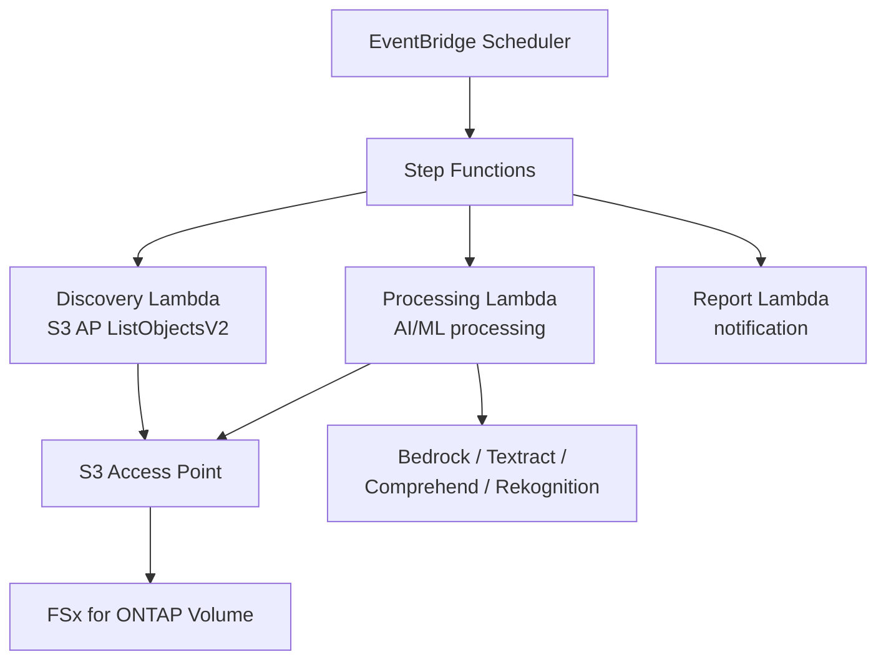

# FSx for ONTAP S3 Access Points — Serverless Patterns

    

🌐 [日本語](README.md) | [English](README.en.md) | [한국어](README.ko.md) | [简体中文](README.zh-CN.md) | [繁體中文](README.zh-TW.md) | [Français](README.fr.md) | [Deutsch](README.de.md) | [Español](README.es.md)

---

> **42 reference patterns** for serverless processing of enterprise NAS data on FSx for ONTAP via S3 Access Points — **no data copying required**.
>
> 28 industry UCs + 10 FlexCache/FlexClone/SnapMirror + 2 GenAI + SAP + HA monitoring + Event-Driven + Edge delivery + File Portal UI

---

## Get Started

| I want to... | Guide | Time |
|---|---|---|
| Try a demo without FSx | [Demo Mode Guide](docs/demo-mode-guide.md) | 5 min |
| Browse files via a web portal | [File Portal UI (Amplify / Nextcloud)](docs/file-portal-amplify-gen2.en.md) | 10 min |
| Understand S3 AP directory design & performance | [Design Considerations](docs/design-considerations-en.md) | 15 min |
| Deploy a pattern to AWS | [Deployment Guide](docs/guides/deployment-guide.md) | 30 min |
| Find the right pattern for my workload | [Pattern Selection Guide](docs/pattern-selection-guide.md) | 15 min |
| Estimate costs | [Cost Calculator](docs/cost-calculator.md) | 5 min |
| Build a hands-on lab environment | [Hands-on Lab IaC](infrastructure/handson-lab/) | 60 min |

---

<details>
<summary><strong>📂 All Patterns (click to expand)</strong></summary>

### Industry Use Cases (UC1-UC28 + SAP)

| # | Directory | Industry | Summary |
|---|---|---|---|
| UC1 | [`legal-compliance/`](solutions/industry/legal-compliance/) | Legal | NTFS ACL audit & compliance reporting |
| UC2 | [`financial-idp/`](solutions/industry/financial-idp/) | Finance | Invoice OCR & entity extraction |
| UC3 | [`manufacturing-analytics/`](solutions/industry/manufacturing-analytics/) | Manufacturing | IoT sensor & quality inspection |
| UC4 | [`media-vfx/`](solutions/industry/media-vfx/) | Media | VFX rendering quality check |
| UC5 | [`healthcare-dicom/`](solutions/industry/healthcare-dicom/) | Healthcare | DICOM anonymization |
| UC6 | [`semiconductor-eda/`](solutions/industry/semiconductor-eda/) | Semiconductor | GDS/OASIS validation |
| UC7 | [`genomics-pipeline/`](solutions/industry/genomics-pipeline/) | Genomics | FASTQ/VCF quality check |
| UC8 | [`energy-seismic/`](solutions/industry/energy-seismic/) | Energy | SEG-Y seismic data analysis |
| UC9 | [`autonomous-driving/`](solutions/industry/autonomous-driving/) | Automotive | Video/LiDAR preprocessing |
| UC10 | [`construction-bim/`](solutions/industry/construction-bim/) | Construction | BIM model management |
| UC11 | [`retail-catalog/`](solutions/industry/retail-catalog/) | Retail | Product image tagging |
| UC12 | [`logistics-ocr/`](solutions/industry/logistics-ocr/) | Logistics | Shipping document OCR |
| UC13 | [`education-research/`](solutions/industry/education-research/) | Education | Paper classification |
| UC14 | [`insurance-claims/`](solutions/industry/insurance-claims/) | Insurance | Damage assessment |
| UC15 | [`defense-satellite/`](solutions/industry/defense-satellite/) | Defense | Satellite image analysis |
| UC16 | [`government-archives/`](solutions/industry/government-archives/) | Government | Public records & FOIA |
| UC17 | [`smart-city-geospatial/`](solutions/industry/smart-city-geospatial/) | Smart City | Geospatial analytics |
| UC18 | [`telecom-network-analytics/`](solutions/industry/telecom-network-analytics/) | Telecom | CDR/network log analysis |
| UC19 | [`adtech-creative-management/`](solutions/industry/adtech-creative-management/) | Advertising | Creative asset management |
| UC20 | [`travel-document-processing/`](solutions/industry/travel-document-processing/) | Travel | Booking document processing |
| UC21 | [`agri-food-traceability/`](solutions/industry/agri-food-traceability/) | Agriculture | Traceability |
| UC22 | [`transportation-maintenance/`](solutions/industry/transportation-maintenance/) | Transport | Equipment inspection |
| UC23 | [`sustainability-esg-reporting/`](solutions/industry/sustainability-esg-reporting/) | ESG | Metrics extraction |
| UC24 | [`nonprofit-grant-management/`](solutions/industry/nonprofit-grant-management/) | Nonprofit | Grant management |
| UC25 | [`utilities-asset-inspection/`](solutions/industry/utilities-asset-inspection/) | Utilities | Drone/SCADA analysis |
| UC26 | [`real-estate-portfolio/`](solutions/industry/real-estate-portfolio/) | Real Estate | Property image & contracts |
| UC27 | [`hr-document-screening/`](solutions/industry/hr-document-screening/) | HR | Resume screening |
| UC28 | [`chemical-sds-management/`](solutions/industry/chemical-sds-management/) | Chemical | SDS & lab notes |
| SAP | [`sap/erp-adjacent/`](solutions/sap/erp-adjacent/) | SAP/ERP | IDoc & EDI processing |

### FlexCache / FlexClone / SnapMirror (FC1-FC10)

| # | Directory | Pattern |
|---|---|---|
| FC1 | [`flexcache/anycast-dr/`](solutions/flexcache/anycast-dr/) | AnyCast / DR failover |
| FC2 | [`flexcache/dynamic-render-workflow/`](solutions/flexcache/dynamic-render-workflow/) | Per-job dynamic FlexCache |
| FC3 | [`flexcache/rag-enterprise-files/`](solutions/flexcache/rag-enterprise-files/) | Permission-aware RAG |
| FC4 | [`flexcache/automotive-cae/`](solutions/flexcache/automotive-cae/) | CAE simulation analysis |
| FC5 | [`flexcache/life-sciences-research/`](solutions/flexcache/life-sciences-research/) | Research data classification |
| FC6 | [`flexcache/gaming-build-pipeline/`](solutions/flexcache/gaming-build-pipeline/) | Game asset quality check |
| FC7 | [`flexcache/devops-cicd/`](solutions/flexcache/devops-cicd/) | FlexClone Dev/Test & CI/CD |
| FC8 | [`flexcache/same-region-s3ap/`](solutions/flexcache/same-region-s3ap/) | S3 AP + FlexCache same-region read acceleration |
| FC9 | [`flexcache/cross-region-s3ap/`](solutions/flexcache/cross-region-s3ap/) | S3 AP + FlexCache cross-region delivery (<3s) |
| FC10 | [`flexcache/snapmirror-cross-region-dr/`](solutions/flexcache/snapmirror-cross-region-dr/) | S3 AP + SnapMirror cross-region DR (RTO ~3 min) |

### GenAI / HA / Event-Driven / Edge / File Portal

| Directory | Summary |
|---|---|
| [`genai/kb-selfservice-curation/`](solutions/genai/kb-selfservice-curation/) | Bedrock KB self-service ops |
| [`genai/quick-agentic-workspace/`](solutions/genai/quick-agentic-workspace/) | Agentic workspace |
| [`ha/lifekeeper-monitoring/`](solutions/ha/lifekeeper-monitoring/) | HA LifeKeeper AI monitoring |
| [`event-driven/fpolicy/`](solutions/event-driven/fpolicy/) | FPolicy event-driven pipeline |
| [`edge/content-delivery/`](solutions/edge/content-delivery/) | CDN/edge delivery (vendor-neutral) |
| [`amplify-portal/`](solutions/amplify-portal/) | File Portal UI (Amplify Gen2) |
| [`nextcloud-test/`](solutions/nextcloud-test/) | File Portal UI (Nextcloud Docker) |

### Infrastructure & Shared

| Directory | Summary |
|---|---|
| [`shared/`](shared/) | Common Python modules (S3ApHelper, OntapClient, Observability) |
| [`operations/`](operations/) | 6 operational optimization patterns |
| [`infrastructure/handson-lab/`](infrastructure/handson-lab/) | Hands-on Lab IaC (VPC/AD/FSx/EC2/S3AP) |
| [`infrastructure/s3ap-data-collection/`](infrastructure/s3ap-data-collection/) | S3 AP data collection infra (design tips embedded template) |
| [`docs/`](docs/) | Design guides & benchmarks (40+ docs) |
| [`scripts/`](scripts/) | Deploy, benchmark, utilities |
| [`.github/workflows/`](.github/workflows/) | CI/CD (lint → test → security → deploy) |

</details>

---

## Architecture

```
EventBridge Scheduler (periodic trigger)
  └→ Step Functions State Machine
      ├→ Discovery Lambda: list files via S3 AP
      ├→ Map State (parallel): process each file with AI/ML
      └→ Report Lambda: generate results → SNS notification
```

This is the common flow shared by all patterns. AI/ML services (Bedrock, Textract, Comprehend, Rekognition) vary by UC.

<details>
<summary><strong>Mermaid diagram (click to expand)</strong></summary>



</details>

<details>
<summary><strong>Category-specific architectures (FlexCache, GenAI, HA, Event-Driven, Edge)</strong></summary>

Detailed architecture diagrams for each category:
- [FlexCache / FlexClone](docs/industry-workload-mapping.md)
- [GenAI (Bedrock KB / Agentic)](solutions/genai/kb-selfservice-curation/docs/architecture.md)
- [HA LifeKeeper Monitoring](solutions/ha/lifekeeper-monitoring/README.md)
- [Event-Driven FPolicy](solutions/event-driven/fpolicy/README.md)
- [Edge / CDN](solutions/edge/content-delivery/docs/architecture.md)
- [File Portal (Amplify Gen2)](solutions/amplify-portal/README.md)

</details>

---

## Key S3 Access Point Constraints

| Constraint | Workaround |
|---|---|
| No S3 Event Notifications | EventBridge Scheduler polling or FPolicy |
| Presigned URLs unofficial | Works in practice but not production-recommended |
| 5GB upload limit | Multipart Upload |
| Cannot write Athena results to S3AP | Output to standard S3 bucket |
| SSE-FSX only | Use volume-level KMS encryption |

Details: [S3AP Compatibility Notes](docs/s3ap-compatibility-notes.en.md) | [Compatibility Matrix (AWS confirmed)](https://github.com/Yoshiki0705/fsxn-lakehouse-integrations/blob/main/docs/en/compatibility-matrix.md)

---

<details>
<summary><strong>📚 Related Articles & Repositories</strong></summary>

### Article Series

| Topic | Japanese | English |
|---|---|---|
| 42 patterns introduction | [Hatena](https://hakobiya.hatenablog.com/entry/fsxn-s3ap-serverless-part1-introduction) | [dev.to](https://dev.to/aws-builders/industry-specific-serverless-automation-patterns-with-fsx-for-ontap-s3-access-points-3e0a) |
| Production architecture | [Hatena](https://hakobiya.hatenablog.com/entry/fsxn-s3ap-serverless-part2-production-architecture) | — |
| Operational baseline | [Hatena](https://hakobiya.hatenablog.com/entry/fsxn-s3ap-serverless-part3-operational-baseline) | [dev.to](https://dev.to/aws-builders/production-rollout-vpc-endpoint-auto-detection-and-the-cdk-no-go-fsx-for-ontap-s3-access-3lni) |
| FPolicy Event-Driven | [Hatena](https://hakobiya.hatenablog.com/entry/fsxn-s3ap-serverless-part4-event-driven-fpolicy) | [dev.to](https://dev.to/aws-builders/fpolicy-event-driven-pipeline-multi-account-stacksets-and-cost-optimization-fsx-for-ontap-s3-5bd6) |
| 28 industry patterns | [Hatena](https://hakobiya.hatenablog.com/entry/fsxn-s3ap-serverless-part5-field-ready-28-patterns) | [dev.to](https://dev.to/aws-builders/from-serverless-patterns-to-field-ready-reference-architecture-fsx-for-ontap-s3-access-points-dhj) |
| GenAI integration | [Hatena](https://hakobiya.hatenablog.com/entry/fsxn-s3ap-serverless-part6-genai-42-patterns) | — |

### Related Repositories

| Repository | Summary |
|---|---|
| [Permission-aware-RAG-FSxN-CDK](https://github.com/Yoshiki0705/Permission-aware-RAG-FSxN-CDK-github) | Permission-aware RAG chatbot (CDK + Next.js + ECS) | <!-- allow:naming -->
| [fsxn-lakehouse-integrations](https://github.com/Yoshiki0705/fsxn-lakehouse-integrations) | Lakehouse integration (Databricks, Snowflake, Athena, Glue, EMR) |
| [vmware-migration-ec2-ontap](https://github.com/Yoshiki0705/vmware-migration-ec2-ontap) | VMware → EC2 + FSx for ONTAP migration |

### AWS Official Resources

| Resource | Summary |
|---|---|
| [AWS Workshop: Amazon Quick + FSx for ONTAP S3 AP](https://catalog.us-east-1.prod.workshops.aws/workshops/9cd82e0b-8348-456b-932a-818b9e5825a1/en-US/08-quicksuite/61-setup) | Hands-on lab for Quick Suite + S3 AP integration |
| [AWS Storage Blog: AI-powered analytics on enterprise file data](https://aws.amazon.com/blogs/storage/enabling-ai-powered-analytics-on-enterprise-file-data-configuring-s3-access-points-for-amazon-fsx-for-netapp-ontap-with-active-directory/) | AD-configured S3 AP + Amazon Quick setup guide |
| [Guidance: Scaling EDA on AWS](https://aws.amazon.com/solutions/guidance/scaling-electronic-design-automation-on-aws/) | Cloud scaling for semiconductor EDA workflows |
| [Semiconductor Design on AWS (Whitepaper)](https://docs.aws.amazon.com/whitepapers/latest/semiconductor-design-on-aws/semiconductor-design-on-aws.pdf) | Reference architecture for semiconductor design workflows |

</details>

<details>
<summary><strong>🔧 For Developers (testing & contributing)</strong></summary>

### Testing

```bash
pytest shared/tests/ -v                    # Unit tests
ruff check . && ruff format --check .      # Python linter
cfn-lint solutions/industry/*/template.yaml # CloudFormation validation
```

### Tech Stack

Python 3.12 | CloudFormation + SAM | Lambda (ARM64) | Step Functions | EventBridge | Bedrock / Textract / Comprehend / Rekognition | Secrets Manager | Athena + Glue

### Contributing

Issues and Pull Requests are welcome. See [CONTRIBUTING.md](CONTRIBUTING.md).

</details>

---

## License

MIT — [LICENSE](LICENSE)

---

🌐 [日本語](README.md) | [English](README.en.md) | [한국어](README.ko.md) | [简体中文](README.zh-CN.md) | [繁體中文](README.zh-TW.md) | [Français](README.fr.md) | [Deutsch](README.de.md) | [Español](README.es.md)
