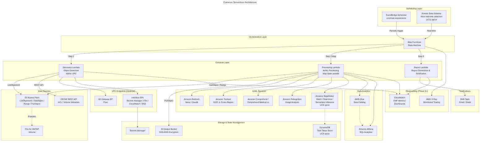
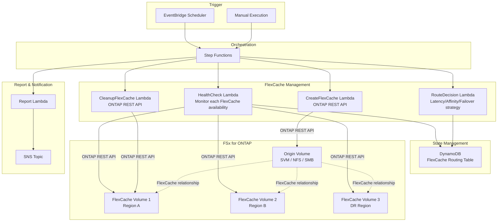
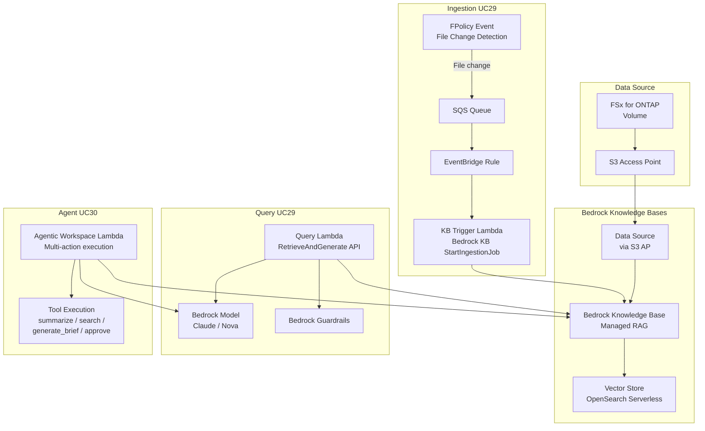
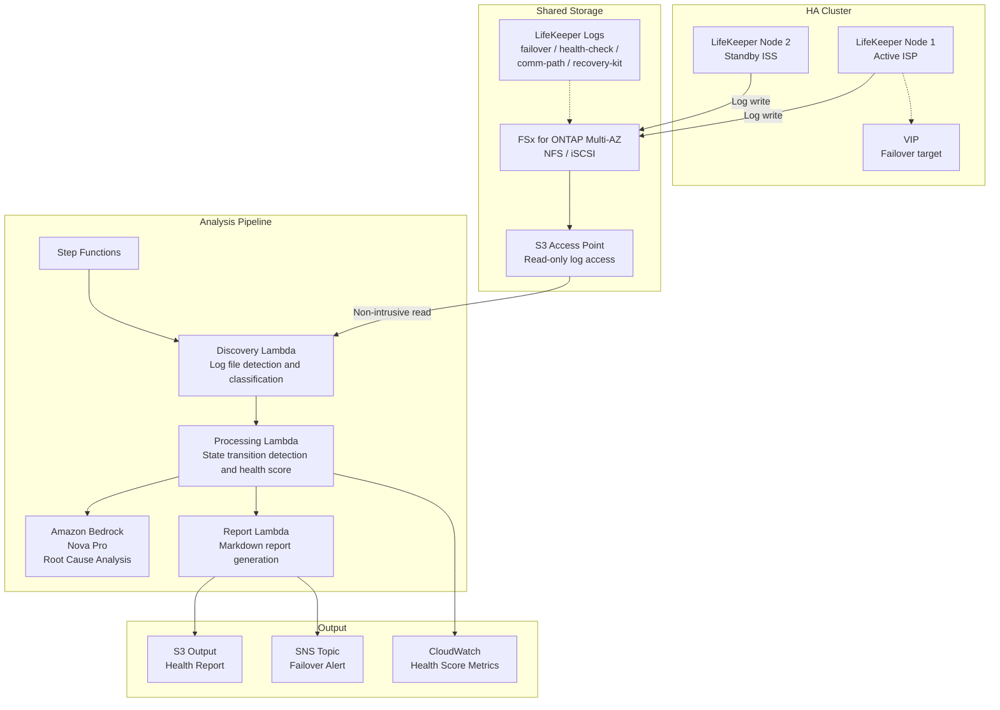
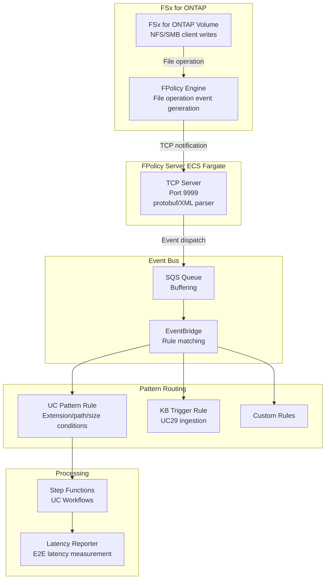
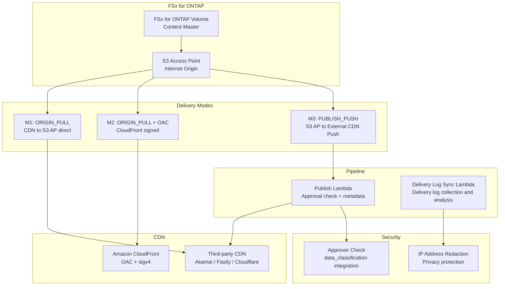

# FSx for ONTAP S3 Access Points Serverless Patterns

   

🌐 **Language / 言語**: [日本語](README.md) | [English](README.en.md) | [한국어](README.ko.md) | [简体中文](README.zh-CN.md) | [繁體中文](README.zh-TW.md) | [Français](README.fr.md) | [Deutsch](README.de.md) | [Español](README.es.md)

---

<details>
<summary><strong>📂 Directory Navigation (click to expand)</strong></summary>

### Industry Use Cases (UC1-UC28 + SAP)

| # | Directory | Industry | Summary |
|---|:---|:---|:---|
| UC1 | [`solutions/industry/legal-compliance/`](solutions/industry/legal-compliance/) | Legal | NTFS ACL audit & compliance reports |
| UC2 | [`solutions/industry/financial-idp/`](solutions/industry/financial-idp/) | Finance | Invoice OCR & entity extraction |
| UC3 | [`solutions/industry/manufacturing-analytics/`](solutions/industry/manufacturing-analytics/) | Manufacturing | IoT sensor & quality inspection |
| UC4 | [`solutions/industry/media-vfx/`](solutions/industry/media-vfx/) | Media | VFX render quality check |
| UC5 | [`solutions/industry/healthcare-dicom/`](solutions/industry/healthcare-dicom/) | Healthcare | DICOM anonymization |
| UC6 | [`solutions/industry/semiconductor-eda/`](solutions/industry/semiconductor-eda/) | Semiconductor | GDS/OASIS validation |
| UC7 | [`solutions/industry/genomics-pipeline/`](solutions/industry/genomics-pipeline/) | Genomics | FASTQ/VCF quality check |
| UC8 | [`solutions/industry/energy-seismic/`](solutions/industry/energy-seismic/) | Energy | SEG-Y seismic data analysis |
| UC9 | [`solutions/industry/autonomous-driving/`](solutions/industry/autonomous-driving/) | Automotive | Video/LiDAR preprocessing |
| UC10 | [`solutions/industry/construction-bim/`](solutions/industry/construction-bim/) | Construction | BIM model management |
| UC11 | [`solutions/industry/retail-catalog/`](solutions/industry/retail-catalog/) | Retail | Product image tagging |
| UC12 | [`solutions/industry/logistics-ocr/`](solutions/industry/logistics-ocr/) | Logistics | Shipping label OCR |
| UC13 | [`solutions/industry/education-research/`](solutions/industry/education-research/) | Education | Paper classification & citation |
| UC14 | [`solutions/industry/insurance-claims/`](solutions/industry/insurance-claims/) | Insurance | Damage assessment |
| UC15 | [`solutions/industry/defense-satellite/`](solutions/industry/defense-satellite/) | Defense | Satellite imagery analysis |
| UC16 | [`solutions/industry/government-archives/`](solutions/industry/government-archives/) | Government | Archives & FOIA |
| UC17 | [`solutions/industry/smart-city-geospatial/`](solutions/industry/smart-city-geospatial/) | Smart City | Geospatial data |
| UC18 | [`solutions/industry/telecom-network-analytics/`](solutions/industry/telecom-network-analytics/) | Telecom | CDR/network log analysis |
| UC19 | [`solutions/industry/adtech-creative-management/`](solutions/industry/adtech-creative-management/) | Advertising | Creative asset management |
| UC20 | [`solutions/industry/travel-document-processing/`](solutions/industry/travel-document-processing/) | Travel | Reservation document processing |
| UC21 | [`solutions/industry/agri-food-traceability/`](solutions/industry/agri-food-traceability/) | Agriculture | Farmland imagery + traceability |
| UC22 | [`solutions/industry/transportation-maintenance/`](solutions/industry/transportation-maintenance/) | Transportation | Equipment inspection |
| UC23 | [`solutions/industry/sustainability-esg-reporting/`](solutions/industry/sustainability-esg-reporting/) | Sustainability | ESG metrics extraction |
| UC24 | [`solutions/industry/nonprofit-grant-management/`](solutions/industry/nonprofit-grant-management/) | Nonprofit | Grant application management |
| UC25 | [`solutions/industry/utilities-asset-inspection/`](solutions/industry/utilities-asset-inspection/) | Power/Utilities | Drone + SCADA analysis |
| UC26 | [`solutions/industry/real-estate-portfolio/`](solutions/industry/real-estate-portfolio/) | Real Estate | Property image + contract extraction |
| UC27 | [`solutions/industry/hr-document-screening/`](solutions/industry/hr-document-screening/) | HR | Resume screening |
| UC28 | [`solutions/industry/chemical-sds-management/`](solutions/industry/chemical-sds-management/) | Chemicals | SDS management + lab notebook |
| UC29 | [`solutions/genai/kb-selfservice-curation/`](solutions/genai/kb-selfservice-curation/) | Cross-industry | Self-service AI knowledge curation (managed Bedrock KB + Windows drag-and-drop) |
| UC30 | [`solutions/genai/quick-agentic-workspace/`](solutions/genai/quick-agentic-workspace/) | Cross-industry | Amazon Quick agentic workspace (Index/Sight/Flows + S3 AP data foundation) |
| SAP | [`solutions/sap/erp-adjacent/`](solutions/sap/erp-adjacent/) | SAP/ERP | IDoc, HULFT, EDI processing |

### FlexCache / FlexClone Patterns (FC1-FC7)

| # | Directory | Pattern |
|---|:---|:---|
| FC1 | [`solutions/flexcache/anycast-dr/`](solutions/flexcache/anycast-dr/) | AnyCast / DR failover |
| FC2 | [`solutions/flexcache/dynamic-render-workflow/`](solutions/flexcache/dynamic-render-workflow/) | Per-job dynamic FlexCache |
| FC3 | [`solutions/flexcache/rag-enterprise-files/`](solutions/flexcache/rag-enterprise-files/) | Permission-aware RAG |
| FC4 | [`solutions/flexcache/automotive-cae/`](solutions/flexcache/automotive-cae/) | CAE simulation analysis |
| FC5 | [`solutions/flexcache/life-sciences-research/`](solutions/flexcache/life-sciences-research/) | Research data classification |
| FC6 | [`solutions/flexcache/gaming-build-pipeline/`](solutions/flexcache/gaming-build-pipeline/) | Game asset quality check |
| FC7 | [`solutions/flexcache/devops-cicd/`](solutions/flexcache/devops-cicd/) | FlexClone Dev/Test refresh & CI/CD |

### Infrastructure & Shared

| Directory | Contents |
|:---|:---|
| [`shared/`](shared/) | Common Python modules (S3ApHelper, OntapClient, observability) |
| [`solutions/event-driven/fpolicy/`](solutions/event-driven/fpolicy/) | FPolicy event-driven pipeline |
| [`solutions/edge/content-delivery/`](solutions/edge/content-delivery/) | CDN/edge delivery pattern (vendor-neutral; CloudFront/third-party, [CDN comparison](docs/cdn-comparison.en.md)) |
| [`docs/`](docs/) | Design guides, benchmarks, Partner assets (40+ documents) |
| [`scripts/`](scripts/) | Deploy, benchmark, utilities |
| [`tests/`](tests/) | E2E & load tests |
| [`security/`](security/) | cfn-guard rules |
| [`.github/workflows/`](.github/workflows/) | CI/CD (lint → test → security → deploy) |

### Quick Start

| Goal | Link |
|:---|:---|
| 🚀 Demo mode (no FSx required) | [`docs/demo-mode-guide.en.md`](docs/demo-mode-guide.en.md) |
| 💰 Cost estimation | [`docs/cost-calculator.md`](docs/cost-calculator.md) |
| 🔧 Customization | [`docs/customization-guide.md`](docs/customization-guide.md) |
| 📊 Benchmark results | [`docs/s3ap-benchmark-results.md`](docs/s3ap-benchmark-results.md) |
| 🤝 Partner/SI | [`docs/partner-si-one-pager.en.md`](docs/partner-si-one-pager.en.md) |
| 🏛️ Governance | [`docs/governance-checklist.md`](docs/governance-checklist.md) |
| ⚡ Local testing | [`docs/local-testing-quick-start.md`](docs/local-testing-quick-start.md) |
| 🪣 For S3 bucket users | [`docs/s3-bucket-user-guide.en.md`](docs/s3-bucket-user-guide.en.md) |
| 🔌 For ONTAP admins | [`docs/ontap-integration-notes.en.md`](docs/ontap-integration-notes.en.md) |
| 🎯 Pattern selection guide | [`docs/pattern-selection-guide.en.md`](docs/pattern-selection-guide.en.md) |

</details>

---

## Current Status

This repository now contains **28 industry use cases** + **event-driven FPolicy pattern** + **7 FlexCache/FlexClone patterns** + **content edge delivery pattern** as a serverless pattern library for Amazon FSx for ONTAP S3 Access Points.

The original 5 patterns (Phase 1) have been expanded across Phases 2–13. Phase 10 introduced the shared FPolicy event-ingestion pipeline, Phase 11 wired dispatch across all 17 UCs, Phase 12 hardened the pipeline with Persistent Store replay validation, SLO observability, capacity guardrails, and secrets rotation, and Phase 13 added FlexClone/FlexCache serverless automation.

A collection of industry-specific serverless automation patterns leveraging S3 Access Points for Amazon FSx for ONTAP.

> **Serverless boundary**: Compute (Lambda, Step Functions, EventBridge, Bedrock) is serverless; storage (FSx for ONTAP) is fully managed but has provisioned capacity. For greenfield object-native workloads, prefer standard S3 + serverless-native architecture. This library provides a **serverless processing pattern over existing enterprise file data**.

> **Purpose of this repository**: This is a "reference implementation for learning design decisions." Some use cases have been E2E verified in an AWS environment, while others have undergone CloudFormation deployment, shared Discovery Lambda, and operational verification of key components. It is designed for gradual adoption from PoC to production, demonstrating design decisions for cost optimization, security, and error handling through concrete code.

**Tests**: 1,499+ unit/property tests | 126 test files | cfn-lint + ruff validation

## Choose Your Path

### 30-minute path: understand the pattern
- Review Current Status and [architecture diagram](#architecture)
- Compare POLLING / EVENT_DRIVEN / HYBRID in the [Trigger Mode Decision Guide](docs/trigger-mode-decision-guide.md)
- Understand the [S3AP dual-layer authorization model](docs/s3ap-authorization-model.md)

### 60-minute path: run a PoC
- Deploy one UC template (e.g., [UC1 legal-compliance](solutions/industry/legal-compliance/README.md))
- Configure an S3 Access Point and verify ListObjectsV2 / GetObject
- Review CloudWatch metrics for execution results

### 1-day path: partner/customer workshop
- Deploy the FPolicy pipeline ([solutions/event-driven/fpolicy/](solutions/event-driven/fpolicy/README.md))
- Validate NFS/SMB file event E2E flow
- Test failure and replay behavior
- Review security and operations with the [Partner/SI Delivery Checklist](docs/partner-si-delivery-checklist.md)

## Related Articles

This repository provides the implementation examples for the architecture described in the following article:

- **FSx for ONTAP S3 Access Points as a Serverless Automation Boundary — AI Data Pipelines, Volume-Level SnapMirror DR, and Capacity Guardrails**
  https://dev.to/yoshikifujiwara/fsx-for-ontap-s3-access-points-as-a-serverless-automation-boundary-ai-data-pipelines-ili

The article explains the architectural design philosophy and trade-offs, while this repository provides concrete, reusable implementation patterns.

## Related Repositories (Same Author)

| Repository | Summary | Relationship |
|-----------|---------|--------------|
| [Permission-aware-RAG-FSxN-CDK](https://github.com/Yoshiki0705/Permission-aware-RAG-FSxN-CDK-github) | Permission-aware RAG chatbot with FSx for ONTAP + Bedrock (CDK v2, Next.js, ECS) | Full implementation of this repo's FC3 (GenAI RAG) pattern with Web UI | <!-- allow:naming -->
| [fsxn-lakehouse-integrations](https://github.com/Yoshiki0705/fsxn-lakehouse-integrations) | FSx for ONTAP S3 AP × Lakehouse platform integrations (Databricks, Snowflake, Athena, Glue, EMR) | S3 AP compatibility matrix, platform-specific validation, DataSync patterns |

## FSx for ONTAP S3 Access Points — Constraints & Validated Patterns

S3 Access Points for FSx for ONTAP provide an S3 access boundary to file data — not a full replacement for S3 bucket semantics. This repository uses POLLING by default, with FPolicy-based EVENT_DRIVEN and HYBRID options available.

📋 **[FSx for ONTAP S3 AP Compatibility Matrix](https://github.com/Yoshiki0705/fsxn-lakehouse-integrations/blob/main/docs/en/compatibility-matrix.md)** — Confirmed with AWS Support (May 2026)

| Constraint | Impact | Workaround |
|-----------|--------|-----------|
| No conditional writes (If-None-Match) | Delta Lake/Iceberg/Hudi transactional writes blocked | Read-only analytics or DataSync → S3 for write workloads |
| No S3 Event Notifications | Snowpipe auto-ingest, Auto Loader file notification mode unavailable | FPolicy → Lambda, scheduled polling, or Snowpipe REST API |
| No SnapMirror S3 | Cannot replicate ONTAP S3 bucket to AWS S3 | Use DataSync (NFS → S3) as validated sync mechanism |
| ListObjectsV2 higher latency | 30-80x slower than native S3 for small directories | Pre-generate file lists, use larger file sizes, or cache results |
| SSE-FSX encryption only | SSE-S3, SSE-KMS, SSE-C not supported | Use default SSE-FSX (transparent, AWS KMS managed) |
| No Object Versioning | S3 versioning not available | Use ONTAP Snapshot for point-in-time recovery |
| Presigned URLs: Not officially supported | Works in practice but not guaranteed | Use for non-critical paths only; prefer IAM-based access |
| ONTAP 9.17.1+ required | Minimum version for S3 Access Points | Verify FSx file system ONTAP version before deployment |

For the full matrix including platform-specific compatibility (Athena, Glue, EMR, Databricks, Snowflake, Bedrock), see the [complete document](https://github.com/Yoshiki0705/fsxn-lakehouse-integrations/blob/main/docs/en/compatibility-matrix.md).

Local details: [S3AP Compatibility Notes](docs/s3ap-compatibility-notes.md)

## Overview

This repository provides **28 industry-specific patterns** for serverlessly processing enterprise data stored in FSx for ONTAP via **S3 Access Points** (Phase 1: UC1–UC5, Phase 2: UC6–UC14, Phase 7: UC15–UC17, Phase 14: UC18–UC19, Phase 15: UC20–UC22, Phase 16: UC23–UC28), plus an **event-driven FPolicy pattern**, **7 FlexCache/FlexClone patterns** (Phase 13: FC1–FC6, Phase 15: FC7), and a **content edge delivery pattern** (CDN/edge, vendor-neutral).

> Hereafter, FSx for ONTAP S3 Access Points will be abbreviated as **S3 AP**.

Each use case is self-contained in an independent CloudFormation template, with shared modules (ONTAP REST API client, FSx helper, S3 AP helper) placed in `shared/` for reuse.

### Key Features

- **Polling-based architecture**: Since S3 AP does not support `GetBucketNotificationConfiguration`, periodic execution via EventBridge Scheduler + Step Functions
- **Event-driven path (Phase 10)**: NFSv3 file event detection via ONTAP FPolicy → ECS Fargate → SQS → EventBridge ([Quickstart](docs/event-driven/README.md))
- **SMB (CIFS) support verified**: FPolicy E2E tested with both NFSv3 and SMB protocols — AD-joined SVM required for SMB ([SMB Setup](docs/event-driven/README.md#smb-cifs-テスト手順))
- **Shared module separation**: OntapClient / FsxHelper / S3ApHelper reused across all use cases
- **CloudFormation / SAM Transform based**: Each use case is self-contained in an independent CloudFormation template (using SAM Transform)
- **Security first**: TLS verification enabled by default, least-privilege IAM, KMS encryption
- **Cost optimization**: High-cost always-on resources (Interface VPC Endpoints, etc.) made optional

### Design Guides & Operational Documentation

| Document | Description |
|----------|-------------|
| [S3AP Dual-Layer Authorization Model](docs/s3ap-authorization-model.md) | AWS IAM + file system permissions dual-layer authorization design |
| [Deployment Profiles](docs/deployment-profiles.md) | PoC / Production / Compliance-sensitive — 3 profile definitions |
| [Trigger Mode Decision Guide](docs/trigger-mode-decision-guide.md) | POLLING / EVENT_DRIVEN / HYBRID selection criteria |
| [Enterprise Workload Examples](docs/enterprise-workload-examples.md) | SAP, EDI, audit, batch output enterprise use cases |
| [S3AP Performance Considerations](docs/s3ap-performance-considerations.md) | Throughput design, Lambda sizing, concurrency calculation |
| [S3AP Benchmark Results](docs/s3ap-benchmark-results.md) | Measured: PutObject/GetObject/Range GET/ListObjectsV2 latency |
| [Native S3AP Notifications Evidence](docs/aws-feature-requests/native-s3ap-notifications-evidence.md) | Why native event notifications matter — FPolicy workaround analysis |
| [Partner/SI Delivery Checklist](docs/partner-si-delivery-checklist.md) | Partner/SI proposal, design, and delivery checklist |
| [Governance Checklist](docs/governance-checklist.md) | Governance checklist for regulated/public sector/healthcare workloads |
| [Production Readiness](docs/production-readiness.md) | 4-level Maturity Model from PoC to production |
| [Customer Discovery Template](docs/customer-discovery-template.md) | Customer interview template for applicability assessment |
| [Fargate vs EC2 Decision Matrix](docs/fargate-vs-ec2-fpolicy-decision.md) | FPolicy server compute selection guide |
| [Persistent Store Sizing Calculator](docs/persistent-store-sizing-calculator.md) | Persistent Store volume sizing calculation |
| [Well-Architected Mapping](docs/well-architected-mapping.md) | AWS Well-Architected 6-pillar mapping |
| [Public Sector Adoption Roadmap](docs/public-sector-adoption-roadmap.md) | 3-phase adoption roadmap for government, education, healthcare |
| [Workshop Guide](docs/workshop-guide.md) | 1-day partner workshop guide |

### S3 Access Points — Authorization Model Overview

S3 Access Points for FSx for ONTAP uses a **dual-layer authorization** model. For an S3 API request to succeed, **both** of the following must permit the request:

1. **AWS-side authorization**: IAM identity-based policy, S3 AP resource policy, VPC endpoint policy, SCP
2. **File-system-side authorization**: UNIX/Windows user permissions associated with the access point's file system identity

> The S3 API does not remove file-system semantics. See [S3AP Dual-Layer Authorization Model](docs/s3ap-authorization-model.md) for details.

## Architecture



> The diagram shows the full architecture across all Phases (Phase 1–5). SageMaker, Kinesis, and DynamoDB are controlled via CloudFormation Conditions (opt-in) and incur no additional cost unless enabled. For PoC / demo purposes, a Lambda configuration outside the VPC can also be selected. See "Lambda Placement Selection Guidelines" below for details.

### Workflow Overview

```
EventBridge Scheduler (Periodic Execution)
  └─→ Step Functions State Machine
       ├─→ Discovery Lambda: Retrieve object list from S3 AP → Generate Manifest
       ├─→ Map State (Parallel Processing): Process each object with AI/ML services
       └─→ Report/Notification: Generate result report → SNS notification
```

### Category-Specific Architectures

The above shows the common serverless processing flow. Each category has unique architectural elements.

<details>
<summary><strong>🏭 FlexCache / FlexClone Patterns (FC1-FC7)</strong></summary>



**Patterns**: anycast-dr (Multi-region DR), dynamic-render-workflow (On-demand create/delete), rag-enterprise-files (ACL-aware RAG), automotive-cae, life-sciences-research, gaming-build-pipeline, devops-cicd

</details>

<details>
<summary><strong>🤖 GenAI Patterns (UC29-UC30)</strong></summary>



**Patterns**: kb-selfservice-curation (Bedrock KB self-service + FPolicy integration), quick-agentic-workspace (Multi-action agent)

</details>

<details>
<summary><strong>🛡️ HA LifeKeeper Monitoring Pattern</strong></summary>



**Design Principles**: Non-intrusive (no monitoring agent on HA nodes), Human-in-the-loop (AI analysis is advisory), does not interfere with LifeKeeper's own failover decisions

</details>

<details>
<summary><strong>⚡ Event-Driven Pattern (FPolicy Pipeline)</strong></summary>



**TriggerMode Integration**: Each UC pattern supports `TriggerMode=POLLING|EVENT_DRIVEN|HYBRID`. HYBRID runs both periodic polling and event-driven in parallel with idempotency checks to deduplicate processing.

</details>

<details>
<summary><strong>🌐 Edge / CDN Delivery Pattern</strong></summary>



**Vendor-neutral design**: Works with CloudFront, Akamai, Fastly, or Cloudflare. See [CDN Comparison Guide](docs/cdn-comparison.md) / [CDN Origin Verification Checklist](docs/cdn-origin-verification-checklist.en.md).

</details>

## Use Case List

### Phase 1 (UC1–UC5)

| # | Directory | Industry | Pattern | AI/ML Services Used | ap-northeast-1 Verification Status |
|---|-----------|----------|---------|---------------------|-----------------------------------|
| UC1 | [`solutions/industry/legal-compliance/`](solutions/industry/legal-compliance/README.en.md) | Legal & Compliance | File server audit & data governance | Athena, Bedrock | ✅ E2E Success |
| UC2 | [`solutions/industry/financial-idp/`](solutions/industry/financial-idp/README.en.md) | Finance & Insurance | Contract & invoice automated processing (IDP) | Textract ⚠️, Comprehend, Bedrock | ⚠️ Not in Tokyo (use supported region) |
| UC3 | [`solutions/industry/manufacturing-analytics/`](solutions/industry/manufacturing-analytics/README.en.md) | Manufacturing | IoT sensor log & quality inspection image analysis | Athena, Rekognition | ✅ E2E Success |
| UC4 | [`solutions/industry/media-vfx/`](solutions/industry/media-vfx/README.en.md) | Media | VFX rendering pipeline | Rekognition, Deadline Cloud | ⚠️ Deadline Cloud Setup Required |
| UC5 | [`solutions/industry/healthcare-dicom/`](solutions/industry/healthcare-dicom/README.en.md) | Healthcare | DICOM image auto-classification & anonymization | Rekognition, Comprehend Medical ⚠️ | ⚠️ Not in Tokyo (use supported region) |

### Phase 2 (UC6–UC14)

| # | Directory | Industry | Pattern | AI/ML Services Used | ap-northeast-1 Verification Status |
|---|-----------|----------|---------|---------------------|-----------------------------------|
| UC6 | [`solutions/industry/semiconductor-eda/`](solutions/industry/semiconductor-eda/README.en.md) | Semiconductor / EDA | GDS/OASIS validation, metadata extraction, DRC aggregation | Athena, Bedrock | ✅ Tests Passed |
| UC7 | [`solutions/industry/genomics-pipeline/`](solutions/industry/genomics-pipeline/README.en.md) | Genomics | FASTQ/VCF quality check, variant call aggregation | Athena, Bedrock, Comprehend Medical ⚠️ | ⚠️ Cross-Region (us-east-1) |
| UC8 | [`solutions/industry/energy-seismic/`](solutions/industry/energy-seismic/README.en.md) | Energy | SEG-Y metadata extraction, well log anomaly detection | Athena, Bedrock, Rekognition | ✅ Tests Passed |
| UC9 | [`solutions/industry/autonomous-driving/`](solutions/industry/autonomous-driving/README.en.md) | Autonomous Driving / ADAS | Video/LiDAR preprocessing, QC, annotation | Rekognition, Bedrock, SageMaker | ✅ Tests Passed |
| UC10 | [`solutions/industry/construction-bim/`](solutions/industry/construction-bim/README.en.md) | Construction / AEC | BIM version management, drawing OCR, safety compliance | Textract ⚠️, Bedrock, Rekognition | ⚠️ Cross-Region (us-east-1) |
| UC11 | [`solutions/industry/retail-catalog/`](solutions/industry/retail-catalog/README.en.md) | Retail / E-Commerce | Product image tagging, catalog metadata generation | Rekognition, Bedrock | ✅ Tests Passed |
| UC12 | [`solutions/industry/logistics-ocr/`](solutions/industry/logistics-ocr/README.en.md) | Logistics | Shipping slip OCR, warehouse inventory image analysis | Textract ⚠️, Rekognition, Bedrock | ⚠️ Cross-Region (us-east-1) |
| UC13 | [`solutions/industry/education-research/`](solutions/industry/education-research/README.en.md) | Education / Research | Paper PDF classification, citation network analysis | Textract ⚠️, Comprehend, Bedrock | ⚠️ Cross-Region (us-east-1) |
| UC14 | [`solutions/industry/insurance-claims/`](solutions/industry/insurance-claims/README.en.md) | Insurance | Accident photo damage assessment, estimate OCR, claims report | Rekognition, Textract ⚠️, Bedrock | ⚠️ Cross-Region (us-east-1) |

> **Region constraints**: Amazon Textract and Amazon Comprehend Medical are not available in ap-northeast-1 (Tokyo). Phase 2 UCs (UC7, UC10, UC12, UC13, UC14) use Cross_Region_Client to route API calls to us-east-1. Rekognition, Comprehend, Bedrock, and Athena are available in ap-northeast-1.
> 
> Reference: [Textract Supported Regions](https://docs.aws.amazon.com/general/latest/gr/textract.html) | [Comprehend Medical Supported Regions](https://docs.aws.amazon.com/general/latest/gr/comprehend-med.html) | [Cross-Region Setup Guide](docs/cross-region-guide.md)

### Phase 7 (UC15–UC17) Public Sector Expansion

| # | Directory | Industry | Pattern | AI/ML services | ap-northeast-1 status |
|---|-----------|----------|---------|----------------|----------------------|
| UC15 | [`solutions/industry/defense-satellite/`](solutions/industry/defense-satellite/README.en.md) | Defense/Space | Satellite imagery analytics (object detection, change detection, alerts) | Rekognition, SageMaker (optional), Bedrock | ✅ Code + tests complete, AWS verified |
| UC16 | [`solutions/industry/government-archives/`](solutions/industry/government-archives/README.en.md) | Government | Public records / FOIA (OCR, classification, redaction, 20-day deadline tracking) | Textract ⚠️, Comprehend, Bedrock, OpenSearch (optional) | ✅ Code + tests complete, AWS verified |
| UC17 | [`solutions/industry/smart-city-geospatial/`](solutions/industry/smart-city-geospatial/README.en.md) | Smart City | Geospatial analytics (CRS normalization, land use, risk mapping, planning report) | Rekognition, SageMaker (optional), Bedrock (Nova Lite) | ✅ Code + tests complete, AWS verified |

> **Public Sector compliance**: UC15 targets DoD CC SRG / CSfC / FedRAMP High (on GovCloud migration), UC16 targets NARA / FOIA Section 552 / Section 508, UC17 targets INSPIRE Directive / OGC standards.

### Phase 13: FlexCache × S3 AP × Serverless Extension Patterns

| # | Directory | Pattern | Description | Status |
|---|-----------|---------|-------------|--------|
| FC1 | [`solutions/flexcache/anycast-dr/`](solutions/flexcache/anycast-dr/README.md) | FlexCache AnyCast / DR | Health check, route decision, failover simulation | ✅ Code + docs complete |
| FC2 | [`solutions/flexcache/dynamic-render-workflow/`](solutions/flexcache/dynamic-render-workflow/README.md) | Dynamic FlexCache Render/EDA | Per-job FlexCache create/delete workflow | ✅ Code + tests complete |
| FC3 | [`solutions/flexcache/rag-enterprise-files/`](solutions/flexcache/rag-enterprise-files/README.md) | GenAI RAG over Enterprise Files | Permission-aware RAG (via S3 AP, no data copy) | ✅ Design docs complete |
| FC4 | [`solutions/flexcache/automotive-cae/`](solutions/flexcache/automotive-cae/README.md) | Automotive CAE Analytics | CAE simulation result auto-analysis | ✅ Design docs complete |

#### FlexCache / S3 Access Points / Serverless Combined Value

- **Dynamic FlexCache Automation**: Create/delete FlexCache per job for cost optimization
- **AnyCast / DR Design Patterns**: Read continuity during geo-distribution/DR via Route 53/Lambda
- **Industry Workload Mapping**: 7 configuration patterns mapped to industries

#### Related Documentation

| Document | Content |
|----------|---------|
| [Industry Workload Mapping](docs/industry-workload-mapping.md) | FlexCache × S3 AP × Serverless industry patterns |
| [Support Matrix](docs/support-matrix-fsx-ontap-flexcache-s3ap.md) | Feature availability by platform (FSx/On-prem/CVO/Lab) |
| [FlexCache AnyCast Design Guide](docs/flexcache-anycast-design-guide.md) | AnyCast alternative pattern design |
| [Dynamic FlexCache Workflow Guide](docs/dynamic-flexcache-workflow-guide.md) | Per-job FlexCache design & implementation |
| [FlexCache PoC Checklist](docs/flexcache-poc-checklist.md) | Common PoC checklist items |

> **Important**: Whether S3 Access Points can be attached to FlexCache volumes depends on the ONTAP version and FSx for ONTAP service specifications. Always verify in your actual environment during PoC.


### Documentation (Architecture & Demo Guides)

Detailed architecture diagrams and demo guides for each use case are available in the `docs/` folder in 8 languages.

| # | Use Case | Architecture | Demo Guide |
|---|----------|-------------|-----------|
| UC1 | Legal / Compliance | [📐 Architecture](solutions/industry/legal-compliance/docs/architecture.en.md) | [🎬 Demo Guide](solutions/industry/legal-compliance/docs/demo-guide.en.md) |
| UC2 | Finance / Insurance (IDP) | [📐 Architecture](solutions/industry/financial-idp/docs/architecture.en.md) | [🎬 Demo Guide](solutions/industry/financial-idp/docs/demo-guide.en.md) |
| UC3 | Manufacturing | [📐 Architecture](solutions/industry/manufacturing-analytics/docs/architecture.en.md) | [🎬 Demo Guide](solutions/industry/manufacturing-analytics/docs/demo-guide.en.md) |
| UC4 | Media (VFX) | [📐 Architecture](solutions/industry/media-vfx/docs/architecture.en.md) | [🎬 Demo Guide](solutions/industry/media-vfx/docs/demo-guide.en.md) |
| UC5 | Healthcare (DICOM) | [📐 Architecture](solutions/industry/healthcare-dicom/docs/architecture.en.md) | [🎬 Demo Guide](solutions/industry/healthcare-dicom/docs/demo-guide.en.md) |
| UC6 | Semiconductor / EDA | [📐 Architecture](solutions/industry/semiconductor-eda/docs/architecture.en.md) | [🎬 Demo Guide](solutions/industry/semiconductor-eda/docs/demo-guide.en.md) |
| UC7 | Genomics | [📐 Architecture](solutions/industry/genomics-pipeline/docs/architecture.en.md) | [🎬 Demo Guide](solutions/industry/genomics-pipeline/docs/demo-guide.en.md) |
| UC8 | Energy | [📐 Architecture](solutions/industry/energy-seismic/docs/architecture.en.md) | [🎬 Demo Guide](solutions/industry/energy-seismic/docs/demo-guide.en.md) |
| UC9 | Autonomous Driving / ADAS | [📐 Architecture](solutions/industry/autonomous-driving/docs/architecture.en.md) | [🎬 Demo Guide](solutions/industry/autonomous-driving/docs/demo-guide.en.md) |
| UC10 | Construction / AEC (BIM) | [📐 Architecture](solutions/industry/construction-bim/docs/architecture.en.md) | [🎬 Demo Guide](solutions/industry/construction-bim/docs/demo-guide.en.md) |
| UC11 | Retail / E-Commerce | [📐 Architecture](solutions/industry/retail-catalog/docs/architecture.en.md) | [🎬 Demo Guide](solutions/industry/retail-catalog/docs/demo-guide.en.md) |
| UC12 | Logistics | [📐 Architecture](solutions/industry/logistics-ocr/docs/architecture.en.md) | [🎬 Demo Guide](solutions/industry/logistics-ocr/docs/demo-guide.en.md) |
| UC13 | Education / Research | [📐 Architecture](solutions/industry/education-research/docs/architecture.en.md) | [🎬 Demo Guide](solutions/industry/education-research/docs/demo-guide.en.md) |
| UC14 | Insurance | [📐 Architecture](solutions/industry/insurance-claims/docs/architecture.en.md) | [🎬 Demo Guide](solutions/industry/insurance-claims/docs/demo-guide.en.md) |
| UC15 | Defense/Space (Satellite) | [📐 Architecture](solutions/industry/defense-satellite/docs/architecture.md) | [🎬 Demo Script](solutions/industry/defense-satellite/docs/demo-guide.md) |
| UC16 | Government (FOIA / Archives) | [📐 Architecture](solutions/industry/government-archives/docs/architecture.md) | [🎬 Demo Script](solutions/industry/government-archives/docs/demo-guide.md) |
| UC17 | Smart City | [📐 Architecture](solutions/industry/smart-city-geospatial/docs/architecture.md) | [🎬 Demo Script](solutions/industry/smart-city-geospatial/docs/demo-guide.md) |
| UC18 | Telecom (CDR/Network) | [📐 Architecture](solutions/industry/telecom-network-analytics/docs/architecture.md) | [🎬 Demo Guide](solutions/industry/telecom-network-analytics/docs/demo-guide.md) |
| UC19 | Advertising (Creative) | [📐 Architecture](solutions/industry/adtech-creative-management/docs/architecture.md) | [🎬 Demo Guide](solutions/industry/adtech-creative-management/docs/demo-guide.md) |
| UC20 | Travel (Reservations) | [📐 Architecture](solutions/industry/travel-document-processing/docs/architecture.md) | [🎬 Demo Guide](solutions/industry/travel-document-processing/docs/demo-guide.md) |
| UC21 | Agriculture (Traceability) | [📐 Architecture](solutions/industry/agri-food-traceability/docs/architecture.md) | [🎬 Demo Guide](solutions/industry/agri-food-traceability/docs/demo-guide.md) |
| UC22 | Transportation (Maintenance) | [📐 Architecture](solutions/industry/transportation-maintenance/docs/architecture.md) | [🎬 Demo Guide](solutions/industry/transportation-maintenance/docs/demo-guide.md) |
| UC23 | Sustainability (ESG) | [📐 Architecture](solutions/industry/sustainability-esg-reporting/docs/architecture.md) | [🎬 Demo Guide](solutions/industry/sustainability-esg-reporting/docs/demo-guide.md) |
| UC24 | Nonprofit (Grants) | [📐 Architecture](solutions/industry/nonprofit-grant-management/docs/architecture.md) | [🎬 Demo Guide](solutions/industry/nonprofit-grant-management/docs/demo-guide.md) |
| UC25 | Utilities (Inspection) | [📐 Architecture](solutions/industry/utilities-asset-inspection/docs/architecture.md) | [🎬 Demo Guide](solutions/industry/utilities-asset-inspection/docs/demo-guide.md) |
| UC26 | Real Estate (Portfolio) | [📐 Architecture](solutions/industry/real-estate-portfolio/docs/architecture.md) | [🎬 Demo Guide](solutions/industry/real-estate-portfolio/docs/demo-guide.md) |
| UC27 | HR (Resume Screening) | [📐 Architecture](solutions/industry/hr-document-screening/docs/architecture.md) | [🎬 Demo Guide](solutions/industry/hr-document-screening/docs/demo-guide.md) |
| UC28 | Chemical (SDS) | [📐 Architecture](solutions/industry/chemical-sds-management/docs/architecture.md) | [🎬 Demo Guide](solutions/industry/chemical-sds-management/docs/demo-guide.md) |
| UC29 | Cross-industry (Self-service KB) | [📐 Architecture](solutions/genai/kb-selfservice-curation/docs/architecture.md) | [🎬 Demo Guide](solutions/genai/kb-selfservice-curation/docs/demo-guide.md) |
| UC30 | Cross-industry (Amazon Quick) | [📐 Architecture](solutions/genai/quick-agentic-workspace/docs/architecture.md) | [🎬 Demo Guide](solutions/genai/quick-agentic-workspace/docs/demo-guide.md) |
| — | Content Edge Delivery (CDN) | [📐 Architecture](solutions/edge/content-delivery/docs/architecture.md) | [🎬 Demo Guide](solutions/edge/content-delivery/docs/demo-guide.md) |

> All documents are available in 8 languages (日本語・English・한국어・简体中文・繁體中文・Français・Deutsch・Español). Use the Language Switcher at the top of each document to switch languages.

## UI/UX Screenshots (End Users / Staff / Personnel Views)

UI/UX screens that **end users, staff, and personnel actually see
during their daily work** are featured in each UC's README and demo-guide.
Technical views such as Step Functions workflow graphs are consolidated
in phase verification documents (`docs/verification-results-phase*.md`).

The same approach is applied across all industries, not just Public Sector
(UC15/16/17):

- **Operational staff / personnel view**: verifying outputs in the S3 Console,
  reading Bedrock reports, receiving SNS notifications, searching DynamoDB
  histories, etc.
- **Technical views excluded**: CloudFormation stack events, Lambda logs,
  Step Functions graphs (except those for workflow visualization) are
  kept in `verification-results-*.md`

| UC | Industry | Screenshot Count | Main Content | Location |
|----|----------|------------------|--------------|----------|
| UC1 | Legal & Compliance | 1 | Step Functions graph (workflow visualization for compliance auditors) | [`solutions/industry/legal-compliance/docs/demo-guide.en.md`](solutions/industry/legal-compliance/docs/demo-guide.en.md) |
| UC2 | Financial IDP | 1 | Step Functions graph (workflow visualization for invoice processing staff) | [`solutions/industry/financial-idp/docs/demo-guide.en.md`](solutions/industry/financial-idp/docs/demo-guide.en.md) |
| UC3 | Manufacturing Analytics | 1 | Step Functions graph (workflow visualization for quality control staff) | [`solutions/industry/manufacturing-analytics/docs/demo-guide.en.md`](solutions/industry/manufacturing-analytics/docs/demo-guide.en.md) |
| UC4 | Media & VFX | Not yet captured | (rendering technician views, planned for capture) | [`solutions/industry/media-vfx/docs/demo-guide.en.md`](solutions/industry/media-vfx/docs/demo-guide.en.md) |
| UC5 | Healthcare DICOM | 1 | Step Functions graph (workflow visualization for medical records managers) | [`solutions/industry/healthcare-dicom/docs/demo-guide.en.md`](solutions/industry/healthcare-dicom/docs/demo-guide.en.md) |
| UC6 | Semiconductor EDA | 4 | FSx Volumes / S3 output bucket / Athena query results / Bedrock design review report | [`solutions/industry/semiconductor-eda/docs/demo-guide.en.md`](solutions/industry/semiconductor-eda/docs/demo-guide.en.md) |
| UC7 | Genomics Pipeline | 1 | Step Functions graph (workflow visualization for researchers) | [`solutions/industry/genomics-pipeline/docs/demo-guide.en.md`](solutions/industry/genomics-pipeline/docs/demo-guide.en.md) |
| UC8 | Energy & Seismic | 1 | Step Functions graph (workflow visualization for geological analysts) | [`solutions/industry/energy-seismic/docs/demo-guide.en.md`](solutions/industry/energy-seismic/docs/demo-guide.en.md) |
| UC9 | Autonomous Driving | Not yet captured | (ADAS analyst views, planned for capture) | [`solutions/industry/autonomous-driving/docs/demo-guide.en.md`](solutions/industry/autonomous-driving/docs/demo-guide.en.md) |
| UC10 | Construction BIM | 1 | Step Functions graph (workflow visualization for BIM managers / safety officers) | [`solutions/industry/construction-bim/docs/demo-guide.en.md`](solutions/industry/construction-bim/docs/demo-guide.en.md) |
| UC11 | Retail Catalog | 2 | Product tagging results / S3 output bucket (for e-commerce operators) | [`solutions/industry/retail-catalog/docs/demo-guide.en.md`](solutions/industry/retail-catalog/docs/demo-guide.en.md) |
| UC12 | Logistics OCR | 1 | Step Functions graph (workflow visualization for delivery operators) | [`solutions/industry/logistics-ocr/docs/demo-guide.en.md`](solutions/industry/logistics-ocr/docs/demo-guide.en.md) |
| UC13 | Education & Research | 1 | Step Functions graph (workflow visualization for research administration staff) | [`solutions/industry/education-research/docs/demo-guide.en.md`](solutions/industry/education-research/docs/demo-guide.en.md) |
| UC14 | Insurance | 2 | Claims report / S3 output bucket (for insurance adjusters) | [`solutions/industry/insurance-claims/docs/demo-guide.en.md`](solutions/industry/insurance-claims/docs/demo-guide.en.md) |
| UC15 | Defense & Satellite Imagery (Public Sector) | 4 | S3 upload / output / SNS email / JSON artifacts (for satellite imagery analysts) | [`solutions/industry/defense-satellite/README.md`](solutions/industry/defense-satellite/README.md) |
| UC16 | Government FOIA (Public Sector) | 5 | Upload / redacted preview / metadata / FOIA reminder email / DynamoDB retention history (for public records officers) | [`solutions/industry/government-archives/README.md`](solutions/industry/government-archives/README.md) |
| UC17 | Smart City (Public Sector) | 5 | GIS upload / Bedrock report / risk map / land use distribution / time-series history (for urban planners) | [`solutions/industry/smart-city-geospatial/README.md`](solutions/industry/smart-city-geospatial/README.md) |

**Common screenshots** (cross-industry generic views, under `docs/screenshots/masked/common/`):
- `fsx-s3ap-detail.png` — FSx for ONTAP S3 Access Point detail view (referenced by storage administrators regardless of industry)
- `s3ap-list.png` — S3 Access Points list (referenced by IT administrators regardless of industry)

**Phase-specific views** (`docs/screenshots/masked/phase{1..7}/`):
- Phase 1-6b: Infrastructure build / feature addition technical views (CloudFormation stacks, Lambda function lists, SageMaker Endpoints, etc.)
- Phase 7: Common FSx S3 Access Points views etc. for UC15/16/17

Image file specifications are managed under `docs/screenshots/masked/phase{N}/README.md`.
Masking target guide: [`docs/screenshots/MASK_GUIDE.md`](docs/screenshots/MASK_GUIDE.md).
Industry mapping table (8 languages): [`docs/screenshots/uc-industry-mapping.md`](docs/screenshots/uc-industry-mapping.md).
Addition workflow: [`docs/screenshots/SCREENSHOT_ADDITION_WORKFLOW.md`](docs/screenshots/SCREENSHOT_ADDITION_WORKFLOW.md).

> All documents are available in 8 languages (日本語・English・한국어・简体中文・繁體中文・Français・Deutsch・Español). Use the Language Switcher at the top of each document to switch languages.
## AWS Specification Constraints and Workarounds

### Output Destination Selection (OutputDestination Parameter)

Each UC's CloudFormation template exposes an `OutputDestination` parameter
to choose where AI/ML artifacts are written (implemented in UC9/10/11/12/14;
other UCs are covered by Pattern A or Pattern C — see the Pattern table below):

- **`STANDARD_S3`** (default): Writes to a new S3 bucket (existing behavior)
- **`FSXN_S3AP`**: Writes back to the same FSx for ONTAP volume via the
  S3 Access Point (the **"no data movement" pattern**, enabling SMB/NFS users
  to view AI artifacts inside the existing directory structure)

```bash
# Deploy in FSXN_S3AP mode
aws cloudformation deploy \
  --template-file solutions/industry/retail-catalog/template-deploy.yaml \
  --stack-name fsxn-retail-catalog-demo \
  --parameter-overrides \
    OutputDestination=FSXN_S3AP \
    OutputS3APPrefix=ai-outputs/ \
    ... (other required parameters)
```

### FSx for ONTAP S3 Access Points AWS Specification Constraints

FSx for ONTAP S3 Access Points support only a subset of the S3 API (see
[Access point compatibility](https://docs.aws.amazon.com/fsx/latest/ONTAPGuide/access-points-for-fsxn-object-api-support.html)).
The following constraints force some features to use standard S3 buckets:

| AWS Specification Constraint | Impact | Project Workaround | Feature Request (FR) |
|---|---|---|---|
| Athena query result location cannot specify S3AP<br>(Athena cannot write back to S3AP) | Athena results require standard S3 for UC6/7/8/13 | Each template creates a dedicated S3 bucket for Athena results | [FR-1](docs/aws-feature-requests/fsxn-s3ap-improvements.md#fr-1) |
| S3AP does not emit S3 Event Notifications / EventBridge events | Event-driven workflows are impossible | EventBridge Scheduler + Discovery Lambda polling pattern | [FR-2](docs/aws-feature-requests/fsxn-s3ap-improvements.md#fr-2) |
| S3AP does not support Object Lifecycle policies | 7-year retention (UC1 legal), permanent retention (UC16 archives), etc. cannot be automated | Custom Lambda sweeper for periodic deletion (not yet implemented, backlog) | [FR-3](docs/aws-feature-requests/fsxn-s3ap-improvements.md#fr-3) |
| S3AP does not support Object Versioning / Presigned URLs | Document version history, time-limited external sharing impossible | DynamoDB for version tracking, Presign via standard S3 copy | [FR-4](docs/aws-feature-requests/fsxn-s3ap-improvements.md#fr-4) |
| 5 GB upload size limit | Large binaries (4K video, uncompressed GeoTIFF) | `shared.s3ap_helper.multipart_upload()` supports up to 5 GB | (accepted AWS spec) |
| SSE-FSX only (no SSE-KMS) | Cannot encrypt with custom KMS keys | Volume-level FSx KMS configuration encrypts at rest | (accepted AWS spec) |

Details and business impact of all 4 feature requests (FR-1 through FR-4)
are documented in [`docs/aws-feature-requests/fsxn-s3ap-improvements.md`](docs/aws-feature-requests/fsxn-s3ap-improvements.md).

The 3 output patterns (Pattern A/B/C) are compared in
[`docs/output-destination-patterns.md`](docs/output-destination-patterns.md).

### Per-UC Output Destination Constraints

The 28 UCs fall into three output patterns:

- **🟢 UC1-5** (Pattern A, updated 2026-05-11): `S3AccessPointOutputAlias` (legacy, optional) + newly-added `OutputDestination` / `OutputS3APAlias` / `OutputS3APPrefix` are supported. Default `OutputDestination=FSXN_S3AP` preserves existing behavior
- **🟢🆕 UC9/10/11/12/14** (Pattern B, implemented 2026-05-10): `OutputDestination` switch (STANDARD_S3 ⇄ FSXN_S3AP). Default `OutputDestination=STANDARD_S3`. UC11/14 verified on AWS, UC9/10/12 unit-tested only
- **🟡 UC6/7/8/13**: currently `OUTPUT_BUCKET` only (standard S3 fixed). Athena results require standard S3 per AWS spec, so `OutputDestination` adoption is partial
- **🟢 UC15-17**: Pattern A (write back to FSx for ONTAP S3 AP, part of Phase 7)

| UC | Input | Output | Selection Mechanism | Notes |
|----|------|------|----------|------|
| UC1 legal-compliance | S3AP | S3AP (existing) | ✅ `OutputDestination` + legacy `S3AccessPointOutputAlias` | Contract metadata / audit logs |
| UC2 financial-idp | S3AP | S3AP (existing) | ✅ `OutputDestination` + legacy `S3AccessPointOutputAlias` | Invoice OCR results |
| UC3 manufacturing-analytics | S3AP | S3AP (existing) | ✅ `OutputDestination` + legacy `S3AccessPointOutputAlias` | Inspection results / anomaly detection |
| UC4 media-vfx | S3AP | S3AP (existing) | ✅ `OutputDestination` + legacy `S3AccessPointOutputAlias` | Render metadata |
| UC5 healthcare-dicom | S3AP | S3AP (existing) | ✅ `OutputDestination` + legacy `S3AccessPointOutputAlias` | DICOM metadata / de-identification |
| UC6 semiconductor-eda | S3AP | **Standard S3** | ⚠️ Not implemented | Bedrock/Athena results (Athena requires standard S3 per spec) |
| UC7 genomics-pipeline | S3AP | **Standard S3** | ⚠️ Not implemented | Glue/Athena results (Athena requires standard S3 per spec) |
| UC8 energy-seismic | S3AP | **Standard S3** | ⚠️ Not implemented | Glue/Athena results (Athena requires standard S3 per spec) |
| UC9 autonomous-driving | S3AP | **Selectable** 🆕 | ✅ `OutputDestination` | ADAS analysis results |
| UC10 construction-bim | S3AP | **Selectable** 🆕 | ✅ `OutputDestination` | BIM metadata / safety compliance reports |
| **UC11 retail-catalog** | S3AP | **Selectable** | ✅ `OutputDestination` | AWS-verified 2026-05-10 |
| UC12 logistics-ocr | S3AP | **Selectable** 🆕 | ✅ `OutputDestination` | Delivery waybill OCR |
| UC13 education-research | S3AP | **Standard S3** | ⚠️ Not implemented | Includes Athena results (Athena requires standard S3 per spec) |
| **UC14 insurance-claims** | S3AP | **Selectable** | ✅ `OutputDestination` | AWS-verified 2026-05-10 |
| UC15 defense-satellite | S3AP | S3AP | existing pattern | Object detection / change detection |
| UC16 government-archives | S3AP | S3AP | existing pattern | FOIA redaction / metadata |
| UC17 smart-city-geospatial | S3AP | S3AP | existing pattern | GIS analysis / risk maps |

**Roadmap**:
- ~~Part B: Documentation of existing `S3AccessPointOutputAlias` pattern in UC1-5~~ ✅ Complete (`docs/output-destination-patterns.md`)
- UC6/7/8/13 Athena output must stay on standard S3 per spec, but non-Athena artifacts (e.g., Bedrock reports) could become `OutputDestination=FSXN_S3AP` selectable as a Pattern C → Pattern B hybrid (future enhancement)
- UC9/10/12 AWS deployment verification (unit tests complete, deploy pending)
## Region Selection Guide

This pattern collection is verified in **ap-northeast-1 (Tokyo)**, but can be deployed to any AWS region where the required services are available.

### Pre-Deployment Checklist

1. Check service availability on the [AWS Regional Services List](https://aws.amazon.com/about-aws/global-infrastructure/regional-product-services/)
2. Verify Phase 3 services:
   - **Kinesis Data Streams**: Available in nearly all regions (shard pricing varies by region)
   - **SageMaker Batch Transform**: Instance type availability varies by region
   - **X-Ray / CloudWatch EMF**: Available in nearly all regions
3. Confirm target regions for Cross-Region services (Textract, Comprehend Medical)

See [Region Compatibility Matrix](docs/region-compatibility.md) for details.

### Phase 3 Features Summary

| Feature | Description | Target UC |
|---------|-------------|-----------|
| Kinesis Streaming | Near-real-time file change detection and processing | UC11 (opt-in) |
| SageMaker Batch Transform | Point cloud segmentation inference (Callback Pattern) | UC9 (opt-in) |
| X-Ray Tracing | Distributed tracing for execution path visualization | All 14 UCs |
| CloudWatch EMF | Structured metrics output (FilesProcessed, Duration, Errors) | All 14 UCs |
| Observability Dashboard | Centralized metrics display across all UCs | Shared |
| Alert Automation | Error rate threshold-based SNS notifications | Shared |

See [Streaming vs Polling Selection Guide](docs/streaming-vs-polling-guide-en.md) for details.

### Phase 4 Features Summary

| Feature | Description | Target UC |
|---------|-------------|-----------|
| DynamoDB Task Token Store | Production-safe Token management for SageMaker Callback Pattern (Correlation ID approach) | UC9 (opt-in) |
| Real-time Inference Endpoint | Low-latency inference via SageMaker Real-time Endpoint | UC9 (opt-in) |
| A/B Testing | Model version comparison using Multi-Variant Endpoint | UC9 (opt-in) |
| Model Registry | Model lifecycle management via SageMaker Model Registry | UC9 (opt-in) |
| Multi-Account Deployment | Multi-account support via StackSets / Cross-Account IAM / S3 AP policies | All UCs (templates provided) |
| Event-Driven Prototype | S3 Event Notifications → EventBridge → Step Functions pipeline | Prototype |

All Phase 4 features are controlled by CloudFormation Conditions (opt-in). No additional cost is incurred unless explicitly enabled.

See the following documents for details:
- [Inference Cost Comparison Guide](docs/inference-cost-comparison.md)
- [Model Registry Guide](docs/model-registry-guide.md)
- [Multi-Account PoC Results](docs/multi-account/poc-results.md)
- [Event-Driven Architecture Design](docs/event-driven/architecture-design.md)

### Phase 5 Features Summary

| Feature | Description | Target UC |
|---------|-------------|-----------|
| SageMaker Serverless Inference | 3rd routing option (3-way selection: Batch / Real-time / Serverless) | UC9 (opt-in) |
| Scheduled Scaling | Business-hours-based SageMaker Endpoint auto-scaling | UC9 (opt-in) |
| CloudWatch Billing Alarms | Warning / Critical / Emergency 3-tier cost alerts | Common (opt-in) |
| Auto-Stop Lambda | Automatic detection and scale-down of idle SageMaker Endpoints | Common (opt-in) |
| CI/CD Pipeline | GitHub Actions workflow (cfn-lint → pytest → cfn-guard → Bandit → deploy) | All UCs |
| Multi-Region | DynamoDB Global Tables + CrossRegionClient failover | Common (opt-in) |
| Disaster Recovery | DR Tier 1/2/3 definitions, failover runbook | Common (design docs) |

All Phase 5 features are also controlled by CloudFormation Conditions (opt-in). No additional cost is incurred unless explicitly enabled.

See the following documents for details:
- [Serverless Inference Cold Start Characteristics](docs/serverless-inference-cold-start.md)
- [Cost Optimization Best Practices Guide](docs/cost-optimization-guide.md)
- [CI/CD Guide](docs/ci-cd-guide.md)
- [Multi-Region Step Functions Design](docs/multi-region/step-functions-design.md)
- [Disaster Recovery Guide](docs/multi-region/disaster-recovery.md)

### Screenshots

> The following are examples captured in a verification environment. Environment-specific information (account IDs, etc.) has been masked.

#### Step Functions Deployment & Execution Verification for All 5 UCs


> UC1 and UC3 have undergone complete E2E verification, while UC2, UC4, and UC5 have undergone CloudFormation deployment and operational verification of key components. When using AI/ML services with region constraints (Textract, Comprehend Medical), cross-region invocation to supported regions is required, so please verify data residency and compliance requirements.

#### Phase 2: All 9 UCs CloudFormation Deployment & Step Functions Execution Success


> All 9 stacks (UC6–UC14) reached CREATE_COMPLETE / UPDATE_COMPLETE. Total 205 resources.


> All 9 workflows active. All SUCCEEDED confirmed after E2E execution with test data.


> UC6 (Semiconductor EDA) Step Functions execution detail. All states succeeded: Discovery → ProcessObjects (Map) → DrcAggregation → ReportGeneration.


> All 9 UC EventBridge Scheduler schedules (rate(1 hour)) are enabled.

#### AI/ML Service Screens (Phase 1)

##### Amazon Bedrock — Model Catalog


##### Amazon Rekognition — Label Detection


##### Amazon Comprehend — Entity Detection


#### AI/ML Service Screens (Phase 2)

##### Amazon Bedrock — Model Catalog (UC6: Report Generation)


> Used for DRC report generation with Nova Lite model in UC6 (Semiconductor EDA).

##### Amazon Athena — Query Execution History (UC6: Metadata Aggregation)


> Athena queries (cell_count, bbox, naming, invalid) executed within UC6 Step Functions workflow.

##### Amazon Rekognition — Label Detection (UC11: Product Image Tagging)


> Detected 15 labels (Lighting 98.5%, Light 96.0%, Purple 92.0%, etc.) from product images in UC11 (Retail Catalog).

##### Amazon Textract — Document OCR (UC12: Delivery Slip Reading)


> Text extraction from delivery slip PDF in UC12 (Logistics OCR). Executed via Cross-Region (us-east-1).

##### Amazon Comprehend Medical — Medical Entity Detection (UC7: Genomics Analysis)


> Gene names (GC) extracted from VCF analysis results using DetectEntitiesV2 API in UC7 (Genomics Pipeline). Executed via Cross-Region (us-east-1).

##### Lambda Functions (Phase 2)


> All Phase 2 Lambda functions (Discovery, Processing, Report, etc.) successfully deployed.

#### Phase 3: Real-Time Processing, SageMaker Integration & Observability

##### Step Functions E2E Execution Success (UC11)


> UC11 Step Functions workflow E2E execution succeeded. Discovery → ImageTagging Map → CatalogMetadata Map → QualityCheck all states succeeded (8.974s). X-Ray trace generation confirmed.

##### Kinesis Data Streams (UC11 Streaming Mode)


> UC11 Kinesis Data Stream (1 shard, provisioned mode) in active state. Monitoring metrics displayed.

##### DynamoDB State Management Tables (UC11 Change Detection)


> UC11 change detection DynamoDB tables. streaming-state (state management) and streaming-dead-letter (DLQ) tables.

##### Observability Stack


> X-Ray traces. Stream Producer Lambda execution traces at 1-minute intervals (all OK, latency 7-11ms).


> Centralized CloudWatch dashboard monitoring all 14 use cases. Step Functions success/failure, Lambda error rates, EMF custom metrics.


> Phase 3 alert automation. Threshold-based alarms for Step Functions failures, Lambda error rates, and Kinesis Iterator Age (all OK state).

##### S3 Access Point Verification


> FSx for ONTAP S3 Access Point (fsxn-eda-s3ap) in Available state. Confirmed via FSx console volume S3 tab.

#### Phase 4: Production SageMaker Integration, Real-time Inference, Multi-Account, Event-Driven

##### DynamoDB Task Token Store


> DynamoDB Task Token Store table. Stores Task Tokens with 8-character hex Correlation ID as partition key. TTL enabled, PAY_PER_REQUEST mode, GSI (TransformJobNameIndex) configured.

##### SageMaker Real-time Endpoint (Multi-Variant A/B Testing)


> SageMaker Real-time Inference Endpoint. Multi-Variant configuration (model-v1: 70%, model-v2: 30%) for A/B testing. Auto Scaling configured.

##### Step Functions Workflow (Realtime/Batch Routing)


> UC9 Step Functions workflow. Choice State routes to Real-time Endpoint when file_count < threshold, otherwise to Batch Transform.

##### Event-Driven Prototype — EventBridge Rule


> Event-Driven Prototype EventBridge Rule. Filters S3 ObjectCreated events by suffix (.jpg, .png) + prefix (products/) and triggers Step Functions.

##### Event-Driven Prototype — Step Functions Execution Succeeded


> Event-Driven Prototype Step Functions execution succeeded. S3 PutObject → EventBridge → Step Functions → EventProcessor → LatencyReporter all states succeeded.

##### CloudFormation Phase 4 Stacks


> Phase 4 CloudFormation stacks. UC9 extension (Task Token Store + Real-time Endpoint) and Event-Driven Prototype CREATE_COMPLETE.

#### Phase 5: Serverless Inference, Cost Optimization & Multi-Region

##### SageMaker Serverless Inference Endpoint


> SageMaker Serverless Inference Endpoint settings. Memory size 4096 MB, max concurrency 5.


> Serverless Endpoint Configuration details. No provisioning required — compute resources allocated on-demand.


> Serverless Endpoint creation process. No provisioned instances are maintained — compute is allocated on demand per request, so cold starts (6–45s) occur after idle periods.

##### CloudWatch Billing Alarms (3-Tier Cost Alerts)


> Warning / Critical / Emergency 3-tier Billing Alarms. SNS notification on threshold breach.

##### DynamoDB Global Table (Multi-Region)


> DynamoDB Global Table configuration. Multi-Region replication enabled.


> Global Table replica configuration. Data synchronization across multiple regions.

## Technology Stack

| Layer | Technology |
|-------|-----------|
| Language | Python 3.12 |
| IaC | CloudFormation (YAML) + SAM Transform |
| Compute | AWS Lambda (Production: within VPC / PoC: outside VPC also available) |
| Orchestration | AWS Step Functions |
| Scheduling | Amazon EventBridge Scheduler |
| Storage | FSx for ONTAP (S3 AP) + S3 Output Bucket (SSE-KMS) |
| Notification | Amazon SNS |
| Analytics | Amazon Athena + AWS Glue Data Catalog |
| AI/ML | Amazon Bedrock, Textract, Comprehend, Rekognition |
| Security | Secrets Manager, KMS, IAM Least Privilege |
| Testing | pytest + Hypothesis (PBT), moto, cfn-lint, ruff |

## Prerequisites

- **AWS Account**: A valid AWS account with appropriate IAM permissions
- **FSx for ONTAP**: A deployed file system
  - ONTAP version: A version that supports S3 Access Points (verified with 9.17.1P4D3)
  - An FSx for ONTAP volume with an associated S3 Access Point (network origin depends on use case; `internet` recommended when using Athena / Glue)
- **Network**: VPC, private subnets, route tables
- **Secrets Manager**: Pre-register ONTAP REST API credentials (format: `{"username":"fsxadmin","password":"..."}`)
- **S3 Bucket**: Pre-create a bucket for Lambda deployment packages (e.g., `fsxn-s3ap-deploy-<account-id>`)
- **Python 3.12+**: For local development and testing
- **AWS CLI v2**: For deployment and management

### Preparation Commands

```bash
# 1. Create deployment S3 bucket
ACCOUNT_ID=$(aws sts get-caller-identity --query Account --output text)
aws s3 mb "s3://fsxn-s3ap-deploy-${ACCOUNT_ID}" --region $AWS_DEFAULT_REGION

# 2. Register ONTAP credentials in Secrets Manager
aws secretsmanager create-secret \
  --name fsxn-ontap-credentials \
  --secret-string '{"username":"fsxadmin","password":"<your-ontap-password>"}' \
  --region $AWS_DEFAULT_REGION

# 3. Check for existing S3 Gateway Endpoint (to prevent duplicate creation)
aws ec2 describe-vpc-endpoints \
  --filters "Name=vpc-id,Values=<your-vpc-id>" "Name=service-name,Values=com.amazonaws.${AWS_DEFAULT_REGION}.s3" \
  --query 'VpcEndpoints[*].{Id:VpcEndpointId,State:State}' \
  --output table
# → If results exist, deploy with EnableS3GatewayEndpoint=false
```

### Lambda Placement Selection Guidelines

| Purpose | Recommended Placement | Reason |
|---------|----------------------|--------|
| Demo / PoC | Lambda outside VPC | No VPC Endpoint needed, low cost, simple configuration |
| Production / Private network requirements | Lambda within VPC | Secrets Manager / FSx / SNS accessible via PrivateLink |
| UCs using Athena / Glue | S3 AP network origin: `internet` | Access from AWS managed services required |

### Notes on Accessing S3 AP from Lambda within VPC

> **Important findings confirmed during UC1 deployment verification (2026-05-03)**

- **S3 Gateway Endpoint route table association is required**: If you do not specify the private subnet route table IDs in `RouteTableIds`, access from Lambda within VPC to S3 / S3 AP will time out
- **Verify VPC DNS resolution**: Ensure that `enableDnsSupport` / `enableDnsHostnames` are enabled on the VPC
- **Running Lambda outside VPC is recommended for PoC / demo environments**: If the S3 AP network origin is `internet`, Lambda outside VPC can access it without issues. No VPC Endpoint needed, reducing costs and simplifying configuration
- See [Troubleshooting Guide](docs/guides/troubleshooting-guide.md#6-lambda-vpc-内実行時の-s3-ap-タイムアウト) for details

### Required AWS Service Quotas

| Service | Quota | Recommended Value |
|---------|-------|-------------------|
| Lambda Concurrent Executions | ConcurrentExecutions | 100 or more |
| Step Functions Executions | StartExecution/sec | Default (25) |
| S3 Access Point | APs per account | Default (10,000) |

## Quick Start

### 1. Clone the Repository

```bash
git clone https://github.com/Yoshiki0705/FSx-for-ONTAP-S3AccessPoints-Serverless-Patterns.git
cd FSx-for-ONTAP-S3AccessPoints-Serverless-Patterns
```

### 2. Install Dependencies

```bash
pip install -r requirements.txt
pip install -r requirements-dev.txt
```

### 3. Run Tests

```bash
# Unit tests (with coverage)
pytest shared/tests/ --cov=shared --cov-report=term-missing -v

# Property-based tests
pytest shared/tests/test_properties.py -v

# Linter
ruff check .
ruff format --check .
```

### 4. Deploy a Use Case (Example: UC1 Legal & Compliance)

> ⚠️ **Important Notes on Impact to Existing Environments**
>
> Please verify the following before deployment:
>
> | Parameter | Impact on Existing Environment | Verification Method |
> |-----------|-------------------------------|-------------------|
> | `VpcId` / `PrivateSubnetIds` | Lambda ENIs will be created in the specified VPC/subnets | `aws ec2 describe-network-interfaces --filters Name=group-id,Values=<sg-id>` |
> | `EnableS3GatewayEndpoint=true` | An S3 Gateway Endpoint will be added to the VPC. **Set to `false` if an existing S3 Gateway Endpoint exists in the same VPC** | `aws ec2 describe-vpc-endpoints --filters Name=vpc-id,Values=<vpc-id>` |
> | `PrivateRouteTableIds` | S3 Gateway Endpoint will be associated with route tables. No impact on existing routing | `aws ec2 describe-route-tables --route-table-ids <rtb-id>` |
> | `ScheduleExpression` | EventBridge Scheduler will periodically execute Step Functions. **The schedule can be disabled after deployment to avoid unnecessary executions** | AWS Console → EventBridge → Schedules |
> | `NotificationEmail` | An SNS subscription confirmation email will be sent | Check email inbox |
>
> **Notes on stack deletion**:
> - Deletion will fail if objects remain in the S3 bucket (Athena Results). Empty it first with `aws s3 rm s3://<bucket> --recursive`
> - For versioning-enabled buckets, all versions must be deleted with `aws s3api delete-objects`
> - VPC Endpoint deletion may take 5-15 minutes
> - Lambda ENI release may take time, causing security group deletion to fail. Wait a few minutes and retry

```bash
# Set region (managed via environment variable)
export AWS_DEFAULT_REGION=us-east-1  # Region supporting all services recommended

# Lambda packaging
./scripts/deploy_uc.sh legal-compliance package

# CloudFormation deployment
aws cloudformation create-stack \
  --stack-name fsxn-legal-compliance \
  --template-body file://solutions/industry/legal-compliance/template-deploy.yaml \
  --capabilities CAPABILITY_NAMED_IAM \
  --parameters \
    ParameterKey=DeployBucket,ParameterValue=<your-deploy-bucket> \
    ParameterKey=S3AccessPointAlias,ParameterValue=<your-volume-ext-s3alias> \
    ParameterKey=S3AccessPointName,ParameterValue=<your-s3ap-name> \
    ParameterKey=S3AccessPointOutputAlias,ParameterValue=<your-output-volume-ext-s3alias> \
    ParameterKey=OntapSecretName,ParameterValue=<your-ontap-secret-name> \
    ParameterKey=OntapManagementIp,ParameterValue=<your-ontap-management-ip> \
    ParameterKey=SvmUuid,ParameterValue=<your-svm-uuid> \
    ParameterKey=VolumeUuid,ParameterValue=<your-volume-uuid> \
    ParameterKey=VpcId,ParameterValue=<your-vpc-id> \
    'ParameterKey=PrivateSubnetIds,ParameterValue=<subnet-1>,<subnet-2>' \
    'ParameterKey=PrivateRouteTableIds,ParameterValue=<rtb-1>,<rtb-2>' \
    ParameterKey=NotificationEmail,ParameterValue=<your-email@example.com> \
    ParameterKey=EnableVpcEndpoints,ParameterValue=true \
    ParameterKey=EnableS3GatewayEndpoint,ParameterValue=true
```

> **Note**: Replace `<...>` placeholders with your actual environment values.
>
> **About `EnableVpcEndpoints`**: The Quick Start specifies `true` to ensure connectivity from VPC Lambda to Secrets Manager / CloudWatch / SNS. If you have existing Interface VPC Endpoints or a NAT Gateway, you can specify `false` to reduce costs.
> 
> **Region selection**: `us-east-1` or `us-west-2` is recommended where all AI/ML services are available. Textract and Comprehend Medical are not available in `ap-northeast-1` (cross-region invocation can be used as a workaround). See [Region Compatibility Matrix](docs/region-compatibility.md) for details.
>
> **VPC Connectivity**: Discovery Lambda is placed inside the VPC. Access to ONTAP REST API and S3 Access Point requires NAT Gateway or Interface VPC Endpoints. Set `EnableVpcEndpoints=true` or use an existing NAT Gateway.

### Verified Environment

| Item | Value |
|------|-------|
| AWS Region | ap-northeast-1 (Tokyo) |
| Cross-Region | us-east-1 (Virginia) |
| FSx for ONTAP Version | ONTAP 9.17.1P4D3 |
| FSx Configuration | SINGLE_AZ_1 |
| Python | 3.12 |
| Deployment Method | CloudFormation (using SAM Transform) |

**Phase 1 (UC1–UC5)**: CloudFormation stack deployment and Discovery Lambda operational verification have been completed for all 5 use cases. UC1 and UC3 have undergone complete E2E verification.

**Phase 2 (UC6–UC14)**: All 9 use cases deployed (205 resources total), Step Functions E2E execution (all 9 UCs SUCCEEDED), test data upload verification, and shared/ module AWS environment verification (8/8 PASSED) completed.

See [Verification Results](docs/verification-results.md) (Phase 1) and [Phase 2 Verification Results](docs/verification-results-phase2.md) for details.

## Cost Structure Summary

### Cost Estimates by Environment

| Environment | Fixed Cost/Month | Variable Cost/Month | Total/Month |
|-------------|-----------------|--------------------:|-------------|
| Demo/PoC | ~$0 | ~$1–$3 | **~$1–$3** |
| Production (1 UC) | ~$29 | ~$1–$3 | **~$30–$32** |
| Production (All 5 UCs) | ~$29 | ~$5–$15 | **~$34–$44** |

### Cost Classification

- **Request-based (pay-per-use)**: Lambda, Step Functions, S3 API, Textract, Comprehend, Rekognition, Bedrock, Athena — $0 if unused
- **Always-on (fixed cost)**: Interface VPC Endpoints (~$28.80/month) — **Optional (opt-in)**

> The Quick Start specifies `EnableVpcEndpoints=true` to prioritize connectivity for Lambda within VPC. For low-cost PoC, consider using Lambda outside VPC or leveraging existing NAT / Interface VPC Endpoints.

> See [docs/cost-analysis.md](docs/cost-analysis.md) for detailed cost analysis.

### Optional Resources

High-cost always-on resources are made optional via CloudFormation parameters.

| Resource | Parameter | Default | Monthly Fixed Cost | Description |
|----------|-----------|---------|-------------------|-------------|
| Interface VPC Endpoints | `EnableVpcEndpoints` | `false` | ~$28.80 | For Secrets Manager, FSx, CloudWatch, SNS. `true` recommended for production. Quick Start specifies `true` for connectivity |
| CloudWatch Alarms | `EnableCloudWatchAlarms` | `false` | ~$0.10/alarm | Monitoring Step Functions failure rate, Lambda error rate |

> **S3 Gateway VPC Endpoint** has no additional hourly charges, so enabling it is recommended for configurations where Lambda within VPC accesses S3 AP. However, specify `EnableS3GatewayEndpoint=false` if an existing S3 Gateway Endpoint exists or if Lambda is placed outside VPC for PoC / demo purposes. Standard charges for S3 API requests, data transfer, and individual AWS service usage still apply.

## Security and Authorization Model

This solution combines **multiple authorization layers**, each serving a different role:

| Layer | Role | Scope of Control |
|-------|------|-----------------|
| **IAM** | Access control for AWS services and S3 Access Points | Lambda execution role, S3 AP policy |
| **S3 Access Point** | Defines access boundaries through file system users associated with the S3 AP | S3 AP policy, network origin, associated users |
| **ONTAP File System** | Enforces file-level permissions | UNIX permissions / NTFS ACL |
| **ONTAP REST API** | Exposes only metadata and control plane operations | Secrets Manager authentication + TLS |

**Important design considerations**:

- The S3 API does not expose file-level ACLs. File permission information can **only be obtained via the ONTAP REST API** (UC1's ACL Collection uses this pattern)
- Access via S3 AP is authorized on the ONTAP side as the UNIX / Windows file system user associated with the S3 AP, after being permitted by IAM / S3 AP policies
- ONTAP REST API credentials are managed in Secrets Manager and are not stored in Lambda environment variables

## Compatibility Matrix

| Item | Value / Verification Details |
|------|----------------------------|
| ONTAP Version | Verified with 9.17.1P4D3 (a version supporting S3 Access Points is required) |
| Verified Region | ap-northeast-1 (Tokyo) |
| Recommended Region | us-east-1 / us-west-2 (when using all AI/ML services) |
| Python Version | 3.12+ |
| CloudFormation Transform | AWS::Serverless-2016-10-31 |
| Verified Volume Security Style | UNIX, NTFS |

### FSx for ONTAP S3 Access Points Supported APIs

API subset available via S3 AP:

| API | Support |
|-----|---------|
| ListObjectsV2 | ✅ |
| GetObject | ✅ |
| PutObject | ✅ (max 5 GB) |
| HeadObject | ✅ |
| DeleteObject | ✅ |
| DeleteObjects | ✅ |
| CopyObject | ✅ (within same AP, same region) |
| GetObjectAttributes | ✅ |
| GetObjectTagging / PutObjectTagging | ✅ |
| CreateMultipartUpload | ✅ |
| UploadPart / UploadPartCopy | ✅ |
| CompleteMultipartUpload | ✅ |
| AbortMultipartUpload | ✅ |
| ListParts / ListMultipartUploads | ✅ |
| HeadBucket / GetBucketLocation | ✅ |
| GetBucketNotificationConfiguration | ❌ (Not supported → reason for polling design) |
| Presign | ❌ |

### S3 Access Point Network Origin Constraints

| Network Origin | Lambda (outside VPC) | Lambda (within VPC) | Athena / Glue | Recommended UCs |
|---------------|---------------------|--------------------:|--------------|-----------------|
| **internet** | ✅ | ✅ (via S3 Gateway EP) | ✅ | UC1, UC3 (uses Athena) |
| **VPC** | ❌ | ✅ (S3 Gateway EP required) | ❌ | UC2, UC4, UC5 (no Athena) |

> **Important**: Athena / Glue access from AWS managed infrastructure, so they cannot access S3 APs with VPC origin. UC1 (Legal) and UC3 (Manufacturing) use Athena, so the S3 AP must be created with **internet** network origin.

### S3 AP Limitations

- **PutObject max size**: 5 GB. Multipart upload APIs are supported, but verify upload feasibility for objects exceeding 5 GB on a per-use-case basis.
- **Encryption**: SSE-FSX only (FSx handles transparently, no ServerSideEncryption parameter needed)
- **ACL**: Only `bucket-owner-full-control` supported
- **Unsupported features**: Object Versioning, Object Lock, Object Lifecycle, Static Website Hosting, Requester Pays, Presigned URL

## Documentation

Detailed guides and screenshots are stored in the `docs/` directory.

| Document | Description |
|----------|-------------|
| [docs/guides/deployment-guide.md](docs/guides/deployment-guide.md) | Deployment guide (prerequisites check → parameter preparation → deployment → verification) |
| [docs/guides/operations-guide.md](docs/guides/operations-guide.md) | Operations guide (schedule changes, manual execution, log review, alarm response) |
| [docs/guides/troubleshooting-guide.md](docs/guides/troubleshooting-guide.md) | Troubleshooting (AccessDenied, VPC Endpoint, ONTAP timeout, Athena) |
| [docs/guides/flexclone-serverless-patterns-en.md](docs/guides/flexclone-serverless-patterns-en.md) | FlexClone Serverless Patterns (industry use cases, multi-protocol mount, Step Functions integration) |
| [docs/cost-analysis.md](docs/cost-analysis.md) | Cost structure analysis |
| [docs/references.md](docs/references.md) | Reference links |
| [docs/extension-patterns.md](docs/extension-patterns.md) | Extension patterns guide |
| [docs/region-compatibility.md](docs/region-compatibility.md) | AI/ML service availability by AWS region |
| [docs/article-draft.md](docs/article-draft.md) | Original draft for dev.to article (see Related Articles at the top of README for published version) |
| [docs/verification-results.md](docs/verification-results.md) | AWS environment verification results |
| [docs/screenshots/](docs/screenshots/README.md) | AWS console screenshots (masked) |

## Directory Structure

```
fsxn-s3ap-serverless-patterns/
├── README.md                          # This file
├── LICENSE                            # MIT License
├── requirements.txt                   # Production dependencies
├── requirements-dev.txt               # Development dependencies
├── shared/                            # Shared modules
│   ├── __init__.py
│   ├── ontap_client.py               # ONTAP REST API client
│   ├── fsx_helper.py                 # AWS FSx API helper
│   ├── s3ap_helper.py                # S3 Access Point helper
│   ├── exceptions.py                 # Shared exceptions & error handler
│   ├── discovery_handler.py          # Shared Discovery Lambda template
│   ├── cfn/                          # CloudFormation snippets
│   └── tests/                        # Unit tests & property tests
├── solutions/industry/legal-compliance/                  # UC1: Legal & Compliance
├── solutions/industry/financial-idp/                     # UC2: Finance & Insurance
├── solutions/industry/manufacturing-analytics/           # UC3: Manufacturing
├── solutions/industry/media-vfx/                         # UC4: Media
├── solutions/industry/healthcare-dicom/                  # UC5: Healthcare
├── scripts/                           # Verification & deployment scripts
│   ├── deploy_uc.sh                  # UC deployment script (generic)
│   ├── verify_shared_modules.py      # Shared module AWS environment verification
│   └── verify_cfn_templates.sh       # CloudFormation template verification
├── .github/workflows/                 # CI/CD (lint, test)
└── docs/                              # Documentation
    ├── guides/                        # Operation guides
    │   ├── deployment-guide.md       # Deployment guide
    │   ├── operations-guide.md       # Operations guide
    │   └── troubleshooting-guide.md  # Troubleshooting
    ├── screenshots/                   # AWS console screenshots
    ├── cost-analysis.md               # Cost structure analysis
    ├── references.md                  # Reference links
    ├── extension-patterns.md          # Extension patterns guide
    ├── region-compatibility.md        # Region compatibility matrix
    ├── verification-results.md        # Verification results
    └── article-draft.md               # Original draft for dev.to article
```

## Shared Modules (shared/)

| Module | Description |
|--------|-------------|
| `ontap_client.py` | ONTAP REST API client (Secrets Manager auth, urllib3, TLS, retry) |
| `fsx_helper.py` | AWS FSx API + CloudWatch metrics retrieval |
| `s3ap_helper.py` | S3 Access Point helper (pagination, suffix filter) |
| `exceptions.py` | Shared exception classes, `lambda_error_handler` decorator |
| `discovery_handler.py` | Shared Discovery Lambda template (Manifest generation) |

## Development

### Running Tests

```bash
# All tests
pytest shared/tests/ -v

# With coverage
pytest shared/tests/ --cov=shared --cov-report=term-missing --cov-fail-under=80 -v

# Property-based tests only
pytest shared/tests/test_properties.py -v
```

### Linter

```bash
# Python linter
ruff check .
ruff format --check .

# CloudFormation template verification
cfn-lint */template.yaml */template-deploy.yaml
```

## When to Use / When Not to Use This Pattern Collection

### When to Use

- You want to serverlessly process existing NAS data on FSx for ONTAP without moving it
- You want to list files and perform preprocessing from Lambda without NFS / SMB mounting
- You want to learn the separation of responsibilities between S3 Access Points and ONTAP REST API
- You want to quickly validate industry-specific AI / ML processing patterns as a PoC
- Polling-based design with EventBridge Scheduler + Step Functions is acceptable

### When Not to Use

- Real-time file change event processing is required (S3 Event Notification not supported)
- Full S3 bucket compatibility such as Presigned URLs is needed
- You already have an always-on batch infrastructure based on EC2 / ECS and NFS mount operation is acceptable
- File data already exists in standard S3 buckets and can be processed with S3 event notifications

## Additional Considerations for Production Deployment

This repository includes design decisions aimed at production deployment, but please additionally consider the following for actual production environments.

- Alignment with organizational IAM / SCP / Permission Boundary
- Review of S3 AP policies and ONTAP-side user permissions
- Enabling audit logs and execution logs for Lambda / Step Functions / Bedrock / Textract, etc. (CloudTrail / CloudWatch Logs)
- CloudWatch Alarms / SNS / Incident Management integration (`EnableCloudWatchAlarms=true`)
- Industry-specific compliance requirements such as data classification, personal information, and medical information
- Data residency verification for region constraints and cross-region invocations
- Step Functions execution history retention period and log level settings
- Lambda Reserved Concurrency / Provisioned Concurrency settings

## Contributing

Issues and Pull Requests are welcome. See [CONTRIBUTING.md](CONTRIBUTING.md) for details.

## License

MIT License — See [LICENSE](LICENSE) for details.
