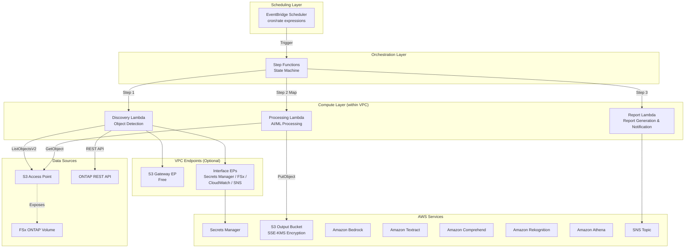

# FSx for ONTAP S3 Access Points Serverless Patterns

🌐 **Language / 言語**: [日本語](README.md) | [English](README.en.md) | [한국어](README.ko.md) | [简体中文](README.zh-CN.md) | [繁體中文](README.zh-TW.md) | [Français](README.fr.md) | [Deutsch](README.de.md) | [Español](README.es.md)

A collection of industry-specific serverless automation patterns leveraging S3 Access Points for Amazon FSx for NetApp ONTAP.

> **Purpose of this repository**: This is a "reference implementation for learning design decisions." Some use cases have been E2E verified in an AWS environment, while others have undergone CloudFormation deployment, shared Discovery Lambda, and operational verification of key components. It is designed for gradual adoption from PoC to production, demonstrating design decisions for cost optimization, security, and error handling through concrete code.

## Related Articles

This repository provides the implementation examples for the architecture described in the following article:

- **FSx for ONTAP S3 Access Points as a Serverless Automation Boundary — AI Data Pipelines, Volume-Level SnapMirror DR, and Capacity Guardrails**
  https://dev.to/yoshikifujiwara/fsx-for-ontap-s3-access-points-as-a-serverless-automation-boundary-ai-data-pipelines-ili

The article explains the architectural design philosophy and trade-offs, while this repository provides concrete, reusable implementation patterns.

## Overview

This repository provides **5 industry-specific patterns** for serverlessly processing enterprise data stored in FSx for NetApp ONTAP via **S3 Access Points**.

> Hereafter, FSx for ONTAP S3 Access Points will be abbreviated as **S3 AP**.

Each use case is self-contained in an independent CloudFormation template, with shared modules (ONTAP REST API client, FSx helper, S3 AP helper) placed in `shared/` for reuse.

### Key Features

- **Polling-based architecture**: Since S3 AP does not support `GetBucketNotificationConfiguration`, periodic execution via EventBridge Scheduler + Step Functions
- **Shared module separation**: OntapClient / FsxHelper / S3ApHelper reused across all use cases
- **CloudFormation / SAM Transform based**: Each use case is self-contained in an independent CloudFormation template (using SAM Transform)
- **Security first**: TLS verification enabled by default, least-privilege IAM, KMS encryption
- **Cost optimization**: High-cost always-on resources (Interface VPC Endpoints, etc.) made optional

## Architecture



> The diagram shows a production-oriented Lambda configuration within a VPC. For PoC / demo purposes, if the S3 AP network origin is `internet`, a Lambda configuration outside the VPC can also be selected. See "Lambda Placement Selection Guidelines" below for details.

### Workflow Overview

```
EventBridge Scheduler (Periodic Execution)
  └─→ Step Functions State Machine
       ├─→ Discovery Lambda: Retrieve object list from S3 AP → Generate Manifest
       ├─→ Map State (Parallel Processing): Process each object with AI/ML services
       └─→ Report/Notification: Generate result report → SNS notification
```

## Use Case List

### Phase 1 (UC1–UC5)

| # | Directory | Industry | Pattern | AI/ML Services Used | ap-northeast-1 Verification Status |
|---|-----------|----------|---------|---------------------|-----------------------------------|
| UC1 | `legal-compliance/` | Legal & Compliance | File server audit & data governance | Athena, Bedrock | ✅ E2E Success |
| UC2 | `financial-idp/` | Finance & Insurance | Contract & invoice automated processing (IDP) | Textract ⚠️, Comprehend, Bedrock | ⚠️ Not in Tokyo (use supported region) |
| UC3 | `manufacturing-analytics/` | Manufacturing | IoT sensor log & quality inspection image analysis | Athena, Rekognition | ✅ E2E Success |
| UC4 | `media-vfx/` | Media | VFX rendering pipeline | Rekognition, Deadline Cloud | ⚠️ Deadline Cloud Setup Required |
| UC5 | `healthcare-dicom/` | Healthcare | DICOM image auto-classification & anonymization | Rekognition, Comprehend Medical ⚠️ | ⚠️ Not in Tokyo (use supported region) |

### Phase 2 (UC6–UC14)

| # | Directory | Industry | Pattern | AI/ML Services Used | ap-northeast-1 Verification Status |
|---|-----------|----------|---------|---------------------|-----------------------------------|
| UC6 | `semiconductor-eda/` | Semiconductor / EDA | GDS/OASIS validation, metadata extraction, DRC aggregation | Athena, Bedrock | ✅ Tests Passed |
| UC7 | `genomics-pipeline/` | Genomics | FASTQ/VCF quality check, variant call aggregation | Athena, Bedrock, Comprehend Medical ⚠️ | ⚠️ Cross-Region (us-east-1) |
| UC8 | `energy-seismic/` | Energy | SEG-Y metadata extraction, well log anomaly detection | Athena, Bedrock, Rekognition | ✅ Tests Passed |
| UC9 | `autonomous-driving/` | Autonomous Driving / ADAS | Video/LiDAR preprocessing, QC, annotation | Rekognition, Bedrock, SageMaker | ✅ Tests Passed |
| UC10 | `construction-bim/` | Construction / AEC | BIM version management, drawing OCR, safety compliance | Textract ⚠️, Bedrock, Rekognition | ⚠️ Cross-Region (us-east-1) |
| UC11 | `retail-catalog/` | Retail / E-Commerce | Product image tagging, catalog metadata generation | Rekognition, Bedrock | ✅ Tests Passed |
| UC12 | `logistics-ocr/` | Logistics | Shipping slip OCR, warehouse inventory image analysis | Textract ⚠️, Rekognition, Bedrock | ⚠️ Cross-Region (us-east-1) |
| UC13 | `education-research/` | Education / Research | Paper PDF classification, citation network analysis | Textract ⚠️, Comprehend, Bedrock | ⚠️ Cross-Region (us-east-1) |
| UC14 | `insurance-claims/` | Insurance | Accident photo damage assessment, estimate OCR, claims report | Rekognition, Textract ⚠️, Bedrock | ⚠️ Cross-Region (us-east-1) |

> **Region constraints**: Amazon Textract and Amazon Comprehend Medical are not available in ap-northeast-1 (Tokyo). Phase 2 UCs (UC7, UC10, UC12, UC13, UC14) use Cross_Region_Client to route API calls to us-east-1. Rekognition, Comprehend, Bedrock, and Athena are available in ap-northeast-1.
> 
> Reference: [Textract Supported Regions](https://docs.aws.amazon.com/general/latest/gr/textract.html) | [Comprehend Medical Supported Regions](https://docs.aws.amazon.com/general/latest/gr/comprehend-med.html) | [Cross-Region Setup Guide](docs/cross-region-guide.md)

### Screenshots

> The following are examples captured in a verification environment. Environment-specific information (account IDs, etc.) has been masked.

#### Step Functions Deployment & Execution Verification for All 5 UCs


> UC1 and UC3 have undergone complete E2E verification, while UC2, UC4, and UC5 have undergone CloudFormation deployment and operational verification of key components. When using AI/ML services with region constraints (Textract, Comprehend Medical), cross-region invocation to supported regions is required, so please verify data residency and compliance requirements.

#### Phase 2: All 9 UCs CloudFormation Deployment & Step Functions Execution Success


> All 9 stacks (UC6–UC14) reached CREATE_COMPLETE / UPDATE_COMPLETE. Total 205 resources.


> All 9 workflows active. All SUCCEEDED confirmed after E2E execution with test data.


> UC6 (Semiconductor EDA) Step Functions execution detail. All states succeeded: Discovery → ProcessObjects (Map) → DrcAggregation → ReportGeneration.


> All 9 UC EventBridge Scheduler schedules (rate(1 hour)) are enabled.

#### AI/ML Service Screens (Phase 1)

##### Amazon Bedrock — Model Catalog


##### Amazon Rekognition — Label Detection


##### Amazon Comprehend — Entity Detection


#### AI/ML Service Screens (Phase 2)

##### Amazon Bedrock — Model Catalog (UC6: Report Generation)


> Used for DRC report generation with Nova Lite model in UC6 (Semiconductor EDA).

##### Amazon Athena — Query Execution History (UC6: Metadata Aggregation)


> Athena queries (cell_count, bbox, naming, invalid) executed within UC6 Step Functions workflow.

##### Amazon Rekognition — Label Detection (UC11: Product Image Tagging)


> Detected 15 labels (Lighting 98.5%, Light 96.0%, Purple 92.0%, etc.) from product images in UC11 (Retail Catalog).

##### Amazon Textract — Document OCR (UC12: Delivery Slip Reading)


> Text extraction from delivery slip PDF in UC12 (Logistics OCR). Executed via Cross-Region (us-east-1).

##### Amazon Comprehend Medical — Medical Entity Detection (UC7: Genomics Analysis)


> Gene names (GC) extracted from VCF analysis results using DetectEntitiesV2 API in UC7 (Genomics Pipeline). Executed via Cross-Region (us-east-1).

##### Lambda Functions (Phase 2)


> All Phase 2 Lambda functions (Discovery, Processing, Report, etc.) successfully deployed.

## Technology Stack

| Layer | Technology |
|-------|-----------|
| Language | Python 3.12 |
| IaC | CloudFormation (YAML) + SAM Transform |
| Compute | AWS Lambda (Production: within VPC / PoC: outside VPC also available) |
| Orchestration | AWS Step Functions |
| Scheduling | Amazon EventBridge Scheduler |
| Storage | FSx for ONTAP (S3 AP) + S3 Output Bucket (SSE-KMS) |
| Notification | Amazon SNS |
| Analytics | Amazon Athena + AWS Glue Data Catalog |
| AI/ML | Amazon Bedrock, Textract, Comprehend, Rekognition |
| Security | Secrets Manager, KMS, IAM Least Privilege |
| Testing | pytest + Hypothesis (PBT), moto, cfn-lint, ruff |

## Prerequisites

- **AWS Account**: A valid AWS account with appropriate IAM permissions
- **FSx for NetApp ONTAP**: A deployed file system
  - ONTAP version: A version that supports S3 Access Points (verified with 9.17.1P4D3)
  - An FSx for ONTAP volume with an associated S3 Access Point (network origin depends on use case; `internet` recommended when using Athena / Glue)
- **Network**: VPC, private subnets, route tables
- **Secrets Manager**: Pre-register ONTAP REST API credentials (format: `{"username":"fsxadmin","password":"..."}`)
- **S3 Bucket**: Pre-create a bucket for Lambda deployment packages (e.g., `fsxn-s3ap-deploy-<account-id>`)
- **Python 3.12+**: For local development and testing
- **AWS CLI v2**: For deployment and management

### Preparation Commands

```bash
# 1. Create deployment S3 bucket
ACCOUNT_ID=$(aws sts get-caller-identity --query Account --output text)
aws s3 mb "s3://fsxn-s3ap-deploy-${ACCOUNT_ID}" --region $AWS_DEFAULT_REGION

# 2. Register ONTAP credentials in Secrets Manager
aws secretsmanager create-secret \
  --name fsxn-ontap-credentials \
  --secret-string '{"username":"fsxadmin","password":"<your-ontap-password>"}' \
  --region $AWS_DEFAULT_REGION

# 3. Check for existing S3 Gateway Endpoint (to prevent duplicate creation)
aws ec2 describe-vpc-endpoints \
  --filters "Name=vpc-id,Values=<your-vpc-id>" "Name=service-name,Values=com.amazonaws.${AWS_DEFAULT_REGION}.s3" \
  --query 'VpcEndpoints[*].{Id:VpcEndpointId,State:State}' \
  --output table
# → If results exist, deploy with EnableS3GatewayEndpoint=false
```

### Lambda Placement Selection Guidelines

| Purpose | Recommended Placement | Reason |
|---------|----------------------|--------|
| Demo / PoC | Lambda outside VPC | No VPC Endpoint needed, low cost, simple configuration |
| Production / Private network requirements | Lambda within VPC | Secrets Manager / FSx / SNS accessible via PrivateLink |
| UCs using Athena / Glue | S3 AP network origin: `internet` | Access from AWS managed services required |

### Notes on Accessing S3 AP from Lambda within VPC

> **Important findings confirmed during UC1 deployment verification (2026-05-03)**

- **S3 Gateway Endpoint route table association is required**: If you do not specify the private subnet route table IDs in `RouteTableIds`, access from Lambda within VPC to S3 / S3 AP will time out
- **Verify VPC DNS resolution**: Ensure that `enableDnsSupport` / `enableDnsHostnames` are enabled on the VPC
- **Running Lambda outside VPC is recommended for PoC / demo environments**: If the S3 AP network origin is `internet`, Lambda outside VPC can access it without issues. No VPC Endpoint needed, reducing costs and simplifying configuration
- See [Troubleshooting Guide](docs/guides/troubleshooting-guide.md#6-lambda-vpc-内実行時の-s3-ap-タイムアウト) for details

### Required AWS Service Quotas

| Service | Quota | Recommended Value |
|---------|-------|-------------------|
| Lambda Concurrent Executions | ConcurrentExecutions | 100 or more |
| Step Functions Executions | StartExecution/sec | Default (25) |
| S3 Access Point | APs per account | Default (10,000) |

## Quick Start

### 1. Clone the Repository

```bash
git clone https://github.com/Yoshiki0705/FSx-for-ONTAP-S3AccessPoints-Serverless-Patterns.git
cd FSx-for-ONTAP-S3AccessPoints-Serverless-Patterns
```

### 2. Install Dependencies

```bash
pip install -r requirements.txt
pip install -r requirements-dev.txt
```

### 3. Run Tests

```bash
# Unit tests (with coverage)
pytest shared/tests/ --cov=shared --cov-report=term-missing -v

# Property-based tests
pytest shared/tests/test_properties.py -v

# Linter
ruff check .
ruff format --check .
```

### 4. Deploy a Use Case (Example: UC1 Legal & Compliance)

> ⚠️ **Important Notes on Impact to Existing Environments**
>
> Please verify the following before deployment:
>
> | Parameter | Impact on Existing Environment | Verification Method |
> |-----------|-------------------------------|-------------------|
> | `VpcId` / `PrivateSubnetIds` | Lambda ENIs will be created in the specified VPC/subnets | `aws ec2 describe-network-interfaces --filters Name=group-id,Values=<sg-id>` |
> | `EnableS3GatewayEndpoint=true` | An S3 Gateway Endpoint will be added to the VPC. **Set to `false` if an existing S3 Gateway Endpoint exists in the same VPC** | `aws ec2 describe-vpc-endpoints --filters Name=vpc-id,Values=<vpc-id>` |
> | `PrivateRouteTableIds` | S3 Gateway Endpoint will be associated with route tables. No impact on existing routing | `aws ec2 describe-route-tables --route-table-ids <rtb-id>` |
> | `ScheduleExpression` | EventBridge Scheduler will periodically execute Step Functions. **The schedule can be disabled after deployment to avoid unnecessary executions** | AWS Console → EventBridge → Schedules |
> | `NotificationEmail` | An SNS subscription confirmation email will be sent | Check email inbox |
>
> **Notes on stack deletion**:
> - Deletion will fail if objects remain in the S3 bucket (Athena Results). Empty it first with `aws s3 rm s3://<bucket> --recursive`
> - For versioning-enabled buckets, all versions must be deleted with `aws s3api delete-objects`
> - VPC Endpoint deletion may take 5-15 minutes
> - Lambda ENI release may take time, causing security group deletion to fail. Wait a few minutes and retry

```bash
# Set region (managed via environment variable)
export AWS_DEFAULT_REGION=us-east-1  # Region supporting all services recommended

# Lambda packaging
./scripts/deploy_uc.sh legal-compliance package

# CloudFormation deployment
aws cloudformation create-stack \
  --stack-name fsxn-legal-compliance \
  --template-body file://legal-compliance/template-deploy.yaml \
  --capabilities CAPABILITY_NAMED_IAM \
  --parameters \
    ParameterKey=DeployBucket,ParameterValue=<your-deploy-bucket> \
    ParameterKey=S3AccessPointAlias,ParameterValue=<your-volume-ext-s3alias> \
    ParameterKey=S3AccessPointOutputAlias,ParameterValue=<your-output-volume-ext-s3alias> \
    ParameterKey=OntapSecretName,ParameterValue=<your-ontap-secret-name> \
    ParameterKey=OntapManagementIp,ParameterValue=<your-ontap-management-ip> \
    ParameterKey=SvmUuid,ParameterValue=<your-svm-uuid> \
    ParameterKey=VolumeUuid,ParameterValue=<your-volume-uuid> \
    ParameterKey=VpcId,ParameterValue=<your-vpc-id> \
    'ParameterKey=PrivateSubnetIds,ParameterValue=<subnet-1>,<subnet-2>' \
    'ParameterKey=PrivateRouteTableIds,ParameterValue=<rtb-1>,<rtb-2>' \
    ParameterKey=NotificationEmail,ParameterValue=<your-email@example.com> \
    ParameterKey=EnableVpcEndpoints,ParameterValue=true \
    ParameterKey=EnableS3GatewayEndpoint,ParameterValue=true
```

> **Note**: Replace `<...>` placeholders with your actual environment values.
>
> **About `EnableVpcEndpoints`**: The Quick Start specifies `true` to ensure connectivity from VPC Lambda to Secrets Manager / CloudWatch / SNS. If you have existing Interface VPC Endpoints or a NAT Gateway, you can specify `false` to reduce costs.
> 
> **Region selection**: `us-east-1` or `us-west-2` is recommended where all AI/ML services are available. Textract and Comprehend Medical are not available in `ap-northeast-1` (cross-region invocation can be used as a workaround). See [Region Compatibility Matrix](docs/region-compatibility.md) for details.

### Verified Environment

| Item | Value |
|------|-------|
| AWS Region | ap-northeast-1 (Tokyo) |
| Cross-Region | us-east-1 (Virginia) |
| FSx ONTAP Version | ONTAP 9.17.1P4D3 |
| FSx Configuration | SINGLE_AZ_1 |
| Python | 3.12 |
| Deployment Method | CloudFormation (using SAM Transform) |

**Phase 1 (UC1–UC5)**: CloudFormation stack deployment and Discovery Lambda operational verification have been completed for all 5 use cases. UC1 and UC3 have undergone complete E2E verification.

**Phase 2 (UC6–UC14)**: All 9 use cases deployed (205 resources total), Step Functions E2E execution (all 9 UCs SUCCEEDED), test data upload verification, and shared/ module AWS environment verification (8/8 PASSED) completed.

See [Verification Results](docs/verification-results.md) (Phase 1) and [Phase 2 Verification Results](docs/verification-results-phase2.md) for details.

## Cost Structure Summary

### Cost Estimates by Environment

| Environment | Fixed Cost/Month | Variable Cost/Month | Total/Month |
|-------------|-----------------|--------------------:|-------------|
| Demo/PoC | ~$0 | ~$1–$3 | **~$1–$3** |
| Production (1 UC) | ~$29 | ~$1–$3 | **~$30–$32** |
| Production (All 5 UCs) | ~$29 | ~$5–$15 | **~$34–$44** |

### Cost Classification

- **Request-based (pay-per-use)**: Lambda, Step Functions, S3 API, Textract, Comprehend, Rekognition, Bedrock, Athena — $0 if unused
- **Always-on (fixed cost)**: Interface VPC Endpoints (~$28.80/month) — **Optional (opt-in)**

> The Quick Start specifies `EnableVpcEndpoints=true` to prioritize connectivity for Lambda within VPC. For low-cost PoC, consider using Lambda outside VPC or leveraging existing NAT / Interface VPC Endpoints.

> See [docs/cost-analysis.md](docs/cost-analysis.md) for detailed cost analysis.

### Optional Resources

High-cost always-on resources are made optional via CloudFormation parameters.

| Resource | Parameter | Default | Monthly Fixed Cost | Description |
|----------|-----------|---------|-------------------|-------------|
| Interface VPC Endpoints | `EnableVpcEndpoints` | `false` | ~$28.80 | For Secrets Manager, FSx, CloudWatch, SNS. `true` recommended for production. Quick Start specifies `true` for connectivity |
| CloudWatch Alarms | `EnableCloudWatchAlarms` | `false` | ~$0.10/alarm | Monitoring Step Functions failure rate, Lambda error rate |

> **S3 Gateway VPC Endpoint** has no additional hourly charges, so enabling it is recommended for configurations where Lambda within VPC accesses S3 AP. However, specify `EnableS3GatewayEndpoint=false` if an existing S3 Gateway Endpoint exists or if Lambda is placed outside VPC for PoC / demo purposes. Standard charges for S3 API requests, data transfer, and individual AWS service usage still apply.

## Security and Authorization Model

This solution combines **multiple authorization layers**, each serving a different role:

| Layer | Role | Scope of Control |
|-------|------|-----------------|
| **IAM** | Access control for AWS services and S3 Access Points | Lambda execution role, S3 AP policy |
| **S3 Access Point** | Defines access boundaries through file system users associated with the S3 AP | S3 AP policy, network origin, associated users |
| **ONTAP File System** | Enforces file-level permissions | UNIX permissions / NTFS ACL |
| **ONTAP REST API** | Exposes only metadata and control plane operations | Secrets Manager authentication + TLS |

**Important design considerations**:

- The S3 API does not expose file-level ACLs. File permission information can **only be obtained via the ONTAP REST API** (UC1's ACL Collection uses this pattern)
- Access via S3 AP is authorized on the ONTAP side as the UNIX / Windows file system user associated with the S3 AP, after being permitted by IAM / S3 AP policies
- ONTAP REST API credentials are managed in Secrets Manager and are not stored in Lambda environment variables

## Compatibility Matrix

| Item | Value / Verification Details |
|------|----------------------------|
| ONTAP Version | Verified with 9.17.1P4D3 (a version supporting S3 Access Points is required) |
| Verified Region | ap-northeast-1 (Tokyo) |
| Recommended Region | us-east-1 / us-west-2 (when using all AI/ML services) |
| Python Version | 3.12+ |
| CloudFormation Transform | AWS::Serverless-2016-10-31 |
| Verified Volume Security Style | UNIX, NTFS |

### FSx ONTAP S3 Access Points Supported APIs

API subset available via S3 AP:

| API | Support |
|-----|---------|
| ListObjectsV2 | ✅ |
| GetObject | ✅ |
| PutObject | ✅ (max 5 GB) |
| HeadObject | ✅ |
| DeleteObject | ✅ |
| DeleteObjects | ✅ |
| CopyObject | ✅ (within same AP, same region) |
| GetObjectAttributes | ✅ |
| GetObjectTagging / PutObjectTagging | ✅ |
| CreateMultipartUpload | ✅ |
| UploadPart / UploadPartCopy | ✅ |
| CompleteMultipartUpload | ✅ |
| AbortMultipartUpload | ✅ |
| ListParts / ListMultipartUploads | ✅ |
| HeadBucket / GetBucketLocation | ✅ |
| GetBucketNotificationConfiguration | ❌ (Not supported → reason for polling design) |
| Presign | ❌ |

### S3 Access Point Network Origin Constraints

| Network Origin | Lambda (outside VPC) | Lambda (within VPC) | Athena / Glue | Recommended UCs |
|---------------|---------------------|--------------------:|--------------|-----------------|
| **internet** | ✅ | ✅ (via S3 Gateway EP) | ✅ | UC1, UC3 (uses Athena) |
| **VPC** | ❌ | ✅ (S3 Gateway EP required) | ❌ | UC2, UC4, UC5 (no Athena) |

> **Important**: Athena / Glue access from AWS managed infrastructure, so they cannot access S3 APs with VPC origin. UC1 (Legal) and UC3 (Manufacturing) use Athena, so the S3 AP must be created with **internet** network origin.

### S3 AP Limitations

- **PutObject max size**: 5 GB. Multipart upload APIs are supported, but verify upload feasibility for objects exceeding 5 GB on a per-use-case basis.
- **Encryption**: SSE-FSX only (FSx handles transparently, no ServerSideEncryption parameter needed)
- **ACL**: Only `bucket-owner-full-control` supported
- **Unsupported features**: Object Versioning, Object Lock, Object Lifecycle, Static Website Hosting, Requester Pays, Presigned URL

## Documentation

Detailed guides and screenshots are stored in the `docs/` directory.

| Document | Description |
|----------|-------------|
| [docs/guides/deployment-guide.md](docs/guides/deployment-guide.md) | Deployment guide (prerequisites check → parameter preparation → deployment → verification) |
| [docs/guides/operations-guide.md](docs/guides/operations-guide.md) | Operations guide (schedule changes, manual execution, log review, alarm response) |
| [docs/guides/troubleshooting-guide.md](docs/guides/troubleshooting-guide.md) | Troubleshooting (AccessDenied, VPC Endpoint, ONTAP timeout, Athena) |
| [docs/cost-analysis.md](docs/cost-analysis.md) | Cost structure analysis |
| [docs/references.md](docs/references.md) | Reference links |
| [docs/extension-patterns.md](docs/extension-patterns.md) | Extension patterns guide |
| [docs/region-compatibility.md](docs/region-compatibility.md) | AI/ML service availability by AWS region |
| [docs/article-draft.md](docs/article-draft.md) | Original draft for dev.to article (see Related Articles at the top of README for published version) |
| [docs/verification-results.md](docs/verification-results.md) | AWS environment verification results |
| [docs/screenshots/](docs/screenshots/README.md) | AWS console screenshots (masked) |

## Directory Structure

```
fsxn-s3ap-serverless-patterns/
├── README.md                          # This file
├── LICENSE                            # MIT License
├── requirements.txt                   # Production dependencies
├── requirements-dev.txt               # Development dependencies
├── shared/                            # Shared modules
│   ├── __init__.py
│   ├── ontap_client.py               # ONTAP REST API client
│   ├── fsx_helper.py                 # AWS FSx API helper
│   ├── s3ap_helper.py                # S3 Access Point helper
│   ├── exceptions.py                 # Shared exceptions & error handler
│   ├── discovery_handler.py          # Shared Discovery Lambda template
│   ├── cfn/                          # CloudFormation snippets
│   └── tests/                        # Unit tests & property tests
├── legal-compliance/                  # UC1: Legal & Compliance
├── financial-idp/                     # UC2: Finance & Insurance
├── manufacturing-analytics/           # UC3: Manufacturing
├── media-vfx/                         # UC4: Media
├── healthcare-dicom/                  # UC5: Healthcare
├── scripts/                           # Verification & deployment scripts
│   ├── deploy_uc.sh                  # UC deployment script (generic)
│   ├── verify_shared_modules.py      # Shared module AWS environment verification
│   └── verify_cfn_templates.sh       # CloudFormation template verification
├── .github/workflows/                 # CI/CD (lint, test)
└── docs/                              # Documentation
    ├── guides/                        # Operation guides
    │   ├── deployment-guide.md       # Deployment guide
    │   ├── operations-guide.md       # Operations guide
    │   └── troubleshooting-guide.md  # Troubleshooting
    ├── screenshots/                   # AWS console screenshots
    ├── cost-analysis.md               # Cost structure analysis
    ├── references.md                  # Reference links
    ├── extension-patterns.md          # Extension patterns guide
    ├── region-compatibility.md        # Region compatibility matrix
    ├── verification-results.md        # Verification results
    └── article-draft.md               # Original draft for dev.to article
```

## Shared Modules (shared/)

| Module | Description |
|--------|-------------|
| `ontap_client.py` | ONTAP REST API client (Secrets Manager auth, urllib3, TLS, retry) |
| `fsx_helper.py` | AWS FSx API + CloudWatch metrics retrieval |
| `s3ap_helper.py` | S3 Access Point helper (pagination, suffix filter) |
| `exceptions.py` | Shared exception classes, `lambda_error_handler` decorator |
| `discovery_handler.py` | Shared Discovery Lambda template (Manifest generation) |

## Development

### Running Tests

```bash
# All tests
pytest shared/tests/ -v

# With coverage
pytest shared/tests/ --cov=shared --cov-report=term-missing --cov-fail-under=80 -v

# Property-based tests only
pytest shared/tests/test_properties.py -v
```

### Linter

```bash
# Python linter
ruff check .
ruff format --check .

# CloudFormation template verification
cfn-lint */template.yaml */template-deploy.yaml
```

## When to Use / When Not to Use This Pattern Collection

### When to Use

- You want to serverlessly process existing NAS data on FSx for ONTAP without moving it
- You want to list files and perform preprocessing from Lambda without NFS / SMB mounting
- You want to learn the separation of responsibilities between S3 Access Points and ONTAP REST API
- You want to quickly validate industry-specific AI / ML processing patterns as a PoC
- Polling-based design with EventBridge Scheduler + Step Functions is acceptable

### When Not to Use

- Real-time file change event processing is required (S3 Event Notification not supported)
- Full S3 bucket compatibility such as Presigned URLs is needed
- You already have an always-on batch infrastructure based on EC2 / ECS and NFS mount operation is acceptable
- File data already exists in standard S3 buckets and can be processed with S3 event notifications

## Additional Considerations for Production Deployment

This repository includes design decisions aimed at production deployment, but please additionally consider the following for actual production environments.

- Alignment with organizational IAM / SCP / Permission Boundary
- Review of S3 AP policies and ONTAP-side user permissions
- Enabling audit logs and execution logs for Lambda / Step Functions / Bedrock / Textract, etc. (CloudTrail / CloudWatch Logs)
- CloudWatch Alarms / SNS / Incident Management integration (`EnableCloudWatchAlarms=true`)
- Industry-specific compliance requirements such as data classification, personal information, and medical information
- Data residency verification for region constraints and cross-region invocations
- Step Functions execution history retention period and log level settings
- Lambda Reserved Concurrency / Provisioned Concurrency settings

## Contributing

Issues and Pull Requests are welcome. See [CONTRIBUTING.md](CONTRIBUTING.md) for details.

## License

MIT License — See [LICENSE](LICENSE) for details.
