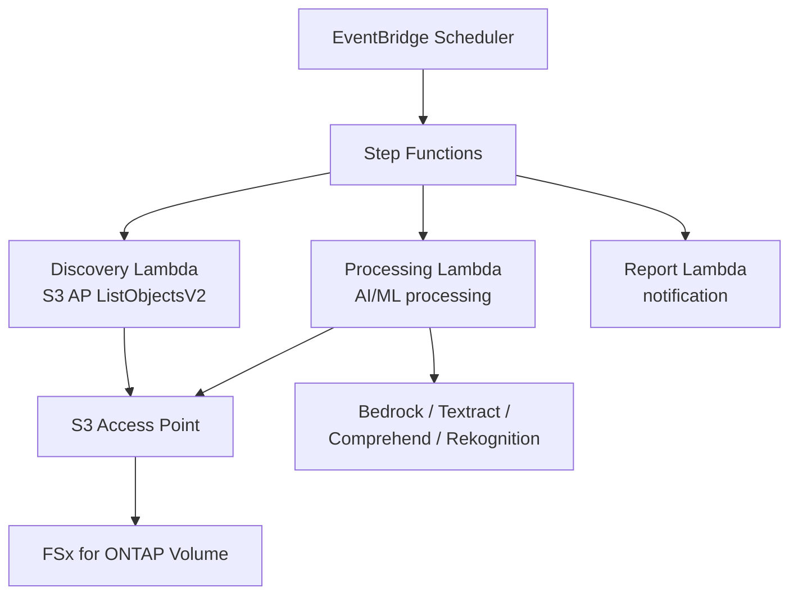

# FSx for ONTAP S3 Access Points — Patrones Serverless

    

🌐 [日本語](README.md) | [English](README.en.md) | [한국어](README.ko.md) | [简体中文](README.zh-CN.md) | [繁體中文](README.zh-TW.md) | [Français](README.fr.md) | [Deutsch](README.de.md) | [Español](README.es.md)

---

> **42 patrones de referencia** para el procesamiento serverless de datos NAS empresariales en FSx for ONTAP mediante S3 Access Points — **sin necesidad de copiar datos**.
>
> 28 casos de uso por industria + 7 FlexCache/FlexClone + 2 GenAI + SAP + monitoreo HA + Event-Driven + distribución Edge + File Portal UI

---

## Primeros pasos

| Quiero... | Guía | Tiempo |
|---|---|---|
| Probar una demo sin FSx | [Demo Mode Guide](docs/demo-mode-guide.md) | 5 min |
| Navegar archivos mediante un portal web | [File Portal UI (Amplify / Nextcloud)](docs/file-portal-amplify-gen2.en.md) | 10 min |
| Desplegar un patrón en AWS | [Deployment Guide](docs/guides/deployment-guide.md) | 30 min |
| Encontrar el patrón adecuado para mi carga | [Pattern Selection Guide](docs/pattern-selection-guide.md) | 15 min |
| Estimar costos | [Cost Calculator](docs/cost-calculator.md) | 5 min |
| Construir un entorno de laboratorio | [Hands-on Lab IaC](infrastructure/handson-lab/) | 60 min |

---

<details>
<summary><strong>📂 Todos los patrones (clic para expandir)</strong></summary>

### Casos de uso por industria (UC1-UC28 + SAP)

| # | Directorio | Industria | Resumen |
|---|---|---|---|
| UC1 | [`legal-compliance/`](solutions/industry/legal-compliance/) | Legal | Auditoría NTFS ACL e informes de cumplimiento |
| UC2 | [`financial-idp/`](solutions/industry/financial-idp/) | Finanzas | OCR de facturas y extracción de entidades |
| UC3 | [`manufacturing-analytics/`](solutions/industry/manufacturing-analytics/) | Manufactura | Sensores IoT e inspección de calidad |
| UC4 | [`media-vfx/`](solutions/industry/media-vfx/) | Medios | Control de calidad de renderizado VFX |
| UC5 | [`healthcare-dicom/`](solutions/industry/healthcare-dicom/) | Salud | Anonimización DICOM |
| UC6 | [`semiconductor-eda/`](solutions/industry/semiconductor-eda/) | Semiconductores | Validación GDS/OASIS |
| UC7 | [`genomics-pipeline/`](solutions/industry/genomics-pipeline/) | Genómica | Control de calidad FASTQ/VCF |
| UC8 | [`energy-seismic/`](solutions/industry/energy-seismic/) | Energía | Análisis de datos sísmicos SEG-Y |
| UC9 | [`autonomous-driving/`](solutions/industry/autonomous-driving/) | Automotriz | Preprocesamiento de video/LiDAR |
| UC10 | [`construction-bim/`](solutions/industry/construction-bim/) | Construcción | Gestión de modelos BIM |
| UC11 | [`retail-catalog/`](solutions/industry/retail-catalog/) | Retail | Etiquetado de imágenes de productos |
| UC12 | [`logistics-ocr/`](solutions/industry/logistics-ocr/) | Logística | OCR de documentos de envío |
| UC13 | [`education-research/`](solutions/industry/education-research/) | Educación | Clasificación de artículos |
| UC14 | [`insurance-claims/`](solutions/industry/insurance-claims/) | Seguros | Evaluación de daños |
| UC15 | [`defense-satellite/`](solutions/industry/defense-satellite/) | Defensa | Análisis de imágenes satelitales |
| UC16 | [`government-archives/`](solutions/industry/government-archives/) | Gobierno | Archivos públicos y acceso a información |
| UC17 | [`smart-city-geospatial/`](solutions/industry/smart-city-geospatial/) | Ciudad inteligente | Análisis geoespacial |
| UC18 | [`telecom-network-analytics/`](solutions/industry/telecom-network-analytics/) | Telecomunicaciones | Análisis de CDR/registros de red |
| UC19 | [`adtech-creative-management/`](solutions/industry/adtech-creative-management/) | Publicidad | Gestión de activos creativos |
| UC20 | [`travel-document-processing/`](solutions/industry/travel-document-processing/) | Viajes | Procesamiento de documentos de reserva |
| UC21 | [`agri-food-traceability/`](solutions/industry/agri-food-traceability/) | Agricultura | Trazabilidad |
| UC22 | [`transportation-maintenance/`](solutions/industry/transportation-maintenance/) | Transporte | Inspección de equipos |
| UC23 | [`sustainability-esg-reporting/`](solutions/industry/sustainability-esg-reporting/) | ESG | Extracción de métricas |
| UC24 | [`nonprofit-grant-management/`](solutions/industry/nonprofit-grant-management/) | Sin fines de lucro | Gestión de subvenciones |
| UC25 | [`utilities-asset-inspection/`](solutions/industry/utilities-asset-inspection/) | Servicios públicos | Análisis de drones/SCADA |
| UC26 | [`real-estate-portfolio/`](solutions/industry/real-estate-portfolio/) | Bienes raíces | Imágenes de propiedades y contratos |
| UC27 | [`hr-document-screening/`](solutions/industry/hr-document-screening/) | RRHH | Selección de currículos |
| UC28 | [`chemical-sds-management/`](solutions/industry/chemical-sds-management/) | Química | HDS y notas de laboratorio |
| SAP | [`sap/erp-adjacent/`](solutions/sap/erp-adjacent/) | SAP/ERP | Procesamiento IDoc y EDI |

### FlexCache / FlexClone (FC1-FC7)

| # | Directorio | Patrón |
|---|---|---|
| FC1 | [`flexcache/anycast-dr/`](solutions/flexcache/anycast-dr/) | AnyCast / conmutación por error DR |
| FC2 | [`flexcache/dynamic-render-workflow/`](solutions/flexcache/dynamic-render-workflow/) | FlexCache dinámico por trabajo |
| FC3 | [`flexcache/rag-enterprise-files/`](solutions/flexcache/rag-enterprise-files/) | RAG con reconocimiento de permisos |
| FC4 | [`flexcache/automotive-cae/`](solutions/flexcache/automotive-cae/) | Análisis de simulación CAE |
| FC5 | [`flexcache/life-sciences-research/`](solutions/flexcache/life-sciences-research/) | Clasificación de datos de investigación |
| FC6 | [`flexcache/gaming-build-pipeline/`](solutions/flexcache/gaming-build-pipeline/) | Control de calidad de assets de juegos |
| FC7 | [`flexcache/devops-cicd/`](solutions/flexcache/devops-cicd/) | FlexClone Dev/Test y CI/CD |

### GenAI / HA / Event-Driven / Edge / File Portal

| Directorio | Resumen |
|---|---|
| [`genai/kb-selfservice-curation/`](solutions/genai/kb-selfservice-curation/) | Operaciones autoservicio Bedrock KB |
| [`genai/quick-agentic-workspace/`](solutions/genai/quick-agentic-workspace/) | Espacio de trabajo agéntico |
| [`ha/lifekeeper-monitoring/`](solutions/ha/lifekeeper-monitoring/) | Monitoreo HA LifeKeeper con IA |
| [`event-driven/fpolicy/`](solutions/event-driven/fpolicy/) | Pipeline event-driven FPolicy |
| [`edge/content-delivery/`](solutions/edge/content-delivery/) | Distribución CDN/edge (neutral en proveedor) |
| [`amplify-portal/`](solutions/amplify-portal/) | File Portal UI (Amplify Gen2) |
| [`nextcloud-test/`](solutions/nextcloud-test/) | File Portal UI (Nextcloud Docker) |

### Infraestructura y módulos compartidos

| Directorio | Resumen |
|---|---|
| [`shared/`](shared/) | Módulos Python comunes (S3ApHelper, OntapClient, Observability) |
| [`operations/`](operations/) | 6 patrones de optimización operativa |
| [`infrastructure/handson-lab/`](infrastructure/handson-lab/) | IaC de laboratorio práctico (VPC/AD/FSx/EC2/S3AP) |
| [`docs/`](docs/) | Guías de diseño y benchmarks (40+ documentos) |
| [`scripts/`](scripts/) | Despliegue, benchmarks, utilidades |
| [`.github/workflows/`](.github/workflows/) | CI/CD (lint → test → security → deploy) |

</details>

---

## Arquitectura

```
EventBridge Scheduler (disparador periódico)
  └→ Step Functions State Machine
      ├→ Discovery Lambda: listar archivos vía S3 AP
      ├→ Map State (paralelo): procesar cada archivo con AI/ML
      └→ Report Lambda: generar resultados → notificación SNS
```

Este es el flujo común compartido por todos los patrones. Los servicios AI/ML (Bedrock, Textract, Comprehend, Rekognition) varían según el caso de uso.

<details>
<summary><strong>Diagrama Mermaid (clic para expandir)</strong></summary>



</details>

<details>
<summary><strong>Arquitecturas por categoría (FlexCache, GenAI, HA, Event-Driven, Edge)</strong></summary>

Diagramas de arquitectura detallados por categoría:
- [FlexCache / FlexClone](docs/industry-workload-mapping.md)
- [GenAI (Bedrock KB / Agentic)](solutions/genai/kb-selfservice-curation/docs/architecture.md)
- [HA LifeKeeper Monitoring](solutions/ha/lifekeeper-monitoring/README.md)
- [Event-Driven FPolicy](solutions/event-driven/fpolicy/README.md)
- [Edge / CDN](solutions/edge/content-delivery/docs/architecture.md)
- [File Portal (Amplify Gen2)](solutions/amplify-portal/README.md)

</details>

---

## Restricciones clave de S3 Access Points

| Restricción | Solución alternativa |
|---|---|
| Sin S3 Event Notifications | Polling con EventBridge Scheduler o FPolicy |
| URLs prefirmadas no oficiales | Funcionan en la práctica pero no se recomiendan para producción |
| Límite de carga de 5 GB | Multipart Upload |
| No se pueden escribir resultados de Athena en S3AP | Salida a bucket S3 estándar |
| Solo SSE-FSX | Usar cifrado KMS a nivel de volumen |

Detalles: [S3AP Compatibility Notes](docs/s3ap-compatibility-notes.en.md) | [Compatibility Matrix (confirmada por AWS)](https://github.com/Yoshiki0705/fsxn-lakehouse-integrations/blob/main/docs/en/compatibility-matrix.md)

---

<details>
<summary><strong>📚 Artículos y repositorios relacionados</strong></summary>

### Serie de artículos

| Tema | Japonés | Inglés |
|---|---|---|
| Introducción a los 42 patrones | [Hatena](https://hakobiya.hatenablog.com/entry/fsxn-s3ap-serverless-part1-introduction) | [dev.to](https://dev.to/aws-builders/industry-specific-serverless-automation-patterns-with-fsx-for-ontap-s3-access-points-3e0a) |
| Arquitectura de producción | [Hatena](https://hakobiya.hatenablog.com/entry/fsxn-s3ap-serverless-part2-production-architecture) | — |
| Línea base operativa | [Hatena](https://hakobiya.hatenablog.com/entry/fsxn-s3ap-serverless-part3-operational-baseline) | [dev.to](https://dev.to/aws-builders/production-rollout-vpc-endpoint-auto-detection-and-the-cdk-no-go-fsx-for-ontap-s3-access-3lni) |
| FPolicy Event-Driven | [Hatena](https://hakobiya.hatenablog.com/entry/fsxn-s3ap-serverless-part4-event-driven-fpolicy) | [dev.to](https://dev.to/aws-builders/fpolicy-event-driven-pipeline-multi-account-stacksets-and-cost-optimization-fsx-for-ontap-s3-5bd6) |
| 28 patrones por industria | [Hatena](https://hakobiya.hatenablog.com/entry/fsxn-s3ap-serverless-part5-field-ready-28-patterns) | [dev.to](https://dev.to/aws-builders/from-serverless-patterns-to-field-ready-reference-architecture-fsx-for-ontap-s3-access-points-dhj) |
| Integración GenAI | [Hatena](https://hakobiya.hatenablog.com/entry/fsxn-s3ap-serverless-part6-genai-42-patterns) | — |

### Repositorios relacionados

| Repositorio | Resumen |
|---|---|
| [Permission-aware-RAG-FSxN-CDK](https://github.com/Yoshiki0705/Permission-aware-RAG-FSxN-CDK-github) | Chatbot RAG con reconocimiento de permisos (CDK + Next.js + ECS) |
| [fsxn-lakehouse-integrations](https://github.com/Yoshiki0705/fsxn-lakehouse-integrations) | Integración Lakehouse (Databricks, Snowflake, Athena, Glue, EMR) |
| [vmware-migration-ec2-ontap](https://github.com/Yoshiki0705/vmware-migration-ec2-ontap) | Migración VMware → EC2 + FSx for ONTAP |

</details>

<details>
<summary><strong>🔧 Guía para desarrolladores (pruebas y contribución)</strong></summary>

### Pruebas

```bash
pytest shared/tests/ -v                    # Unit tests
ruff check . && ruff format --check .      # Python linter
cfn-lint solutions/industry/*/template.yaml # CloudFormation validation
```

### Stack tecnológico

Python 3.12 | CloudFormation + SAM | Lambda (ARM64) | Step Functions | EventBridge | Bedrock / Textract / Comprehend / Rekognition | Secrets Manager | Athena + Glue

### Contribuir

Issues y Pull Requests son bienvenidos. Consulte [CONTRIBUTING.md](CONTRIBUTING.md).

</details>

---

## Licencia

MIT — [LICENSE](LICENSE)

---

🌐 [日本語](README.md) | [English](README.en.md) | [한국어](README.ko.md) | [简体中文](README.zh-CN.md) | [繁體中文](README.zh-TW.md) | [Français](README.fr.md) | [Deutsch](README.de.md) | [Español](README.es.md)
