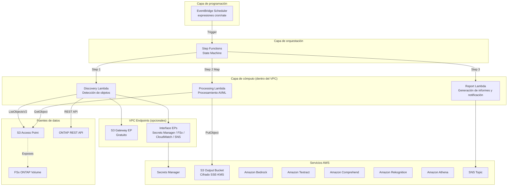

# FSx for ONTAP S3 Access Points Serverless Patterns

🌐 **Language / 言語**: [日本語](README.md) | [English](README.en.md) | [한국어](README.ko.md) | [简体中文](README.zh-CN.md) | [繁體中文](README.zh-TW.md) | [Français](README.fr.md) | [Deutsch](README.de.md) | [Español](README.es.md)

Colección de patrones de automatización serverless por sector, basados en los S3 Access Points de Amazon FSx for NetApp ONTAP.

> **Posicionamiento de este repositorio**: Esta es una «implementación de referencia para aprender decisiones de diseño». Algunos casos de uso han sido verificados E2E en un entorno AWS, mientras que otros han sido validados mediante despliegue de CloudFormation, Lambda Discovery compartido y pruebas de componentes principales. El objetivo es demostrar decisiones de diseño sobre optimización de costos, seguridad y manejo de errores a través de código concreto, con un camino desde PoC hasta producción.

## Artículo relacionado

Este repositorio es el compañero práctico del siguiente artículo:

- **FSx for ONTAP S3 Access Points as a Serverless Automation Boundary — AI Data Pipelines, Volume-Level SnapMirror DR, and Capacity Guardrails**
  https://dev.to/yoshikifujiwara/fsx-for-ontap-s3-access-points-as-a-serverless-automation-boundary-ai-data-pipelines-ili

El artículo explica el razonamiento arquitectónico y las compensaciones. Este repositorio proporciona patrones de implementación concretos y reutilizables.

## Descripción general

Este repositorio proporciona **5 patrones sectoriales** para el procesamiento serverless de datos empresariales almacenados en FSx for NetApp ONTAP a través de **S3 Access Points**.

> En adelante, FSx for ONTAP S3 Access Points se abrevia como **S3 AP**.

Cada caso de uso es un template de CloudFormation independiente, con módulos compartidos (cliente ONTAP REST API, helper FSx, helper S3 AP) en `shared/` para reutilización.

### Características principales

- **Arquitectura basada en sondeo**: Dado que S3 AP no soporta `GetBucketNotificationConfiguration`, ejecución periódica mediante EventBridge Scheduler + Step Functions
- **Separación de módulos compartidos**: OntapClient / FsxHelper / S3ApHelper reutilizados en todos los casos de uso
- **CloudFormation / SAM Transform**: Cada caso de uso es un template de CloudFormation independiente con SAM Transform
- **Seguridad primero**: Verificación TLS habilitada por defecto, IAM de mínimo privilegio, cifrado KMS
- **Optimización de costos**: Los recursos permanentes de alto costo (Interface VPC Endpoints, etc.) son opcionales

## Arquitectura



> El diagrama muestra una configuración Lambda dentro del VPC orientada a producción. Para PoC / demostración, si el network origin del S3 AP es `internet`, también se puede elegir una configuración Lambda fuera del VPC. Consulte la «Guía de selección de ubicación de Lambda» a continuación para más detalles.

### Resumen del flujo de trabajo

```
EventBridge Scheduler (ejecución periódica)
  └─→ Step Functions State Machine
       ├─→ Discovery Lambda: Obtener lista de objetos de S3 AP → Generar Manifest
       ├─→ Map State (procesamiento paralelo): Procesar cada objeto con servicios AI/ML
       └─→ Report/Notification: Generar informe de resultados → Notificación SNS
```

## Lista de casos de uso

| # | Directorio | Sector | Patrón | Servicios AI/ML utilizados | Estado de verificación ap-northeast-1 |
|---|------------|--------|--------|---------------------------|--------------------------------------|
| UC1 | `legal-compliance/` | Legal y cumplimiento | Auditoría de servidor de archivos y gobernanza de datos | Athena, Bedrock | ✅ E2E exitoso |
| UC2 | `financial-idp/` | Finanzas y seguros | Procesamiento automatizado de contratos y facturas (IDP) | Textract ⚠️, Comprehend, Bedrock | ⚠️ No en Tokio (usar región compatible) |
| UC3 | `manufacturing-analytics/` | Manufactura | Análisis de registros de sensores IoT e imágenes de inspección de calidad | Athena, Rekognition | ✅ E2E exitoso |
| UC4 | `media-vfx/` | Medios | Pipeline de renderizado VFX | Rekognition, Deadline Cloud | ⚠️ Configuración de Deadline Cloud requerida |
| UC5 | `healthcare-dicom/` | Salud | Clasificación automática y anonimización de imágenes DICOM | Rekognition, Comprehend Medical ⚠️ | ⚠️ No en Tokio (usar región compatible) |

> **Restricciones regionales**: Amazon Textract y Amazon Comprehend Medical no están disponibles en ap-northeast-1 (Tokio). Se recomienda desplegar UC2 en una región compatible como us-east-1. Lo mismo aplica para Comprehend Medical en UC5. Rekognition, Comprehend, Bedrock y Athena están disponibles en ap-northeast-1.
> 
> Referencia: [Regiones compatibles con Textract](https://docs.aws.amazon.com/general/latest/gr/textract.html) | [Regiones compatibles con Comprehend Medical](https://docs.aws.amazon.com/general/latest/gr/comprehend-med.html)

### Capturas de pantalla

> Las siguientes son ejemplos capturados en un entorno de verificación. La información específica del entorno (IDs de cuenta, etc.) ha sido enmascarada.

#### Verificación de despliegue y ejecución de Step Functions para los 5 UCs


> UC1 y UC3 han sido verificados E2E completamente, mientras que UC2, UC4 y UC5 han sido validados mediante despliegue de CloudFormation y verificación operativa de componentes principales. Al usar servicios AI/ML con restricciones regionales (Textract, Comprehend Medical), se requiere invocación entre regiones a regiones compatibles. Verifique los requisitos de residencia de datos y cumplimiento.

#### Pantallas de servicios AI/ML

##### Amazon Bedrock — Catálogo de modelos


##### Amazon Rekognition — Detección de etiquetas


##### Amazon Comprehend — Detección de entidades


## Stack tecnológico

| Capa | Tecnología |
|------|-----------|
| Lenguaje | Python 3.12 |
| IaC | CloudFormation (YAML) + SAM Transform |
| Cómputo | AWS Lambda (Producción: dentro del VPC / PoC: fuera del VPC posible) |
| Orquestación | AWS Step Functions |
| Programación | Amazon EventBridge Scheduler |
| Almacenamiento | FSx for ONTAP (S3 AP) + Bucket S3 de salida (SSE-KMS) |
| Notificación | Amazon SNS |
| Analítica | Amazon Athena + AWS Glue Data Catalog |
| AI/ML | Amazon Bedrock, Textract, Comprehend, Rekognition |
| Seguridad | Secrets Manager, KMS, IAM mínimo privilegio |
| Pruebas | pytest + Hypothesis (PBT), moto, cfn-lint, ruff |

## Requisitos previos

- **Cuenta AWS**: Una cuenta AWS válida con permisos IAM apropiados
- **FSx for NetApp ONTAP**: Un sistema de archivos desplegado
  - Versión ONTAP: Una versión que soporte S3 Access Points (verificado con 9.17.1P4D3)
  - Un volumen FSx for ONTAP con un S3 Access Point asociado (network origin según caso de uso; `internet` recomendado para Athena / Glue)
- **Red**: VPC, subredes privadas, tablas de rutas
- **Secrets Manager**: Pre-registrar credenciales ONTAP REST API (formato: `{"username":"fsxadmin","password":"..."}`)
- **Bucket S3**: Pre-crear un bucket para paquetes de despliegue Lambda (ej.: `fsxn-s3ap-deploy-<account-id>`)
- **Python 3.12+**: Para desarrollo y pruebas locales
- **AWS CLI v2**: Para despliegue y gestión

### Comandos de preparación

```bash
# 1. Crear bucket S3 de despliegue
ACCOUNT_ID=$(aws sts get-caller-identity --query Account --output text)
aws s3 mb "s3://fsxn-s3ap-deploy-${ACCOUNT_ID}" --region $AWS_DEFAULT_REGION

# 2. Registrar credenciales ONTAP en Secrets Manager
aws secretsmanager create-secret \
  --name fsxn-ontap-credentials \
  --secret-string '{"username":"fsxadmin","password":"<your-ontap-password>"}' \
  --region $AWS_DEFAULT_REGION

# 3. Verificar S3 Gateway Endpoint existente (para evitar duplicación)
aws ec2 describe-vpc-endpoints \
  --filters "Name=vpc-id,Values=<your-vpc-id>" "Name=service-name,Values=com.amazonaws.${AWS_DEFAULT_REGION}.s3" \
  --query 'VpcEndpoints[*].{Id:VpcEndpointId,State:State}' \
  --output table
# → Si existen resultados, desplegar con EnableS3GatewayEndpoint=false
```

### Guía de selección de ubicación de Lambda

| Propósito | Ubicación recomendada | Razón |
|-----------|----------------------|-------|
| Demo / PoC | Lambda fuera del VPC | No requiere VPC Endpoint, bajo costo, configuración simple |
| Producción / requisitos de red privada | Lambda dentro del VPC | Secrets Manager / FSx / SNS accesibles vía PrivateLink |
| UCs que usan Athena / Glue | S3 AP network origin: `internet` | Se requiere acceso desde servicios gestionados de AWS |

### Notas sobre el acceso a S3 AP desde Lambda dentro del VPC

> **Hallazgos importantes confirmados durante la verificación de despliegue de UC1 (2026-05-03)**

- **La asociación de tabla de rutas del S3 Gateway Endpoint es obligatoria**: Si no especifica los IDs de tabla de rutas de las subredes privadas en `RouteTableIds`, el acceso desde Lambda dentro del VPC a S3 / S3 AP expirará
- **Verificar la resolución DNS del VPC**: Asegúrese de que `enableDnsSupport` / `enableDnsHostnames` estén habilitados en el VPC
- **Se recomienda ejecutar Lambda fuera del VPC para entornos PoC / demo**: Si el network origin del S3 AP es `internet`, Lambda fuera del VPC puede acceder sin problemas. No se necesita VPC Endpoint, reduciendo costos y simplificando la configuración
- Consulte la [Guía de solución de problemas](docs/guides/troubleshooting-guide.md#6-lambda-vpc-内実行時の-s3-ap-タイムアウト) para más detalles

### Cuotas de servicios AWS requeridas

| Servicio | Cuota | Valor recomendado |
|----------|-------|-------------------|
| Ejecuciones simultáneas de Lambda | ConcurrentExecutions | 100 o más |
| Ejecuciones de Step Functions | StartExecution/seg | Predeterminado (25) |
| S3 Access Point | APs por cuenta | Predeterminado (10,000) |

## Inicio rápido

### 1. Clonar el repositorio

```bash
git clone https://github.com/Yoshiki0705/FSx-for-ONTAP-S3AccessPoints-Serverless-Patterns.git
cd FSx-for-ONTAP-S3AccessPoints-Serverless-Patterns
```

### 2. Instalar dependencias

```bash
pip install -r requirements.txt
pip install -r requirements-dev.txt
```

### 3. Ejecutar pruebas

```bash
# Pruebas unitarias (con cobertura)
pytest shared/tests/ --cov=shared --cov-report=term-missing -v

# Pruebas basadas en propiedades
pytest shared/tests/test_properties.py -v

# Linter
ruff check .
ruff format --check .
```

### 4. Desplegar un caso de uso (ejemplo: UC1 Legal y cumplimiento)

> ⚠️ **Notas importantes sobre el impacto en entornos existentes**
>
> Verifique lo siguiente antes del despliegue:
>
> | Parámetro | Impacto en el entorno existente | Método de verificación |
> |-----------|-------------------------------|----------------------|
> | `VpcId` / `PrivateSubnetIds` | Se crearán ENIs de Lambda en el VPC/subredes especificados | `aws ec2 describe-network-interfaces --filters Name=group-id,Values=<sg-id>` |
> | `EnableS3GatewayEndpoint=true` | Se agregará un S3 Gateway Endpoint al VPC. **Establecer en `false` si ya existe un S3 Gateway Endpoint en el mismo VPC** | `aws ec2 describe-vpc-endpoints --filters Name=vpc-id,Values=<vpc-id>` |
> | `PrivateRouteTableIds` | El S3 Gateway Endpoint se asociará con las tablas de rutas. Sin impacto en el enrutamiento existente | `aws ec2 describe-route-tables --route-table-ids <rtb-id>` |
> | `ScheduleExpression` | EventBridge Scheduler ejecutará Step Functions periódicamente. **La programación puede deshabilitarse después del despliegue para evitar ejecuciones innecesarias** | Consola AWS → EventBridge → Schedules |
> | `NotificationEmail` | Se enviará un correo de confirmación de suscripción SNS | Verificar bandeja de entrada |
>
> **Notas sobre la eliminación del stack**:
> - La eliminación fallará si quedan objetos en el bucket S3 (Athena Results). Vacíelo primero con `aws s3 rm s3://<bucket> --recursive`
> - Para buckets con versionado habilitado, todas las versiones deben eliminarse con `aws s3api delete-objects`
> - La eliminación de VPC Endpoints puede tardar de 5 a 15 minutos
> - La liberación de ENIs de Lambda puede tardar, causando que la eliminación del Security Group falle. Espere unos minutos y reintente

```bash
# Establecer la región (gestionada mediante variable de entorno)
export AWS_DEFAULT_REGION=us-east-1  # Se recomienda región que soporte todos los servicios

# Empaquetado de Lambda
./scripts/deploy_uc.sh legal-compliance package

# Despliegue de CloudFormation
aws cloudformation create-stack \
  --stack-name fsxn-legal-compliance \
  --template-body file://legal-compliance/template-deploy.yaml \
  --capabilities CAPABILITY_NAMED_IAM \
  --parameters \
    ParameterKey=DeployBucket,ParameterValue=<your-deploy-bucket> \
    ParameterKey=S3AccessPointAlias,ParameterValue=<your-volume-ext-s3alias> \
    ParameterKey=S3AccessPointOutputAlias,ParameterValue=<your-output-volume-ext-s3alias> \
    ParameterKey=OntapSecretName,ParameterValue=<your-ontap-secret-name> \
    ParameterKey=OntapManagementIp,ParameterValue=<your-ontap-management-ip> \
    ParameterKey=SvmUuid,ParameterValue=<your-svm-uuid> \
    ParameterKey=VolumeUuid,ParameterValue=<your-volume-uuid> \
    ParameterKey=VpcId,ParameterValue=<your-vpc-id> \
    'ParameterKey=PrivateSubnetIds,ParameterValue=<subnet-1>,<subnet-2>' \
    'ParameterKey=PrivateRouteTableIds,ParameterValue=<rtb-1>,<rtb-2>' \
    ParameterKey=NotificationEmail,ParameterValue=<your-email@example.com> \
    ParameterKey=EnableVpcEndpoints,ParameterValue=true \
    ParameterKey=EnableS3GatewayEndpoint,ParameterValue=true
```

> **Nota**: Reemplace los marcadores de posición `<...>` con los valores reales de su entorno.
>
> **Sobre `EnableVpcEndpoints`**: El inicio rápido especifica `true` para asegurar la conectividad desde Lambda dentro del VPC hacia Secrets Manager / CloudWatch / SNS. Si tiene Interface VPC Endpoints o un NAT Gateway existentes, puede especificar `false` para reducir costos.
> 
> **Selección de región**: Se recomienda `us-east-1` o `us-west-2` donde todos los servicios AI/ML están disponibles. Textract y Comprehend Medical no están disponibles en `ap-northeast-1` (se puede usar invocación entre regiones como solución alternativa). Consulte la [Matriz de compatibilidad regional](docs/region-compatibility.md) para más detalles.

### Entorno verificado

| Elemento | Valor |
|----------|-------|
| Región AWS | ap-northeast-1 (Tokio) |
| Versión FSx ONTAP | ONTAP 9.17.1P4D3 |
| Configuración FSx | SINGLE_AZ_1 |
| Python | 3.12 |
| Método de despliegue | CloudFormation (usando SAM Transform) |

Se ha completado el despliegue del stack de CloudFormation y la verificación operativa del Discovery Lambda para los 5 casos de uso.
Consulte los [Resultados de verificación](docs/verification-results.md) para más detalles.

## Resumen de estructura de costos

### Estimaciones de costos por entorno

| Entorno | Costo fijo/mes | Costo variable/mes | Total/mes |
|---------|---------------|--------------------:|-----------|
| Demo/PoC | ~$0 | ~$1–$3 | **~$1–$3** |
| Producción (1 UC) | ~$29 | ~$1–$3 | **~$30–$32** |
| Producción (5 UCs) | ~$29 | ~$5–$15 | **~$34–$44** |

### Clasificación de costos

- **Basado en solicitudes (pago por uso)**: Lambda, Step Functions, S3 API, Textract, Comprehend, Rekognition, Bedrock, Athena — $0 si no se usa
- **Siempre activo (costo fijo)**: Interface VPC Endpoints (~$28.80/mes) — **Opcional (opt-in)**

> El inicio rápido especifica `EnableVpcEndpoints=true` para priorizar la conectividad de Lambda dentro del VPC. Para un PoC de bajo costo, considere usar Lambda fuera del VPC o aprovechar NAT / Interface VPC Endpoints existentes.

> Consulte [docs/cost-analysis.md](docs/cost-analysis.md) para un análisis detallado de costos.

### Recursos opcionales

Los recursos permanentes de alto costo se hacen opcionales mediante parámetros de CloudFormation.

| Recurso | Parámetro | Predeterminado | Costo fijo mensual | Descripción |
|---------|-----------|----------------|-------------------|-------------|
| Interface VPC Endpoints | `EnableVpcEndpoints` | `false` | ~$28.80 | Para Secrets Manager, FSx, CloudWatch, SNS. `true` recomendado para producción. El inicio rápido especifica `true` para conectividad |
| CloudWatch Alarms | `EnableCloudWatchAlarms` | `false` | ~$0.10/alarma | Monitoreo de tasa de fallos de Step Functions, tasa de errores de Lambda |

> El **S3 Gateway VPC Endpoint** no tiene cargos horarios adicionales, por lo que se recomienda habilitarlo para configuraciones donde Lambda dentro del VPC accede a S3 AP. Sin embargo, especifique `EnableS3GatewayEndpoint=false` si ya existe un S3 Gateway Endpoint o si Lambda se coloca fuera del VPC para PoC / demo. Los cargos estándar por solicitudes de API S3, transferencia de datos y uso individual de servicios AWS siguen aplicando.

## Modelo de seguridad y autorización

Esta solución combina **múltiples capas de autorización**, cada una con un rol diferente:

| Capa | Rol | Alcance del control |
|------|-----|-------------------|
| **IAM** | Control de acceso a servicios AWS y S3 Access Points | Rol de ejecución Lambda, política S3 AP |
| **S3 Access Point** | Define límites de acceso a través de usuarios del sistema de archivos asociados al S3 AP | Política S3 AP, network origin, usuarios asociados |
| **Sistema de archivos ONTAP** | Aplica permisos a nivel de archivo | Permisos UNIX / ACL NTFS |
| **ONTAP REST API** | Expone solo metadatos y operaciones del plano de control | Autenticación Secrets Manager + TLS |

**Consideraciones de diseño importantes**:

- La API S3 no expone ACLs a nivel de archivo. La información de permisos de archivo solo puede obtenerse **a través de la ONTAP REST API** (la recopilación de ACL de UC1 usa este patrón)
- El acceso vía S3 AP se autoriza en el lado ONTAP como el usuario del sistema de archivos UNIX / Windows asociado al S3 AP, después de ser permitido por las políticas IAM / S3 AP
- Las credenciales de ONTAP REST API se gestionan en Secrets Manager y no se almacenan en variables de entorno de Lambda

## Matriz de compatibilidad

| Elemento | Valor / Detalles de verificación |
|----------|--------------------------------|
| Versión ONTAP | Verificado con 9.17.1P4D3 (se requiere una versión que soporte S3 Access Points) |
| Región verificada | ap-northeast-1 (Tokio) |
| Región recomendada | us-east-1 / us-west-2 (al usar todos los servicios AI/ML) |
| Versión Python | 3.12+ |
| CloudFormation Transform | AWS::Serverless-2016-10-31 |
| Estilo de seguridad del volumen verificado | UNIX, NTFS |

### APIs soportadas por FSx ONTAP S3 Access Points

Subconjunto de APIs disponible vía S3 AP:

| API | Soporte |
|-----|---------|
| ListObjectsV2 | ✅ |
| GetObject | ✅ |
| PutObject | ✅ (máx 5 GB) |
| HeadObject | ✅ |
| DeleteObject | ✅ |
| DeleteObjects | ✅ |
| CopyObject | ✅ (mismo AP, misma región) |
| GetObjectAttributes | ✅ |
| GetObjectTagging / PutObjectTagging | ✅ |
| CreateMultipartUpload | ✅ |
| UploadPart / UploadPartCopy | ✅ |
| CompleteMultipartUpload | ✅ |
| AbortMultipartUpload | ✅ |
| ListParts / ListMultipartUploads | ✅ |
| HeadBucket / GetBucketLocation | ✅ |
| GetBucketNotificationConfiguration | ❌ (No soportado → razón del diseño por sondeo) |
| Presign | ❌ |

### Restricciones de network origin de S3 Access Point

| Network origin | Lambda (fuera del VPC) | Lambda (dentro del VPC) | Athena / Glue | UCs recomendados |
|---------------|----------------------|------------------------|--------------|-----------------|
| **internet** | ✅ | ✅ (vía S3 Gateway EP) | ✅ | UC1, UC3 (usa Athena) |
| **VPC** | ❌ | ✅ (S3 Gateway EP requerido) | ❌ | UC2, UC4, UC5 (sin Athena) |

> **Importante**: Athena / Glue acceden desde la infraestructura gestionada de AWS, por lo que no pueden acceder a S3 APs con origin VPC. UC1 (Legal) y UC3 (Manufactura) usan Athena, por lo que el S3 AP debe crearse con network origin **internet**.

### Limitaciones del S3 AP

- **Tamaño máximo de PutObject**: 5 GB. Las APIs de carga multiparte están soportadas, pero verifique la viabilidad de carga para objetos que excedan 5 GB caso por caso.
- **Cifrado**: Solo SSE-FSX (FSx maneja de forma transparente, no se necesita parámetro ServerSideEncryption)
- **ACL**: Solo se soporta `bucket-owner-full-control`
- **Funcionalidades no soportadas**: Object Versioning, Object Lock, Object Lifecycle, Static Website Hosting, Requester Pays, Presigned URL

## Documentación

Las guías detalladas y capturas de pantalla se almacenan en el directorio `docs/`.

| Documento | Descripción |
|-----------|-------------|
| [docs/guides/deployment-guide.md](docs/guides/deployment-guide.md) | Guía de despliegue (verificación de requisitos → preparación de parámetros → despliegue → verificación) |
| [docs/guides/operations-guide.md](docs/guides/operations-guide.md) | Guía de operaciones (cambios de programación, ejecución manual, revisión de registros, respuesta a alarmas) |
| [docs/guides/troubleshooting-guide.md](docs/guides/troubleshooting-guide.md) | Solución de problemas (AccessDenied, VPC Endpoint, timeout ONTAP, Athena) |
| [docs/cost-analysis.md](docs/cost-analysis.md) | Análisis de estructura de costos |
| [docs/references.md](docs/references.md) | Enlaces de referencia |
| [docs/extension-patterns.md](docs/extension-patterns.md) | Guía de patrones de extensión |
| [docs/region-compatibility.md](docs/region-compatibility.md) | Disponibilidad de servicios AI/ML por región AWS |
| [docs/article-draft.md](docs/article-draft.md) | Borrador original del artículo dev.to (ver Artículo relacionado en la parte superior del README para la versión publicada) |
| [docs/verification-results.md](docs/verification-results.md) | Resultados de verificación en entorno AWS |
| [docs/screenshots/](docs/screenshots/README.md) | Capturas de pantalla de la consola AWS (enmascaradas) |

## Estructura de directorios

```
fsxn-s3ap-serverless-patterns/
├── README.md                          # Este archivo
├── LICENSE                            # MIT License
├── requirements.txt                   # Dependencias de producción
├── requirements-dev.txt               # Dependencias de desarrollo
├── shared/                            # Módulos compartidos
│   ├── __init__.py
│   ├── ontap_client.py               # Cliente ONTAP REST API
│   ├── fsx_helper.py                 # Helper AWS FSx API
│   ├── s3ap_helper.py                # Helper S3 Access Point
│   ├── exceptions.py                 # Excepciones compartidas y manejador de errores
│   ├── discovery_handler.py          # Template Lambda Discovery compartido
│   ├── cfn/                          # Fragmentos de CloudFormation
│   └── tests/                        # Pruebas unitarias y pruebas de propiedades
├── legal-compliance/                  # UC1: Legal y cumplimiento
├── financial-idp/                     # UC2: Finanzas y seguros
├── manufacturing-analytics/           # UC3: Manufactura
├── media-vfx/                         # UC4: Medios
├── healthcare-dicom/                  # UC5: Salud
├── scripts/                           # Scripts de verificación y despliegue
│   ├── deploy_uc.sh                  # Script de despliegue UC (genérico)
│   ├── verify_shared_modules.py      # Verificación de módulos compartidos en entorno AWS
│   └── verify_cfn_templates.sh       # Verificación de templates CloudFormation
├── .github/workflows/                 # CI/CD (lint, test)
└── docs/                              # Documentación
    ├── guides/                        # Guías operativas
    │   ├── deployment-guide.md       # Guía de despliegue
    │   ├── operations-guide.md       # Guía de operaciones
    │   └── troubleshooting-guide.md  # Solución de problemas
    ├── screenshots/                   # Capturas de pantalla de la consola AWS
    ├── cost-analysis.md               # Análisis de estructura de costos
    ├── references.md                  # Enlaces de referencia
    ├── extension-patterns.md          # Guía de patrones de extensión
    ├── region-compatibility.md        # Matriz de compatibilidad regional
    ├── verification-results.md        # Resultados de verificación
    └── article-draft.md               # Borrador original del artículo dev.to
```

## Módulos compartidos (shared/)

| Módulo | Descripción |
|--------|-------------|
| `ontap_client.py` | Cliente ONTAP REST API (autenticación Secrets Manager, urllib3, TLS, reintentos) |
| `fsx_helper.py` | AWS FSx API + obtención de métricas CloudWatch |
| `s3ap_helper.py` | Helper S3 Access Point (paginación, filtro por sufijo) |
| `exceptions.py` | Clases de excepciones compartidas, decorador `lambda_error_handler` |
| `discovery_handler.py` | Template Lambda Discovery compartido (generación de Manifest) |

## Desarrollo

### Ejecución de pruebas

```bash
# Todas las pruebas
pytest shared/tests/ -v

# Con cobertura
pytest shared/tests/ --cov=shared --cov-report=term-missing --cov-fail-under=80 -v

# Solo pruebas basadas en propiedades
pytest shared/tests/test_properties.py -v
```

### Linter

```bash
# Linter Python
ruff check .
ruff format --check .

# Verificación de templates CloudFormation
cfn-lint */template.yaml */template-deploy.yaml
```

## Cuándo usar / Cuándo no usar esta colección de patrones

### Cuándo usar

- Desea procesar de forma serverless datos NAS existentes en FSx for ONTAP sin moverlos
- Desea listar archivos y realizar preprocesamiento desde Lambda sin montaje NFS / SMB
- Desea aprender la separación de responsabilidades entre S3 Access Points y ONTAP REST API
- Desea validar rápidamente patrones de procesamiento AI / ML sectoriales como PoC
- El diseño basado en sondeo con EventBridge Scheduler + Step Functions es aceptable

### Cuándo no usar

- Se requiere procesamiento de eventos de cambio de archivos en tiempo real (S3 Event Notification no soportado)
- Se necesita compatibilidad completa con buckets S3 como Presigned URLs
- Ya tiene una infraestructura batch permanente basada en EC2 / ECS y la operación con montaje NFS es aceptable
- Los datos de archivos ya existen en buckets S3 estándar y pueden procesarse con notificaciones de eventos S3

## Consideraciones adicionales para despliegue en producción

Este repositorio incluye decisiones de diseño orientadas al despliegue en producción, pero considere adicionalmente lo siguiente para entornos de producción reales.

- Alineación con IAM / SCP / Permission Boundary de la organización
- Revisión de políticas S3 AP y permisos de usuario del lado ONTAP
- Habilitación de registros de auditoría y ejecución para Lambda / Step Functions / Bedrock / Textract, etc. (CloudTrail / CloudWatch Logs)
- Integración de CloudWatch Alarms / SNS / Incident Management (`EnableCloudWatchAlarms=true`)
- Requisitos de cumplimiento específicos del sector como clasificación de datos, información personal e información médica
- Verificación de residencia de datos para restricciones regionales e invocaciones entre regiones
- Período de retención del historial de ejecución de Step Functions y configuración del nivel de registro
- Configuración de Lambda Reserved Concurrency / Provisioned Concurrency

## Contribución

Se aceptan Issues y Pull Requests. Consulte [CONTRIBUTING.md](CONTRIBUTING.md) para más detalles.

## Licencia

MIT License — Consulte [LICENSE](LICENSE) para más detalles.
