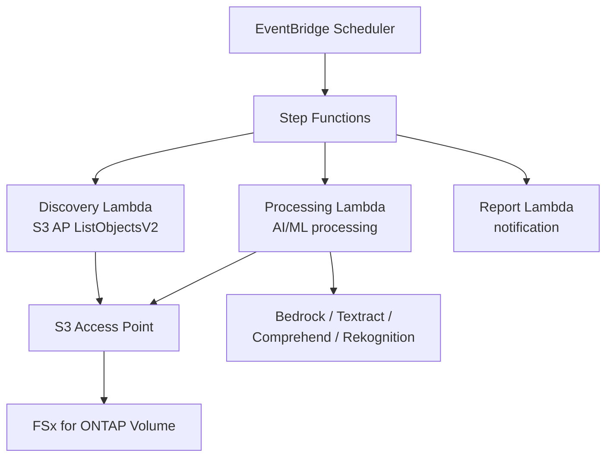

# FSx for ONTAP S3 Access Points — Patterns Serverless

    

🌐 [日本語](README.md) | [English](README.en.md) | [한국어](README.ko.md) | [简体中文](README.zh-CN.md) | [繁體中文](README.zh-TW.md) | [Français](README.fr.md) | [Deutsch](README.de.md) | [Español](README.es.md)

---

> **42 patterns de référence** pour le traitement serverless des données NAS d'entreprise sur FSx for ONTAP via S3 Access Points — **aucune copie de données requise**.
>
> 28 cas d'usage sectoriels + 7 FlexCache/FlexClone + 2 GenAI + SAP + supervision HA + événementiel + distribution Edge + File Portal UI

---

## Démarrage rapide

| Je souhaite... | Guide | Durée |
|---|---|---|
| Essayer une démo sans FSx | [Demo Mode Guide](docs/demo-mode-guide.md) | 5 min |
| Parcourir les fichiers via un portail web | [File Portal UI (Amplify / Nextcloud)](docs/file-portal-amplify-gen2.en.md) | 10 min |
| Déployer un pattern sur AWS | [Deployment Guide](docs/guides/deployment-guide.md) | 30 min |
| Trouver le pattern adapté à ma charge | [Pattern Selection Guide](docs/pattern-selection-guide.md) | 15 min |
| Estimer les coûts | [Cost Calculator](docs/cost-calculator.md) | 5 min |
| Construire un environnement de lab | [Hands-on Lab IaC](infrastructure/handson-lab/) | 60 min |

---

<details>
<summary><strong>📂 Tous les patterns (cliquer pour développer)</strong></summary>

### Cas d'usage sectoriels (UC1-UC28 + SAP)

| # | Répertoire | Secteur | Résumé |
|---|---|---|---|
| UC1 | [`legal-compliance/`](solutions/industry/legal-compliance/) | Juridique | Audit NTFS ACL et rapports de conformité |
| UC2 | [`financial-idp/`](solutions/industry/financial-idp/) | Finance | OCR de factures et extraction d'entités |
| UC3 | [`manufacturing-analytics/`](solutions/industry/manufacturing-analytics/) | Industrie | Capteurs IoT et inspection qualité |
| UC4 | [`media-vfx/`](solutions/industry/media-vfx/) | Médias | Contrôle qualité du rendu VFX |
| UC5 | [`healthcare-dicom/`](solutions/industry/healthcare-dicom/) | Santé | Anonymisation DICOM |
| UC6 | [`semiconductor-eda/`](solutions/industry/semiconductor-eda/) | Semi-conducteur | Validation GDS/OASIS |
| UC7 | [`genomics-pipeline/`](solutions/industry/genomics-pipeline/) | Génomique | Contrôle qualité FASTQ/VCF |
| UC8 | [`energy-seismic/`](solutions/industry/energy-seismic/) | Énergie | Analyse de données sismiques SEG-Y |
| UC9 | [`autonomous-driving/`](solutions/industry/autonomous-driving/) | Automobile | Prétraitement vidéo/LiDAR |
| UC10 | [`construction-bim/`](solutions/industry/construction-bim/) | Construction | Gestion de modèles BIM |
| UC11 | [`retail-catalog/`](solutions/industry/retail-catalog/) | Commerce | Étiquetage d'images produits |
| UC12 | [`logistics-ocr/`](solutions/industry/logistics-ocr/) | Logistique | OCR de documents d'expédition |
| UC13 | [`education-research/`](solutions/industry/education-research/) | Éducation | Classification d'articles |
| UC14 | [`insurance-claims/`](solutions/industry/insurance-claims/) | Assurance | Évaluation des dommages |
| UC15 | [`defense-satellite/`](solutions/industry/defense-satellite/) | Défense | Analyse d'images satellite |
| UC16 | [`government-archives/`](solutions/industry/government-archives/) | Gouvernement | Archives publiques et FOIA |
| UC17 | [`smart-city-geospatial/`](solutions/industry/smart-city-geospatial/) | Ville intelligente | Analyse géospatiale |
| UC18 | [`telecom-network-analytics/`](solutions/industry/telecom-network-analytics/) | Télécoms | Analyse CDR/journaux réseau |
| UC19 | [`adtech-creative-management/`](solutions/industry/adtech-creative-management/) | Publicité | Gestion des actifs créatifs |
| UC20 | [`travel-document-processing/`](solutions/industry/travel-document-processing/) | Voyage | Traitement des documents de réservation |
| UC21 | [`agri-food-traceability/`](solutions/industry/agri-food-traceability/) | Agriculture | Traçabilité |
| UC22 | [`transportation-maintenance/`](solutions/industry/transportation-maintenance/) | Transport | Inspection des équipements |
| UC23 | [`sustainability-esg-reporting/`](solutions/industry/sustainability-esg-reporting/) | ESG | Extraction de métriques |
| UC24 | [`nonprofit-grant-management/`](solutions/industry/nonprofit-grant-management/) | Associatif | Gestion des subventions |
| UC25 | [`utilities-asset-inspection/`](solutions/industry/utilities-asset-inspection/) | Services publics | Analyse drone/SCADA |
| UC26 | [`real-estate-portfolio/`](solutions/industry/real-estate-portfolio/) | Immobilier | Images de biens et contrats |
| UC27 | [`hr-document-screening/`](solutions/industry/hr-document-screening/) | RH | Présélection de CV |
| UC28 | [`chemical-sds-management/`](solutions/industry/chemical-sds-management/) | Chimie | FDS et notes de laboratoire |
| SAP | [`sap/erp-adjacent/`](solutions/sap/erp-adjacent/) | SAP/ERP | Traitement IDoc et EDI |

### FlexCache / FlexClone (FC1-FC7)

| # | Répertoire | Pattern |
|---|---|---|
| FC1 | [`flexcache/anycast-dr/`](solutions/flexcache/anycast-dr/) | AnyCast / basculement DR |
| FC2 | [`flexcache/dynamic-render-workflow/`](solutions/flexcache/dynamic-render-workflow/) | FlexCache dynamique par tâche |
| FC3 | [`flexcache/rag-enterprise-files/`](solutions/flexcache/rag-enterprise-files/) | RAG avec gestion des permissions |
| FC4 | [`flexcache/automotive-cae/`](solutions/flexcache/automotive-cae/) | Analyse de simulation CAE |
| FC5 | [`flexcache/life-sciences-research/`](solutions/flexcache/life-sciences-research/) | Classification de données de recherche |
| FC6 | [`flexcache/gaming-build-pipeline/`](solutions/flexcache/gaming-build-pipeline/) | Contrôle qualité des assets de jeu |
| FC7 | [`flexcache/devops-cicd/`](solutions/flexcache/devops-cicd/) | FlexClone Dev/Test et CI/CD |

### GenAI / HA / Événementiel / Edge / File Portal

| Répertoire | Résumé |
|---|---|
| [`genai/kb-selfservice-curation/`](solutions/genai/kb-selfservice-curation/) | Opérations self-service Bedrock KB |
| [`genai/quick-agentic-workspace/`](solutions/genai/quick-agentic-workspace/) | Espace de travail agentique |
| [`ha/lifekeeper-monitoring/`](solutions/ha/lifekeeper-monitoring/) | Supervision HA LifeKeeper par IA |
| [`event-driven/fpolicy/`](solutions/event-driven/fpolicy/) | Pipeline événementiel FPolicy |
| [`edge/content-delivery/`](solutions/edge/content-delivery/) | Distribution CDN/edge (neutre fournisseur) |
| [`amplify-portal/`](solutions/amplify-portal/) | File Portal UI (Amplify Gen2) |
| [`nextcloud-test/`](solutions/nextcloud-test/) | File Portal UI (Nextcloud Docker) |

### Infrastructure et modules partagés

| Répertoire | Résumé |
|---|---|
| [`shared/`](shared/) | Modules Python communs (S3ApHelper, OntapClient, Observability) |
| [`operations/`](operations/) | 6 patterns d'optimisation opérationnelle |
| [`infrastructure/handson-lab/`](infrastructure/handson-lab/) | IaC Lab pratique (VPC/AD/FSx/EC2/S3AP) |
| [`docs/`](docs/) | Guides de conception et benchmarks (40+ docs) |
| [`scripts/`](scripts/) | Déploiement, benchmarks, utilitaires |
| [`.github/workflows/`](.github/workflows/) | CI/CD (lint → test → security → deploy) |

</details>

---

## Architecture

```
EventBridge Scheduler (déclenchement périodique)
  └→ Step Functions State Machine
      ├→ Discovery Lambda : lister les fichiers via S3 AP
      ├→ Map State (parallèle) : traiter chaque fichier avec AI/ML
      └→ Report Lambda : générer les résultats → notification SNS
```

Ceci est le flux commun partagé par tous les patterns. Les services AI/ML (Bedrock, Textract, Comprehend, Rekognition) varient selon le cas d'usage.

<details>
<summary><strong>Diagramme Mermaid (cliquer pour développer)</strong></summary>



</details>

<details>
<summary><strong>Architectures par catégorie (FlexCache, GenAI, HA, événementiel, Edge)</strong></summary>

Diagrammes d'architecture détaillés par catégorie :
- [FlexCache / FlexClone](docs/industry-workload-mapping.md)
- [GenAI (Bedrock KB / Agentic)](solutions/genai/kb-selfservice-curation/docs/architecture.md)
- [HA LifeKeeper Monitoring](solutions/ha/lifekeeper-monitoring/README.md)
- [Event-Driven FPolicy](solutions/event-driven/fpolicy/README.md)
- [Edge / CDN](solutions/edge/content-delivery/docs/architecture.md)
- [File Portal (Amplify Gen2)](solutions/amplify-portal/README.md)

</details>

---

## Contraintes clés des S3 Access Points

| Contrainte | Solution de contournement |
|---|---|
| Pas de S3 Event Notifications | Polling EventBridge Scheduler ou FPolicy |
| URLs présignées non officielles | Fonctionnent en pratique mais non recommandées en production |
| Limite d'upload de 5 Go | Multipart Upload |
| Impossible d'écrire les résultats Athena sur S3AP | Sortie vers un bucket S3 standard |
| SSE-FSX uniquement | Utiliser le chiffrement KMS au niveau du volume |

Détails : [S3AP Compatibility Notes](docs/s3ap-compatibility-notes.en.md) | [Compatibility Matrix (confirmée par AWS)](https://github.com/Yoshiki0705/fsxn-lakehouse-integrations/blob/main/docs/en/compatibility-matrix.md)

---

<details>
<summary><strong>📚 Articles et dépôts associés</strong></summary>

### Série d'articles

| Sujet | Japonais | Anglais |
|---|---|---|
| Présentation des 42 patterns | [Hatena](https://hakobiya.hatenablog.com/entry/fsxn-s3ap-serverless-part1-introduction) | [dev.to](https://dev.to/aws-builders/industry-specific-serverless-automation-patterns-with-fsx-for-ontap-s3-access-points-3e0a) |
| Architecture de production | [Hatena](https://hakobiya.hatenablog.com/entry/fsxn-s3ap-serverless-part2-production-architecture) | — |
| Baseline opérationnelle | [Hatena](https://hakobiya.hatenablog.com/entry/fsxn-s3ap-serverless-part3-operational-baseline) | [dev.to](https://dev.to/aws-builders/production-rollout-vpc-endpoint-auto-detection-and-the-cdk-no-go-fsx-for-ontap-s3-access-3lni) |
| FPolicy événementiel | [Hatena](https://hakobiya.hatenablog.com/entry/fsxn-s3ap-serverless-part4-event-driven-fpolicy) | [dev.to](https://dev.to/aws-builders/fpolicy-event-driven-pipeline-multi-account-stacksets-and-cost-optimization-fsx-for-ontap-s3-5bd6) |
| 28 patterns sectoriels | [Hatena](https://hakobiya.hatenablog.com/entry/fsxn-s3ap-serverless-part5-field-ready-28-patterns) | [dev.to](https://dev.to/aws-builders/from-serverless-patterns-to-field-ready-reference-architecture-fsx-for-ontap-s3-access-points-dhj) |
| Intégration GenAI | [Hatena](https://hakobiya.hatenablog.com/entry/fsxn-s3ap-serverless-part6-genai-42-patterns) | — |

### Dépôts associés

| Dépôt | Résumé |
|---|---|
| [Permission-aware-RAG-FSxN-CDK](https://github.com/Yoshiki0705/Permission-aware-RAG-FSxN-CDK-github) | Chatbot RAG avec gestion des permissions (CDK + Next.js + ECS) |
| [fsxn-lakehouse-integrations](https://github.com/Yoshiki0705/fsxn-lakehouse-integrations) | Intégration Lakehouse (Databricks, Snowflake, Athena, Glue, EMR) |
| [vmware-migration-ec2-ontap](https://github.com/Yoshiki0705/vmware-migration-ec2-ontap) | Migration VMware → EC2 + FSx for ONTAP |

</details>

<details>
<summary><strong>🔧 Guide développeur (tests et contribution)</strong></summary>

### Tests

```bash
pytest shared/tests/ -v                    # Unit tests
ruff check . && ruff format --check .      # Python linter
cfn-lint solutions/industry/*/template.yaml # CloudFormation validation
```

### Stack technique

Python 3.12 | CloudFormation + SAM | Lambda (ARM64) | Step Functions | EventBridge | Bedrock / Textract / Comprehend / Rekognition | Secrets Manager | Athena + Glue

### Contribuer

Les Issues et Pull Requests sont les bienvenues. Voir [CONTRIBUTING.md](CONTRIBUTING.md).

</details>

---

## Licence

MIT — [LICENSE](LICENSE)

---

🌐 [日本語](README.md) | [English](README.en.md) | [한국어](README.ko.md) | [简体中文](README.zh-CN.md) | [繁體中文](README.zh-TW.md) | [Français](README.fr.md) | [Deutsch](README.de.md) | [Español](README.es.md)
