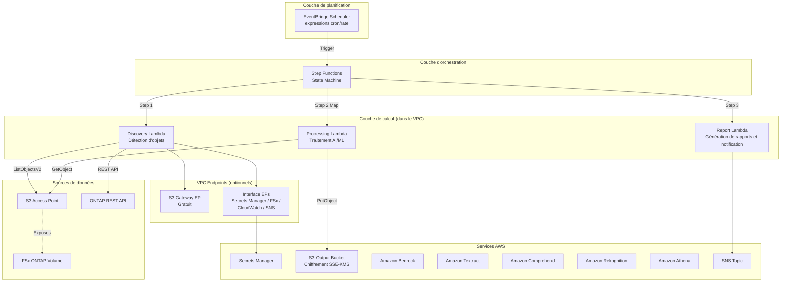

# FSx for ONTAP S3 Access Points Serverless Patterns

🌐 **Language / 言語**: [日本語](README.md) | [English](README.en.md) | [한국어](README.ko.md) | [简体中文](README.zh-CN.md) | [繁體中文](README.zh-TW.md) | [Français](README.fr.md) | [Deutsch](README.de.md) | [Español](README.es.md)

Collection de modèles d'automatisation serverless par secteur d'activité, exploitant les S3 Access Points d'Amazon FSx for NetApp ONTAP.

> **Positionnement de ce dépôt** : Il s'agit d'une « implémentation de référence pour apprendre les décisions de conception ». Certains cas d'usage ont été entièrement vérifiés E2E dans un environnement AWS, tandis que les autres ont été validés par le déploiement CloudFormation, le Lambda Discovery partagé et les tests des composants principaux. L'objectif est de démontrer les décisions de conception en matière d'optimisation des coûts, de sécurité et de gestion des erreurs à travers du code concret, avec un chemin du PoC à la production.

## Article associé

Ce dépôt fournit les exemples d'implémentation de l'architecture décrite dans l'article suivant :

- **FSx for ONTAP S3 Access Points as a Serverless Automation Boundary — AI Data Pipelines, Volume-Level SnapMirror DR, and Capacity Guardrails**
  https://dev.to/yoshikifujiwara/fsx-for-ontap-s3-access-points-as-a-serverless-automation-boundary-ai-data-pipelines-ili

L'article explique le raisonnement architectural et les compromis. Ce dépôt fournit des modèles d'implémentation concrets et réutilisables.

## Présentation

Ce dépôt fournit **5 modèles sectoriels** pour le traitement serverless des données d'entreprise stockées sur FSx for NetApp ONTAP via les **S3 Access Points**.

> Dans la suite de ce document, FSx for ONTAP S3 Access Points est abrégé en **S3 AP**.

Chaque cas d'usage est autonome sous forme de template CloudFormation indépendant, avec des modules partagés (client ONTAP REST API, helper FSx, helper S3 AP) dans `shared/` pour réutilisation.

### Caractéristiques principales

- **Architecture par interrogation** : S3 AP ne prenant pas en charge `GetBucketNotificationConfiguration`, exécution périodique via EventBridge Scheduler + Step Functions
- **Séparation des modules partagés** : OntapClient / FsxHelper / S3ApHelper réutilisés dans tous les cas d'usage
- **CloudFormation / SAM Transform** : Chaque cas d'usage est un template CloudFormation autonome utilisant SAM Transform
- **Sécurité avant tout** : Vérification TLS activée par défaut, IAM à moindre privilège, chiffrement KMS
- **Optimisation des coûts** : Les ressources permanentes coûteuses (Interface VPC Endpoints, etc.) sont optionnelles

## Architecture



> Le diagramme montre une configuration Lambda dans le VPC orientée production. Pour le PoC / démo, si le network origin du S3 AP est `internet`, une configuration Lambda hors VPC peut également être choisie. Voir « Guide de choix du placement Lambda » ci-dessous pour plus de détails.

### Vue d'ensemble du workflow

```
EventBridge Scheduler (exécution périodique)
  └─→ Step Functions State Machine
       ├─→ Discovery Lambda : Récupération de la liste d'objets depuis S3 AP → Génération du Manifest
       ├─→ Map State (traitement parallèle) : Traitement de chaque objet avec les services AI/ML
       └─→ Report/Notification : Génération du rapport de résultats → Notification SNS
```

## Liste des cas d'usage

### Phase 1 (UC1–UC5)

| # | Répertoire | Secteur | Modèle | Services AI/ML utilisés | Statut de vérification ap-northeast-1 |
|---|------------|---------|--------|------------------------|--------------------------------------|
| UC1 | `legal-compliance/` | Juridique et conformité | Audit de serveur de fichiers et gouvernance des données | Athena, Bedrock | ✅ E2E réussi |
| UC2 | `financial-idp/` | Finance et assurance | Traitement automatisé de contrats et factures (IDP) | Textract ⚠️, Comprehend, Bedrock | ⚠️ Non dispo. à Tokyo (utiliser région compatible) |
| UC3 | `manufacturing-analytics/` | Industrie manufacturière | Analyse de journaux de capteurs IoT et d'images de contrôle qualité | Athena, Rekognition | ✅ E2E réussi |
| UC4 | `media-vfx/` | Médias | Pipeline de rendu VFX | Rekognition, Deadline Cloud | ⚠️ Configuration Deadline Cloud requise |
| UC5 | `healthcare-dicom/` | Santé | Classification automatique et anonymisation d'images DICOM | Rekognition, Comprehend Medical ⚠️ | ⚠️ Non dispo. à Tokyo (utiliser région compatible) |

### Phase 2 (UC6–UC14)

| # | Répertoire | Secteur | Modèle | Services AI/ML utilisés | Statut de vérification ap-northeast-1 |
|---|------------|---------|--------|------------------------|--------------------------------------|
| UC6 | `semiconductor-eda/` | Semi-conducteurs / EDA | Validation GDS/OASIS, extraction de métadonnées, agrégation DRC | Athena, Bedrock | ✅ Tests réussis |
| UC7 | `genomics-pipeline/` | Génomique | Contrôle qualité FASTQ/VCF, agrégation d'appels de variants | Athena, Bedrock, Comprehend Medical ⚠️ | ⚠️ Cross-Region (us-east-1) |
| UC8 | `energy-seismic/` | Énergie | Extraction de métadonnées SEG-Y, détection d'anomalies de puits | Athena, Bedrock, Rekognition | ✅ Tests réussis |
| UC9 | `autonomous-driving/` | Conduite autonome / ADAS | Prétraitement vidéo/LiDAR, QC, annotation | Rekognition, Bedrock, SageMaker | ✅ Tests réussis |
| UC10 | `construction-bim/` | Construction / AEC | Gestion de versions BIM, OCR de plans, conformité sécurité | Textract ⚠️, Bedrock, Rekognition | ⚠️ Cross-Region (us-east-1) |
| UC11 | `retail-catalog/` | Commerce / E-commerce | Étiquetage d'images produits, génération de métadonnées catalogue | Rekognition, Bedrock | ✅ Tests réussis |
| UC12 | `logistics-ocr/` | Logistique | OCR de bordereaux, analyse d'images d'inventaire | Textract ⚠️, Rekognition, Bedrock | ⚠️ Cross-Region (us-east-1) |
| UC13 | `education-research/` | Éducation / Recherche | Classification de PDF, analyse de réseau de citations | Textract ⚠️, Comprehend, Bedrock | ⚠️ Cross-Region (us-east-1) |
| UC14 | `insurance-claims/` | Assurance | Évaluation de dommages photo, OCR de devis, rapport de sinistre | Rekognition, Textract ⚠️, Bedrock | ⚠️ Cross-Region (us-east-1) |

> **Contraintes régionales** : Amazon Textract et Amazon Comprehend Medical ne sont pas disponibles dans ap-northeast-1 (Tokyo). Les UC Phase 2 (UC7, UC10, UC12, UC13, UC14) utilisent Cross_Region_Client pour router les appels API vers us-east-1. Rekognition, Comprehend, Bedrock et Athena sont disponibles dans ap-northeast-1.
> 
> Référence : [Régions prises en charge par Textract](https://docs.aws.amazon.com/general/latest/gr/textract.html) | [Régions prises en charge par Comprehend Medical](https://docs.aws.amazon.com/general/latest/gr/comprehend-med.html)

## Guide de sélection de région

Cette collection de patterns est vérifiée dans **ap-northeast-1 (Tokyo)**, mais peut être déployée dans toute région AWS où les services requis sont disponibles.

### Liste de vérification pré-déploiement

1. Vérifier la disponibilité des services sur la [AWS Regional Services List](https://aws.amazon.com/about-aws/global-infrastructure/regional-product-services/)
2. Vérifier les services Phase 3 :
   - **Kinesis Data Streams** : Disponible dans presque toutes les régions (tarification des shards variable selon la région)
   - **SageMaker Batch Transform** : Disponibilité des types d'instances variable selon la région
   - **X-Ray / CloudWatch EMF** : Disponible dans presque toutes les régions
3. Confirmer les régions cibles pour les services Cross-Region (Textract, Comprehend Medical)

Voir la [Matrice de compatibilité régionale](docs/region-compatibility.md) pour plus de détails.

### Résumé des fonctionnalités Phase 3

| Fonctionnalité | Description | UC cible |
|----------------|-------------|----------|
| Streaming Kinesis | Détection et traitement des changements de fichiers en quasi-temps réel | UC11 (opt-in) |
| SageMaker Batch Transform | Inférence de segmentation de nuage de points (Callback Pattern) | UC9 (opt-in) |
| Traçage X-Ray | Traçage distribué pour la visualisation des chemins d'exécution | Tous les 14 UC |
| CloudWatch EMF | Sortie de métriques structurées (FilesProcessed, Duration, Errors) | Tous les 14 UC |
| Tableau de bord d'observabilité | Affichage centralisé des métriques de tous les UC | Partagé |
| Automatisation des alertes | Notifications SNS basées sur les seuils de taux d'erreur | Partagé |

Voir le [Guide de sélection Streaming vs Polling](docs/streaming-vs-polling-guide-fr.md) pour plus de détails.

### Résumé des fonctionnalités Phase 4

| Fonctionnalité | Description | UC cible |
|----------------|-------------|----------|
| DynamoDB Task Token Store | Gestion sécurisée des Tokens pour le SageMaker Callback Pattern (approche Correlation ID) | UC9 (opt-in) |
| Real-time Inference Endpoint | Inférence à faible latence via SageMaker Real-time Endpoint | UC9 (opt-in) |
| A/B Testing | Comparaison de versions de modèles via Multi-Variant Endpoint | UC9 (opt-in) |
| Model Registry | Gestion du cycle de vie des modèles via SageMaker Model Registry | UC9 (opt-in) |
| Multi-Account Deployment | Support multi-comptes via StackSets / Cross-Account IAM / politiques S3 AP | Tous les UC (modèles fournis) |
| Event-Driven Prototype | Pipeline S3 Event Notifications → EventBridge → Step Functions | Prototype |

Toutes les fonctionnalités Phase 4 sont contrôlées par des CloudFormation Conditions (opt-in). Aucun coût supplémentaire n'est engendré sauf activation explicite.

Voir les documents suivants pour plus de détails :
- [Guide de comparaison des coûts d'inférence](docs/inference-cost-comparison.md)
- [Guide Model Registry](docs/model-registry-guide.md)
- [Résultats PoC Multi-Account](docs/multi-account/poc-results.md)
- [Conception d'architecture Event-Driven](docs/event-driven/architecture-design.md)

### Captures d'écran

> Les images suivantes sont des exemples capturés dans un environnement de vérification. Les informations spécifiques à l'environnement (identifiants de compte, etc.) ont été masquées.

#### Vérification du déploiement et de l'exécution de Step Functions pour les 5 UC


> UC1 et UC3 ont fait l'objet d'une vérification E2E complète, tandis que UC2, UC4 et UC5 ont fait l'objet d'un déploiement CloudFormation et d'une vérification opérationnelle des composants principaux. Lors de l'utilisation de services AI/ML avec des contraintes régionales (Textract, Comprehend Medical), un appel inter-régions vers les régions prises en charge est nécessaire. Veuillez vérifier les exigences de résidence des données et de conformité.

#### Phase 2 : Déploiement CloudFormation et exécution Step Functions réussis pour les 9 UC


> Les 9 piles (UC6–UC14) ont atteint CREATE_COMPLETE / UPDATE_COMPLETE. Total de 205 ressources.


> Les 9 workflows sont actifs. Tous SUCCEEDED confirmés après exécution E2E avec données de test.


> Détail d'exécution Step Functions UC6 (Semi-conducteurs EDA). Tous les états réussis : Discovery → ProcessObjects (Map) → DrcAggregation → ReportGeneration.


> Les 9 planifications EventBridge Scheduler (rate(1 hour)) sont activées.

#### Écrans des services AI/ML (Phase 1)

##### Amazon Bedrock — Catalogue de modèles


##### Amazon Rekognition — Détection d'étiquettes


##### Amazon Comprehend — Détection d'entités


#### Écrans des services AI/ML (Phase 2)

##### Amazon Bedrock — Catalogue de modèles (UC6 : Génération de rapports)


> Utilisé pour la génération de rapports DRC avec le modèle Nova Lite dans UC6 (Semi-conducteurs EDA).

##### Amazon Athena — Historique d'exécution des requêtes (UC6 : Agrégation de métadonnées)


> Requêtes Athena (cell_count, bbox, naming, invalid) exécutées dans le workflow Step Functions UC6.

##### Amazon Rekognition — Détection d'étiquettes (UC11 : Étiquetage d'images produits)


> 15 étiquettes détectées (Lighting 98,5%, Light 96,0%, Purple 92,0%, etc.) à partir d'images produits dans UC11 (Catalogue de détail).

##### Amazon Textract — OCR de documents (UC12 : Lecture de bordereaux de livraison)


> Extraction de texte à partir de PDF de bordereaux de livraison dans UC12 (OCR logistique). Exécuté via Cross-Region (us-east-1).

##### Amazon Comprehend Medical — Détection d'entités médicales (UC7 : Analyse génomique)


> Noms de gènes (GC) extraits des résultats d'analyse VCF à l'aide de l'API DetectEntitiesV2 dans UC7 (Pipeline génomique). Exécuté via Cross-Region (us-east-1).

##### Fonctions Lambda (Phase 2)


> Toutes les fonctions Lambda Phase 2 (Discovery, Processing, Report, etc.) déployées avec succès.

#### Phase 3 : Traitement en temps réel, intégration SageMaker et observabilité

##### Exécution E2E Step Functions réussie (UC11)


> Exécution E2E du workflow Step Functions UC11 réussie. Discovery → ImageTagging Map → CatalogMetadata Map → QualityCheck tous les états réussis (8,974s). Génération de traces X-Ray confirmée.

##### Kinesis Data Streams (UC11 Mode streaming)


> UC11 Kinesis Data Stream (1 shard, mode provisionné) en état actif. Métriques de surveillance affichées.

##### Tables DynamoDB de gestion d'état (UC11 Détection de changements)


> Tables DynamoDB de détection de changements UC11. streaming-state (gestion d'état) et streaming-dead-letter (DLQ).

##### Stack d'observabilité


> Traces X-Ray. Traces d'exécution du Lambda Stream Producer à intervalles d'1 minute (tous OK, latence 7-11ms).


> Tableau de bord CloudWatch centralisé surveillant les 14 cas d'utilisation. Succès/échecs Step Functions, taux d'erreurs Lambda, métriques personnalisées EMF.


> Automatisation des alertes Phase 3. Alarmes basées sur des seuils pour les échecs Step Functions, les taux d'erreurs Lambda et l'âge de l'itérateur Kinesis (tous en état OK).

##### Vérification S3 Access Point


> FSx for ONTAP S3 Access Point (fsxn-eda-s3ap) en état Available. Confirmé via l'onglet S3 du volume dans la console FSx.

#### Phase 4 : Intégration SageMaker production, inférence temps réel, multi-compte, événementiel

##### DynamoDB Task Token Store


> Table DynamoDB Task Token Store. Stocke les Task Tokens avec un Correlation ID hex de 8 caractères comme clé de partition. TTL activé, mode PAY_PER_REQUEST, GSI (TransformJobNameIndex) configuré.

##### SageMaker Real-time Endpoint (Multi-Variant A/B Testing)


> SageMaker Real-time Inference Endpoint. Configuration Multi-Variant (model-v1 : 70%, model-v2 : 30%) pour les tests A/B. Auto Scaling configuré.

##### Workflow Step Functions (Routage Realtime/Batch)


> Workflow Step Functions UC9. Le Choice State route vers le Real-time Endpoint lorsque file_count < threshold, sinon vers Batch Transform.

##### Event-Driven Prototype — Règle EventBridge


> Règle EventBridge du prototype Event-Driven. Filtre les événements S3 ObjectCreated par suffix (.jpg, .png) + prefix (products/) et déclenche Step Functions.

##### Event-Driven Prototype — Exécution Step Functions réussie


> Exécution Step Functions du prototype Event-Driven réussie. S3 PutObject → EventBridge → Step Functions → EventProcessor → LatencyReporter tous les états réussis.

##### Stacks CloudFormation Phase 4


> Stacks CloudFormation Phase 4. Extension UC9 (Task Token Store + Real-time Endpoint) et prototype Event-Driven CREATE_COMPLETE.

## Stack technique

| Couche | Technologie |
|--------|------------|
| Langage | Python 3.12 |
| IaC | CloudFormation (YAML) + SAM Transform |
| Calcul | AWS Lambda (Production : dans le VPC / PoC : hors VPC possible) |
| Orchestration | AWS Step Functions |
| Planification | Amazon EventBridge Scheduler |
| Stockage | FSx for ONTAP (S3 AP) + Bucket S3 de sortie (SSE-KMS) |
| Notification | Amazon SNS |
| Analytique | Amazon Athena + AWS Glue Data Catalog |
| AI/ML | Amazon Bedrock, Textract, Comprehend, Rekognition |
| Sécurité | Secrets Manager, KMS, IAM moindre privilège |
| Tests | pytest + Hypothesis (PBT), moto, cfn-lint, ruff |

## Prérequis

- **Compte AWS** : Un compte AWS valide avec les permissions IAM appropriées
- **FSx for NetApp ONTAP** : Un système de fichiers déployé
  - Version ONTAP : Une version prenant en charge les S3 Access Points (vérifié avec 9.17.1P4D3)
  - Un volume FSx for ONTAP avec un S3 Access Point associé (network origin selon le cas d'usage ; `internet` recommandé pour Athena / Glue)
- **Réseau** : VPC, sous-réseaux privés, tables de routage
- **Secrets Manager** : Pré-enregistrer les identifiants ONTAP REST API (format : `{"username":"fsxadmin","password":"..."}`)
- **Bucket S3** : Pré-créer un bucket pour les packages de déploiement Lambda (ex. : `fsxn-s3ap-deploy-<account-id>`)
- **Python 3.12+** : Pour le développement et les tests locaux
- **AWS CLI v2** : Pour le déploiement et la gestion

### Commandes de préparation

```bash
# 1. Créer le bucket S3 de déploiement
ACCOUNT_ID=$(aws sts get-caller-identity --query Account --output text)
aws s3 mb "s3://fsxn-s3ap-deploy-${ACCOUNT_ID}" --region $AWS_DEFAULT_REGION

# 2. Enregistrer les identifiants ONTAP dans Secrets Manager
aws secretsmanager create-secret \
  --name fsxn-ontap-credentials \
  --secret-string '{"username":"fsxadmin","password":"<your-ontap-password>"}' \
  --region $AWS_DEFAULT_REGION

# 3. Vérifier l'existence d'un S3 Gateway Endpoint (pour éviter la duplication)
aws ec2 describe-vpc-endpoints \
  --filters "Name=vpc-id,Values=<your-vpc-id>" "Name=service-name,Values=com.amazonaws.${AWS_DEFAULT_REGION}.s3" \
  --query 'VpcEndpoints[*].{Id:VpcEndpointId,State:State}' \
  --output table
# → Si des résultats existent, déployer avec EnableS3GatewayEndpoint=false
```

### Guide de choix du placement Lambda

| Usage | Placement recommandé | Raison |
|-------|---------------------|--------|
| Démo / PoC | Lambda hors VPC | Pas de VPC Endpoint nécessaire, faible coût, configuration simple |
| Production / exigences de réseau privé | Lambda dans le VPC | Secrets Manager / FSx / SNS accessibles via PrivateLink |
| UC utilisant Athena / Glue | S3 AP network origin : `internet` | Accès depuis les services gérés AWS nécessaire |

### Notes sur l'accès au S3 AP depuis Lambda dans le VPC

> **Constatations importantes confirmées lors de la vérification du déploiement UC1 (2026-05-03)**

- **L'association de la table de routage du S3 Gateway Endpoint est obligatoire** : Si vous ne spécifiez pas les ID de table de routage des sous-réseaux privés dans `RouteTableIds`, l'accès depuis Lambda dans le VPC vers S3 / S3 AP expirera
- **Vérifier la résolution DNS du VPC** : Assurez-vous que `enableDnsSupport` / `enableDnsHostnames` sont activés sur le VPC
- **L'exécution de Lambda hors VPC est recommandée pour les environnements PoC / démo** : Si le network origin du S3 AP est `internet`, Lambda hors VPC peut y accéder sans problème. Pas de VPC Endpoint nécessaire, réduisant les coûts et simplifiant la configuration
- Voir le [Guide de dépannage](docs/guides/troubleshooting-guide.md#6-lambda-vpc-内実行時の-s3-ap-タイムアウト) pour plus de détails

### Quotas de services AWS requis

| Service | Quota | Valeur recommandée |
|---------|-------|-------------------|
| Exécutions simultanées Lambda | ConcurrentExecutions | 100 ou plus |
| Exécutions Step Functions | StartExecution/sec | Par défaut (25) |
| S3 Access Point | AP par compte | Par défaut (10 000) |

## Démarrage rapide

### 1. Cloner le dépôt

```bash
git clone https://github.com/Yoshiki0705/FSx-for-ONTAP-S3AccessPoints-Serverless-Patterns.git
cd FSx-for-ONTAP-S3AccessPoints-Serverless-Patterns
```

### 2. Installer les dépendances

```bash
pip install -r requirements.txt
pip install -r requirements-dev.txt
```

### 3. Exécuter les tests

```bash
# Tests unitaires (avec couverture)
pytest shared/tests/ --cov=shared --cov-report=term-missing -v

# Tests basés sur les propriétés
pytest shared/tests/test_properties.py -v

# Linter
ruff check .
ruff format --check .
```

### 4. Déployer un cas d'usage (exemple : UC1 Juridique et conformité)

> ⚠️ **Notes importantes sur l'impact sur les environnements existants**
>
> Veuillez vérifier les points suivants avant le déploiement :
>
> | Paramètre | Impact sur l'environnement existant | Méthode de vérification |
> |-----------|-------------------------------------|------------------------|
> | `VpcId` / `PrivateSubnetIds` | Des ENI Lambda seront créées dans le VPC/sous-réseaux spécifiés | `aws ec2 describe-network-interfaces --filters Name=group-id,Values=<sg-id>` |
> | `EnableS3GatewayEndpoint=true` | Un S3 Gateway Endpoint sera ajouté au VPC. **Définir sur `false` si un S3 Gateway Endpoint existe déjà dans le même VPC** | `aws ec2 describe-vpc-endpoints --filters Name=vpc-id,Values=<vpc-id>` |
> | `PrivateRouteTableIds` | Le S3 Gateway Endpoint sera associé aux tables de routage. Pas d'impact sur le routage existant | `aws ec2 describe-route-tables --route-table-ids <rtb-id>` |
> | `ScheduleExpression` | EventBridge Scheduler exécutera périodiquement Step Functions. **La planification peut être désactivée après le déploiement pour éviter les exécutions inutiles** | Console AWS → EventBridge → Schedules |
> | `NotificationEmail` | Un e-mail de confirmation d'abonnement SNS sera envoyé | Vérifier la boîte de réception |
>
> **Notes sur la suppression de la pile** :
> - La suppression échouera si des objets restent dans le bucket S3 (Athena Results). Videz-le d'abord avec `aws s3 rm s3://<bucket> --recursive`
> - Pour les buckets avec versioning activé, toutes les versions doivent être supprimées avec `aws s3api delete-objects`
> - La suppression des VPC Endpoints peut prendre 5 à 15 minutes
> - La libération des ENI Lambda peut prendre du temps, causant l'échec de la suppression du Security Group. Attendez quelques minutes et réessayez

```bash
# Définir la région (gérée via variable d'environnement)
export AWS_DEFAULT_REGION=us-east-1  # Région prenant en charge tous les services recommandée

# Empaquetage Lambda
./scripts/deploy_uc.sh legal-compliance package

# Déploiement CloudFormation
aws cloudformation create-stack \
  --stack-name fsxn-legal-compliance \
  --template-body file://legal-compliance/template-deploy.yaml \
  --capabilities CAPABILITY_NAMED_IAM \
  --parameters \
    ParameterKey=DeployBucket,ParameterValue=<your-deploy-bucket> \
    ParameterKey=S3AccessPointAlias,ParameterValue=<your-volume-ext-s3alias> \
    ParameterKey=S3AccessPointOutputAlias,ParameterValue=<your-output-volume-ext-s3alias> \
    ParameterKey=OntapSecretName,ParameterValue=<your-ontap-secret-name> \
    ParameterKey=OntapManagementIp,ParameterValue=<your-ontap-management-ip> \
    ParameterKey=SvmUuid,ParameterValue=<your-svm-uuid> \
    ParameterKey=VolumeUuid,ParameterValue=<your-volume-uuid> \
    ParameterKey=VpcId,ParameterValue=<your-vpc-id> \
    'ParameterKey=PrivateSubnetIds,ParameterValue=<subnet-1>,<subnet-2>' \
    'ParameterKey=PrivateRouteTableIds,ParameterValue=<rtb-1>,<rtb-2>' \
    ParameterKey=NotificationEmail,ParameterValue=<your-email@example.com> \
    ParameterKey=EnableVpcEndpoints,ParameterValue=true \
    ParameterKey=EnableS3GatewayEndpoint,ParameterValue=true
```

> **Note** : Remplacez les espaces réservés `<...>` par les valeurs réelles de votre environnement.
>
> **À propos de `EnableVpcEndpoints`** : Le Quick Start spécifie `true` pour assurer la connectivité depuis Lambda dans le VPC vers Secrets Manager / CloudWatch / SNS. Si vous disposez d'Interface VPC Endpoints ou d'un NAT Gateway existants, vous pouvez spécifier `false` pour réduire les coûts.
> 
> **Sélection de la région** : `us-east-1` ou `us-west-2` est recommandé là où tous les services AI/ML sont disponibles. Textract et Comprehend Medical ne sont pas disponibles dans `ap-northeast-1` (l'appel inter-régions peut être utilisé comme solution de contournement). Voir la [Matrice de compatibilité régionale](docs/region-compatibility.md) pour plus de détails.
>
> **Connectivité VPC** : Discovery Lambda est placé à l'intérieur du VPC. L'accès à l'API REST ONTAP et au S3 Access Point nécessite un NAT Gateway ou des Interface VPC Endpoints. Définissez `EnableVpcEndpoints=true` ou utilisez un NAT Gateway existant.

### Environnement vérifié

| Élément | Valeur |
|---------|--------|
| Région AWS | ap-northeast-1 (Tokyo) |
| Version FSx ONTAP | ONTAP 9.17.1P4D3 |
| Configuration FSx | SINGLE_AZ_1 |
| Python | 3.12 |
| Méthode de déploiement | CloudFormation (utilisant SAM Transform) |

Le déploiement de la pile CloudFormation et la vérification opérationnelle du Discovery Lambda ont été effectués pour les 5 cas d'usage.
Voir les [Résultats de vérification](docs/verification-results.md) pour plus de détails.

## Résumé de la structure des coûts

### Estimations de coûts par environnement

| Environnement | Coût fixe/mois | Coût variable/mois | Total/mois |
|---------------|---------------|--------------------:|------------|
| Démo/PoC | ~0 $ | ~1–3 $ | **~1–3 $** |
| Production (1 UC) | ~29 $ | ~1–3 $ | **~30–32 $** |
| Production (5 UC) | ~29 $ | ~5–15 $ | **~34–44 $** |

### Classification des coûts

- **Basé sur les requêtes (paiement à l'usage)** : Lambda, Step Functions, S3 API, Textract, Comprehend, Rekognition, Bedrock, Athena — 0 $ si non utilisé
- **Permanent (coût fixe)** : Interface VPC Endpoints (~28,80 $/mois) — **Optionnel (opt-in)**

> Le Quick Start spécifie `EnableVpcEndpoints=true` pour prioriser la connectivité de Lambda dans le VPC. Pour un PoC à faible coût, envisagez d'utiliser Lambda hors VPC ou de tirer parti des NAT / Interface VPC Endpoints existants.

> Voir [docs/cost-analysis.md](docs/cost-analysis.md) pour une analyse détaillée des coûts.

### Ressources optionnelles

Les ressources permanentes coûteuses sont rendues optionnelles via les paramètres CloudFormation.

| Ressource | Paramètre | Par défaut | Coût fixe mensuel | Description |
|-----------|-----------|------------|-------------------|-------------|
| Interface VPC Endpoints | `EnableVpcEndpoints` | `false` | ~28,80 $ | Pour Secrets Manager, FSx, CloudWatch, SNS. `true` recommandé pour la production. Le Quick Start spécifie `true` pour la connectivité |
| CloudWatch Alarms | `EnableCloudWatchAlarms` | `false` | ~0,10 $/alarme | Surveillance du taux d'échec Step Functions, taux d'erreur Lambda |

> Le **S3 Gateway VPC Endpoint** n'a pas de frais horaires supplémentaires, son activation est donc recommandée pour les configurations où Lambda dans le VPC accède au S3 AP. Cependant, spécifiez `EnableS3GatewayEndpoint=false` si un S3 Gateway Endpoint existe déjà ou si Lambda est placé hors VPC pour le PoC / démo. Les frais standard pour les requêtes API S3, le transfert de données et l'utilisation des services AWS individuels s'appliquent toujours.

## Modèle de sécurité et d'autorisation

Cette solution combine **plusieurs couches d'autorisation**, chacune ayant un rôle différent :

| Couche | Rôle | Portée du contrôle |
|--------|------|-------------------|
| **IAM** | Contrôle d'accès aux services AWS et aux S3 Access Points | Rôle d'exécution Lambda, politique S3 AP |
| **S3 Access Point** | Définit les limites d'accès via les utilisateurs du système de fichiers associés au S3 AP | Politique S3 AP, network origin, utilisateurs associés |
| **Système de fichiers ONTAP** | Applique les permissions au niveau des fichiers | Permissions UNIX / ACL NTFS |
| **ONTAP REST API** | N'expose que les métadonnées et les opérations du plan de contrôle | Authentification Secrets Manager + TLS |

**Considérations de conception importantes** :

- L'API S3 n'expose pas les ACL au niveau des fichiers. Les informations de permissions de fichiers ne peuvent être obtenues que **via l'ONTAP REST API** (la collecte ACL de UC1 utilise ce modèle)
- L'accès via S3 AP est autorisé côté ONTAP en tant qu'utilisateur du système de fichiers UNIX / Windows associé au S3 AP, après avoir été autorisé par les politiques IAM / S3 AP
- Les identifiants ONTAP REST API sont gérés dans Secrets Manager et ne sont pas stockés dans les variables d'environnement Lambda

## Matrice de compatibilité

| Élément | Valeur / Détails de vérification |
|---------|--------------------------------|
| Version ONTAP | Vérifié avec 9.17.1P4D3 (une version prenant en charge les S3 Access Points est requise) |
| Région vérifiée | ap-northeast-1 (Tokyo) |
| Région recommandée | us-east-1 / us-west-2 (lors de l'utilisation de tous les services AI/ML) |
| Version Python | 3.12+ |
| CloudFormation Transform | AWS::Serverless-2016-10-31 |
| Style de sécurité du volume vérifié | UNIX, NTFS |

### API prises en charge par FSx ONTAP S3 Access Points

Sous-ensemble d'API disponible via S3 AP :

| API | Prise en charge |
|-----|----------------|
| ListObjectsV2 | ✅ |
| GetObject | ✅ |
| PutObject | ✅ (max 5 Go) |
| HeadObject | ✅ |
| DeleteObject | ✅ |
| DeleteObjects | ✅ |
| CopyObject | ✅ (même AP, même région) |
| GetObjectAttributes | ✅ |
| GetObjectTagging / PutObjectTagging | ✅ |
| CreateMultipartUpload | ✅ |
| UploadPart / UploadPartCopy | ✅ |
| CompleteMultipartUpload | ✅ |
| AbortMultipartUpload | ✅ |
| ListParts / ListMultipartUploads | ✅ |
| HeadBucket / GetBucketLocation | ✅ |
| GetBucketNotificationConfiguration | ❌ (Non pris en charge → raison de la conception par interrogation) |
| Presign | ❌ |

### Contraintes de network origin des S3 Access Points

| Network origin | Lambda (hors VPC) | Lambda (dans le VPC) | Athena / Glue | UC recommandés |
|---------------|-------------------|---------------------|--------------|----------------|
| **internet** | ✅ | ✅ (via S3 Gateway EP) | ✅ | UC1, UC3 (utilise Athena) |
| **VPC** | ❌ | ✅ (S3 Gateway EP requis) | ❌ | UC2, UC4, UC5 (sans Athena) |

> **Important** : Athena / Glue accèdent depuis l'infrastructure gérée AWS, ils ne peuvent donc pas accéder aux S3 AP avec un origin VPC. UC1 (Juridique) et UC3 (Industrie) utilisent Athena, le S3 AP doit donc être créé avec un network origin **internet**.

### Limitations du S3 AP

- **Taille maximale PutObject** : 5 Go. Les API multipart upload sont prises en charge, mais vérifiez la faisabilité du téléchargement pour les objets dépassant 5 Go au cas par cas.
- **Chiffrement** : SSE-FSX uniquement (FSx gère de manière transparente, pas de paramètre ServerSideEncryption nécessaire)
- **ACL** : Seul `bucket-owner-full-control` est pris en charge
- **Fonctionnalités non prises en charge** : Object Versioning, Object Lock, Object Lifecycle, Static Website Hosting, Requester Pays, Presigned URL

## Documentation

Les guides détaillés et les captures d'écran sont stockés dans le répertoire `docs/`.

| Document | Description |
|----------|-------------|
| [docs/guides/deployment-guide.md](docs/guides/deployment-guide.md) | Guide de déploiement (vérification des prérequis → préparation des paramètres → déploiement → vérification) |
| [docs/guides/operations-guide.md](docs/guides/operations-guide.md) | Guide d'exploitation (modifications de planification, exécution manuelle, revue des journaux, réponse aux alarmes) |
| [docs/guides/troubleshooting-guide.md](docs/guides/troubleshooting-guide.md) | Dépannage (AccessDenied, VPC Endpoint, timeout ONTAP, Athena) |
| [docs/cost-analysis.md](docs/cost-analysis.md) | Analyse de la structure des coûts |
| [docs/references.md](docs/references.md) | Liens de référence |
| [docs/extension-patterns.md](docs/extension-patterns.md) | Guide des modèles d'extension |
| [docs/region-compatibility.md](docs/region-compatibility.md) | Disponibilité des services AI/ML par région AWS |
| [docs/article-draft.md](docs/article-draft.md) | Brouillon original de l'article dev.to (voir Articles associés en haut du README pour la version publiée) |
| [docs/verification-results.md](docs/verification-results.md) | Résultats de vérification en environnement AWS |
| [docs/screenshots/](docs/screenshots/README.md) | Captures d'écran de la console AWS (masquées) |

## Structure des répertoires

```
fsxn-s3ap-serverless-patterns/
├── README.md                          # Ce fichier
├── LICENSE                            # MIT License
├── requirements.txt                   # Dépendances de production
├── requirements-dev.txt               # Dépendances de développement
├── shared/                            # Modules partagés
│   ├── __init__.py
│   ├── ontap_client.py               # Client ONTAP REST API
│   ├── fsx_helper.py                 # Helper AWS FSx API
│   ├── s3ap_helper.py                # Helper S3 Access Point
│   ├── exceptions.py                 # Exceptions partagées et gestionnaire d'erreurs
│   ├── discovery_handler.py          # Template Lambda Discovery partagé
│   ├── cfn/                          # Extraits CloudFormation
│   └── tests/                        # Tests unitaires et tests de propriétés
├── legal-compliance/                  # UC1 : Juridique et conformité
├── financial-idp/                     # UC2 : Finance et assurance
├── manufacturing-analytics/           # UC3 : Industrie manufacturière
├── media-vfx/                         # UC4 : Médias
├── healthcare-dicom/                  # UC5 : Santé
├── scripts/                           # Scripts de vérification et déploiement
│   ├── deploy_uc.sh                  # Script de déploiement UC (générique)
│   ├── verify_shared_modules.py      # Vérification des modules partagés en environnement AWS
│   └── verify_cfn_templates.sh       # Vérification des templates CloudFormation
├── .github/workflows/                 # CI/CD (lint, test)
└── docs/                              # Documentation
    ├── guides/                        # Guides opérationnels
    │   ├── deployment-guide.md       # Guide de déploiement
    │   ├── operations-guide.md       # Guide d'exploitation
    │   └── troubleshooting-guide.md  # Dépannage
    ├── screenshots/                   # Captures d'écran de la console AWS
    ├── cost-analysis.md               # Analyse de la structure des coûts
    ├── references.md                  # Liens de référence
    ├── extension-patterns.md          # Guide des modèles d'extension
    ├── region-compatibility.md        # Matrice de compatibilité régionale
    ├── verification-results.md        # Résultats de vérification
    └── article-draft.md               # Brouillon original de l'article dev.to
```

## Modules partagés (shared/)

| Module | Description |
|--------|-------------|
| `ontap_client.py` | Client ONTAP REST API (authentification Secrets Manager, urllib3, TLS, retry) |
| `fsx_helper.py` | AWS FSx API + récupération des métriques CloudWatch |
| `s3ap_helper.py` | Helper S3 Access Point (pagination, filtre par suffixe) |
| `exceptions.py` | Classes d'exceptions partagées, décorateur `lambda_error_handler` |
| `discovery_handler.py` | Template Lambda Discovery partagé (génération de Manifest) |

## Développement

### Exécution des tests

```bash
# Tous les tests
pytest shared/tests/ -v

# Avec couverture
pytest shared/tests/ --cov=shared --cov-report=term-missing --cov-fail-under=80 -v

# Tests basés sur les propriétés uniquement
pytest shared/tests/test_properties.py -v
```

### Linter

```bash
# Linter Python
ruff check .
ruff format --check .

# Vérification des templates CloudFormation
cfn-lint */template.yaml */template-deploy.yaml
```

## Quand utiliser / Quand ne pas utiliser cette collection de modèles

### Quand utiliser

- Vous souhaitez traiter de manière serverless des données NAS existantes sur FSx for ONTAP sans les déplacer
- Vous souhaitez lister les fichiers et effectuer un prétraitement depuis Lambda sans montage NFS / SMB
- Vous souhaitez apprendre la séparation des responsabilités entre S3 Access Points et ONTAP REST API
- Vous souhaitez valider rapidement des modèles de traitement AI / ML sectoriels en tant que PoC
- La conception par interrogation avec EventBridge Scheduler + Step Functions est acceptable

### Quand ne pas utiliser

- Le traitement en temps réel des événements de modification de fichiers est requis (S3 Event Notification non pris en charge)
- Une compatibilité complète avec les buckets S3 comme les Presigned URLs est nécessaire
- Vous disposez déjà d'une infrastructure batch permanente basée sur EC2 / ECS et le montage NFS est acceptable
- Les données de fichiers existent déjà dans des buckets S3 standard et peuvent être traitées avec les notifications d'événements S3

## Considérations supplémentaires pour le déploiement en production

Ce dépôt inclut des décisions de conception visant le déploiement en production, mais veuillez considérer les points suivants pour les environnements de production réels.

- Alignement avec les IAM / SCP / Permission Boundary de l'organisation
- Revue des politiques S3 AP et des permissions utilisateur côté ONTAP
- Activation des journaux d'audit et d'exécution pour Lambda / Step Functions / Bedrock / Textract, etc. (CloudTrail / CloudWatch Logs)
- Intégration CloudWatch Alarms / SNS / Incident Management (`EnableCloudWatchAlarms=true`)
- Exigences de conformité spécifiques au secteur telles que la classification des données, les informations personnelles et les informations médicales
- Vérification de la résidence des données pour les contraintes régionales et les appels inter-régions
- Période de rétention de l'historique d'exécution Step Functions et paramètres de niveau de journalisation
- Paramètres Lambda Reserved Concurrency / Provisioned Concurrency

## Contribution

Les Issues et Pull Requests sont les bienvenues. Voir [CONTRIBUTING.md](CONTRIBUTING.md) pour plus de détails.

## Licence

MIT License — Voir [LICENSE](LICENSE) pour plus de détails.
