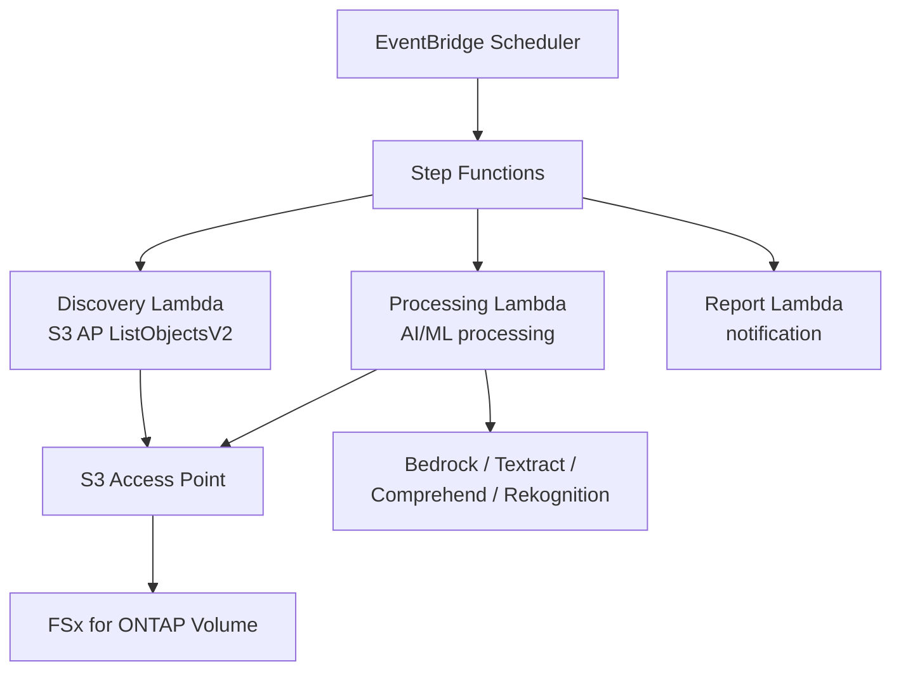

# FSx for ONTAP S3 Access Points — 서버리스 패턴

    

🌐 [日本語](README.md) | [English](README.en.md) | [한국어](README.ko.md) | [简体中文](README.zh-CN.md) | [繁體中文](README.zh-TW.md) | [Français](README.fr.md) | [Deutsch](README.de.md) | [Español](README.es.md)

---

> **42개의 레퍼런스 패턴** — FSx for ONTAP의 엔터프라이즈 NAS 데이터를 S3 Access Points를 통해 서버리스로 처리합니다. **데이터 복사 불필요**.
>
> 28개 산업별 UC + 7개 FlexCache/FlexClone + 2개 GenAI + SAP + HA 모니터링 + 이벤트 드리븐 + 엣지 배포 + File Portal UI

---

## 시작하기

| 하고 싶은 것... | 가이드 | 소요 시간 |
|---|---|---|
| FSx 없이 데모 체험 | [Demo Mode Guide](docs/demo-mode-guide.md) | 5분 |
| 웹 포털로 파일 브라우징 | [File Portal UI (Amplify / Nextcloud)](docs/file-portal-amplify-gen2.en.md) | 10분 |
| AWS에 패턴 배포 | [Deployment Guide](docs/guides/deployment-guide.md) | 30분 |
| 워크로드에 맞는 패턴 찾기 | [Pattern Selection Guide](docs/pattern-selection-guide.md) | 15분 |
| 비용 견적 | [Cost Calculator](docs/cost-calculator.md) | 5분 |
| 핸즈온 랩 환경 구축 | [Hands-on Lab IaC](infrastructure/handson-lab/) | 60분 |

---

<details>
<summary><strong>📂 전체 패턴 (클릭하여 펼치기)</strong></summary>

### 산업별 유스케이스 (UC1-UC28 + SAP)

| # | 디렉토리 | 산업 | 요약 |
|---|---|---|---|
| UC1 | [`legal-compliance/`](solutions/industry/legal-compliance/) | 법무 | NTFS ACL 감사 및 컴플라이언스 보고 |
| UC2 | [`financial-idp/`](solutions/industry/financial-idp/) | 금융 | 청구서 OCR 및 엔티티 추출 |
| UC3 | [`manufacturing-analytics/`](solutions/industry/manufacturing-analytics/) | 제조 | IoT 센서 및 품질 검사 |
| UC4 | [`media-vfx/`](solutions/industry/media-vfx/) | 미디어 | VFX 렌더링 품질 검사 |
| UC5 | [`healthcare-dicom/`](solutions/industry/healthcare-dicom/) | 의료 | DICOM 익명화 |
| UC6 | [`semiconductor-eda/`](solutions/industry/semiconductor-eda/) | 반도체 | GDS/OASIS 검증 |
| UC7 | [`genomics-pipeline/`](solutions/industry/genomics-pipeline/) | 유전체학 | FASTQ/VCF 품질 검사 |
| UC8 | [`energy-seismic/`](solutions/industry/energy-seismic/) | 에너지 | SEG-Y 탄성파 데이터 분석 |
| UC9 | [`autonomous-driving/`](solutions/industry/autonomous-driving/) | 자동차 | 영상/LiDAR 전처리 |
| UC10 | [`construction-bim/`](solutions/industry/construction-bim/) | 건설 | BIM 모델 관리 |
| UC11 | [`retail-catalog/`](solutions/industry/retail-catalog/) | 유통 | 상품 이미지 태깅 |
| UC12 | [`logistics-ocr/`](solutions/industry/logistics-ocr/) | 물류 | 배송 문서 OCR |
| UC13 | [`education-research/`](solutions/industry/education-research/) | 교육 | 논문 분류 |
| UC14 | [`insurance-claims/`](solutions/industry/insurance-claims/) | 보험 | 손해 사정 |
| UC15 | [`defense-satellite/`](solutions/industry/defense-satellite/) | 방위 | 위성 이미지 분석 |
| UC16 | [`government-archives/`](solutions/industry/government-archives/) | 정부 | 공문서 및 정보 공개 |
| UC17 | [`smart-city-geospatial/`](solutions/industry/smart-city-geospatial/) | 스마트시티 | 지리공간 분석 |
| UC18 | [`telecom-network-analytics/`](solutions/industry/telecom-network-analytics/) | 통신 | CDR/네트워크 로그 분석 |
| UC19 | [`adtech-creative-management/`](solutions/industry/adtech-creative-management/) | 광고 | 크리에이티브 자산 관리 |
| UC20 | [`travel-document-processing/`](solutions/industry/travel-document-processing/) | 여행 | 예약 문서 처리 |
| UC21 | [`agri-food-traceability/`](solutions/industry/agri-food-traceability/) | 농업 | 이력 추적 |
| UC22 | [`transportation-maintenance/`](solutions/industry/transportation-maintenance/) | 교통 | 장비 점검 |
| UC23 | [`sustainability-esg-reporting/`](solutions/industry/sustainability-esg-reporting/) | ESG | 지표 추출 |
| UC24 | [`nonprofit-grant-management/`](solutions/industry/nonprofit-grant-management/) | 비영리 | 보조금 관리 |
| UC25 | [`utilities-asset-inspection/`](solutions/industry/utilities-asset-inspection/) | 유틸리티 | 드론/SCADA 분석 |
| UC26 | [`real-estate-portfolio/`](solutions/industry/real-estate-portfolio/) | 부동산 | 물건 이미지 및 계약서 |
| UC27 | [`hr-document-screening/`](solutions/industry/hr-document-screening/) | HR | 이력서 스크리닝 |
| UC28 | [`chemical-sds-management/`](solutions/industry/chemical-sds-management/) | 화학 | SDS 및 실험 노트 |
| SAP | [`sap/erp-adjacent/`](solutions/sap/erp-adjacent/) | SAP/ERP | IDoc 및 EDI 처리 |

### FlexCache / FlexClone (FC1-FC7)

| # | 디렉토리 | 패턴 |
|---|---|---|
| FC1 | [`flexcache/anycast-dr/`](solutions/flexcache/anycast-dr/) | AnyCast / DR 페일오버 |
| FC2 | [`flexcache/dynamic-render-workflow/`](solutions/flexcache/dynamic-render-workflow/) | 작업별 동적 FlexCache |
| FC3 | [`flexcache/rag-enterprise-files/`](solutions/flexcache/rag-enterprise-files/) | 권한 인식 RAG |
| FC4 | [`flexcache/automotive-cae/`](solutions/flexcache/automotive-cae/) | CAE 시뮬레이션 분석 |
| FC5 | [`flexcache/life-sciences-research/`](solutions/flexcache/life-sciences-research/) | 연구 데이터 분류 |
| FC6 | [`flexcache/gaming-build-pipeline/`](solutions/flexcache/gaming-build-pipeline/) | 게임 에셋 품질 검사 |
| FC7 | [`flexcache/devops-cicd/`](solutions/flexcache/devops-cicd/) | FlexClone Dev/Test 및 CI/CD |

### GenAI / HA / 이벤트 드리븐 / 엣지 / File Portal

| 디렉토리 | 요약 |
|---|---|
| [`genai/kb-selfservice-curation/`](solutions/genai/kb-selfservice-curation/) | Bedrock KB 셀프서비스 운영 |
| [`genai/quick-agentic-workspace/`](solutions/genai/quick-agentic-workspace/) | 에이전틱 워크스페이스 |
| [`ha/lifekeeper-monitoring/`](solutions/ha/lifekeeper-monitoring/) | HA LifeKeeper AI 모니터링 |
| [`event-driven/fpolicy/`](solutions/event-driven/fpolicy/) | FPolicy 이벤트 드리븐 파이프라인 |
| [`edge/content-delivery/`](solutions/edge/content-delivery/) | CDN/엣지 배포 (벤더 중립) |
| [`amplify-portal/`](solutions/amplify-portal/) | File Portal UI (Amplify Gen2) |
| [`nextcloud-test/`](solutions/nextcloud-test/) | File Portal UI (Nextcloud Docker) |

### 인프라 및 공유 모듈

| 디렉토리 | 요약 |
|---|---|
| [`shared/`](shared/) | 공통 Python 모듈 (S3ApHelper, OntapClient, Observability) |
| [`operations/`](operations/) | 6개 운영 최적화 패턴 |
| [`infrastructure/handson-lab/`](infrastructure/handson-lab/) | 핸즈온 랩 IaC (VPC/AD/FSx/EC2/S3AP) |
| [`docs/`](docs/) | 설계 가이드 및 벤치마크 (40+ 문서) |
| [`scripts/`](scripts/) | 배포, 벤치마크, 유틸리티 |
| [`.github/workflows/`](.github/workflows/) | CI/CD (lint → test → security → deploy) |

</details>

---

## 아키텍처

```
EventBridge Scheduler (주기적 트리거)
  └→ Step Functions State Machine
      ├→ Discovery Lambda: S3 AP를 통해 파일 목록 조회
      ├→ Map State (병렬): 각 파일을 AI/ML로 처리
      └→ Report Lambda: 결과 생성 → SNS 알림
```

이것은 모든 패턴에서 공유하는 공통 흐름입니다. AI/ML 서비스 (Bedrock, Textract, Comprehend, Rekognition)는 UC에 따라 다릅니다.

<details>
<summary><strong>Mermaid 다이어그램 (클릭하여 펼치기)</strong></summary>



</details>

<details>
<summary><strong>카테고리별 아키텍처 (FlexCache, GenAI, HA, 이벤트 드리븐, 엣지)</strong></summary>

각 카테고리의 상세 아키텍처 다이어그램:
- [FlexCache / FlexClone](docs/industry-workload-mapping.md)
- [GenAI (Bedrock KB / Agentic)](solutions/genai/kb-selfservice-curation/docs/architecture.md)
- [HA LifeKeeper Monitoring](solutions/ha/lifekeeper-monitoring/README.md)
- [Event-Driven FPolicy](solutions/event-driven/fpolicy/README.md)
- [Edge / CDN](solutions/edge/content-delivery/docs/architecture.md)
- [File Portal (Amplify Gen2)](solutions/amplify-portal/README.md)

</details>

---

## 주요 S3 Access Point 제약 사항

| 제약 사항 | 해결 방법 |
|---|---|
| S3 Event Notifications 미지원 | EventBridge Scheduler 폴링 또는 FPolicy |
| Presigned URL 비공식 | 실제로 동작하지만 프로덕션에서는 비권장 |
| 5GB 업로드 제한 | Multipart Upload |
| Athena 결과를 S3AP에 쓸 수 없음 | 표준 S3 버킷으로 출력 |
| SSE-FSX 전용 | 볼륨 수준 KMS 암호화 사용 |

상세: [S3AP Compatibility Notes](docs/s3ap-compatibility-notes.en.md) | [Compatibility Matrix (AWS 확인)](https://github.com/Yoshiki0705/fsxn-lakehouse-integrations/blob/main/docs/en/compatibility-matrix.md)

---

<details>
<summary><strong>📚 관련 기사 및 리포지토리</strong></summary>

### 기사 시리즈

| 주제 | 일본어 | 영어 |
|---|---|---|
| 42 패턴 소개 | [Hatena](https://hakobiya.hatenablog.com/entry/fsxn-s3ap-serverless-part1-introduction) | [dev.to](https://dev.to/aws-builders/industry-specific-serverless-automation-patterns-with-fsx-for-ontap-s3-access-points-3e0a) |
| 프로덕션 아키텍처 | [Hatena](https://hakobiya.hatenablog.com/entry/fsxn-s3ap-serverless-part2-production-architecture) | — |
| 운영 기준선 | [Hatena](https://hakobiya.hatenablog.com/entry/fsxn-s3ap-serverless-part3-operational-baseline) | [dev.to](https://dev.to/aws-builders/production-rollout-vpc-endpoint-auto-detection-and-the-cdk-no-go-fsx-for-ontap-s3-access-3lni) |
| FPolicy 이벤트 드리븐 | [Hatena](https://hakobiya.hatenablog.com/entry/fsxn-s3ap-serverless-part4-event-driven-fpolicy) | [dev.to](https://dev.to/aws-builders/fpolicy-event-driven-pipeline-multi-account-stacksets-and-cost-optimization-fsx-for-ontap-s3-5bd6) |
| 28개 산업 패턴 | [Hatena](https://hakobiya.hatenablog.com/entry/fsxn-s3ap-serverless-part5-field-ready-28-patterns) | [dev.to](https://dev.to/aws-builders/from-serverless-patterns-to-field-ready-reference-architecture-fsx-for-ontap-s3-access-points-dhj) |
| GenAI 통합 | [Hatena](https://hakobiya.hatenablog.com/entry/fsxn-s3ap-serverless-part6-genai-42-patterns) | — |

### 관련 리포지토리

| 리포지토리 | 요약 |
|---|---|
| [Permission-aware-RAG-FSxN-CDK](https://github.com/Yoshiki0705/Permission-aware-RAG-FSxN-CDK-github) | 권한 인식 RAG 챗봇 (CDK + Next.js + ECS) |
| [fsxn-lakehouse-integrations](https://github.com/Yoshiki0705/fsxn-lakehouse-integrations) | 레이크하우스 통합 (Databricks, Snowflake, Athena, Glue, EMR) |
| [vmware-migration-ec2-ontap](https://github.com/Yoshiki0705/vmware-migration-ec2-ontap) | VMware → EC2 + FSx for ONTAP 마이그레이션 |

</details>

<details>
<summary><strong>🔧 개발자 가이드 (테스트 및 기여)</strong></summary>

### 테스트

```bash
pytest shared/tests/ -v                    # Unit tests
ruff check . && ruff format --check .      # Python linter
cfn-lint solutions/industry/*/template.yaml # CloudFormation validation
```

### 기술 스택

Python 3.12 | CloudFormation + SAM | Lambda (ARM64) | Step Functions | EventBridge | Bedrock / Textract / Comprehend / Rekognition | Secrets Manager | Athena + Glue

### 기여 방법

Issue와 Pull Request를 환영합니다. [CONTRIBUTING.md](CONTRIBUTING.md)를 참고해 주세요.

</details>

---

## 라이선스

MIT — [LICENSE](LICENSE)

---

🌐 [日本語](README.md) | [English](README.en.md) | [한국어](README.ko.md) | [简体中文](README.zh-CN.md) | [繁體中文](README.zh-TW.md) | [Français](README.fr.md) | [Deutsch](README.de.md) | [Español](README.es.md)
