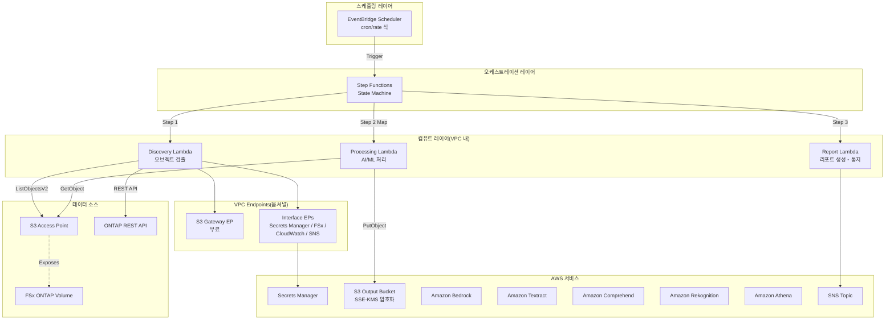
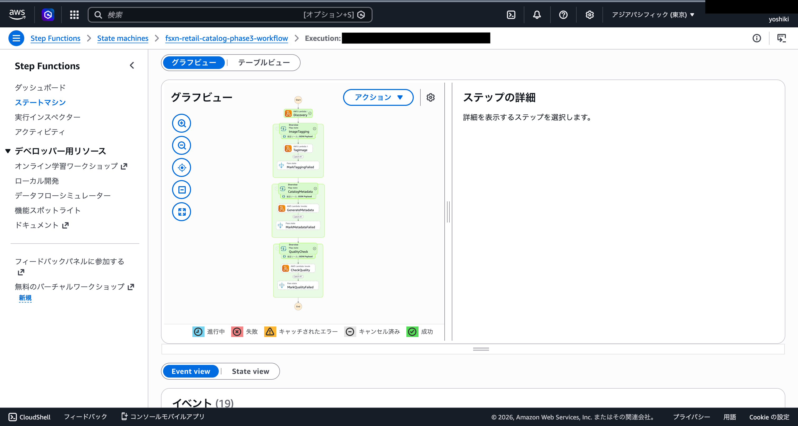
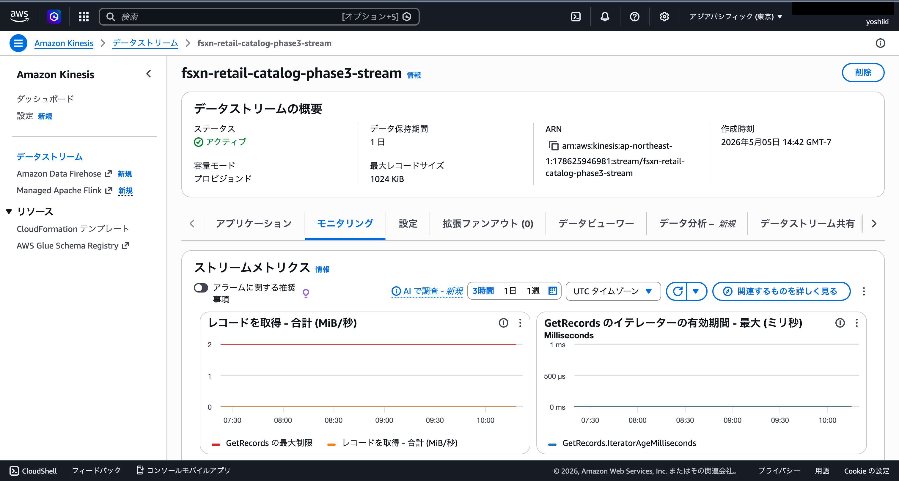
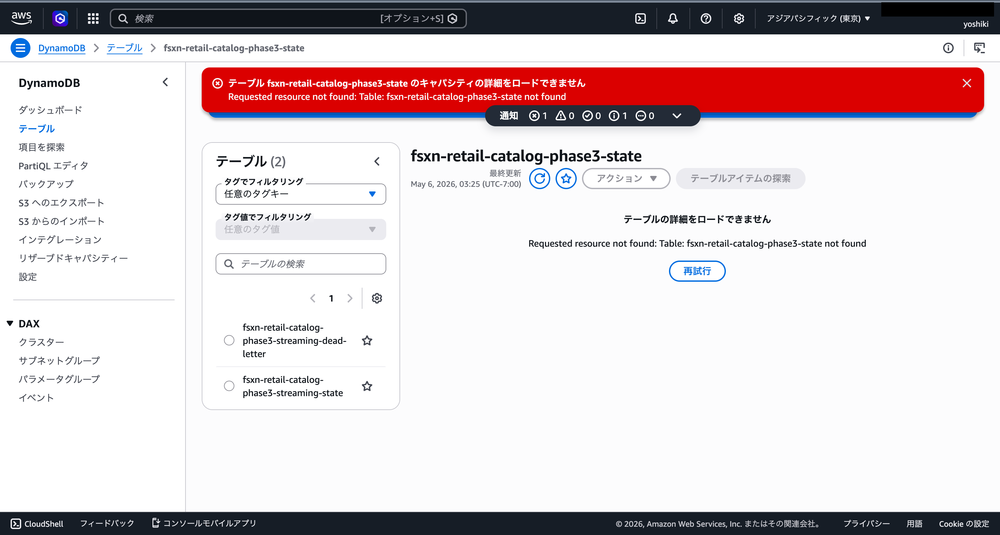
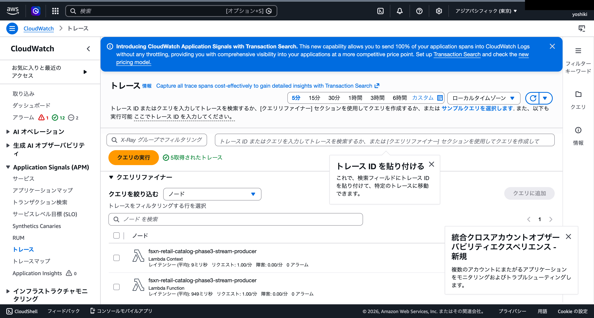
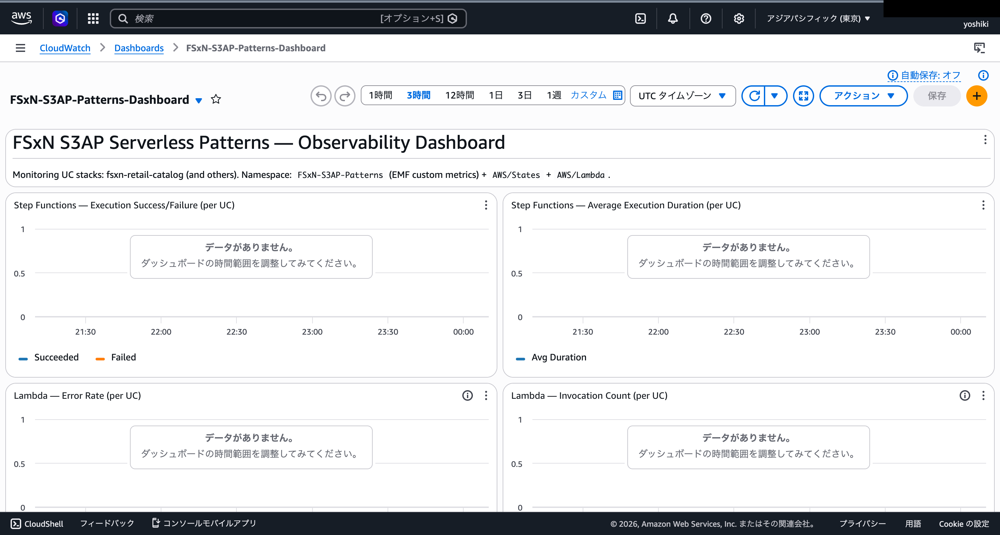
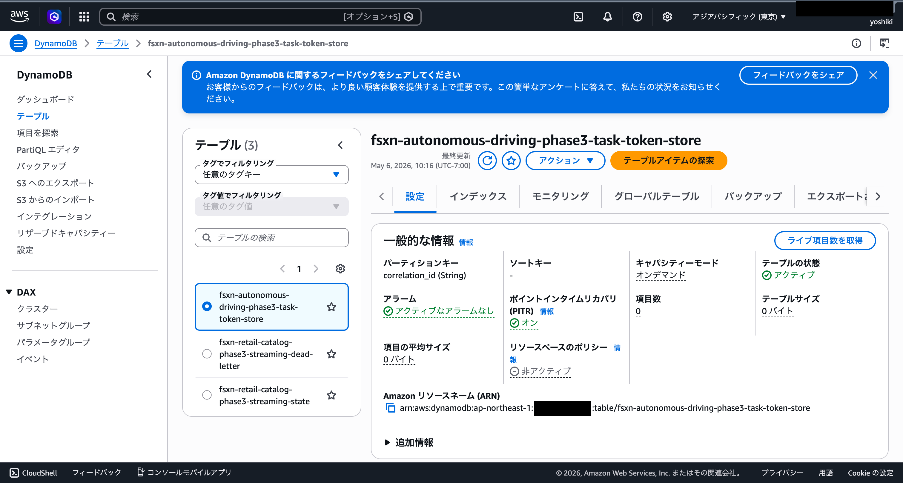
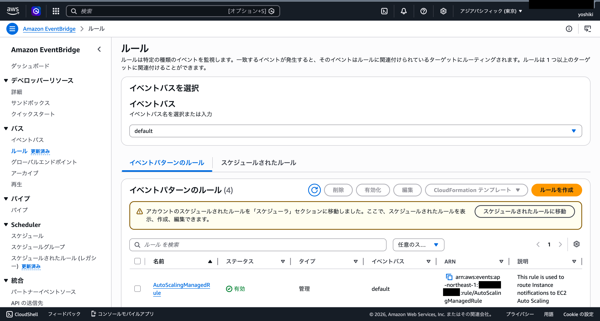
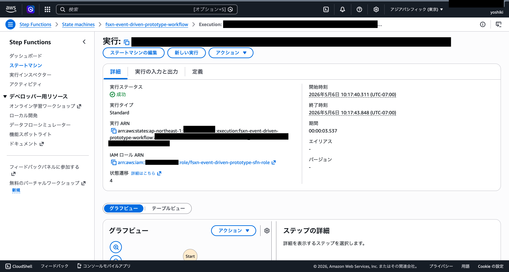

# FSx for ONTAP S3 Access Points Serverless Patterns

🌐 **Language / 言語**: [日本語](README.md) | [English](README.en.md) | [한국어](README.ko.md) | [简体中文](README.zh-CN.md) | [繁體中文](README.zh-TW.md) | [Français](README.fr.md) | [Deutsch](README.de.md) | [Español](README.es.md)

Amazon FSx for NetApp ONTAP의 S3 Access Points를 활용한 업종별 서버리스 자동화 패턴 모음집입니다.

> **본 리포지토리의 위치**: 이것은 「설계 판단을 배우기 위한 레퍼런스 구현」입니다. 일부 유스케이스는 AWS 환경에서 E2E 검증을 완료했으며, 나머지 유스케이스도 CloudFormation 배포, 공통 Discovery Lambda, 주요 컴포넌트의 동작 확인을 실시했습니다. PoC에서 프로덕션 환경으로의 단계적 적용을 상정하여, 비용 최적화, 보안, 에러 핸들링의 설계 판단을 구체적인 코드로 보여주는 것을 목적으로 합니다.

## 관련 기사

본 리포지토리는 다음 기사에서 해설한 아키텍처의 구현 예시입니다:

- **FSx for ONTAP S3 Access Points as a Serverless Automation Boundary — AI Data Pipelines, Volume-Level SnapMirror DR, and Capacity Guardrails**
  https://dev.to/yoshikifujiwara/fsx-for-ontap-s3-access-points-as-a-serverless-automation-boundary-ai-data-pipelines-ili

기사에서는 아키텍처의 설계 사상과 트레이드오프를 해설하고, 본 리포지토리에서는 구체적이고 재사용 가능한 구현 패턴을 제공합니다.

## 개요

이 리포지토리는 FSx for NetApp ONTAP에 저장된 엔터프라이즈 데이터를 **S3 Access Points**를 통해 서버리스로 처리하는 **5가지 업종별 패턴**을 제공합니다.

> 이하에서는 FSx for ONTAP S3 Access Points를 간략히 **S3 AP**로 표기합니다.

각 유스케이스는 독립적인 CloudFormation 템플릿으로 구성되어 있으며, 공통 모듈(ONTAP REST API 클라이언트, FSx 헬퍼, S3 AP 헬퍼)은 `shared/`에 배치하여 재사용합니다.

### 주요 특징

- **폴링 기반 아키텍처**: S3 AP가 `GetBucketNotificationConfiguration`을 지원하지 않으므로, EventBridge Scheduler + Step Functions에 의한 정기 실행
- **공통 모듈 분리**: OntapClient / FsxHelper / S3ApHelper를 모든 유스케이스에서 재사용
- **CloudFormation / SAM Transform 기반**: 각 유스케이스가 독립적인 CloudFormation 템플릿(SAM Transform 사용)으로 완결
- **보안 우선**: TLS 검증 기본 활성화, 최소 권한 IAM, KMS 암호화
- **비용 최적화**: 고비용 상시 가동 리소스(Interface VPC Endpoints 등)를 옵셔널화

## 아키텍처



> 다이어그램은 프로덕션 환경을 상정한 VPC 내 Lambda 구성을 보여줍니다. PoC / 데모 용도에서는 S3 AP의 network origin이 `internet`인 경우 VPC 외 Lambda 구성도 선택할 수 있습니다. 자세한 내용은 아래 「Lambda 배치 선택 가이드」를 참조하세요.

### 워크플로우 개요

```
EventBridge Scheduler (정기 실행)
  └─→ Step Functions State Machine
       ├─→ Discovery Lambda: S3 AP에서 오브젝트 목록 취득 → Manifest 생성
       ├─→ Map State (병렬 처리): 각 오브젝트를 AI/ML 서비스로 처리
       └─→ Report/Notification: 결과 리포트 생성 → SNS 통지
```

## 유스케이스 목록

### Phase 1 (UC1–UC5)

| # | 디렉토리 | 업종 | 패턴 | 사용 AI/ML 서비스 | ap-northeast-1 확인 상태 |
|---|----------|------|------|-----------------|------------------------|
| UC1 | `legal-compliance/` | 법무・컴플라이언스 | 파일 서버 감사・데이터 거버넌스 | Athena, Bedrock | ✅ E2E 성공 |
| UC2 | `financial-idp/` | 금융・보험 | 계약서・청구서 자동 처리 (IDP) | Textract ⚠️, Comprehend, Bedrock | ⚠️ 도쿄 미지원（대응 리전 이용） |
| UC3 | `manufacturing-analytics/` | 제조업 | IoT 센서 로그・품질 검사 이미지 분석 | Athena, Rekognition | ✅ E2E 성공 |
| UC4 | `media-vfx/` | 미디어 | VFX 렌더링 파이프라인 | Rekognition, Deadline Cloud | ⚠️ Deadline Cloud 설정 필요 |
| UC5 | `healthcare-dicom/` | 의료 | DICOM 이미지 자동 분류・익명화 | Rekognition, Comprehend Medical ⚠️ | ⚠️ 도쿄 미지원（대응 리전 이용） |

### Phase 2 (UC6–UC14)

| # | 디렉토리 | 업종 | 패턴 | 사용 AI/ML 서비스 | ap-northeast-1 확인 상태 |
|---|----------|------|------|-----------------|------------------------|
| UC6 | `semiconductor-eda/` | 반도체 / EDA | GDS/OASIS 검증・메타데이터 추출・DRC 집계 | Athena, Bedrock | ✅ 테스트 성공 |
| UC7 | `genomics-pipeline/` | 유전체학 | FASTQ/VCF 품질 체크・변이 호출 집계 | Athena, Bedrock, Comprehend Medical ⚠️ | ⚠️ Cross-Region (us-east-1) |
| UC8 | `energy-seismic/` | 에너지 | SEG-Y 메타데이터 추출・유정 로그 이상 감지 | Athena, Bedrock, Rekognition | ✅ 테스트 성공 |
| UC9 | `autonomous-driving/` | 자율주행 / ADAS | 영상/LiDAR 전처리・품질 체크・어노테이션 | Rekognition, Bedrock, SageMaker | ✅ 테스트 성공 |
| UC10 | `construction-bim/` | 건설 / AEC | BIM 버전 관리・도면 OCR・안전 컴플라이언스 | Textract ⚠️, Bedrock, Rekognition | ⚠️ Cross-Region (us-east-1) |
| UC11 | `retail-catalog/` | 소매 / EC | 상품 이미지 태깅・카탈로그 메타데이터 생성 | Rekognition, Bedrock | ✅ 테스트 성공 |
| UC12 | `logistics-ocr/` | 물류 | 배송 전표 OCR・창고 재고 이미지 분석 | Textract ⚠️, Rekognition, Bedrock | ⚠️ Cross-Region (us-east-1) |
| UC13 | `education-research/` | 교육 / 연구 | 논문 PDF 분류・인용 네트워크 분석 | Textract ⚠️, Comprehend, Bedrock | ⚠️ Cross-Region (us-east-1) |
| UC14 | `insurance-claims/` | 보험 | 사고 사진 손해 평가・견적서 OCR・사정 보고서 | Rekognition, Textract ⚠️, Bedrock | ⚠️ Cross-Region (us-east-1) |

> **리전 제약**: Amazon Textract와 Amazon Comprehend Medical은 ap-northeast-1(도쿄)에서 사용할 수 없습니다. Phase 2 UC(UC7, UC10, UC12, UC13, UC14)는 Cross_Region_Client를 통해 us-east-1로 API 호출을 라우팅합니다. Rekognition, Comprehend, Bedrock, Athena는 ap-northeast-1에서 사용 가능합니다.
> 
> 참고: [Textract 지원 리전](https://docs.aws.amazon.com/general/latest/gr/textract.html) | [Comprehend Medical 지원 리전](https://docs.aws.amazon.com/general/latest/gr/comprehend-med.html)

## 리전 선택 가이드

본 패턴 컬렉션은 **ap-northeast-1(도쿄)**에서 검증을 실시했지만, 필요한 서비스가 이용 가능한 모든 AWS 리전에 배포할 수 있습니다.

### 배포 전 체크리스트

1. [AWS Regional Services List](https://aws.amazon.com/about-aws/global-infrastructure/regional-product-services/)에서 서비스 가용성 확인
2. Phase 3 서비스 확인:
   - **Kinesis Data Streams**: 거의 모든 리전에서 이용 가능 (샤드 요금은 리전에 따라 다름)
   - **SageMaker Batch Transform**: 인스턴스 타입 가용성이 리전에 따라 다름
   - **X-Ray / CloudWatch EMF**: 거의 모든 리전에서 이용 가능
3. Cross-Region 대상 서비스(Textract, Comprehend Medical)의 타겟 리전 확인

자세한 내용은 [리전 호환성 매트릭스](docs/region-compatibility.md)를 참조하세요.

### Phase 3 기능 요약

| 기능 | 설명 | 대상 UC |
|------|------|---------|
| Kinesis 스트리밍 | 준실시간 파일 변경 감지 및 처리 | UC11 (옵트인) |
| SageMaker Batch Transform | 점군 세그멘테이션 추론 (Callback Pattern) | UC9 (옵트인) |
| X-Ray 트레이싱 | 분산 트레이싱을 통한 실행 경로 시각화 | 전체 14 UC |
| CloudWatch EMF | 구조화된 메트릭 출력 (FilesProcessed, Duration, Errors) | 전체 14 UC |
| 관측성 대시보드 | 전체 UC 횡단 메트릭 일원 표시 | 공통 |
| 알림 자동화 | 에러율 임계값 기반 SNS 알림 | 공통 |

자세한 내용은 [스트리밍 vs 폴링 선택 가이드](docs/streaming-vs-polling-guide-ko.md)를 참조하세요.

### Phase 4 기능 요약

| 기능 | 설명 | 대상 UC |
|------|------|---------|
| DynamoDB Task Token Store | SageMaker Callback Pattern의 프로덕션 안전한 Token 관리 (Correlation ID 방식) | UC9 (옵트인) |
| Real-time Inference Endpoint | SageMaker Real-time Endpoint를 통한 저지연 추론 | UC9 (옵트인) |
| A/B Testing | Multi-Variant Endpoint를 통한 모델 버전 비교 | UC9 (옵트인) |
| Model Registry | SageMaker Model Registry를 통한 모델 라이프사이클 관리 | UC9 (옵트인) |
| Multi-Account Deployment | StackSets / Cross-Account IAM / S3 AP 정책을 통한 멀티 계정 지원 | 전체 UC (템플릿 제공) |
| Event-Driven Prototype | S3 Event Notifications → EventBridge → Step Functions 파이프라인 | 프로토타입 |

Phase 4의 모든 기능은 CloudFormation Conditions로 옵트인 제어되며, 활성화하지 않는 한 추가 비용이 발생하지 않습니다.

자세한 내용은 다음 문서를 참조하세요:
- [추론 비용 비교 가이드](docs/inference-cost-comparison.md)
- [Model Registry 가이드](docs/model-registry-guide.md)
- [Multi-Account PoC 결과](docs/multi-account/poc-results.md)
- [Event-Driven 아키텍처 설계](docs/event-driven/architecture-design.md)

### 스크린샷

> 아래는 검증 환경에서의 촬영 예시입니다. 환경 고유 정보(계정 ID 등)는 마스킹 처리되었습니다.

#### 전체 5 UC의 Step Functions 배포・실행 확인


> UC1・UC3은 완전한 E2E 검증, UC2・UC4・UC5는 CloudFormation 배포와 주요 컴포넌트의 동작 확인을 실시했습니다. 리전 제약이 있는 AI/ML 서비스(Textract, Comprehend Medical)를 사용하는 경우 지원 리전으로의 크로스 리전 호출이 필요하므로, 데이터 레지던시 및 컴플라이언스 요건을 확인하세요.

#### Phase 2: 전체 9 UC CloudFormation 배포・Step Functions 실행 성공


> 전체 9 스택(UC6–UC14)이 CREATE_COMPLETE / UPDATE_COMPLETE. 총 205 리소스.


> 전체 9 워크플로우 활성화. 테스트 데이터 투입 후 E2E 실행에서 전체 SUCCEEDED 확인.


> UC6(반도체 EDA) Step Functions 실행 상세. Discovery → ProcessObjects (Map) → DrcAggregation → ReportGeneration 전체 스테이트 성공.


> 전체 9 UC의 EventBridge Scheduler 스케줄(rate(1 hour))이 활성화.

#### AI/ML 서비스 화면 (Phase 1)

##### Amazon Bedrock — 모델 카탈로그


##### Amazon Rekognition — 라벨 검출


##### Amazon Comprehend — 엔티티 검출


#### AI/ML 서비스 화면 (Phase 2)

##### Amazon Bedrock — 모델 카탈로그 (UC6: 리포트 생성)


> UC6(반도체 EDA)에서 Nova Lite 모델을 사용한 DRC 리포트 생성에 활용.

##### Amazon Athena — 쿼리 실행 이력 (UC6: 메타데이터 집계)


> UC6의 Step Functions 워크플로우 내에서 Athena 쿼리(cell_count, bbox, naming, invalid) 실행.

##### Amazon Rekognition — 라벨 검출 (UC11: 상품 이미지 태깅)


> UC11(소매 카탈로그)에서 상품 이미지로부터 15개 라벨(Lighting 98.5%, Light 96.0%, Purple 92.0% 등) 검출.

##### Amazon Textract — 문서 OCR (UC12: 배송 전표 읽기)


> UC12(물류 OCR)에서 배송 전표 PDF로부터 텍스트 추출. Cross-Region(us-east-1) 경유로 실행.

##### Amazon Comprehend Medical — 의료 엔티티 검출 (UC7: 게노믹스 분석)


> UC7(게노믹스 파이프라인)에서 VCF 분석 결과로부터 유전자명(GC)을 DetectEntitiesV2 API로 추출. Cross-Region(us-east-1) 경유로 실행.

##### Lambda 함수 목록 (Phase 2)


> Phase 2의 전체 Lambda 함수(Discovery, Processing, Report 등)가 정상 배포 완료.

#### Phase 3: 실시간 처리・SageMaker 통합・관측 가능성 강화

##### Step Functions E2E 실행 성공 (UC11)



> UC11 Step Functions 워크플로우 E2E 실행 성공. Discovery → ImageTagging Map → CatalogMetadata Map → QualityCheck 전체 스테이트 성공 (8.974초). X-Ray 트레이스 생성 확인.

##### Kinesis Data Streams (UC11 스트리밍 모드)



> UC11 Kinesis Data Stream (1 샤드, 프로비저닝 모드) 활성 상태. 모니터링 메트릭 표시.

##### DynamoDB 상태 관리 테이블 (UC11 변경 감지)



> UC11 변경 감지용 DynamoDB 테이블. streaming-state (상태 관리) 및 streaming-dead-letter (DLQ) 테이블.

##### 관측 가능성 스택



> X-Ray 트레이스. Stream Producer Lambda 1분 간격 실행 트레이스 (전체 OK, 레이턴시 7-11ms).



> 전체 14 UC 횡단 CloudWatch 대시보드. Step Functions 성공/실패, Lambda 에러율, EMF 커스텀 메트릭.


> Phase 3 알림 자동화. Step Functions 실패율, Lambda 에러율, Kinesis Iterator Age 임계값 알람 (전체 OK 상태).

##### S3 Access Point 확인


> FSx for ONTAP S3 Access Point (fsxn-eda-s3ap) Available 상태. FSx 콘솔 볼륨 S3 탭에서 확인.

#### Phase 4: 프로덕션 SageMaker 통합, 실시간 추론, 멀티 계정, 이벤트 기반

##### DynamoDB Task Token Store



> DynamoDB Task Token Store 테이블. 8자리 hex Correlation ID를 파티션 키로 Task Token을 저장. TTL 활성화, PAY_PER_REQUEST 모드, GSI(TransformJobNameIndex) 구성 완료.

##### SageMaker Real-time Endpoint (Multi-Variant A/B Testing)


> SageMaker Real-time Inference Endpoint. Multi-Variant 구성(model-v1: 70%, model-v2: 30%)으로 A/B 테스트. Auto Scaling 구성 완료.

##### Step Functions 워크플로우 (Realtime/Batch 라우팅)


> UC9 Step Functions 워크플로우. Choice State에서 file_count < threshold인 경우 Real-time Endpoint로, 그 외에는 Batch Transform으로 라우팅.

##### Event-Driven Prototype — EventBridge Rule



> Event-Driven Prototype EventBridge Rule. S3 ObjectCreated 이벤트를 suffix (.jpg, .png) + prefix (products/)로 필터링하여 Step Functions를 트리거.

##### Event-Driven Prototype — Step Functions 실행 성공



> Event-Driven Prototype Step Functions 실행 성공. S3 PutObject → EventBridge → Step Functions → EventProcessor → LatencyReporter 모든 상태 성공.

##### CloudFormation Phase 4 스택


> Phase 4 CloudFormation 스택. UC9 확장(Task Token Store + Real-time Endpoint) 및 Event-Driven Prototype CREATE_COMPLETE.

## 기술 스택

| 레이어 | 기술 |
|--------|------|
| 언어 | Python 3.12 |
| IaC | CloudFormation (YAML) + SAM Transform |
| 컴퓨트 | AWS Lambda（본번: VPC 내 / PoC: VPC 외도 선택 가능） |
| 오케스트레이션 | AWS Step Functions |
| 스케줄링 | Amazon EventBridge Scheduler |
| 스토리지 | FSx for ONTAP (S3 AP) + S3 출력 버킷 (SSE-KMS) |
| 통지 | Amazon SNS |
| 분석 | Amazon Athena + AWS Glue Data Catalog |
| AI/ML | Amazon Bedrock, Textract, Comprehend, Rekognition |
| 보안 | Secrets Manager, KMS, IAM 최소 권한 |
| 테스트 | pytest + Hypothesis (PBT), moto, cfn-lint, ruff |

## 사전 요구 사항

- **AWS 계정**: 유효한 AWS 계정과 적절한 IAM 권한
- **FSx for NetApp ONTAP**: 배포 완료된 파일 시스템
  - ONTAP 버전: S3 Access Points를 지원하는 버전(9.17.1P4D3에서 검증 완료)
  - S3 Access Point가 관련 부여된 FSx for ONTAP 볼륨(network origin은 유스케이스에 따라 선택. Athena / Glue 사용 시 `internet` 권장)
- **네트워크**: VPC, 프라이빗 서브넷, 라우트 테이블
- **Secrets Manager**: ONTAP REST API 인증 정보(`{"username":"fsxadmin","password":"..."}` 형식)를 사전 등록
- **S3 버킷**: Lambda 배포 패키지 저장용 버킷을 사전 생성(예: `fsxn-s3ap-deploy-<account-id>`)
- **Python 3.12+**: 로컬 개발・테스트용
- **AWS CLI v2**: 배포・관리용

### 사전 준비 명령어

```bash
# 1. 배포용 S3 버킷 생성
ACCOUNT_ID=$(aws sts get-caller-identity --query Account --output text)
aws s3 mb "s3://fsxn-s3ap-deploy-${ACCOUNT_ID}" --region $AWS_DEFAULT_REGION

# 2. ONTAP 인증 정보를 Secrets Manager에 등록
aws secretsmanager create-secret \
  --name fsxn-ontap-credentials \
  --secret-string '{"username":"fsxadmin","password":"<your-ontap-password>"}' \
  --region $AWS_DEFAULT_REGION

# 3. 기존 S3 Gateway Endpoint 확인(중복 생성 방지)
aws ec2 describe-vpc-endpoints \
  --filters "Name=vpc-id,Values=<your-vpc-id>" "Name=service-name,Values=com.amazonaws.${AWS_DEFAULT_REGION}.s3" \
  --query 'VpcEndpoints[*].{Id:VpcEndpointId,State:State}' \
  --output table
# → 결과가 있는 경우 EnableS3GatewayEndpoint=false로 배포
```

### Lambda 배치 선택 가이드

| 용도 | 권장 배치 | 이유 |
|------|----------|------|
| 데모 / PoC | VPC 외 Lambda | VPC Endpoint 불필요, 저비용・설정 간편 |
| 프로덕션 / 폐쇄망 요건 | VPC 내 Lambda | Secrets Manager / FSx / SNS 등을 PrivateLink 경유로 이용 가능 |
| Athena / Glue 사용 UC | S3 AP network origin: `internet` | AWS 관리형 서비스에서의 접근이 필요 |

### VPC 내 Lambda에서 S3 AP에 접근하는 경우의 주의사항

> **UC1 배포 검증(2026-05-03)에서 확인된 중요 사항**

- **S3 Gateway Endpoint의 라우트 테이블 연결이 필수**: `RouteTableIds`에 프라이빗 서브넷의 라우트 테이블 ID를 지정하지 않으면, VPC 내 Lambda에서 S3 / S3 AP로의 접근이 타임아웃됨
- **VPC DNS 해석 확인**: VPC의 `enableDnsSupport` / `enableDnsHostnames`가 활성화되어 있는지 확인
- **PoC / 데모 환경에서는 Lambda를 VPC 외에서 실행하는 것을 권장**: S3 AP의 network origin이 `internet`이면 VPC 외 Lambda에서 문제없이 접근 가능. VPC Endpoint 불필요로 비용 절감・설정 간소화 가능
- 자세한 내용은 [트러블슈팅 가이드](docs/guides/troubleshooting-guide.md#6-lambda-vpc-内実行時の-s3-ap-タイムアウト)를 참조

### 필요한 AWS 서비스 쿼터

| 서비스 | 쿼터 | 권장값 |
|--------|------|--------|
| Lambda 동시 실행 수 | ConcurrentExecutions | 100 이상 |
| Step Functions 실행 수 | StartExecution/초 | 기본값 (25) |
| S3 Access Point | 계정당 AP 수 | 기본값 (10,000) |

## 빠른 시작

### 1. 리포지토리 클론

```bash
git clone https://github.com/Yoshiki0705/FSx-for-ONTAP-S3AccessPoints-Serverless-Patterns.git
cd FSx-for-ONTAP-S3AccessPoints-Serverless-Patterns
```

### 2. 의존성 설치

```bash
pip install -r requirements.txt
pip install -r requirements-dev.txt
```

### 3. 테스트 실행

```bash
# 유닛 테스트(커버리지 포함)
pytest shared/tests/ --cov=shared --cov-report=term-missing -v

# 프로퍼티 기반 테스트
pytest shared/tests/test_properties.py -v

# 린터
ruff check .
ruff format --check .
```

### 4. 유스케이스 배포(예: UC1 법무・컴플라이언스)

> ⚠️ **기존 환경에 대한 영향에 관한 중요 사항**
>
> 배포 전에 다음을 확인하세요:
>
> | 파라미터 | 기존 환경에 대한 영향 | 확인 방법 |
> |---------|---------------------|----------|
> | `VpcId` / `PrivateSubnetIds` | 지정한 VPC/서브넷에 Lambda ENI가 생성됨 | `aws ec2 describe-network-interfaces --filters Name=group-id,Values=<sg-id>` |
> | `EnableS3GatewayEndpoint=true` | VPC에 S3 Gateway Endpoint가 추가됨. **동일 VPC에 기존 S3 Gateway Endpoint가 있는 경우 `false`로 설정** | `aws ec2 describe-vpc-endpoints --filters Name=vpc-id,Values=<vpc-id>` |
> | `PrivateRouteTableIds` | S3 Gateway Endpoint가 라우트 테이블에 연결됨. 기존 라우팅에는 영향 없음 | `aws ec2 describe-route-tables --route-table-ids <rtb-id>` |
> | `ScheduleExpression` | EventBridge Scheduler가 정기적으로 Step Functions를 실행. **불필요한 실행을 피하기 위해 배포 후 스케줄 비활성화 가능** | AWS 콘솔 → EventBridge → Schedules |
> | `NotificationEmail` | SNS 구독 확인 이메일이 발송됨 | 이메일 수신 확인 |
>
> **스택 삭제 시 주의사항**:
> - S3 버킷(Athena Results)에 오브젝트가 남아 있으면 삭제가 실패합니다. 사전에 `aws s3 rm s3://<bucket> --recursive`로 비워주세요
> - 버전 관리가 활성화된 버킷은 `aws s3api delete-objects`로 모든 버전을 삭제해야 합니다
> - VPC Endpoints 삭제에 5-15분이 소요될 수 있습니다
> - Lambda의 ENI 해제에 시간이 걸려 Security Group 삭제가 실패할 수 있습니다. 몇 분 기다린 후 재시도하세요

```bash
# 리전 설정(환경 변수로 관리)
export AWS_DEFAULT_REGION=us-east-1  # 전체 서비스 지원 리전 권장

# Lambda 패키징
./scripts/deploy_uc.sh legal-compliance package

# CloudFormation 배포
aws cloudformation create-stack \
  --stack-name fsxn-legal-compliance \
  --template-body file://legal-compliance/template-deploy.yaml \
  --capabilities CAPABILITY_NAMED_IAM \
  --parameters \
    ParameterKey=DeployBucket,ParameterValue=<your-deploy-bucket> \
    ParameterKey=S3AccessPointAlias,ParameterValue=<your-volume-ext-s3alias> \
    ParameterKey=S3AccessPointOutputAlias,ParameterValue=<your-output-volume-ext-s3alias> \
    ParameterKey=OntapSecretName,ParameterValue=<your-ontap-secret-name> \
    ParameterKey=OntapManagementIp,ParameterValue=<your-ontap-management-ip> \
    ParameterKey=SvmUuid,ParameterValue=<your-svm-uuid> \
    ParameterKey=VolumeUuid,ParameterValue=<your-volume-uuid> \
    ParameterKey=VpcId,ParameterValue=<your-vpc-id> \
    'ParameterKey=PrivateSubnetIds,ParameterValue=<subnet-1>,<subnet-2>' \
    'ParameterKey=PrivateRouteTableIds,ParameterValue=<rtb-1>,<rtb-2>' \
    ParameterKey=NotificationEmail,ParameterValue=<your-email@example.com> \
    ParameterKey=EnableVpcEndpoints,ParameterValue=true \
    ParameterKey=EnableS3GatewayEndpoint,ParameterValue=true
```

> **참고**: `<...>` 플레이스홀더를 실제 환경 값으로 교체하세요.
>
> **`EnableVpcEndpoints` 에 대해**: Quick Start에서는 VPC 내 Lambda에서 Secrets Manager / CloudWatch / SNS로의 도달성을 확보하기 위해 `true`를 지정합니다. 기존 Interface VPC Endpoints 또는 NAT Gateway가 있는 경우 `false`를 지정하여 비용을 절감할 수 있습니다.
> 
> **리전 선택**: 모든 AI/ML 서비스가 사용 가능한 `us-east-1` 또는 `us-west-2`를 권장합니다. `ap-northeast-1`에서는 Textract와 Comprehend Medical을 사용할 수 없습니다(크로스 리전 호출로 대응 가능). 자세한 내용은 [리전 호환성 매트릭스](docs/region-compatibility.md)를 참조하세요.
>
> **VPC 연결성**: Discovery Lambda는 VPC 내에 배치됩니다. ONTAP REST API 및 S3 Access Point에 접근하려면 NAT Gateway 또는 Interface VPC Endpoints가 필요합니다. `EnableVpcEndpoints=true`를 설정하거나 기존 NAT Gateway를 사용하세요.

### 검증 완료 환경

| 항목 | 값 |
|------|-----|
| AWS 리전 | ap-northeast-1 (도쿄) |
| FSx ONTAP 버전 | ONTAP 9.17.1P4D3 |
| FSx 구성 | SINGLE_AZ_1 |
| Python | 3.12 |
| 배포 방식 | CloudFormation(SAM Transform 사용) |

전체 5 유스케이스의 CloudFormation 스택 배포와 Discovery Lambda의 동작 확인을 완료했습니다.
자세한 내용은 [검증 결과 기록](docs/verification-results.md)을 참조하세요.

## 비용 구조 요약

### 환경별 비용 추정

| 환경 | 고정비/월 | 변동비/월 | 합계/월 |
|------|----------|----------|--------|
| 데모/PoC | ~$0 | ~$1〜$3 | **~$1〜$3** |
| 프로덕션(1 UC) | ~$29 | ~$1〜$3 | **~$30〜$32** |
| 프로덕션(전체 5 UC) | ~$29 | ~$5〜$15 | **~$34〜$44** |

### 비용 분류

- **요청 기반(종량 과금)**: Lambda, Step Functions, S3 API, Textract, Comprehend, Rekognition, Bedrock, Athena — 사용하지 않으면 $0
- **상시 가동(고정비)**: Interface VPC Endpoints (~$28.80/월) — **옵셔널(opt-in)**

> Quick Start에서는 VPC 내 Lambda의 도달성을 우선하여 `EnableVpcEndpoints=true`를 지정합니다. 저비용 PoC를 우선하는 경우, VPC 외 Lambda 구성 또는 기존 NAT / Interface VPC Endpoints 활용을 검토하세요.

> 자세한 비용 분석은 [docs/cost-analysis.md](docs/cost-analysis.md)를 참조하세요.

### 옵셔널 리소스

고비용 상시 가동 리소스는 CloudFormation 파라미터로 옵셔널화되어 있습니다.

| 리소스 | 파라미터 | 기본값 | 월간 고정비 | 설명 |
|--------|---------|--------|-----------|------|
| Interface VPC Endpoints | `EnableVpcEndpoints` | `false` | ~$28.80 | Secrets Manager, FSx, CloudWatch, SNS용. 프로덕션 환경에서는 `true` 권장. Quick Start에서는 도달성 우선으로 `true` 지정 |
| CloudWatch Alarms | `EnableCloudWatchAlarms` | `false` | ~$0.10/알람 | Step Functions 실패율, Lambda 에러율 모니터링 |

> **S3 Gateway VPC Endpoint**는 추가 시간 과금이 없으므로, VPC 내 Lambda에서 S3 AP에 접근하는 구성에서는 활성화를 권장합니다. 단, 기존 S3 Gateway Endpoint가 있는 경우나 PoC / 데모 용도로 Lambda를 VPC 외에 배치하는 경우에는 `EnableS3GatewayEndpoint=false`를 지정하세요. S3 API 요청이나 데이터 전송, 각 AWS 서비스 이용 요금은 통상대로 발생합니다.

## 보안 및 인가 모델

본 솔루션은 **복수의 인가 레이어**를 조합하여, 각각이 다른 역할을 담당합니다:

| 레이어 | 역할 | 제어 대상 |
|--------|------|----------|
| **IAM** | AWS 서비스와 S3 Access Points에 대한 접근 제어 | Lambda 실행 역할, S3 AP 정책 |
| **S3 Access Point** | S3 AP에 연결된 파일 시스템 사용자를 통해 접근 경계를 정의 | S3 AP 정책, network origin, 연결 사용자 |
| **ONTAP 파일 시스템** | 파일 레벨 권한을 강제 | UNIX 퍼미션 / NTFS ACL |
| **ONTAP REST API** | 메타데이터와 컨트롤 플레인 작업만 공개 | Secrets Manager 인증 + TLS |

**중요한 설계상의 주의점**:

- S3 API는 파일 레벨 ACL을 공개하지 않습니다. 파일 권한 정보는 **ONTAP REST API를 통해서만** 취득 가능합니다(UC1의 ACL Collection이 이 패턴)
- S3 AP를 통한 접근은 IAM / S3 AP 정책에서 허가된 후, S3 AP에 연결된 UNIX / Windows 파일 시스템 사용자로서 ONTAP 측에서 인가됩니다
- ONTAP REST API 인증 정보는 Secrets Manager에서 관리하며, Lambda 환경 변수에는 저장하지 않습니다

## 호환성 매트릭스

| 항목 | 값 / 확인 내용 |
|------|---------------|
| ONTAP 버전 | 9.17.1P4D3에서 검증 완료(S3 Access Points를 지원하는 버전 필요) |
| 검증 완료 리전 | ap-northeast-1(도쿄) |
| 권장 리전 | us-east-1 / us-west-2(전체 AI/ML 서비스 이용 시) |
| Python 버전 | 3.12+ |
| CloudFormation Transform | AWS::Serverless-2016-10-31 |
| 검증 완료 볼륨 security style | UNIX, NTFS |

### FSx ONTAP S3 Access Points 지원 API

S3 AP를 통해 사용 가능한 API 서브셋:

| API | 지원 |
|-----|------|
| ListObjectsV2 | ✅ |
| GetObject | ✅ |
| PutObject | ✅ (최대 5 GB) |
| HeadObject | ✅ |
| DeleteObject | ✅ |
| DeleteObjects | ✅ |
| CopyObject | ✅ (동일 AP 내, 동일 리전) |
| GetObjectAttributes | ✅ |
| GetObjectTagging / PutObjectTagging | ✅ |
| CreateMultipartUpload | ✅ |
| UploadPart / UploadPartCopy | ✅ |
| CompleteMultipartUpload | ✅ |
| AbortMultipartUpload | ✅ |
| ListParts / ListMultipartUploads | ✅ |
| HeadBucket / GetBucketLocation | ✅ |
| GetBucketNotificationConfiguration | ❌(미지원 → 폴링 설계의 이유) |
| Presign | ❌ |

### S3 Access Point 네트워크 오리진 제약

| 네트워크 오리진 | Lambda (VPC 외) | Lambda (VPC 내) | Athena / Glue | 권장 UC |
|---------------|----------------|----------------|--------------|---------|
| **internet** | ✅ | ✅ (S3 Gateway EP 경유) | ✅ | UC1, UC3 (Athena 사용) |
| **VPC** | ❌ | ✅ (S3 Gateway EP 필수) | ❌ | UC2, UC4, UC5 (Athena 미사용) |

> **중요**: Athena / Glue는 AWS 관리형 인프라에서 접근하므로, VPC origin의 S3 AP에는 접근할 수 없습니다. UC1(법무)과 UC3(제조업)은 Athena를 사용하므로, S3 AP는 **internet** network origin으로 생성해야 합니다.

### S3 AP 제약 사항

- **PutObject 최대 크기**: 5 GB. multipart upload API는 지원되지만, 5 GB 초과 업로드 가능 여부는 유스케이스별로 검증하세요.
- **암호화**: SSE-FSX만 지원(FSx가 투명하게 처리, ServerSideEncryption 파라미터 지정 불필요)
- **ACL**: `bucket-owner-full-control`만 지원
- **미지원 기능**: Object Versioning, Object Lock, Object Lifecycle, Static Website Hosting, Requester Pays, Presigned URL

## 문서

자세한 가이드와 스크린샷은 `docs/` 디렉토리에 저장되어 있습니다.

| 문서 | 설명 |
|------|------|
| [docs/guides/deployment-guide.md](docs/guides/deployment-guide.md) | 배포 절차서(사전 요건 확인 → 파라미터 준비 → 배포 → 동작 확인) |
| [docs/guides/operations-guide.md](docs/guides/operations-guide.md) | 운영 절차서(스케줄 변경, 수동 실행, 로그 확인, 알람 대응) |
| [docs/guides/troubleshooting-guide.md](docs/guides/troubleshooting-guide.md) | 트러블슈팅(AccessDenied, VPC Endpoint, ONTAP 타임아웃, Athena) |
| [docs/cost-analysis.md](docs/cost-analysis.md) | 비용 구조 분석 |
| [docs/references.md](docs/references.md) | 참고 링크 모음 |
| [docs/extension-patterns.md](docs/extension-patterns.md) | 확장 패턴 가이드 |
| [docs/region-compatibility.md](docs/region-compatibility.md) | AWS 리전별 AI/ML 서비스 지원 현황 |
| [docs/article-draft.md](docs/article-draft.md) | dev.to 기사 원본 드래프트(공개 버전은 README 상단의 관련 기사 참조) |
| [docs/verification-results.md](docs/verification-results.md) | AWS 환경 검증 결과 기록 |
| [docs/screenshots/](docs/screenshots/README.md) | AWS 콘솔 스크린샷(마스킹 완료) |

## 디렉토리 구조

```
fsxn-s3ap-serverless-patterns/
├── README.md                          # 본 파일
├── LICENSE                            # MIT License
├── requirements.txt                   # 프로덕션 의존성
├── requirements-dev.txt               # 개발 의존성
├── shared/                            # 공통 모듈
│   ├── __init__.py
│   ├── ontap_client.py               # ONTAP REST API 클라이언트
│   ├── fsx_helper.py                 # AWS FSx API 헬퍼
│   ├── s3ap_helper.py                # S3 Access Point 헬퍼
│   ├── exceptions.py                 # 공통 예외・에러 핸들러
│   ├── discovery_handler.py          # 공통 Discovery Lambda 템플릿
│   ├── cfn/                          # CloudFormation 스니펫
│   └── tests/                        # 유닛 테스트・프로퍼티 테스트
├── legal-compliance/                  # UC1: 법무・컴플라이언스
├── financial-idp/                     # UC2: 금융・보험
├── manufacturing-analytics/           # UC3: 제조업
├── media-vfx/                         # UC4: 미디어
├── healthcare-dicom/                  # UC5: 의료
├── scripts/                           # 검증・배포 스크립트
│   ├── deploy_uc.sh                  # UC 배포 스크립트(범용)
│   ├── verify_shared_modules.py      # 공통 모듈 AWS 환경 검증
│   └── verify_cfn_templates.sh       # CloudFormation 템플릿 검증
├── .github/workflows/                 # CI/CD (lint, test)
└── docs/                              # 문서
    ├── guides/                        # 운영 절차서
    │   ├── deployment-guide.md       # 배포 절차
    │   ├── operations-guide.md       # 운영 절차
    │   └── troubleshooting-guide.md  # 트러블슈팅
    ├── screenshots/                   # AWS 콘솔 스크린샷
    ├── cost-analysis.md               # 비용 구조 분석
    ├── references.md                  # 참고 링크 모음
    ├── extension-patterns.md          # 확장 패턴 가이드
    ├── region-compatibility.md        # 리전 호환성 매트릭스
    ├── verification-results.md        # 검증 결과 기록
    └── article-draft.md               # dev.to 기사 원본 드래프트
```

## 공통 모듈 (shared/)

| 모듈 | 설명 |
|------|------|
| `ontap_client.py` | ONTAP REST API 클라이언트(Secrets Manager 인증, urllib3, TLS, 재시도) |
| `fsx_helper.py` | AWS FSx API + CloudWatch 메트릭 취득 |
| `s3ap_helper.py` | S3 Access Point 헬퍼(페이지네이션, 접미사 필터) |
| `exceptions.py` | 공통 예외 클래스, `lambda_error_handler` 데코레이터 |
| `discovery_handler.py` | 공통 Discovery Lambda 템플릿(Manifest 생성) |

## 개발

### 테스트 실행

```bash
# 전체 테스트
pytest shared/tests/ -v

# 커버리지 포함
pytest shared/tests/ --cov=shared --cov-report=term-missing --cov-fail-under=80 -v

# 프로퍼티 기반 테스트만
pytest shared/tests/test_properties.py -v
```

### 린터

```bash
# Python 린터
ruff check .
ruff format --check .

# CloudFormation 템플릿 검증
cfn-lint */template.yaml */template-deploy.yaml
```

## 이 패턴 모음을 사용해야 하는 경우 / 사용하지 말아야 하는 경우

### 사용해야 하는 경우

- FSx for ONTAP 상의 기존 NAS 데이터를 이동하지 않고 서버리스로 처리하고 싶은 경우
- Lambda에서 NFS / SMB 마운트 없이 파일 목록 취득이나 전처리를 수행하고 싶은 경우
- S3 Access Points와 ONTAP REST API의 책임 분리를 배우고 싶은 경우
- 업종별 AI / ML 처리 패턴을 PoC로 빠르게 검증하고 싶은 경우
- EventBridge Scheduler + Step Functions에 의한 폴링 기반 설계가 허용되는 경우

### 사용하지 말아야 하는 경우

- 실시간 파일 변경 이벤트 처리가 필수인 경우(S3 Event Notification 미지원)
- Presigned URL 등 완전한 S3 버킷 호환성이 필요한 경우
- 이미 EC2 / ECS 기반의 상시 가동 배치 인프라가 있고, NFS 마운트 운영이 허용되는 경우
- 파일 데이터가 이미 S3 표준 버킷에 존재하고, S3 이벤트 통지로 처리 가능한 경우

## 프로덕션 적용 시 추가 검토 사항

본 리포지토리는 프로덕션 적용을 고려한 설계 판단을 포함하지만, 실제 프로덕션 환경에서는 다음을 추가로 검토하세요.

- 조직의 IAM / SCP / Permission Boundary와의 정합성
- S3 AP 정책과 ONTAP 측 사용자 권한 리뷰
- Lambda / Step Functions / Bedrock / Textract 등의 감사 로그・실행 로그(CloudTrail / CloudWatch Logs) 활성화
- CloudWatch Alarms / SNS / Incident Management 연계(`EnableCloudWatchAlarms=true`)
- 데이터 분류, 개인정보, 의료정보 등 업종 고유의 컴플라이언스 요건
- 리전 제약과 크로스 리전 호출 시의 데이터 레지던시 확인
- Step Functions의 실행 이력 보존 기간과 로그 레벨 설정
- Lambda의 Reserved Concurrency / Provisioned Concurrency 설정

## 기여

Issue와 Pull Request를 환영합니다. 자세한 내용은 [CONTRIBUTING.md](CONTRIBUTING.md)를 참조하세요.

## 라이선스

MIT License — 자세한 내용은 [LICENSE](LICENSE)를 참조하세요.
