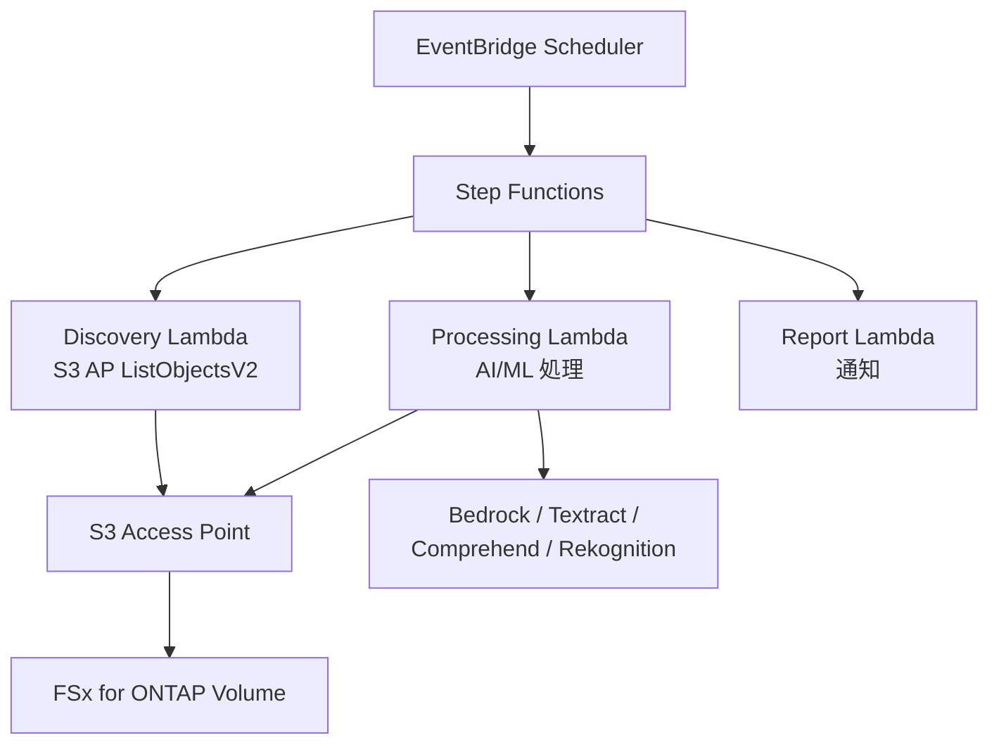

# FSx for ONTAP S3 Access Points — Serverless Patterns

    

🌐 [日本語](README.md) | [English](README.en.md) | [한국어](README.ko.md) | [简体中文](README.zh-CN.md) | [繁體中文](README.zh-TW.md) | [Français](README.fr.md) | [Deutsch](README.de.md) | [Español](README.es.md)

---

> FSx for ONTAP 上のエンタープライズ NAS データを、**データコピーなしに** S3 API 経由でサーバーレス処理する **42 パターン**のリファレンス実装集です。
>
> 28 業界別 UC + 7 FlexCache/FlexClone + 2 GenAI + SAP + HA 監視 + Event-Driven + Edge 配信 + ファイルポータル UI

---

## はじめる

| やりたいこと | ガイド | 所要時間 |
|---|---|---|
| FSx なしでデモを試す | [Demo Mode Guide](docs/demo-mode-guide.md) | 5 分 |
| Web ポータルでファイルを閲覧・処理 | [File Portal UI (Amplify / Nextcloud)](docs/file-portal-amplify-gen2.md) | 10 分 |
| ポータルのデモを見る (スクリーンショット付き) | [Portal Demo Guide (JA)](docs/ja/portal-demo-guide.md) / [EN](docs/en/portal-demo-guide.md) | 5 分 |
| ポータルを自環境にデプロイ | [Deployment Runbook (JA)](docs/ja/portal-deployment-runbook.md) / [EN](docs/en/portal-deployment-runbook.md) | 15 分 |
| パターンを AWS にデプロイ | [Deployment Guide](docs/guides/deployment-guide.md) | 30 分 |
| 自分のワークロードに合うパターンを探す | [Pattern Selection Guide](docs/pattern-selection-guide.md) | 15 分 |
| コストを見積もる | [Cost Calculator](docs/cost-calculator.md) | 5 分 |
| ハンズオン Lab 環境を構築 | [Hands-on Lab IaC](infrastructure/handson-lab/) | 60 分 |

---

<details>
<summary><strong>📂 全パターン一覧（クリックで展開）</strong></summary>

### 業界別ユースケース (UC1-UC28 + SAP)

| # | ディレクトリ | 業界 | 概要 |
|---|---|---|---|
| UC1 | [`legal-compliance/`](solutions/industry/legal-compliance/) | 法務 | NTFS ACL 監査・コンプライアンスレポート |
| UC2 | [`financial-idp/`](solutions/industry/financial-idp/) | 金融 | 帳票 OCR・エンティティ抽出 |
| UC3 | [`manufacturing-analytics/`](solutions/industry/manufacturing-analytics/) | 製造 | IoT センサー・品質検査画像分析 |
| UC4 | [`media-vfx/`](solutions/industry/media-vfx/) | メディア | VFX レンダリング品質チェック |
| UC5 | [`healthcare-dicom/`](solutions/industry/healthcare-dicom/) | 医療 | DICOM 匿名化 |
| UC6 | [`semiconductor-eda/`](solutions/industry/semiconductor-eda/) | 半導体 | GDS/OASIS バリデーション |
| UC7 | [`genomics-pipeline/`](solutions/industry/genomics-pipeline/) | ゲノミクス | FASTQ/VCF 品質チェック |
| UC8 | [`energy-seismic/`](solutions/industry/energy-seismic/) | エネルギー | SEG-Y 地震探査データ解析 |
| UC9 | [`autonomous-driving/`](solutions/industry/autonomous-driving/) | 自動運転 | 映像/LiDAR 前処理 |
| UC10 | [`construction-bim/`](solutions/industry/construction-bim/) | 建設 | BIM モデル管理 |
| UC11 | [`retail-catalog/`](solutions/industry/retail-catalog/) | 小売 | 商品画像タグ付け |
| UC12 | [`logistics-ocr/`](solutions/industry/logistics-ocr/) | 物流 | 配送伝票 OCR |
| UC13 | [`education-research/`](solutions/industry/education-research/) | 教育 | 論文分類・引用分析 |
| UC14 | [`insurance-claims/`](solutions/industry/insurance-claims/) | 保険 | 損害査定 |
| UC15 | [`defense-satellite/`](solutions/industry/defense-satellite/) | 防衛 | 衛星画像解析 |
| UC16 | [`government-archives/`](solutions/industry/government-archives/) | 政府 | 公文書・FOIA |
| UC17 | [`smart-city-geospatial/`](solutions/industry/smart-city-geospatial/) | スマートシティ | 地理空間データ |
| UC18 | [`telecom-network-analytics/`](solutions/industry/telecom-network-analytics/) | 通信 | CDR/ネットワークログ分析 |
| UC19 | [`adtech-creative-management/`](solutions/industry/adtech-creative-management/) | 広告 | クリエイティブ管理 |
| UC20 | [`travel-document-processing/`](solutions/industry/travel-document-processing/) | 旅行 | 予約文書処理 |
| UC21 | [`agri-food-traceability/`](solutions/industry/agri-food-traceability/) | 農業・食品 | トレーサビリティ |
| UC22 | [`transportation-maintenance/`](solutions/industry/transportation-maintenance/) | 運輸 | 設備点検・保守 |
| UC23 | [`sustainability-esg-reporting/`](solutions/industry/sustainability-esg-reporting/) | ESG | メトリクス抽出 |
| UC24 | [`nonprofit-grant-management/`](solutions/industry/nonprofit-grant-management/) | NPO | 助成金管理 |
| UC25 | [`utilities-asset-inspection/`](solutions/industry/utilities-asset-inspection/) | 電力 | ドローン/SCADA 分析 |
| UC26 | [`real-estate-portfolio/`](solutions/industry/real-estate-portfolio/) | 不動産 | 物件画像・契約書 |
| UC27 | [`hr-document-screening/`](solutions/industry/hr-document-screening/) | HR | 履歴書スクリーニング |
| UC28 | [`chemical-sds-management/`](solutions/industry/chemical-sds-management/) | 化学 | SDS・ラボノート |
| SAP | [`sap/erp-adjacent/`](solutions/sap/erp-adjacent/) | SAP/ERP | IDoc・EDI 処理 |

### FlexCache / FlexClone (FC1-FC7)

| # | ディレクトリ | パターン |
|---|---|---|
| FC1 | [`flexcache/anycast-dr/`](solutions/flexcache/anycast-dr/) | AnyCast / DR フェイルオーバー |
| FC2 | [`flexcache/dynamic-render-workflow/`](solutions/flexcache/dynamic-render-workflow/) | ジョブ単位 FlexCache 動的管理 |
| FC3 | [`flexcache/rag-enterprise-files/`](solutions/flexcache/rag-enterprise-files/) | Permission-aware RAG |
| FC4 | [`flexcache/automotive-cae/`](solutions/flexcache/automotive-cae/) | CAE シミュレーション分析 |
| FC5 | [`flexcache/life-sciences-research/`](solutions/flexcache/life-sciences-research/) | 研究データ分類 |
| FC6 | [`flexcache/gaming-build-pipeline/`](solutions/flexcache/gaming-build-pipeline/) | ゲームアセット品質チェック |
| FC7 | [`flexcache/devops-cicd/`](solutions/flexcache/devops-cicd/) | FlexClone Dev/Test & CI/CD |

### GenAI / HA / Event-Driven / Edge / File Portal

| ディレクトリ | 概要 |
|---|---|
| [`genai/kb-selfservice-curation/`](solutions/genai/kb-selfservice-curation/) | Bedrock KB セルフサービス運用 |
| [`genai/quick-agentic-workspace/`](solutions/genai/quick-agentic-workspace/) | エージェント型ワークスペース |
| [`ha/lifekeeper-monitoring/`](solutions/ha/lifekeeper-monitoring/) | HA LifeKeeper AI 監視 |
| [`event-driven/fpolicy/`](solutions/event-driven/fpolicy/) | FPolicy イベント駆動パイプライン |
| [`edge/content-delivery/`](solutions/edge/content-delivery/) | CDN/エッジ配信（ベンダー非依存） |
| [`amplify-portal/`](solutions/amplify-portal/) | ファイルポータル UI（Amplify Gen2） |
| [`nextcloud-test/`](solutions/nextcloud-test/) | ファイルポータル UI（Nextcloud Docker） |

### インフラ・共通

| ディレクトリ | 概要 |
|---|---|
| [`shared/`](shared/) | 共通 Python モジュール（S3ApHelper, OntapClient, Observability） |
| [`operations/`](operations/) | 運用最適化 6 パターン（容量/効率/ティアリング/スナップショット/コスト/QoS） |
| [`infrastructure/handson-lab/`](infrastructure/handson-lab/) | ハンズオン Lab IaC（VPC/AD/FSx/EC2/S3AP） |
| [`docs/`](docs/) | 設計ガイド・ベンチマーク（40+ ドキュメント） |
| [`scripts/`](scripts/) | デプロイ・ベンチマーク・ユーティリティ |
| [`.github/workflows/`](.github/workflows/) | CI/CD（lint → test → security → deploy） |

</details>

---

## アーキテクチャ

```
EventBridge Scheduler (定期実行)
  └→ Step Functions State Machine
      ├→ Discovery Lambda: S3 AP からファイル一覧取得
      ├→ Map State (並列): 各ファイルを AI/ML で処理
      └→ Report Lambda: 結果レポート → SNS 通知
```

全パターンが共有する基本フロー。AI/ML サービス（Bedrock, Textract, Comprehend, Rekognition）は UC ごとに異なります。

<details>
<summary><strong>Mermaid 図で見る（クリックで展開）</strong></summary>



</details>

<details>
<summary><strong>カテゴリ別アーキテクチャ（FlexCache, GenAI, HA, Event-Driven, Edge）</strong></summary>

各カテゴリの詳細なアーキテクチャ図:
- [FlexCache / FlexClone](docs/industry-workload-mapping.md)
- [GenAI (Bedrock KB / Agentic)](solutions/genai/kb-selfservice-curation/docs/architecture.md)
- [HA LifeKeeper Monitoring](solutions/ha/lifekeeper-monitoring/README.md)
- [Event-Driven FPolicy](solutions/event-driven/fpolicy/README.md)
- [Edge / CDN](solutions/edge/content-delivery/docs/architecture.md)
- [File Portal (Amplify Gen2)](solutions/amplify-portal/README.md)

</details>

---

<details>
<summary><strong>📖 ドキュメントガイド（セキュリティ・運用・設計）</strong></summary>

### ファイルポータル

| ドキュメント | 内容 |
|---|---|
| [Portal Demo Guide (JA)](docs/ja/portal-demo-guide.md) / [EN](docs/en/portal-demo-guide.md) | スクリーンショット付きデモフロー (15 分) |
| [Deployment Runbook (JA)](docs/ja/portal-deployment-runbook.md) / [EN](docs/en/portal-deployment-runbook.md) | デプロイ・削除の運用手順 + トラブルシューティング |
| [Portal Authorization Design (JA)](docs/ja/portal-authorization-design.md) / [EN](docs/en/portal-authorization-design.md) | RBAC 設計 (Viewer/Contributor/Storage Admin/Auditor) |
| [File Portal UI Options](docs/file-portal-amplify-gen2.md) | Amplify / Nextcloud / Custom Build の選び方 |
| [Portal README](solutions/amplify-portal/README.md) | セットアップ全手順 + Known Pitfalls |

### セキュリティ・データ保護

| ドキュメント | 内容 |
|---|---|
| [S3 AP Authorization Model (JA)](docs/s3ap-authorization-model.md) / [EN](docs/s3ap-authorization-model.en.md) | IAM + File System Identity の二重認可モデル |
| [SaaS Gap Analysis (JA)](docs/aws-feature-requests/file-portal-service-gap.md) / [EN](docs/aws-feature-requests/file-portal-service-gap.en.md) | 15 SaaS との機能比較 + プロトコルアクセシビリティ |
| [AD-Joined SVM Prerequisites](docs/en/ad-joined-svm-s3ap-prerequisites.md) | AD 連携 S3 AP の前提条件と制約 |
| [Incident Response Playbook](docs/incident-response-playbook.md) | セキュリティインシデント対応手順 |

### S3 AP 技術詳細

| ドキュメント | 内容 |
|---|---|
| [S3AP Compatibility Notes](docs/s3ap-compatibility-notes.md) | API 互換性・Presigned URL・制約 |
| [S3AP Performance Considerations](docs/s3ap-performance-considerations.md) | スループット設計・FlexCache 活用 |
| [ONTAP Integration Notes](docs/ontap-integration-notes.md) | マルチプロトコル共存・ID マッピング |

### 運用

| ドキュメント | 内容 |
|---|---|
| [Demo Mode Guide](docs/demo-mode-guide.md) | FSx for ONTAP なしで検証する方法 |
| [Cost Calculator](docs/cost-calculator.md) | パターン別月額見積もり |
| [Local Testing Quick Start](docs/local-testing-quick-start.md) | ローカル pytest + sam local |

</details>

---

## S3 Access Point の主要制約

| 制約 | 回避策 |
|---|---|
| S3 Event Notifications 非対応 | EventBridge Scheduler ポーリング or FPolicy |
| Presigned URL 非公式 | 動作するが本番非推奨 |
| 5GB アップロード上限 | Multipart Upload で対応 |
| Athena 結果を S3AP に書き戻し不可 | 標準 S3 バケットに出力 |
| SSE-FSX のみ | ボリュームの KMS 設定で暗号化 |

詳細: [S3AP Compatibility Notes](docs/s3ap-compatibility-notes.md) | [Compatibility Matrix (AWS 確認済み)](https://github.com/Yoshiki0705/fsxn-lakehouse-integrations/blob/main/docs/en/compatibility-matrix.md)

---

<details>
<summary><strong>📚 関連記事・リポジトリ</strong></summary>

### 記事シリーズ

| トピック | 日本語 | English |
|---|---|---|
| 42 パターンの出発点 | [はてなブログ](https://hakobiya.hatenablog.com/entry/fsxn-s3ap-serverless-part1-introduction) | [dev.to](https://dev.to/aws-builders/industry-specific-serverless-automation-patterns-with-fsx-for-ontap-s3-access-points-3e0a) |
| 本番アーキテクチャ | [はてなブログ](https://hakobiya.hatenablog.com/entry/fsxn-s3ap-serverless-part2-production-architecture) | — |
| 運用ベースライン | [はてなブログ](https://hakobiya.hatenablog.com/entry/fsxn-s3ap-serverless-part3-operational-baseline) | [dev.to](https://dev.to/aws-builders/production-rollout-vpc-endpoint-auto-detection-and-the-cdk-no-go-fsx-for-ontap-s3-access-3lni) |
| FPolicy Event-Driven | [はてなブログ](https://hakobiya.hatenablog.com/entry/fsxn-s3ap-serverless-part4-event-driven-fpolicy) | [dev.to](https://dev.to/aws-builders/fpolicy-event-driven-pipeline-multi-account-stacksets-and-cost-optimization-fsx-for-ontap-s3-5bd6) |
| 28 業種パターン | [はてなブログ](https://hakobiya.hatenablog.com/entry/fsxn-s3ap-serverless-part5-field-ready-28-patterns) | [dev.to](https://dev.to/aws-builders/from-serverless-patterns-to-field-ready-reference-architecture-fsx-for-ontap-s3-access-points-dhj) |
| GenAI 統合 | [はてなブログ](https://hakobiya.hatenablog.com/entry/fsxn-s3ap-serverless-part6-genai-42-patterns) | — |

### 関連リポジトリ

| リポジトリ | 概要 |
|---|---|
| [fsxn-observability-integrations](https://github.com/Yoshiki0705/fsxn-observability-integrations) | 可観測性統合 (ARP/AI 自動対応、メトリクス、アラート) |
| [Permission-aware-RAG-FSxN-CDK](https://github.com/Yoshiki0705/Permission-aware-RAG-FSxN-CDK-github) | 権限考慮型 RAG チャットボット（CDK + Next.js + ECS） |
| [fsxn-lakehouse-integrations](https://github.com/Yoshiki0705/fsxn-lakehouse-integrations) | Lakehouse 統合（Databricks, Snowflake, Athena, Glue, EMR） |
| [vmware-migration-ec2-ontap](https://github.com/Yoshiki0705/vmware-migration-ec2-ontap) | VMware → EC2 + FSx for ONTAP 移行 |

### AWS 公式リソース

| リソース | 概要 |
|---|---|
| [AWS Workshop: Amazon Quick + FSx for ONTAP S3 AP](https://catalog.us-east-1.prod.workshops.aws/workshops/9cd82e0b-8348-456b-932a-818b9e5825a1/en-US/08-quicksuite/61-setup) | Quick Suite と S3 AP 連携のハンズオン Lab |
| [AWS Storage Blog: AI-powered analytics on enterprise file data](https://aws.amazon.com/blogs/storage/enabling-ai-powered-analytics-on-enterprise-file-data-configuring-s3-access-points-for-amazon-fsx-for-netapp-ontap-with-active-directory/) | AD 構成の S3 AP + Amazon Quick 連携手順 |
| [Guidance: Scaling EDA on AWS](https://aws.amazon.com/solutions/guidance/scaling-electronic-design-automation-on-aws/) | 半導体 EDA ワークフローのクラウドスケーリング |
| [Semiconductor Design on AWS (Whitepaper)](https://docs.aws.amazon.com/whitepapers/latest/semiconductor-design-on-aws/semiconductor-design-on-aws.pdf) | 半導体設計ワークフローのリファレンスアーキテクチャ |

</details>

<details>
<summary><strong>🔧 開発者向け（テスト・コントリビュート）</strong></summary>

### テスト

```bash
pytest shared/tests/ -v                    # ユニットテスト
ruff check . && ruff format --check .      # Python リンター
cfn-lint solutions/industry/*/template.yaml # CloudFormation 検証
```

### 技術スタック

Python 3.12 | CloudFormation + SAM | Lambda (ARM64) | Step Functions | EventBridge | Bedrock / Textract / Comprehend / Rekognition | Secrets Manager | Athena + Glue

### コントリビュート

Issue や Pull Request を歓迎します。[CONTRIBUTING.md](CONTRIBUTING.md) を参照してください。

</details>

---

## ライセンス

MIT — [LICENSE](LICENSE)

---

🌐 [日本語](README.md) | [English](README.en.md) | [한국어](README.ko.md) | [简体中文](README.zh-CN.md) | [繁體中文](README.zh-TW.md) | [Français](README.fr.md) | [Deutsch](README.de.md) | [Español](README.es.md)
