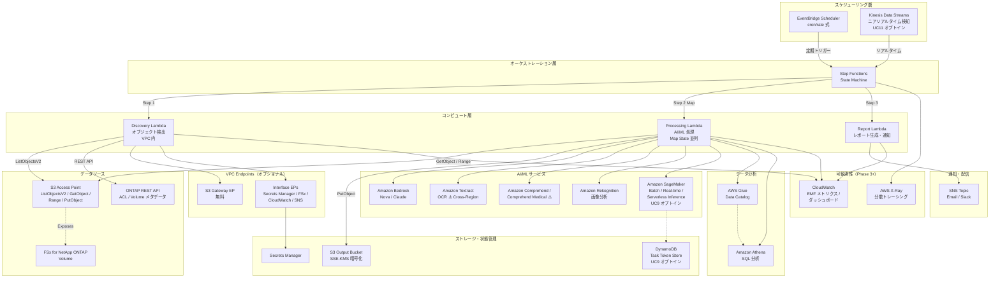
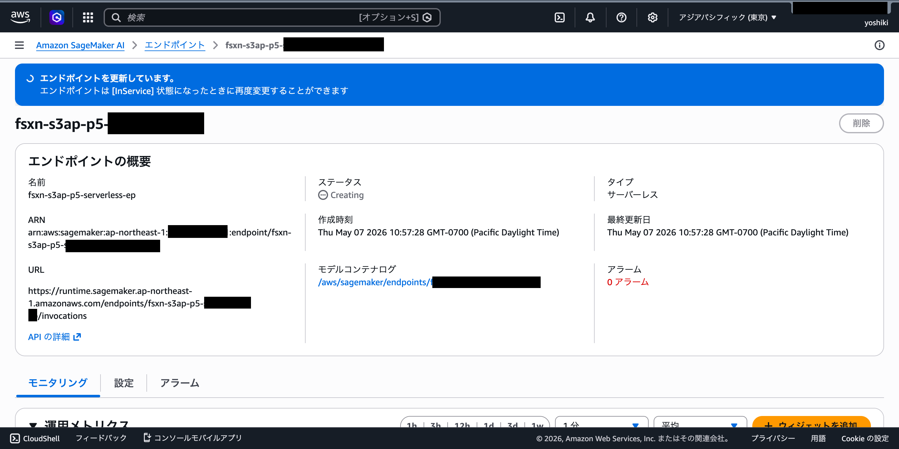

# FSx for ONTAP S3 Access Points Serverless Patterns

🌐 **Language / 言語**: [日本語](README.md) | [English](README.en.md) | [한국어](README.ko.md) | [简体中文](README.zh-CN.md) | [繁體中文](README.zh-TW.md) | [Français](README.fr.md) | [Deutsch](README.de.md) | [Español](README.es.md)

Amazon FSx for NetApp ONTAP の S3 Access Points を活用した、業界別サーバーレス自動化パターン集です。

> **本リポジトリの位置づけ**: これは「設計判断を学ぶためのリファレンス実装」です。一部ユースケースは AWS 環境で E2E 検証済みであり、その他のユースケースも CloudFormation デプロイ、共通 Discovery Lambda、主要コンポーネントの動作確認を実施しています。PoC から本番環境への段階的な適用を想定し、コスト最適化、セキュリティ、エラーハンドリングの設計判断を具体的なコードで示すことを目的としています。

## 関連記事

本リポジトリは以下の記事で解説したアーキテクチャの実装例です:

- **FSx for ONTAP S3 Access Points as a Serverless Automation Boundary — AI Data Pipelines, Volume-Level SnapMirror DR, and Capacity Guardrails**
  https://dev.to/yoshikifujiwara/fsx-for-ontap-s3-access-points-as-a-serverless-automation-boundary-ai-data-pipelines-ili

記事ではアーキテクチャの設計思想とトレードオフを解説し、本リポジトリでは具体的な再利用可能な実装パターンを提供します。

## 概要

本リポジトリは、FSx for NetApp ONTAP に保存されたエンタープライズデータを **S3 Access Points** 経由でサーバーレスに処理する **17 の業界別パターン** を提供します（Phase 1: UC1–UC5、Phase 2: UC6–UC14、Phase 7: UC15–UC17）。

> 以降では、FSx for ONTAP S3 Access Points を簡潔に **S3 AP** と表記します。

各ユースケースは独立した CloudFormation テンプレートで完結し、共通モジュール（ONTAP REST API クライアント、FSx ヘルパー、S3 AP ヘルパー）を `shared/` に配置して再利用しています。

### 主な特徴

- **ポーリングベースアーキテクチャ**: S3 AP が `GetBucketNotificationConfiguration` 非対応のため、EventBridge Scheduler + Step Functions による定期実行
- **イベント駆動パス（Phase 10）**: ONTAP FPolicy → ECS Fargate → SQS → EventBridge による NFSv3 ファイルイベント検知（[クイックスタート](docs/event-driven/README.md)）
- **共通モジュール分離**: OntapClient / FsxHelper / S3ApHelper を全ユースケースで再利用
- **CloudFormation / SAM Transform ベース**: 各ユースケースは独立した CloudFormation テンプレート（SAM Transform 利用）で完結
- **セキュリティファースト**: TLS 検証デフォルト有効、最小権限 IAM、KMS 暗号化
- **コスト最適化**: 高コストの常時稼働リソース（Interface VPC Endpoints 等）をオプショナル化

## アーキテクチャ



> 図は全 Phase（Phase 1〜5）のサービスを含む全体アーキテクチャを示しています。SageMaker、Kinesis、DynamoDB は CloudFormation Conditions でオプトイン制御されており、有効化しない限り追加コストは発生しません。PoC / デモ用途では VPC 外 Lambda 構成も選択できます。詳細は後述の「Lambda 配置の選択指針」を参照してください。

### ワークフロー概要

```
EventBridge Scheduler (定期実行)
  └─→ Step Functions State Machine
       ├─→ Discovery Lambda: S3 AP からオブジェクト一覧取得 → Manifest 生成
       ├─→ Map State (並列処理): 各オブジェクトを AI/ML サービスで処理
       └─→ Report/Notification: 結果レポート生成 → SNS 通知
```

## ユースケース一覧

### Phase 1（UC1–UC5）

| # | ディレクトリ | 業界 | パターン | 使用 AI/ML サービス | ap-northeast-1 での確認状況 |
|---|-------------|------|---------|-------------------|-------------------|
| UC1 | [`legal-compliance/`](legal-compliance/README.md) | 法務・コンプライアンス | ファイルサーバー監査・データガバナンス | Athena, Bedrock | ✅ E2E 成功 |
| UC2 | [`financial-idp/`](financial-idp/README.md) | 金融・保険 | 契約書・請求書の自動処理 (IDP) | Textract ⚠️, Comprehend, Bedrock | ⚠️ 東京非対応（対応リージョン利用） |
| UC3 | [`manufacturing-analytics/`](manufacturing-analytics/README.md) | 製造業 | IoT センサーログ・品質検査画像の分析 | Athena, Rekognition | ✅ E2E 成功 |
| UC4 | [`media-vfx/`](media-vfx/README.md) | メディア | VFX レンダリングパイプライン | Rekognition, Deadline Cloud | ⚠️ Deadline Cloud 要設定 |
| UC5 | [`healthcare-dicom/`](healthcare-dicom/README.md) | 医療 | DICOM 画像の自動分類・匿名化 | Rekognition, Comprehend Medical ⚠️ | ⚠️ 東京非対応（対応リージョン利用） |

### Phase 2（UC6–UC14）

| # | ディレクトリ | 業界 | パターン | 使用 AI/ML サービス | ap-northeast-1 での確認状況 |
|---|-------------|------|---------|-------------------|-------------------|
| UC6 | [`semiconductor-eda/`](semiconductor-eda/README.md) | 半導体 / EDA | GDS/OASIS バリデーション・メタデータ抽出・DRC 集計 | Athena, Bedrock | ✅ E2E 成功 (Bedrock レポート生成確認) |
| UC7 | [`genomics-pipeline/`](genomics-pipeline/README.md) | ゲノミクス | FASTQ/VCF 品質チェック・バリアントコール集計 | Athena, Bedrock, Comprehend Medical ⚠️ | ✅ E2E 成功 (Cross-Region us-east-1, entities 検出確認) |
| UC8 | [`energy-seismic/`](energy-seismic/README.md) | エネルギー | SEG-Y メタデータ抽出・坑井ログ異常検知 | Athena, Bedrock, Rekognition | ✅ E2E 成功 |
| UC9 | [`autonomous-driving/`](autonomous-driving/README.md) | 自動運転 / ADAS | 映像/LiDAR 前処理・品質チェック・アノテーション | Rekognition, Bedrock, SageMaker | ✅ E2E 成功 (SageMaker は Endpoint 未作成のためスキップ) |
| UC10 | [`construction-bim/`](construction-bim/README.md) | 建設 / AEC | BIM バージョン管理・図面 OCR・安全コンプライアンス | Textract ⚠️, Bedrock, Rekognition | ✅ E2E 成功 (Cross-Region us-east-1) |
| UC11 | [`retail-catalog/`](retail-catalog/README.md) | 小売 / EC | 商品画像タグ付け・カタログメタデータ生成 | Rekognition, Bedrock | ✅ E2E 成功 (15 labels 検出確認) |
| UC12 | [`logistics-ocr/`](logistics-ocr/README.md) | 物流 | 配送伝票 OCR・倉庫在庫画像分析 | Textract ⚠️, Rekognition, Bedrock | ✅ E2E 成功 (Cross-Region us-east-1, テキスト抽出確認) |
| UC13 | [`education-research/`](education-research/README.md) | 教育 / 研究 | 論文 PDF 分類・引用ネットワーク分析 | Textract ⚠️, Comprehend, Bedrock | ✅ E2E 成功 (Cross-Region us-east-1) |
| UC14 | [`insurance-claims/`](insurance-claims/README.md) | 保険 | 事故写真損害評価・見積書 OCR・査定レポート | Rekognition, Textract ⚠️, Bedrock | ✅ E2E 成功 (Rekognition + Textract 両方確認) |

### Phase 7（UC15–UC17）Public Sector 拡張

| # | ディレクトリ | 業界 | パターン | 使用 AI/ML サービス | ap-northeast-1 での確認状況 |
|---|-------------|------|---------|-------------------|-------------------|
| UC15 | [`defense-satellite/`](defense-satellite/README.md) | 防衛・宇宙 | 衛星画像解析（物体検出・変化検出・アラート） | Rekognition, SageMaker (optional), Bedrock | ✅ コードとテスト完了、AWS 検証は Phase 7 テーマ E |
| UC16 | [`government-archives/`](government-archives/README.md) | 政府 | 公文書アーカイブ・FOIA 対応（OCR・分類・墨消し・FOIA 20 営業日管理） | Textract, Comprehend, Bedrock, OpenSearch (optional) | ✅ コードとテスト完了、AWS 検証は Phase 7 テーマ E |
| UC17 | [`smart-city-geospatial/`](smart-city-geospatial/README.md) | スマートシティ | 地理空間解析（CRS 正規化・土地利用分類・災害リスクマッピング・計画レポート） | Rekognition, SageMaker (optional), Bedrock (Nova Lite) | ✅ コードとテスト完了、AWS 検証は Phase 7 テーマ E |

> **Public Sector 適合性**: UC15 は DoD CC SRG / CSfC / FedRAMP High（GovCloud 移行時）、UC16 は NARA / FOIA Section 552 / Section 508、UC17 は INSPIRE Directive / OGC 標準に適合する設計。

> **リージョン制約**: Amazon Textract と Amazon Comprehend Medical は ap-northeast-1（東京）で利用できません。UC2, UC10, UC12, UC13, UC14 は Textract、UC5, UC7 は Comprehend Medical を使用するため、Cross_Region_Client 経由で us-east-1 等の対応リージョンへ API コールをルーティングします。Rekognition, Comprehend, Bedrock, Athena は ap-northeast-1 で利用可能です。
> 
> 参考: [Textract 対応リージョン](https://docs.aws.amazon.com/general/latest/gr/textract.html) | [Comprehend Medical 対応リージョン](https://docs.aws.amazon.com/general/latest/gr/comprehend-med.html) | [クロスリージョン設定ガイド](docs/cross-region-guide.md)

### ドキュメント（アーキテクチャ・デモガイド）

各ユースケースの詳細なアーキテクチャ図とデモガイドは `docs/` フォルダに8言語で提供しています。

| # | ユースケース | アーキテクチャ | デモガイド |
|---|-------------|--------------|-----------|
| UC1 | 法務・コンプライアンス | [📐 Architecture](legal-compliance/docs/architecture.md) | [🎬 Demo Guide](legal-compliance/docs/demo-guide.md) |
| UC2 | 金融・保険 (IDP) | [📐 Architecture](financial-idp/docs/architecture.md) | [🎬 Demo Guide](financial-idp/docs/demo-guide.md) |
| UC3 | 製造業 | [📐 Architecture](manufacturing-analytics/docs/architecture.md) | [🎬 Demo Guide](manufacturing-analytics/docs/demo-guide.md) |
| UC4 | メディア (VFX) | [📐 Architecture](media-vfx/docs/architecture.md) | [🎬 Demo Guide](media-vfx/docs/demo-guide.md) |
| UC5 | 医療 (DICOM) | [📐 Architecture](healthcare-dicom/docs/architecture.md) | [🎬 Demo Guide](healthcare-dicom/docs/demo-guide.md) |
| UC6 | 半導体 / EDA | [📐 Architecture](semiconductor-eda/docs/architecture.md) | [🎬 Demo Guide](semiconductor-eda/docs/demo-guide.md) |
| UC7 | ゲノミクス | [📐 Architecture](genomics-pipeline/docs/architecture.md) | [🎬 Demo Guide](genomics-pipeline/docs/demo-guide.md) |
| UC8 | エネルギー | [📐 Architecture](energy-seismic/docs/architecture.md) | [🎬 Demo Guide](energy-seismic/docs/demo-guide.md) |
| UC9 | 自動運転 / ADAS | [📐 Architecture](autonomous-driving/docs/architecture.md) | [🎬 Demo Guide](autonomous-driving/docs/demo-guide.md) |
| UC10 | 建設 / AEC (BIM) | [📐 Architecture](construction-bim/docs/architecture.md) | [🎬 Demo Guide](construction-bim/docs/demo-guide.md) |
| UC11 | 小売 / EC | [📐 Architecture](retail-catalog/docs/architecture.md) | [🎬 Demo Guide](retail-catalog/docs/demo-guide.md) |
| UC12 | 物流 | [📐 Architecture](logistics-ocr/docs/architecture.md) | [🎬 Demo Guide](logistics-ocr/docs/demo-guide.md) |
| UC13 | 教育 / 研究 | [📐 Architecture](education-research/docs/architecture.md) | [🎬 Demo Guide](education-research/docs/demo-guide.md) |
| UC14 | 保険 | [📐 Architecture](insurance-claims/docs/architecture.md) | [🎬 Demo Guide](insurance-claims/docs/demo-guide.md) |
| UC15 | 防衛・宇宙 (衛星画像) | [📐 Architecture](defense-satellite/docs/architecture.md) | [🎬 Demo Guide](defense-satellite/docs/demo-guide.md) |
| UC16 | 政府 (FOIA / 公文書) | [📐 Architecture](government-archives/docs/architecture.md) | [🎬 Demo Guide](government-archives/docs/demo-guide.md) |
| UC17 | スマートシティ | [📐 Architecture](smart-city-geospatial/docs/architecture.md) | [🎬 Demo Guide](smart-city-geospatial/docs/demo-guide.md) |

### UI/UX スクリーンショット（エンドユーザー / 職員 / 担当者向け画面）

各 UC の **エンドユーザー・職員・担当者が日常業務で実際に見る UI/UX 画面** を
各 UC の README および demo-guide に掲載しています。Step Functions
ワークフローグラフのような技術者向けビューは各 phase 毎の検証結果ドキュメント
（`docs/verification-results-phase*.md`）にまとめています。

Public Sector (UC15/16/17) だけでなく、全業種の UC で同じ方針を採用:
- **一般職員 / 担当者視点**: S3 コンソールで成果物を確認する、Bedrock レポート
  を読む、SNS メールで通知を受ける、DynamoDB で履歴を検索する等の日常業務画面
- **技術者視点は除外**: CloudFormation スタックイベント、Lambda ログ、Step
  Functions グラフ（ワークフロー可視化目的のものを除く）は `verification-results-*.md`
  側に分離

| UC | 業種 | 掲載画面数 | 主な画面内容 | 掲載場所 |
|----|------|----------|-------------|----------|
| UC1 | 法務・コンプライアンス | 1 枚 | Step Functions グラフ（監査担当者向けワークフロー可視化） | [`legal-compliance/docs/demo-guide.md`](legal-compliance/docs/demo-guide.md) |
| UC2 | 金融・IDP | 1 枚 | Step Functions グラフ（請求書処理担当者向けワークフロー可視化） | [`financial-idp/docs/demo-guide.md`](financial-idp/docs/demo-guide.md) |
| UC3 | 製造業・分析 | 1 枚 | Step Functions グラフ（品質管理担当者向けワークフロー可視化） | [`manufacturing-analytics/docs/demo-guide.md`](manufacturing-analytics/docs/demo-guide.md) |
| UC4 | メディア・VFX | 未掲載 | （レンダリング担当者向け画面、今後撮影予定） | [`media-vfx/docs/demo-guide.md`](media-vfx/docs/demo-guide.md) |
| UC5 | 医療・DICOM | 1 枚 | Step Functions グラフ（医療情報管理者向けワークフロー可視化） | [`healthcare-dicom/docs/demo-guide.md`](healthcare-dicom/docs/demo-guide.md) |
| UC6 | 半導体・EDA | 4 枚 | FSx Volumes 一覧 / S3 出力バケット / Athena クエリ結果 / Bedrock 設計レビューレポート | [`semiconductor-eda/docs/demo-guide.md`](semiconductor-eda/docs/demo-guide.md) |
| UC7 | ゲノム解析 | 1 枚 | Step Functions グラフ（研究者向けワークフロー可視化） | [`genomics-pipeline/docs/demo-guide.md`](genomics-pipeline/docs/demo-guide.md) |
| UC8 | エネルギー・地震探査 | 1 枚 | Step Functions グラフ（地質解析担当者向けワークフロー可視化） | [`energy-seismic/docs/demo-guide.md`](energy-seismic/docs/demo-guide.md) |
| UC9 | 自動運転 | 未掲載 | （ADAS 分析担当者向け画面、今後撮影予定） | [`autonomous-driving/docs/demo-guide.md`](autonomous-driving/docs/demo-guide.md) |
| UC10 | 建設・BIM | 1 枚 | Step Functions グラフ（BIM 管理者 / 安全担当者向けワークフロー可視化） | [`construction-bim/docs/demo-guide.md`](construction-bim/docs/demo-guide.md) |
| UC11 | 小売・カタログ | 2 枚 | 商品タグ付け結果 / S3 出力バケット（EC 担当者向け） | [`retail-catalog/docs/demo-guide.md`](retail-catalog/docs/demo-guide.md) |
| UC12 | 物流・OCR | 1 枚 | Step Functions グラフ（配送担当者向けワークフロー可視化） | [`logistics-ocr/docs/demo-guide.md`](logistics-ocr/docs/demo-guide.md) |
| UC13 | 教育・研究 | 1 枚 | Step Functions グラフ（研究事務担当者向けワークフロー可視化） | [`education-research/docs/demo-guide.md`](education-research/docs/demo-guide.md) |
| UC14 | 保険 | 2 枚 | 請求レポート / S3 出力バケット（査定担当者向け） | [`insurance-claims/docs/demo-guide.md`](insurance-claims/docs/demo-guide.md) |
| UC15 | 防衛・衛星画像 (Public Sector) | 4 枚 | S3 配置 / 出力 / SNS メール / JSON 成果物（分析担当者向け） | [`defense-satellite/README.md`](defense-satellite/README.md#検証済みの画面スクリーンショット) |
| UC16 | 政府・FOIA (Public Sector) | 5 枚 | 配置 / 墨消しプレビュー / メタデータ / FOIA リマインダーメール / DynamoDB 保管期間履歴（公文書担当者向け） | [`government-archives/README.md`](government-archives/README.md#検証済みの画面スクリーンショット) |
| UC17 | スマートシティ (Public Sector) | 5 枚 | GIS 配置 / Bedrock レポート / リスクマップ / 土地利用分布 / 時系列履歴（都市計画担当者向け） | [`smart-city-geospatial/README.md`](smart-city-geospatial/README.md#検証済みの画面スクリーンショット) |

**共通スクリーンショット** (業種横断の汎用画面、`docs/screenshots/masked/common/` 配下):
- `fsx-s3ap-detail.png` — FSxN S3 Access Point 詳細ビュー（業種問わずストレージ管理者が参照）
- `s3ap-list.png` — S3 Access Points 一覧（業種問わず IT 管理者が参照）

**追加のフェーズ別画面** (`docs/screenshots/masked/phase{1..7}/`):
- Phase 1-6b: インフラ構築・機能追加時の技術者向け画面（CloudFormation スタック、Lambda 関数一覧、SageMaker Endpoint 等）
- Phase 7: UC15/16/17 の共通 FSx S3 Access Points ビュー等

画像ファイル仕様は `docs/screenshots/masked/phase{N}/README.md` 配下で管理。
マスク対象のガイドは [`docs/screenshots/MASK_GUIDE.md`](docs/screenshots/MASK_GUIDE.md) を参照。

> 各ドキュメントは8言語（日本語・English・한국어・简体中文・繁體中文・Français・Deutsch・Español）で提供されています。ドキュメント上部の Language Switcher から切り替えできます。

## AWS 仕様上の制約と回避策

### 出力先の選択（OutputDestination パラメータ）

各 UC の CloudFormation テンプレートは `OutputDestination` パラメータで AI/ML
成果物の書き込み先を選択できます（UC11/14 で先行実装、他 UC は順次展開予定）:

- **`STANDARD_S3`** (デフォルト): 新しい S3 バケットに書き込み（従来どおり）
- **`FSXN_S3AP`**: FSx for NetApp ONTAP の S3 Access Point 経由でオリジナルデータと
  同一ボリュームに書き込み（**"no data movement" パターン**、SMB/NFS ユーザーが
  AI 成果物をディレクトリ構造内で閲覧可能）

```bash
# FSxN S3AP モードでデプロイ
aws cloudformation deploy \
  --template-file retail-catalog/template-deploy.yaml \
  --stack-name fsxn-retail-catalog-demo \
  --parameter-overrides \
    OutputDestination=FSXN_S3AP \
    OutputS3APPrefix=ai-outputs/ \
    ... (他の必須パラメータ)
```

### FSxN S3 Access Points の AWS 仕様上の制約

FSxN S3 Access Points は S3 API の一部のみサポートします
（[Access point compatibility](https://docs.aws.amazon.com/fsx/latest/ONTAPGuide/access-points-for-fsxn-object-api-support.html)）。
以下の制約により、一部機能は標準 S3 バケットを使う必要があります:

| AWS 仕様上の制約 | 影響 | 本プロジェクトの回避策 | 機能改善要望 (FR) |
|---|---|---|---|
| Athena クエリ結果の出力先に S3AP を指定不可<br>（Athena は S3AP に write back できない） | UC6/7/8/13 で Athena 結果は標準 S3 必須 | 各テンプレートで Athena 結果専用の S3 バケットを作成 | [FR-1](docs/aws-feature-requests/fsxn-s3ap-improvements.md#fr-1) |
| S3AP で S3 Event Notifications / EventBridge イベント発行不可 | イベント駆動ワークフローは実装不可 | EventBridge Scheduler + Discovery Lambda のポーリング方式 | [FR-2](docs/aws-feature-requests/fsxn-s3ap-improvements.md#fr-2) |
| S3AP で Object Lifecycle policy 非対応 | 7年保管（UC1 法務）、永久保管（UC16 政府アーカイブ）等の自動化が困難 | 別 Lambda で定期削除スイーパーを実装（未実装、バックログ） | [FR-3](docs/aws-feature-requests/fsxn-s3ap-improvements.md#fr-3) |
| S3AP で Object Versioning / Presigned URL 非対応 | 文書バージョン管理、外部監査人への時限共有が不可 | DynamoDB でバージョン管理、標準 S3 コピー + Presign | [FR-4](docs/aws-feature-requests/fsxn-s3ap-improvements.md#fr-4) |
| 5GB アップロード上限 | 大型バイナリ（4K 動画、未圧縮 GeoTIFF 等） | `shared.s3ap_helper.multipart_upload()` で 5GB 未満まで対応 | (AWS 仕様として受容) |
| SSE-FSX のみサポート（SSE-KMS 不可） | カスタム KMS キーでの暗号化不可 | FSx ボリューム自体の KMS 設定で暗号化 | (AWS 仕様として受容) |

全 4 つの機能改善要望（FR-1〜FR-4）の詳細とビジネスインパクトは
[`docs/aws-feature-requests/fsxn-s3ap-improvements.md`](docs/aws-feature-requests/fsxn-s3ap-improvements.md)
にまとめています（AWS サポート / re:Post 投稿用ドキュメント）。

3 つの出力パターン（Pattern A/B/C）の詳細比較は
[`docs/output-destination-patterns.md`](docs/output-destination-patterns.md) を参照。

### UC 別の出力先制約

現行の UC 実装には 3 つの出力パターンがあります:

- **🟢 UC1-UC5** (Pattern A, 2026-05-11 更新): `S3AccessPointOutputAlias` (legacy、optional) + 新規追加の `OutputDestination` / `OutputS3APAlias` / `OutputS3APPrefix` をサポート。デフォルト `OutputDestination=FSXN_S3AP` で現行動作を維持
- **🟢🆕 UC9/10/11/12/14** (Pattern B, 2026-05-10 実装): `OutputDestination` 切替機構 (STANDARD_S3 ⇄ FSXN_S3AP)。デフォルト `OutputDestination=STANDARD_S3`。UC11/14 は AWS 実検証完了、UC9/10/12 は単体テストのみ完了
- **🟡 UC6/7/8/13** (Pattern C): 現状 `OUTPUT_BUCKET` のみ（標準 S3 固定）、Athena 結果は仕様上標準 S3 必須のため `OutputDestination` 適用は部分的
- **🟢🆕 UC15/16/17** (Pattern B, 2026-05-11 実装): `OutputDestination` 切替機構 (STANDARD_S3 ⇄ FSXN_S3AP) を追加。デフォルト `OutputDestination=STANDARD_S3`。処理結果（タイリングメタデータ / 物体検出 / OCR / 墨消し / リスクマップ / Bedrock レポート等）を標準 S3 または FSxN S3AP に選択可能。Discovery Lambda の manifest 出力は `S3_ACCESS_POINT_OUTPUT` で引き続き S3AP へ

**🎉 API 統一 (2026-05-11)**: UC1-UC5 に加え、UC15/16/17 にも `OutputDestination` / `OutputS3APAlias` パラメータを追加しました。これにより **13 UC (UC1-5/9/10/11/12/14/15/16/17) で統一された API** でデプロイ可能です。Pattern A UC の `S3AccessPointOutputAlias` は legacy として optional で残り、後方互換性が保たれています。

| UC | 入力元 | 出力先 | 出力先選択機構 | 備考 |
|----|------|------|----------|------|
| UC1 legal-compliance | S3AP | S3AP (既存) | ✅ `OutputDestination` + legacy `S3AccessPointOutputAlias` | 契約メタデータ / 監査ログ |
| UC2 financial-idp | S3AP | S3AP (既存) | ✅ `OutputDestination` + legacy `S3AccessPointOutputAlias` | 請求書 OCR 結果 |
| UC3 manufacturing-analytics | S3AP | S3AP (既存) | ✅ `OutputDestination` + legacy `S3AccessPointOutputAlias` | 検査結果 / 異常検知 |
| UC4 media-vfx | S3AP | S3AP (既存) | ✅ `OutputDestination` + legacy `S3AccessPointOutputAlias` | レンダリングメタデータ |
| UC5 healthcare-dicom | S3AP | S3AP (既存) | ✅ `OutputDestination` + legacy `S3AccessPointOutputAlias` | DICOM メタデータ / 匿名化結果 |
| UC6 semiconductor-eda | S3AP | **標準 S3** | ⚠️ 未実装 | Bedrock/Athena 結果（Athena は仕様上標準 S3 必須） |
| UC7 genomics-pipeline | S3AP | **標準 S3** | ⚠️ 未実装 | Glue/Athena 結果（Athena は仕様上標準 S3 必須） |
| UC8 energy-seismic | S3AP | **標準 S3** | ⚠️ 未実装 | Glue/Athena 結果（Athena は仕様上標準 S3 必須） |
| UC9 autonomous-driving | S3AP | **選択可** 🆕 | ✅ `OutputDestination` | ADAS 分析結果 |
| UC10 construction-bim | S3AP | **選択可** 🆕 | ✅ `OutputDestination` | BIM メタデータ / 安全コンプライアンスレポート |
| **UC11 retail-catalog** | S3AP | **選択可** | ✅ `OutputDestination` | AWS 実検証済み 2026-05-10 |
| UC12 logistics-ocr | S3AP | **選択可** 🆕 | ✅ `OutputDestination` | 配送伝票 OCR |
| UC13 education-research | S3AP | **標準 S3** | ⚠️ 未実装 | Athena 結果含む（Athena は仕様上標準 S3 必須） |
| **UC14 insurance-claims** | S3AP | **選択可** | ✅ `OutputDestination` | AWS 実検証済み 2026-05-10 |
| UC15 defense-satellite | S3AP | **選択可** 🆕 | ✅ `OutputDestination` (2026-05-11) | タイリングメタデータ / 物体検出 / Geo enrichment を標準 S3 or S3AP に選択可 |
| UC16 government-archives | S3AP | **選択可** 🆕 | ✅ `OutputDestination` (2026-05-11) | OCR テキスト / 分類 / PII 検出 / 墨消し / OpenSearch 前段ドキュメントを標準 S3 or S3AP に選択可 |
| UC17 smart-city-geospatial | S3AP | **選択可** 🆕 | ✅ `OutputDestination` (2026-05-11) | CRS 正規化メタデータ / 土地利用分類 / リスクマップ / Bedrock レポートを標準 S3 or S3AP に選択可 |

**次のロードマップ**:
- ~~Part B: UC1-5 の既存 `S3AccessPointOutputAlias` パターンのドキュメント整備~~ ✅ 完了（`docs/output-destination-patterns.md`）
- ~~Part C: UC1-5 にも `OutputDestination` 統一 API を追加~~ ✅ 完了（2026-05-11、backward compat 維持）
- ~~UC15/16/17 に `OutputDestination` 統一 API を追加~~ ✅ 完了（2026-05-11、backward compat 維持）
- UC6/7/8/13 の Athena 出力は仕様上標準 S3 必須だが、Bedrock レポート等の非 Athena 成果物は `OutputDestination=FSXN_S3AP` で書き戻す選択肢を追加可能（Pattern C → Pattern B ハイブリッド、Phase 8 候補）
- UC9/10/12/15/16/17 の AWS 実デプロイ検証（単体テストは完了、UC11/14 は検証済み、その他は Phase 8 候補）

## リージョン選択ガイド

本パターン集は **ap-northeast-1（東京）** で検証を実施していますが、必要なサービスが利用可能な任意の AWS リージョンにデプロイ可能です。

### デプロイ前チェックリスト

1. [AWS Regional Services List](https://aws.amazon.com/about-aws/global-infrastructure/regional-product-services/) でサービス可用性を確認
2. Phase 3 サービスの確認:
   - **Kinesis Data Streams**: ほぼ全リージョンで利用可能（シャード料金はリージョンにより異なる）
   - **SageMaker Batch Transform**: インスタンスタイプの可用性がリージョンにより異なる
   - **X-Ray / CloudWatch EMF**: ほぼ全リージョンで利用可能
3. Cross-Region 対象サービス（Textract, Comprehend Medical）のターゲットリージョンを確認

詳細は [リージョン互換性マトリックス](docs/region-compatibility.md) を参照してください。

### Phase 3 機能概要

| 機能 | 説明 | 対象 UC |
|------|------|---------|
| Kinesis ストリーミング | ニアリアルタイムファイル変更検知・処理 | UC11（オプトイン） |
| SageMaker Batch Transform | 点群セグメンテーション推論（Callback Pattern） | UC9（オプトイン） |
| X-Ray トレーシング | 分散トレーシングによる実行パス可視化 | 全 14 UC |
| CloudWatch EMF | 構造化メトリクス出力（FilesProcessed, Duration, Errors） | 全 14 UC |
| 可観測性ダッシュボード | 全 UC 横断メトリクス一元表示 | 共通 |
| アラート自動化 | エラー率閾値ベースの SNS 通知 | 共通 |

詳細は [ストリーミング vs ポーリング選択ガイド](docs/streaming-vs-polling-guide.md) を参照してください。

### Phase 4 機能概要

| 機能 | 説明 | 対象 UC |
|------|------|---------|
| DynamoDB Task Token Store | SageMaker Callback Pattern の本番安全な Token 管理（Correlation ID 方式） | UC9（オプトイン） |
| Real-time Inference Endpoint | SageMaker Real-time Endpoint による低レイテンシ推論 | UC9（オプトイン） |
| A/B Testing | Multi-Variant Endpoint によるモデルバージョン比較 | UC9（オプトイン） |
| Model Registry | SageMaker Model Registry によるモデルライフサイクル管理 | UC9（オプトイン） |
| Multi-Account Deployment | StackSets / Cross-Account IAM / S3 AP ポリシーによるマルチアカウント対応 | 全 UC（テンプレート提供） |
| Event-Driven Prototype | S3 Event Notifications → EventBridge → Step Functions パイプライン | プロトタイプ |

Phase 4 の全機能は CloudFormation Conditions でオプトイン制御されており、有効化しない限り追加コストは発生しません。

詳細は以下のドキュメントを参照してください:
- [推論コスト比較ガイド](docs/inference-cost-comparison.md)
- [Model Registry ガイド](docs/model-registry-guide.md)
- [Multi-Account PoC 結果](docs/multi-account/poc-results.md)
- [Event-Driven アーキテクチャ設計](docs/event-driven/architecture-design.md)
- [既存環境影響評価ガイド](docs/impact-assessment.md)

### Phase 5 機能概要

| 機能 | 説明 | 対象 UC |
|------|------|---------|
| SageMaker Serverless Inference | 第 3 ルーティングオプション（Batch / Real-time / Serverless の 3-way 選択） | UC9（オプトイン） |
| Scheduled Scaling | 営業時間ベースの SageMaker Endpoint 自動スケーリング | UC9（オプトイン） |
| CloudWatch Billing Alarms | Warning / Critical / Emergency 3 段階のコストアラート | 共通（オプトイン） |
| Auto-Stop Lambda | 未使用 SageMaker Endpoint の自動検出・スケールダウン | 共通（オプトイン） |
| CI/CD Pipeline | GitHub Actions ワークフロー（cfn-lint → pytest → cfn-guard → Bandit → deploy） | 全 UC |
| Multi-Region | DynamoDB Global Tables + CrossRegionClient フェイルオーバー | 共通（オプトイン） |
| Disaster Recovery | DR Tier 1/2/3 定義、フェイルオーバーランブック | 共通（設計ドキュメント） |

Phase 5 の全機能も CloudFormation Conditions でオプトイン制御されており、有効化しない限り追加コストは発生しません。

詳細は以下のドキュメントを参照してください:
- [Serverless Inference コールドスタート特性](docs/serverless-inference-cold-start.md)
- [コスト最適化ベストプラクティスガイド](docs/cost-optimization-guide.md)
- [CI/CD ガイド](docs/ci-cd-guide.md)
- [Multi-Region Step Functions 設計](docs/multi-region/step-functions-design.md)
- [Disaster Recovery ガイド](docs/multi-region/disaster-recovery.md)
- [既存環境影響評価ガイド](docs/impact-assessment.md)

### スクリーンショット

> 以下は検証環境での撮影例です。環境固有情報（アカウント ID 等）はマスク処理済みです。

#### Phase 1: 全 5 UC の Step Functions デプロイ・実行確認


> UC1・UC3 は完全な E2E 検証、UC2・UC4・UC5 は CloudFormation デプロイと主要コンポーネントの動作確認を実施しています。

#### Phase 2: 全 9 UC の CloudFormation デプロイ・Step Functions 実行成功


> 全 9 スタック（UC6–UC14）が CREATE_COMPLETE / UPDATE_COMPLETE。合計 205 リソース。


> 全 9 ワークフローがアクティブ。テストデータ投入後の E2E 実行で全 SUCCEEDED を確認。


> UC6（半導体 EDA）の Step Functions 実行詳細。Discovery → ProcessObjects (Map) → DrcAggregation → ReportGeneration の全ステートが成功。


> 全 9 UC の EventBridge Scheduler スケジュール（rate(1 hour)）が有効。

#### Phase 3: リアルタイム処理・SageMaker 統合・可観測性強化

##### Step Functions E2E 実行成功（UC11）


> UC11 Step Functions ワークフロー E2E 実行成功。Discovery → ImageTagging Map → CatalogMetadata Map → QualityCheck 全ステート成功（8.974秒）。X-Ray トレース生成確認。

##### Kinesis Data Streams（UC11 ストリーミングモード）


> UC11 Kinesis Data Stream（1 シャード、プロビジョンドモード）がアクティブ状態。モニタリングメトリクス表示。

##### DynamoDB 状態管理テーブル（UC11 変更検知）


> UC11 変更検知用 DynamoDB テーブル。streaming-state（状態管理）と streaming-dead-letter（DLQ）の2テーブル。

##### 可観測性スタック


> X-Ray トレース。Stream Producer Lambda の1分間隔実行トレース（全 OK、レイテンシ 7-11ms）。


> 全 14 UC 横断 CloudWatch ダッシュボード。Step Functions 成功/失敗、Lambda エラー率、EMF カスタムメトリクス。


> Phase 3 アラート自動化。Step Functions 失敗率、Lambda エラー率、Kinesis Iterator Age の閾値アラーム（全 OK 状態）。

##### S3 Access Point 確認


> FSx for ONTAP S3 Access Point（fsxn-eda-s3ap）が Available 状態。FSx コンソールのボリューム S3 タブで確認。

#### Phase 4: 本番 SageMaker 統合・リアルタイム推論・マルチアカウント・イベント駆動

##### DynamoDB Task Token Store


> DynamoDB Task Token Store テーブル。Correlation ID（8 文字 hex）をパーティションキーとして Task Token を保存。TTL 有効化、PAY_PER_REQUEST モード、GSI（TransformJobNameIndex）設定済み。

##### SageMaker Real-time Endpoint（Multi-Variant A/B Testing）


> SageMaker Real-time Inference Endpoint。Multi-Variant 構成（model-v1: 70%, model-v2: 30%）による A/B テスト。Auto Scaling 設定済み。

##### Step Functions ワークフロー（Realtime/Batch ルーティング）


> UC9 Step Functions ワークフロー。Choice State により file_count < threshold の場合は Real-time Endpoint、それ以外は Batch Transform にルーティング。

##### Event-Driven Prototype — EventBridge Rule


> Event-Driven Prototype の EventBridge Rule。S3 ObjectCreated イベントを suffix (.jpg, .png) + prefix (products/) でフィルタリングし、Step Functions をトリガー。

##### Event-Driven Prototype — Step Functions 実行成功


> Event-Driven Prototype の Step Functions 実行成功。S3 PutObject → EventBridge → Step Functions → EventProcessor → LatencyReporter の全ステート成功。

##### CloudFormation Phase 4 スタック


> Phase 4 CloudFormation スタック。UC9 拡張（Task Token Store + Real-time Endpoint）と Event-Driven Prototype が CREATE_COMPLETE。

#### AI/ML サービス画面（Phase 1）

##### Amazon Bedrock — モデルカタログ


##### Amazon Rekognition — ラベル検出


##### Amazon Comprehend — エンティティ検出


#### AI/ML サービス画面（Phase 2）

##### Amazon Bedrock — モデルカタログ（UC6: レポート生成）


> UC6（半導体 EDA）で Nova Lite モデルを使用した DRC レポート生成に利用。

##### Amazon Athena — クエリ実行履歴（UC6: メタデータ集計）


> UC6 の Step Functions ワークフロー内で Athena クエリ（cell_count, bbox, naming, invalid）を実行。

##### Amazon Rekognition — ラベル検出（UC11: 商品画像タグ付け）


> UC11（小売カタログ）で商品画像から 15 ラベル（Lighting 98.5%, Light 96.0%, Purple 92.0% 等）を検出。

##### Amazon Textract — ドキュメント OCR（UC12: 配送伝票読取）


> UC12（物流 OCR）で配送伝票 PDF からテキスト抽出。Cross-Region（us-east-1）経由で実行。

##### Amazon Comprehend Medical — 医療エンティティ検出（UC7: ゲノミクス解析）


> UC7（ゲノミクスパイプライン）で VCF 解析結果から遺伝子名（GC）を DetectEntitiesV2 API で抽出。Cross-Region（us-east-1）経由で実行。

##### Lambda 関数一覧（Phase 2）


> Phase 2 の全 Lambda 関数（Discovery, Processing, Report 等）が正常にデプロイ済み。

#### Phase 5: Serverless Inference・コスト最適化・Multi-Region

##### SageMaker Serverless Inference Endpoint


> SageMaker Serverless Inference Endpoint の設定画面。メモリサイズ 4096 MB、最大同時実行数 5 で構成。


> Serverless Endpoint Configuration の詳細。プロビジョニング不要でリクエスト時のみコンピュートリソースを割り当て。



> Serverless Endpoint の作成プロセス。プロビジョニング済みインスタンスは保持されず、リクエスト時にオンデマンドでコンピュートが割り当てられるため、アイドル後にコールドスタート（6–45 秒）が発生する。

##### CloudWatch Billing Alarms（3 段階コストアラート）


> Warning / Critical / Emergency の 3 段階 Billing Alarms。閾値超過時に SNS 通知。

##### DynamoDB Global Table（Multi-Region）


> DynamoDB Global Table 設定。Multi-Region レプリケーション有効化。


> Global Table のレプリカ構成。複数リージョン間でのデータ同期状態。

## 技術スタック

| レイヤー | 技術 |
|---------|------|
| 言語 | Python 3.12 |
| IaC | CloudFormation (YAML) + SAM Transform |
| コンピュート | AWS Lambda（本番: VPC 内 / PoC: VPC 外も選択可） |
| オーケストレーション | AWS Step Functions |
| スケジューリング | Amazon EventBridge Scheduler |
| ストレージ | FSx for ONTAP (S3 AP) + S3 出力バケット (SSE-KMS) |
| 通知 | Amazon SNS |
| 分析 | Amazon Athena + AWS Glue Data Catalog |
| AI/ML | Amazon Bedrock, Textract, Comprehend, Rekognition |
| セキュリティ | Secrets Manager, KMS, IAM 最小権限 |
| テスト | pytest + Hypothesis (PBT), moto, cfn-lint, ruff |

## 前提条件

- **AWS アカウント**: 有効な AWS アカウントと適切な IAM 権限
- **FSx for NetApp ONTAP**: デプロイ済みのファイルシステム
  - ONTAP バージョン: S3 Access Points をサポートするバージョン（9.17.1P4D3 で検証済み）
  - S3 Access Point が関連付けられた FSx for ONTAP ボリューム（network origin はユースケースに応じて選択。Athena / Glue 利用時は `internet` 推奨）
- **ネットワーク**: VPC、プライベートサブネット、ルートテーブル
- **Secrets Manager**: ONTAP REST API 認証情報（`{"username":"fsxadmin","password":"..."}` 形式）を事前登録
- **S3 バケット**: Lambda デプロイパッケージ格納用バケットを事前作成（例: `fsxn-s3ap-deploy-<account-id>`）
- **Python 3.12+**: ローカル開発・テスト用
- **AWS CLI v2**: デプロイ・管理用

### 事前準備コマンド

```bash
# 1. デプロイ用 S3 バケット作成
ACCOUNT_ID=$(aws sts get-caller-identity --query Account --output text)
aws s3 mb "s3://fsxn-s3ap-deploy-${ACCOUNT_ID}" --region $AWS_DEFAULT_REGION

# 2. ONTAP 認証情報を Secrets Manager に登録
aws secretsmanager create-secret \
  --name fsxn-ontap-credentials \
  --secret-string '{"username":"fsxadmin","password":"<your-ontap-password>"}' \
  --region $AWS_DEFAULT_REGION

# 3. 既存の S3 Gateway Endpoint を確認（重複作成を防ぐ）
aws ec2 describe-vpc-endpoints \
  --filters "Name=vpc-id,Values=<your-vpc-id>" "Name=service-name,Values=com.amazonaws.${AWS_DEFAULT_REGION}.s3" \
  --query 'VpcEndpoints[*].{Id:VpcEndpointId,State:State}' \
  --output table
# → 結果がある場合は EnableS3GatewayEndpoint=false でデプロイ
```

### Lambda 配置の選択指針

| 用途 | 推奨配置 | 理由 |
|------|---------|------|
| デモ / PoC | VPC 外 Lambda | VPC Endpoint 不要で低コスト・設定が簡単 |
| 本番 / 閉域要件あり | VPC 内 Lambda | Secrets Manager / FSx / SNS などを PrivateLink 経由で利用可能 |
| Athena / Glue 利用 UC | S3 AP network origin: `internet` | AWS マネージドサービスからのアクセスが必要 |

### VPC 内 Lambda から S3 AP にアクセスする場合の注意事項

> **UC1 デプロイ検証（2026-05-03）で確認された重要事項**

- **S3 Gateway Endpoint のルートテーブル関連付けが必須**: `RouteTableIds` にプライベートサブネットのルートテーブル ID を指定しないと、VPC 内 Lambda から S3 / S3 AP へのアクセスがタイムアウトする
- **VPC DNS 解決の確認**: VPC の `enableDnsSupport` / `enableDnsHostnames` が有効であること
- **PoC / デモ環境では Lambda を VPC 外で実行することを推奨**: S3 AP の network origin が `internet` であれば VPC 外 Lambda から問題なくアクセス可能。VPC Endpoint 不要でコスト削減・設定簡素化が可能
- 詳細は [トラブルシューティングガイド](docs/guides/troubleshooting-guide.md#6-lambda-vpc-内実行時の-s3-ap-タイムアウト) を参照

### 必要な AWS サービスクォータ

| サービス | クォータ | 推奨値 |
|---------|---------|-------|
| Lambda 同時実行数 | ConcurrentExecutions | 100 以上 |
| Step Functions 実行数 | StartExecution/秒 | デフォルト (25) |
| S3 Access Point | アカウントあたりの AP 数 | デフォルト (10,000) |

## クイックスタート

### 1. リポジトリのクローン

```bash
git clone https://github.com/Yoshiki0705/FSx-for-ONTAP-S3AccessPoints-Serverless-Patterns.git
cd FSx-for-ONTAP-S3AccessPoints-Serverless-Patterns
```

### 2. 依存関係のインストール

```bash
pip install -r requirements.txt
pip install -r requirements-dev.txt
```

### 3. テストの実行

```bash
# ユニットテスト（カバレッジ付き）
pytest shared/tests/ --cov=shared --cov-report=term-missing -v

# プロパティベーステスト
pytest shared/tests/test_properties.py -v

# リンター
ruff check .
ruff format --check .
```

### 4. ユースケースのデプロイ（例: UC1 法務・コンプライアンス）

> ⚠️ **既存環境への影響に関する重要事項**
>
> デプロイ前に以下を確認してください：
>
> | パラメータ | 既存環境への影響 | 確認方法 |
> |-----------|----------------|---------|
> | `VpcId` / `PrivateSubnetIds` | 指定した VPC/サブネットに Lambda ENI が作成される | `aws ec2 describe-network-interfaces --filters Name=group-id,Values=<sg-id>` |
> | `EnableS3GatewayEndpoint=true` | VPC に S3 Gateway Endpoint が追加される。**同一 VPC に既存の S3 Gateway Endpoint がある場合は `false` に設定** | `aws ec2 describe-vpc-endpoints --filters Name=vpc-id,Values=<vpc-id>` |
> | `PrivateRouteTableIds` | S3 Gateway Endpoint がルートテーブルに関連付けられる。既存のルーティングには影響なし | `aws ec2 describe-route-tables --route-table-ids <rtb-id>` |
> | `ScheduleExpression` | EventBridge Scheduler が定期的に Step Functions を実行する。**不要な実行を避けるためデプロイ後にスケジュールを無効化可能** | AWS コンソール → EventBridge → Schedules |
> | `NotificationEmail` | SNS サブスクリプション確認メールが送信される | メール受信確認 |
>
> **スタック削除時の注意**:
> - S3 バケット（Athena Results）にオブジェクトが残っている場合、削除が失敗します。事前に `aws s3 rm s3://<bucket> --recursive` で空にしてください
> - バージョニング有効バケットは `aws s3api delete-objects` で全バージョンを削除する必要があります
> - VPC Endpoints の削除に 5-15 分かかる場合があります
> - Lambda の ENI 解放に時間がかかり、セキュリティグループの削除が失敗する場合があります。数分待って再試行してください

```bash
# リージョンを設定（環境変数で管理）
export AWS_DEFAULT_REGION=us-east-1  # 全サービス対応リージョン推奨

# Lambda パッケージング
./scripts/deploy_uc.sh legal-compliance package

# CloudFormation デプロイ
aws cloudformation create-stack \
  --stack-name fsxn-legal-compliance \
  --template-body file://legal-compliance/template-deploy.yaml \
  --capabilities CAPABILITY_NAMED_IAM \
  --parameters \
    ParameterKey=DeployBucket,ParameterValue=<your-deploy-bucket> \
    ParameterKey=S3AccessPointAlias,ParameterValue=<your-volume-ext-s3alias> \
    ParameterKey=S3AccessPointName,ParameterValue=<your-s3ap-name> \
    ParameterKey=S3AccessPointOutputAlias,ParameterValue=<your-output-volume-ext-s3alias> \
    ParameterKey=OntapSecretName,ParameterValue=<your-ontap-secret-name> \
    ParameterKey=OntapManagementIp,ParameterValue=<your-ontap-management-ip> \
    ParameterKey=SvmUuid,ParameterValue=<your-svm-uuid> \
    ParameterKey=VolumeUuid,ParameterValue=<your-volume-uuid> \
    ParameterKey=VpcId,ParameterValue=<your-vpc-id> \
    'ParameterKey=PrivateSubnetIds,ParameterValue=<subnet-1>,<subnet-2>' \
    'ParameterKey=PrivateRouteTableIds,ParameterValue=<rtb-1>,<rtb-2>' \
    ParameterKey=NotificationEmail,ParameterValue=<your-email@example.com> \
    ParameterKey=EnableVpcEndpoints,ParameterValue=true \
    ParameterKey=EnableS3GatewayEndpoint,ParameterValue=true
```

> **注意**: `<...>` のプレースホルダーを実際の環境値に置き換えてください。
>
> **`EnableVpcEndpoints` について**: Quick Start では VPC 内 Lambda から Secrets Manager / CloudWatch / SNS への到達性を確保するため `true` を指定しています。既存の Interface VPC Endpoints または NAT Gateway がある場合は `false` を指定してコストを削減できます。
> 
> **リージョン選択**: 全 AI/ML サービスが利用可能な `us-east-1` または `us-west-2` を推奨します。`ap-northeast-1` では Textract と Comprehend Medical が利用できません（クロスリージョン呼び出しで対応可能）。詳細は [リージョン互換性マトリックス](docs/region-compatibility.md) を参照。
>
> **VPC 接続性**: Discovery Lambda は VPC 内に配置されるため、ONTAP REST API および S3 Access Point へのアクセスには NAT Gateway または Interface VPC Endpoints が必要です。`EnableVpcEndpoints=true` を設定するか、既存の NAT Gateway を使用してください。

### 5. Phase 2 UC の一括デプロイ（UC6–UC14）

Phase 2 UC は一括デプロイスクリプトで効率的にデプロイできます。

```bash
# template-deploy.yaml 再生成
./scripts/regenerate_deploy_templates.sh

# Lambda パッケージング + S3 アップロード（全 UC）
./scripts/deploy_phase2_batch.sh package

# CloudFormation 一括デプロイ（全 UC）
./scripts/deploy_phase2_batch.sh deploy

# ステータス確認
./scripts/deploy_phase2_batch.sh status

# テストデータ生成 + S3 AP アップロード
export S3_AP_ALIAS="<your-s3-ap-alias>"
python3 scripts/generate_test_data.py all --upload
```

> **VPC Endpoints の共有**: 最初の UC デプロイ時に `EnableVpcEndpoints=true` を指定すると VPC Endpoints が作成されます。2 番目以降の UC は同じ VPC 内であれば `EnableVpcEndpoints=false` で VPC Endpoints を共有できます。
>
> **自動検出 (Phase 9)**: `deploy_generic_ucs.sh` は VPC Endpoints の存在を自動検出します（`ENABLE_S3_GATEWAY_EP=auto`, `ENABLE_VPC_ENDPOINTS=auto` がデフォルト）。VPC に Endpoints が無い場合は自動的に `true` に切り替わり、既に存在する場合は `false` で競合を回避します。手動で `true`/`false` を指定して上書きすることも可能です。
>
> **クロスリージョン UC**: UC7, UC10, UC12, UC13, UC14 は `CrossRegion=us-east-1` パラメータが必要です。deploy_phase2_batch.sh が自動的に設定します。
>
> 詳細は [デプロイ知見集](docs/guides/deployment-lessons-learned.md) を参照してください。

### 検証済み環境

| 項目 | 値 |
|------|-----|
| AWS リージョン | ap-northeast-1 (東京) |
| クロスリージョン | us-east-1 (バージニア) |
| FSx ONTAP バージョン | ONTAP 9.17.1P4D3 |
| FSx 構成 | SINGLE_AZ_1 |
| Python | 3.12 |
| デプロイ方式 | CloudFormation（SAM Transform 利用） |

**Phase 1 (UC1–UC5)**: 全 5 ユースケースの CloudFormation スタックデプロイと Discovery Lambda の動作確認を実施済みです。UC1・UC3 は完全な E2E 検証済み。

**Phase 2 (UC6–UC14)**: 全 9 ユースケースの CloudFormation デプロイ（合計 205 リソース）、Step Functions E2E 実行（全 9 UC SUCCEEDED）、テストデータ投入検証、shared/ モジュール AWS 環境検証（8/8 PASSED）を実施済みです。

**Phase 3（横断機能強化）**: Kinesis Data Streams（PutRecord/GetRecords）、DynamoDB 状態テーブル（CRUD）、CloudFormation テンプレートバリデーション、X-Ray トレーシング設定、CloudWatch EMF メトリクス出力を ap-northeast-1 で検証済みです。全 573 テストパス、cfn-lint 0 エラー。

**Phase 4（本番 SageMaker 統合・マルチアカウント・イベント駆動）**: DynamoDB Task Token Store、Real-time Inference Endpoint、A/B Testing、Model Registry、Multi-Account テンプレート（StackSets / Cross-Account IAM / S3 AP ポリシー）、Event-Driven Prototype を実装。全テストパス、cfn-lint 0 エラー。

詳細は [検証結果記録](docs/verification-results.md)（Phase 1）、[Phase 2 検証結果記録](docs/verification-results-phase2.md)、および [Phase 3 検証結果記録](docs/verification-results-phase3.md) を参照してください。

## コスト構造サマリー

### 環境別コスト概算

| 環境 | 固定費/月 | 変動費/月 | 合計/月 |
|------|----------|----------|--------|
| デモ/PoC | ~$0 | ~$1〜$3 | **~$1〜$3** |
| 本番（1 UC） | ~$29 | ~$1〜$3 | **~$30〜$32** |
| 本番（全 14 UC） | ~$29 | ~$14〜$42 | **~$43〜$71** |

> VPC Endpoints は VPC 単位で共有可能なため、UC 数に関わらず固定費は ~$29/月。

### コスト分類

- **リクエストベース（従量課金）**: Lambda, Step Functions, S3 API, Textract, Comprehend, Rekognition, Bedrock, Athena — 使わなければ $0
- **常時稼働（固定費）**: Interface VPC Endpoints (~$28.80/月) — **オプショナル（opt-in）**

> Quick Start は VPC 内 Lambda の到達性を優先して `EnableVpcEndpoints=true` を指定しています。低コスト PoC を優先する場合は、VPC 外 Lambda 構成または既存の NAT / Interface VPC Endpoints の利用を検討してください。

> 詳細なコスト分析は [docs/cost-analysis.md](docs/cost-analysis.md) を参照してください。

### オプショナルリソース

高コストの常時稼働リソースは CloudFormation パラメータでオプショナル化しています。

| リソース | パラメータ | デフォルト | 月額固定費 | 説明 |
|---------|-----------|----------|-----------|------|
| Interface VPC Endpoints | `EnableVpcEndpoints` | `false` | ~$36 | Secrets Manager, FSx, CloudWatch Monitoring, CloudWatch Logs, SNS 用。本番環境では `true` 推奨。Quick Start では到達性優先で `true` を指定 |
| CloudWatch Alarms | `EnableCloudWatchAlarms` | `false` | ~$0.10/アラーム | Step Functions 失敗率、Lambda エラー率の監視 |

> **S3 Gateway VPC Endpoint** は追加の時間課金がないため、VPC 内 Lambda から S3 AP にアクセスする構成では有効化を推奨します。ただし、既存の S3 Gateway Endpoint がある場合や、PoC / デモ用途で Lambda を VPC 外に配置する場合は `EnableS3GatewayEndpoint=false` を指定してください。S3 API リクエストやデータ転送、各 AWS サービスの利用料金は通常どおり発生します。

## セキュリティと認可モデル

本ソリューションは **複数の認可レイヤー** を組み合わせ、それぞれが異なる役割を担います:

| レイヤー | 役割 | 制御対象 |
|---------|------|---------|
| **IAM** | AWS サービスと S3 Access Points へのアクセス制御 | Lambda 実行ロール、S3 AP ポリシー |
| **S3 Access Point** | S3 AP に関連付けられたファイルシステムユーザーを通じてアクセス境界を定義 | S3 AP ポリシー、network origin、関連付けユーザー |
| **ONTAP ファイルシステム** | ファイルレベルの権限を強制 | UNIX パーミッション / NTFS ACL |
| **ONTAP REST API** | メタデータとコントロールプレーン操作のみ公開 | Secrets Manager 認証 + TLS |

**重要な設計上の注意点**:

- S3 API はファイルレベルの ACL を公開しません。ファイル権限情報は **ONTAP REST API 経由でのみ** 取得可能です（UC1 の ACL Collection がこのパターン）
- S3 AP 経由のアクセスは、IAM / S3 AP ポリシーで許可された後、S3 AP に関連付けられた UNIX / Windows ファイルシステムユーザーとして ONTAP 側で認可されます
- ONTAP REST API の認証情報は Secrets Manager で管理し、Lambda 環境変数には格納しません

## 互換性マトリックス

| 項目 | 値 / 確認内容 |
|------|----------|
| ONTAP バージョン | 9.17.1P4D3 で検証済み（S3 Access Points をサポートするバージョンが必要） |
| 検証済みリージョン | ap-northeast-1（東京） |
| 推奨リージョン | us-east-1 / us-west-2（全 AI/ML サービス利用時） |
| Python バージョン | 3.12+ |
| CloudFormation Transform | AWS::Serverless-2016-10-31 |
| 検証済みボリューム security style | UNIX, NTFS |

### FSx ONTAP S3 Access Points 対応 API

S3 AP 経由で利用可能な API サブセット:

| API | サポート |
|-----|---------|
| ListObjectsV2 | ✅ |
| GetObject | ✅ |
| PutObject | ✅ (最大 5 GB) |
| HeadObject | ✅ |
| DeleteObject | ✅ |
| DeleteObjects | ✅ |
| CopyObject | ✅ (同一 AP 内、同一リージョン) |
| GetObjectAttributes | ✅ |
| GetObjectTagging / PutObjectTagging | ✅ |
| CreateMultipartUpload | ✅ |
| UploadPart / UploadPartCopy | ✅ |
| CompleteMultipartUpload | ✅ |
| AbortMultipartUpload | ✅ |
| ListParts / ListMultipartUploads | ✅ |
| HeadBucket / GetBucketLocation | ✅ |
| GetBucketNotificationConfiguration | ❌（非対応 → ポーリング設計の理由） |
| Presign | ❌ |

### S3 Access Point ネットワークオリジンの制約

| ネットワークオリジン | Lambda (VPC 外) | Lambda (VPC 内) | Athena / Glue | 推奨 UC |
|-------------------|----------------|----------------|--------------|---------|
| **internet** | ✅ | ✅ (S3 Gateway EP 経由) | ✅ | UC1, UC3 (Athena 使用) |
| **VPC** | ❌ | ✅ (S3 Gateway EP 必須) | ❌ | UC2, UC4, UC5 (Athena 不使用) |

> **重要**: Athena / Glue は AWS マネージドインフラからアクセスするため、VPC origin の S3 AP にはアクセスできません。UC1（法務）と UC3（製造業）は Athena を使用するため、S3 AP は **internet** network origin で作成する必要があります。

### S3 AP の制約事項

- **PutObject 最大サイズ**: 5 GB。multipart upload API はサポートされていますが、5 GB 超のアップロード可否はユースケースごとに検証してください。
- **暗号化**: SSE-FSX のみ（FSx が透過的に処理、ServerSideEncryption パラメータ指定不要）
- **ACL**: `bucket-owner-full-control` のみサポート
- **非対応機能**: Object Versioning, Object Lock, Object Lifecycle, Static Website Hosting, Requester Pays, Presigned URL

## ドキュメント

詳細なガイドとスクリーンショットは `docs/` ディレクトリに格納されています。

| ドキュメント | 説明 |
|------------|------|
| [docs/guides/deployment-guide.md](docs/guides/deployment-guide.md) | デプロイ手順書（前提条件確認 → パラメータ準備 → デプロイ → 動作確認） |
| [docs/guides/operations-guide.md](docs/guides/operations-guide.md) | 運用手順書（スケジュール変更、手動実行、ログ確認、アラーム対応） |
| [docs/guides/troubleshooting-guide.md](docs/guides/troubleshooting-guide.md) | トラブルシューティング（AccessDenied, VPC Endpoint, ONTAP タイムアウト, Athena） |
| [docs/guides/deployment-lessons-learned.md](docs/guides/deployment-lessons-learned.md) | AWS デプロイ検証知見集（VPC Endpoints, IAM ARN, Athena SQL, Step Functions） |
| [docs/cross-region-guide.md](docs/cross-region-guide.md) | クロスリージョン設定ガイド（対象 UC、対応リージョン、設定手順、トラブルシューティング） |
| [docs/cost-analysis.md](docs/cost-analysis.md) | コスト構造分析 |
| [docs/references.md](docs/references.md) | 参考リンク集 |
| [docs/extension-patterns.md](docs/extension-patterns.md) | 拡張パターンガイド |
| [docs/region-compatibility.md](docs/region-compatibility.md) | AWS リージョン別の AI/ML サービス対応状況 |
| [docs/article-draft.md](docs/article-draft.md) | dev.to 記事の元ドラフト（公開版は README 冒頭の関連記事を参照） |
| [docs/verification-results.md](docs/verification-results.md) | AWS 環境検証結果記録（Phase 1） |
| [docs/verification-results-phase2.md](docs/verification-results-phase2.md) | AWS 環境検証結果記録（Phase 2: 全 9 UC SUCCEEDED） |
| [docs/verification-results-phase3.md](docs/verification-results-phase3.md) | AWS 環境検証結果記録（Phase 3: Kinesis + DynamoDB + S3 AP E2E） |
| [docs/streaming-vs-polling-guide.md](docs/streaming-vs-polling-guide.md) | ストリーミング vs ポーリング選択ガイド（8 言語対応） |
| [docs/impact-assessment.md](docs/impact-assessment.md) | 既存環境影響評価ガイド（8 言語対応） |
| [docs/article-phase3-en.md](docs/article-phase3-en.md) | Phase 3 技術記事ドラフト（dev.to 用） |
| [docs/remaining-issues-checklist.md](docs/remaining-issues-checklist.md) | 残課題チェックリスト（全件対応済み） |
| [docs/screenshots/](docs/screenshots/README.md) | AWS コンソールスクリーンショット（マスク済み + オリジナル） |

## ディレクトリ構造

```
fsxn-s3ap-serverless-patterns/
├── README.md                          # 本ファイル（8 言語対応）
├── CHANGELOG.md                       # 変更履歴
├── CONTRIBUTING.md                    # コントリビューションガイド
├── LICENSE                            # MIT License
├── requirements.txt                   # 本番依存関係
├── requirements-dev.txt               # 開発依存関係
├── conftest.py                        # pytest 共通設定
├── pytest.ini                         # pytest 設定
├── samconfig.sample.toml              # SAM CLI 設定サンプル (Phase 6A)
│
├── shared/                            # 共通モジュール
│   ├── __init__.py
│   ├── ontap_client.py               # ONTAP REST API クライアント
│   ├── fsx_helper.py                 # AWS FSx API ヘルパー
│   ├── s3ap_helper.py                # S3 Access Point ヘルパー
│   ├── cross_region_client.py        # クロスリージョン API クライアント (Phase 2)
│   ├── exceptions.py                 # 共通例外・エラーハンドラ
│   ├── discovery_handler.py          # 共通 Discovery Lambda テンプレート
│   ├── observability.py              # X-Ray トレーシング・EMF メトリクス (Phase 3)
│   ├── routing.py                    # 4-way 推論ルーティング (Phase 4/5/6B)
│   ├── task_token_store.py           # DynamoDB Task Token Store (Phase 4)
│   ├── cost_validation.py            # コストバリデーション (Phase 5)
│   ├── streaming/                    # ストリーミングヘルパー (Phase 3)
│   ├── lambdas/                      # 共通 Lambda 関数
│   │   └── auto_stop/               # SageMaker Auto-Stop Lambda (Phase 5)
│   ├── cfn/                          # CloudFormation スニペット・テンプレート
│   │   ├── common-parameters.yaml   # 共通パラメータ・Conditions リファレンス
│   │   ├── vpc-endpoints.yaml       # VPC Endpoints 定義
│   │   ├── guard-hooks.yaml         # CloudFormation Guard Hooks (Phase 6B)
│   │   ├── auto-stop-resources.yaml # Auto-Stop リソース (Phase 5)
│   │   ├── billing-alarm.yaml       # 課金アラーム (Phase 5)
│   │   ├── scheduled-scaling.yaml   # スケジュールスケーリング (Phase 5)
│   │   ├── global-task-token-store.yaml # Global Tables (Phase 5)
│   │   ├── multi-region-base.yaml   # Multi-Region 基盤 (Phase 5)
│   │   └── stacksets-admin.yaml     # StackSets 管理 (Phase 4)
│   └── tests/                        # ユニットテスト・プロパティテスト
│
├── legal-compliance/                  # UC1: 法務・コンプライアンス
├── financial-idp/                     # UC2: 金融・保険
├── manufacturing-analytics/           # UC3: 製造業
├── media-vfx/                         # UC4: メディア
├── healthcare-dicom/                  # UC5: 医療
├── semiconductor-eda/                 # UC6: 半導体 / EDA (Phase 2)
├── genomics-pipeline/                 # UC7: ゲノミクス (Phase 2)
├── energy-seismic/                    # UC8: エネルギー (Phase 2)
├── autonomous-driving/                # UC9: 自動運転 / ADAS (Phase 2/3/4/5/6B)
├── construction-bim/                  # UC10: 建設 / AEC (Phase 2)
├── retail-catalog/                    # UC11: 小売 / EC (Phase 2/3)
├── logistics-ocr/                     # UC12: 物流 (Phase 2)
├── education-research/                # UC13: 教育 / 研究 (Phase 2)
├── insurance-claims/                  # UC14: 保険 (Phase 2)
├── event-driven-prototype/            # イベント駆動プロトタイプ (Phase 4)
│
├── events/                            # SAM CLI ローカルテスト用イベント (Phase 6A)
│   ├── env.json                      # 共通環境変数テンプレート
│   └── uc01-uc14/                    # 各 UC の discovery-event.json
│
├── security/                          # セキュリティルール (Phase 5/6B)
│   ├── cfn-guard-rules/              # cfn-guard ポリシールール
│   │   ├── encryption-required.guard
│   │   ├── iam-least-privilege.guard
│   │   ├── lambda-limits.guard
│   │   ├── no-public-access.guard
│   │   └── sagemaker-security.guard
│   └── tests/                        # セキュリティテスト
│
├── scripts/                           # 検証・デプロイ・運用スクリプト
│   ├── deploy_uc.sh                  # UC デプロイスクリプト（汎用）
│   ├── deploy-hooks.sh              # Guard Hooks デプロイ (Phase 6B)
│   ├── local-test.sh                # SAM CLI ローカルテスト (Phase 6A)
│   ├── enable-snapstart.sh          # SnapStart 有効化 (Phase 6A)
│   ├── verify-snapstart.sh          # SnapStart 検証 (Phase 6A)
│   ├── regenerate_deploy_templates.sh
│   ├── generate_deploy_templates.py
│   ├── create_deploy_template.py
│   ├── verify_cfn_templates.sh
│   ├── verify_shared_modules.py
│   └── generate_test_data.py
│
├── .github/workflows/                 # CI/CD (Phase 5/6A)
│   ├── ci.yml                        # 4-stage CI パイプライン
│   ├── deploy.yml                    # デプロイワークフロー
│   ├── lint.yaml                     # cfn-lint + ruff
│   └── test.yaml                     # pytest + coverage
│
└── docs/                              # ドキュメント
    ├── guides/                        # 操作手順書
    ├── event-driven/                  # イベント駆動設計 (Phase 4)
    ├── multi-region/                  # Multi-Region 設計 (Phase 5)
    ├── multi-account/                 # Multi-Account 設計 (Phase 4)
    ├── screenshots/                   # AWS コンソールスクリーンショット
    │   └── masked/                   # マスク済み（公開安全）
    ├── verification-scripts/          # AWS 環境検証スクリプト
    ├── snapstart-guide.md            # Lambda SnapStart ガイド (Phase 6A)
    ├── local-testing-guide.md        # SAM CLI ローカルテストガイド (Phase 6A)
    ├── guard-hooks-guide.md          # Guard Hooks ガイド (Phase 6B)
    ├── inference-components-guide.md # Inference Components ガイド (Phase 6B)
    ├── ci-cd-guide.md                # CI/CD ガイド (Phase 5)
    ├── cost-optimization-guide.md    # コスト最適化ガイド (Phase 5)
    ├── serverless-inference-cold-start.md # Serverless Inference (Phase 5)
    ├── inference-cost-comparison.md  # 推論コスト比較 (Phase 5/6B)
    ├── streaming-vs-polling-guide.md # ストリーミング vs ポーリング (Phase 3)
    ├── cross-region-guide.md         # クロスリージョン設定 (Phase 2)
    ├── cost-analysis.md              # コスト構造分析
    ├── region-compatibility.md       # リージョン互換性マトリックス
    ├── impact-assessment.md          # 既存環境影響評価（8 言語）
    ├── article-phase6-en.md          # Phase 6 記事 (dev.to)
    └── references.md                 # 参考リンク集
```

## 共通モジュール (shared/)

| モジュール | 説明 | Phase |
|-----------|------|-------|
| `ontap_client.py` | ONTAP REST API クライアント（Secrets Manager 認証、urllib3、TLS、リトライ） | 1 |
| `fsx_helper.py` | AWS FSx API + CloudWatch メトリクス取得 | 1 |
| `s3ap_helper.py` | S3 Access Point ヘルパー（ページネーション、サフィックスフィルタ、ストリーミング DL、マルチパート UL） | 1 |
| `exceptions.py` | 共通例外クラス、`lambda_error_handler` デコレータ | 1 |
| `discovery_handler.py` | 共通 Discovery Lambda テンプレート（Manifest 生成、10K+ ページネーション対応） | 1 |
| `cross_region_client.py` | クロスリージョン API クライアント（Textract / Comprehend Medical 用） | 2 |
| `observability.py` | X-Ray トレーシング、EMF メトリクス、構造化ログ | 3 |
| `streaming/` | Kinesis Data Streams ストリーミングヘルパー | 3 |
| `task_token_store.py` | DynamoDB Task Token Store（非同期コールバック） | 4 |
| `routing.py` | 4-way 推論ルーティング（Batch / Serverless / Provisioned / Components） | 4/5/6B |
| `cost_validation.py` | コストバリデーション・予算チェック | 5 |
| `lambdas/auto_stop/` | SageMaker Endpoint アイドル検出・自動停止 Lambda | 5 |
| `cfn/guard-hooks.yaml` | CloudFormation Guard Hooks テンプレート | 6B |
| `cfn/common-parameters.yaml` | 共通パラメータ・Conditions リファレンス（EnableSnapStart 含む） | 1/6A |

## 開発

### テスト実行

```bash
# 全テスト
pytest shared/tests/ -v

# カバレッジ付き
pytest shared/tests/ --cov=shared --cov-report=term-missing --cov-fail-under=80 -v

# プロパティベーステストのみ
pytest shared/tests/test_properties.py -v
```

### リンター

```bash
# Python リンター
ruff check .
ruff format --check .

# CloudFormation テンプレート検証
cfn-lint */template.yaml */template-deploy.yaml
```

## このパターン集を使うべきケース / 使うべきでないケース

### 使うべきケース

- FSx for ONTAP 上の既存 NAS データを移動せずにサーバーレス処理したい
- Lambda から NFS / SMB マウントせずにファイル一覧取得や前処理を行いたい
- S3 Access Points と ONTAP REST API の責務分離を学びたい
- 業界別の AI / ML 処理パターンを PoC として素早く検証したい
- EventBridge Scheduler + Step Functions によるポーリングベース設計が許容される

### 使うべきでないケース

- リアルタイムのファイル変更イベント処理が必須（S3 Event Notification 非対応）
- Presigned URL など、完全な S3 バケット互換性が必要
- 既に EC2 / ECS ベースの常時稼働バッチ基盤があり、NFS マウント運用が許容される
- ファイルデータが既に S3 標準バケットに存在し、S3 イベント通知で処理可能

## 本番適用時の追加検討事項

本リポジトリは本番適用を見据えた設計判断を含みますが、実際の本番環境では以下を追加で検討してください。

- 組織の IAM / SCP / Permission Boundary との整合
- S3 AP ポリシーと ONTAP 側ユーザー権限のレビュー
- Lambda / Step Functions / Bedrock / Textract 等の監査ログ・実行ログ（CloudTrail / CloudWatch Logs）の有効化
- CloudWatch Alarms / SNS / Incident Management 連携（`EnableCloudWatchAlarms=true`）
- データ分類、個人情報、医療情報など業界固有のコンプライアンス要件
- リージョン制約とクロスリージョン呼び出し時のデータレジデンシー確認
- Step Functions の実行履歴保持期間とログレベル設定
- Lambda の Reserved Concurrency / Provisioned Concurrency 設定

## コントリビューション

Issue や Pull Request を歓迎します。詳細は [CONTRIBUTING.md](CONTRIBUTING.md) を参照してください。

## ライセンス

MIT License — 詳細は [LICENSE](LICENSE) を参照してください。
