# FSxN S3 Access Points Serverless Patterns

🌐 **Language / 言語**: [日本語](README.md) | [English](README.en.md) | [한국어](README.ko.md) | [简体中文](README.zh-CN.md) | [繁體中文](README.zh-TW.md) | [Français](README.fr.md) | [Deutsch](README.de.md) | [Español](README.es.md)

Amazon FSx for NetApp ONTAP の S3 Access Points を活用した、業界別サーバーレス自動化パターン集です。

## 概要

本リポジトリは、FSx for NetApp ONTAP に保存されたエンタープライズデータを **S3 Access Points** 経由でサーバーレスに処理する **5 つの業界別パターン** を提供します。

各ユースケースは独立した CloudFormation テンプレートで完結し、共通モジュール（ONTAP REST API クライアント、FSx ヘルパー、S3 AP ヘルパー）を `shared/` に配置して再利用しています。

### 主な特徴

- **ポーリングベースアーキテクチャ**: FSx ONTAP S3 AP が `GetBucketNotificationConfiguration` 非対応のため、EventBridge Scheduler + Step Functions による定期実行
- **共通モジュール分離**: OntapClient / FsxHelper / S3ApHelper を全ユースケースで再利用
- **CloudFormation ネイティブ**: 各ユースケースは独立した CloudFormation テンプレートで完結
- **セキュリティファースト**: TLS 検証デフォルト有効、最小権限 IAM、KMS 暗号化
- **コスト最適化**: 高コストの常時稼働リソース（VPC Endpoints 等）をオプショナル化

## アーキテクチャ

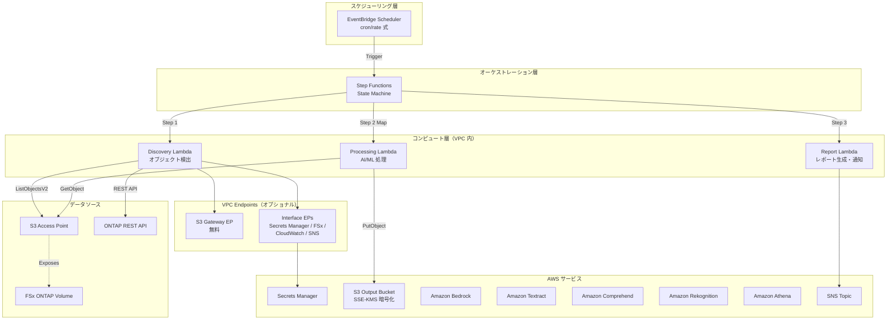

### ワークフロー概要

```
EventBridge Scheduler (定期実行)
  └─→ Step Functions State Machine
       ├─→ Discovery Lambda: S3 AP からオブジェクト一覧取得 → Manifest 生成
       ├─→ Map State (並列処理): 各オブジェクトを AI/ML サービスで処理
       └─→ Report/Notification: 結果レポート生成 → SNS 通知
```

## ユースケース一覧

| # | ディレクトリ | 業界 | パターン | 使用 AI/ML サービス | ap-northeast-1 検証 |
|---|-------------|------|---------|-------------------|-------------------|
| UC1 | `legal-compliance/` | 法務・コンプライアンス | ファイルサーバー監査・データガバナンス | Athena, Bedrock | ✅ E2E 成功 |
| UC2 | `financial-idp/` | 金融・保険 | 契約書・請求書の自動処理 (IDP) | Textract ⚠️, Comprehend, Bedrock | ⚠️ Textract 非対応 |
| UC3 | `manufacturing-analytics/` | 製造業 | IoT センサーログ・品質検査画像の分析 | Athena, Rekognition | ✅ E2E 成功 |
| UC4 | `media-vfx/` | メディア | VFX レンダリングパイプライン | Rekognition, Deadline Cloud | ⚠️ Deadline Cloud 要設定 |
| UC5 | `healthcare-dicom/` | 医療 | DICOM 画像の自動分類・匿名化 | Rekognition, Comprehend Medical ⚠️ | ⚠️ Comprehend Medical 非対応 |

> **リージョン制約**: Amazon Textract と Amazon Comprehend Medical は ap-northeast-1（東京）で利用できません。UC2 は us-east-1 等の対応リージョンでのデプロイを推奨します。UC5 の Comprehend Medical も同様です。Rekognition, Comprehend, Bedrock, Athena は ap-northeast-1 で利用可能です。
> 
> 参考: [Textract 対応リージョン](https://docs.aws.amazon.com/general/latest/gr/textract.html) | [Comprehend Medical 対応リージョン](https://docs.aws.amazon.com/general/latest/gr/comprehend-med.html)

### スクリーンショット

> 以下は検証環境での撮影例です。環境固有情報（アカウント ID 等）はマスク処理済みです。

#### 全 5 UC の Step Functions ワークフロー

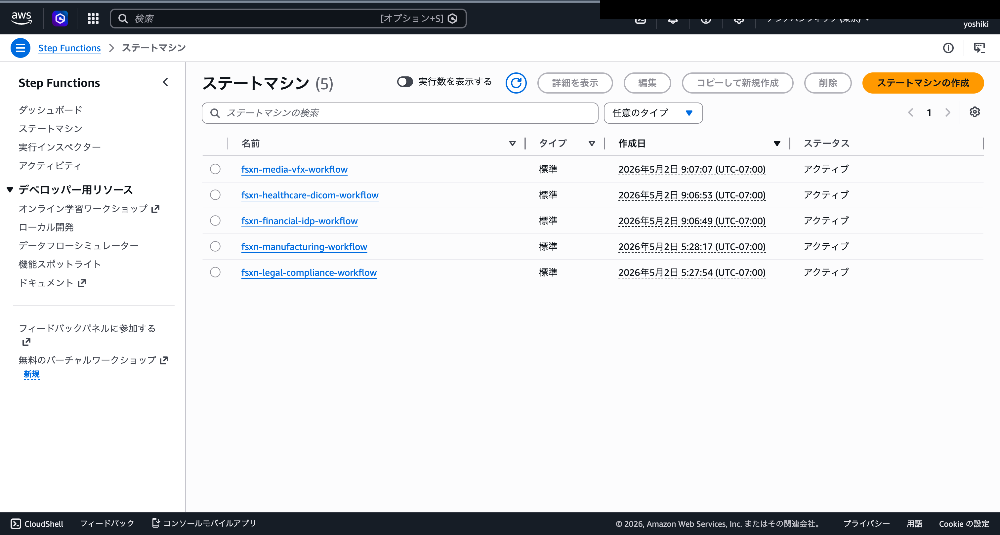

#### UC1 法務・コンプライアンス E2E 実行結果

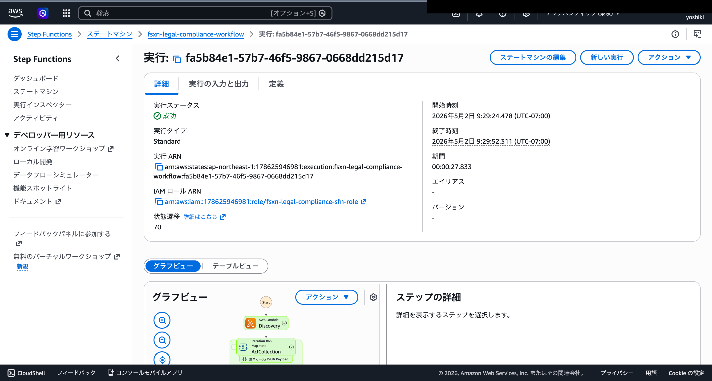

#### CloudFormation スタック一覧

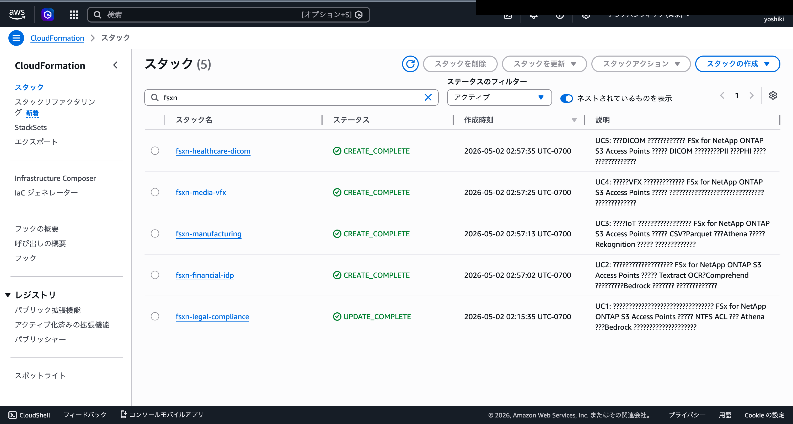

#### FSx ONTAP S3 Access Point

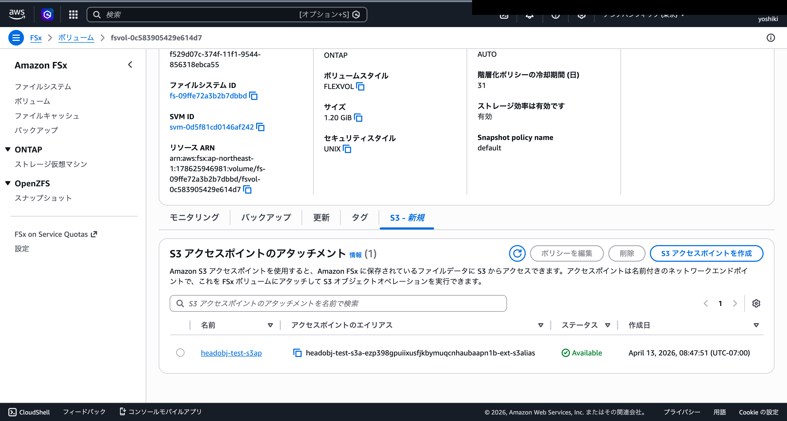

#### AI/ML サービス画面

##### Amazon Athena — クエリ実行履歴

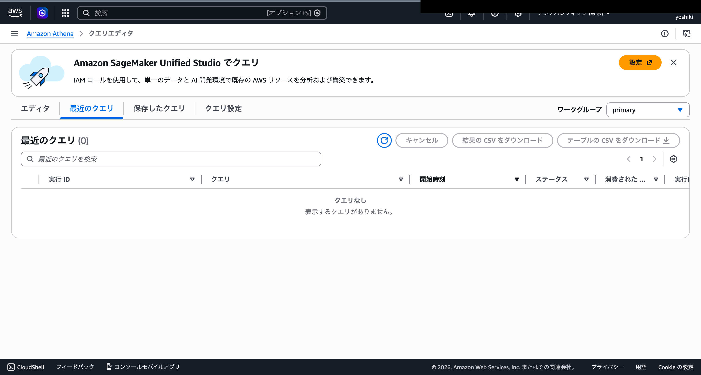

##### Amazon Bedrock — モデルカタログ

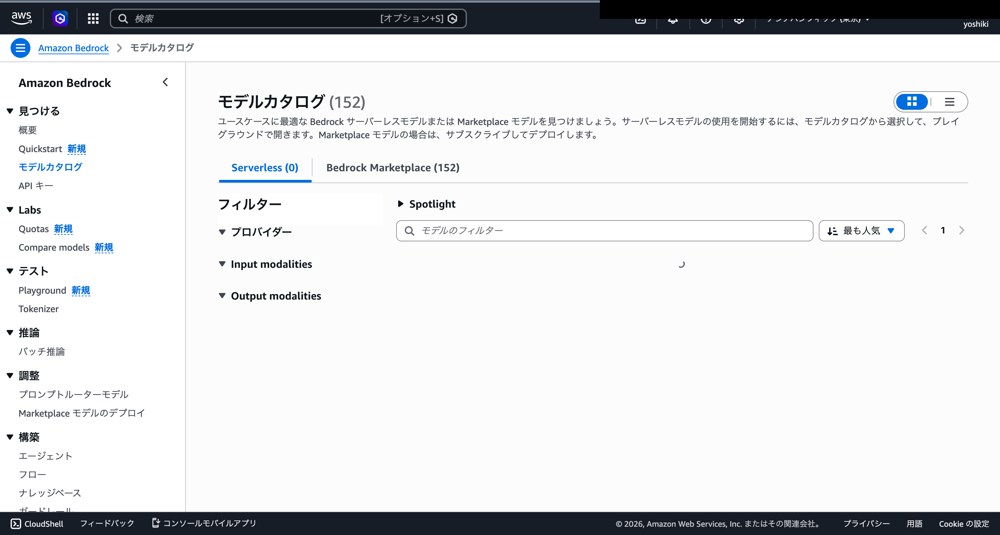

##### Amazon Rekognition — ラベル検出

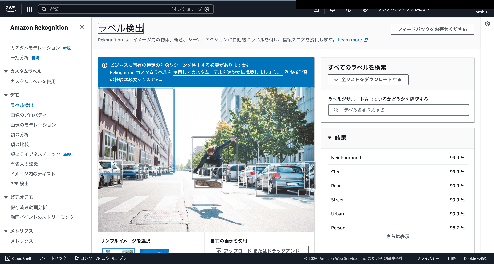

##### Amazon Comprehend — エンティティ検出

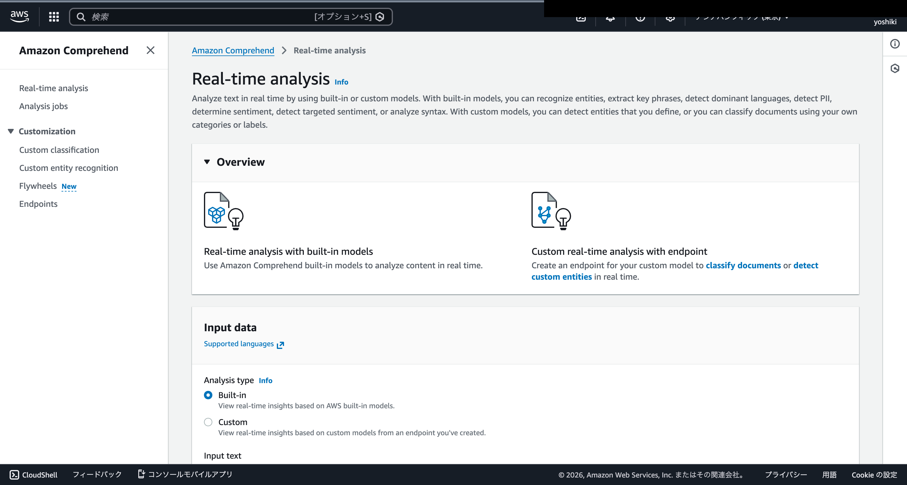

##### AWS Glue Data Catalog — テーブル一覧

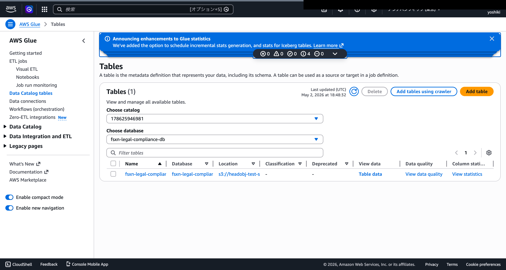

#### インフラストラクチャ画面

##### CloudWatch Logs — Lambda 実行ログ

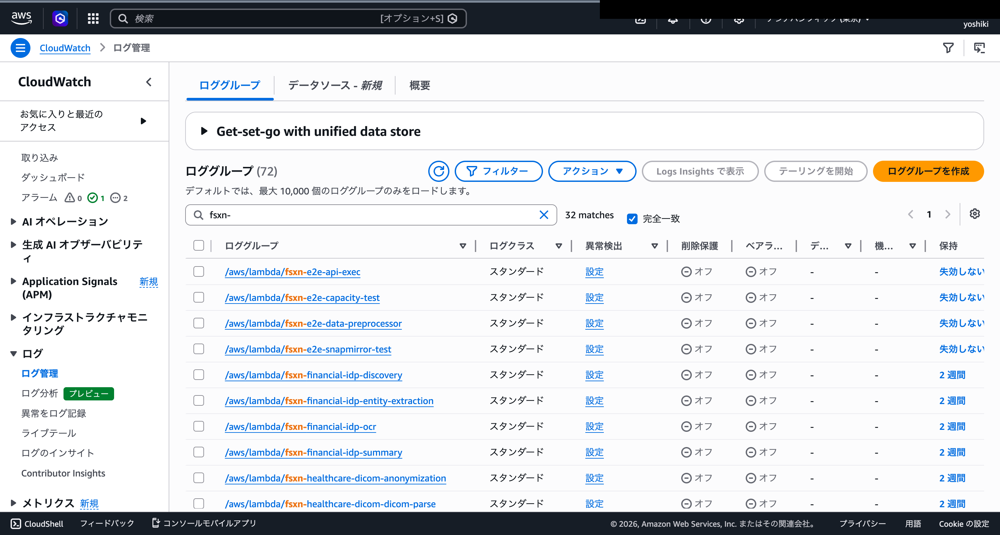

##### Amazon SNS — 通知トピック

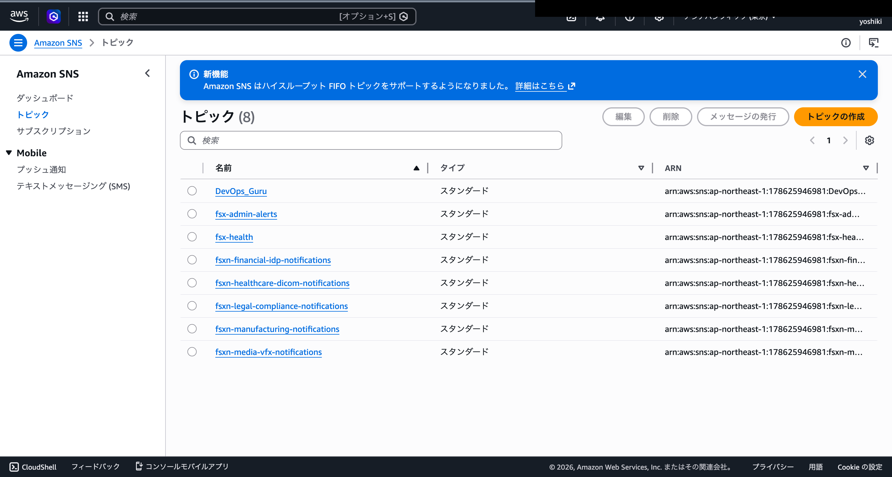

##### AWS Secrets Manager — ONTAP 認証情報

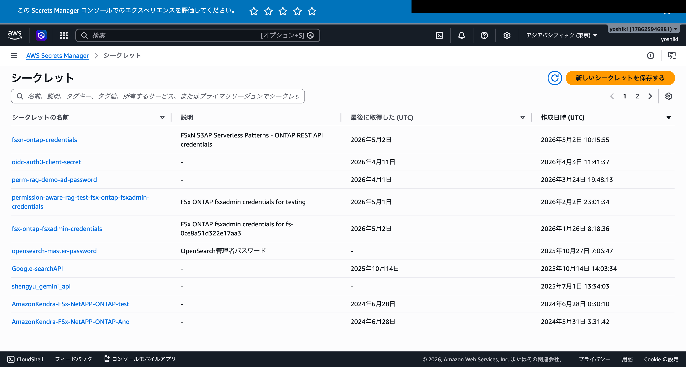

## 技術スタック

| レイヤー | 技術 |
|---------|------|
| 言語 | Python 3.12 |
| IaC | CloudFormation (YAML) |
| コンピュート | AWS Lambda (VPC 内) |
| オーケストレーション | AWS Step Functions |
| スケジューリング | Amazon EventBridge Scheduler |
| ストレージ | FSx for ONTAP (S3 AP) + S3 出力バケット (SSE-KMS) |
| 通知 | Amazon SNS |
| 分析 | Amazon Athena + AWS Glue Data Catalog |
| AI/ML | Amazon Bedrock, Textract, Comprehend, Rekognition |
| セキュリティ | Secrets Manager, KMS, IAM 最小権限 |
| テスト | pytest + Hypothesis (PBT), moto, cfn-lint, ruff |

## 前提条件

- **AWS アカウント**: 有効な AWS アカウントと適切な IAM 権限
- **FSx for NetApp ONTAP**: デプロイ済みのファイルシステム
  - ONTAP バージョン: 9.17.1P4D3 以上
  - S3 Access Point が有効化されたボリューム
- **ネットワーク**: VPC、プライベートサブネット、ルートテーブル
- **Python 3.12+**: ローカル開発・テスト用
- **AWS CLI v2**: デプロイ・管理用

### VPC 内 Lambda から S3 AP にアクセスする場合の注意事項

> **UC1 デプロイ検証（2026-05-03）で確認された重要事項**

- **S3 Gateway Endpoint のルートテーブル関連付けが必須**: `RouteTableIds` にプライベートサブネットのルートテーブル ID を指定しないと、VPC 内 Lambda から S3 / S3 AP へのアクセスがタイムアウトする
- **VPC DNS 解決の確認**: VPC の `enableDnsSupport` / `enableDnsHostnames` が有効であること
- **PoC / デモ環境では Lambda を VPC 外で実行することを推奨**: S3 AP の network origin が `internet` であれば VPC 外 Lambda から問題なくアクセス可能。VPC Endpoint 不要でコスト削減・設定簡素化が可能
- 詳細は [トラブルシューティングガイド](docs/guides/troubleshooting-guide.md#6-lambda-vpc-内実行時の-s3-ap-タイムアウト) を参照

### 必要な AWS サービスクォータ

| サービス | クォータ | 推奨値 |
|---------|---------|-------|
| Lambda 同時実行数 | ConcurrentExecutions | 100 以上 |
| Step Functions 実行数 | StartExecution/秒 | デフォルト (25) |
| S3 Access Point | アカウントあたりの AP 数 | デフォルト (10,000) |

## クイックスタート

### 1. リポジトリのクローン

```bash
git clone https://github.com/<your-org>/fsxn-s3ap-serverless-patterns.git
cd fsxn-s3ap-serverless-patterns
```

### 2. 依存関係のインストール

```bash
pip install -r requirements.txt
pip install -r requirements-dev.txt
```

### 3. テストの実行

```bash
# ユニットテスト（カバレッジ付き）
pytest shared/tests/ --cov=shared --cov-report=term-missing -v

# プロパティベーステスト
pytest shared/tests/test_properties.py -v

# リンター
ruff check .
ruff format --check .
```

### 4. ユースケースのデプロイ（例: UC1 法務・コンプライアンス）

```bash
aws cloudformation deploy \
  --template-file legal-compliance/template.yaml \
  --stack-name fsxn-legal-compliance \
  --parameter-overrides \
    S3AccessPointAlias=<your-volume-ext-s3alias> \
    S3AccessPointOutputAlias=<your-output-volume-ext-s3alias> \
    OntapSecretName=<your-ontap-secret-name> \
    OntapManagementIp=<your-ontap-management-ip> \
    SvmUuid=<your-svm-uuid> \
    VolumeUuid=<your-volume-uuid> \
    VpcId=<your-vpc-id> \
    PrivateSubnetIds=<subnet-1>,<subnet-2> \
    PrivateRouteTableId=<your-private-route-table-id> \
    NotificationEmail=<your-email@example.com> \
  --capabilities CAPABILITY_IAM CAPABILITY_AUTO_EXPAND \
  --region ap-northeast-1
```

> **注意**: `<...>` のプレースホルダーを実際の環境値に置き換えてください。

### 検証済み環境

| 項目 | 値 |
|------|-----|
| AWS リージョン | ap-northeast-1 (東京) |
| FSx ONTAP バージョン | ONTAP 9.17.1P4D3 |
| FSx 構成 | SINGLE_AZ_1 |
| Python | 3.12 |
| デプロイ方式 | CloudFormation (標準) |

全 5 ユースケースの CloudFormation スタックデプロイと Discovery Lambda の動作確認を実施済みです。
詳細は [検証結果記録](docs/verification-results.md) を参照してください。

## コスト構造サマリー

### 環境別コスト概算

| 環境 | 固定費/月 | 変動費/月 | 合計/月 |
|------|----------|----------|--------|
| デモ/PoC | ~$0 | ~$1〜$3 | **~$1〜$3** |
| 本番（1 UC） | ~$29 | ~$1〜$3 | **~$30〜$32** |
| 本番（全 5 UC） | ~$29 | ~$5〜$15 | **~$34〜$44** |

### コスト分類

- **リクエストベース（従量課金）**: Lambda, Step Functions, S3 API, Textract, Comprehend, Rekognition, Bedrock, Athena — 使わなければ $0
- **常時稼働（固定費）**: Interface VPC Endpoints (~$28.80/月) — **オプショナル（opt-in）**

> 詳細なコスト分析は [docs/cost-analysis.md](docs/cost-analysis.md) を参照してください。

### オプショナルリソース

高コストの常時稼働リソースは CloudFormation パラメータでオプショナル化しています。

| リソース | パラメータ | デフォルト | 月額固定費 | 説明 |
|---------|-----------|----------|-----------|------|
| Interface VPC Endpoints | `EnableVpcEndpoints` | `false` | ~$28.80 | Secrets Manager, FSx, CloudWatch, SNS 用。本番環境では `true` 推奨 |
| CloudWatch Alarms | `EnableCloudWatchAlarms` | `false` | ~$0.10/アラーム | Step Functions 失敗率、Lambda エラー率の監視 |

> **S3 Gateway VPC Endpoint** は無料のため、常にデフォルト有効です。

## 互換性マトリックス

| 項目 | サポート値 |
|------|----------|
| ONTAP バージョン | 9.17.1P4D3 以上 |
| AWS リージョン | ap-northeast-1（東京） |
| Python バージョン | 3.12+ |
| CloudFormation Transform | AWS::Serverless-2016-10-31 |
| S3 AP セキュリティスタイル | UNIX (root), NTFS |

### FSx ONTAP S3 Access Points 対応 API

S3 AP 経由で利用可能な API サブセット:

| API | サポート |
|-----|---------|
| ListObjectsV2 | ✅ |
| GetObject | ✅ |
| PutObject | ✅ (最大 5 GB) |
| HeadObject | ✅ |
| DeleteObject | ✅ |
| DeleteObjects | ✅ |
| CopyObject | ✅ (同一 AP 内、同一リージョン) |
| GetObjectAttributes | ✅ |
| GetObjectTagging / PutObjectTagging | ✅ |
| CreateMultipartUpload | ✅ |
| UploadPart / UploadPartCopy | ✅ |
| CompleteMultipartUpload | ✅ |
| AbortMultipartUpload | ✅ |
| ListParts / ListMultipartUploads | ✅ |
| HeadBucket / GetBucketLocation | ✅ |
| GetBucketNotificationConfiguration | ❌（非対応 → ポーリング設計の理由） |
| Presign | ❌ |

### S3 Access Point ネットワークオリジンの制約

| ネットワークオリジン | Lambda (VPC 外) | Lambda (VPC 内) | Athena / Glue | 推奨 UC |
|-------------------|----------------|----------------|--------------|---------|
| **internet** | ✅ | ✅ (S3 Gateway EP 経由) | ✅ | UC1, UC3 (Athena 使用) |
| **VPC** | ❌ | ✅ (S3 Gateway EP 必須) | ❌ | UC2, UC4, UC5 (Athena 不使用) |

> **重要**: Athena / Glue は AWS マネージドインフラからアクセスするため、VPC origin の S3 AP にはアクセスできません。UC1（法務）と UC3（製造業）は Athena を使用するため、S3 AP は **internet** network origin で作成する必要があります。

### S3 AP の制約事項

- **PutObject 最大サイズ**: 5 GB（5 GB 超はマルチパートアップロードを使用）
- **暗号化**: SSE-FSX のみ（FSx が透過的に処理、ServerSideEncryption パラメータ指定不要）
- **ACL**: `bucket-owner-full-control` のみサポート
- **非対応機能**: Object Versioning, Object Lock, Object Lifecycle, Static Website Hosting, Requester Pays, Presigned URL

## ドキュメント

詳細なガイドとスクリーンショットは `docs/` ディレクトリに格納されています。

| ドキュメント | 説明 |
|------------|------|
| [docs/guides/deployment-guide.md](docs/guides/deployment-guide.md) | デプロイ手順書（前提条件確認 → パラメータ準備 → デプロイ → 動作確認） |
| [docs/guides/operations-guide.md](docs/guides/operations-guide.md) | 運用手順書（スケジュール変更、手動実行、ログ確認、アラーム対応） |
| [docs/guides/troubleshooting-guide.md](docs/guides/troubleshooting-guide.md) | トラブルシューティング（AccessDenied, VPC Endpoint, ONTAP タイムアウト, Athena） |
| [docs/cost-analysis.md](docs/cost-analysis.md) | コスト構造分析 |
| [docs/references.md](docs/references.md) | 参考リンク集 |
| [docs/extension-patterns.md](docs/extension-patterns.md) | 拡張パターンガイド |
| [docs/article-draft.md](docs/article-draft.md) | dev.to 記事ドラフト |
| [docs/verification-results.md](docs/verification-results.md) | AWS 環境検証結果記録 |
| [docs/screenshots/](docs/screenshots/README.md) | AWS コンソールスクリーンショット（検証後に追加） |

## ディレクトリ構造

```
fsxn-s3ap-serverless-patterns/
├── README.md                          # 本ファイル
├── LICENSE                            # MIT License
├── requirements.txt                   # 本番依存関係
├── requirements-dev.txt               # 開発依存関係
├── shared/                            # 共通モジュール
│   ├── __init__.py
│   ├── ontap_client.py               # ONTAP REST API クライアント
│   ├── fsx_helper.py                 # AWS FSx API ヘルパー
│   ├── s3ap_helper.py                # S3 Access Point ヘルパー
│   ├── exceptions.py                 # 共通例外・エラーハンドラ
│   ├── discovery_handler.py          # 共通 Discovery Lambda テンプレート
│   ├── cfn/                          # CloudFormation スニペット
│   └── tests/                        # ユニットテスト・プロパティテスト
├── legal-compliance/                  # UC1: 法務・コンプライアンス
├── financial-idp/                     # UC2: 金融・保険
├── manufacturing-analytics/           # UC3: 製造業
├── media-vfx/                         # UC4: メディア
├── healthcare-dicom/                  # UC5: 医療
├── scripts/                           # 検証・デプロイスクリプト
│   ├── verify_shared_modules.py      # 共通モジュール AWS 環境検証
│   ├── verify_cfn_templates.sh       # CloudFormation テンプレート検証
│   └── deploy_uc1.sh                 # UC1 デプロイスクリプト
├── .github/workflows/                 # CI/CD (lint, test)
└── docs/                              # ドキュメント
    ├── guides/                        # 操作手順書
    │   ├── deployment-guide.md       # デプロイ手順
    │   ├── operations-guide.md       # 運用手順
    │   └── troubleshooting-guide.md  # トラブルシューティング
    ├── screenshots/                   # AWS コンソールスクリーンショット
    ├── cost-analysis.md               # コスト構造分析
    ├── references.md                  # 参考リンク集
    ├── extension-patterns.md          # 拡張パターンガイド
    ├── verification-results.md        # 検証結果記録
    └── article-draft.md               # dev.to 記事ドラフト
```

## 共通モジュール (shared/)

| モジュール | 説明 |
|-----------|------|
| `ontap_client.py` | ONTAP REST API クライアント（Secrets Manager 認証、urllib3、TLS、リトライ） |
| `fsx_helper.py` | AWS FSx API + CloudWatch メトリクス取得 |
| `s3ap_helper.py` | S3 Access Point ヘルパー（ページネーション、サフィックスフィルタ） |
| `exceptions.py` | 共通例外クラス、`lambda_error_handler` デコレータ |
| `discovery_handler.py` | 共通 Discovery Lambda テンプレート（Manifest 生成） |

## 開発

### テスト実行

```bash
# 全テスト
pytest shared/tests/ -v

# カバレッジ付き
pytest shared/tests/ --cov=shared --cov-report=term-missing --cov-fail-under=80 -v

# プロパティベーステストのみ
pytest shared/tests/test_properties.py -v
```

### リンター

```bash
# Python リンター
ruff check .
ruff format --check .

# CloudFormation テンプレート検証
cfn-lint */template.yaml
```

## ライセンス

MIT License — 詳細は [LICENSE](LICENSE) を参照してください。
