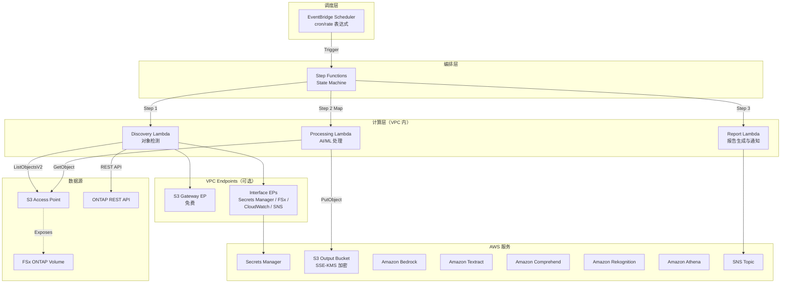

# FSx for ONTAP S3 Access Points Serverless Patterns

🌐 **Language / 言語**: [日本語](README.md) | [English](README.en.md) | [한국어](README.ko.md) | [简体中文](README.zh-CN.md) | [繁體中文](README.zh-TW.md) | [Français](README.fr.md) | [Deutsch](README.de.md) | [Español](README.es.md)

基于 Amazon FSx for NetApp ONTAP S3 Access Points 的行业专属无服务器自动化模式集合。

> **本仓库的定位**: 这是一个「用于学习设计决策的参考实现」。部分用例已在 AWS 环境中完成 E2E 验证，其他用例也已完成 CloudFormation 部署、共享 Discovery Lambda 及关键组件的功能验证。本仓库以从 PoC 到生产环境的渐进式应用为目标，通过具体代码展示成本优化、安全性和错误处理的设计决策。

## 相关文章

本仓库是以下文章的实践配套：

- **FSx for ONTAP S3 Access Points as a Serverless Automation Boundary — AI Data Pipelines, Volume-Level SnapMirror DR, and Capacity Guardrails**
  https://dev.to/yoshikifujiwara/fsx-for-ontap-s3-access-points-as-a-serverless-automation-boundary-ai-data-pipelines-ili

文章解释架构设计思想和权衡取舍，本仓库提供具体的、可复用的实现模式。

## 概述

本仓库提供 **5 种行业专属模式**，通过 **S3 Access Points** 对存储在 FSx for NetApp ONTAP 上的企业数据进行无服务器处理。

> 以下将 FSx for ONTAP S3 Access Points 简称为 **S3 AP**。

每个用例都是独立的 CloudFormation 模板，共享模块（ONTAP REST API 客户端、FSx 辅助工具、S3 AP 辅助工具）位于 `shared/` 目录中供复用。

### 主要特性

- **轮询架构**: 由于 S3 AP 不支持 `GetBucketNotificationConfiguration`，采用 EventBridge Scheduler + Step Functions 定期执行
- **共享模块分离**: OntapClient / FsxHelper / S3ApHelper 在所有用例中复用
- **CloudFormation / SAM Transform 架构**: 每个用例都是独立的 CloudFormation 模板（使用 SAM Transform）
- **安全优先**: 默认启用 TLS 验证、最小权限 IAM、KMS 加密
- **成本优化**: 高成本常驻资源（Interface VPC Endpoints 等）为可选项

## 架构



> 图示为面向生产环境的 VPC 内 Lambda 配置。对于 PoC / 演示用途，如果 S3 AP 的 network origin 为 `internet`，也可以选择 VPC 外 Lambda 配置。详情请参阅下方「Lambda 部署选择指南」。

### 工作流概述

```
EventBridge Scheduler (定期执行)
  └─→ Step Functions State Machine
       ├─→ Discovery Lambda: 从 S3 AP 获取对象列表 → 生成 Manifest
       ├─→ Map State (并行处理): 使用 AI/ML 服务处理各对象
       └─→ Report/Notification: 生成结果报告 → SNS 通知
```

## 用例列表

| # | 目录 | 行业 | 模式 | 使用的 AI/ML 服务 | ap-northeast-1 验证状态 |
|---|------|------|------|-----------------|----------------------|
| UC1 | `legal-compliance/` | 法务合规 | 文件服务器审计与数据治理 | Athena, Bedrock | ✅ E2E 成功 |
| UC2 | `financial-idp/` | 金融保险 | 合同/发票自动处理 (IDP) | Textract ⚠️, Comprehend, Bedrock | ⚠️ 东京不支持（使用对应区域） |
| UC3 | `manufacturing-analytics/` | 制造业 | IoT 传感器日志与质量检测图像分析 | Athena, Rekognition | ✅ E2E 成功 |
| UC4 | `media-vfx/` | 媒体 | VFX 渲染管线 | Rekognition, Deadline Cloud | ⚠️ Deadline Cloud 需配置 |
| UC5 | `healthcare-dicom/` | 医疗 | DICOM 图像自动分类与脱敏 | Rekognition, Comprehend Medical ⚠️ | ⚠️ 东京不支持（使用对应区域） |

> **区域限制**: Amazon Textract 和 Amazon Comprehend Medical 在 ap-northeast-1（东京）不可用。建议在 us-east-1 等支持区域部署 UC2。UC5 的 Comprehend Medical 同理。Rekognition、Comprehend、Bedrock、Athena 在 ap-northeast-1 可用。
> 
> 参考: [Textract 支持区域](https://docs.aws.amazon.com/general/latest/gr/textract.html) | [Comprehend Medical 支持区域](https://docs.aws.amazon.com/general/latest/gr/comprehend-med.html)

### 截图

> 以下为验证环境中的截图示例。环境特定信息（账户 ID 等）已进行脱敏处理。

#### 全部 5 个 UC 的 Step Functions 部署与执行确认


> UC1 和 UC3 已完成完整的 E2E 验证，UC2、UC4 和 UC5 已完成 CloudFormation 部署和主要组件的功能验证。使用有区域限制的 AI/ML 服务（Textract、Comprehend Medical）时，需要跨区域调用至支持区域，请确认数据驻留和合规要求。

#### AI/ML 服务界面

##### Amazon Bedrock — 模型目录


##### Amazon Rekognition — 标签检测


##### Amazon Comprehend — 实体检测


## 技术栈

| 层级 | 技术 |
|------|------|
| 语言 | Python 3.12 |
| IaC | CloudFormation (YAML) + SAM Transform |
| 计算 | AWS Lambda（生产: VPC 内 / PoC: VPC 外也可选择） |
| 编排 | AWS Step Functions |
| 调度 | Amazon EventBridge Scheduler |
| 存储 | FSx for ONTAP (S3 AP) + S3 输出桶 (SSE-KMS) |
| 通知 | Amazon SNS |
| 分析 | Amazon Athena + AWS Glue Data Catalog |
| AI/ML | Amazon Bedrock, Textract, Comprehend, Rekognition |
| 安全 | Secrets Manager, KMS, IAM 最小权限 |
| 测试 | pytest + Hypothesis (PBT), moto, cfn-lint, ruff |

## 前提条件

- **AWS 账户**: 有效的 AWS 账户和适当的 IAM 权限
- **FSx for NetApp ONTAP**: 已部署的文件系统
  - ONTAP 版本: 支持 S3 Access Points 的版本（已在 9.17.1P4D3 上验证）
  - 已关联 S3 Access Point 的 FSx for ONTAP 卷（network origin 根据用例选择。使用 Athena / Glue 时推荐 `internet`）
- **网络**: VPC、私有子网、路由表
- **Secrets Manager**: 预先注册 ONTAP REST API 凭证（格式: `{"username":"fsxadmin","password":"..."}`）
- **S3 存储桶**: 预先创建用于 Lambda 部署包的存储桶（例: `fsxn-s3ap-deploy-<account-id>`）
- **Python 3.12+**: 本地开发和测试用
- **AWS CLI v2**: 部署和管理用

### 准备命令

```bash
# 1. 创建部署用 S3 存储桶
ACCOUNT_ID=$(aws sts get-caller-identity --query Account --output text)
aws s3 mb "s3://fsxn-s3ap-deploy-${ACCOUNT_ID}" --region $AWS_DEFAULT_REGION

# 2. 将 ONTAP 凭证注册到 Secrets Manager
aws secretsmanager create-secret \
  --name fsxn-ontap-credentials \
  --secret-string '{"username":"fsxadmin","password":"<your-ontap-password>"}' \
  --region $AWS_DEFAULT_REGION

# 3. 检查现有 S3 Gateway Endpoint（防止重复创建）
aws ec2 describe-vpc-endpoints \
  --filters "Name=vpc-id,Values=<your-vpc-id>" "Name=service-name,Values=com.amazonaws.${AWS_DEFAULT_REGION}.s3" \
  --query 'VpcEndpoints[*].{Id:VpcEndpointId,State:State}' \
  --output table
# → 如果有结果，使用 EnableS3GatewayEndpoint=false 部署
```

### Lambda 部署选择指南

| 用途 | 推荐部署 | 原因 |
|------|---------|------|
| 演示 / PoC | VPC 外 Lambda | 无需 VPC Endpoint，低成本、配置简单 |
| 生产 / 封闭网络要求 | VPC 内 Lambda | 可通过 PrivateLink 使用 Secrets Manager / FSx / SNS 等 |
| 使用 Athena / Glue 的 UC | S3 AP network origin: `internet` | 需要 AWS 托管服务的访问 |

### 从 VPC 内 Lambda 访问 S3 AP 的注意事项

> **UC1 部署验证（2026-05-03）中确认的重要事项**

- **S3 Gateway Endpoint 的路由表关联是必须的**: 如果未在 `RouteTableIds` 中指定私有子网的路由表 ID，VPC 内 Lambda 对 S3 / S3 AP 的访问将超时
- **确认 VPC DNS 解析**: 确保 VPC 的 `enableDnsSupport` / `enableDnsHostnames` 已启用
- **PoC / 演示环境建议在 VPC 外运行 Lambda**: 如果 S3 AP 的 network origin 为 `internet`，VPC 外 Lambda 可以正常访问。无需 VPC Endpoint，可降低成本并简化配置
- 详情请参阅[故障排除指南](docs/guides/troubleshooting-guide.md#6-lambda-vpc-内実行時の-s3-ap-タイムアウト)

### 所需 AWS 服务配额

| 服务 | 配额 | 推荐值 |
|------|------|--------|
| Lambda 并发执行数 | ConcurrentExecutions | 100 以上 |
| Step Functions 执行数 | StartExecution/秒 | 默认值 (25) |
| S3 Access Point | 每账户 AP 数 | 默认值 (10,000) |

## 快速开始

### 1. 克隆仓库

```bash
git clone https://github.com/Yoshiki0705/FSx-for-ONTAP-S3AccessPoints-Serverless-Patterns.git
cd FSx-for-ONTAP-S3AccessPoints-Serverless-Patterns
```

### 2. 安装依赖

```bash
pip install -r requirements.txt
pip install -r requirements-dev.txt
```

### 3. 运行测试

```bash
# 单元测试（含覆盖率）
pytest shared/tests/ --cov=shared --cov-report=term-missing -v

# 属性基测试
pytest shared/tests/test_properties.py -v

# 代码检查
ruff check .
ruff format --check .
```

### 4. 部署用例（示例: UC1 法务合规）

> ⚠️ **关于对现有环境影响的重要事项**
>
> 部署前请确认以下内容:
>
> | 参数 | 对现有环境的影响 | 确认方法 |
> |------|----------------|---------|
> | `VpcId` / `PrivateSubnetIds` | 将在指定的 VPC/子网中创建 Lambda ENI | `aws ec2 describe-network-interfaces --filters Name=group-id,Values=<sg-id>` |
> | `EnableS3GatewayEndpoint=true` | 将向 VPC 添加 S3 Gateway Endpoint。**如果同一 VPC 中已存在 S3 Gateway Endpoint，请设置为 `false`** | `aws ec2 describe-vpc-endpoints --filters Name=vpc-id,Values=<vpc-id>` |
> | `PrivateRouteTableIds` | S3 Gateway Endpoint 将关联到路由表。不影响现有路由 | `aws ec2 describe-route-tables --route-table-ids <rtb-id>` |
> | `ScheduleExpression` | EventBridge Scheduler 将定期执行 Step Functions。**可在部署后禁用调度以避免不必要的执行** | AWS 控制台 → EventBridge → Schedules |
> | `NotificationEmail` | 将发送 SNS 订阅确认邮件 | 检查邮件收件箱 |
>
> **堆栈删除注意事项**:
> - 如果 S3 存储桶（Athena Results）中仍有对象，删除将失败。请先使用 `aws s3 rm s3://<bucket> --recursive` 清空
> - 启用版本控制的存储桶需要使用 `aws s3api delete-objects` 删除所有版本
> - VPC Endpoints 删除可能需要 5-15 分钟
> - Lambda ENI 释放可能需要时间，导致 Security Group 删除失败。请等待几分钟后重试

```bash
# 设置区域（通过环境变量管理）
export AWS_DEFAULT_REGION=us-east-1  # 推荐支持所有服务的区域

# Lambda 打包
./scripts/deploy_uc.sh legal-compliance package

# CloudFormation 部署
aws cloudformation create-stack \
  --stack-name fsxn-legal-compliance \
  --template-body file://legal-compliance/template-deploy.yaml \
  --capabilities CAPABILITY_NAMED_IAM \
  --parameters \
    ParameterKey=DeployBucket,ParameterValue=<your-deploy-bucket> \
    ParameterKey=S3AccessPointAlias,ParameterValue=<your-volume-ext-s3alias> \
    ParameterKey=S3AccessPointOutputAlias,ParameterValue=<your-output-volume-ext-s3alias> \
    ParameterKey=OntapSecretName,ParameterValue=<your-ontap-secret-name> \
    ParameterKey=OntapManagementIp,ParameterValue=<your-ontap-management-ip> \
    ParameterKey=SvmUuid,ParameterValue=<your-svm-uuid> \
    ParameterKey=VolumeUuid,ParameterValue=<your-volume-uuid> \
    ParameterKey=VpcId,ParameterValue=<your-vpc-id> \
    'ParameterKey=PrivateSubnetIds,ParameterValue=<subnet-1>,<subnet-2>' \
    'ParameterKey=PrivateRouteTableIds,ParameterValue=<rtb-1>,<rtb-2>' \
    ParameterKey=NotificationEmail,ParameterValue=<your-email@example.com> \
    ParameterKey=EnableVpcEndpoints,ParameterValue=true \
    ParameterKey=EnableS3GatewayEndpoint,ParameterValue=true
```

> **注意**: 请将 `<...>` 占位符替换为实际环境值。
>
> **关于 `EnableVpcEndpoints`**: Quick Start 中指定 `true` 以确保 VPC 内 Lambda 到 Secrets Manager / CloudWatch / SNS 的连通性。如果已有 Interface VPC Endpoints 或 NAT Gateway，可以指定 `false` 以降低成本。
> 
> **区域选择**: 推荐使用所有 AI/ML 服务均可用的 `us-east-1` 或 `us-west-2`。`ap-northeast-1` 不支持 Textract 和 Comprehend Medical（可通过跨区域调用解决）。详情请参阅[区域兼容性矩阵](docs/region-compatibility.md)。

### 已验证环境

| 项目 | 值 |
|------|-----|
| AWS 区域 | ap-northeast-1 (东京) |
| FSx ONTAP 版本 | ONTAP 9.17.1P4D3 |
| FSx 配置 | SINGLE_AZ_1 |
| Python | 3.12 |
| 部署方式 | CloudFormation（使用 SAM Transform） |

已完成全部 5 个用例的 CloudFormation 堆栈部署和 Discovery Lambda 的功能验证。
详情请参阅[验证结果记录](docs/verification-results.md)。

## 成本结构摘要

### 各环境成本估算

| 环境 | 固定费/月 | 变动费/月 | 合计/月 |
|------|----------|----------|--------|
| 演示/PoC | ~$0 | ~$1〜$3 | **~$1〜$3** |
| 生产（1 UC） | ~$29 | ~$1〜$3 | **~$30〜$32** |
| 生产（全部 5 UC） | ~$29 | ~$5〜$15 | **~$34〜$44** |

### 成本分类

- **按请求计费（按量付费）**: Lambda, Step Functions, S3 API, Textract, Comprehend, Rekognition, Bedrock, Athena — 不使用则为 $0
- **常驻运行（固定费）**: Interface VPC Endpoints (~$28.80/月) — **可选（opt-in）**

> Quick Start 为优先确保 VPC 内 Lambda 的连通性而指定 `EnableVpcEndpoints=true`。如果优先考虑低成本 PoC，请考虑使用 VPC 外 Lambda 配置或利用现有的 NAT / Interface VPC Endpoints。

> 详细成本分析请参阅 [docs/cost-analysis.md](docs/cost-analysis.md)。

### 可选资源

高成本常驻资源通过 CloudFormation 参数设为可选。

| 资源 | 参数 | 默认值 | 月固定费 | 说明 |
|------|------|--------|---------|------|
| Interface VPC Endpoints | `EnableVpcEndpoints` | `false` | ~$28.80 | 用于 Secrets Manager、FSx、CloudWatch、SNS。生产环境推荐 `true`。Quick Start 中为确保连通性指定 `true` |
| CloudWatch Alarms | `EnableCloudWatchAlarms` | `false` | ~$0.10/告警 | 监控 Step Functions 失败率、Lambda 错误率 |

> **S3 Gateway VPC Endpoint** 无额外按时计费，因此在 VPC 内 Lambda 访问 S3 AP 的配置中推荐启用。但如果已存在 S3 Gateway Endpoint 或 PoC / 演示用途中 Lambda 部署在 VPC 外，请指定 `EnableS3GatewayEndpoint=false`。S3 API 请求、数据传输及各 AWS 服务使用费照常产生。

## 安全与授权模型

本方案组合了**多个授权层**，各层承担不同角色:

| 层级 | 角色 | 控制范围 |
|------|------|---------|
| **IAM** | AWS 服务和 S3 Access Points 的访问控制 | Lambda 执行角色、S3 AP 策略 |
| **S3 Access Point** | 通过与 S3 AP 关联的文件系统用户定义访问边界 | S3 AP 策略、network origin、关联用户 |
| **ONTAP 文件系统** | 强制执行文件级权限 | UNIX 权限 / NTFS ACL |
| **ONTAP REST API** | 仅公开元数据和控制平面操作 | Secrets Manager 认证 + TLS |

**重要设计注意事项**:

- S3 API 不公开文件级 ACL。文件权限信息**只能通过 ONTAP REST API** 获取（UC1 的 ACL Collection 使用此模式）
- 通过 S3 AP 的访问在 IAM / S3 AP 策略许可后，以与 S3 AP 关联的 UNIX / Windows 文件系统用户身份在 ONTAP 侧进行授权
- ONTAP REST API 凭证在 Secrets Manager 中管理，不存储在 Lambda 环境变量中

## 兼容性矩阵

| 项目 | 值 / 验证内容 |
|------|-------------|
| ONTAP 版本 | 已在 9.17.1P4D3 上验证（需要支持 S3 Access Points 的版本） |
| 已验证区域 | ap-northeast-1（东京） |
| 推荐区域 | us-east-1 / us-west-2（使用全部 AI/ML 服务时） |
| Python 版本 | 3.12+ |
| CloudFormation Transform | AWS::Serverless-2016-10-31 |
| 已验证卷 security style | UNIX, NTFS |

### FSx ONTAP S3 Access Points 支持的 API

通过 S3 AP 可用的 API 子集:

| API | 支持 |
|-----|------|
| ListObjectsV2 | ✅ |
| GetObject | ✅ |
| PutObject | ✅ (最大 5 GB) |
| HeadObject | ✅ |
| DeleteObject | ✅ |
| DeleteObjects | ✅ |
| CopyObject | ✅ (同一 AP 内、同一区域) |
| GetObjectAttributes | ✅ |
| GetObjectTagging / PutObjectTagging | ✅ |
| CreateMultipartUpload | ✅ |
| UploadPart / UploadPartCopy | ✅ |
| CompleteMultipartUpload | ✅ |
| AbortMultipartUpload | ✅ |
| ListParts / ListMultipartUploads | ✅ |
| HeadBucket / GetBucketLocation | ✅ |
| GetBucketNotificationConfiguration | ❌（不支持 → 轮询设计的原因） |
| Presign | ❌ |

### S3 Access Point 网络来源约束

| 网络来源 | Lambda (VPC 外) | Lambda (VPC 内) | Athena / Glue | 推荐 UC |
|---------|----------------|----------------|--------------|---------|
| **internet** | ✅ | ✅ (通过 S3 Gateway EP) | ✅ | UC1, UC3 (使用 Athena) |
| **VPC** | ❌ | ✅ (S3 Gateway EP 必须) | ❌ | UC2, UC4, UC5 (不使用 Athena) |

> **重要**: Athena / Glue 从 AWS 托管基础设施访问，因此无法访问 VPC origin 的 S3 AP。UC1（法务）和 UC3（制造业）使用 Athena，因此 S3 AP 必须以 **internet** network origin 创建。

### S3 AP 限制事项

- **PutObject 最大大小**: 5 GB。multipart upload API 受支持，但 5 GB 以上的上传可行性请按用例逐一验证。
- **加密**: 仅支持 SSE-FSX（FSx 透明处理，无需指定 ServerSideEncryption 参数）
- **ACL**: 仅支持 `bucket-owner-full-control`
- **不支持的功能**: Object Versioning, Object Lock, Object Lifecycle, Static Website Hosting, Requester Pays, Presigned URL

## 文档

详细指南和截图存储在 `docs/` 目录中。

| 文档 | 说明 |
|------|------|
| [docs/guides/deployment-guide.md](docs/guides/deployment-guide.md) | 部署指南（前提条件确认 → 参数准备 → 部署 → 功能验证） |
| [docs/guides/operations-guide.md](docs/guides/operations-guide.md) | 运维指南（调度变更、手动执行、日志确认、告警响应） |
| [docs/guides/troubleshooting-guide.md](docs/guides/troubleshooting-guide.md) | 故障排除（AccessDenied、VPC Endpoint、ONTAP 超时、Athena） |
| [docs/cost-analysis.md](docs/cost-analysis.md) | 成本结构分析 |
| [docs/references.md](docs/references.md) | 参考链接集 |
| [docs/extension-patterns.md](docs/extension-patterns.md) | 扩展模式指南 |
| [docs/region-compatibility.md](docs/region-compatibility.md) | AWS 区域 AI/ML 服务支持情况 |
| [docs/article-draft.md](docs/article-draft.md) | dev.to 文章原始草稿（已发布版本请参阅 README 顶部的相关文章） |
| [docs/verification-results.md](docs/verification-results.md) | AWS 环境验证结果记录 |
| [docs/screenshots/](docs/screenshots/README.md) | AWS 控制台截图（已脱敏） |

## 目录结构

```
fsxn-s3ap-serverless-patterns/
├── README.md                          # 本文件
├── LICENSE                            # MIT License
├── requirements.txt                   # 生产依赖
├── requirements-dev.txt               # 开发依赖
├── shared/                            # 共享模块
│   ├── __init__.py
│   ├── ontap_client.py               # ONTAP REST API 客户端
│   ├── fsx_helper.py                 # AWS FSx API 辅助工具
│   ├── s3ap_helper.py                # S3 Access Point 辅助工具
│   ├── exceptions.py                 # 共享异常与错误处理器
│   ├── discovery_handler.py          # 共享 Discovery Lambda 模板
│   ├── cfn/                          # CloudFormation 代码片段
│   └── tests/                        # 单元测试与属性测试
├── legal-compliance/                  # UC1: 法务合规
├── financial-idp/                     # UC2: 金融保险
├── manufacturing-analytics/           # UC3: 制造业
├── media-vfx/                         # UC4: 媒体
├── healthcare-dicom/                  # UC5: 医疗
├── scripts/                           # 验证与部署脚本
│   ├── deploy_uc.sh                  # UC 部署脚本（通用）
│   ├── verify_shared_modules.py      # 共享模块 AWS 环境验证
│   └── verify_cfn_templates.sh       # CloudFormation 模板验证
├── .github/workflows/                 # CI/CD (lint, test)
└── docs/                              # 文档
    ├── guides/                        # 操作指南
    │   ├── deployment-guide.md       # 部署指南
    │   ├── operations-guide.md       # 运维指南
    │   └── troubleshooting-guide.md  # 故障排除
    ├── screenshots/                   # AWS 控制台截图
    ├── cost-analysis.md               # 成本结构分析
    ├── references.md                  # 参考链接集
    ├── extension-patterns.md          # 扩展模式指南
    ├── region-compatibility.md        # 区域兼容性矩阵
    ├── verification-results.md        # 验证结果记录
    └── article-draft.md               # dev.to 文章原始草稿
```

## 共享模块 (shared/)

| 模块 | 说明 |
|------|------|
| `ontap_client.py` | ONTAP REST API 客户端（Secrets Manager 认证、urllib3、TLS、重试） |
| `fsx_helper.py` | AWS FSx API + CloudWatch 指标获取 |
| `s3ap_helper.py` | S3 Access Point 辅助工具（分页、后缀过滤） |
| `exceptions.py` | 共享异常类、`lambda_error_handler` 装饰器 |
| `discovery_handler.py` | 共享 Discovery Lambda 模板（Manifest 生成） |

## 开发

### 运行测试

```bash
# 全部测试
pytest shared/tests/ -v

# 含覆盖率
pytest shared/tests/ --cov=shared --cov-report=term-missing --cov-fail-under=80 -v

# 仅属性基测试
pytest shared/tests/test_properties.py -v
```

### 代码检查

```bash
# Python 代码检查
ruff check .
ruff format --check .

# CloudFormation 模板验证
cfn-lint */template.yaml */template-deploy.yaml
```

## 何时使用 / 何时不使用本模式集

### 适用场景

- 希望在不移动 FSx for ONTAP 上现有 NAS 数据的情况下进行无服务器处理
- 希望从 Lambda 无需 NFS / SMB 挂载即可获取文件列表和进行预处理
- 希望学习 S3 Access Points 和 ONTAP REST API 的职责分离
- 希望快速验证行业专属 AI / ML 处理模式作为 PoC
- 可以接受 EventBridge Scheduler + Step Functions 的轮询设计

### 不适用场景

- 需要实时文件变更事件处理（S3 Event Notification 不支持）
- 需要 Presigned URL 等完整的 S3 存储桶兼容性
- 已有基于 EC2 / ECS 的常驻批处理基础设施，且可以接受 NFS 挂载运维
- 文件数据已存在于 S3 标准存储桶中，可通过 S3 事件通知处理

## 生产部署的额外考虑事项

本仓库包含面向生产部署的设计决策，但在实际生产环境中请额外考虑以下事项。

- 与组织 IAM / SCP / Permission Boundary 的一致性
- S3 AP 策略和 ONTAP 侧用户权限的审查
- Lambda / Step Functions / Bedrock / Textract 等的审计日志和执行日志（CloudTrail / CloudWatch Logs）的启用
- CloudWatch Alarms / SNS / Incident Management 集成（`EnableCloudWatchAlarms=true`）
- 数据分类、个人信息、医疗信息等行业特定合规要求
- 区域限制和跨区域调用时的数据驻留确认
- Step Functions 执行历史保留期和日志级别设置
- Lambda 的 Reserved Concurrency / Provisioned Concurrency 设置

## 贡献

欢迎提交 Issue 和 Pull Request。详情请参阅 [CONTRIBUTING.md](CONTRIBUTING.md)。

## 许可证

MIT License — 详情请参阅 [LICENSE](LICENSE)。
