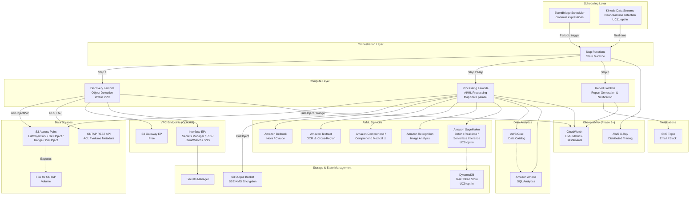

# FSx for ONTAP S3 Access Points Serverless Patterns

🌐 **Language / 言語**: [日本語](README.md) | [English](README.en.md) | [한국어](README.ko.md) | [简体中文](README.zh-CN.md) | [繁體中文](README.zh-TW.md) | [Français](README.fr.md) | [Deutsch](README.de.md) | [Español](README.es.md)

## Current Status

本仓库现包含 **28 个行业用例** + **事件驱动 FPolicy 模式** + **7 个 FlexCache/FlexClone 模式** + **内容边缘分发模式**，构成完整的无服务器模式库。

从最初的 5 个模式（Phase 1）经 Phase 2–13 扩展而来。Phase 10 引入共享 FPolicy 事件摄取管道，Phase 11 将调度扩展至全部 17 UC，Phase 12 通过 Persistent Store 重放验证、SLO 可观测性、容量护栏和密钥轮换进行运维强化，Phase 13 实现 FlexClone/FlexCache 无服务器自动化。

基于 Amazon FSx for ONTAP S3 Access Points 的行业专属无服务器自动化模式集合。

> **本仓库的定位**: 这是一个「用于学习设计决策的参考实现」。部分用例已在 AWS 环境中完成 E2E 验证，其他用例也已完成 CloudFormation 部署、共享 Discovery Lambda 及关键组件的功能验证。本仓库以从 PoC 到生产环境的渐进式应用为目标，通过具体代码展示成本优化、安全性和错误处理的设计决策。

**测试**: 1,499+ unit/property tests | 126 test files | cfn-lint + ruff validation

## Governance Disclaimer

本仓库的治理文档旨在支持架构和运维审查，不能替代法务判断、合规评估、隐私评估或监管应对。

## 相关文章

本仓库是以下文章中所述架构的实现示例：

- **FSx for ONTAP S3 Access Points as a Serverless Automation Boundary — AI Data Pipelines, Volume-Level SnapMirror DR, and Capacity Guardrails**
  https://dev.to/yoshikifujiwara/fsx-for-ontap-s3-access-points-as-a-serverless-automation-boundary-ai-data-pipelines-ili

文章解释架构设计思想和权衡取舍，本仓库提供具体的、可复用的实现模式。

## 概述

本仓库提供 **28 种行业专属模式（Phase 1: UC1–UC5、Phase 2: UC6–UC14、Phase 7: UC15–UC17、Phase 14: UC18–UC19、Phase 15: UC20–UC22、Phase 16: UC23–UC28）**，通过 **S3 Access Points** 对存储在 FSx for ONTAP 上的企业数据进行无服务器处理。

> 以下将 FSx for ONTAP S3 Access Points 简称为 **S3 AP**。

每个用例都是独立的 CloudFormation 模板，共享模块（ONTAP REST API 客户端、FSx 辅助工具、S3 AP 辅助工具）位于 `shared/` 目录中供复用。

### 主要特性

- **轮询架构**: 由于 S3 AP 不支持 `GetBucketNotificationConfiguration`，采用 EventBridge Scheduler + Step Functions 定期执行
- **事件驱动路径（Phase 10）**: 通过 ONTAP FPolicy → ECS Fargate → SQS → EventBridge 实现 NFSv3 文件事件检测（[快速入门](docs/event-driven/README.md)）
- **SMB (CIFS) 支持已验证**: FPolicy E2E 已通过 NFSv3 和 SMB 协议测试 — SMB 需要加入 AD 的 SVM（[SMB 设置](docs/event-driven/README.md#smb-cifs-テスト手順)）
- **共享模块分离**: OntapClient / FsxHelper / S3ApHelper 在所有用例中复用
- **CloudFormation / SAM Transform 架构**: 每个用例都是独立的 CloudFormation 模板（使用 SAM Transform）
- **安全优先**: 默认启用 TLS 验证、最小权限 IAM、KMS 加密
- **成本优化**: 高成本常驻资源（Interface VPC Endpoints 等）为可选项

### 设计指南与运维文档

| 文档 | 内容 |
|------|------|
| [S3AP 双层授权模型](docs/s3ap-authorization-model.md) | AWS IAM + 文件系统权限的双层授权设计 |
| [Deployment Profiles](docs/deployment-profiles.md) | PoC / Production / Compliance-sensitive 三种配置定义 |
| [Trigger Mode Decision Guide](docs/trigger-mode-decision-guide.md) | POLLING / EVENT_DRIVEN / HYBRID 选择标准 |
| [Enterprise Workload Examples](docs/enterprise-workload-examples.md) | SAP・EDI・审计・批处理输出等企业应用示例 |
| [S3AP Performance Considerations](docs/s3ap-performance-considerations.md) | 吞吐量设计・Lambda 规格选择・并发度计算 |
| [S3AP Benchmark Results](docs/s3ap-benchmark-results.md) | 实测值: PutObject/GetObject/Range GET/ListObjectsV2 延迟 |
| [Partner/SI Delivery Checklist](docs/partner-si-delivery-checklist.md) | 合作伙伴・SI 提案・设计・交付清单 |
| [Governance Checklist](docs/governance-checklist.md) | 监管・公共・医疗工作负载治理检查项 |
| [Production Readiness](docs/production-readiness.md) | PoC → 生产的 4 级成熟度模型 |
| [Customer Discovery Template](docs/customer-discovery-template.md) | 客户访谈模板 |
| [Well-Architected Mapping](docs/well-architected-mapping.md) | AWS Well-Architected 6 支柱对应表 |
| [Quick Start Guide](docs/quick-start.md) | 30 分钟内首次部署指南 |
| 🏗️ 动手实验 Lab 环境构建 (S3 AP + Tamperproof + FlexClone) | [`infrastructure/handson-lab/`](infrastructure/handson-lab/) |

## 架构



> 该图展示了涵盖所有阶段（Phase 1-5）服务的完整架构。SageMaker、Kinesis 和 DynamoDB 通过 CloudFormation Conditions 进行选择性控制，未启用时不会产生额外费用。对于 PoC/演示用途，也可以选择 VPC 外部的 Lambda 配置。

### 工作流概述

```
EventBridge Scheduler (定期执行)
  └─→ Step Functions State Machine
       ├─→ Discovery Lambda: 从 S3 AP 获取对象列表 → 生成 Manifest
       ├─→ Map State (并行处理): 使用 AI/ML 服务处理各对象
       └─→ Report/Notification: 生成结果报告 → SNS 通知
```

## 用例列表

### Phase 1 (UC1–UC5)

| # | 目录 | 行业 | 模式 | 使用的 AI/ML 服务 | ap-northeast-1 验证状态 |
|---|------|------|------|-----------------|----------------------|
| UC1 | `solutions/industry/legal-compliance/` | 法务合规 | 文件服务器审计与数据治理 | Athena, Bedrock | ✅ E2E 成功 |
| UC2 | `solutions/industry/financial-idp/` | 金融保险 | 合同/发票自动处理 (IDP) | Textract ⚠️, Comprehend, Bedrock | ⚠️ 东京不支持（使用对应区域） |
| UC3 | `solutions/industry/manufacturing-analytics/` | 制造业 | IoT 传感器日志与质量检测图像分析 | Athena, Rekognition | ✅ E2E 成功 |
| UC4 | `solutions/industry/media-vfx/` | 媒体 | VFX 渲染管线 | Rekognition, Deadline Cloud | ⚠️ Deadline Cloud 需配置 |
| UC5 | `solutions/industry/healthcare-dicom/` | 医疗 | DICOM 图像自动分类与脱敏 | Rekognition, Comprehend Medical ⚠️ | ⚠️ 东京不支持（使用对应区域） |

### Phase 2 (UC6–UC14)

| # | 目录 | 行业 | 模式 | 使用的 AI/ML 服务 | ap-northeast-1 验证状态 |
|---|------|------|------|-----------------|----------------------|
| UC6 | `solutions/industry/semiconductor-eda/` | 半导体 / EDA | GDS/OASIS 验证・元数据提取・DRC 汇总 | Athena, Bedrock | ✅ 测试通过 |
| UC7 | `solutions/industry/genomics-pipeline/` | 基因组学 | FASTQ/VCF 质量检查・变异调用汇总 | Athena, Bedrock, Comprehend Medical ⚠️ | ⚠️ Cross-Region (us-east-1) |
| UC8 | `solutions/industry/energy-seismic/` | 能源 | SEG-Y 元数据提取・井日志异常检测 | Athena, Bedrock, Rekognition | ✅ 测试通过 |
| UC9 | `solutions/industry/autonomous-driving/` | 自动驾驶 / ADAS | 视频/LiDAR 预处理・质量检查・标注 | Rekognition, Bedrock, SageMaker | ✅ 测试通过 |
| UC10 | `solutions/industry/construction-bim/` | 建筑 / AEC | BIM 版本管理・图纸 OCR・安全合规 | Textract ⚠️, Bedrock, Rekognition | ⚠️ Cross-Region (us-east-1) |
| UC11 | `solutions/industry/retail-catalog/` | 零售 / 电商 | 商品图像标签・目录元数据生成 | Rekognition, Bedrock | ✅ 测试通过 |
| UC12 | `solutions/industry/logistics-ocr/` | 物流 | 运单 OCR・仓库库存图像分析 | Textract ⚠️, Rekognition, Bedrock | ⚠️ Cross-Region (us-east-1) |
| UC13 | `solutions/industry/education-research/` | 教育 / 研究 | 论文 PDF 分类・引用网络分析 | Textract ⚠️, Comprehend, Bedrock | ⚠️ Cross-Region (us-east-1) |
| UC14 | `solutions/industry/insurance-claims/` | 保险 | 事故照片损害评估・估价单 OCR・理赔报告 | Rekognition, Textract ⚠️, Bedrock | ⚠️ Cross-Region (us-east-1) |

> **区域限制**: Amazon Textract 和 Amazon Comprehend Medical 在 ap-northeast-1（东京）不可用。Phase 2 UC（UC7、UC10、UC12、UC13、UC14）通过 Cross_Region_Client 将 API 调用路由到 us-east-1。Rekognition、Comprehend、Bedrock、Athena 在 ap-northeast-1 可用。
> 
> 参考: [Textract 支持区域](https://docs.aws.amazon.com/general/latest/gr/textract.html) | [Comprehend Medical 支持区域](https://docs.aws.amazon.com/general/latest/gr/comprehend-med.html)

### Phase 7 (UC15–UC17) 公共部门扩展

| # | 目录 | 行业 | 模式 | AI/ML 服务 | ap-northeast-1 验证状态 |
|---|------|------|------|-----------|-----------------------|
| UC15 | `solutions/industry/defense-satellite/` | 国防/太空 | 卫星图像分析（对象检测、变化检测、警报）| Rekognition, SageMaker（可选）, Bedrock | ✅ 代码+测试完成，AWS 已验证 |
| UC16 | `solutions/industry/government-archives/` | 政府 | 公文档案·FOIA（OCR、分类、编辑、20 天期限跟踪）| Textract ⚠️, Comprehend, Bedrock, OpenSearch（可选）| ✅ 代码+测试完成，AWS 已验证 |
| UC17 | `solutions/industry/smart-city-geospatial/` | 智慧城市 | 地理空间分析（CRS 归一化、土地利用、风险映射、规划报告）| Rekognition, SageMaker（可选）, Bedrock (Nova Lite) | ✅ 代码+测试完成，AWS 已验证 |
| UC18 | [`solutions/industry/telecom-network-analytics/`](solutions/industry/telecom-network-analytics/) | 通信 | CDR/网络日志分析・异常检测 |
| UC19 | [`solutions/industry/adtech-creative-management/`](solutions/industry/adtech-creative-management/) | 广告 | 创意资产管理・品牌合规 |
| UC20 | [`solutions/industry/travel-document-processing/`](solutions/industry/travel-document-processing/) | 旅行 | 预订文档处理・设施检查图像分析 |
| UC21 | [`solutions/industry/agri-food-traceability/`](solutions/industry/agri-food-traceability/) | 农业・食品 | 农田航空图像・追溯文档管理 |
| UC22 | [`solutions/industry/transportation-maintenance/`](solutions/industry/transportation-maintenance/) | 运输・铁路 | 设备检查图像・维护报告分析 |
| UC23 | [`solutions/industry/sustainability-esg-reporting/`](solutions/industry/sustainability-esg-reporting/) | 可持续发展 | ESG 指标提取・报告 |
| UC24 | [`solutions/industry/nonprofit-grant-management/`](solutions/industry/nonprofit-grant-management/) | NPO | 补助金申请分类・成果匹配 |
| UC25 | [`solutions/industry/utilities-asset-inspection/`](solutions/industry/utilities-asset-inspection/) | 电力 | 无人机图像・SCADA 日志分析 |
| UC26 | [`solutions/industry/real-estate-portfolio/`](solutions/industry/real-estate-portfolio/) | 不动产 | 物件图像分析・合同数据提取 |
| UC27 | [`solutions/industry/hr-document-screening/`](solutions/industry/hr-document-screening/) | 人才・HR | 简历筛选・候选人评估 |
| UC28 | [`solutions/industry/chemical-sds-management/`](solutions/industry/chemical-sds-management/) | 化学・材料 | SDS 管理・实验笔记分析 |
| UC29 | [`solutions/genai/kb-selfservice-curation/`](solutions/genai/kb-selfservice-curation/) | 全行业通用 | 自助式 AI 知识运营（托管 Bedrock KB + Windows 拖放） |
| UC30 | [`solutions/genai/quick-agentic-workspace/`](solutions/genai/quick-agentic-workspace/) | 全行业通用 | Amazon Quick 智能体工作区（Index/Sight/Flows + S3 AP 数据底座） |

> **公共部门合规性**: UC15 针对 DoD CC SRG / CSfC / FedRAMP High（GovCloud 迁移），UC16 针对 NARA / FOIA Section 552 / Section 508，UC17 针对 INSPIRE 指令 / OGC 标准。

### Phase 13: FlexCache × S3 AP × Serverless 扩展模式

| # | 目录 | 模式 | 概述 | 状态 |
|---|------|------|------|------|
| FC1 | [`solutions/flexcache/anycast-dr/`](solutions/flexcache/anycast-dr/README.md) | FlexCache AnyCast / DR | 健康检查·路由决策·故障转移模拟 | ✅ 代码·文档完成 |
| FC2 | [`solutions/flexcache/dynamic-render-workflow/`](solutions/flexcache/dynamic-render-workflow/README.md) | Dynamic FlexCache Render/EDA | 按作业动态创建·删除 FlexCache 工作流 | ✅ 代码·测试完成 |
| FC3 | [`solutions/flexcache/rag-enterprise-files/`](solutions/flexcache/rag-enterprise-files/README.md) | GenAI RAG over Enterprise Files | 基于权限的 RAG（通过 S3 AP，无需数据复制）| ✅ 代码·测试完成 |
| FC4 | [`solutions/flexcache/automotive-cae/`](solutions/flexcache/automotive-cae/README.md) | Automotive CAE Analytics | CAE 仿真结果自动分析 | ✅ 代码·测试完成 |
| FC5 | [`solutions/flexcache/life-sciences-research/`](solutions/flexcache/life-sciences-research/README.md) | Life Sciences Research | 研究数据自动分析 | ✅ 模板完成 |
| FC6 | [`solutions/flexcache/gaming-build-pipeline/`](solutions/flexcache/gaming-build-pipeline/README.md) | Gaming Build Pipeline | 游戏资产质量检查·日志分析 | ✅ 模板完成 |
| FC7 | [`solutions/flexcache/devops-cicd/`](solutions/flexcache/devops-cicd/README.md) | FlexClone Dev/Test & CI/CD (Phase 15) | 基于 FlexClone 的 Dev/Test 刷新与 CI/CD | ✅ 代码·测试完成 |

### 基础设施・通用模式

| 目录 | 内容 |
|:---|:---|
| [`infrastructure/handson-lab/`](infrastructure/handson-lab/) | **动手实验 Lab IaC**（CloudFormation 嵌套堆栈: VPC/AD/FSx/EC2/S3AP。可单独验证 S3 AP + Tamperproof Snapshot + FlexClone 恢复） |
| [`solutions/event-driven/fpolicy/`](solutions/event-driven/fpolicy/) | FPolicy 事件驱动管道 |
| [`solutions/edge/content-delivery/`](solutions/edge/content-delivery/) | CDN/边缘分发模式（厂商中立・CloudFront/第三方，[CDN 对比](docs/cdn-comparison.en.md)） |

> **重要**: FlexCache 卷是否可以附加 S3 Access Point 取决于 ONTAP 版本和 FSx for ONTAP 服务规格。PoC 时务必在实际环境中验证。

### 文档（架构・演示指南）

各 UC 的详细架构图和演示指南在 docs/ 文件夹中以 8 种语言提供。

| # | 用例 | 架构 | 演示指南 |
|---|------|------|----------|
| UC1 | 法务 | [📐 Architecture](solutions/industry/legal-compliance/docs/architecture.md) | [🎬 Demo Guide](solutions/industry/legal-compliance/docs/demo-guide.md) |
| UC2 | 金融 | [📐 Architecture](solutions/industry/financial-idp/docs/architecture.md) | [🎬 Demo Guide](solutions/industry/financial-idp/docs/demo-guide.md) |
| UC3 | 制造 | [📐 Architecture](solutions/industry/manufacturing-analytics/docs/architecture.md) | [🎬 Demo Guide](solutions/industry/manufacturing-analytics/docs/demo-guide.md) |
| UC4 | 媒体 | [📐 Architecture](solutions/industry/media-vfx/docs/architecture.md) | [🎬 Demo Guide](solutions/industry/media-vfx/docs/demo-guide.md) |
| UC5 | 医疗 | [📐 Architecture](solutions/industry/healthcare-dicom/docs/architecture.md) | [🎬 Demo Guide](solutions/industry/healthcare-dicom/docs/demo-guide.md) |
| UC6 | 半导体 | [📐 Architecture](solutions/industry/semiconductor-eda/docs/architecture.md) | [🎬 Demo Guide](solutions/industry/semiconductor-eda/docs/demo-guide.md) |
| UC7 | 基因组 | [📐 Architecture](solutions/industry/genomics-pipeline/docs/architecture.md) | [🎬 Demo Guide](solutions/industry/genomics-pipeline/docs/demo-guide.md) |
| UC8 | 能源 | [📐 Architecture](solutions/industry/energy-seismic/docs/architecture.md) | [🎬 Demo Guide](solutions/industry/energy-seismic/docs/demo-guide.md) |
| UC9 | 自动驾驶 | [📐 Architecture](solutions/industry/autonomous-driving/docs/architecture.md) | [🎬 Demo Guide](solutions/industry/autonomous-driving/docs/demo-guide.md) |
| UC10 | 建筑 | [📐 Architecture](solutions/industry/construction-bim/docs/architecture.md) | [🎬 Demo Guide](solutions/industry/construction-bim/docs/demo-guide.md) |
| UC11 | 零售 | [📐 Architecture](solutions/industry/retail-catalog/docs/architecture.md) | [🎬 Demo Guide](solutions/industry/retail-catalog/docs/demo-guide.md) |
| UC12 | 物流 | [📐 Architecture](solutions/industry/logistics-ocr/docs/architecture.md) | [🎬 Demo Guide](solutions/industry/logistics-ocr/docs/demo-guide.md) |
| UC13 | 教育 | [📐 Architecture](solutions/industry/education-research/docs/architecture.md) | [🎬 Demo Guide](solutions/industry/education-research/docs/demo-guide.md) |
| UC14 | 保险 | [📐 Architecture](solutions/industry/insurance-claims/docs/architecture.md) | [🎬 Demo Guide](solutions/industry/insurance-claims/docs/demo-guide.md) |
| UC15 | 国防 | [📐 Architecture](solutions/industry/defense-satellite/docs/architecture.md) | [🎬 Demo Guide](solutions/industry/defense-satellite/docs/demo-guide.md) |
| UC16 | 政府 | [📐 Architecture](solutions/industry/government-archives/docs/architecture.md) | [🎬 Demo Guide](solutions/industry/government-archives/docs/demo-guide.md) |
| UC17 | 智慧城市 | [📐 Architecture](solutions/industry/smart-city-geospatial/docs/architecture.md) | [🎬 Demo Guide](solutions/industry/smart-city-geospatial/docs/demo-guide.md) |
| UC18 | 通信 | [📐 Architecture](solutions/industry/telecom-network-analytics/docs/architecture.md) | [🎬 Demo Guide](solutions/industry/telecom-network-analytics/docs/demo-guide.md) |
| UC19 | 广告 | [📐 Architecture](solutions/industry/adtech-creative-management/docs/architecture.md) | [🎬 Demo Guide](solutions/industry/adtech-creative-management/docs/demo-guide.md) |
| UC20 | 旅行 | [📐 Architecture](solutions/industry/travel-document-processing/docs/architecture.md) | [🎬 Demo Guide](solutions/industry/travel-document-processing/docs/demo-guide.md) |
| UC21 | 农业 | [📐 Architecture](solutions/industry/agri-food-traceability/docs/architecture.md) | [🎬 Demo Guide](solutions/industry/agri-food-traceability/docs/demo-guide.md) |
| UC22 | 运输 | [📐 Architecture](solutions/industry/transportation-maintenance/docs/architecture.md) | [🎬 Demo Guide](solutions/industry/transportation-maintenance/docs/demo-guide.md) |
| UC23 | 可持续发展 | [📐 Architecture](solutions/industry/sustainability-esg-reporting/docs/architecture.md) | [🎬 Demo Guide](solutions/industry/sustainability-esg-reporting/docs/demo-guide.md) |
| UC24 | NPO | [📐 Architecture](solutions/industry/nonprofit-grant-management/docs/architecture.md) | [🎬 Demo Guide](solutions/industry/nonprofit-grant-management/docs/demo-guide.md) |
| UC25 | 电力 | [📐 Architecture](solutions/industry/utilities-asset-inspection/docs/architecture.md) | [🎬 Demo Guide](solutions/industry/utilities-asset-inspection/docs/demo-guide.md) |
| UC26 | 不动产 | [📐 Architecture](solutions/industry/real-estate-portfolio/docs/architecture.md) | [🎬 Demo Guide](solutions/industry/real-estate-portfolio/docs/demo-guide.md) |
| UC27 | 人才HR | [📐 Architecture](solutions/industry/hr-document-screening/docs/architecture.md) | [🎬 Demo Guide](solutions/industry/hr-document-screening/docs/demo-guide.md) |
| UC28 | 化学 | [📐 Architecture](solutions/industry/chemical-sds-management/docs/architecture.md) | [🎬 Demo Guide](solutions/industry/chemical-sds-management/docs/demo-guide.md) |
| UC29 | 全行业通用 (自助 KB) | [📐 Architecture](solutions/genai/kb-selfservice-curation/docs/architecture.md) | [🎬 Demo Guide](solutions/genai/kb-selfservice-curation/docs/demo-guide.md) |
| UC30 | 全行业通用 (Amazon Quick) | [📐 Architecture](solutions/genai/quick-agentic-workspace/docs/architecture.md) | [🎬 Demo Guide](solutions/genai/quick-agentic-workspace/docs/demo-guide.md) |
| — | 内容边缘分发 (CDN) | [📐 Architecture](solutions/edge/content-delivery/docs/architecture.md) | [🎬 Demo Guide](solutions/edge/content-delivery/docs/demo-guide.md) |

## UI/UX 截图 (最终用户 / 员工 / 负责人视图)

每个 UC 的 **最终用户、员工、负责人在日常工作中实际看到的 UI/UX 界面**
在各 UC 的 README 和 demo-guide 中刊载。Step Functions 工作流图等技术人员视图
集中在各 phase 的验证结果文档 (`docs/verification-results-phase*.md`) 中。

不仅限于 Public Sector (UC15/16/17)，所有行业的 UC 采用相同方针:

- **担当人视角**: 在 S3 控制台确认输出物、阅读 Bedrock 报告、接收 SNS 邮件、
  在 DynamoDB 检索历史等日常业务界面
- **技术人员视角除外**: CloudFormation 堆栈事件、Lambda 日志、Step Functions 图
  (工作流可视化目的除外) 保留在 `verification-results-*.md` 中

| UC | 行业 | 截图数 | 主要内容 | 位置 |
|----|------|--------|---------|------|
| UC1 | 法务·合规 | 1 | Step Functions 图 (审计负责人工作流可视化) | [`solutions/industry/legal-compliance/docs/demo-guide.zh-CN.md`](solutions/industry/legal-compliance/docs/demo-guide.zh-CN.md) |
| UC2 | 金融·IDP | 1 | Step Functions 图 (发票处理负责人工作流可视化) | [`solutions/industry/financial-idp/docs/demo-guide.zh-CN.md`](solutions/industry/financial-idp/docs/demo-guide.zh-CN.md) |
| UC3 | 制造·分析 | 1 | Step Functions 图 (质量管理负责人工作流可视化) | [`solutions/industry/manufacturing-analytics/docs/demo-guide.zh-CN.md`](solutions/industry/manufacturing-analytics/docs/demo-guide.zh-CN.md) |
| UC4 | 媒体·VFX | 未刊载 | (渲染负责人界面, 计划拍摄) | [`solutions/industry/media-vfx/docs/demo-guide.zh-CN.md`](solutions/industry/media-vfx/docs/demo-guide.zh-CN.md) |
| UC5 | 医疗·DICOM | 1 | Step Functions 图 (医疗信息管理员工作流可视化) | [`solutions/industry/healthcare-dicom/docs/demo-guide.zh-CN.md`](solutions/industry/healthcare-dicom/docs/demo-guide.zh-CN.md) |
| UC6 | 半导体·EDA | 4 | FSx Volumes / S3 输出桶 / Athena 查询结果 / Bedrock 设计审查报告 | [`solutions/industry/semiconductor-eda/docs/demo-guide.zh-CN.md`](solutions/industry/semiconductor-eda/docs/demo-guide.zh-CN.md) |
| UC7 | 基因组学流水线 | 1 | Step Functions 图 (研究者工作流可视化) | [`solutions/industry/genomics-pipeline/docs/demo-guide.zh-CN.md`](solutions/industry/genomics-pipeline/docs/demo-guide.zh-CN.md) |
| UC8 | 能源·地震勘探 | 1 | Step Functions 图 (地质解析负责人工作流可视化) | [`solutions/industry/energy-seismic/docs/demo-guide.zh-CN.md`](solutions/industry/energy-seismic/docs/demo-guide.zh-CN.md) |
| UC9 | 自动驾驶 | 未刊载 | (ADAS 分析负责人界面, 计划拍摄) | [`solutions/industry/autonomous-driving/docs/demo-guide.zh-CN.md`](solutions/industry/autonomous-driving/docs/demo-guide.zh-CN.md) |
| UC10 | 建筑·BIM | 1 | Step Functions 图 (BIM 管理员 / 安全负责人工作流可视化) | [`solutions/industry/construction-bim/docs/demo-guide.zh-CN.md`](solutions/industry/construction-bim/docs/demo-guide.zh-CN.md) |
| UC11 | 零售·目录 | 2 | 产品标签结果 / S3 输出桶 (EC 负责人用) | [`solutions/industry/retail-catalog/docs/demo-guide.zh-CN.md`](solutions/industry/retail-catalog/docs/demo-guide.zh-CN.md) |
| UC12 | 物流·OCR | 1 | Step Functions 图 (配送负责人工作流可视化) | [`solutions/industry/logistics-ocr/docs/demo-guide.zh-CN.md`](solutions/industry/logistics-ocr/docs/demo-guide.zh-CN.md) |
| UC13 | 教育·研究 | 1 | Step Functions 图 (研究事务负责人工作流可视化) | [`solutions/industry/education-research/docs/demo-guide.zh-CN.md`](solutions/industry/education-research/docs/demo-guide.zh-CN.md) |
| UC14 | 保险 | 2 | 理赔报告 / S3 输出桶 (保险理算员用) | [`solutions/industry/insurance-claims/docs/demo-guide.zh-CN.md`](solutions/industry/insurance-claims/docs/demo-guide.zh-CN.md) |
| UC15 | 国防·卫星图像 (Public Sector) | 4 | S3 上传 / 输出 / SNS 邮件 / JSON 成果物 (分析负责人用) | [`solutions/industry/defense-satellite/README.md`](solutions/industry/defense-satellite/README.md) |
| UC16 | 政府·FOIA (Public Sector) | 5 | 上传 / 编辑预览 / 元数据 / FOIA 提醒邮件 / DynamoDB 保留历史 (公文档负责人用) | [`solutions/industry/government-archives/README.md`](solutions/industry/government-archives/README.md) |
| UC17 | 智慧城市 (Public Sector) | 5 | GIS 上传 / Bedrock 报告 / 风险地图 / 土地利用分布 / 时序历史 (城市规划负责人用) | [`solutions/industry/smart-city-geospatial/README.md`](solutions/industry/smart-city-geospatial/README.md) |

**通用截图** (跨行业通用视图, `docs/screenshots/masked/common/`):
- `fsx-s3ap-detail.png` — FSx for ONTAP S3 Access Point 详情视图 (存储管理员参考)
- `s3ap-list.png` — S3 Access Points 列表 (IT 管理员参考)

**按 Phase 视图** (`docs/screenshots/masked/phase{1..7}/`):
- Phase 1-6b: 基础设施构建 / 功能添加时的技术人员视图
- Phase 7: UC15/16/17 公共 FSx S3 Access Points 视图等

行业映射表 (8 语言): [`docs/screenshots/uc-industry-mapping.md`](docs/screenshots/uc-industry-mapping.md).
添加工作流: [`docs/screenshots/SCREENSHOT_ADDITION_WORKFLOW.md`](docs/screenshots/SCREENSHOT_ADDITION_WORKFLOW.md).

> 所有文档均提供 8 种语言版本。
## AWS 规格约束及解决方案

### 输出目标选择 (OutputDestination 参数)

每个 UC 的 CloudFormation 模板都包含 `OutputDestination` 参数来选择
AI/ML 工件的写入目标（已在 UC9/10/11/12/14 实现,
其他 UC 由 Pattern A 或 Pattern C 覆盖 - 参见下面的 Pattern 表):

- **`STANDARD_S3`** (默认): 写入新的 S3 存储桶 (现有行为)
- **`FSXN_S3AP`**: 通过 S3 Access Point 将结果写回同一个 FSx for ONTAP 卷
  (**"no data movement" 模式**, 使 SMB/NFS 用户能够在现有目录结构中
  查看 AI 工件)

```bash
# 以 FSXN_S3AP 模式部署
aws cloudformation deploy \
  --template-file solutions/industry/retail-catalog/template-deploy.yaml \
  --stack-name fsxn-retail-catalog-demo \
  --parameter-overrides \
    OutputDestination=FSXN_S3AP \
    OutputS3APPrefix=ai-outputs/ \
    ... (其他必需参数)
```

### FSx for ONTAP S3 Access Points 的 AWS 规格约束

FSx for ONTAP S3 Access Points 仅支持 S3 API 的一部分
(参见 [Access point compatibility](https://docs.aws.amazon.com/fsx/latest/ONTAPGuide/access-points-for-fsxn-object-api-support.html))。
由于以下约束,某些功能需要使用标准 S3 存储桶:

| AWS 规格约束 | 影响 | 项目解决方案 | 功能改进请求 (FR) |
|---|---|---|---|
| Athena 查询结果输出位置无法指定 S3AP<br>(Athena 无法 write back 到 S3AP) | UC6/7/8/13 的 Athena 结果需要标准 S3 | 每个模板创建专用于 Athena 结果的 S3 存储桶 | [FR-1](docs/aws-feature-requests/fsxn-s3ap-improvements.md#fr-1) |
| S3AP 不发出 S3 Event Notifications / EventBridge 事件 | 无法实现事件驱动的工作流 | EventBridge Scheduler + Discovery Lambda 轮询方式 | [FR-2](docs/aws-feature-requests/fsxn-s3ap-improvements.md#fr-2) |
| S3AP 不支持 Object Lifecycle 策略 | 7 年保留 (UC1 法务), 永久保留 (UC16 政府档案) 等自动化困难 | 定期删除的 Lambda 清理器 (未实现, 待办事项) | [FR-3](docs/aws-feature-requests/fsxn-s3ap-improvements.md#fr-3) |
| S3AP 不支持 Object Versioning / Presigned URL | 文档版本管理, 外部审计员的限时共享不可能 | DynamoDB 用于版本管理, 标准 S3 复制 + Presign | [FR-4](docs/aws-feature-requests/fsxn-s3ap-improvements.md#fr-4) |
| 5GB 上传大小限制 | 大型二进制文件 (4K 视频, 未压缩 GeoTIFF 等) | `shared.s3ap_helper.multipart_upload()` 支持到 5GB | (接受的 AWS 规格) |
| 仅支持 SSE-FSX (不支持 SSE-KMS) | 无法使用自定义 KMS 密钥加密 | 通过 FSx 卷级别的 KMS 配置进行加密 | (接受的 AWS 规格) |

全部 4 个功能改进请求 (FR-1 ~ FR-4) 的详细内容和业务影响整理在
[`docs/aws-feature-requests/fsxn-s3ap-improvements.md`](docs/aws-feature-requests/fsxn-s3ap-improvements.md)
中。

3 种输出模式 (Pattern A/B/C) 的详细比较请参阅
[`docs/output-destination-patterns.md`](docs/output-destination-patterns.md)。

### 每个 UC 的输出目标约束

28 个 UC 分为 3 种输出模式:

- **🟢 UC1-5** (Pattern A, 2026-05-11 更新): `S3AccessPointOutputAlias` (legacy, optional) + 新增的 `OutputDestination` / `OutputS3APAlias` / `OutputS3APPrefix` 支持。默认 `OutputDestination=FSXN_S3AP` 保持现有行为
- **🟢🆕 UC9/10/11/12/14** (Pattern B, 2026-05-10 实现): `OutputDestination` 切换机制 (STANDARD_S3 ⇄ FSXN_S3AP)。默认 `OutputDestination=STANDARD_S3`。UC11/14 已在 AWS 上验证, UC9/10/12 仅完成单元测试
- **🟡 UC6/7/8/13**: 当前仅为 `OUTPUT_BUCKET` (固定为标准 S3)。Athena 结果在规格上需要标准 S3, 因此 `OutputDestination` 应用是部分性的
- **🟢 UC15-17**: Pattern A (write back 到 FSx for ONTAP S3 AP, Phase 7 的一部分)

| UC | 输入 | 输出 | 选择机制 | 备注 |
|----|------|------|----------|------|
| UC1 legal-compliance | S3AP | S3AP (现有) | ✅ `OutputDestination` + legacy `S3AccessPointOutputAlias` | 合同元数据 / 审计日志 |
| UC2 financial-idp | S3AP | S3AP (现有) | ✅ `OutputDestination` + legacy `S3AccessPointOutputAlias` | 发票 OCR 结果 |
| UC3 manufacturing-analytics | S3AP | S3AP (现有) | ✅ `OutputDestination` + legacy `S3AccessPointOutputAlias` | 检查结果 / 异常检测 |
| UC4 media-vfx | S3AP | S3AP (现有) | ✅ `OutputDestination` + legacy `S3AccessPointOutputAlias` | 渲染元数据 |
| UC5 healthcare-dicom | S3AP | S3AP (现有) | ✅ `OutputDestination` + legacy `S3AccessPointOutputAlias` | DICOM 元数据 / 匿名化结果 |
| UC6 semiconductor-eda | S3AP | **可选 (混合)** | ✅ `OutputDestination` | Bedrock 报告/元数据 → 可切换, Athena DRC 结果 → 标准 S3 固定 (AWS 规格) |
| UC7 genomics-pipeline | S3AP | **可选 (混合)** | ✅ `OutputDestination` | QC/Variant/Summary → 可切换, Athena 结果 → 标准 S3 固定 (AWS 规格) |
| UC8 energy-seismic | S3AP | **可选 (混合)** | ✅ `OutputDestination` | 元数据/异常检测/合规报告 → 可切换, Athena → 标准 S3 固定 |
| UC9 autonomous-driving | S3AP | **可选择** 🆕 | ✅ `OutputDestination` | ADAS 分析结果 |
| UC10 construction-bim | S3AP | **可选择** 🆕 | ✅ `OutputDestination` | BIM 元数据 / 安全合规报告 |
| **UC11 retail-catalog** | S3AP | **可选择** | ✅ `OutputDestination` | AWS 实证完成 2026-05-10 |
| UC12 logistics-ocr | S3AP | **可选择** 🆕 | ✅ `OutputDestination` | 配送运单 OCR |
| UC13 education-research | S3AP | **可选** | ✅ `OutputDestination` | OCR/分类/引用分析/元数据 → 全部可切换 |
| **UC14 insurance-claims** | S3AP | **可选择** | ✅ `OutputDestination` | AWS 实证完成 2026-05-10 |
| UC15 defense-satellite | S3AP | S3AP | 现有模式 | 对象检测 / 变化检测结果 |
| UC16 government-archives | S3AP | S3AP | 现有模式 | FOIA 编辑结果 / 元数据 |
| UC17 smart-city-geospatial | S3AP | S3AP | 现有模式 | GIS 分析结果 / 风险地图 |

**当前状态与下一步**:

全部 28 UC + SAP 均可通过 `OutputDestination` 参数切换输出目标。仅 UC6/7/8 的 Athena 结果输出受 AWS 规格限制固定为标准 S3，其他产出物（Bedrock 报告、元数据等）均可切换至 `FSXN_S3AP`。

待办:
- UC9/10/12/15/16/17 的 AWS 实际部署验证（单元测试已完成，UC11/14 已验证）
## 区域选择指南

本模式集在 **ap-northeast-1（东京）** 进行了验证，但可以部署到任何所需服务可用的 AWS 区域。

### 部署前检查清单

1. 在 [AWS Regional Services List](https://aws.amazon.com/about-aws/global-infrastructure/regional-product-services/) 确认服务可用性
2. 确认 Phase 3 服务：
   - **Kinesis Data Streams**：几乎所有区域可用（分片定价因区域而异）
   - **SageMaker Batch Transform**：实例类型可用性因区域而异
   - **X-Ray / CloudWatch EMF**：几乎所有区域可用
3. 确认 Cross-Region 目标服务（Textract、Comprehend Medical）的目标区域

详情请参阅[区域兼容性矩阵](docs/region-compatibility.md)。

### Phase 3 功能概要

| 功能 | 说明 | 目标 UC |
|------|------|---------|
| Kinesis 流式处理 | 近实时文件变更检测和处理 | UC11（可选启用） |
| SageMaker Batch Transform | 点云分割推理（Callback Pattern） | UC9（可选启用） |
| X-Ray 追踪 | 分布式追踪实现执行路径可视化 | 全部 14 UC |
| CloudWatch EMF | 结构化指标输出（FilesProcessed、Duration、Errors） | 全部 14 UC |
| 可观测性仪表板 | 全 UC 横跨指标集中展示 | 共用 |
| 告警自动化 | 基于错误率阈值的 SNS 通知 | 共用 |

详情请参阅[流式处理 vs 轮询选择指南](docs/streaming-vs-polling-guide-zh-CN.md)。

### Phase 4 功能概要

| 功能 | 说明 | 目标 UC |
|------|------|---------|
| DynamoDB Task Token Store | SageMaker Callback Pattern 的生产安全 Token 管理（Correlation ID 方式） | UC9（可选启用） |
| Real-time Inference Endpoint | 通过 SageMaker Real-time Endpoint 实现低延迟推理 | UC9（可选启用） |
| A/B Testing | 通过 Multi-Variant Endpoint 进行模型版本比较 | UC9（可选启用） |
| Model Registry | 通过 SageMaker Model Registry 进行模型生命周期管理 | UC9（可选启用） |
| Multi-Account Deployment | 通过 StackSets / Cross-Account IAM / S3 AP 策略实现多账户支持 | 全部 UC（提供模板） |
| Event-Driven Prototype | S3 Event Notifications → EventBridge → Step Functions 管道 | 原型 |

Phase 4 的所有功能通过 CloudFormation Conditions 进行可选控制，未启用时不会产生额外费用。

详情请参阅以下文档：
- [推理成本比较指南](docs/inference-cost-comparison.md)
- [Model Registry 指南](docs/model-registry-guide.md)
- [Multi-Account PoC 结果](docs/multi-account/poc-results.md)
- [Event-Driven 架构设计](docs/event-driven/architecture-design.md)

### Phase 5 功能概要

| 功能 | 说明 | 目标 UC |
|------|------|---------|
| SageMaker Serverless Inference | 第3路由选项（Batch / Real-time / Serverless 三路选择） | UC9（可选启用） |
| Scheduled Scaling | 基于工作时间的 SageMaker Endpoint 自动扩缩 | UC9（可选启用） |
| CloudWatch Billing Alarms | Warning / Critical / Emergency 三级成本告警 | 通用（可选启用） |
| Auto-Stop Lambda | 自动检测并缩减闲置 SageMaker Endpoint | 通用（可选启用） |
| CI/CD Pipeline | GitHub Actions 工作流（cfn-lint → pytest → cfn-guard → Bandit → deploy） | 全部 UC |
| Multi-Region | DynamoDB Global Tables + CrossRegionClient 故障转移 | 通用（可选启用） |
| Disaster Recovery | DR Tier 1/2/3 定义、故障转移运行手册 | 通用（设计文档） |

Phase 5 的所有功能同样通过 CloudFormation Conditions 进行可选控制，未启用时不会产生额外费用。

详情请参阅以下文档：
- [Serverless Inference 冷启动特性](docs/serverless-inference-cold-start.md)
- [成本优化最佳实践指南](docs/cost-optimization-guide.md)
- [CI/CD 指南](docs/ci-cd-guide.md)
- [Multi-Region Step Functions 设计](docs/multi-region/step-functions-design.md)
- [Disaster Recovery 指南](docs/multi-region/disaster-recovery.md)

### 截图

> 以下为验证环境中的截图示例。环境特定信息（账户 ID 等）已进行脱敏处理。

#### 全部 5 个 UC 的 Step Functions 部署与执行确认


> UC1 和 UC3 已完成完整的 E2E 验证，UC2、UC4 和 UC5 已完成 CloudFormation 部署和主要组件的功能验证。使用有区域限制的 AI/ML 服务（Textract、Comprehend Medical）时，需要跨区域调用至支持区域，请确认数据驻留和合规要求。

#### Phase 2: 全部 9 个 UC CloudFormation 部署・Step Functions 执行成功


> 全部 9 个堆栈（UC6–UC14）达到 CREATE_COMPLETE / UPDATE_COMPLETE。共 205 个资源。


> 全部 9 个工作流已激活。投入测试数据后 E2E 执行全部 SUCCEEDED。


> UC6（半导体 EDA）Step Functions 执行详情。Discovery → ProcessObjects (Map) → DrcAggregation → ReportGeneration 全部状态成功。


> 全部 9 个 UC 的 EventBridge Scheduler 调度（rate(1 hour)）已启用。

#### AI/ML 服务界面（Phase 1）

##### Amazon Bedrock — 模型目录


##### Amazon Rekognition — 标签检测


##### Amazon Comprehend — 实体检测


#### AI/ML 服务界面（Phase 2）

##### Amazon Bedrock — 模型目录（UC6: 报告生成）


> UC6（半导体 EDA）中使用 Nova Lite 模型生成 DRC 报告。

##### Amazon Athena — 查询执行历史（UC6: 元数据汇总）


> UC6 的 Step Functions 工作流中执行 Athena 查询（cell_count, bbox, naming, invalid）。

##### Amazon Rekognition — 标签检测（UC11: 商品图片标记）


> UC11（零售目录）从商品图片中检测 15 个标签（Lighting 98.5%, Light 96.0%, Purple 92.0% 等）。

##### Amazon Textract — 文档 OCR（UC12: 配送单据读取）


> UC12（物流 OCR）从配送单据 PDF 中提取文本。通过 Cross-Region（us-east-1）执行。

##### Amazon Comprehend Medical — 医疗实体检测（UC7: 基因组分析）


> UC7（基因组管道）中使用 DetectEntitiesV2 API 从 VCF 分析结果中提取基因名（GC）。通过 Cross-Region（us-east-1）执行。

##### Lambda 函数列表（Phase 2）


> Phase 2 的全部 Lambda 函数（Discovery, Processing, Report 等）已成功部署。

#### Phase 3: 实时处理・SageMaker 集成・可观测性强化

##### Step Functions E2E 执行成功（UC11）


> UC11 Step Functions 工作流 E2E 执行成功。Discovery → ImageTagging Map → CatalogMetadata Map → QualityCheck 全状态成功（8.974秒）。X-Ray 跟踪生成确认。

##### Kinesis Data Streams（UC11 流式模式）


> UC11 Kinesis Data Stream（1 分片，预置模式）处于活跃状态。显示监控指标。

##### DynamoDB 状态管理表（UC11 变更检测）


> UC11 变更检测用 DynamoDB 表。streaming-state（状态管理）和 streaming-dead-letter（DLQ）两张表。

##### 可观测性堆栈


> X-Ray 跟踪。Stream Producer Lambda 1分钟间隔执行跟踪（全部 OK，延迟 7-11ms）。


> 全 14 UC 横跨集中式 CloudWatch 仪表板。Step Functions 成功/失败、Lambda 错误率、EMF 自定义指标。


> Phase 3 告警自动化。Step Functions 失败率、Lambda 错误率、Kinesis Iterator Age 阈值告警（全部 OK 状态）。

##### S3 Access Point 验证


> FSx for ONTAP S3 Access Point（fsxn-eda-s3ap）处于 Available 状态。通过 FSx 控制台卷 S3 选项卡确认。

#### Phase 4: 生产 SageMaker 集成、实时推理、多账户、事件驱动

##### DynamoDB Task Token Store


> DynamoDB Task Token Store 表。以 8 字符 hex Correlation ID 作为分区键存储 Task Token。TTL 已启用，PAY_PER_REQUEST 模式，GSI（TransformJobNameIndex）已配置。

##### SageMaker Real-time Endpoint（Multi-Variant A/B Testing）


> SageMaker Real-time Inference Endpoint。Multi-Variant 配置（model-v1: 70%, model-v2: 30%）用于 A/B 测试。Auto Scaling 已配置。

##### Step Functions 工作流（Realtime/Batch 路由）


> UC9 Step Functions 工作流。Choice State 在 file_count < threshold 时路由到 Real-time Endpoint，否则路由到 Batch Transform。

##### Event-Driven Prototype — EventBridge Rule


> Event-Driven Prototype EventBridge Rule。按 suffix (.jpg, .png) + prefix (products/) 过滤 S3 ObjectCreated 事件并触发 Step Functions。

##### Event-Driven Prototype — Step Functions 执行成功


> Event-Driven Prototype Step Functions 执行成功。S3 PutObject → EventBridge → Step Functions → EventProcessor → LatencyReporter 所有状态成功。

##### CloudFormation Phase 4 堆栈


> Phase 4 CloudFormation 堆栈。UC9 扩展（Task Token Store + Real-time Endpoint）及 Event-Driven Prototype CREATE_COMPLETE。

#### Phase 5: Serverless Inference·成本优化·Multi-Region

##### SageMaker Serverless Inference Endpoint


> SageMaker Serverless Inference Endpoint 设置。内存 4096 MB，最大并发 5。


> Serverless Endpoint Configuration 详情。无需预置，按需分配计算资源。

##### CloudWatch Billing Alarms（3 级成本告警）


> Warning / Critical / Emergency 3 级 Billing Alarms。超阈值时 SNS 通知。

##### DynamoDB Global Table（Multi-Region）


> DynamoDB Global Table 配置。Multi-Region 复制已启用。


> Global Table 副本配置。多区域间数据同步。

## 技术栈

| 层级 | 技术 |
|------|------|
| 语言 | Python 3.12 |
| IaC | CloudFormation (YAML) + SAM Transform |
| 计算 | AWS Lambda（生产: VPC 内 / PoC: VPC 外也可选择） |
| 编排 | AWS Step Functions |
| 调度 | Amazon EventBridge Scheduler |
| 存储 | FSx for ONTAP (S3 AP) + S3 输出桶 (SSE-KMS) |
| 通知 | Amazon SNS |
| 分析 | Amazon Athena + AWS Glue Data Catalog |
| AI/ML | Amazon Bedrock, Textract, Comprehend, Rekognition |
| 安全 | Secrets Manager, KMS, IAM 最小权限 |
| 测试 | pytest + Hypothesis (PBT), moto, cfn-lint, ruff |

## 前提条件

- **AWS 账户**: 有效的 AWS 账户和适当的 IAM 权限
- **FSx for ONTAP**: 已部署的文件系统
  - ONTAP 版本: 支持 S3 Access Points 的版本（已在 9.17.1P4D3 上验证）
  - 已关联 S3 Access Point 的 FSx for ONTAP 卷（network origin 根据用例选择。使用 Athena / Glue 时推荐 `internet`）
- **网络**: VPC、私有子网、路由表
- **Secrets Manager**: 预先注册 ONTAP REST API 凭证（格式: `{"username":"fsxadmin","password":"..."}`）
- **S3 存储桶**: 预先创建用于 Lambda 部署包的存储桶（例: `fsxn-s3ap-deploy-<account-id>`）
- **Python 3.12+**: 本地开发和测试用
- **AWS CLI v2**: 部署和管理用

### 准备命令

```bash
# 1. 创建部署用 S3 存储桶
ACCOUNT_ID=$(aws sts get-caller-identity --query Account --output text)
aws s3 mb "s3://fsxn-s3ap-deploy-${ACCOUNT_ID}" --region $AWS_DEFAULT_REGION

# 2. 将 ONTAP 凭证注册到 Secrets Manager
aws secretsmanager create-secret \
  --name fsxn-ontap-credentials \
  --secret-string '{"username":"fsxadmin","password":"<your-ontap-password>"}' \
  --region $AWS_DEFAULT_REGION

# 3. 检查现有 S3 Gateway Endpoint（防止重复创建）
aws ec2 describe-vpc-endpoints \
  --filters "Name=vpc-id,Values=<your-vpc-id>" "Name=service-name,Values=com.amazonaws.${AWS_DEFAULT_REGION}.s3" \
  --query 'VpcEndpoints[*].{Id:VpcEndpointId,State:State}' \
  --output table
# → 如果有结果，使用 EnableS3GatewayEndpoint=false 部署
```

### Lambda 部署选择指南

| 用途 | 推荐部署 | 原因 |
|------|---------|------|
| 演示 / PoC | VPC 外 Lambda | 无需 VPC Endpoint，低成本、配置简单 |
| 生产 / 封闭网络要求 | VPC 内 Lambda | 可通过 PrivateLink 使用 Secrets Manager / FSx / SNS 等 |
| 使用 Athena / Glue 的 UC | S3 AP network origin: `internet` | 需要 AWS 托管服务的访问 |

### 从 VPC 内 Lambda 访问 S3 AP 的注意事项

> **UC1 部署验证（2026-05-03）中确认的重要事项**

- **S3 Gateway Endpoint 的路由表关联是必须的**: 如果未在 `RouteTableIds` 中指定私有子网的路由表 ID，VPC 内 Lambda 对 S3 / S3 AP 的访问将超时
- **确认 VPC DNS 解析**: 确保 VPC 的 `enableDnsSupport` / `enableDnsHostnames` 已启用
- **PoC / 演示环境建议在 VPC 外运行 Lambda**: 如果 S3 AP 的 network origin 为 `internet`，VPC 外 Lambda 可以正常访问。无需 VPC Endpoint，可降低成本并简化配置
- 详情请参阅[故障排除指南](docs/guides/troubleshooting-guide.md#6-lambda-vpc-内実行時の-s3-ap-タイムアウト)

### 所需 AWS 服务配额

| 服务 | 配额 | 推荐值 |
|------|------|--------|
| Lambda 并发执行数 | ConcurrentExecutions | 100 以上 |
| Step Functions 执行数 | StartExecution/秒 | 默认值 (25) |
| S3 Access Point | 每账户 AP 数 | 默认值 (10,000) |

## 快速开始

### 1. 克隆仓库

```bash
git clone https://github.com/Yoshiki0705/FSx-for-ONTAP-S3AccessPoints-Serverless-Patterns.git
cd FSx-for-ONTAP-S3AccessPoints-Serverless-Patterns
```

### 2. 安装依赖

```bash
pip install -r requirements.txt
pip install -r requirements-dev.txt
```

### 3. 运行测试

```bash
# 单元测试（含覆盖率）
pytest shared/tests/ --cov=shared --cov-report=term-missing -v

# 属性基测试
pytest shared/tests/test_properties.py -v

# 代码检查
ruff check .
ruff format --check .
```

### 4. 部署用例（示例: UC1 法务合规）

> ⚠️ **关于对现有环境影响的重要事项**
>
> 部署前请确认以下内容:
>
> | 参数 | 对现有环境的影响 | 确认方法 |
> |------|----------------|---------|
> | `VpcId` / `PrivateSubnetIds` | 将在指定的 VPC/子网中创建 Lambda ENI | `aws ec2 describe-network-interfaces --filters Name=group-id,Values=<sg-id>` |
> | `EnableS3GatewayEndpoint=true` | 将向 VPC 添加 S3 Gateway Endpoint。**如果同一 VPC 中已存在 S3 Gateway Endpoint，请设置为 `false`** | `aws ec2 describe-vpc-endpoints --filters Name=vpc-id,Values=<vpc-id>` |
> | `PrivateRouteTableIds` | S3 Gateway Endpoint 将关联到路由表。不影响现有路由 | `aws ec2 describe-route-tables --route-table-ids <rtb-id>` |
> | `ScheduleExpression` | EventBridge Scheduler 将定期执行 Step Functions。**可在部署后禁用调度以避免不必要的执行** | AWS 控制台 → EventBridge → Schedules |
> | `NotificationEmail` | 将发送 SNS 订阅确认邮件 | 检查邮件收件箱 |
>
> **堆栈删除注意事项**:
> - 如果 S3 存储桶（Athena Results）中仍有对象，删除将失败。请先使用 `aws s3 rm s3://<bucket> --recursive` 清空
> - 启用版本控制的存储桶需要使用 `aws s3api delete-objects` 删除所有版本
> - VPC Endpoints 删除可能需要 5-15 分钟
> - Lambda ENI 释放可能需要时间，导致 Security Group 删除失败。请等待几分钟后重试

```bash
# 设置区域（通过环境变量管理）
export AWS_DEFAULT_REGION=us-east-1  # 推荐支持所有服务的区域

# Lambda 打包
./scripts/deploy_uc.sh legal-compliance package

# CloudFormation 部署
aws cloudformation create-stack \
  --stack-name fsxn-legal-compliance \
  --template-body file://solutions/industry/legal-compliance/template-deploy.yaml \
  --capabilities CAPABILITY_NAMED_IAM \
  --parameters \
    ParameterKey=DeployBucket,ParameterValue=<your-deploy-bucket> \
    ParameterKey=S3AccessPointAlias,ParameterValue=<your-volume-ext-s3alias> \
    ParameterKey=S3AccessPointName,ParameterValue=<your-s3ap-name> \
    ParameterKey=S3AccessPointOutputAlias,ParameterValue=<your-output-volume-ext-s3alias> \
    ParameterKey=OntapSecretName,ParameterValue=<your-ontap-secret-name> \
    ParameterKey=OntapManagementIp,ParameterValue=<your-ontap-management-ip> \
    ParameterKey=SvmUuid,ParameterValue=<your-svm-uuid> \
    ParameterKey=VolumeUuid,ParameterValue=<your-volume-uuid> \
    ParameterKey=VpcId,ParameterValue=<your-vpc-id> \
    'ParameterKey=PrivateSubnetIds,ParameterValue=<subnet-1>,<subnet-2>' \
    'ParameterKey=PrivateRouteTableIds,ParameterValue=<rtb-1>,<rtb-2>' \
    ParameterKey=NotificationEmail,ParameterValue=<your-email@example.com> \
    ParameterKey=EnableVpcEndpoints,ParameterValue=true \
    ParameterKey=EnableS3GatewayEndpoint,ParameterValue=true
```

> **注意**: 请将 `<...>` 占位符替换为实际环境值。
>
> **关于 `EnableVpcEndpoints`**: Quick Start 中指定 `true` 以确保 VPC 内 Lambda 到 Secrets Manager / CloudWatch / SNS 的连通性。如果已有 Interface VPC Endpoints 或 NAT Gateway，可以指定 `false` 以降低成本。
> 
> **区域选择**: 推荐使用所有 AI/ML 服务均可用的 `us-east-1` 或 `us-west-2`。`ap-northeast-1` 不支持 Textract 和 Comprehend Medical（可通过跨区域调用解决）。详情请参阅[区域兼容性矩阵](docs/region-compatibility.md)。
>
> **VPC 连接性**: Discovery Lambda 部署在 VPC 内。访问 ONTAP REST API 和 S3 Access Point 需要 NAT Gateway 或 Interface VPC Endpoints。请设置 `EnableVpcEndpoints=true` 或使用现有的 NAT Gateway。

### 已验证环境

| 项目 | 值 |
|------|-----|
| AWS 区域 | ap-northeast-1 (东京) |
| FSx for ONTAP 版本 | ONTAP 9.17.1P4D3 |
| FSx 配置 | SINGLE_AZ_1 |
| Python | 3.12 |
| 部署方式 | CloudFormation（使用 SAM Transform） |

已完成全部 5 个用例的 CloudFormation 堆栈部署和 Discovery Lambda 的功能验证。
详情请参阅[验证结果记录](docs/verification-results.md)。

## 成本结构摘要

### 各环境成本估算

| 环境 | 固定费/月 | 变动费/月 | 合计/月 |
|------|----------|----------|--------|
| 演示/PoC | ~$0 | ~$1〜$3 | **~$1〜$3** |
| 生产（1 UC） | ~$29 | ~$1〜$3 | **~$30〜$32** |
| 生产（全部 5 UC） | ~$29 | ~$5〜$15 | **~$34〜$44** |

### 成本分类

- **按请求计费（按量付费）**: Lambda, Step Functions, S3 API, Textract, Comprehend, Rekognition, Bedrock, Athena — 不使用则为 $0
- **常驻运行（固定费）**: Interface VPC Endpoints (~$28.80/月) — **可选（opt-in）**

> Quick Start 为优先确保 VPC 内 Lambda 的连通性而指定 `EnableVpcEndpoints=true`。如果优先考虑低成本 PoC，请考虑使用 VPC 外 Lambda 配置或利用现有的 NAT / Interface VPC Endpoints。

> 详细成本分析请参阅 [docs/cost-analysis.md](docs/cost-analysis.md)。

### 可选资源

高成本常驻资源通过 CloudFormation 参数设为可选。

| 资源 | 参数 | 默认值 | 月固定费 | 说明 |
|------|------|--------|---------|------|
| Interface VPC Endpoints | `EnableVpcEndpoints` | `false` | ~$28.80 | 用于 Secrets Manager、FSx、CloudWatch、SNS。生产环境推荐 `true`。Quick Start 中为确保连通性指定 `true` |
| CloudWatch Alarms | `EnableCloudWatchAlarms` | `false` | ~$0.10/告警 | 监控 Step Functions 失败率、Lambda 错误率 |

> **S3 Gateway VPC Endpoint** 无额外按时计费，因此在 VPC 内 Lambda 访问 S3 AP 的配置中推荐启用。但如果已存在 S3 Gateway Endpoint 或 PoC / 演示用途中 Lambda 部署在 VPC 外，请指定 `EnableS3GatewayEndpoint=false`。S3 API 请求、数据传输及各 AWS 服务使用费照常产生。

## 安全与授权模型

本方案组合了**多个授权层**，各层承担不同角色:

| 层级 | 角色 | 控制范围 |
|------|------|---------|
| **IAM** | AWS 服务和 S3 Access Points 的访问控制 | Lambda 执行角色、S3 AP 策略 |
| **S3 Access Point** | 通过与 S3 AP 关联的文件系统用户定义访问边界 | S3 AP 策略、network origin、关联用户 |
| **ONTAP 文件系统** | 强制执行文件级权限 | UNIX 权限 / NTFS ACL |
| **ONTAP REST API** | 仅公开元数据和控制平面操作 | Secrets Manager 认证 + TLS |

**重要设计注意事项**:

- S3 API 不公开文件级 ACL。文件权限信息**只能通过 ONTAP REST API** 获取（UC1 的 ACL Collection 使用此模式）
- 通过 S3 AP 的访问在 IAM / S3 AP 策略许可后，以与 S3 AP 关联的 UNIX / Windows 文件系统用户身份在 ONTAP 侧进行授权
- ONTAP REST API 凭证在 Secrets Manager 中管理，不存储在 Lambda 环境变量中

## 兼容性矩阵

| 项目 | 值 / 验证内容 |
|------|-------------|
| ONTAP 版本 | 已在 9.17.1P4D3 上验证（需要支持 S3 Access Points 的版本） |
| 已验证区域 | ap-northeast-1（东京） |
| 推荐区域 | us-east-1 / us-west-2（使用全部 AI/ML 服务时） |
| Python 版本 | 3.12+ |
| CloudFormation Transform | AWS::Serverless-2016-10-31 |
| 已验证卷 security style | UNIX, NTFS |

### FSx for ONTAP S3 Access Points 支持的 API

通过 S3 AP 可用的 API 子集:

| API | 支持 |
|-----|------|
| ListObjectsV2 | ✅ |
| GetObject | ✅ |
| PutObject | ✅ (最大 5 GB) |
| HeadObject | ✅ |
| DeleteObject | ✅ |
| DeleteObjects | ✅ |
| CopyObject | ✅ (同一 AP 内、同一区域) |
| GetObjectAttributes | ✅ |
| GetObjectTagging / PutObjectTagging | ✅ |
| CreateMultipartUpload | ✅ |
| UploadPart / UploadPartCopy | ✅ |
| CompleteMultipartUpload | ✅ |
| AbortMultipartUpload | ✅ |
| ListParts / ListMultipartUploads | ✅ |
| HeadBucket / GetBucketLocation | ✅ |
| GetBucketNotificationConfiguration | ❌（不支持 → 轮询设计的原因） |
| Presign | ❌ |

### S3 Access Point 网络来源约束

| 网络来源 | Lambda (VPC 外) | Lambda (VPC 内) | Athena / Glue | 推荐 UC |
|---------|----------------|----------------|--------------|---------|
| **internet** | ✅ | ✅ (通过 S3 Gateway EP) | ✅ | UC1, UC3 (使用 Athena) |
| **VPC** | ❌ | ✅ (S3 Gateway EP 必须) | ❌ | UC2, UC4, UC5 (不使用 Athena) |

> **重要**: Athena / Glue 从 AWS 托管基础设施访问，因此无法访问 VPC origin 的 S3 AP。UC1（法务）和 UC3（制造业）使用 Athena，因此 S3 AP 必须以 **internet** network origin 创建。

### S3 AP 限制事项

- **PutObject 最大大小**: 5 GB。multipart upload API 受支持，但 5 GB 以上的上传可行性请按用例逐一验证。
- **加密**: 仅支持 SSE-FSX（FSx 透明处理，无需指定 ServerSideEncryption 参数）
- **ACL**: 仅支持 `bucket-owner-full-control`
- **不支持的功能**: Object Versioning, Object Lock, Object Lifecycle, Static Website Hosting, Requester Pays, Presigned URL

## 文档

详细指南和截图存储在 `docs/` 目录中。

| 文档 | 说明 |
|------|------|
| [docs/guides/deployment-guide.md](docs/guides/deployment-guide.md) | 部署指南（前提条件确认 → 参数准备 → 部署 → 功能验证） |
| [docs/guides/operations-guide.md](docs/guides/operations-guide.md) | 运维指南（调度变更、手动执行、日志确认、告警响应） |
| [docs/guides/troubleshooting-guide.md](docs/guides/troubleshooting-guide.md) | 故障排除（AccessDenied、VPC Endpoint、ONTAP 超时、Athena） |
| [docs/cost-analysis.md](docs/cost-analysis.md) | 成本结构分析 |
| [docs/references.md](docs/references.md) | 参考链接集 |
| [docs/extension-patterns.md](docs/extension-patterns.md) | 扩展模式指南 |
| [docs/region-compatibility.md](docs/region-compatibility.md) | AWS 区域 AI/ML 服务支持情况 |
| [docs/article-draft.md](docs/article-draft.md) | dev.to 文章原始草稿（已发布版本请参阅 README 顶部的相关文章） |
| [docs/verification-results.md](docs/verification-results.md) | AWS 环境验证结果记录 |
| [docs/screenshots/](docs/screenshots/README.md) | AWS 控制台截图（已脱敏） |

## 目录结构

```
fsxn-s3ap-serverless-patterns/
├── README.md                          # 本文件
├── LICENSE                            # MIT License
├── requirements.txt                   # 生产依赖
├── requirements-dev.txt               # 开发依赖
├── shared/                            # 共享模块
│   ├── __init__.py
│   ├── ontap_client.py               # ONTAP REST API 客户端
│   ├── fsx_helper.py                 # AWS FSx API 辅助工具
│   ├── s3ap_helper.py                # S3 Access Point 辅助工具
│   ├── exceptions.py                 # 共享异常与错误处理器
│   ├── discovery_handler.py          # 共享 Discovery Lambda 模板
│   ├── cfn/                          # CloudFormation 代码片段
│   └── tests/                        # 单元测试与属性测试
├── solutions/industry/legal-compliance/                  # UC1: 法务合规
├── solutions/industry/financial-idp/                     # UC2: 金融保险
├── solutions/industry/manufacturing-analytics/           # UC3: 制造业
├── solutions/industry/media-vfx/                         # UC4: 媒体
├── solutions/industry/healthcare-dicom/                  # UC5: 医疗
├── infrastructure/                    # 基础设施模板
│   ├── demo-ad-environment.yaml      # AD + EC2 测试环境 (WINDOWS S3 AP)
│   └── handson-lab/                  # 动手实验 Lab IaC (CloudFormation 嵌套堆栈)
│       ├── cloudformation/           # 7 模板 (network/ad/iam/fsx/s3ap/ec2/main)
│       ├── lambda/                   # Custom Resource (AD User / S3 AP)
│       ├── scripts/                  # deploy / setup_ontap / cleanup / verify
│       └── docs/                     # 指南 / 成本估算
├── scripts/                           # 验证与部署脚本
│   ├── deploy_uc.sh                  # UC 部署脚本（通用）
│   ├── verify_shared_modules.py      # 共享模块 AWS 环境验证
│   └── verify_cfn_templates.sh       # CloudFormation 模板验证
├── .github/workflows/                 # CI/CD (lint, test)
└── docs/                              # 文档
    ├── guides/                        # 操作指南
    │   ├── deployment-guide.md       # 部署指南
    │   ├── operations-guide.md       # 运维指南
    │   └── troubleshooting-guide.md  # 故障排除
    ├── screenshots/                   # AWS 控制台截图
    ├── cost-analysis.md               # 成本结构分析
    ├── references.md                  # 参考链接集
    ├── extension-patterns.md          # 扩展模式指南
    ├── region-compatibility.md        # 区域兼容性矩阵
    ├── verification-results.md        # 验证结果记录
    └── article-draft.md               # dev.to 文章原始草稿
```

## 共享模块 (shared/)

| 模块 | 说明 |
|------|------|
| `ontap_client.py` | ONTAP REST API 客户端（Secrets Manager 认证、urllib3、TLS、重试） |
| `fsx_helper.py` | AWS FSx API + CloudWatch 指标获取 |
| `s3ap_helper.py` | S3 Access Point 辅助工具（分页、后缀过滤） |
| `exceptions.py` | 共享异常类、`lambda_error_handler` 装饰器 |
| `discovery_handler.py` | 共享 Discovery Lambda 模板（Manifest 生成） |

## 开发

### 运行测试

```bash
# 全部测试
pytest shared/tests/ -v

# 含覆盖率
pytest shared/tests/ --cov=shared --cov-report=term-missing --cov-fail-under=80 -v

# 仅属性基测试
pytest shared/tests/test_properties.py -v
```

### 代码检查

```bash
# Python 代码检查
ruff check .
ruff format --check .

# CloudFormation 模板验证
cfn-lint */template.yaml */template-deploy.yaml
```

## 何时使用 / 何时不使用本模式集

### 适用场景

- 希望在不移动 FSx for ONTAP 上现有 NAS 数据的情况下进行无服务器处理
- 希望从 Lambda 无需 NFS / SMB 挂载即可获取文件列表和进行预处理
- 希望学习 S3 Access Points 和 ONTAP REST API 的职责分离
- 希望快速验证行业专属 AI / ML 处理模式作为 PoC
- 可以接受 EventBridge Scheduler + Step Functions 的轮询设计

### 不适用场景

- 需要实时文件变更事件处理（S3 Event Notification 不支持）
- 需要 Presigned URL 等完整的 S3 存储桶兼容性
- 已有基于 EC2 / ECS 的常驻批处理基础设施，且可以接受 NFS 挂载运维
- 文件数据已存在于 S3 标准存储桶中，可通过 S3 事件通知处理

## 生产部署的额外考虑事项

本仓库包含面向生产部署的设计决策，但在实际生产环境中请额外考虑以下事项。

- 与组织 IAM / SCP / Permission Boundary 的一致性
- S3 AP 策略和 ONTAP 侧用户权限的审查
- Lambda / Step Functions / Bedrock / Textract 等的审计日志和执行日志（CloudTrail / CloudWatch Logs）的启用
- CloudWatch Alarms / SNS / Incident Management 集成（`EnableCloudWatchAlarms=true`）
- 数据分类、个人信息、医疗信息等行业特定合规要求
- 区域限制和跨区域调用时的数据驻留确认
- Step Functions 执行历史保留期和日志级别设置
- Lambda 的 Reserved Concurrency / Provisioned Concurrency 设置

## 相关仓库（同一作者）

| 仓库 | 概要 | 关联性 |
|------|------|--------|
| [Permission-aware-RAG-FSxN-CDK](https://github.com/Yoshiki0705/Permission-aware-RAG-FSxN-CDK-github) | FSx for ONTAP + Bedrock 权限感知 RAG 聊天机器人 (CDK v2, Next.js, ECS) | 本仓库 FC3 (GenAI RAG) 模式的完整实现 | <!-- allow:naming -->
| [fsxn-lakehouse-integrations](https://github.com/Yoshiki0705/fsxn-lakehouse-integrations) | FSx for ONTAP S3 AP × Lakehouse 平台集成 (Databricks, Snowflake, Athena, Glue, EMR) | S3 AP 兼容性矩阵、平台验证结果、DataSync 模式 |
| [vmware-migration-ec2-ontap](https://github.com/Yoshiki0705/vmware-migration-ec2-ontap) | VMware → EC2 + FSx for ONTAP 迁移模式 | 迁移后数据可应用 S3 AP 模式 |

### 仓库间关系

```
Permission-aware-RAG-FSxN-CDK (CDK v2) # allow:naming
├── RAG app (Next.js + Bedrock + OpenSearch)
├── Document read via FSx for ONTAP S3 AP
├── NTFS ACL permission filtering
└── Production-ready Web UI
        │
        │ S3 AP, ONTAP REST API, Bedrock
        ▼
FSx-for-ONTAP-S3AccessPoints-Serverless-Patterns [this repo]
├── 42 patterns (28 UC + 7 FC + 2 GenAI + SAP + HA + ED + Edge)
├── CloudFormation/SAM templates (independently deployable)
├── shared/ modules (S3ApHelper, OntapClient, Observability)
├── Benchmarks, Governance, Partner/SI assets
└── Hands-on Lab IaC (infrastructure/handson-lab/)
        │                       │
        │ FSx for ONTAP, EC2    │ S3 AP, DataSync, Lakehouse
        │                       ▼
        │               fsxn-lakehouse-integrations
        │               ├── Lakehouse (Databricks, Snowflake, etc.)
        │               ├── S3 AP Compatibility Matrix (AWS confirmed)
        │               └── DataSync patterns
        ▼
vmware-migration-ec2-ontap
├── VMware -> EC2 + FSx for ONTAP migration
├── S3 AP patterns applicable to migrated data
└── On-prem NAS -> Cloud-native AI processing path
```

### 使用指南

| 用途 | 推荐仓库 |
|------|---------|
| 构建权限感知 RAG 聊天机器人 | [Permission-aware-RAG-FSxN-CDK](https://github.com/Yoshiki0705/Permission-aware-RAG-FSxN-CDK-github) | <!-- allow:naming -->
| 将 Lakehouse 平台与 FSx for ONTAP 集成 | [fsxn-lakehouse-integrations](https://github.com/Yoshiki0705/fsxn-lakehouse-integrations) |
| 将 VMware 迁移到 EC2 + FSx for ONTAP | [vmware-migration-ec2-ontap](https://github.com/Yoshiki0705/vmware-migration-ec2-ontap) |
| 学习 S3 AP 设计模式 | 本仓库 |
| 行业服务器无关自动化 PoC | 本仓库 (`solutions/industry/`) |
| 构建 GenAI / Bedrock KB / 代理型 AI | 本仓库 (`solutions/genai/`) |
| 构建 FPolicy 事件驱动管道 | 本仓库 (`solutions/event-driven/`) |
| 探索 FlexCache × 无服务器设计 | 本仓库 (`solutions/flexcache/`) |
| 实现 HA 集群 (LifeKeeper) AI 监控 | 本仓库 (`solutions/ha/`) |
| 构建 S3 AP + Tamperproof Snapshot 动手实验环境 | 本仓库 ([`infrastructure/handson-lab/`](infrastructure/handson-lab/)) |

## 贡献

欢迎提交 Issue 和 Pull Request。详情请参阅 [CONTRIBUTING.md](CONTRIBUTING.md)。

## 许可证

MIT License — 详情请参阅 [LICENSE](LICENSE)。
