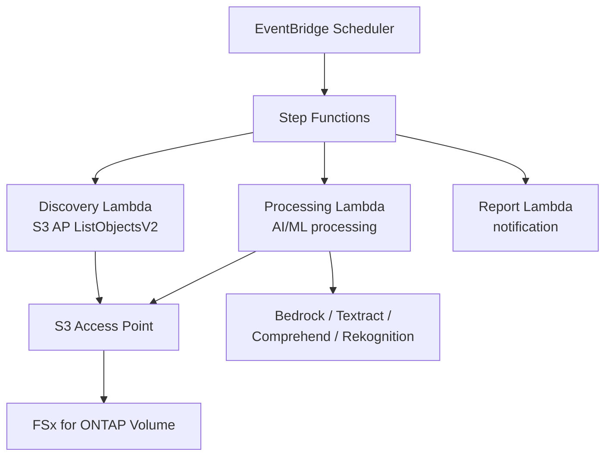

# FSx for ONTAP S3 Access Points — 无服务器模式

    

🌐 [日本語](README.md) | [English](README.en.md) | [한국어](README.ko.md) | [简体中文](README.zh-CN.md) | [繁體中文](README.zh-TW.md) | [Français](README.fr.md) | [Deutsch](README.de.md) | [Español](README.es.md)

---

> **42 个参考模式** — 通过 S3 Access Points 对 FSx for ONTAP 上的企业 NAS 数据进行无服务器处理。**无需复制数据**。
>
> 28 个行业用例 + 7 个 FlexCache/FlexClone + 2 个 GenAI + SAP + HA 监控 + 事件驱动 + 边缘分发 + File Portal UI

---

## 快速入门

| 我想要... | 指南 | 所需时间 |
|---|---|---|
| 无需 FSx 体验演示 | [Demo Mode Guide](docs/demo-mode-guide.md) | 5 分钟 |
| 通过 Web 门户浏览文件 | [File Portal UI (Amplify / Nextcloud)](docs/file-portal-amplify-gen2.en.md) | 10 分钟 |
| 将模式部署到 AWS | [Deployment Guide](docs/guides/deployment-guide.md) | 30 分钟 |
| 为我的工作负载选择合适的模式 | [Pattern Selection Guide](docs/pattern-selection-guide.md) | 15 分钟 |
| 估算成本 | [Cost Calculator](docs/cost-calculator.md) | 5 分钟 |
| 构建动手实验室环境 | [Hands-on Lab IaC](infrastructure/handson-lab/) | 60 分钟 |

---

<details>
<summary><strong>📂 所有模式（点击展开）</strong></summary>

### 行业用例 (UC1-UC28 + SAP)

| # | 目录 | 行业 | 摘要 |
|---|---|---|---|
| UC1 | [`legal-compliance/`](solutions/industry/legal-compliance/) | 法务 | NTFS ACL 审计与合规报告 |
| UC2 | [`financial-idp/`](solutions/industry/financial-idp/) | 金融 | 发票 OCR 与实体提取 |
| UC3 | [`manufacturing-analytics/`](solutions/industry/manufacturing-analytics/) | 制造 | IoT 传感器与质量检验 |
| UC4 | [`media-vfx/`](solutions/industry/media-vfx/) | 媒体 | VFX 渲染质量检查 |
| UC5 | [`healthcare-dicom/`](solutions/industry/healthcare-dicom/) | 医疗 | DICOM 匿名化 |
| UC6 | [`semiconductor-eda/`](solutions/industry/semiconductor-eda/) | 半导体 | GDS/OASIS 验证 |
| UC7 | [`genomics-pipeline/`](solutions/industry/genomics-pipeline/) | 基因组学 | FASTQ/VCF 质量检查 |
| UC8 | [`energy-seismic/`](solutions/industry/energy-seismic/) | 能源 | SEG-Y 地震数据分析 |
| UC9 | [`autonomous-driving/`](solutions/industry/autonomous-driving/) | 汽车 | 视频/LiDAR 预处理 |
| UC10 | [`construction-bim/`](solutions/industry/construction-bim/) | 建筑 | BIM 模型管理 |
| UC11 | [`retail-catalog/`](solutions/industry/retail-catalog/) | 零售 | 商品图片标签 |
| UC12 | [`logistics-ocr/`](solutions/industry/logistics-ocr/) | 物流 | 运输单据 OCR |
| UC13 | [`education-research/`](solutions/industry/education-research/) | 教育 | 论文分类 |
| UC14 | [`insurance-claims/`](solutions/industry/insurance-claims/) | 保险 | 损害评估 |
| UC15 | [`defense-satellite/`](solutions/industry/defense-satellite/) | 国防 | 卫星图像分析 |
| UC16 | [`government-archives/`](solutions/industry/government-archives/) | 政府 | 公共档案与信息公开 |
| UC17 | [`smart-city-geospatial/`](solutions/industry/smart-city-geospatial/) | 智慧城市 | 地理空间分析 |
| UC18 | [`telecom-network-analytics/`](solutions/industry/telecom-network-analytics/) | 电信 | CDR/网络日志分析 |
| UC19 | [`adtech-creative-management/`](solutions/industry/adtech-creative-management/) | 广告 | 创意资产管理 |
| UC20 | [`travel-document-processing/`](solutions/industry/travel-document-processing/) | 旅游 | 预订文档处理 |
| UC21 | [`agri-food-traceability/`](solutions/industry/agri-food-traceability/) | 农业 | 可追溯性 |
| UC22 | [`transportation-maintenance/`](solutions/industry/transportation-maintenance/) | 交通 | 设备检查 |
| UC23 | [`sustainability-esg-reporting/`](solutions/industry/sustainability-esg-reporting/) | ESG | 指标提取 |
| UC24 | [`nonprofit-grant-management/`](solutions/industry/nonprofit-grant-management/) | 非营利 | 拨款管理 |
| UC25 | [`utilities-asset-inspection/`](solutions/industry/utilities-asset-inspection/) | 公用事业 | 无人机/SCADA 分析 |
| UC26 | [`real-estate-portfolio/`](solutions/industry/real-estate-portfolio/) | 房地产 | 物业图像与合同 |
| UC27 | [`hr-document-screening/`](solutions/industry/hr-document-screening/) | HR | 简历筛选 |
| UC28 | [`chemical-sds-management/`](solutions/industry/chemical-sds-management/) | 化学 | SDS 与实验笔记 |
| SAP | [`sap/erp-adjacent/`](solutions/sap/erp-adjacent/) | SAP/ERP | IDoc 与 EDI 处理 |

### FlexCache / FlexClone (FC1-FC7)

| # | 目录 | 模式 |
|---|---|---|
| FC1 | [`flexcache/anycast-dr/`](solutions/flexcache/anycast-dr/) | AnyCast / DR 故障转移 |
| FC2 | [`flexcache/dynamic-render-workflow/`](solutions/flexcache/dynamic-render-workflow/) | 按作业动态 FlexCache |
| FC3 | [`flexcache/rag-enterprise-files/`](solutions/flexcache/rag-enterprise-files/) | 权限感知 RAG |
| FC4 | [`flexcache/automotive-cae/`](solutions/flexcache/automotive-cae/) | CAE 仿真分析 |
| FC5 | [`flexcache/life-sciences-research/`](solutions/flexcache/life-sciences-research/) | 研究数据分类 |
| FC6 | [`flexcache/gaming-build-pipeline/`](solutions/flexcache/gaming-build-pipeline/) | 游戏资产质量检查 |
| FC7 | [`flexcache/devops-cicd/`](solutions/flexcache/devops-cicd/) | FlexClone Dev/Test 与 CI/CD |

### GenAI / HA / 事件驱动 / 边缘 / File Portal

| 目录 | 摘要 |
|---|---|
| [`genai/kb-selfservice-curation/`](solutions/genai/kb-selfservice-curation/) | Bedrock KB 自助运维 |
| [`genai/quick-agentic-workspace/`](solutions/genai/quick-agentic-workspace/) | Agent 工作空间 |
| [`ha/lifekeeper-monitoring/`](solutions/ha/lifekeeper-monitoring/) | HA LifeKeeper AI 监控 |
| [`event-driven/fpolicy/`](solutions/event-driven/fpolicy/) | FPolicy 事件驱动管道 |
| [`edge/content-delivery/`](solutions/edge/content-delivery/) | CDN/边缘分发（厂商中立） |
| [`amplify-portal/`](solutions/amplify-portal/) | File Portal UI (Amplify Gen2) |
| [`nextcloud-test/`](solutions/nextcloud-test/) | File Portal UI (Nextcloud Docker) |

### 基础设施与共享模块

| 目录 | 摘要 |
|---|---|
| [`shared/`](shared/) | 通用 Python 模块 (S3ApHelper, OntapClient, Observability) |
| [`operations/`](operations/) | 6 个运维优化模式 |
| [`infrastructure/handson-lab/`](infrastructure/handson-lab/) | 动手实验室 IaC (VPC/AD/FSx/EC2/S3AP) |
| [`docs/`](docs/) | 设计指南与基准测试 (40+ 文档) |
| [`scripts/`](scripts/) | 部署、基准测试、工具 |
| [`.github/workflows/`](.github/workflows/) | CI/CD (lint → test → security → deploy) |

</details>

---

## 架构

```
EventBridge Scheduler（定时触发）
  └→ Step Functions State Machine
      ├→ Discovery Lambda：通过 S3 AP 列出文件
      ├→ Map State（并行）：使用 AI/ML 处理每个文件
      └→ Report Lambda：生成结果 → SNS 通知
```

这是所有模式共享的通用流程。AI/ML 服务（Bedrock、Textract、Comprehend、Rekognition）因用例而异。

<details>
<summary><strong>Mermaid 图（点击展开）</strong></summary>



</details>

<details>
<summary><strong>分类架构（FlexCache、GenAI、HA、事件驱动、边缘）</strong></summary>

各类别的详细架构图：
- [FlexCache / FlexClone](docs/industry-workload-mapping.md)
- [GenAI (Bedrock KB / Agentic)](solutions/genai/kb-selfservice-curation/docs/architecture.md)
- [HA LifeKeeper Monitoring](solutions/ha/lifekeeper-monitoring/README.md)
- [Event-Driven FPolicy](solutions/event-driven/fpolicy/README.md)
- [Edge / CDN](solutions/edge/content-delivery/docs/architecture.md)
- [File Portal (Amplify Gen2)](solutions/amplify-portal/README.md)

</details>

---

## 关键 S3 Access Point 约束

| 约束 | 解决方案 |
|---|---|
| 不支持 S3 Event Notifications | EventBridge Scheduler 轮询或 FPolicy |
| Presigned URL 非官方支持 | 实际可用但不推荐用于生产 |
| 5GB 上传限制 | Multipart Upload |
| 无法将 Athena 结果写入 S3AP | 输出到标准 S3 存储桶 |
| 仅支持 SSE-FSX | 使用卷级 KMS 加密 |

详情：[S3AP Compatibility Notes](docs/s3ap-compatibility-notes.en.md) | [Compatibility Matrix（AWS 确认）](https://github.com/Yoshiki0705/fsxn-lakehouse-integrations/blob/main/docs/en/compatibility-matrix.md)

---

<details>
<summary><strong>📚 相关文章与仓库</strong></summary>

### 文章系列

| 主题 | 日语 | 英语 |
|---|---|---|
| 42 模式介绍 | [Hatena](https://hakobiya.hatenablog.com/entry/fsxn-s3ap-serverless-part1-introduction) | [dev.to](https://dev.to/aws-builders/industry-specific-serverless-automation-patterns-with-fsx-for-ontap-s3-access-points-3e0a) |
| 生产架构 | [Hatena](https://hakobiya.hatenablog.com/entry/fsxn-s3ap-serverless-part2-production-architecture) | — |
| 运维基线 | [Hatena](https://hakobiya.hatenablog.com/entry/fsxn-s3ap-serverless-part3-operational-baseline) | [dev.to](https://dev.to/aws-builders/production-rollout-vpc-endpoint-auto-detection-and-the-cdk-no-go-fsx-for-ontap-s3-access-3lni) |
| FPolicy 事件驱动 | [Hatena](https://hakobiya.hatenablog.com/entry/fsxn-s3ap-serverless-part4-event-driven-fpolicy) | [dev.to](https://dev.to/aws-builders/fpolicy-event-driven-pipeline-multi-account-stacksets-and-cost-optimization-fsx-for-ontap-s3-5bd6) |
| 28 个行业模式 | [Hatena](https://hakobiya.hatenablog.com/entry/fsxn-s3ap-serverless-part5-field-ready-28-patterns) | [dev.to](https://dev.to/aws-builders/from-serverless-patterns-to-field-ready-reference-architecture-fsx-for-ontap-s3-access-points-dhj) |
| GenAI 集成 | [Hatena](https://hakobiya.hatenablog.com/entry/fsxn-s3ap-serverless-part6-genai-42-patterns) | — |

### 相关仓库

| 仓库 | 摘要 |
|---|---|
| [Permission-aware-RAG-FSxN-CDK](https://github.com/Yoshiki0705/Permission-aware-RAG-FSxN-CDK-github) | 权限感知 RAG 聊天机器人 (CDK + Next.js + ECS) |
| [fsxn-lakehouse-integrations](https://github.com/Yoshiki0705/fsxn-lakehouse-integrations) | 湖仓集成 (Databricks, Snowflake, Athena, Glue, EMR) |
| [vmware-migration-ec2-ontap](https://github.com/Yoshiki0705/vmware-migration-ec2-ontap) | VMware → EC2 + FSx for ONTAP 迁移 |

</details>

<details>
<summary><strong>🔧 开发者指南（测试与贡献）</strong></summary>

### 测试

```bash
pytest shared/tests/ -v                    # Unit tests
ruff check . && ruff format --check .      # Python linter
cfn-lint solutions/industry/*/template.yaml # CloudFormation validation
```

### 技术栈

Python 3.12 | CloudFormation + SAM | Lambda (ARM64) | Step Functions | EventBridge | Bedrock / Textract / Comprehend / Rekognition | Secrets Manager | Athena + Glue

### 贡献

欢迎提交 Issue 和 Pull Request。请参阅 [CONTRIBUTING.md](CONTRIBUTING.md)。

</details>

---

## 许可证

MIT — [LICENSE](LICENSE)

---

🌐 [日本語](README.md) | [English](README.en.md) | [한국어](README.ko.md) | [简体中文](README.zh-CN.md) | [繁體中文](README.zh-TW.md) | [Français](README.fr.md) | [Deutsch](README.de.md) | [Español](README.es.md)
