# FSx for ONTAP S3 Access Points Serverless Patterns

🌐 **Language / 言語**: [日本語](README.md) | [English](README.en.md) | [한국어](README.ko.md) | [简体中文](README.zh-CN.md) | [繁體中文](README.zh-TW.md) | [Français](README.fr.md) | [Deutsch](README.de.md) | [Español](README.es.md)

基於 Amazon FSx for NetApp ONTAP S3 Access Points 的產業專屬無伺服器自動化模式集合。

> **本儲存庫的定位**: 這是一個「用於學習設計決策的參考實作」。部分使用案例已在 AWS 環境中完成 E2E 驗證，其他使用案例也已完成 CloudFormation 部署、共用 Discovery Lambda 及關鍵元件的功能驗證。本儲存庫以從 PoC 到正式環境的漸進式應用為目標，透過具體程式碼展示成本最佳化、安全性和錯誤處理的設計決策。

## 相關文章

本儲存庫是以下文章中所述架構的實作範例：

- **FSx for ONTAP S3 Access Points as a Serverless Automation Boundary — AI Data Pipelines, Volume-Level SnapMirror DR, and Capacity Guardrails**
  https://dev.to/yoshikifujiwara/fsx-for-ontap-s3-access-points-as-a-serverless-automation-boundary-ai-data-pipelines-ili

文章解釋架構設計思想和權衡取捨，本儲存庫提供具體的、可重複使用的實作模式。

## 概述

本儲存庫提供 **5 種產業專屬模式**，透過 **S3 Access Points** 對儲存在 FSx for NetApp ONTAP 上的企業資料進行無伺服器處理。

> 以下將 FSx for ONTAP S3 Access Points 簡稱為 **S3 AP**。

每個使用案例都是獨立的 CloudFormation 範本，共用模組（ONTAP REST API 用戶端、FSx 輔助工具、S3 AP 輔助工具）位於 `shared/` 目錄中供重複使用。

### 主要特性

- **輪詢架構**: 由於 S3 AP 不支援 `GetBucketNotificationConfiguration`，採用 EventBridge Scheduler + Step Functions 定期執行
- **共用模組分離**: OntapClient / FsxHelper / S3ApHelper 在所有使用案例中重複使用
- **CloudFormation / SAM Transform 架構**: 每個使用案例都是獨立的 CloudFormation 範本（使用 SAM Transform）
- **安全優先**: 預設啟用 TLS 驗證、最小權限 IAM、KMS 加密
- **成本最佳化**: 高成本常駐資源（Interface VPC Endpoints 等）為選用項目

## 架構

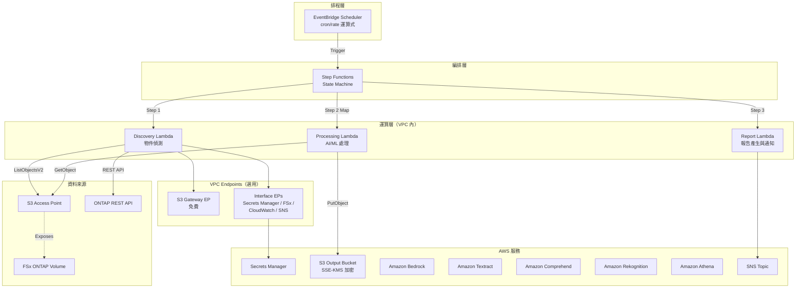

> 圖示為面向正式環境的 VPC 內 Lambda 配置。對於 PoC / 展示用途，如果 S3 AP 的 network origin 為 `internet`，也可以選擇 VPC 外 Lambda 配置。詳情請參閱下方「Lambda 部署選擇指南」。

### 工作流程概述

```
EventBridge Scheduler (定期執行)
  └─→ Step Functions State Machine
       ├─→ Discovery Lambda: 從 S3 AP 取得物件清單 → 產生 Manifest
       ├─→ Map State (平行處理): 使用 AI/ML 服務處理各物件
       └─→ Report/Notification: 產生結果報告 → SNS 通知
```

## 使用案例列表

### Phase 1 (UC1–UC5)

| # | 目錄 | 產業 | 模式 | 使用的 AI/ML 服務 | ap-northeast-1 驗證狀態 |
|---|------|------|------|-----------------|----------------------|
| UC1 | `legal-compliance/` | 法務合規 | 檔案伺服器稽核與資料治理 | Athena, Bedrock | ✅ E2E 成功 |
| UC2 | `financial-idp/` | 金融保險 | 合約/發票自動處理 (IDP) | Textract ⚠️, Comprehend, Bedrock | ⚠️ 東京不支援（使用對應區域） |
| UC3 | `manufacturing-analytics/` | 製造業 | IoT 感測器日誌與品質檢測影像分析 | Athena, Rekognition | ✅ E2E 成功 |
| UC4 | `media-vfx/` | 媒體 | VFX 算繪管線 | Rekognition, Deadline Cloud | ⚠️ Deadline Cloud 需設定 |
| UC5 | `healthcare-dicom/` | 醫療 | DICOM 影像自動分類與去識別化 | Rekognition, Comprehend Medical ⚠️ | ⚠️ 東京不支援（使用對應區域） |

### Phase 2 (UC6–UC14)

| # | 目錄 | 產業 | 模式 | 使用的 AI/ML 服務 | ap-northeast-1 驗證狀態 |
|---|------|------|------|-----------------|----------------------|
| UC6 | `semiconductor-eda/` | 半導體 / EDA | GDS/OASIS 驗證・中繼資料擷取・DRC 彙總 | Athena, Bedrock | ✅ 測試通過 |
| UC7 | `genomics-pipeline/` | 基因體學 | FASTQ/VCF 品質檢查・變異呼叫彙總 | Athena, Bedrock, Comprehend Medical ⚠️ | ⚠️ Cross-Region (us-east-1) |
| UC8 | `energy-seismic/` | 能源 | SEG-Y 中繼資料擷取・井日誌異常偵測 | Athena, Bedrock, Rekognition | ✅ 測試通過 |
| UC9 | `autonomous-driving/` | 自動駕駛 / ADAS | 影片/LiDAR 前處理・品質檢查・標註 | Rekognition, Bedrock, SageMaker | ✅ 測試通過 |
| UC10 | `construction-bim/` | 營建 / AEC | BIM 版本管理・圖面 OCR・安全合規 | Textract ⚠️, Bedrock, Rekognition | ⚠️ Cross-Region (us-east-1) |
| UC11 | `retail-catalog/` | 零售 / 電商 | 商品影像標籤・目錄中繼資料生成 | Rekognition, Bedrock | ✅ 測試通過 |
| UC12 | `logistics-ocr/` | 物流 | 運單 OCR・倉庫庫存影像分析 | Textract ⚠️, Rekognition, Bedrock | ⚠️ Cross-Region (us-east-1) |
| UC13 | `education-research/` | 教育 / 研究 | 論文 PDF 分類・引用網路分析 | Textract ⚠️, Comprehend, Bedrock | ⚠️ Cross-Region (us-east-1) |
| UC14 | `insurance-claims/` | 保險 | 事故照片損害評估・估價單 OCR・理賠報告 | Rekognition, Textract ⚠️, Bedrock | ⚠️ Cross-Region (us-east-1) |

> **區域限制**: Amazon Textract 和 Amazon Comprehend Medical 在 ap-northeast-1（東京）不可用。Phase 2 UC（UC7、UC10、UC12、UC13、UC14）透過 Cross_Region_Client 將 API 呼叫路由至 us-east-1。Rekognition、Comprehend、Bedrock、Athena 在 ap-northeast-1 可用。
> 
> 參考: [Textract 支援區域](https://docs.aws.amazon.com/general/latest/gr/textract.html) | [Comprehend Medical 支援區域](https://docs.aws.amazon.com/general/latest/gr/comprehend-med.html)

### 螢幕截圖

> 以下為驗證環境中的截圖範例。環境特定資訊（帳戶 ID 等）已進行遮罩處理。

#### 全部 5 個 UC 的 Step Functions 部署與執行確認

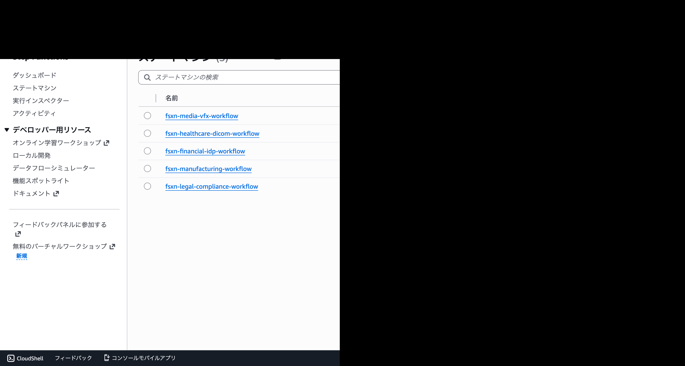

> UC1 和 UC3 已完成完整的 E2E 驗證，UC2、UC4 和 UC5 已完成 CloudFormation 部署和主要元件的功能驗證。使用有區域限制的 AI/ML 服務（Textract、Comprehend Medical）時，需要跨區域呼叫至支援區域，請確認資料駐留和合規要求。

#### Phase 2: 全部 9 個 UC CloudFormation 部署・Step Functions 執行成功

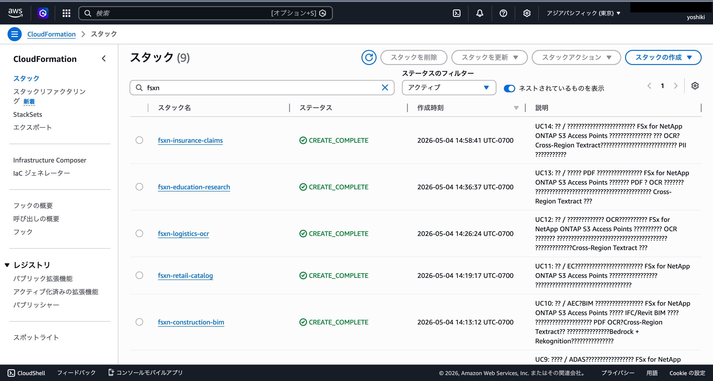

> 全部 9 個堆疊（UC6–UC14）達到 CREATE_COMPLETE / UPDATE_COMPLETE。共 205 個資源。

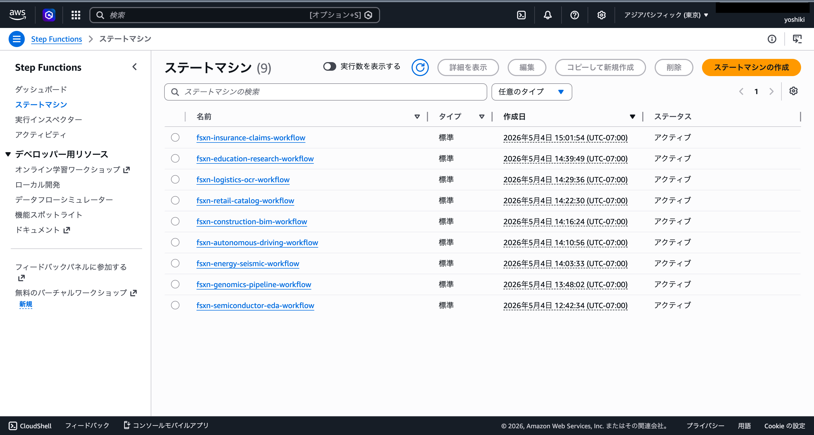

> 全部 9 個工作流程已啟用。投入測試資料後 E2E 執行全部 SUCCEEDED。

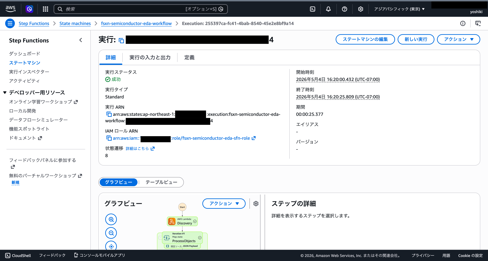

> UC6（半導體 EDA）Step Functions 執行詳情。Discovery → ProcessObjects (Map) → DrcAggregation → ReportGeneration 全部狀態成功。


> 全部 9 個 UC 的 EventBridge Scheduler 排程（rate(1 hour)）已啟用。

#### AI/ML 服務畫面（Phase 1）

##### Amazon Bedrock — 模型目錄

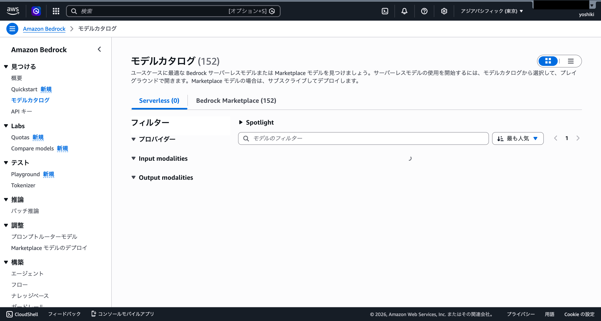

##### Amazon Rekognition — 標籤偵測

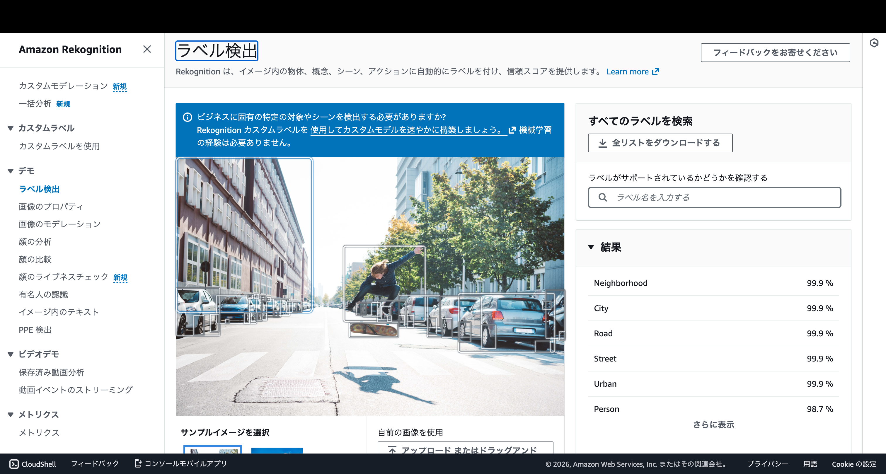

##### Amazon Comprehend — 實體偵測

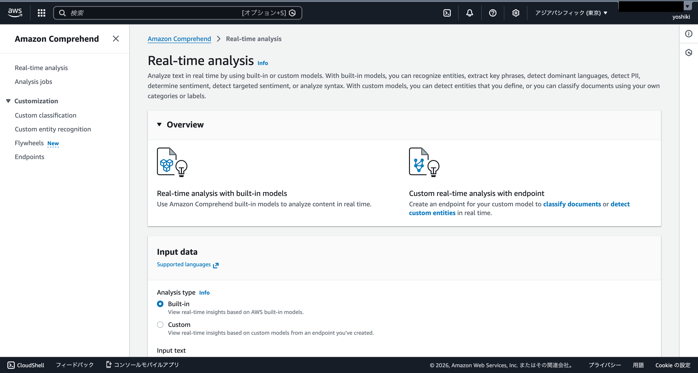

#### AI/ML 服務畫面（Phase 2）

##### Amazon Bedrock — 模型目錄（UC6: 報告產生）

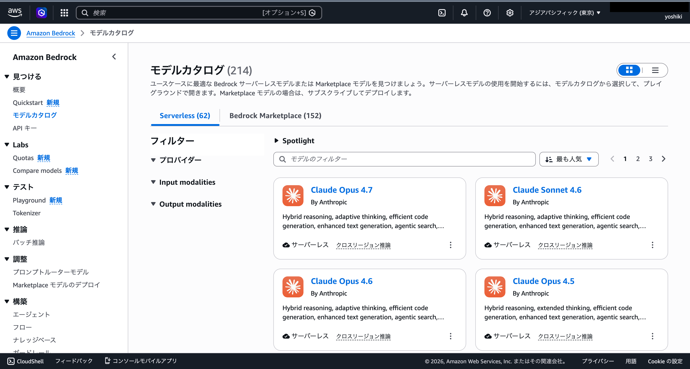

> UC6（半導體 EDA）中使用 Nova Lite 模型產生 DRC 報告。

##### Amazon Athena — 查詢執行歷史（UC6: 中繼資料彙總）

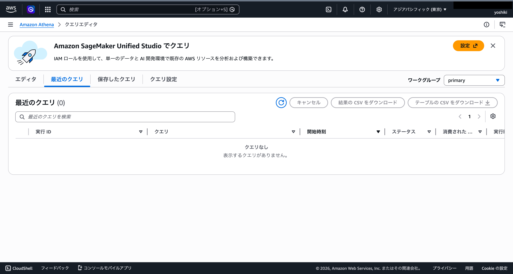

> UC6 的 Step Functions 工作流程中執行 Athena 查詢（cell_count, bbox, naming, invalid）。

##### Amazon Rekognition — 標籤偵測（UC11: 商品圖片標記）

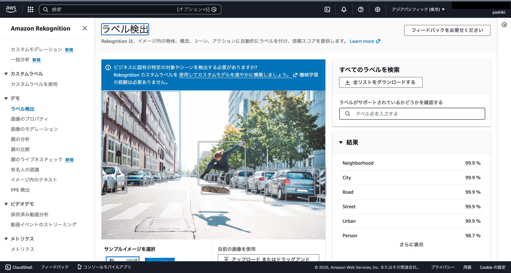

> UC11（零售目錄）從商品圖片中偵測 15 個標籤（Lighting 98.5%, Light 96.0%, Purple 92.0% 等）。

##### Amazon Textract — 文件 OCR（UC12: 配送單據讀取）

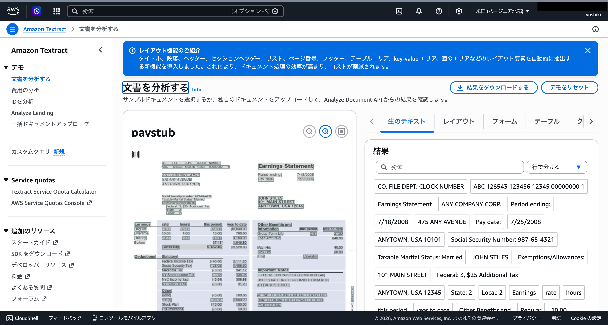

> UC12（物流 OCR）從配送單據 PDF 中擷取文字。透過 Cross-Region（us-east-1）執行。

##### Amazon Comprehend Medical — 醫療實體偵測（UC7: 基因體分析）


> UC7（基因體管線）中使用 DetectEntitiesV2 API 從 VCF 分析結果中擷取基因名（GC）。透過 Cross-Region（us-east-1）執行。

##### Lambda 函式清單（Phase 2）

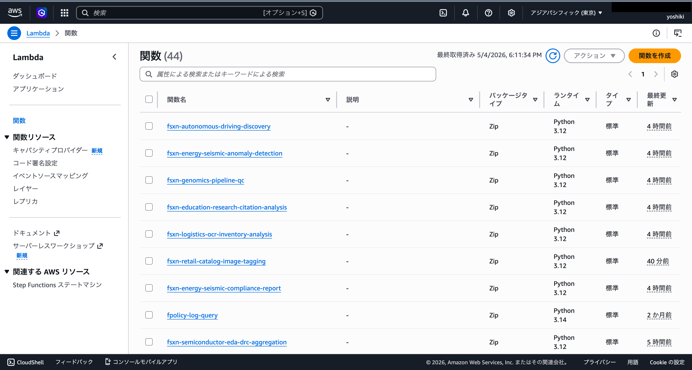

> Phase 2 的全部 Lambda 函式（Discovery, Processing, Report 等）已成功部署。

## 技術堆疊

| 層級 | 技術 |
|------|------|
| 語言 | Python 3.12 |
| IaC | CloudFormation (YAML) + SAM Transform |
| 運算 | AWS Lambda（正式: VPC 內 / PoC: VPC 外也可選擇） |
| 編排 | AWS Step Functions |
| 排程 | Amazon EventBridge Scheduler |
| 儲存 | FSx for ONTAP (S3 AP) + S3 輸出儲存貯體 (SSE-KMS) |
| 通知 | Amazon SNS |
| 分析 | Amazon Athena + AWS Glue Data Catalog |
| AI/ML | Amazon Bedrock, Textract, Comprehend, Rekognition |
| 安全 | Secrets Manager, KMS, IAM 最小權限 |
| 測試 | pytest + Hypothesis (PBT), moto, cfn-lint, ruff |

## 先決條件

- **AWS 帳戶**: 有效的 AWS 帳戶和適當的 IAM 權限
- **FSx for NetApp ONTAP**: 已部署的檔案系統
  - ONTAP 版本: 支援 S3 Access Points 的版本（已在 9.17.1P4D3 上驗證）
  - 已關聯 S3 Access Point 的 FSx for ONTAP 磁碟區（network origin 依使用案例選擇。使用 Athena / Glue 時建議 `internet`）
- **網路**: VPC、私有子網路、路由表
- **Secrets Manager**: 預先註冊 ONTAP REST API 憑證（格式: `{"username":"fsxadmin","password":"..."}`）
- **S3 儲存貯體**: 預先建立用於 Lambda 部署套件的儲存貯體（例: `fsxn-s3ap-deploy-<account-id>`）
- **Python 3.12+**: 本機開發和測試用
- **AWS CLI v2**: 部署和管理用

### 準備命令

```bash
# 1. 建立部署用 S3 儲存貯體
ACCOUNT_ID=$(aws sts get-caller-identity --query Account --output text)
aws s3 mb "s3://fsxn-s3ap-deploy-${ACCOUNT_ID}" --region $AWS_DEFAULT_REGION

# 2. 將 ONTAP 憑證註冊到 Secrets Manager
aws secretsmanager create-secret \
  --name fsxn-ontap-credentials \
  --secret-string '{"username":"fsxadmin","password":"<your-ontap-password>"}' \
  --region $AWS_DEFAULT_REGION

# 3. 檢查現有 S3 Gateway Endpoint（防止重複建立）
aws ec2 describe-vpc-endpoints \
  --filters "Name=vpc-id,Values=<your-vpc-id>" "Name=service-name,Values=com.amazonaws.${AWS_DEFAULT_REGION}.s3" \
  --query 'VpcEndpoints[*].{Id:VpcEndpointId,State:State}' \
  --output table
# → 如果有結果，使用 EnableS3GatewayEndpoint=false 部署
```

### Lambda 部署選擇指南

| 用途 | 建議部署 | 原因 |
|------|---------|------|
| 展示 / PoC | VPC 外 Lambda | 無需 VPC Endpoint，低成本、設定簡單 |
| 正式環境 / 封閉網路需求 | VPC 內 Lambda | 可透過 PrivateLink 使用 Secrets Manager / FSx / SNS 等 |
| 使用 Athena / Glue 的 UC | S3 AP network origin: `internet` | 需要 AWS 受管服務的存取 |

### 從 VPC 內 Lambda 存取 S3 AP 的注意事項

> **UC1 部署驗證（2026-05-03）中確認的重要事項**

- **S3 Gateway Endpoint 的路由表關聯是必須的**: 如果未在 `RouteTableIds` 中指定私有子網路的路由表 ID，VPC 內 Lambda 對 S3 / S3 AP 的存取將逾時
- **確認 VPC DNS 解析**: 確保 VPC 的 `enableDnsSupport` / `enableDnsHostnames` 已啟用
- **PoC / 展示環境建議在 VPC 外執行 Lambda**: 如果 S3 AP 的 network origin 為 `internet`，VPC 外 Lambda 可以正常存取。無需 VPC Endpoint，可降低成本並簡化設定
- 詳情請參閱[疑難排解指南](docs/guides/troubleshooting-guide.md#6-lambda-vpc-内実行時の-s3-ap-タイムアウト)

### 所需 AWS 服務配額

| 服務 | 配額 | 建議值 |
|------|------|--------|
| Lambda 並行執行數 | ConcurrentExecutions | 100 以上 |
| Step Functions 執行數 | StartExecution/秒 | 預設值 (25) |
| S3 Access Point | 每帳戶 AP 數 | 預設值 (10,000) |

## 快速開始

### 1. 複製儲存庫

```bash
git clone https://github.com/Yoshiki0705/FSx-for-ONTAP-S3AccessPoints-Serverless-Patterns.git
cd FSx-for-ONTAP-S3AccessPoints-Serverless-Patterns
```

### 2. 安裝相依性

```bash
pip install -r requirements.txt
pip install -r requirements-dev.txt
```

### 3. 執行測試

```bash
# 單元測試（含覆蓋率）
pytest shared/tests/ --cov=shared --cov-report=term-missing -v

# 屬性基測試
pytest shared/tests/test_properties.py -v

# 程式碼檢查
ruff check .
ruff format --check .
```

### 4. 部署使用案例（範例: UC1 法務合規）

> ⚠️ **關於對現有環境影響的重要事項**
>
> 部署前請確認以下內容:
>
> | 參數 | 對現有環境的影響 | 確認方法 |
> |------|----------------|---------|
> | `VpcId` / `PrivateSubnetIds` | 將在指定的 VPC/子網路中建立 Lambda ENI | `aws ec2 describe-network-interfaces --filters Name=group-id,Values=<sg-id>` |
> | `EnableS3GatewayEndpoint=true` | 將向 VPC 新增 S3 Gateway Endpoint。**如果同一 VPC 中已存在 S3 Gateway Endpoint，請設定為 `false`** | `aws ec2 describe-vpc-endpoints --filters Name=vpc-id,Values=<vpc-id>` |
> | `PrivateRouteTableIds` | S3 Gateway Endpoint 將關聯到路由表。不影響現有路由 | `aws ec2 describe-route-tables --route-table-ids <rtb-id>` |
> | `ScheduleExpression` | EventBridge Scheduler 將定期執行 Step Functions。**可在部署後停用排程以避免不必要的執行** | AWS 主控台 → EventBridge → Schedules |
> | `NotificationEmail` | 將傳送 SNS 訂閱確認郵件 | 檢查郵件收件匣 |
>
> **堆疊刪除注意事項**:
> - 如果 S3 儲存貯體（Athena Results）中仍有物件，刪除將失敗。請先使用 `aws s3 rm s3://<bucket> --recursive` 清空
> - 啟用版本控制的儲存貯體需要使用 `aws s3api delete-objects` 刪除所有版本
> - VPC Endpoints 刪除可能需要 5-15 分鐘
> - Lambda ENI 釋放可能需要時間，導致 Security Group 刪除失敗。請等待幾分鐘後重試

```bash
# 設定區域（透過環境變數管理）
export AWS_DEFAULT_REGION=us-east-1  # 建議支援所有服務的區域

# Lambda 打包
./scripts/deploy_uc.sh legal-compliance package

# CloudFormation 部署
aws cloudformation create-stack \
  --stack-name fsxn-legal-compliance \
  --template-body file://legal-compliance/template-deploy.yaml \
  --capabilities CAPABILITY_NAMED_IAM \
  --parameters \
    ParameterKey=DeployBucket,ParameterValue=<your-deploy-bucket> \
    ParameterKey=S3AccessPointAlias,ParameterValue=<your-volume-ext-s3alias> \
    ParameterKey=S3AccessPointOutputAlias,ParameterValue=<your-output-volume-ext-s3alias> \
    ParameterKey=OntapSecretName,ParameterValue=<your-ontap-secret-name> \
    ParameterKey=OntapManagementIp,ParameterValue=<your-ontap-management-ip> \
    ParameterKey=SvmUuid,ParameterValue=<your-svm-uuid> \
    ParameterKey=VolumeUuid,ParameterValue=<your-volume-uuid> \
    ParameterKey=VpcId,ParameterValue=<your-vpc-id> \
    'ParameterKey=PrivateSubnetIds,ParameterValue=<subnet-1>,<subnet-2>' \
    'ParameterKey=PrivateRouteTableIds,ParameterValue=<rtb-1>,<rtb-2>' \
    ParameterKey=NotificationEmail,ParameterValue=<your-email@example.com> \
    ParameterKey=EnableVpcEndpoints,ParameterValue=true \
    ParameterKey=EnableS3GatewayEndpoint,ParameterValue=true
```

> **注意**: 請將 `<...>` 佔位符替換為實際環境值。
>
> **關於 `EnableVpcEndpoints`**: Quick Start 中指定 `true` 以確保 VPC 內 Lambda 到 Secrets Manager / CloudWatch / SNS 的連通性。如果已有 Interface VPC Endpoints 或 NAT Gateway，可以指定 `false` 以降低成本。
> 
> **區域選擇**: 建議使用所有 AI/ML 服務均可用的 `us-east-1` 或 `us-west-2`。`ap-northeast-1` 不支援 Textract 和 Comprehend Medical（可透過跨區域呼叫解決）。詳情請參閱[區域相容性矩陣](docs/region-compatibility.md)。

### 已驗證環境

| 項目 | 值 |
|------|-----|
| AWS 區域 | ap-northeast-1 (東京) |
| FSx ONTAP 版本 | ONTAP 9.17.1P4D3 |
| FSx 配置 | SINGLE_AZ_1 |
| Python | 3.12 |
| 部署方式 | CloudFormation（使用 SAM Transform） |

已完成全部 5 個使用案例的 CloudFormation 堆疊部署和 Discovery Lambda 的功能驗證。
詳情請參閱[驗證結果記錄](docs/verification-results.md)。

## 成本結構摘要

### 各環境成本估算

| 環境 | 固定費/月 | 變動費/月 | 合計/月 |
|------|----------|----------|--------|
| 展示/PoC | ~$0 | ~$1〜$3 | **~$1〜$3** |
| 正式環境（1 UC） | ~$29 | ~$1〜$3 | **~$30〜$32** |
| 正式環境（全部 5 UC） | ~$29 | ~$5〜$15 | **~$34〜$44** |

### 成本分類

- **按請求計費（按量付費）**: Lambda, Step Functions, S3 API, Textract, Comprehend, Rekognition, Bedrock, Athena — 不使用則為 $0
- **常駐運行（固定費）**: Interface VPC Endpoints (~$28.80/月) — **選用（opt-in）**

> Quick Start 為優先確保 VPC 內 Lambda 的連通性而指定 `EnableVpcEndpoints=true`。如果優先考慮低成本 PoC，請考慮使用 VPC 外 Lambda 配置或利用現有的 NAT / Interface VPC Endpoints。

> 詳細成本分析請參閱 [docs/cost-analysis.md](docs/cost-analysis.md)。

### 選用資源

高成本常駐資源透過 CloudFormation 參數設為選用。

| 資源 | 參數 | 預設值 | 月固定費 | 說明 |
|------|------|--------|---------|------|
| Interface VPC Endpoints | `EnableVpcEndpoints` | `false` | ~$28.80 | 用於 Secrets Manager、FSx、CloudWatch、SNS。正式環境建議 `true`。Quick Start 中為確保連通性指定 `true` |
| CloudWatch Alarms | `EnableCloudWatchAlarms` | `false` | ~$0.10/警示 | 監控 Step Functions 失敗率、Lambda 錯誤率 |

> **S3 Gateway VPC Endpoint** 無額外按時計費，因此在 VPC 內 Lambda 存取 S3 AP 的配置中建議啟用。但如果已存在 S3 Gateway Endpoint 或 PoC / 展示用途中 Lambda 部署在 VPC 外，請指定 `EnableS3GatewayEndpoint=false`。S3 API 請求、資料傳輸及各 AWS 服務使用費照常產生。

## 安全與授權模型

本方案組合了**多個授權層**，各層承擔不同角色:

| 層級 | 角色 | 控制範圍 |
|------|------|---------|
| **IAM** | AWS 服務和 S3 Access Points 的存取控制 | Lambda 執行角色、S3 AP 原則 |
| **S3 Access Point** | 透過與 S3 AP 關聯的檔案系統使用者定義存取邊界 | S3 AP 原則、network origin、關聯使用者 |
| **ONTAP 檔案系統** | 強制執行檔案層級權限 | UNIX 權限 / NTFS ACL |
| **ONTAP REST API** | 僅公開中繼資料和控制平面作業 | Secrets Manager 驗證 + TLS |

**重要設計注意事項**:

- S3 API 不公開檔案層級 ACL。檔案權限資訊**只能透過 ONTAP REST API** 取得（UC1 的 ACL Collection 使用此模式）
- 透過 S3 AP 的存取在 IAM / S3 AP 原則許可後，以與 S3 AP 關聯的 UNIX / Windows 檔案系統使用者身分在 ONTAP 側進行授權
- ONTAP REST API 憑證在 Secrets Manager 中管理，不儲存在 Lambda 環境變數中

## 相容性矩陣

| 項目 | 值 / 驗證內容 |
|------|-------------|
| ONTAP 版本 | 已在 9.17.1P4D3 上驗證（需要支援 S3 Access Points 的版本） |
| 已驗證區域 | ap-northeast-1（東京） |
| 建議區域 | us-east-1 / us-west-2（使用全部 AI/ML 服務時） |
| Python 版本 | 3.12+ |
| CloudFormation Transform | AWS::Serverless-2016-10-31 |
| 已驗證磁碟區 security style | UNIX, NTFS |

### FSx ONTAP S3 Access Points 支援的 API

透過 S3 AP 可用的 API 子集:

| API | 支援 |
|-----|------|
| ListObjectsV2 | ✅ |
| GetObject | ✅ |
| PutObject | ✅ (最大 5 GB) |
| HeadObject | ✅ |
| DeleteObject | ✅ |
| DeleteObjects | ✅ |
| CopyObject | ✅ (同一 AP 內、同一區域) |
| GetObjectAttributes | ✅ |
| GetObjectTagging / PutObjectTagging | ✅ |
| CreateMultipartUpload | ✅ |
| UploadPart / UploadPartCopy | ✅ |
| CompleteMultipartUpload | ✅ |
| AbortMultipartUpload | ✅ |
| ListParts / ListMultipartUploads | ✅ |
| HeadBucket / GetBucketLocation | ✅ |
| GetBucketNotificationConfiguration | ❌（不支援 → 輪詢設計的原因） |
| Presign | ❌ |

### S3 Access Point 網路來源約束

| 網路來源 | Lambda (VPC 外) | Lambda (VPC 內) | Athena / Glue | 建議 UC |
|---------|----------------|----------------|--------------|---------|
| **internet** | ✅ | ✅ (透過 S3 Gateway EP) | ✅ | UC1, UC3 (使用 Athena) |
| **VPC** | ❌ | ✅ (S3 Gateway EP 必須) | ❌ | UC2, UC4, UC5 (不使用 Athena) |

> **重要**: Athena / Glue 從 AWS 受管基礎設施存取，因此無法存取 VPC origin 的 S3 AP。UC1（法務）和 UC3（製造業）使用 Athena，因此 S3 AP 必須以 **internet** network origin 建立。

### S3 AP 限制事項

- **PutObject 最大大小**: 5 GB。multipart upload API 受支援，但 5 GB 以上的上傳可行性請按使用案例逐一驗證。
- **加密**: 僅支援 SSE-FSX（FSx 透明處理，無需指定 ServerSideEncryption 參數）
- **ACL**: 僅支援 `bucket-owner-full-control`
- **不支援的功能**: Object Versioning, Object Lock, Object Lifecycle, Static Website Hosting, Requester Pays, Presigned URL

## 文件

詳細指南和螢幕截圖儲存在 `docs/` 目錄中。

| 文件 | 說明 |
|------|------|
| [docs/guides/deployment-guide.md](docs/guides/deployment-guide.md) | 部署指南（先決條件確認 → 參數準備 → 部署 → 功能驗證） |
| [docs/guides/operations-guide.md](docs/guides/operations-guide.md) | 維運指南（排程變更、手動執行、日誌確認、警示回應） |
| [docs/guides/troubleshooting-guide.md](docs/guides/troubleshooting-guide.md) | 疑難排解（AccessDenied、VPC Endpoint、ONTAP 逾時、Athena） |
| [docs/cost-analysis.md](docs/cost-analysis.md) | 成本結構分析 |
| [docs/references.md](docs/references.md) | 參考連結集 |
| [docs/extension-patterns.md](docs/extension-patterns.md) | 擴充模式指南 |
| [docs/region-compatibility.md](docs/region-compatibility.md) | AWS 區域 AI/ML 服務支援狀況 |
| [docs/article-draft.md](docs/article-draft.md) | dev.to 文章原始草稿（已發佈版本請參閱 README 頂部的相關文章） |
| [docs/verification-results.md](docs/verification-results.md) | AWS 環境驗證結果記錄 |
| [docs/screenshots/](docs/screenshots/README.md) | AWS 主控台螢幕截圖（已遮罩） |

## 目錄結構

```
fsxn-s3ap-serverless-patterns/
├── README.md                          # 本檔案
├── LICENSE                            # MIT License
├── requirements.txt                   # 正式環境相依性
├── requirements-dev.txt               # 開發相依性
├── shared/                            # 共用模組
│   ├── __init__.py
│   ├── ontap_client.py               # ONTAP REST API 用戶端
│   ├── fsx_helper.py                 # AWS FSx API 輔助工具
│   ├── s3ap_helper.py                # S3 Access Point 輔助工具
│   ├── exceptions.py                 # 共用例外與錯誤處理器
│   ├── discovery_handler.py          # 共用 Discovery Lambda 範本
│   ├── cfn/                          # CloudFormation 程式碼片段
│   └── tests/                        # 單元測試與屬性測試
├── legal-compliance/                  # UC1: 法務合規
├── financial-idp/                     # UC2: 金融保險
├── manufacturing-analytics/           # UC3: 製造業
├── media-vfx/                         # UC4: 媒體
├── healthcare-dicom/                  # UC5: 醫療
├── scripts/                           # 驗證與部署指令碼
│   ├── deploy_uc.sh                  # UC 部署指令碼（通用）
│   ├── verify_shared_modules.py      # 共用模組 AWS 環境驗證
│   └── verify_cfn_templates.sh       # CloudFormation 範本驗證
├── .github/workflows/                 # CI/CD (lint, test)
└── docs/                              # 文件
    ├── guides/                        # 操作指南
    │   ├── deployment-guide.md       # 部署指南
    │   ├── operations-guide.md       # 維運指南
    │   └── troubleshooting-guide.md  # 疑難排解
    ├── screenshots/                   # AWS 主控台螢幕截圖
    ├── cost-analysis.md               # 成本結構分析
    ├── references.md                  # 參考連結集
    ├── extension-patterns.md          # 擴充模式指南
    ├── region-compatibility.md        # 區域相容性矩陣
    ├── verification-results.md        # 驗證結果記錄
    └── article-draft.md               # dev.to 文章原始草稿
```

## 共用模組 (shared/)

| 模組 | 說明 |
|------|------|
| `ontap_client.py` | ONTAP REST API 用戶端（Secrets Manager 驗證、urllib3、TLS、重試） |
| `fsx_helper.py` | AWS FSx API + CloudWatch 指標取得 |
| `s3ap_helper.py` | S3 Access Point 輔助工具（分頁、後綴篩選） |
| `exceptions.py` | 共用例外類別、`lambda_error_handler` 裝飾器 |
| `discovery_handler.py` | 共用 Discovery Lambda 範本（Manifest 產生） |

## 開發

### 執行測試

```bash
# 全部測試
pytest shared/tests/ -v

# 含覆蓋率
pytest shared/tests/ --cov=shared --cov-report=term-missing --cov-fail-under=80 -v

# 僅屬性基測試
pytest shared/tests/test_properties.py -v
```

### 程式碼檢查

```bash
# Python 程式碼檢查
ruff check .
ruff format --check .

# CloudFormation 範本驗證
cfn-lint */template.yaml */template-deploy.yaml
```

## 何時使用 / 何時不使用本模式集

### 適用情境

- 希望在不移動 FSx for ONTAP 上現有 NAS 資料的情況下進行無伺服器處理
- 希望從 Lambda 無需 NFS / SMB 掛載即可取得檔案清單和進行前處理
- 希望學習 S3 Access Points 和 ONTAP REST API 的職責分離
- 希望快速驗證產業專屬 AI / ML 處理模式作為 PoC
- 可以接受 EventBridge Scheduler + Step Functions 的輪詢設計

### 不適用情境

- 需要即時檔案變更事件處理（S3 Event Notification 不支援）
- 需要 Presigned URL 等完整的 S3 儲存貯體相容性
- 已有基於 EC2 / ECS 的常駐批次處理基礎設施，且可以接受 NFS 掛載維運
- 檔案資料已存在於 S3 標準儲存貯體中，可透過 S3 事件通知處理

## 正式環境部署的額外考量事項

本儲存庫包含面向正式環境部署的設計決策，但在實際正式環境中請額外考量以下事項。

- 與組織 IAM / SCP / Permission Boundary 的一致性
- S3 AP 原則和 ONTAP 側使用者權限的審查
- Lambda / Step Functions / Bedrock / Textract 等的稽核日誌和執行日誌（CloudTrail / CloudWatch Logs）的啟用
- CloudWatch Alarms / SNS / Incident Management 整合（`EnableCloudWatchAlarms=true`）
- 資料分類、個人資訊、醫療資訊等產業特定合規要求
- 區域限制和跨區域呼叫時的資料駐留確認
- Step Functions 執行歷程保留期和日誌層級設定
- Lambda 的 Reserved Concurrency / Provisioned Concurrency 設定

## 貢獻

歡迎提交 Issue 和 Pull Request。詳情請參閱 [CONTRIBUTING.md](CONTRIBUTING.md)。

## 授權條款

MIT License — 詳情請參閱 [LICENSE](LICENSE)。
