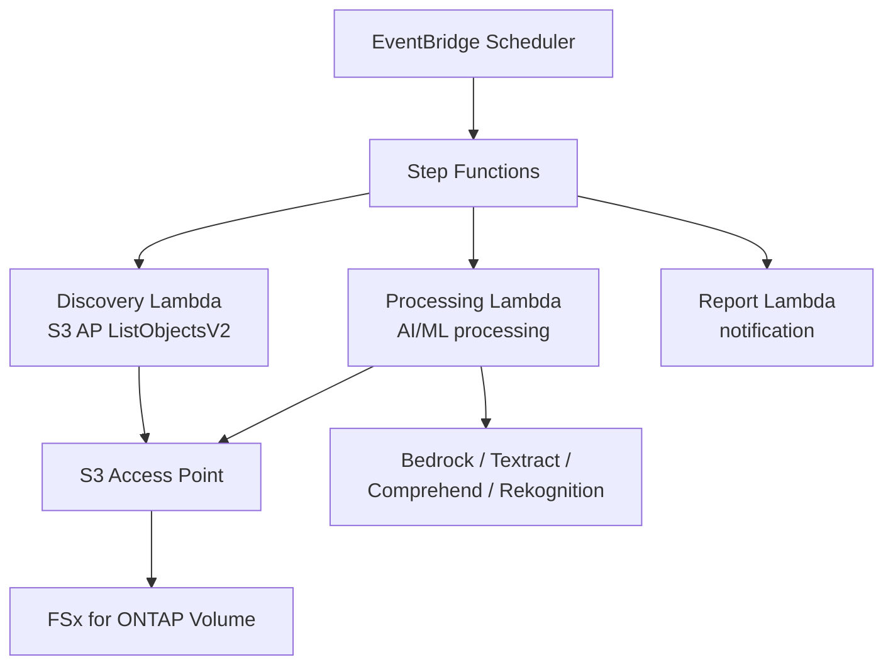

# FSx for ONTAP S3 Access Points — 無伺服器模式

    

🌐 [日本語](README.md) | [English](README.en.md) | [한국어](README.ko.md) | [简体中文](README.zh-CN.md) | [繁體中文](README.zh-TW.md) | [Français](README.fr.md) | [Deutsch](README.de.md) | [Español](README.es.md)

---

> **42 個參考模式** — 透過 S3 Access Points 對 FSx for ONTAP 上的企業 NAS 資料進行無伺服器處理。**無需複製資料**。
>
> 28 個產業用例 + 7 個 FlexCache/FlexClone + 2 個 GenAI + SAP + HA 監控 + 事件驅動 + 邊緣配送 + File Portal UI

---

## 快速入門

| 我想要... | 指南 | 所需時間 |
|---|---|---|
| 無需 FSx 體驗展示 | [Demo Mode Guide](docs/demo-mode-guide.md) | 5 分鐘 |
| 透過 Web 入口瀏覽檔案 | [File Portal UI (Amplify / Nextcloud)](docs/file-portal-amplify-gen2.en.md) | 10 分鐘 |
| 將模式部署到 AWS | [Deployment Guide](docs/guides/deployment-guide.md) | 30 分鐘 |
| 為我的工作負載選擇合適的模式 | [Pattern Selection Guide](docs/pattern-selection-guide.md) | 15 分鐘 |
| 估算成本 | [Cost Calculator](docs/cost-calculator.md) | 5 分鐘 |
| 建置動手實驗室環境 | [Hands-on Lab IaC](infrastructure/handson-lab/) | 60 分鐘 |

---

<details>
<summary><strong>📂 所有模式（點擊展開）</strong></summary>

### 產業用例 (UC1-UC28 + SAP)

| # | 目錄 | 產業 | 摘要 |
|---|---|---|---|
| UC1 | [`legal-compliance/`](solutions/industry/legal-compliance/) | 法務 | NTFS ACL 稽核與合規報告 |
| UC2 | [`financial-idp/`](solutions/industry/financial-idp/) | 金融 | 發票 OCR 與實體擷取 |
| UC3 | [`manufacturing-analytics/`](solutions/industry/manufacturing-analytics/) | 製造 | IoT 感測器與品質檢驗 |
| UC4 | [`media-vfx/`](solutions/industry/media-vfx/) | 媒體 | VFX 算圖品質檢查 |
| UC5 | [`healthcare-dicom/`](solutions/industry/healthcare-dicom/) | 醫療 | DICOM 匿名化 |
| UC6 | [`semiconductor-eda/`](solutions/industry/semiconductor-eda/) | 半導體 | GDS/OASIS 驗證 |
| UC7 | [`genomics-pipeline/`](solutions/industry/genomics-pipeline/) | 基因組學 | FASTQ/VCF 品質檢查 |
| UC8 | [`energy-seismic/`](solutions/industry/energy-seismic/) | 能源 | SEG-Y 地震資料分析 |
| UC9 | [`autonomous-driving/`](solutions/industry/autonomous-driving/) | 汽車 | 影片/LiDAR 前處理 |
| UC10 | [`construction-bim/`](solutions/industry/construction-bim/) | 建築 | BIM 模型管理 |
| UC11 | [`retail-catalog/`](solutions/industry/retail-catalog/) | 零售 | 商品圖片標籤 |
| UC12 | [`logistics-ocr/`](solutions/industry/logistics-ocr/) | 物流 | 運輸文件 OCR |
| UC13 | [`education-research/`](solutions/industry/education-research/) | 教育 | 論文分類 |
| UC14 | [`insurance-claims/`](solutions/industry/insurance-claims/) | 保險 | 損害評估 |
| UC15 | [`defense-satellite/`](solutions/industry/defense-satellite/) | 國防 | 衛星影像分析 |
| UC16 | [`government-archives/`](solutions/industry/government-archives/) | 政府 | 公共檔案與資訊公開 |
| UC17 | [`smart-city-geospatial/`](solutions/industry/smart-city-geospatial/) | 智慧城市 | 地理空間分析 |
| UC18 | [`telecom-network-analytics/`](solutions/industry/telecom-network-analytics/) | 電信 | CDR/網路日誌分析 |
| UC19 | [`adtech-creative-management/`](solutions/industry/adtech-creative-management/) | 廣告 | 創意素材管理 |
| UC20 | [`travel-document-processing/`](solutions/industry/travel-document-processing/) | 旅遊 | 訂票文件處理 |
| UC21 | [`agri-food-traceability/`](solutions/industry/agri-food-traceability/) | 農業 | 可追溯性 |
| UC22 | [`transportation-maintenance/`](solutions/industry/transportation-maintenance/) | 交通 | 設備檢查 |
| UC23 | [`sustainability-esg-reporting/`](solutions/industry/sustainability-esg-reporting/) | ESG | 指標擷取 |
| UC24 | [`nonprofit-grant-management/`](solutions/industry/nonprofit-grant-management/) | 非營利 | 補助金管理 |
| UC25 | [`utilities-asset-inspection/`](solutions/industry/utilities-asset-inspection/) | 公用事業 | 無人機/SCADA 分析 |
| UC26 | [`real-estate-portfolio/`](solutions/industry/real-estate-portfolio/) | 不動產 | 物件圖片與合約 |
| UC27 | [`hr-document-screening/`](solutions/industry/hr-document-screening/) | HR | 履歷篩選 |
| UC28 | [`chemical-sds-management/`](solutions/industry/chemical-sds-management/) | 化學 | SDS 與實驗筆記 |
| SAP | [`sap/erp-adjacent/`](solutions/sap/erp-adjacent/) | SAP/ERP | IDoc 與 EDI 處理 |

### FlexCache / FlexClone (FC1-FC7)

| # | 目錄 | 模式 |
|---|---|---|
| FC1 | [`flexcache/anycast-dr/`](solutions/flexcache/anycast-dr/) | AnyCast / DR 容錯移轉 |
| FC2 | [`flexcache/dynamic-render-workflow/`](solutions/flexcache/dynamic-render-workflow/) | 依作業動態 FlexCache |
| FC3 | [`flexcache/rag-enterprise-files/`](solutions/flexcache/rag-enterprise-files/) | 權限感知 RAG |
| FC4 | [`flexcache/automotive-cae/`](solutions/flexcache/automotive-cae/) | CAE 模擬分析 |
| FC5 | [`flexcache/life-sciences-research/`](solutions/flexcache/life-sciences-research/) | 研究資料分類 |
| FC6 | [`flexcache/gaming-build-pipeline/`](solutions/flexcache/gaming-build-pipeline/) | 遊戲素材品質檢查 |
| FC7 | [`flexcache/devops-cicd/`](solutions/flexcache/devops-cicd/) | FlexClone Dev/Test 與 CI/CD |

### GenAI / HA / 事件驅動 / 邊緣 / File Portal

| 目錄 | 摘要 |
|---|---|
| [`genai/kb-selfservice-curation/`](solutions/genai/kb-selfservice-curation/) | Bedrock KB 自助維運 |
| [`genai/quick-agentic-workspace/`](solutions/genai/quick-agentic-workspace/) | Agent 工作空間 |
| [`ha/lifekeeper-monitoring/`](solutions/ha/lifekeeper-monitoring/) | HA LifeKeeper AI 監控 |
| [`event-driven/fpolicy/`](solutions/event-driven/fpolicy/) | FPolicy 事件驅動管線 |
| [`edge/content-delivery/`](solutions/edge/content-delivery/) | CDN/邊緣配送（廠商中立） |
| [`amplify-portal/`](solutions/amplify-portal/) | File Portal UI (Amplify Gen2) |
| [`nextcloud-test/`](solutions/nextcloud-test/) | File Portal UI (Nextcloud Docker) |

### 基礎設施與共用模組

| 目錄 | 摘要 |
|---|---|
| [`shared/`](shared/) | 通用 Python 模組 (S3ApHelper, OntapClient, Observability) |
| [`operations/`](operations/) | 6 個維運最佳化模式 |
| [`infrastructure/handson-lab/`](infrastructure/handson-lab/) | 動手實驗室 IaC (VPC/AD/FSx/EC2/S3AP) |
| [`docs/`](docs/) | 設計指南與效能基準 (40+ 文件) |
| [`scripts/`](scripts/) | 部署、基準測試、工具 |
| [`.github/workflows/`](.github/workflows/) | CI/CD (lint → test → security → deploy) |

</details>

---

## 架構

```
EventBridge Scheduler（定時觸發）
  └→ Step Functions State Machine
      ├→ Discovery Lambda：透過 S3 AP 列出檔案
      ├→ Map State（平行）：使用 AI/ML 處理每個檔案
      └→ Report Lambda：產生結果 → SNS 通知
```

這是所有模式共用的通用流程。AI/ML 服務（Bedrock、Textract、Comprehend、Rekognition）依用例而異。

<details>
<summary><strong>Mermaid 圖（點擊展開）</strong></summary>



</details>

<details>
<summary><strong>分類架構（FlexCache、GenAI、HA、事件驅動、邊緣）</strong></summary>

各類別的詳細架構圖：
- [FlexCache / FlexClone](docs/industry-workload-mapping.md)
- [GenAI (Bedrock KB / Agentic)](solutions/genai/kb-selfservice-curation/docs/architecture.md)
- [HA LifeKeeper Monitoring](solutions/ha/lifekeeper-monitoring/README.md)
- [Event-Driven FPolicy](solutions/event-driven/fpolicy/README.md)
- [Edge / CDN](solutions/edge/content-delivery/docs/architecture.md)
- [File Portal (Amplify Gen2)](solutions/amplify-portal/README.md)

</details>

---

## 關鍵 S3 Access Point 限制

| 限制 | 解決方案 |
|---|---|
| 不支援 S3 Event Notifications | EventBridge Scheduler 輪詢或 FPolicy |
| Presigned URL 非官方支援 | 實際可用但不建議用於生產環境 |
| 5GB 上傳限制 | Multipart Upload |
| 無法將 Athena 結果寫入 S3AP | 輸出到標準 S3 儲存桶 |
| 僅支援 SSE-FSX | 使用磁碟區層級 KMS 加密 |

詳情：[S3AP Compatibility Notes](docs/s3ap-compatibility-notes.en.md) | [Compatibility Matrix（AWS 確認）](https://github.com/Yoshiki0705/fsxn-lakehouse-integrations/blob/main/docs/en/compatibility-matrix.md)

---

<details>
<summary><strong>📚 相關文章與儲存庫</strong></summary>

### 文章系列

| 主題 | 日語 | 英語 |
|---|---|---|
| 42 模式介紹 | [Hatena](https://hakobiya.hatenablog.com/entry/fsxn-s3ap-serverless-part1-introduction) | [dev.to](https://dev.to/aws-builders/industry-specific-serverless-automation-patterns-with-fsx-for-ontap-s3-access-points-3e0a) |
| 生產架構 | [Hatena](https://hakobiya.hatenablog.com/entry/fsxn-s3ap-serverless-part2-production-architecture) | — |
| 維運基線 | [Hatena](https://hakobiya.hatenablog.com/entry/fsxn-s3ap-serverless-part3-operational-baseline) | [dev.to](https://dev.to/aws-builders/production-rollout-vpc-endpoint-auto-detection-and-the-cdk-no-go-fsx-for-ontap-s3-access-3lni) |
| FPolicy 事件驅動 | [Hatena](https://hakobiya.hatenablog.com/entry/fsxn-s3ap-serverless-part4-event-driven-fpolicy) | [dev.to](https://dev.to/aws-builders/fpolicy-event-driven-pipeline-multi-account-stacksets-and-cost-optimization-fsx-for-ontap-s3-5bd6) |
| 28 個產業模式 | [Hatena](https://hakobiya.hatenablog.com/entry/fsxn-s3ap-serverless-part5-field-ready-28-patterns) | [dev.to](https://dev.to/aws-builders/from-serverless-patterns-to-field-ready-reference-architecture-fsx-for-ontap-s3-access-points-dhj) |
| GenAI 整合 | [Hatena](https://hakobiya.hatenablog.com/entry/fsxn-s3ap-serverless-part6-genai-42-patterns) | — |

### 相關儲存庫

| 儲存庫 | 摘要 |
|---|---|
| [Permission-aware-RAG-FSxN-CDK](https://github.com/Yoshiki0705/Permission-aware-RAG-FSxN-CDK-github) | 權限感知 RAG 聊天機器人 (CDK + Next.js + ECS) |
| [fsxn-lakehouse-integrations](https://github.com/Yoshiki0705/fsxn-lakehouse-integrations) | 湖倉整合 (Databricks, Snowflake, Athena, Glue, EMR) |
| [vmware-migration-ec2-ontap](https://github.com/Yoshiki0705/vmware-migration-ec2-ontap) | VMware → EC2 + FSx for ONTAP 遷移 |

</details>

<details>
<summary><strong>🔧 開發者指南（測試與貢獻）</strong></summary>

### 測試

```bash
pytest shared/tests/ -v                    # Unit tests
ruff check . && ruff format --check .      # Python linter
cfn-lint solutions/industry/*/template.yaml # CloudFormation validation
```

### 技術堆疊

Python 3.12 | CloudFormation + SAM | Lambda (ARM64) | Step Functions | EventBridge | Bedrock / Textract / Comprehend / Rekognition | Secrets Manager | Athena + Glue

### 貢獻

歡迎提交 Issue 和 Pull Request。請參閱 [CONTRIBUTING.md](CONTRIBUTING.md)。

</details>

---

## 授權條款

MIT — [LICENSE](LICENSE)

---

🌐 [日本語](README.md) | [English](README.en.md) | [한국어](README.ko.md) | [简体中文](README.zh-CN.md) | [繁體中文](README.zh-TW.md) | [Français](README.fr.md) | [Deutsch](README.de.md) | [Español](README.es.md)
