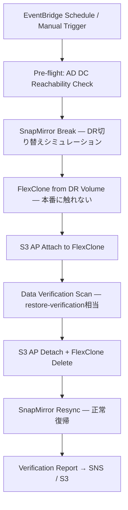

# ROADMAP

> FSx for ONTAP S3 Access Points Serverless Patterns — 今後の拡張計画

## Status Legend

| Status | Meaning |
|--------|---------|
| ✅ Done | 実装完了・テスト済み |
| 🚧 In Progress | 作業中 |
| 📋 Planned | 設計済み・未着手 |
| 💡 Future | 将来フェーズで検討 |

---

## 💡 SnapMirror DR Test Automation

**Pattern location**: `solutions/flexcache/anycast-dr/` (拡張)

### 概要

SnapMirror ベースの DR 切り替えをエンドツーエンドで自動テストするワークフロー。
本番データに触れずに DR 準備状態を検証し、正常復帰まで自動化する。

### ワークフロー

### Step Functions 状態遷移

1. **PreFlightCheck** — AD DC 到達性検証 (`shared/ad_health_check.py`)、SnapMirror 関係状態確認
2. **SnapMirrorBreak** — `POST /api/snapmirror/relationships/{uuid}` (action: break)
3. **WaitForBreak** — ジョブ完了待機 (ONTAP async job polling)
4. **CreateFlexClone** — DR ボリュームから FlexClone 作成（本番データに影響なし）
5. **AttachS3AccessPoint** — FlexClone に Internet-origin S3 AP をアタッチ
6. **DataVerificationScan** — ListObjectsV2 + GetObject サンプリングで整合性チェック
7. **CleanupClone** — S3 AP デタッチ + FlexClone 削除
8. **SnapMirrorResync** — `PATCH /api/snapmirror/relationships/{uuid}` (state: snapmirrored)
9. **WaitForResync** — 再同期完了待機
10. **PublishReport** — 結果を SNS + S3 に出力

### 設計上の考慮事項

| 項目 | 方針 |
|------|------|
| 本番データ保護 | FlexClone で検証 — SnapMirror 先に直接アクセスしない |
| AD DC 依存 | Pre-flight check で早期失敗 (AD-joined SVM の場合) |
| SnapMirror break 時間 | 通常 < 60s (Step Functions タイムアウト: 300s) |
| FlexClone 作成 | 即時 (メタデータのみ) |
| Resync 時間 | データ差分に依存 — Step Functions で最大 1 時間待機 |
| コスト | FlexClone は追加ストレージコスト最小（差分のみ） |
| 頻度 | 週次 or 月次 (EventBridge Schedule) |
| DemoMode | SnapMirror API をモックして DemoMode=true 対応 |

### 前提条件

- FSx for ONTAP 間の SnapMirror 関係が構成済み
- ONTAP REST API (9.13.1+) で SnapMirror break/resync をサポート
- `shared/ontap_client.py` で SnapMirror API メソッド追加が必要
- restore-verification パターン (`fsxn-observability-integrations`) の知見を流用

### 既存パターンとの関係

- **FC1 (anycast-dr)**: FlexCache + Anycast ルーティングの DR パターン。SnapMirror DR テストはこの拡張として位置づけ
- **restore-verification (fsxn-observability-integrations)**: S3 AP アタッチ → データ検証 → クリーンアップのフローを流用
- **shared/ad_health_check.py**: Pre-flight check で再利用

### Implementation Phases

1. **Phase A**: `shared/ontap_client.py` に SnapMirror API メソッド追加 (break/resync/status)
2. **Phase B**: Step Functions ASL 定義 + Lambda 関数実装
3. **Phase C**: Unit/Property テスト + DemoMode 対応
4. **Phase D**: E2E テスト (実環境 SnapMirror 構成で検証)

### Priority

**低〜中** — 既存パターンの本番運用が安定してから着手。DR テスト自動化のニーズが顧客ヒアリングで確認された場合に優先度を上げる。

---

## 📋 Planned Improvements

### AD DC Health Check Integration (全 WINDOWS パターン)

- Step Functions ワークフロー先頭に `require_ad_dc_reachability()` を追加
- 対象: WINDOWS identity type の S3 AP を使う全パターン
- 実装: `shared/ad_health_check.py` (完了)、各パターンへの統合 (TODO)

### SnapMirror API Methods for OntapClient

- `break_snapmirror(relationship_uuid)` — DR 切り替え
- `resync_snapmirror(relationship_uuid)` — 正常復帰
- `get_snapmirror_status(relationship_uuid)` — 状態確認
- `list_snapmirror_relationships(svm_name)` — 関係一覧

---

## Related Documents

- [FlexCache Anycast DR Design](docs/flexcache-anycast-design-guide.md)
- [AD-Joined SVM S3 AP Prerequisites](docs/en/ad-joined-svm-s3ap-prerequisites.md)
- [S3AP Compatibility Notes](docs/s3ap-compatibility-notes.md)
- [Incident Response Playbook](docs/incident-response-playbook.md)
