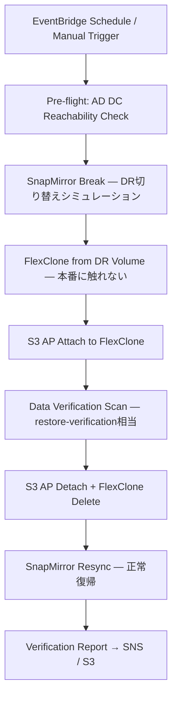

# ROADMAP

> FSx for ONTAP S3 Access Points Serverless Patterns — 今後の拡張計画

## Status Legend

| Status | Meaning |
|--------|---------|
| ✅ Done | 実装完了・テスト済み |
| 🚧 In Progress | 作業中 |
| 📋 Planned | 設計済み・未着手 |
| 💡 Future | 将来フェーズで検討 |

---

## 💡 SnapMirror DR Test Automation

**Pattern location**: `solutions/flexcache/anycast-dr/` (拡張)

### 概要

SnapMirror ベースの DR 切り替えをエンドツーエンドで自動テストするワークフロー。
本番データに触れずに DR 準備状態を検証し、正常復帰まで自動化する。

### ワークフロー

```mermaid
graph TD
    A[EventBridge Schedule / Manual Trigger] --> B[Pre-flight: AD DC Reachability Check]
    B --> C[SnapMirror Break — DR切り替えシミュレーション]
    C --> D[FlexClone from DR Volume — 本番に触れない]
    D --> E[S3 AP Attach to FlexClone]
    E --> F[Data Verification Scan — restore-verification相当]
    F --> G[S3 AP Detach + FlexClone Delete]
    G --> H[SnapMirror Resync — 正常復帰]
    H --> I[Verification Report → SNS / S3]
```

### Step Functions 状態遷移

1. **PreFlightCheck** — AD DC 到達性検証 (`shared/ad_health_check.py`)、SnapMirror 関係状態確認
2. **SnapMirrorBreak** — `POST /api/snapmirror/relationships/{uuid}` (action: break)
3. **WaitForBreak** — ジョブ完了待機 (ONTAP async job polling)
4. **CreateFlexClone** — DR ボリュームから FlexClone 作成（本番データに影響なし）
5. **AttachS3AccessPoint** — FlexClone に Internet-origin S3 AP をアタッチ
6. **DataVerificationScan** — ListObjectsV2 + GetObject サンプリングで整合性チェック
7. **CleanupClone** — S3 AP デタッチ + FlexClone 削除
8. **SnapMirrorResync** — `PATCH /api/snapmirror/relationships/{uuid}` (state: snapmirrored)
9. **WaitForResync** — 再同期完了待機
10. **PublishReport** — 結果を SNS + S3 に出力

### 設計上の考慮事項

| 項目 | 方針 |
|------|------|
| 本番データ保護 | FlexClone で検証 — SnapMirror 先に直接アクセスしない |
| AD DC 依存 | Pre-flight check で早期失敗 (AD-joined SVM の場合) |
| FlexClone セキュリティスタイル | 親ボリュームから継承 — 明示指定不可。NTFS→NTFS, UNIX→UNIX |
| SnapMirror break 時間 | 通常 < 60s (Step Functions タイムアウト: 300s) |
| FlexClone 作成 | 即時 (メタデータのみ) |
| Resync 時間 | データ差分に依存 — Step Functions で最大 1 時間待機 |
| コスト | FlexClone は追加ストレージコスト最小（差分のみ） |
| 頻度 | 週次 or 月次 (EventBridge Schedule) |
| DemoMode | SnapMirror API をモックして DemoMode=true 対応 |

### 前提条件

- FSx for ONTAP 間の SnapMirror 関係が構成済み
- ONTAP REST API (9.13.1+) で SnapMirror break/resync をサポート
- `shared/ontap_client.py` で SnapMirror API メソッド追加が必要
- restore-verification パターン (`fsxn-observability-integrations`) の知見を流用

### 既存パターンとの関係

- **FC1 (anycast-dr)**: FlexCache + Anycast ルーティングの DR パターン。SnapMirror DR テストはこの拡張として位置づけ
- **restore-verification (fsxn-observability-integrations)**: S3 AP アタッチ → データ検証 → クリーンアップのフローを流用
- **shared/ad_health_check.py**: Pre-flight check で再利用

### Implementation Phases

1. **Phase A**: `shared/ontap_client.py` に SnapMirror API メソッド追加 (break/resync/status)
2. **Phase B**: Step Functions ASL 定義 + Lambda 関数実装
3. **Phase C**: Unit/Property テスト + DemoMode 対応
4. **Phase D**: E2E テスト (実環境 SnapMirror 構成で検証)

### Priority

**低〜中** — 既存パターンの本番運用が安定してから着手。DR テスト自動化のニーズが要件ヒアリングで確認された場合に優先度を上げる。

---

## 📋 Planned Improvements

### AD DC Health Check Integration (全 WINDOWS パターン)

- ✅ `shared/ad_health_check.py` モジュール実装完了（14 テスト pass）
- ✅ `scripts/demo-ad-join-svm.sh` に post-join 検証追加
- ✅ `infrastructure/demo-ad-environment.yaml` に検証ガイダンス出力追加
- ✅ `docs/en/` + `docs/ja/` ドキュメント作成（8ペルソナレビュー済み）
- 📋 Step Functions ワークフロー先頭に `require_ad_dc_reachability()` を統合 — 対象: WINDOWS identity type の S3 AP を使う全パターン

### SnapMirror API Methods for OntapClient

**状況が変わりました**: これは調査項目ではなく、実証済みコードの移設作業になりました。

`solutions/amplify-portal/functions/resource-management/handler.py` に 9 アクションが実装済みで、REST のリクエスト/レスポンス形状は実クラスタで動作確認できています。一方 `shared/ontap_client.py` には SnapMirror 関連の実装が 1 つもありません（`grep -c snapmirror` → 0）。つまり残っているのは「形状を調べる」ことではなく「ハンドラから共有クライアントへ引き上げる」ことです。

| 計画されていたメソッド | 実装済みアクション | 実証済みエンドポイント |
|---|---|---|
| `break_snapmirror` | `breakSnapmirror` | `PATCH /snapmirror/relationships/{uuid}` |
| `resync_snapmirror` | `resyncSnapmirror` | `PATCH /snapmirror/relationships/{uuid}` |
| `get_snapmirror_status` | `getSnapmirrorTransfers` | `GET /snapmirror/relationships/{uuid}/transfers` |
| `list_snapmirror_relationships` | `listSnapmirrorRelationships` | `GET /snapmirror/relationships` |

ハンドラ側にはこれ以外に `quiesceSnapmirror` / `resumeSnapmirror` / `updateSnapmirrorNow` / `abortSnapmirrorTransfer` / `deleteSnapmirror` もあります。共有クライアントへ移す際は、この 9 アクション全体を対象にしたほうが、一部だけ移して二重管理になるより安全です。

#### これは「移設」ではありません（前提の訂正）

以前ここには「振る舞いを変えない移設なので、既存の 191 テストが回帰検出に使えます」と書いていました。**どちらも成り立ちません。** ハンドラの `_ontap_request` と `shared/OntapClient` は規約が異なるため、単純に差し替えると振る舞いが変わります。

| 観点 | ハンドラ `_ontap_request` | `shared/OntapClient` | 差し替えた場合 |
|---|---|---|---|
| パス検査 | `_is_unsafe_path()` で制御文字と `..` セグメントを拒否 | **なし** | **セキュリティ後退。** SnapMirror 系は `relationshipUuid` を `_seg()` を通さず直接補間しているので、この検査が唯一の防御 |
| エラー | 戻り値 `{"_error", "_status", "_message"}`。ONTAP の `error.message` を抽出 | `OntapClientError` を raise。生のレスポンスボディを保持 | 全呼び出し元に try/except が必要。メッセージ抽出を移さないと UI の文言が変わる |
| TLS | `cert_reqs="CERT_NONE"` 固定 | `verify_ssl=True` 既定 → `CERT_REQUIRED` | **本番停止。** FSx for ONTAP の管理 LIF は既定で自己署名証明書。`verify_ssl=False` を明示しない限り 9 アクション全滅 |
| 認証情報 | `data.get("username", "fsxadmin")` と既定値を許容 | `creds['username']` | `username` を持たないシークレットは現在動くが、差し替えると KeyError |
| 空ボディ | `if body:` — `{}` は送らない | `if body is not None:` — `{}` を送る | 空ボディの PATCH の扱いが変わる |
| タイムアウト | 未設定（無制限） | connect 10s / read 30s | 改善。ただし振る舞いの変更ではある |
| リトライ | `Retry.DEFAULT`（total=3、PATCH/POST は対象外、DELETE は対象） | 同じ許可メソッド + backoff | 実質同一。backoff が加わるだけ（urllib3 2.7.0 で確認） |

「既存テストが回帰検出に使える」も誤りです。最も危険な TLS とタイムアウトは、トランスポートをスタブした単体テストでは一度も踏まれません（`resource-management/tests/test_handler.py` の `_ontap_request` 参照は 2 箇所）。

📋 残作業（この順序で）:

1. `OntapClient._request()` にパス検査を追加する — 現在 `OntapClient` を使っている全パターンにとっても防御の追加になる
2. 9 メソッドを `OntapClient` に追加する（HTTP パスとレスポンスのフィールド対応のみ。入力検証・`confirm` ゲート・監査ログ・camelCase 整形はハンドラの責務として残す）
3. ハンドラ側を置き換える。`verify_ssl=False` を明示し、`OntapClientError` を既存のエラー戻り値形へ変換する 1 箇所のヘルパーを通す
4. 実クラスタで 9 アクションを確認する。TLS とタイムアウトは単体テストでは検証できない

---

## ✅ ファイルポータル: 封じ込めの有効期限とマルチ SVM 対応（完了）

ARP/AI の封じ込め操作について、以下が実装・ライブ検証済みです。

| 項目 | 状況 | 備考 |
|---|:---:|---|
| ブロックの有効期限とスイープ | ✅ | 既定 24 時間、1 時間〜7 日、または明示的な無期限 |
| ポータル管理外ブロックの保護 | ✅ | 台帳にない行は自動解除の対象外（`managedByPortal: false` として表示） |
| マルチ SVM ファンアウト | ✅ | `svms` で明示指定、`allSvms` でクラスタに問い合わせ。部分失敗は SVM 単位で報告 |
| ドキュメント/コード乖離の CI ガード | ✅ | `scripts/check_portal_drift.py`（validators ワークフロー） |
| ライブ検証用プローブ | ✅ | `scripts/portal-probes/` |
| 監査主体の記録 | ✅ | AppSync 経由でない呼び出しは `unattributed` / `direct-invoke` として記録。詳細は下記 |
| スイープ失敗の通知 | ✅ | EMF メトリクス + アラーム 2 本（失敗検知と、スイープ自体の停止検知） |
| NFS ブロックの index | ✅ | index 1 のまま（deny ルールは先に評価される必要があるため）だが `rules_shifted` を返し、再ブロックは `already_blocked` の no-op |
| i18n 直書き文字列（当初 53 件） | ✅ | ベースラインは 0 件。空が正常な状態で、以後の直書きは CI が失敗させます（空ベースラインでも検知することを実証済み） |
| 直接呼び出しの検知 | ✅ | 防止はスタック外（下記）。状態変更アクションが AppSync identity なしで届いたら 1 件目でアラーム |
| `ttlHours` 上限の根拠 | ✅ | 90 日 → 30 日。「どちらの道具が適切か」で決めました（下記）。`maxBlockTtlHours` で変更可、0 で上限なし |

### この作業で見つかった実装の問題（すべて修正済み）

ユニットテストではなくライブ検証で見つかったものです。設計判断の記録として残します。

- 共有モジュールが Lambda にパッケージされておらず、封じ込めは**一度も**動作していませんでした。エラー文字列が `4` だったため HTTP ステータスと誤読され、原因の特定が遅れました
- SMB ブロックの name-mapping index が 1 固定で、2 人目をブロックできませんでした（ONTAP は素の 409 を返すだけ）
- 台帳（DynamoDB）への書き込みが Lambda のタイムアウトまでハングし、**ONTAP が受理済みのブロックが失敗として報告されて**いました。VPC サブネットのデフォルトルートが Internet Gateway 向きで、Lambda ENI にパブリック IP がないためです
- スイープの早期 return（ONTAP 到達不能、台帳が読めない）がメトリクス送出より前にあり、**まさに気づきたい 2 ケースだけが無言**でした。両方で `failed=1` を出すようにしました
- スイープが止まると失敗も報告されないため、エラー監視だけでは健全に見えます。`SweepRuns` の欠測を `treatMissingData: BREACHING` で監視する 2 本目のアラームを追加しました。アラームの期間は `blockSweepIntervalMinutes` から導出しています（当初の 1 時間固定では 15 分間隔のスイープに対して復旧検知が 2 時間になっていました）

### 残っている課題

現時点で未対応の項目はありません。

### `ttlHours` 上限を 30 日にした理由

90 日は恣意的な値でした。30 日にしたのは「どの数字が安全か」ではなく **どちらの道具が適切か** で決めています。

ONTAP の deny ルールが効くのは 1 つの SVM だけです。調査が続く期間より長くロックアウトし続ける必要がある主体は、ディレクトリ側でアカウントを無効化すべきです。そちらは環境全体に効き、アカウントのライフサイクルを持つチームからも見えます。1 台のファイラーの name-mapping ルールは見えません。

**この上限は単位の打ち間違いを防ぐものではありません。** 「日数だと思って 90 と入力」した場合に得られるのは 90 時間で、どんな上限でも検知できません。それを捕まえるのはレスポンスに返る `expiresAt` です。上限が止められるのは非現実的な値だけなので、道具を切り替えるべき境界に置き、インシデント対応の運用が異なるチームのために `maxBlockTtlHours` で変更可能にしました（0 で上限なし）。

上限を超えた場合はクランプせず拒否し、エラーメッセージで「ディレクトリ側で無効化する」「`ttlHours=0` で明示的な無期限にする」「`maxBlockTtlHours` を上げる」の 3 つを示します。黙って切り詰めると、1 年を要求した呼び出し側が 30 日だと気づけません。

### 設定例ファイルの欠落フィールド（同時に修正）

`portal-config.example.ts` に `defaultBlockTtlHours` / `blockSweepIntervalMinutes` / `s3ObjectLockBucket` が**宣言されていませんでした**。`backend.ts` は前者を `String(config.defaultBlockTtlHours)` で環境変数に書くため、例ファイルからコピーした設定では環境変数が文字列 `"undefined"` になり、`int("undefined")` がモジュール import 中に例外を投げて **ARP 関数のすべてのアクションがハンドラに到達する前に失敗**していました。ドキュメント通りに設定した環境で封じ込めが一切動かない状態です。

3 フィールドを例ファイルに追加し、`backend.ts` が読む `config.*` すべてが例ファイルに存在することを検証するテストを追加しました（このテストが 3 つ目の `s3ObjectLockBucket` を検出しました）。あわせて設定値の読み取りを `_env_int()` に置き換え、不正な値ではデフォルトにフォールバックしてログに残すようにしています。設定 1 つの誤りで関数全体が死ぬ挙動は、その設定の重要度に釣り合いません。

### 「Lambda を直接呼べる主体の制限」は仕様上スタックでは実装できません

上の表にあったこの項目は、**リソースベースポリシーでは達成できない**ことが分かったため、達成可能な形に置き換えました。

同一アカウント内では、アイデンティティベースとリソースベースの**どちらかのポリシーが許可していれば呼び出しは成立**し、Lambda の権限 API（`AddPermission`）が書けるのは Allow だけです。したがってこのスタックにリソースポリシーを追加しても、既に `lambda:InvokeFunction` を持つ主体から権限を取り上げることはできません。増やすことしかできません。

実効的な防止は次の 2 つで、いずれもこのスタックの外にあります。

1. アイデンティティベースのポリシー（誰に `lambda:InvokeFunction` を与えるか）
2. SCP または Permissions Boundary（組織レベル）

そこでスタック側は**防止ではなく検知**を担当します。状態を変える封じ込めアクションが AppSync の identity を伴わずに届いた場合、EMF メトリクス `UnattributedContainmentActions` を出し、アラームが 1 件目で発火します。台帳の行には以前から `direct-invoke` が記録されていましたが、それは後から行を読んだ人にしか見えませんでした。

コピー可能な SCP 例と、`scripts/portal-probes/` が意図的にこのアラームを発火させる理由は [ポータル認可モデル](docs/ja/portal-authorization-model.md) にあります。

### このロードマップ自体の記載誤り（訂正）

上の表にあった「`createdBy` が `event.userId` を信頼している」という記載は**誤り**でした。実際にはリゾルバ `arp-dispatch.js` が以前から `ctx.identity.username` を `params` の後に展開して上書きしていたため、`userId` は偽装できませんでした。

実際に露出していたのは隣にあった `actor` フォールバックで、こちらはどのリゾルバも設定も消去もしていませんでした。フォールバックを削除し、AppSync 経由（`invokedVia == "appsync"`）かつ `userId` がある場合のみ主体として採用するようにしました。それ以外は `unattributed` / `direct-invoke` として記録します（`unknown` は「照会に失敗した」と読めてしまうため避けました）。

もう一点、識別情報のフィルタを `Object.keys` とループで書き直した最初の版は APPSYNC_JS に拒否され、`The code contains one or more errors`（400）だけが返ってデプロイがロールバックしました。明示的な「展開後に上書き」に戻し、理由をリゾルバ内に記録しています。

### 運用上の注意

`vpcId` を設定する場合、`vpcRouteTableIds` は**必須**です（未設定なら synth が失敗します）。DynamoDB ゲートウェイエンドポイントがないと、封じ込めは動作する一方で有効期限が一切動きません。詳細は [Portal Getting Started](solutions/amplify-portal/docs/GETTING-STARTED.md) を参照してください。

---

## Related Documents

- [FlexCache Anycast DR Design](docs/flexcache-anycast-design-guide.md)
- [AD-Joined SVM S3 AP Prerequisites](docs/en/ad-joined-svm-s3ap-prerequisites.md)
- [S3AP Compatibility Notes](docs/s3ap-compatibility-notes.md)
- [Incident Response Playbook](docs/incident-response-playbook.md)
- [ARP/AI 封じ込めデモガイド (JA)](docs/ja/arp-ai-isolation-demo-guide.md) / [EN](docs/en/arp-ai-isolation-demo-guide.md)
- [ポータル認可モデル (JA)](docs/ja/portal-authorization-model.md) / [EN](docs/en/portal-authorization-model.md)
- [ライブ検証プローブ](scripts/portal-probes/README.md)
