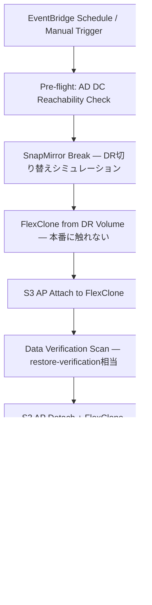

# ROADMAP

> FSx for ONTAP S3 Access Points Serverless Patterns — 今後の拡張計画

## Status Legend

| Status | Meaning |
|--------|---------|
| ✅ Done | 実装完了・テスト済み |
| 🚧 In Progress | 作業中 |
| 📋 Planned | 設計済み・未着手 |
| 💡 Future | 将来フェーズで検討 |

---

## 💡 SnapMirror DR Test Automation

**Pattern location**: `solutions/flexcache/anycast-dr/` (拡張)

### 概要

SnapMirror ベースの DR 切り替えをエンドツーエンドで自動テストするワークフロー。
本番データに触れずに DR 準備状態を検証し、正常復帰まで自動化する。

### ワークフロー

```mermaid
graph TD
    A[EventBridge Schedule / Manual Trigger] --> B[Pre-flight: AD DC Reachability Check]
    B --> C[SnapMirror Break — DR切り替えシミュレーション]
    C --> D[FlexClone from DR Volume — 本番に触れない]
    D --> E[S3 AP Attach to FlexClone]
    E --> F[Data Verification Scan — restore-verification相当]
    F --> G[S3 AP Detach + FlexClone Delete]
    G --> H[SnapMirror Resync — 正常復帰]
    H --> I[Verification Report → SNS / S3]
```

### Step Functions 状態遷移

1. **PreFlightCheck** — AD DC 到達性検証 (`shared/ad_health_check.py`)、SnapMirror 関係状態確認
2. **SnapMirrorBreak** — `POST /api/snapmirror/relationships/{uuid}` (action: break)
3. **WaitForBreak** — ジョブ完了待機 (ONTAP async job polling)
4. **CreateFlexClone** — DR ボリュームから FlexClone 作成（本番データに影響なし）
5. **AttachS3AccessPoint** — FlexClone に Internet-origin S3 AP をアタッチ
6. **DataVerificationScan** — ListObjectsV2 + GetObject サンプリングで整合性チェック
7. **CleanupClone** — S3 AP デタッチ + FlexClone 削除
8. **SnapMirrorResync** — `PATCH /api/snapmirror/relationships/{uuid}` (state: snapmirrored)
9. **WaitForResync** — 再同期完了待機
10. **PublishReport** — 結果を SNS + S3 に出力

### 設計上の考慮事項

| 項目 | 方針 |
|------|------|
| 本番データ保護 | FlexClone で検証 — SnapMirror 先に直接アクセスしない |
| AD DC 依存 | Pre-flight check で早期失敗 (AD-joined SVM の場合) |
| FlexClone セキュリティスタイル | 親ボリュームから継承 — 明示指定不可。NTFS→NTFS, UNIX→UNIX |
| SnapMirror break 時間 | 通常 < 60s (Step Functions タイムアウト: 300s) |
| FlexClone 作成 | 即時 (メタデータのみ) |
| Resync 時間 | データ差分に依存 — Step Functions で最大 1 時間待機 |
| コスト | FlexClone は追加ストレージコスト最小（差分のみ） |
| 頻度 | 週次 or 月次 (EventBridge Schedule) |
| DemoMode | SnapMirror API をモックして DemoMode=true 対応 |

### 前提条件

- FSx for ONTAP 間の SnapMirror 関係が構成済み
- ONTAP REST API (9.13.1+) で SnapMirror break/resync をサポート
- `shared/ontap_client.py` で SnapMirror API メソッド追加が必要
- restore-verification パターン (`fsxn-observability-integrations`) の知見を流用

### 既存パターンとの関係

- **FC1 (anycast-dr)**: FlexCache + Anycast ルーティングの DR パターン。SnapMirror DR テストはこの拡張として位置づけ
- **restore-verification (fsxn-observability-integrations)**: S3 AP アタッチ → データ検証 → クリーンアップのフローを流用
- **shared/ad_health_check.py**: Pre-flight check で再利用

### Implementation Phases

1. **Phase A**: `shared/ontap_client.py` に SnapMirror API メソッド追加 (break/resync/status)
2. **Phase B**: Step Functions ASL 定義 + Lambda 関数実装
3. **Phase C**: Unit/Property テスト + DemoMode 対応
4. **Phase D**: E2E テスト (実環境 SnapMirror 構成で検証)

### Priority

**低〜中** — 既存パターンの本番運用が安定してから着手。DR テスト自動化のニーズが要件ヒアリングで確認された場合に優先度を上げる。

---

## 📋 Planned Improvements

### AD DC Health Check Integration (全 WINDOWS パターン)

- ✅ `shared/ad_health_check.py` モジュール実装完了（14 テスト pass）
- ✅ `scripts/demo-ad-join-svm.sh` に post-join 検証追加
- ✅ `infrastructure/demo-ad-environment.yaml` に検証ガイダンス出力追加
- ✅ `docs/en/` + `docs/ja/` ドキュメント作成（8ペルソナレビュー済み）
- 📋 Step Functions ワークフロー先頭に `require_ad_dc_reachability()` を統合 — 対象: WINDOWS identity type の S3 AP を使う全パターン

### SnapMirror API Methods for OntapClient

**状況が変わりました**: これは調査項目ではなく、実証済みコードの移設作業になりました。

`solutions/amplify-portal/functions/resource-management/handler.py` に 9 アクションが実装済みで、REST のリクエスト/レスポンス形状は実クラスタで動作確認できています。一方 `shared/ontap_client.py` には SnapMirror 関連の実装が 1 つもありません（`grep -c snapmirror` → 0）。つまり残っているのは「形状を調べる」ことではなく「ハンドラから共有クライアントへ引き上げる」ことです。

| 計画されていたメソッド | 実装済みアクション | 実証済みエンドポイント |
|---|---|---|
| `break_snapmirror` | `breakSnapmirror` | `PATCH /snapmirror/relationships/{uuid}` |
| `resync_snapmirror` | `resyncSnapmirror` | `PATCH /snapmirror/relationships/{uuid}` |
| `get_snapmirror_status` | `getSnapmirrorTransfers` | `GET /snapmirror/relationships/{uuid}/transfers` |
| `list_snapmirror_relationships` | `listSnapmirrorRelationships` | `GET /snapmirror/relationships` |

ハンドラ側にはこれ以外に `quiesceSnapmirror` / `resumeSnapmirror` / `updateSnapmirrorNow` / `abortSnapmirrorTransfer` / `deleteSnapmirror` もあります。共有クライアントへ移す際は、この 9 アクション全体を対象にしたほうが、一部だけ移して二重管理になるより安全です。

📋 残作業: `shared/ontap_client.py` にメソッドを追加し、ハンドラ側をそれを呼ぶよう置き換える（振る舞いを変えない移設なので、既存の 191 テストが回帰検出に使えます）

---

## ✅ ファイルポータル: 封じ込めの有効期限とマルチ SVM 対応（完了）

ARP/AI の封じ込め操作について、以下が実装・ライブ検証済みです。

| 項目 | 状況 | 備考 |
|---|:---:|---|
| ブロックの有効期限とスイープ | ✅ | 既定 24 時間、1 時間〜7 日、または明示的な無期限 |
| ポータル管理外ブロックの保護 | ✅ | 台帳にない行は自動解除の対象外（`managedByPortal: false` として表示） |
| マルチ SVM ファンアウト | ✅ | `svms` で明示指定、`allSvms` でクラスタに問い合わせ。部分失敗は SVM 単位で報告 |
| ドキュメント/コード乖離の CI ガード | ✅ | `scripts/check_portal_drift.py`（validators ワークフロー） |
| ライブ検証用プローブ | ✅ | `scripts/portal-probes/` |

### この作業で見つかった実装の問題（すべて修正済み）

ユニットテストではなくライブ検証で見つかったものです。設計判断の記録として残します。

- 共有モジュールが Lambda にパッケージされておらず、封じ込めは**一度も**動作していませんでした。エラー文字列が `4` だったため HTTP ステータスと誤読され、原因の特定が遅れました
- SMB ブロックの name-mapping index が 1 固定で、2 人目をブロックできませんでした（ONTAP は素の 409 を返すだけ）
- 台帳（DynamoDB）への書き込みが Lambda のタイムアウトまでハングし、**ONTAP が受理済みのブロックが失敗として報告されて**いました。VPC サブネットのデフォルトルートが Internet Gateway 向きで、Lambda ENI にパブリック IP がないためです

### 残っている課題

| 項目 | 優先度 | 内容 |
|---|:---:|---|
| 📋 封じ込め操作の監査主体 | 高 | `createdBy` が `event.userId` を信頼しています。AppSync の Cognito identity から取得すべきです（現状は呼び出し側の自己申告） |
| 📋 スイープ失敗の通知 | 高 | 現状 CloudWatch Logs に残るだけです。SVM 到達不能で解除が継続的に失敗しても誰も気づきません |
| 📋 NFS ブロックの index 固定 | 中 | `block_nfs_ip` は `rule_index=1` 固定のままです。export-policy は挿入セマンティクスなので 409 にはなりませんが、既存ルールを押し下げ続けます |
| 📋 `ttlHours` 上限の運用的な根拠 | 低 | 90 日は恣意的な値です。インシデント対応の実運用に合わせるべきです |
| 📋 i18n 直書き文字列 53 件 | 中 | `scripts/portal-drift-baseline.txt` に記録済み。8 言語のうち 7 言語で見えないため、キー化が必要です。新規発生は CI が阻止します |

### 運用上の注意

`vpcId` を設定する場合、`vpcRouteTableIds` は**必須**です（未設定なら synth が失敗します）。DynamoDB ゲートウェイエンドポイントがないと、封じ込めは動作する一方で有効期限が一切動きません。詳細は [Portal Getting Started](solutions/amplify-portal/docs/GETTING-STARTED.md) を参照してください。

---

## Related Documents

- [FlexCache Anycast DR Design](docs/flexcache-anycast-design-guide.md)
- [AD-Joined SVM S3 AP Prerequisites](docs/en/ad-joined-svm-s3ap-prerequisites.md)
- [S3AP Compatibility Notes](docs/s3ap-compatibility-notes.md)
- [Incident Response Playbook](docs/incident-response-playbook.md)
- [ARP/AI 封じ込めデモガイド (JA)](docs/ja/arp-ai-isolation-demo-guide.md) / [EN](docs/en/arp-ai-isolation-demo-guide.md)
- [ポータル認可モデル (JA)](docs/ja/portal-authorization-model.md) / [EN](docs/en/portal-authorization-model.md)
- [ライブ検証プローブ](scripts/portal-probes/README.md)
