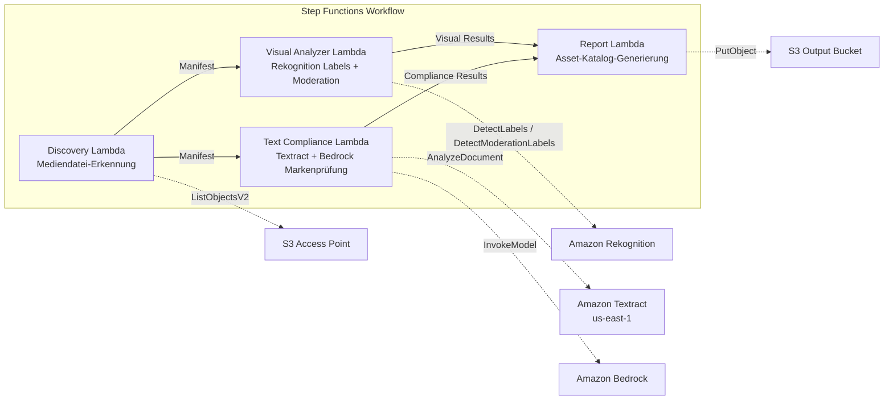

# UC19: Werbung & Marketing / Creative Asset Management — Asset-Katalogisierung und Markenkonformitätsprüfung

🌐 **Language / Sprache**: [日本語](README.md) | [English](README.en.md) | [한국어](README.ko.md) | [简体中文](README.zh-CN.md) | [繁體中文](README.zh-TW.md) | [Français](README.fr.md) | Deutsch | [Español](README.es.md)

📚 **Dokumentation**: [Architekturdiagramm](docs/architecture.de.md) | [Demo-Leitfaden](docs/demo-guide.de.md)

## Überblick

Ein serverloser Workflow, der S3 Access Points auf Amazon FSx for ONTAP nutzt, um die automatische Katalogisierung von Werbe-Creative-Assets, visuelle Analyse, Text-Compliance-Prüfung und Markenrichtlinien-Validierung zu realisieren.

### Geeignete Anwendungsfälle

- Creative Assets (JPEG, PNG, TIFF, MP4, MOV, PSD) sind auf FSx for ONTAP gespeichert
- Rekognition-basierte visuelle Metadatenextraktion (Labels, Texterkennung, Moderation) wird benötigt
- Automatisierung der Markenterminologie-Compliance-Prüfung über Textract + Bedrock gewünscht
- Automatische Generierung von Asset-Katalogen (JSON/CSV) mit zentraler Compliance-Verwaltung erforderlich
- Automatische Kennzeichnung von Moderationsverstößen mit Integration in menschliche Überprüfungsworkflows

### Ungeeignete Anwendungsfälle

- Echtzeit-Video-Streaming-Überprüfung erforderlich (Reaktion unter einer Sekunde)
- Vollständige DAM-Plattform (Digital Asset Management) erforderlich
- Großangelegte Video-Editing-/Rendering-Pipeline erforderlich
- Netzwerkerreichbarkeit zur ONTAP REST API nicht gewährleistet

## Success Metrics

### Outcome
Automatisierung der Creative-Asset-Katalogisierung und Markenkonformitätsprüfung zur Effizienzsteigerung der Qualitätskontrolle in Werbeproduktions-Workflows.

### Metrics
| Metrik | Zielwert (Beispiel) |
|--------|-------------------|
| Verarbeitete Assets / Ausführung | > 100 Assets |
| Compliance-Prüfungsgenauigkeit | > 95% |
| Moderationserkennungsrate | > 98% |
| Berichtgenerierungszeit | < 3 Min. / Batch |
| Kosten / tägliche Ausführung | < $2,00 |
| Rate erforderlicher menschlicher Überprüfung | > 10% (moderationsgekennzeichnete Assets erfordern vollständige Überprüfung) |

### Human Review Requirements
- Assets mit Moderationsverstößen (Confidence ≥ 80%) werden als "requires-review" gekennzeichnet
- Markenrichtlinien-nichtkonforme Assets werden vom Marketingteam überprüft
- Monatliche Compliance-Berichte werden vom Creative Director überprüft

## Architektur

## ⚠️ Leistungshinweise

- Die Durchsatzkapazität von FSx for ONTAP wird **zwischen NFS/SMB/S3 AP geteilt**. Die parallele Ausführung mit MapConcurrency=10 kann andere Workloads auf demselben Volume beeinflussen.
- Bei der Verarbeitung großer Dateien prüfen Sie die FSx for ONTAP Throughput Capacity (MBps) und passen Sie MapConcurrency entsprechend an.
- Empfohlen: Beginnen Sie in der Produktion mit MapConcurrency=5, überwachen Sie die CloudWatch-Metriken (ThroughputUtilization) und erhöhen Sie schrittweise.

## Governance-Hinweis

> Dieses Pattern bietet technische Architektur-Orientierung. Es stellt keine rechtliche, Compliance- oder regulatorische Beratung dar. Organisationen müssen qualifizierte Fachleute konsultieren.

## S3AP-Kompatibilität

Informationen zu Kompatibilitätseinschränkungen, Fehlerbehebung und Trigger-Patterns für FSx for ONTAP S3 Access Points finden Sie in den [S3AP Compatibility Notes](../docs/s3ap-compatibility-notes.md).

> **S3 AP NetworkOrigin Hinweis**: Die Discovery Lambda wird innerhalb eines VPC bereitgestellt. Wenn der NetworkOrigin des S3 Access Points `Internet` ist, kann über S3 Gateway VPC Endpoint nicht zugegriffen werden (Anfragen werden nicht an die FSx-Datenebene weitergeleitet). Verwenden Sie einen VPC-origin S3 AP oder konfigurieren Sie NAT Gateway-Zugriff. Siehe [S3AP-Kompatibilitätshinweise](../docs/s3ap-compatibility-notes.md).

> **Related Regulations**: 景品表示法 (Act against Unjustifiable Premiums and Misleading Representations), 個人情報保護法 (APPI)
