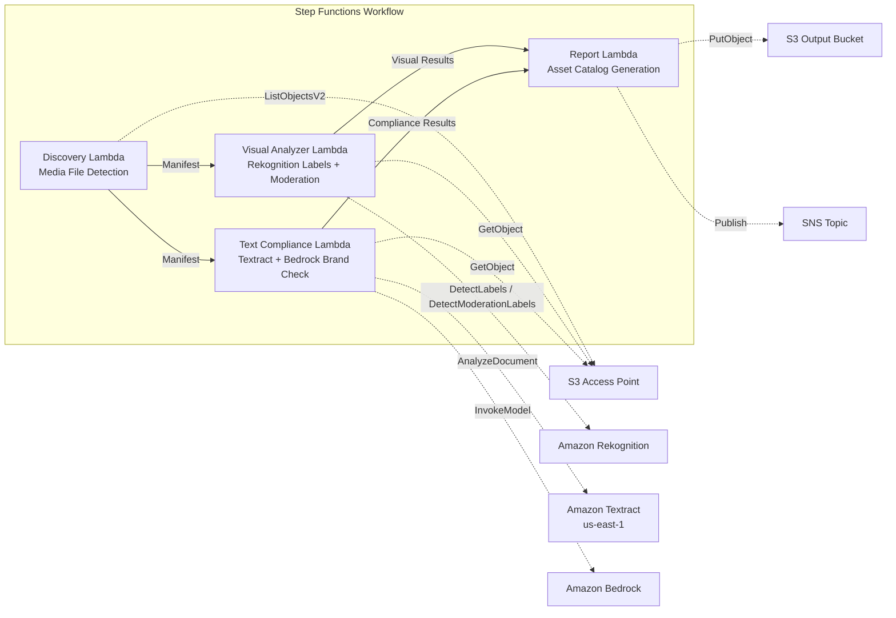

# UC19: Advertising & Marketing / Creative Asset Management — Asset Cataloging and Brand Compliance Check

🌐 **Language / 言語**: [日本語](README.md) | English | [한국어](README.ko.md) | [简体中文](README.zh-CN.md) | [繁體中文](README.zh-TW.md) | [Français](README.fr.md) | [Deutsch](README.de.md) | [Español](README.es.md)

📚 **Documentation**: [Architecture Diagram](docs/architecture.en.md) | [Demo Guide](docs/demo-guide.en.md)

## Overview

A serverless workflow leveraging S3 Access Points on Amazon FSx for ONTAP to automate creative asset cataloging, visual analysis, text compliance checking, and brand guideline validation for advertising creatives (images and videos).

### When This Pattern Is Suitable

- Creative assets (JPEG, PNG, TIFF, MP4, MOV, PSD) are stored on FSx ONTAP
- You need Rekognition-based visual metadata extraction (labels, text detection, moderation)
- You want to automate brand terminology compliance checking via Textract + Bedrock
- You need auto-generated asset catalogs (JSON/CSV) with centralized compliance status
- You want to automatically flag moderation-violating assets and integrate with human review workflows

### When This Pattern Is Not Suitable

- Real-time video streaming review is needed (sub-second response)
- A full DAM (Digital Asset Management) platform is required
- Large-scale video editing/rendering pipeline is needed
- Network reachability to ONTAP REST API cannot be ensured

### Main Features

- Automatic detection of creative assets (JPEG/PNG/TIFF/MP4/MOV/PSD) via S3 AP
- Rekognition label extraction (up to 50 tags/asset) + moderation inspection
- Textract text overlay extraction
- Bedrock brand terminology guideline compliance checking
- Asset catalog generation (JSON + CSV, one record per asset)
- Automatic flagging of moderation violations ("requires-review")

## Success Metrics

### Outcome
Automate creative asset cataloging and brand compliance checking to streamline quality control in advertising production workflows.

### Metrics
| Metric | Target Value (Example) |
|--------|----------------------|
| Assets processed / execution | > 100 assets |
| Compliance check accuracy | > 95% |
| Moderation detection rate | > 98% |
| Report generation time | < 3 min / batch |
| Cost / daily execution | < $2.00 |
| Human Review required rate | > 10% (moderation-flagged assets require full review) |

### Measurement Method
Step Functions execution history, Rekognition label/moderation results, Textract extraction results, Bedrock brand check inference logs, CloudWatch EMF Metrics (ProcessingDuration, SuccessCount, ErrorCount).

### Human Review Requirements
- Assets with moderation violations (confidence ≥ 80%) are flagged as "requires-review" for human confirmation
- Brand guideline non-compliant assets are reviewed by the marketing team
- Monthly compliance reports are reviewed by the creative director

## Architecture



## Prerequisites

- AWS account with appropriate IAM permissions
- FSx for ONTAP file system (ONTAP 9.17.1P4D3 or later)
- S3 Access Point enabled volume (storing creative assets)
- VPC and private subnets
- Amazon Bedrock model access enabled (Claude / Nova)
- Amazon Rekognition available in the deployment region
- Amazon Textract available (cross-region invocation to us-east-1)

> **S3 AP NetworkOrigin Note**: The Discovery Lambda is deployed inside a VPC. If the S3 Access Point's NetworkOrigin is `Internet`, it cannot be accessed via S3 Gateway VPC Endpoint (requests are not routed to the FSx data plane). Use a VPC-origin S3 AP or configure NAT Gateway access. See [S3AP Compatibility Notes](../docs/s3ap-compatibility-notes.md).

## Deployment

```bash
aws cloudformation deploy \
  --template-file adtech-creative-management/template.yaml \
  --stack-name fsxn-adtech-creative \
  --parameter-overrides \
    S3AccessPointAlias=<your-volume-ext-s3alias> \
    S3AccessPointName=<your-s3ap-name> \
    VpcId=<your-vpc-id> \
    PrivateSubnetIds=<subnet-1>,<subnet-2> \
    ScheduleExpression="cron(0 0 * * ? *)" \
    NotificationEmail=<your-email@example.com> \
    BrandGuidelinesS3Key=brand-guidelines.json \
    ModerationConfidenceThreshold=80 \
    MaxTagsPerAsset=50 \
  --capabilities CAPABILITY_IAM CAPABILITY_AUTO_EXPAND \
  --region ap-northeast-1
```


## ⚠️ Performance Considerations

- FSx for ONTAP throughput capacity is **shared across NFS/SMB/S3 AP**. Running MapConcurrency=10 in parallel may impact other workloads on the same volume.
- For large batch processing, check FSx ONTAP Throughput Capacity (MBps) and adjust MapConcurrency accordingly.
- Recommended: Start with MapConcurrency=5 in production, monitor FSx ONTAP CloudWatch metrics (ThroughputUtilization), and increase gradually.

## Cleanup

```bash
aws s3 rm s3://fsxn-adtech-creative-output-${AWS_ACCOUNT_ID} --recursive
aws cloudformation delete-stack --stack-name fsxn-adtech-creative --region ap-northeast-1
aws cloudformation wait stack-delete-complete --stack-name fsxn-adtech-creative --region ap-northeast-1
```

## Governance Note

> This pattern provides technical architecture guidance. It does not constitute legal, compliance, or regulatory advice. Organizations must consult qualified professionals. Creative compliance checking is AI-assisted; final decisions must be made by humans. Compliance with industry-specific advertising regulations requires separate verification.

> **Related Regulations**: 景品表示法 (Act against Unjustifiable Premiums and Misleading Representations), 個人情報保護法 (APPI)

## S3AP Compatibility

See [S3AP Compatibility Notes](../docs/s3ap-compatibility-notes.md) for FSx for ONTAP S3 Access Point constraints, troubleshooting, and trigger patterns.
