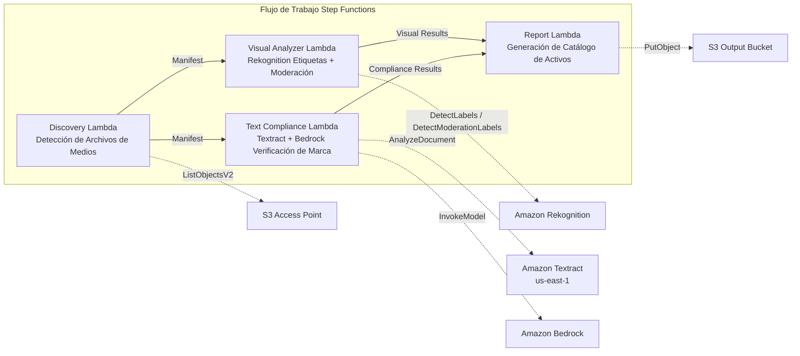

# UC19: Publicidad y Marketing / Gestión de Activos Creativos — Catalogación de Activos y Verificación de Cumplimiento de Marca

🌐 **Language / Idioma**: [日本語](README.md) | [English](README.en.md) | [한국어](README.ko.md) | [简体中文](README.zh-CN.md) | [繁體中文](README.zh-TW.md) | [Français](README.fr.md) | [Deutsch](README.de.md) | Español

📚 **Documentación**: [Diagrama de Arquitectura](docs/architecture.es.md) | [Guía de Demostración](docs/demo-guide.es.md)

## Descripción General

Un flujo de trabajo serverless que aprovecha los S3 Access Points en Amazon FSx for ONTAP para automatizar la catalogación de activos creativos publicitarios, el análisis visual, la verificación de cumplimiento textual y la validación de directrices de marca.

### Casos de Uso Apropiados

- Los activos creativos (JPEG, PNG, TIFF, MP4, MOV, PSD) están almacenados en FSx ONTAP
- Se necesita extracción de metadatos visuales basada en Rekognition (etiquetas, detección de texto, moderación)
- Se desea automatizar la verificación de cumplimiento terminológico de marca mediante Textract + Bedrock
- Se requiere generación automática de catálogos de activos (JSON/CSV) con gestión centralizada de cumplimiento
- Se desea el señalamiento automático de activos con violaciones de moderación e integración con flujos de revisión humana

### Casos de Uso No Apropiados

- Se requiere revisión de transmisión de video en tiempo real (respuesta inferior a un segundo)
- Se necesita una plataforma DAM (Digital Asset Management) completa
- Se requiere un pipeline de edición/renderizado de video a gran escala
- No se puede garantizar la conectividad de red a la API REST de ONTAP

## Success Metrics

### Outcome
Automatizar la catalogación de activos creativos y la verificación de cumplimiento de marca para optimizar el control de calidad en los flujos de producción publicitaria.

### Metrics
| Métrica | Valor Objetivo (Ejemplo) |
|---------|------------------------|
| Activos procesados / ejecución | > 100 activos |
| Precisión de verificación de cumplimiento | > 95% |
| Tasa de detección de moderación | > 98% |
| Tiempo de generación de informe | < 3 min / lote |
| Costo / ejecución diaria | < $2.00 |
| Tasa de revisión humana requerida | > 10% (activos señalados requieren revisión completa) |

### Human Review Requirements
- Los activos con violaciones de moderación (confidence ≥ 80%) se señalan como "requires-review" para confirmación humana
- Los activos no conformes con las directrices de marca son revisados por el equipo de marketing
- Los informes mensuales de cumplimiento son revisados por el director creativo

## Arquitectura

## Nota de Gobernanza

> Este patrón proporciona orientación de arquitectura técnica. No constituye asesoramiento legal, de cumplimiento o regulatorio. Las organizaciones deben consultar profesionales calificados.

## Compatibilidad S3AP

Para las restricciones de compatibilidad, solución de problemas y patrones de activación de los S3 Access Points de FSx for ONTAP, consulte [S3AP Compatibility Notes](../docs/s3ap-compatibility-notes.md).

## ⚠️ Consideraciones de rendimiento

- La capacidad de rendimiento de FSx for ONTAP se **comparte entre NFS/SMB/S3 AP**. Ejecutar con MapConcurrency=10 en paralelo puede afectar otras cargas de trabajo en el mismo volumen.
- Para el procesamiento por lotes de gran volumen, verifique la Throughput Capacity (MBps) de FSx ONTAP y ajuste MapConcurrency en consecuencia.
- Recomendado: Comience con MapConcurrency=5 en producción, monitoree las métricas de CloudWatch (ThroughputUtilization) y aumente gradualmente.

> **Nota S3 AP NetworkOrigin**: La Lambda Discovery se despliega dentro de un VPC. Si el NetworkOrigin del S3 Access Point es `Internet`, no se puede acceder a través del S3 Gateway VPC Endpoint (las solicitudes no se enrutan al plano de datos FSx). Use un S3 AP de tipo VPC-origin o configure el acceso mediante NAT Gateway. Ver [Notas de compatibilidad S3AP](../docs/s3ap-compatibility-notes.md).

> **Related Regulations**: 景品表示法 (Act against Unjustifiable Premiums and Misleading Representations), 個人情報保護法 (APPI)
