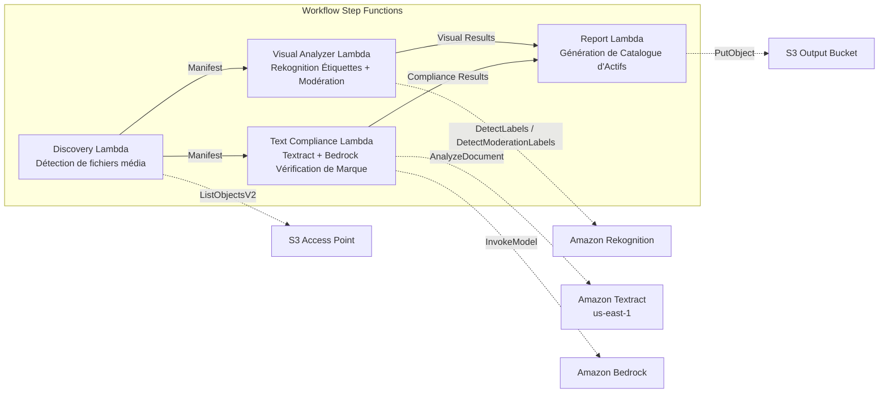

# UC19 : Publicité et Marketing / Gestion des Actifs Créatifs — Catalogage et Vérification de Conformité de Marque

🌐 **Language / Langue** : [日本語](README.md) | [English](README.en.md) | [한국어](README.ko.md) | [简体中文](README.zh-CN.md) | [繁體中文](README.zh-TW.md) | Français | [Deutsch](README.de.md) | [Español](README.es.md)

📚 **Documentation** : [Diagramme d'Architecture](docs/architecture.fr.md) | [Guide de Démonstration](docs/demo-guide.fr.md)

## Présentation

Un workflow serverless exploitant les S3 Access Points sur Amazon FSx for ONTAP pour automatiser le catalogage des actifs créatifs publicitaires, l'analyse visuelle, la vérification de conformité textuelle et la validation des directives de marque.

### Cas d'utilisation appropriés

- Les actifs créatifs (JPEG, PNG, TIFF, MP4, MOV, PSD) sont stockés sur FSx ONTAP
- Extraction de métadonnées visuelles basée sur Rekognition (étiquettes, détection de texte, modération)
- Automatisation de la vérification de conformité terminologique via Textract + Bedrock
- Génération automatique de catalogues d'actifs (JSON/CSV) avec gestion centralisée de la conformité
- Signalement automatique des actifs en violation de modération avec intégration au workflow de révision humaine

### Cas d'utilisation non appropriés

- Révision de streaming vidéo en temps réel requise (réponse inférieure à la seconde)
- Plateforme DAM (Digital Asset Management) complète requise
- Pipeline d'édition/rendu vidéo à grande échelle requis
- Connectivité réseau vers l'API REST ONTAP non assurée

## Success Metrics

### Outcome
Automatiser le catalogage des actifs créatifs et la vérification de conformité de marque pour rationaliser le contrôle qualité dans les workflows de production publicitaire.

### Metrics
| Métrique | Valeur Cible (Exemple) |
|----------|----------------------|
| Actifs traités / exécution | > 100 actifs |
| Précision de vérification de conformité | > 95% |
| Taux de détection de modération | > 98% |
| Temps de génération de rapport | < 3 min / lot |
| Coût / exécution quotidienne | < 2,00 $ |
| Taux de révision humaine requise | > 10% (actifs signalés nécessitent une révision complète) |

### Human Review Requirements
- Les actifs avec violations de modération (confidence ≥ 80%) sont signalés "requires-review" pour confirmation humaine
- Les actifs non conformes aux directives de marque sont révisés par l'équipe marketing
- Les rapports de conformité mensuels sont révisés par le directeur créatif

## Architecture

## Note de Gouvernance

> Ce pattern fournit des orientations d'architecture technique. Il ne constitue pas un conseil juridique, de conformité ou réglementaire. Les organisations doivent consulter des professionnels qualifiés.

## Compatibilité S3AP

Pour les contraintes de compatibilité, le dépannage et les patterns de déclenchement des S3 Access Points FSx for ONTAP, voir [S3AP Compatibility Notes](../docs/s3ap-compatibility-notes.md).

## ⚠️ Considérations de performance

- La capacité de débit de FSx for ONTAP est **partagée entre NFS/SMB/S3 AP**. L'exécution avec MapConcurrency=10 en parallèle peut impacter d'autres charges de travail sur le même volume.
- Pour le traitement par lots volumineux, vérifiez la Throughput Capacity (MBps) de FSx ONTAP et ajustez MapConcurrency en conséquence.
- Recommandé : Commencez avec MapConcurrency=5 en production, surveillez les métriques CloudWatch (ThroughputUtilization) et augmentez progressivement.

> **Note S3 AP NetworkOrigin** : La Lambda Discovery est déployée dans un VPC. Si le NetworkOrigin du S3 Access Point est `Internet`, l'accès via S3 Gateway VPC Endpoint n'est pas possible (les requêtes ne sont pas routées vers le plan de données FSx). Utilisez un S3 AP VPC-origin ou configurez l'accès via NAT Gateway. Voir [Notes de compatibilité S3AP](../docs/s3ap-compatibility-notes.md).

> **Related Regulations**: 景品表示法 (Act against Unjustifiable Premiums and Misleading Representations), 個人情報保護法 (APPI)
