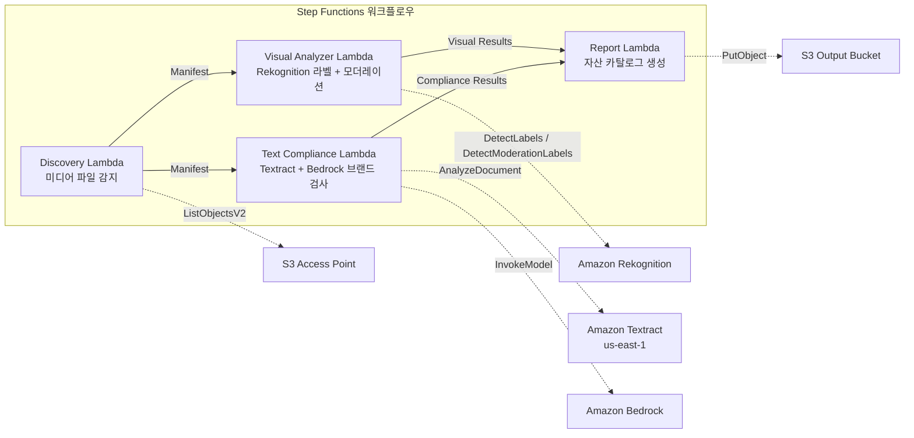

# UC19: 광고·마케팅 / 크리에이티브 자산 관리 — 자산 카탈로그화 및 브랜드 준수 검사

🌐 **Language / 언어**: [日本語](README.md) | [English](README.en.md) | 한국어 | [简体中文](README.zh-CN.md) | [繁體中文](README.zh-TW.md) | [Français](README.fr.md) | [Deutsch](README.de.md) | [Español](README.es.md)

📚 **문서**: [아키텍처 다이어그램](docs/architecture.ko.md) | [데모 가이드](docs/demo-guide.ko.md)

## 개요

FSx for ONTAP의 S3 Access Points를 활용하여 광고 크리에이티브 자산(이미지·동영상)의 자동 카탈로그화, 비주얼 분석, 텍스트 준수 검사, 브랜드 가이드라인 검증을 실현하는 서버리스 워크플로우입니다.

### 이 패턴이 적합한 경우

- 크리에이티브 자산(JPEG, PNG, TIFF, MP4, MOV, PSD)이 FSx for ONTAP에 저장되어 있음
- Rekognition 기반 비주얼 메타데이터 추출(라벨, 텍스트 감지, 모더레이션)이 필요함
- Textract + Bedrock을 통한 브랜드 용어 준수 검사를 자동화하고 싶음
- 자산 카탈로그(JSON/CSV) 자동 생성 및 준수 상태 통합 관리가 필요함
- 모더레이션 위반 자산의 자동 플래그 지정 및 인간 리뷰 워크플로우 통합이 필요함

### 이 패턴이 적합하지 않은 경우

- 실시간 동영상 스트리밍 심사가 필요(초 단위 응답)
- 완전한 DAM(Digital Asset Management) 플랫폼이 필요
- 대규모 동영상 편집/렌더링 파이프라인이 필요
- ONTAP REST API에 대한 네트워크 도달성을 확보할 수 없는 환경

## Success Metrics

### Outcome
크리에이티브 자산 카탈로그화와 브랜드 준수 검사를 자동화하여 광고 제작 워크플로우의 품질 관리를 효율화합니다.

### Metrics
| 지표 | 목표값(예시) |
|------|------------|
| 처리된 자산 수 / 실행 | > 100 assets |
| 준수 검사 정확도 | > 95% |
| 모더레이션 감지율 | > 98% |
| 보고서 생성 시간 | < 3분 / 배치 |
| 비용 / 일일 실행 | < $2.00 |
| 인간 리뷰 필요율 | > 10%(모더레이션 플래그 자산은 전건 확인) |

### Human Review Requirements
- 모더레이션 위반(confidence ≥ 80%) 자산은 "requires-review"로 플래그 지정하여 인간이 확인
- 브랜드 가이드라인 비준수 자산은 마케팅 팀이 리뷰
- 월간 준수 보고서는 크리에이티브 디렉터가 확인

## 아키텍처

## ⚠️ 성능 고려사항

- FSx for ONTAP의 처리량 용량은 **NFS/SMB/S3 AP에서 공유**됩니다. MapConcurrency=10으로 병렬 처리 시 동일 볼륨의 다른 워크로드에 영향을 줄 수 있습니다.
- 대량 파일 일괄 처리 시 FSx for ONTAP의 Throughput Capacity (MBps)를 확인하고 MapConcurrency를 조정하세요.
- 권장: 프로덕션 환경에서는 MapConcurrency=5로 시작하고 CloudWatch 메트릭 (ThroughputUtilization)을 모니터링하면서 점진적으로 증가시키세요.

## Governance Note

> 본 패턴은 기술 아키텍처 가이던스를 제공합니다. 법적·컴플라이언스·규제상의 조언이 아닙니다. 조직은 적격한 전문가와 상담하세요.

> **Related Regulations**: 景品表示法 (Act against Unjustifiable Premiums and Misleading Representations), 個人情報保護法 (APPI)

## S3AP Compatibility

FSx for ONTAP S3 Access Points의 호환성 제약, 트러블슈팅, 트리거 패턴에 대해서는 [S3AP Compatibility Notes](../docs/s3ap-compatibility-notes.md)를 참조하세요.

> **S3 AP NetworkOrigin 참고**: Discovery Lambda는 VPC 내에 배포됩니다. S3 Access Point의 NetworkOrigin이 `Internet`인 경우 S3 Gateway VPC Endpoint를 통해 액세스할 수 없습니다 (FSx 데이터 플레인으로 라우팅되지 않음). VPC-origin S3 AP를 사용하거나 NAT Gateway 액세스를 구성하세요. [S3AP 호환성 참고](../docs/s3ap-compatibility-notes.md)를 참조하세요.
