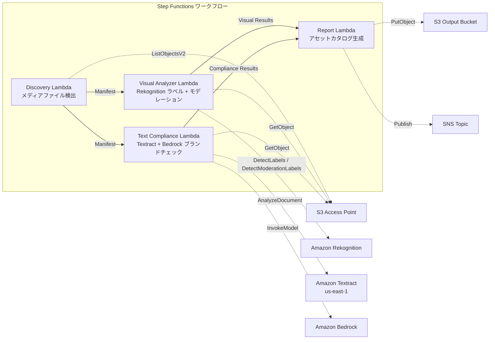

# UC19: 広告・マーケティング / クリエイティブアセット管理 — アセットカタログ化とブランドコンプライアンスチェック

🌐 **Language / 言語**: 日本語 | [English](README.en.md) | [한국어](README.ko.md) | [简体中文](README.zh-CN.md) | [繁體中文](README.zh-TW.md) | [Français](README.fr.md) | [Deutsch](README.de.md) | [Español](README.es.md)

📚 **ドキュメント**: [アーキテクチャ図](docs/architecture.md) | [デモガイド](docs/demo-guide.md)

## 概要

FSx for ONTAP の S3 Access Points を活用し、広告クリエイティブアセット（画像・動画）の自動カタログ化、ビジュアル分析、テキストコンプライアンスチェック、ブランドガイドライン準拠検証を実現するサーバーレスワークフローです。

### このパターンが適しているケース

- クリエイティブアセット（JPEG, PNG, TIFF, MP4, MOV, PSD）が FSx for ONTAP 上に蓄積されている
- Rekognition によるビジュアルメタデータ抽出（ラベル、テキスト検出、モデレーション）を実施したい
- Textract + Bedrock によるテキストオーバーレイのブランド用語準拠チェックを自動化したい
- アセットカタログ（JSON/CSV）を自動生成し、コンプライアンス状態を一元管理したい
- モデレーション違反アセットを自動フラグ付けし、人間レビューのワークフローに組み込みたい

### このパターンが適さないケース

- リアルタイムの動画ストリーミング審査が必要（秒単位の即応性）
- 完全な DAM（Digital Asset Management）プラットフォームが必要
- 大規模な動画編集・レンダリングパイプラインが必要
- ONTAP REST API へのネットワーク到達性が確保できない環境

### 主な機能

- S3 AP 経由でクリエイティブアセット（JPEG/PNG/TIFF/MP4/MOV/PSD）を自動検出
- Rekognition によるラベル抽出（最大 50 タグ/アセット）+ モデレーション検査
- Textract によるテキストオーバーレイ抽出
- Bedrock によるブランド用語ガイドライン準拠チェック
- アセットカタログ生成（JSON + CSV、1 レコード/アセット）
- モデレーション違反の自動フラグ付け（"requires-review"）

## Success Metrics

### Outcome
クリエイティブアセットのカタログ化とブランドコンプライアンスチェックを自動化し、広告制作ワークフローの品質管理を効率化する。

### Metrics
| メトリクス | 目標値（例） |
|-----------|------------|
| 処理済みアセット数 / 実行 | > 100 assets |
| コンプライアンスチェック精度 | > 95% |
| モデレーション検出率 | > 98% |
| レポート生成時間 | < 3 分 / バッチ |
| コスト / 日次実行 | < $2.00 |
| Human Review 必須率 | > 10%（モデレーションフラグ付きは全件確認） |

### Measurement Method
Step Functions 実行履歴、Rekognition ラベル/モデレーション結果、Textract 抽出結果、Bedrock ブランドチェック推論ログ、CloudWatch EMF Metrics（ProcessingDuration, SuccessCount, ErrorCount）。

### Human Review Requirements
- モデレーション違反（confidence ≥ 80%）のアセットは "requires-review" としてフラグ付けし、人間が確認
- ブランドガイドライン非準拠アセットはマーケティングチームがレビュー
- 月次コンプライアンスレポートはクリエイティブディレクターが確認

## アーキテクチャ



### ワークフローステップ

1. **Discovery**: S3 AP からクリエイティブアセットファイルを検出（フォーマット + サイズフィルタ）
2. **Visual Analyzer**: Rekognition でラベル抽出（最大 50 タグ）+ モデレーション検査
3. **Text Compliance**: Textract でテキストオーバーレイ抽出 → Bedrock でブランドガイドライン準拠チェック
4. **Report**: アセットカタログ生成（JSON + CSV）+ モデレーション違反フラグ + SNS 通知

## 前提条件

> **S3 AP NetworkOrigin 注意**: Discovery Lambda は VPC 内に配置されます。S3 Access Point の NetworkOrigin が `Internet` の場合、S3 Gateway VPC Endpoint 経由ではアクセスできません（FSx データプレーンにルーティングされないため）。NetworkOrigin=VPC の S3 AP を使用するか、NAT Gateway 経由のアクセスを設定してください。詳細は [S3AP Compatibility Notes](../docs/s3ap-compatibility-notes.md) を参照。

- AWS アカウントと適切な IAM 権限
- FSx for ONTAP ファイルシステム（ONTAP 9.17.1P4D3 以上）
- S3 Access Point が有効化されたボリューム（クリエイティブアセットを格納）
- VPC、プライベートサブネット
- Amazon Bedrock モデルアクセスが有効（Claude / Nova）
- Amazon Rekognition が利用可能なリージョン
- Amazon Textract が利用可能（us-east-1 へのクロスリージョン呼び出し使用）

## デプロイ手順

### 1. パラメータの確認

ブランドガイドラインの JSON ファイルとモデレーション閾値を事前に確認します。

### 2. CloudFormation デプロイ

```bash
aws cloudformation deploy \
  --template-file adtech-creative-management/template.yaml \
  --stack-name fsxn-adtech-creative \
  --parameter-overrides \
    S3AccessPointAlias=<your-volume-ext-s3alias> \
    S3AccessPointName=<your-s3ap-name> \
    VpcId=<your-vpc-id> \
    PrivateSubnetIds=<subnet-1>,<subnet-2> \
    ScheduleExpression="cron(0 0 * * ? *)" \
    NotificationEmail=<your-email@example.com> \
    BrandGuidelinesS3Key=brand-guidelines.json \
    ModerationConfidenceThreshold=80 \
    MaxTagsPerAsset=50 \
    EnableVpcEndpoints=false \
    EnableCloudWatchAlarms=false \
  --capabilities CAPABILITY_IAM CAPABILITY_AUTO_EXPAND \
  --region ap-northeast-1
```

## 設定パラメータ一覧

| パラメータ | 説明 | デフォルト | 必須 |
|-----------|------|----------|------|
| `S3AccessPointAlias` | FSx for ONTAP S3 AP Alias（入力用） | — | ✅ |
| `S3AccessPointName` | S3 AP 名（ARN ベースの IAM 権限付与用） | `""` | ⚠️ 推奨 |
| `ScheduleExpression` | EventBridge Scheduler のスケジュール式 | `cron(0 0 * * ? *)` | |
| `VpcId` | VPC ID | — | ✅ |
| `PrivateSubnetIds` | プライベートサブネット ID リスト | — | ✅ |
| `NotificationEmail` | SNS 通知先メールアドレス | — | ✅ |
| `BrandGuidelinesS3Key` | ブランド用語ガイドライン JSON ファイルの S3 キー | — | ✅ |
| `ModerationConfidenceThreshold` | モデレーション信頼度閾値（%） | `80` | |
| `MaxTagsPerAsset` | アセットあたりの最大タグ数 | `50` | |
| `MapConcurrency` | Map ステートの並列実行数 | `10` | |
| `LambdaMemorySize` | Lambda メモリサイズ (MB) | `512` | |
| `LambdaTimeout` | Lambda タイムアウト (秒) | `300` | |
| `EnableVpcEndpoints` | Interface VPC Endpoints の有効化 | `false` | |
| `EnableCloudWatchAlarms` | CloudWatch Alarms の有効化 | `false` | |

## ⚠️ パフォーマンスに関する注意事項

- FSx for ONTAP のスループットキャパシティは **NFS/SMB/S3 AP 全体で共有**されます。MapConcurrency=10 で並列処理を行う場合、同一ボリュームの他のワークロードに影響する可能性があります。
- 大量ファイルの一括処理を行う場合は、FSx for ONTAP の Throughput Capacity (MBps) を確認し、必要に応じて MapConcurrency を調整してください。
- 推奨: 本番環境では最初に MapConcurrency=5 で開始し、FSx for ONTAP の CloudWatch メトリクス (ThroughputUtilization) を監視しながら段階的に増加させてください。

## クリーンアップ

```bash
aws s3 rm s3://fsxn-adtech-creative-output-${AWS_ACCOUNT_ID} --recursive

aws cloudformation delete-stack \
  --stack-name fsxn-adtech-creative \
  --region ap-northeast-1

aws cloudformation wait stack-delete-complete \
  --stack-name fsxn-adtech-creative \
  --region ap-northeast-1
```

## Supported Regions

UC19 は以下のサービスを使用します:

| サービス | リージョン制約 |
|---------|-------------|
| Amazon Rekognition | 対応リージョンを確認（[Rekognition 対応リージョン](https://docs.aws.amazon.com/general/latest/gr/rekognition.html)） |
| Amazon Textract | us-east-1（クロスリージョン呼び出し） |
| Amazon Bedrock | 対応リージョンを確認（[Bedrock 対応リージョン](https://docs.aws.amazon.com/general/latest/gr/bedrock.html)） |
| AWS X-Ray | ほぼ全リージョンで利用可能 |
| CloudWatch EMF | ほぼ全リージョンで利用可能 |

> UC19 は Textract でクロスリージョン呼び出し（us-east-1）を使用します。shared/cross_region_client.py で透過的に処理されます。

## 参考リンク

- [FSx for ONTAP S3 Access Points 概要](https://docs.aws.amazon.com/fsx/latest/ONTAPGuide/accessing-data-via-s3-access-points.html)
- [Amazon Rekognition ドキュメント](https://docs.aws.amazon.com/rekognition/latest/dg/what-is.html)
- [Amazon Textract ドキュメント](https://docs.aws.amazon.com/textract/latest/dg/what-is.html)
- [Amazon Bedrock API リファレンス](https://docs.aws.amazon.com/bedrock/latest/APIReference/API_runtime_InvokeModel.html)

---

## AWS ドキュメントリンク

| サービス | ドキュメント |
|---------|------------|
| FSx for ONTAP | [ユーザーガイド](https://docs.aws.amazon.com/fsx/latest/ONTAPGuide/what-is-fsx-ontap.html) |
| S3 Access Points | [S3 AP for FSx for ONTAP](https://docs.aws.amazon.com/fsx/latest/ONTAPGuide/s3-access-points.html) |
| Step Functions | [開発者ガイド](https://docs.aws.amazon.com/step-functions/latest/dg/welcome.html) |
| Amazon Rekognition | [開発者ガイド](https://docs.aws.amazon.com/rekognition/latest/dg/what-is.html) |
| Amazon Textract | [開発者ガイド](https://docs.aws.amazon.com/textract/latest/dg/what-is.html) |
| Amazon Bedrock | [ユーザーガイド](https://docs.aws.amazon.com/bedrock/latest/userguide/what-is-bedrock.html) |

### Well-Architected Framework 対応

| 柱 | 対応 |
|----|------|
| 運用上の優秀性 | X-Ray トレーシング、EMF メトリクス、コンプライアンス監視 |
| セキュリティ | 最小権限 IAM、KMS 暗号化、アセットアクセス制御 |
| 信頼性 | Step Functions Retry/Catch、exponential backoff (3 回リトライ) |
| パフォーマンス効率 | 並列画像処理、クロスリージョン Textract |
| コスト最適化 | サーバーレス、Rekognition 従量課金 |
| 持続可能性 | オンデマンド実行、差分処理 |

---

## コスト見積もり（月額概算）

> **注記**: 以下は ap-northeast-1 リージョンの概算であり、実際のコストは使用量により異なります。最新の料金は [AWS Pricing Calculator](https://calculator.aws/) で確認してください。

### サーバーレスコンポーネント（従量課金）

| サービス | 単価 | 想定使用量 | 月額概算 |
|---------|------|-----------|---------|
| Lambda | $0.0000166667/GB-sec | 4 関数 × 日次実行 | ~$1-3 |
| S3 API (GetObject/ListObjects) | $0.0047/10K requests | ~3K requests/日 | ~$0.45 |
| Step Functions | $0.025/1K state transitions | ~400 transitions/日 | ~$0.30 |
| Rekognition (DetectLabels) | $0.001/image | ~100 images/日 | ~$3.00 |
| Rekognition (DetectModerationLabels) | $0.001/image | ~100 images/日 | ~$3.00 |
| Textract (AnalyzeDocument) | $0.015/page | ~50 pages/日 | ~$0.75 |
| Bedrock (Nova Lite) | $0.00006/1K input tokens | ~20K tokens/実行 | ~$1-3 |
| SNS | $0.50/100K notifications | ~10 notifications/日 | ~$0.05 |
| CloudWatch Logs | $0.76/GB ingested | ~300 MB/月 | ~$0.23 |

### 固定コスト（FSx for ONTAP — 既存環境前提）

| コンポーネント | 月額 |
|--------------|------|
| FSx for ONTAP (128 MBps, 1 TB) | ~$230 (既存環境を共有) |
| S3 Access Point | 追加料金なし（S3 API 料金のみ） |

### 合計概算

| 構成 | 月額概算 |
|------|---------|
| 最小構成（日次 1 回実行、~50 アセット） | ~$5-10 |
| 標準構成（日次 + アラーム有効、~200 アセット） | ~$15-35 |
| 大規模構成（高頻度 + 大量アセット） | ~$50-150 |

> **Governance Caveat**: コスト見積もりは概算であり、保証値ではありません。実際の請求額は使用パターン、データ量、リージョンにより異なります。

---

## ローカルテスト

### Prerequisites チェック

```bash
# 前提条件の確認
aws --version          # AWS CLI v2
sam --version          # SAM CLI
python3 --version      # Python 3.9+
docker --version       # Docker (sam local 用)
aws sts get-caller-identity  # AWS 認証情報
```

### sam local invoke

```bash
# ビルド
sam build

# Discovery Lambda のローカル実行
sam local invoke DiscoveryFunction --event events/discovery-event.json

# 環境変数オーバーライド付き
sam local invoke DiscoveryFunction \
  --event events/discovery-event.json \
  --env-vars env.json
```

### ユニットテスト

```bash
python3 -m pytest tests/ -v
```

詳細は [ローカルテスト クイックスタート](../docs/local-testing-quick-start.md) を参照してください。

---

## Governance Note

> 本パターンは技術アーキテクチャガイダンスを提供します。法的・コンプライアンス・規制上の助言ではありません。組織は適格な専門家に相談してください。広告クリエイティブのコンプライアンスチェックは AI アシストであり、最終判断は人間が行う必要があります。業界固有の広告規制（薬機法、景品表示法等）への適合は別途確認が必要です。

> **関連規制**: 景品表示法、個人情報保護法

---

## S3AP Compatibility

S3 Access Points for FSx for ONTAP の互換性制約、トラブルシューティング、トリガーパターンについては [S3AP Compatibility Notes](../docs/s3ap-compatibility-notes.md) を参照してください。
