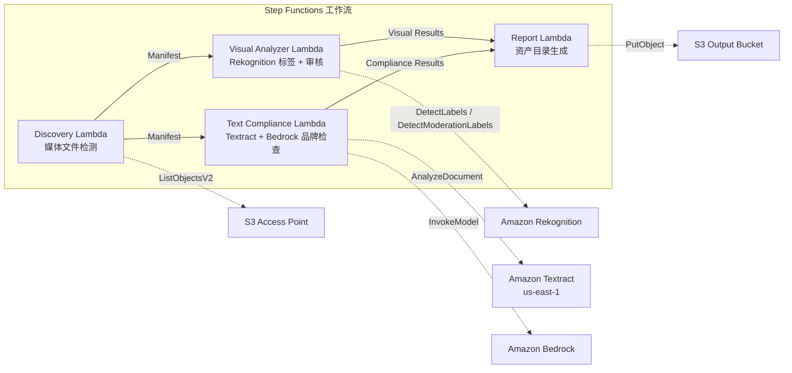

# UC19: 广告·营销 / 创意资产管理 — 资产编目与品牌合规检查

🌐 **Language / 语言**: [日本語](README.md) | [English](README.en.md) | [한국어](README.ko.md) | 简体中文 | [繁體中文](README.zh-TW.md) | [Français](README.fr.md) | [Deutsch](README.de.md) | [Español](README.es.md)

📚 **文档**: [架构图](docs/architecture.zh-CN.md) | [演示指南](docs/demo-guide.zh-CN.md)

## 概述

利用 FSx for ONTAP 的 S3 Access Points，实现广告创意资产（图像·视频）的自动编目、视觉分析、文本合规检查和品牌指南验证的无服务器工作流。

### 适用场景

- 创意资产（JPEG、PNG、TIFF、MP4、MOV、PSD）存储在 FSx ONTAP 上
- 需要基于 Rekognition 的视觉元数据提取（标签、文本检测、内容审核）
- 希望通过 Textract + Bedrock 自动化品牌术语合规检查
- 需要自动生成资产目录（JSON/CSV）并集中管理合规状态
- 希望自动标记审核违规资产并整合人工审核工作流

### 不适用场景

- 需要实时视频流审查（亚秒级响应）
- 需要完整的 DAM（数字资产管理）平台
- 需要大规模视频编辑/渲染管道
- 无法确保对 ONTAP REST API 的网络可达性

## Success Metrics

### Outcome
自动化创意资产编目和品牌合规检查，提高广告制作工作流的质量管理效率。

### Metrics
| 指标 | 目标值（示例） |
|------|------------|
| 处理资产数 / 次执行 | > 100 assets |
| 合规检查准确率 | > 95% |
| 审核检测率 | > 98% |
| 报告生成时间 | < 3 分钟 / 批次 |
| 成本 / 每日执行 | < $2.00 |
| 人工审核必要率 | > 10%（审核标记资产需全部确认） |

### Human Review Requirements
- 审核违规（confidence ≥ 80%）的资产标记为 "requires-review"，由人工确认
- 品牌指南不合规资产由营销团队审核
- 月度合规报告由创意总监确认

## 架构

## ⚠️ 性能注意事项

- FSx for ONTAP 的吞吐量容量在 **NFS/SMB/S3 AP 之间共享**。使用 MapConcurrency=10 进行并行处理时可能影响同一卷上的其他工作负载。
- 进行大规模批量处理时，请检查 FSx ONTAP 的 Throughput Capacity (MBps) 并相应调整 MapConcurrency。
- 建议：在生产环境中从 MapConcurrency=5 开始，监控 CloudWatch 指标 (ThroughputUtilization)，然后逐步增加。

## Governance Note

> 本模式提供技术架构指导，不构成法律、合规或监管建议。组织应咨询合格的专业人士。

> **Related Regulations**: 景品表示法 (Act against Unjustifiable Premiums and Misleading Representations), 個人情報保護法 (APPI)

## S3AP Compatibility

有关 FSx for ONTAP S3 Access Points 的兼容性约束、故障排除和触发模式，请参阅 [S3AP Compatibility Notes](../docs/s3ap-compatibility-notes.md)。

> **S3 AP NetworkOrigin 注意**: Discovery Lambda 部署在 VPC 内。如果 S3 Access Point 的 NetworkOrigin 为 `Internet`，则无法通过 S3 Gateway VPC Endpoint 访问（请求不会路由到 FSx 数据平面）。请使用 VPC-origin S3 AP 或配置 NAT Gateway 访问。详见 [S3AP 兼容性说明](../docs/s3ap-compatibility-notes.md)。
