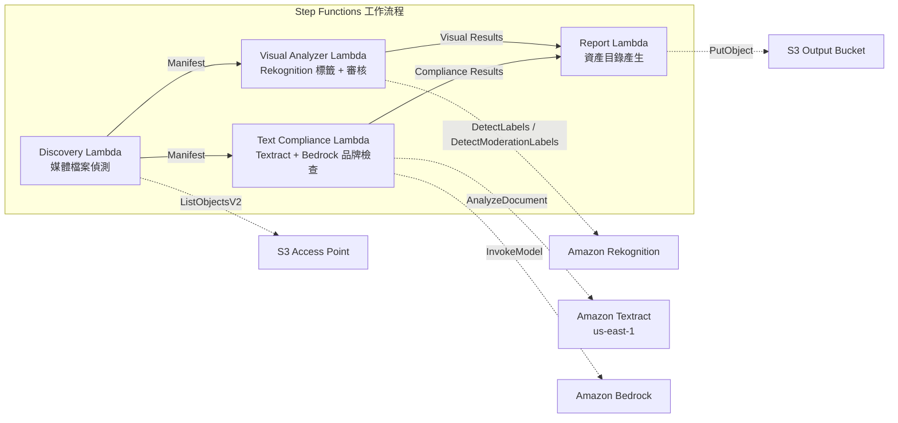

# UC19: 廣告·行銷 / 創意資產管理 — 資產編目與品牌合規檢查

🌐 **Language / 語言**: [日本語](README.md) | [English](README.en.md) | [한국어](README.ko.md) | [简体中文](README.zh-CN.md) | 繁體中文 | [Français](README.fr.md) | [Deutsch](README.de.md) | [Español](README.es.md)

📚 **文件**: [架構圖](docs/architecture.zh-TW.md) | [示範指南](docs/demo-guide.zh-TW.md)

## 概述

利用 FSx for ONTAP 的 S3 Access Points，實現廣告創意資產（圖像·影片）的自動編目、視覺分析、文字合規檢查和品牌指南驗證的無伺服器工作流程。

### 適用情境

- 創意資產（JPEG、PNG、TIFF、MP4、MOV、PSD）儲存於 FSx for ONTAP
- 需要基於 Rekognition 的視覺中繼資料提取（標籤、文字偵測、內容審核）
- 希望透過 Textract + Bedrock 自動化品牌用語合規檢查
- 需要自動生成資產目錄（JSON/CSV）並集中管理合規狀態
- 希望自動標記審核違規資產並整合人工審核工作流程

### 不適用情境

- 需要即時影片串流審查（亞秒級回應）
- 需要完整的 DAM（數位資產管理）平台
- 需要大規模影片編輯/算繪管線
- 無法確保對 ONTAP REST API 的網路可達性

## Success Metrics

### Outcome
自動化創意資產編目和品牌合規檢查，提升廣告製作工作流程的品質管理效率。

### Metrics
| 指標 | 目標值（範例） |
|------|------------|
| 處理資產數 / 次執行 | > 100 assets |
| 合規檢查準確率 | > 95% |
| 審核偵測率 | > 98% |
| 報告產生時間 | < 3 分鐘 / 批次 |
| 成本 / 每日執行 | < $2.00 |
| 人工審核必要率 | > 10%（審核標記資產需全部確認） |

### Human Review Requirements
- 審核違規（confidence ≥ 80%）的資產標記為 "requires-review"，由人工確認
- 品牌指南不合規資產由行銷團隊審核
- 月度合規報告由創意總監確認

## 架構

## ⚠️ 效能注意事項

- FSx for ONTAP 的吞吐量容量在 **NFS/SMB/S3 AP 之間共享**。使用 MapConcurrency=10 進行並行處理時可能影響同一卷上的其他工作負載。
- 進行大規模批量處理時，請檢查 FSx for ONTAP 的 Throughput Capacity (MBps) 並相應調整 MapConcurrency。
- 建議：在生產環境中從 MapConcurrency=5 開始，監控 CloudWatch 指標 (ThroughputUtilization)，然後逐步增加。

## Governance Note

> 本模式提供技術架構指引，不構成法律、合規或監管建議。組織應諮詢合格的專業人士。

> **Related Regulations**: 景品表示法 (Act against Unjustifiable Premiums and Misleading Representations), 個人情報保護法 (APPI)

## S3AP Compatibility

有關 FSx for ONTAP S3 Access Points 的相容性限制、疑難排解和觸發模式，請參閱 [S3AP Compatibility Notes](../docs/s3ap-compatibility-notes.md)。

> **S3 AP NetworkOrigin 注意**: Discovery Lambda 部署在 VPC 內。如果 S3 Access Point 的 NetworkOrigin 為 `Internet`，則無法透過 S3 Gateway VPC Endpoint 存取（請求不會路由到 FSx 資料平面）。請使用 VPC-origin S3 AP 或設定 NAT Gateway 存取。詳見 [S3AP 相容性說明](../docs/s3ap-compatibility-notes.md)。
