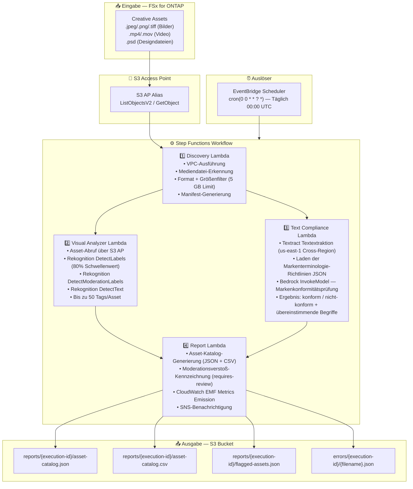

# UC19: Werbung & Marketing / Creative Asset Management — Asset-Katalogisierung und Markenkonformitätsprüfung

🌐 **Language / Sprache**: [日本語](architecture.md) | [English](architecture.en.md) | [한국어](architecture.ko.md) | [简体中文](architecture.zh-CN.md) | [繁體中文](architecture.zh-TW.md) | [Français](architecture.fr.md) | Deutsch | [Español](architecture.es.md)

## End-to-End-Architektur (Eingabe → Ausgabe)

---

## Architekturdiagramm

---

## Verwendete AWS-Services

| Service | Rolle |
|---------|-------|
| FSx for ONTAP | Creative Asset Speicher |
| S3 Access Points | Serverloser Zugriff auf ONTAP-Volumes |
| EventBridge Scheduler | Täglicher Auslöser (00:00 UTC) |
| Step Functions | Workflow-Orchestrierung (paralleler Map State) |
| Lambda | Compute (Discovery, Visual Analyzer, Text Compliance, Report) |
| Amazon Rekognition | Visuelle Analyse (Labels, Moderation, Texterkennung) |
| Amazon Textract | Text-Overlay-Extraktion (us-east-1 Cross-Region) |
| Amazon Bedrock | Markenrichtlinien-Konformitätsinferenz (Claude / Nova) |
| SNS | Moderationsverstoß-Alarmbenachrichtigung |
| CloudWatch + X-Ray | Observability (EMF Metrics, Tracing) |
