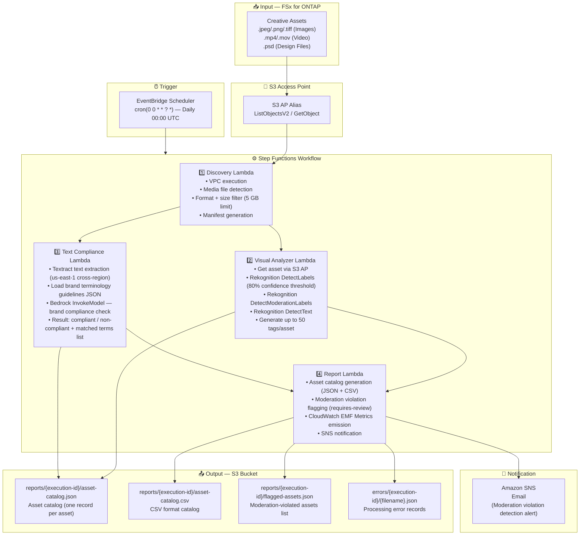

# UC19: Advertising & Marketing / Creative Asset Management — Asset Cataloging and Brand Compliance Check

🌐 **Language / 言語**: [日本語](architecture.md) | English | [한국어](architecture.ko.md) | [简体中文](architecture.zh-CN.md) | [繁體中文](architecture.zh-TW.md) | [Français](architecture.fr.md) | [Deutsch](architecture.de.md) | [Español](architecture.es.md)

## End-to-End Architecture (Input → Output)

---

## Architecture Diagram

---

## Data Flow Detail

### Input
| Item | Description |
|------|-------------|
| **Source** | FSx for ONTAP volume |
| **File Types** | .jpeg / .png / .tiff (images), .mp4 / .mov (video), .psd (design files) |
| **Access Method** | S3 Access Point (ListObjectsV2 + GetObject) |
| **Filter Strategy** | Media format filter + 5 GB size limit |

### Processing
| Step | Service | Processing |
|------|---------|------------|
| Discovery | Lambda (VPC) | Media file detection, format/size filter, manifest generation |
| Visual Analyzer | Lambda + Rekognition | DetectLabels (80% threshold), DetectModerationLabels, DetectText, tag generation (max 50) |
| Text Compliance | Lambda + Textract + Bedrock | Text overlay extraction, brand terminology guideline matching, compliant/non-compliant determination |
| Report | Lambda | Asset catalog generation (JSON + CSV), moderation violation flagging, SNS notification |

### Output
| Artifact | Format | Description |
|----------|--------|-------------|
| Asset Catalog (JSON) | `reports/{execution-id}/asset-catalog.json` | Labels, compliance status, tags for all processed assets |
| Asset Catalog (CSV) | `reports/{execution-id}/asset-catalog.csv` | CSV format catalog (for BI tool integration) |
| Flagged Assets | `reports/{execution-id}/flagged-assets.json` | Moderation-violated assets (violation_category, confidence, path) |
| Processing Errors | `errors/{execution-id}/{filename}.json` | File path, error type, timestamp |
| SNS Notification | Email | Moderation violation detection alert |

---

## Key Design Decisions

1. **Parallel Visual Analyzer and Text Compliance** — Image analysis and text compliance checking are independent. Parallelized via Step Functions Map State to reduce processing time
2. **Hybrid Rekognition + Bedrock Analysis** — Rekognition for quantitative label/moderation determination, Bedrock for contextual brand guideline compliance judgment
3. **Cross-Region Textract** — Textract requires us-east-1 for some features; cross-region invocation is transparently handled via shared/cross_region_client.py
4. **80% Moderation Threshold** — Balances reducing false positives while minimizing risk of missing problematic content
5. **JSON + CSV Dual Format Output** — JSON for API integration, CSV for BI tool / Excel review
6. **5 GB File Size Limit** — Practical limit considering S3 AP PutObject constraints and Lambda memory
7. **Polling-based** — S3 AP does not support event notifications; daily execution via EventBridge Scheduler

---

## AWS Services Used

| Service | Role |
|---------|------|
| FSx for ONTAP | Creative asset storage |
| S3 Access Points | Serverless access to ONTAP volumes |
| EventBridge Scheduler | Daily trigger (00:00 UTC) |
| Step Functions | Workflow orchestration (parallel Map State) |
| Lambda | Compute (Discovery, Visual Analyzer, Text Compliance, Report) |
| Amazon Rekognition | Visual analysis (labels, moderation, text detection) |
| Amazon Textract | Text overlay extraction (us-east-1 cross-region) |
| Amazon Bedrock | Brand guideline compliance inference (Claude / Nova) |
| SNS | Moderation violation alert notification |
| Secrets Manager | ONTAP REST API credential management |
| CloudWatch + X-Ray | Observability (EMF Metrics, tracing) |
