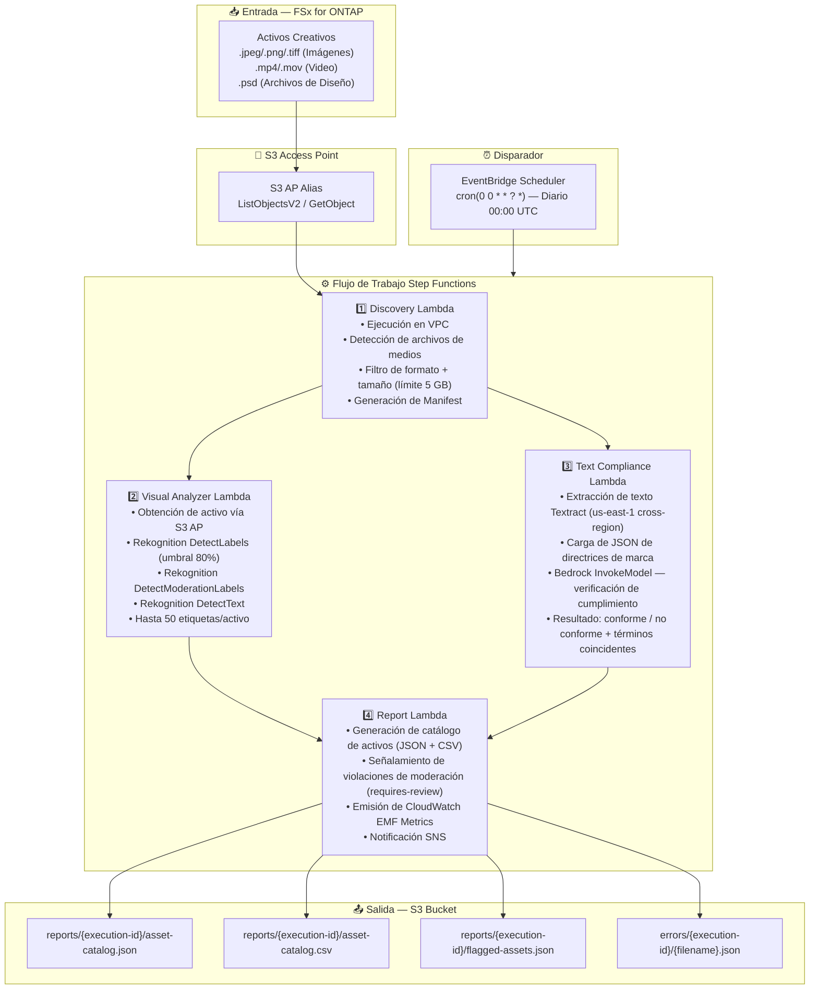

# UC19: Publicidad y Marketing / Gestión de Activos Creativos — Catalogación de Activos y Verificación de Cumplimiento de Marca

🌐 **Language / Idioma**: [日本語](architecture.md) | [English](architecture.en.md) | [한국어](architecture.ko.md) | [简体中文](architecture.zh-CN.md) | [繁體中文](architecture.zh-TW.md) | [Français](architecture.fr.md) | [Deutsch](architecture.de.md) | Español

## Arquitectura de Extremo a Extremo (Entrada → Salida)

---

## Diagrama de Arquitectura

---

## Servicios AWS Utilizados

| Servicio | Rol |
|----------|-----|
| FSx for ONTAP | Almacenamiento de activos creativos |
| S3 Access Points | Acceso serverless a volúmenes ONTAP |
| EventBridge Scheduler | Disparador diario (00:00 UTC) |
| Step Functions | Orquestación de flujo de trabajo (Map State paralelo) |
| Lambda | Cómputo (Discovery, Visual Analyzer, Text Compliance, Report) |
| Amazon Rekognition | Análisis visual (etiquetas, moderación, detección de texto) |
| Amazon Textract | Extracción de texto superpuesto (us-east-1 cross-region) |
| Amazon Bedrock | Inferencia de cumplimiento de marca (Claude / Nova) |
| SNS | Notificación de alerta de violación de moderación |
| CloudWatch + X-Ray | Observabilidad (EMF Metrics, rastreo) |
