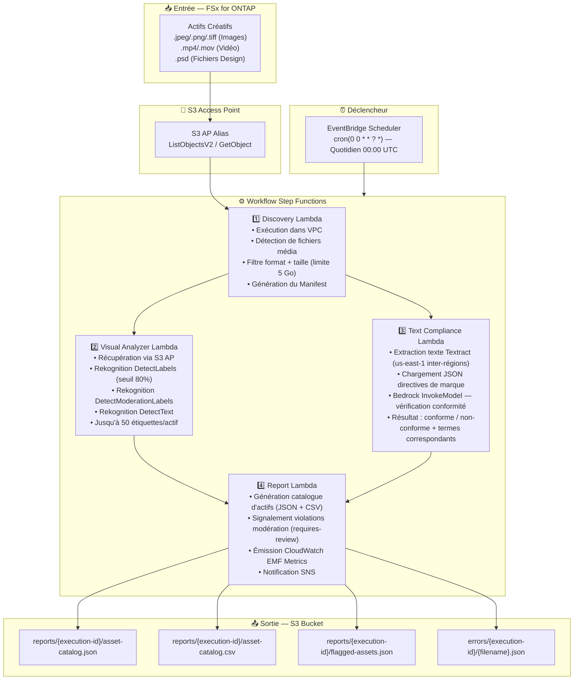

# UC19 : Publicité et Marketing / Gestion des Actifs Créatifs — Catalogage et Vérification de Conformité de Marque

🌐 **Language / Langue** : [日本語](architecture.md) | [English](architecture.en.md) | [한국어](architecture.ko.md) | [简体中文](architecture.zh-CN.md) | [繁體中文](architecture.zh-TW.md) | Français | [Deutsch](architecture.de.md) | [Español](architecture.es.md)

## Architecture de Bout en Bout (Entrée → Sortie)

---

## Diagramme d'Architecture

---

## Services AWS Utilisés

| Service | Rôle |
|---------|------|
| FSx for ONTAP | Stockage des actifs créatifs |
| S3 Access Points | Accès serverless aux volumes ONTAP |
| EventBridge Scheduler | Déclenchement quotidien (00:00 UTC) |
| Step Functions | Orchestration workflow (Map State parallèle) |
| Lambda | Calcul (Discovery, Visual Analyzer, Text Compliance, Report) |
| Amazon Rekognition | Analyse visuelle (étiquettes, modération, détection de texte) |
| Amazon Textract | Extraction de texte superposé (us-east-1 inter-régions) |
| Amazon Bedrock | Inférence conformité marque (Claude / Nova) |
| SNS | Notification d'alerte violation modération |
| CloudWatch + X-Ray | Observabilité (EMF Metrics, traçage) |
