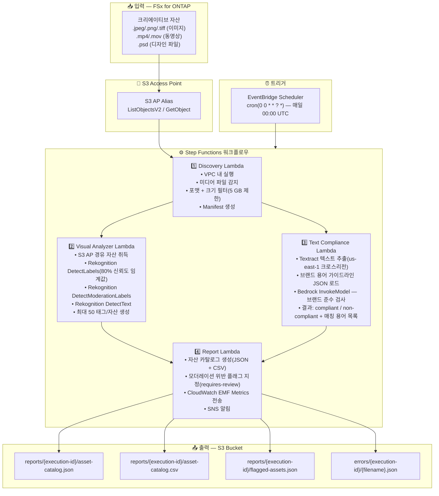

# UC19: 광고·마케팅 / 크리에이티브 자산 관리 — 자산 카탈로그화 및 브랜드 준수 검사

🌐 **Language / 언어**: [日本語](architecture.md) | [English](architecture.en.md) | 한국어 | [简体中文](architecture.zh-CN.md) | [繁體中文](architecture.zh-TW.md) | [Français](architecture.fr.md) | [Deutsch](architecture.de.md) | [Español](architecture.es.md)

## 엔드투엔드 아키텍처 (입력 → 출력)

---

## 아키텍처 다이어그램

---

## 사용 AWS 서비스

| 서비스 | 역할 |
|--------|------|
| FSx for ONTAP | 크리에이티브 자산 스토리지 |
| S3 Access Points | ONTAP 볼륨에 대한 서버리스 액세스 |
| EventBridge Scheduler | 일일 트리거(00:00 UTC) |
| Step Functions | 워크플로우 오케스트레이션(병렬 Map State) |
| Lambda | 컴퓨팅(Discovery, Visual Analyzer, Text Compliance, Report) |
| Amazon Rekognition | 비주얼 분석(라벨, 모더레이션, 텍스트 감지) |
| Amazon Textract | 텍스트 오버레이 추출(us-east-1 크로스리전) |
| Amazon Bedrock | 브랜드 가이드라인 준수 검사 추론(Claude / Nova) |
| SNS | 모더레이션 위반 알림 통지 |
| CloudWatch + X-Ray | 관측성(EMF Metrics, 트레이싱) |
