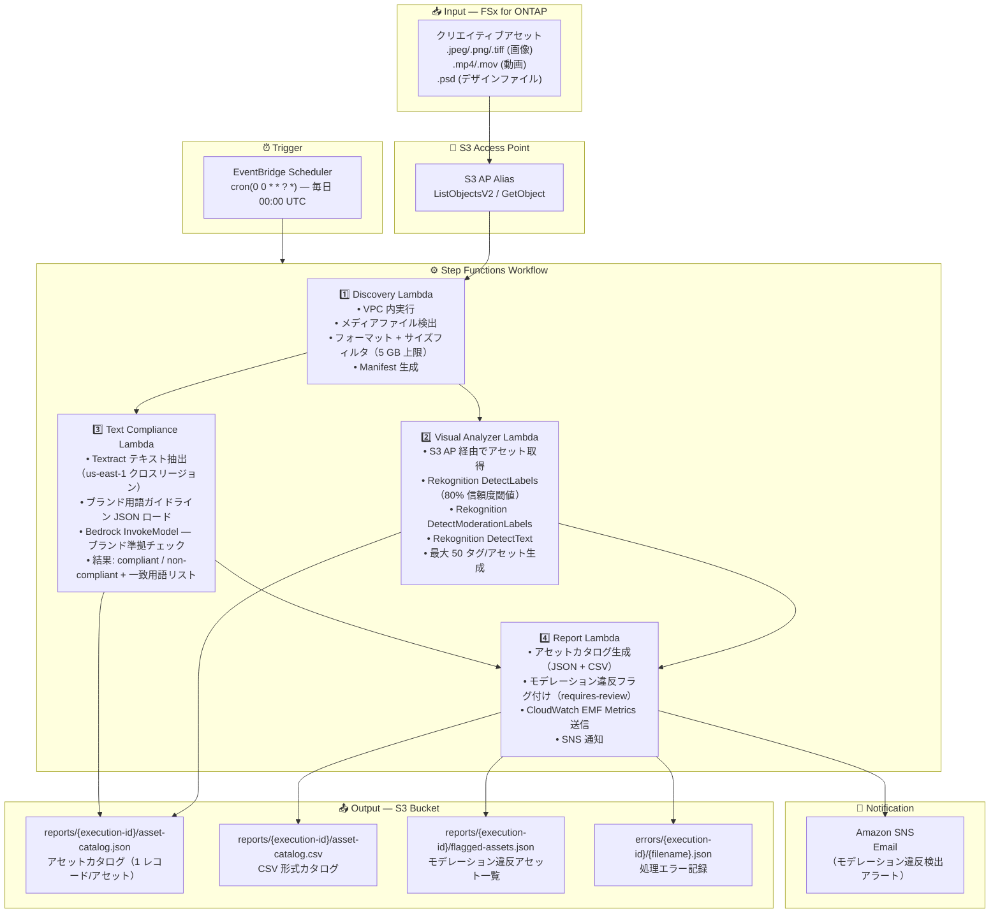

# UC19: 広告・マーケティング / クリエイティブアセット管理 — アセットカタログ化とブランドコンプライアンスチェック

🌐 **Language / 言語**: 日本語 | [English](architecture.en.md) | [한국어](architecture.ko.md) | [简体中文](architecture.zh-CN.md) | [繁體中文](architecture.zh-TW.md) | [Français](architecture.fr.md) | [Deutsch](architecture.de.md) | [Español](architecture.es.md)

## End-to-End Architecture (Input → Output)

---

## Architecture Diagram

---

## Data Flow Detail

### Input
| 項目 | 説明 |
|------|------|
| **ソース** | FSx for ONTAP ボリューム |
| **ファイル種別** | .jpeg / .png / .tiff（画像）、.mp4 / .mov（動画）、.psd（デザインファイル） |
| **アクセス方法** | S3 Access Point（ListObjectsV2 + GetObject） |
| **フィルタ戦略** | メディアフォーマットフィルタ + 5 GB サイズ上限 |

### Processing
| ステップ | サービス | 処理内容 |
|---------|---------|---------|
| Discovery | Lambda (VPC) | メディアファイル検出、フォーマット・サイズフィルタ、Manifest 生成 |
| Visual Analyzer | Lambda + Rekognition | DetectLabels（80% 閾値）、DetectModerationLabels、DetectText、タグ生成（最大 50） |
| Text Compliance | Lambda + Textract + Bedrock | テキストオーバーレイ抽出、ブランド用語ガイドライン照合、準拠/非準拠判定 |
| Report | Lambda | アセットカタログ生成（JSON + CSV）、モデレーション違反フラグ、SNS 通知 |

### Output
| アーティファクト | フォーマット | 説明 |
|--------------|---------|------|
| アセットカタログ（JSON） | `reports/{execution-id}/asset-catalog.json` | 全処理アセットのラベル、コンプライアンス状態、タグ |
| アセットカタログ（CSV） | `reports/{execution-id}/asset-catalog.csv` | CSV 形式のカタログ（BI ツール連携用） |
| フラグ付きアセット | `reports/{execution-id}/flagged-assets.json` | モデレーション違反アセット一覧（violation_category, confidence, path） |
| 処理エラー | `errors/{execution-id}/{filename}.json` | ファイルパス、エラータイプ、タイムスタンプ |
| SNS 通知 | Email | モデレーション違反検出アラート |

---

## Key Design Decisions

1. **Visual Analyzer と Text Compliance の並列処理** — 画像分析とテキストコンプライアンスチェックは独立。Step Functions の Map State で並列化し処理時間を短縮
2. **Rekognition + Bedrock のハイブリッド分析** — Rekognition で定量的なラベル/モデレーション判定、Bedrock でブランドガイドライン準拠の文脈的判断を分担
3. **Cross-Region Textract** — Textract は us-east-1 でのみ一部機能が利用可能なため、shared/cross_region_client.py でクロスリージョン呼び出しを透過化
4. **モデレーション 80% 閾値** — false positive を減らしつつ、問題コンテンツの見逃しリスクを最小化するバランスポイント
5. **JSON + CSV デュアルフォーマット出力** — JSON は API 連携用、CSV は BI ツール / Excel でのレビュー用
6. **5 GB ファイルサイズ上限** — S3 AP の PutObject 制限と Lambda メモリを考慮した実用的上限
7. **ポーリングベース** — S3 AP はイベント通知非対応のため、EventBridge Scheduler による日次実行

---

## AWS Services Used

| サービス | 役割 |
|---------|------|
| FSx for ONTAP | クリエイティブアセットのストレージ |
| S3 Access Points | ONTAP ボリュームへのサーバーレスアクセス |
| EventBridge Scheduler | 日次トリガー（00:00 UTC） |
| Step Functions | ワークフローオーケストレーション（並列 Map State） |
| Lambda | コンピュート（Discovery, Visual Analyzer, Text Compliance, Report） |
| Amazon Rekognition | ビジュアル分析（ラベル、モデレーション、テキスト検出） |
| Amazon Textract | テキストオーバーレイ抽出（us-east-1 クロスリージョン） |
| Amazon Bedrock | ブランドガイドライン準拠チェック推論（Claude / Nova） |
| SNS | モデレーション違反アラート通知 |
| Secrets Manager | ONTAP REST API 認証情報管理 |
| CloudWatch + X-Ray | オブザーバビリティ（EMF Metrics, トレーシング） |
