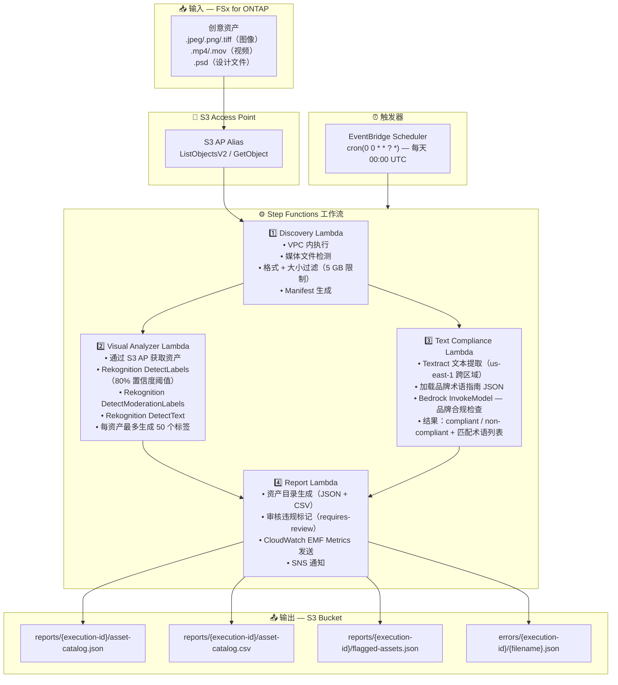

# UC19: 广告·营销 / 创意资产管理 — 资产编目与品牌合规检查

🌐 **Language / 语言**: [日本語](architecture.md) | [English](architecture.en.md) | [한국어](architecture.ko.md) | 简体中文 | [繁體中文](architecture.zh-TW.md) | [Français](architecture.fr.md) | [Deutsch](architecture.de.md) | [Español](architecture.es.md)

## 端到端架构（输入 → 输出）

---

## 架构图

---

## 使用的 AWS 服务

| 服务 | 角色 |
|------|------|
| FSx for ONTAP | 创意资产存储 |
| S3 Access Points | ONTAP 卷的无服务器访问 |
| EventBridge Scheduler | 每日触发（00:00 UTC） |
| Step Functions | 工作流编排（并行 Map State） |
| Lambda | 计算（Discovery、Visual Analyzer、Text Compliance、Report） |
| Amazon Rekognition | 视觉分析（标签、审核、文本检测） |
| Amazon Textract | 文本叠加提取（us-east-1 跨区域） |
| Amazon Bedrock | 品牌指南合规检查推理（Claude / Nova） |
| SNS | 审核违规警报通知 |
| CloudWatch + X-Ray | 可观测性（EMF Metrics、追踪） |
