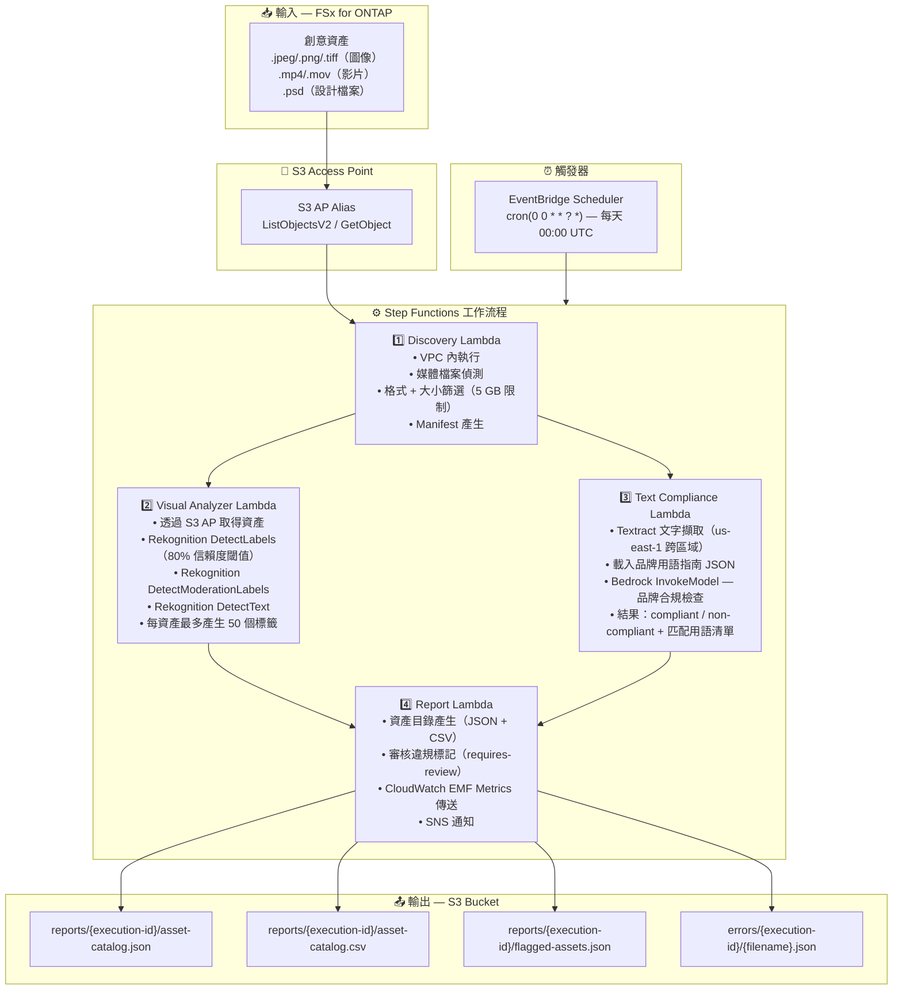

# UC19: 廣告·行銷 / 創意資產管理 — 資產編目與品牌合規檢查

🌐 **Language / 語言**: [日本語](architecture.md) | [English](architecture.en.md) | [한국어](architecture.ko.md) | [简体中文](architecture.zh-CN.md) | 繁體中文 | [Français](architecture.fr.md) | [Deutsch](architecture.de.md) | [Español](architecture.es.md)

## 端對端架構（輸入 → 輸出）

---

## 架構圖

---

## 使用的 AWS 服務

| 服務 | 角色 |
|------|------|
| FSx for ONTAP | 創意資產儲存 |
| S3 Access Points | ONTAP 磁碟區的無伺服器存取 |
| EventBridge Scheduler | 每日觸發（00:00 UTC） |
| Step Functions | 工作流程編排（平行 Map State） |
| Lambda | 運算（Discovery、Visual Analyzer、Text Compliance、Report） |
| Amazon Rekognition | 視覺分析（標籤、審核、文字偵測） |
| Amazon Textract | 文字疊加擷取（us-east-1 跨區域） |
| Amazon Bedrock | 品牌指南合規檢查推論（Claude / Nova） |
| SNS | 審核違規警示通知 |
| CloudWatch + X-Ray | 可觀測性（EMF Metrics、追蹤） |
