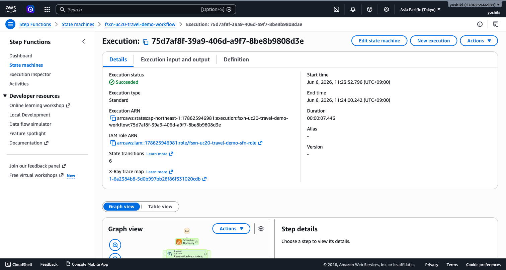

# Creative Asset Management — Demo-Leitfaden Asset-Katalogisierung und Markenkonformitätsprüfung

🌐 **Language / Sprache**: [日本語](demo-guide.md) | [English](demo-guide.en.md) | [한국어](demo-guide.ko.md) | [简体中文](demo-guide.zh-CN.md) | [繁體中文](demo-guide.zh-TW.md) | [Français](demo-guide.fr.md) | Deutsch | [Español](demo-guide.es.md)

## Zusammenfassung

Diese Demo zeigt eine automatisierte Pipeline zur Katalogisierung von Creative Assets und Markenkonformitätsprüfung. Die visuelle Analyse mit Rekognition in Kombination mit der Bedrock-Markenrichtlinienprüfung automatisiert die Qualitätskontrolle in der Werbeproduktion.

**Kernbotschaft**: KI analysiert automatisch Creative Assets, verifiziert die Einhaltung von Markenrichtlinien und generiert Asset-Kataloge.

**Geschätzte Zeit**: 3–5 Minuten

---

## Schrittweise Bereitstellung und Validierung

### Step 1: Voraussetzungen prüfen

```bash
aws --version          # AWS CLI v2 erforderlich
sam --version          # SAM CLI 1.x oder höher
python3 --version      # Python 3.9+
aws sts get-caller-identity
```

### Step 2: Repository klonen

```bash
git clone https://github.com/Yoshiki0705/fsxn-s3ap-serverless-patterns.git
cd fsxn-s3ap-serverless-patterns/adtech-creative-management
```

### Step 3: SAM Build und Deploy

```bash
sam build

sam deploy \
  --stack-name fsxn-adtech-demo \
  --parameter-overrides \
    S3AccessPointAlias=<your-s3ap-alias> \
    S3AccessPointName=<your-s3ap-name> \
    VpcId=<your-vpc-id> \
    PrivateSubnetIds=<subnet-1>,<subnet-2> \
    NotificationEmail=<your-email@example.com> \
    BrandGuidelinesS3Key=brand-guidelines.json \
    ModerationConfidenceThreshold=80 \
    MaxTagsPerAsset=50 \
  --capabilities CAPABILITY_IAM CAPABILITY_AUTO_EXPAND \
  --region ap-northeast-1
```

### Step 4: Workflow manuell ausführen

```bash
STATE_MACHINE_ARN=$(aws cloudformation describe-stacks \
  --stack-name fsxn-adtech-demo \
  --query "Stacks[0].Outputs[?OutputKey=='WorkflowStateMachineArn'].OutputValue" \
  --output text --region ap-northeast-1)

EXECUTION_ARN=$(aws stepfunctions start-execution \
  --state-machine-arn $STATE_MACHINE_ARN \
  --region ap-northeast-1 --query "executionArn" --output text)
```

### Step 5: Ergebnisse überprüfen

```bash
OUTPUT_BUCKET=$(aws cloudformation describe-stacks \
  --stack-name fsxn-adtech-demo \
  --query "Stacks[0].Outputs[?OutputKey=='OutputBucketName'].OutputValue" \
  --output text --region ap-northeast-1)

EXECUTION_ID=$(echo $EXECUTION_ARN | rev | cut -d':' -f1 | rev)
aws s3 cp s3://${OUTPUT_BUCKET}/reports/${EXECUTION_ID}/asset-catalog.json \
  - --region ap-northeast-1 | python3 -m json.tool
```

---

## Validierungs-Checkliste

| Prüfpunkt | Überprüfungsmethode | Erwartetes Ergebnis |
|-----------|--------------------|--------------------|
| Mediendatei-Erkennung | Step Functions Ausführungsprotokoll | Discovery-Schritt gibt Asset-Dateianzahl zurück |
| Label-Extraktion | `asset-catalog.json` | Bis zu 50 Tags pro Asset |
| Moderationsprüfung | `flagged-assets.json` | Problematischer Inhalt mit Flags gelistet |
| Markenkonformitätsprüfung | Feld compliance_status | Konform / nicht-konform korrekt bestimmt |
| SNS-Alarm | E-Mail prüfen | Benachrichtigung nur bei Moderationsverstößen |

---

---

## Screenshots




## Bereinigung

```bash
aws s3 rm s3://${OUTPUT_BUCKET} --recursive --region ap-northeast-1
aws cloudformation delete-stack --stack-name fsxn-adtech-demo --region ap-northeast-1
aws cloudformation wait stack-delete-complete --stack-name fsxn-adtech-demo --region ap-northeast-1
```

---

*Dieses Dokument dient als Produktionsleitfaden für technische Präsentations-Demo-Videos.*
