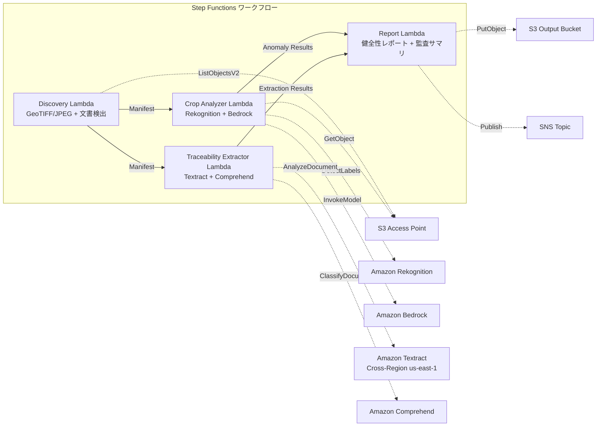

# UC21: 農業・食品 — 農地航空画像分析 / トレーサビリティ文書管理

🌐 **Language / 言語**: 日本語 | [English](README.en.md) | [한국어](README.ko.md) | [简体中文](README.zh-CN.md) | [繁體中文](README.zh-TW.md) | [Français](README.fr.md) | [Deutsch](README.de.md) | [Español](README.es.md)

📚 **ドキュメント**: [アーキテクチャ図](docs/architecture.md) | [デモガイド](docs/demo-guide.md)

## 概要

FSx for ONTAP の S3 Access Points を活用し、農地のドローン/航空画像から作物健全性を分析し、トレーサビリティ文書（収穫記録、出荷マニフェスト、検査証明書）の構造化データ抽出・ロット分類を自動化するサーバーレスワークフローです。

### このパターンが適しているケース

- ドローン/航空撮影画像（GeoTIFF、GPS 付き JPEG）が FSx ONTAP に蓄積されている
- 作物の健全性（病害虫、灌漑問題）を AI で自動検出したい
- トレーサビリティ文書からロット ID、日付、産地、責任者を自動抽出したい
- 食品安全コンプライアンス記録を効率的に管理したい
- 圃場ごとの異常カウントと影響エリアの可視化が必要

### このパターンが適さないケース

- リアルタイムのドローン制御・飛行管理が必要
- 精密農業プラットフォーム全体の構築が必要
- ONTAP REST API へのネットワーク到達性が確保できない環境

### 主な機能

- S3 AP 経由で GeoTIFF/JPEG（GPS メタデータ付き）画像を自動検出（最大 500 MB/画像）
- Rekognition + Bedrock による植生指数分析・異常分類（信頼度 ≥ 0.70 のみ保持）
- Textract + Comprehend によるトレーサビリティ文書の構造化データ抽出（分類信頼度 ≥ 0.80）
- 作物健全性レポート（圃場別異常カウント、異常タイプ、影響座標）
- トレーサビリティ監査サマリ（ロット別文書数、分類信頼度分布）

## Success Metrics

### Outcome
農地画像分析とトレーサビリティ文書管理の自動化により、農業協同組合の作物監視と食品安全コンプライアンスを効率化する。

### Metrics
| メトリクス | 目標値（例） |
|-----------|------------|
| 作物異常検出精度 | ≥ 70% confidence |
| トレーサビリティ分類率 | ≥ 80% confidence |
| 位置情報検証率 | ≥ 90% (GPS メタデータ付き画像) |
| レポート生成時間 | < 120 秒 / 実行 |
| コスト / 日次実行 | < $3.00 |
| Human Review 必須率 | > 20%（低信頼度検出・未検証位置） |

### Measurement Method
Step Functions 実行履歴、Rekognition/Bedrock 推論ログ、Textract/Comprehend 抽出結果、CloudWatch EMF Metrics。

### Human Review Requirements
- 信頼度 0.70–0.80 の異常検出は農業専門家が確認
- 位置情報未検証画像は手動で圃場マッピング
- 分類信頼度 0.80 未満のトレーサビリティ文書は "review-required" としてフラグ

## アーキテクチャ



## 前提条件

> **S3 AP NetworkOrigin 注意**: Discovery Lambda は VPC 内に配置されます。S3 Access Point の NetworkOrigin が `Internet` の場合、S3 Gateway VPC Endpoint 経由ではアクセスできません（FSx データプレーンにルーティングされないため）。NetworkOrigin=VPC の S3 AP を使用するか、NAT Gateway 経由のアクセスを設定してください。詳細は [S3AP Compatibility Notes](../docs/s3ap-compatibility-notes.md) を参照。

- AWS アカウントと適切な IAM 権限
- FSx for ONTAP ファイルシステム（ONTAP 9.17.1P4D3 以上）
- S3 Access Point が有効化されたボリューム
- VPC、プライベートサブネット
- Amazon Bedrock モデルアクセスが有効
- Amazon Textract — Cross-Region (us-east-1) 呼び出し設定

## デプロイ手順

```bash
aws cloudformation deploy \
  --template-file agri-food-traceability/template.yaml \
  --stack-name fsxn-agri-traceability \
  --parameter-overrides \
    S3AccessPointAlias=<your-volume-ext-s3alias> \
    S3AccessPointName=<your-s3ap-name> \
    VpcId=<your-vpc-id> \
    PrivateSubnetIds=<subnet-1>,<subnet-2> \
    ScheduleExpression="cron(0 0 * * ? *)" \
    NotificationEmail=<your-email@example.com> \
  --capabilities CAPABILITY_IAM CAPABILITY_AUTO_EXPAND \
  --region ap-northeast-1
```

> **LambdaMemorySize**: デフォルトは 512 MB です。500MB 画像処理時は 1024 推奨（`LambdaMemorySize=1024` をパラメータオーバーライドに追加）。

## コスト見積もり（月額概算）

| 構成 | 月額概算 |
|------|---------|
| 最小構成（日次 1 回） | ~$10-25 |
| 標準構成 | ~$25-60 |

---

## ⚠️ パフォーマンスに関する注意事項

- FSx for ONTAP のスループットキャパシティは **NFS/SMB/S3 AP 全体で共有**されます。MapConcurrency=10 で並列処理を行う場合、同一ボリュームの他のワークロードに影響する可能性があります。
- 大量ファイルの一括処理を行う場合は、FSx ONTAP の Throughput Capacity (MBps) を確認し、必要に応じて MapConcurrency を調整してください。
- 推奨: 本番環境では最初に MapConcurrency=5 で開始し、FSx ONTAP の CloudWatch メトリクス (ThroughputUtilization) を監視しながら段階的に増加させてください。

## Governance Note

> 本パターンは技術アーキテクチャガイダンスを提供します。法的・コンプライアンス・規制上の助言ではありません。食品トレーサビリティデータの取り扱いは、食品衛生法および食品表示法に準拠する必要があります。

> **関連規制**: 食品衛生法、食品表示法、JAS 法

---

## S3AP Compatibility

[S3AP Compatibility Notes](../docs/s3ap-compatibility-notes.md) を参照してください。
