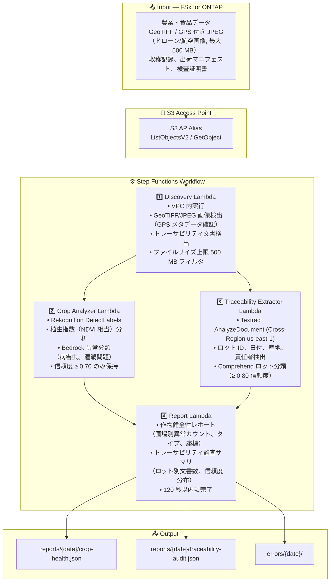

# UC21: 農業・食品 — 農地航空画像分析 / トレーサビリティ文書管理 アーキテクチャ

🌐 **Language / 言語**: 日本語 | [English](architecture.en.md) | [한국어](architecture.ko.md) | [简体中文](architecture.zh-CN.md) | [繁體中文](architecture.zh-TW.md) | [Français](architecture.fr.md) | [Deutsch](architecture.de.md) | [Español](architecture.es.md)

## Architecture Diagram

---

## Key Design Decisions

1. **GPS メタデータベース検出** — GeoTIFF/EXIF GPS データで地理的相関を実現
2. **信頼度閾値の二段階設計** — 作物異常 ≥ 0.70、トレーサビリティ分類 ≥ 0.80
3. **位置情報未検証への対応** — GPS データ欠損時は "location-unverified" として記録し処理継続
4. **120 秒以内のレポート生成** — Report Lambda の SLO 制約
5. **エラー分離** — 個別ファイル失敗がバッチ全体を停止させない

---

## AWS Services Used

| サービス | 役割 |
|---------|------|
| FSx for ONTAP | 農地画像・トレーサビリティ文書のストレージ |
| S3 Access Points | ONTAP ボリュームへのサーバーレスアクセス |
| Amazon Rekognition | 作物画像分析・異常検出 |
| Amazon Bedrock | 異常分類・植生指数解釈 |
| Amazon Textract | 文書解析（Cross-Region us-east-1） |
| Amazon Comprehend | ロット分類・エンティティ抽出 |
| Step Functions | ワークフローオーケストレーション |
| EventBridge Scheduler | 日次トリガー |
| CloudWatch + X-Ray | オブザーバビリティ |
