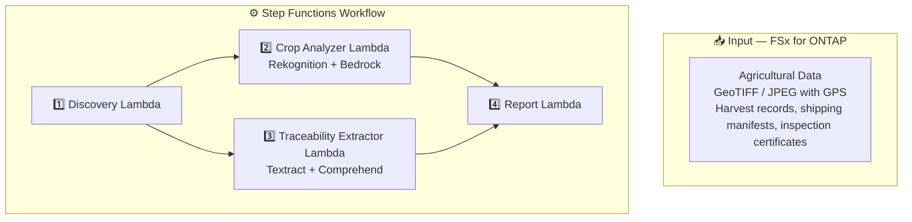

# UC21: Agriculture & Food — Architecture

🌐 **Language / 言語**: [日本語](architecture.md) | [English](architecture.en.md) | [한국어](architecture.ko.md) | [简体中文](architecture.zh-CN.md) | 繁體中文 | [Français](architecture.fr.md) | [Deutsch](architecture.de.md) | [Español](architecture.es.md)

## Architecture Diagram

## AWS Services Used

| Service | Role |
|---------|------|
| FSx for ONTAP | Farmland image and traceability document storage |
| Amazon Rekognition | Crop image analysis and anomaly detection |
| Amazon Bedrock | Anomaly classification and vegetation index interpretation |
| Amazon Textract | Document analysis (Cross-Region us-east-1) |
| Amazon Comprehend | Lot classification and entity extraction |

## Key Design Decisions

1. **GPS metadata-based detection** — GeoTIFF/EXIF GPS data for geographic correlation
2. **Dual confidence thresholds** — Crop anomaly >= 0.70, traceability classification >= 0.80
3. **Unverified location handling** — Missing GPS recorded as "location-unverified"
4. **120-second report SLO** — Report Lambda must complete within 120 seconds
5. **Error isolation** — Individual file failures do not stop the batch
