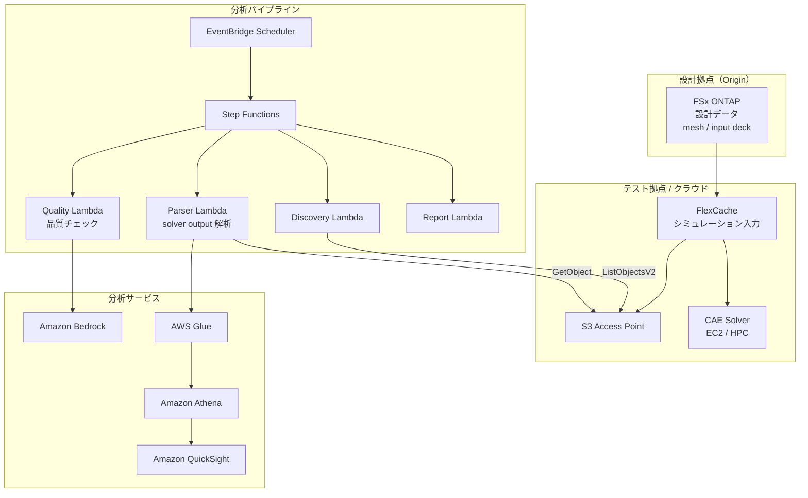

# Automotive CAE Analytics

🌐 **Language / 言語**: [日本語](README.md) | [English](README.en.md)

## 概要

自動車・航空宇宙・製造業の CAE（Computer-Aided Engineering）シミュレーションワークフローにおいて、FSx for ONTAP の FlexCache と S3 Access Points を活用し、シミュレーション入力データの拠点間共有、solver output の自動分析、テレメトリデータの品質分析を実現するパターン。

## 解決する課題

| 課題 | 本パターンによる解決 |
|------|-------------------|
| 設計拠点とテスト拠点間のデータ転送遅延 | FlexCache で拠点間データ共有 |
| シミュレーション結果の手動分析 | S3 AP + Lambda + Athena で自動分析 |
| 大量の solver output の管理 | Step Functions で自動分類・集計 |
| テレメトリデータの品質チェック | Bedrock による異常検知レポート |
| CAE ライセンスコストの最適化 | ジョブ時間短縮による効率化 |

## アーキテクチャ



## CAE データ分類

| データ種別 | アクセスパターン | 推奨配置 | S3 AP 利用 |
|-----------|---------------|---------|-----------|
| Mesh / Input Deck | 読み取り中心 | FlexCache | ✅ 分析用 |
| Solver Output | 書き込み → 読み取り | FSx native volume | ✅ 結果分析 |
| Telemetry | ストリーミング書き込み | FSx native volume | ✅ 品質チェック |
| Design Files (CAD) | 読み取り中心 | FlexCache | ⚠️ バイナリ |
| Reports | 生成 → 配布 | S3 Output Bucket | ❌ |

## 既存ユースケースとの関連

| 関連 UC | 関連ポイント |
|---------|------------|
| [manufacturing-analytics/](../manufacturing-analytics/) | IoT/品質分析パターンの共有 |
| [semiconductor-eda/](../semiconductor-eda/) | EDA ジョブ管理パターンの共有 |
| [Dynamic FlexCache Workflow](../dynamic-flexcache-render-workflow/) | ジョブ単位 FlexCache |

## ディレクトリ構成

```
automotive-cae/
├── README.md
├── template.yaml
├── functions/
│   ├── discovery/handler.py
│   ├── solver_output_parser/handler.py
│   ├── quality_check/handler.py
│   └── report_generation/handler.py
├── tests/
│   └── test_handlers.py
├── events/
│   └── sample-input.json
└── docs/
    ├── architecture.md
    ├── demo-guide.md
    ├── poc-checklist.md
    └── use-case-mapping.md
```

## 対象シミュレーション

- 衝突解析（LS-DYNA, Radioss）
- 流体解析（STAR-CCM+, Fluent）
- 構造解析（Nastran, Abaqus）
- 電磁界解析（HFSS, CST）
- マルチフィジックス（COMSOL）

## 関連リンク

- [manufacturing-analytics/](../manufacturing-analytics/README.md)
- [semiconductor-eda/](../semiconductor-eda/README.md)
- [Dynamic FlexCache Render Workflow](../dynamic-flexcache-render-workflow/README.md)
- [業界・ワークロード マッピング](../docs/industry-workload-mapping.md)
