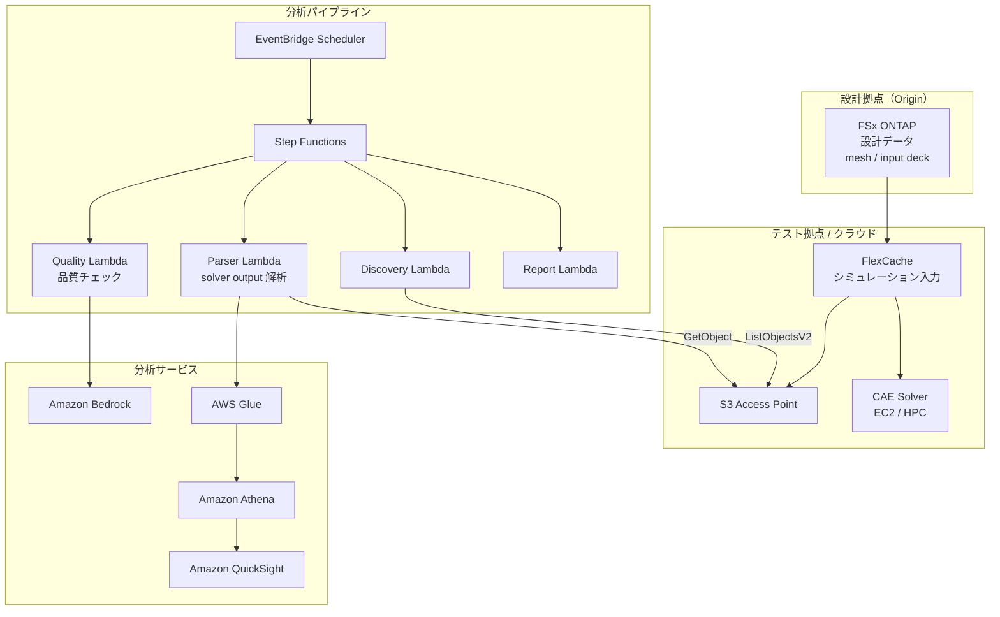

# Automotive CAE Analytics

🌐 **Language / 言語**: [日本語](README.md) | [English](README.en.md) | [한국어](README.ko.md) | [简体中文](README.zh-CN.md)

## 概要

自動車・航空宇宙・製造業の CAE（Computer-Aided Engineering）シミュレーションワークフローにおいて、FSx for ONTAP の FlexCache と S3 Access Points を活用し、シミュレーション入力データの拠点間共有、solver output の自動分析、テレメトリデータの品質分析を実現するパターン。

## 解決する課題

| 課題 | 本パターンによる解決 |
|------|-------------------|
| 設計拠点とテスト拠点間のデータ転送遅延 | FlexCache で拠点間データ共有 |
| シミュレーション結果の手動分析 | S3 AP + Lambda + Athena で自動分析 |
| 大量の solver output の管理 | Step Functions で自動分類・集計 |
| テレメトリデータの品質チェック | Bedrock による異常検知レポート |
| CAE ライセンスコストの最適化 | ジョブ時間短縮による効率化 |

## アーキテクチャ



## CAE データ分類

| データ種別 | アクセスパターン | 推奨配置 | S3 AP 利用 |
|-----------|---------------|---------|-----------|
| Mesh / Input Deck | 読み取り中心 | FlexCache | ✅ 分析用 |
| Solver Output | 書き込み → 読み取り | FSx native volume | ✅ 結果分析 |
| Telemetry | ストリーミング書き込み | FSx native volume | ✅ 品質チェック |
| Design Files (CAD) | 読み取り中心 | FlexCache | ⚠️ バイナリ |
| Reports | 生成 → 配布 | S3 Output Bucket | ❌ |

## 既存ユースケースとの関連

| 関連 UC | 関連ポイント |
|---------|------------|
| [manufacturing-analytics/](../manufacturing-analytics/) | IoT/品質分析パターンの共有 |
| [semiconductor-eda/](../semiconductor-eda/) | EDA ジョブ管理パターンの共有 |
| [Dynamic FlexCache Workflow](../dynamic-flexcache-render-workflow/) | ジョブ単位 FlexCache |

## ディレクトリ構成

```
automotive-cae/
├── README.md
├── template.yaml
├── functions/
│   ├── discovery/handler.py
│   ├── solver_output_parser/handler.py
│   ├── quality_check/handler.py
│   └── report_generation/handler.py
├── tests/
│   └── test_handlers.py
├── events/
│   └── sample-input.json
└── docs/
    ├── architecture.md
    ├── demo-guide.md
    ├── poc-checklist.md
    └── use-case-mapping.md
```

## 対象シミュレーション

- 衝突解析（LS-DYNA, Radioss）
- 流体解析（STAR-CCM+, Fluent）
- 構造解析（Nastran, Abaqus）
- 電磁界解析（HFSS, CST）
- マルチフィジックス（COMSOL）

## 関連リンク

- [manufacturing-analytics/](../manufacturing-analytics/README.md)
- [semiconductor-eda/](../semiconductor-eda/README.md)
- [Dynamic FlexCache Render Workflow](../dynamic-flexcache-render-workflow/README.md)
- [業界・ワークロード マッピング](../docs/industry-workload-mapping.md)


## Success Metrics

### Outcome
CAE シミュレーション結果の自動分析により、設計レビュー準備工数を削減する。

### Metrics
| メトリクス | 目標値（例） |
|-----------|------------|
| Solver output 解析ファイル数 / 実行 | > 50 files |
| 品質チェック通過率 | > 90% |
| Bedrock レポート生成時間 | < 3 分 |
| 設計レビュー準備工数の削減 | > 40% |
| Human Review 対象率 | < 15%（品質不合格ケース） |

### Measurement Method
Step Functions 実行履歴、Bedrock レポートメタデータ、CloudWatch Metrics。


---

## AWS ドキュメントリンク

| サービス | ドキュメント |
|---------|------------|
| FSx for ONTAP | [ユーザーガイド](https://docs.aws.amazon.com/fsx/latest/ONTAPGuide/what-is-fsx-ontap.html) |
| S3 Access Points for FSx ONTAP | [S3 AP ガイド](https://docs.aws.amazon.com/fsx/latest/ONTAPGuide/s3-access-points.html) |
| AWS Batch | [ユーザーガイド](https://docs.aws.amazon.com/batch/latest/userguide/what-is-batch.html) |
| AWS ParallelCluster | [ユーザーガイド](https://docs.aws.amazon.com/parallelcluster/latest/ug/what-is-aws-parallelcluster.html) |
| Amazon Athena | [ユーザーガイド](https://docs.aws.amazon.com/athena/latest/ug/what-is.html) |
| AWS Glue | [開発者ガイド](https://docs.aws.amazon.com/glue/latest/dg/what-is-glue.html) |
| Amazon Bedrock | [ユーザーガイド](https://docs.aws.amazon.com/bedrock/latest/userguide/what-is-bedrock.html) |
| Step Functions | [開発者ガイド](https://docs.aws.amazon.com/step-functions/latest/dg/welcome.html) |

### Well-Architected Framework 対応

| 柱 | 対応 |
|----|------|
| 運用上の優秀性 | 構造化ログ、CloudWatch Metrics、Bedrock レポート自動生成 |
| セキュリティ | IAM 最小権限、KMS 暗号化、VPC 分離 |
| 信頼性 | Step Functions Retry/Catch、Map state 並列処理 |
| パフォーマンス効率 | Lambda ARM64、Range GET（ヘッダー部分読み取り） |
| コスト最適化 | サーバーレス、Athena スキャン量最適化 |
| 持続可能性 | オンデマンド実行、不要リソースの自動停止 |

### 関連 AWS ソリューション

- [AWS HPC ソリューション](https://aws.amazon.com/hpc/)
- [Automotive Industry on AWS](https://aws.amazon.com/automotive/)
- [NICE DCV](https://aws.amazon.com/hpc/dcv/) — リモート可視化


---

## コスト見積もり（月額概算）

> **注記**: 以下は ap-northeast-1 リージョンの概算であり、実際のコストは使用量により異なります。最新の料金は [AWS Pricing Calculator](https://calculator.aws/) で確認してください。

### サーバーレスコンポーネント（従量課金）

| サービス | 単価 | 想定使用量 | 月額概算 |
|---------|------|-----------|---------|
| Lambda | $0.0000166667/GB-sec | 4 関数 × 20 simulations/日 | ~$1-5 |
| S3 API (GetObject/ListObjects) | $0.0047/10K requests | ~10K requests/日 | ~$1.5 |
| Step Functions | $0.025/1K state transitions | ~1K transitions/日 | ~$0.75 |
| Bedrock (Nova Lite) | $0.00006/1K input tokens | ~30K tokens/実行 | ~$3-10 |
| Athena | $5/TB scanned | ~20 MB/クエリ | ~$0.5-2 |
| SNS | $0.50/100K notifications | ~100 notifications/日 | ~$0.15 |
| CloudWatch Logs | $0.76/GB ingested | ~1 GB/月 | ~$0.76 |

### 固定コスト（FSx for ONTAP — 既存環境前提）

| コンポーネント | 月額 |
|--------------|------|
| FSx ONTAP (128 MBps, 1 TB) | ~$230 (既存環境を共有) |
| S3 Access Point | 追加料金なし（S3 API 料金のみ） |

### 合計概算

| 構成 | 月額概算 |
|------|---------|
| 最小構成（日次 1 回実行） | ~$5-15 |
| 標準構成（時次実行） | ~$15-50 |
| 大規模構成（高頻度 + アラーム） | ~$50-150 |

> **Governance Caveat**: コスト見積もりは概算であり、保証値ではありません。実際の請求額は使用パターン、データ量、リージョンにより異なります。

---

## ローカルテスト

### Prerequisites チェック

```bash
# 前提条件の確認
aws --version          # AWS CLI v2
sam --version          # SAM CLI
python3 --version      # Python 3.9+
docker --version       # Docker (sam local 用)
aws sts get-caller-identity  # AWS 認証情報
```

### sam local invoke

```bash
# ビルド
sam build

# Discovery Lambda のローカル実行
sam local invoke DiscoveryFunction --event events/discovery-event.json

# 環境変数オーバーライド付き
sam local invoke DiscoveryFunction \
  --event events/discovery-event.json \
  --env-vars env.json
```

### ユニットテスト

```bash
python3 -m pytest tests/ -v
```

詳細は [ローカルテスト クイックスタート](../docs/local-testing-quick-start.md) を参照してください。

---

## 出力サンプル (Output Sample)

CAE ソルバー出力解析パイプラインの出力例:

```json
{
  "discovery": {
    "status": "completed",
    "object_count": 6,
    "solver_types": {"ls-dyna": 3, "star-ccm": 2, "nastran": 1}
  },
  "analysis": [
    {
      "key": "cae-results/crash-sim-001.d3plot",
      "solver": "ls-dyna",
      "simulation_type": "crash",
      "max_displacement_mm": 45.2,
      "max_stress_mpa": 320.5,
      "energy_balance_error_pct": 0.3,
      "pass_criteria": true
    }
  ],
  "report": {
    "total_simulations": 6,
    "passed": 5,
    "failed": 1,
    "report_key": "reports/cae-review-2026-05-23.md",
    "recommendation": "1 simulation exceeded stress threshold - manual review required"
  }
}
```

> **注記**: 上記はサンプル出力であり、実際の値は環境・入力データにより異なります。ベンチマーク数値は sizing reference であり、service limit ではありません。

---

## Performance Considerations

- FSx for ONTAP のスループットキャパシティは NFS/SMB/S3AP で共有されます
- S3 Access Point 経由のレイテンシは数十ミリ秒のオーバーヘッドが発生します
- 大量ファイル処理時は Step Functions Map state の MaxConcurrency で並列度を制御してください
- Lambda メモリサイズの増加はネットワーク帯域幅の向上にも寄与します

> **注記**: 本パターンのパフォーマンス数値は sizing reference であり、service limit ではありません。実環境での性能は FSx ONTAP スループットキャパシティ、ネットワーク構成、同時実行ワークロードにより異なります。

---

## Governance Note

> 本パターンは技術アーキテクチャガイダンスを提供します。法的・コンプライアンス・規制上の助言ではありません。組織は適格な専門家に相談してください。
