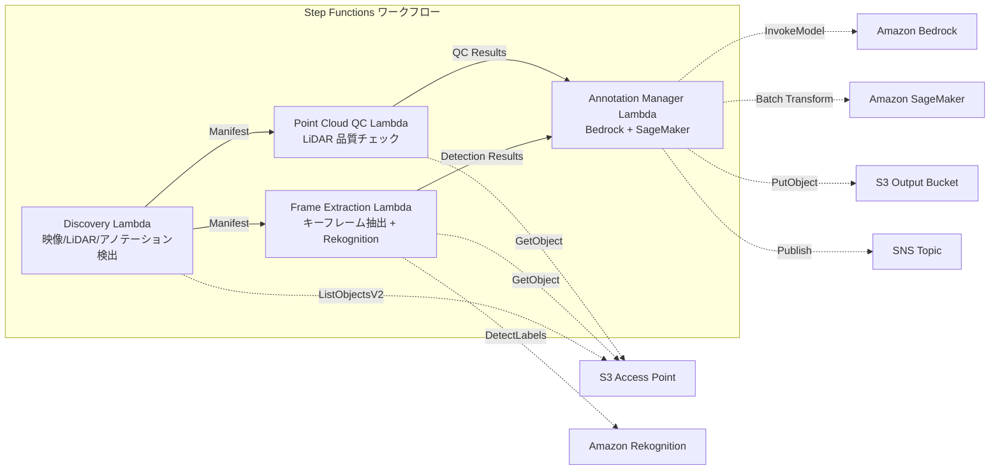

# UC9: Autonomes Fahren / ADAS — Bild-, LiDAR-Vorverarbeitung, Qualitätsprüfung, Annotation

🌐 **Language / 言語**: [日本語](README.md) | [English](README.en.md) | [한국어](README.ko.md) | [简体中文](README.zh-CN.md) | [繁體中文](README.zh-TW.md) | [Français](README.fr.md) | Deutsch | [Español](README.es.md)

## Übersicht
Serverlose Workflows zur Automatisierung der Vorverarbeitung, Qualitätsprüfung und Verwaltung von Anmerkungen für Dashcam-Videos und LiDAR-Punktwolkendaten unter Nutzung von S3 Access Points in FSx for NetApp ONTAP.
### Fälle, in denen dieses Muster geeignet ist
- Dashcam-Videos und LiDAR-Punktwolkendaten werden in großer Menge auf FSx ONTAP gespeichert.
- Wir möchten die Extraktion von Schlüsselbildern aus Videos und die Objekterkennung (Fahrzeuge, Fußgänger, Verkehrszeichen) automatisieren.
- Wir möchten regelmäßig Qualitätskontrollen für die LiDAR-Punktwolken durchführen (Punktdichte, Koordinatenübereinstimmung).
- Wir möchten die Annotationen-Metadaten im COCO-kompatiblen Format verwalten.
- Wir möchten Punktwolken-Segmentierungsinferenz durch SageMaker Batch Transform integrieren.
### Fälle, in denen dieses Muster nicht geeignet ist
- Eine Echtzeit-Autonomie-Inferenz-Pipeline ist erforderlich
- Große Mengen an Videotranscodierung (MediaConvert / EC2 sind geeignet)
- Vollständige LiDAR SLAM-Verarbeitung (HPC-Cluster sind geeignet)
- Umgebungen, in denen keine Netzwerkverbindung zur ONTAP REST API möglich ist
### Hauptfunktionen
- Automatische Erkennung von Videos (.mp4,.avi,.mkv), LiDAR (.pcd, .las,.laz, .ply) und Annotationen (.json) über S3 AP
- Objekterkennung mit Rekognition DetectLabels (Fahrzeuge, Fußgänger, Verkehrszeichen, Fahrbahnmarkierungen)
- Qualitätskontrolle von LiDAR-Punktwolken (Punktanzahl, Koordinatengrenzen, Punktdichte, NaN-Überprüfung)
- Generierung von Annotationsvorschlägen mit Bedrock
- Punktwolkensegmentierungsinferenz mit SageMaker Batch Transform
- Ausgabe von Annotationen im COCO-kompatiblen JSON-Format
## Architektur



### Workflow-Schritte
1. **Discovery**: Bild- und LiDAR-Dateien sowie Annotationen von S3 AP erkennen
2. **Frame Extraction**: Extraktion von Schlüsselbildern aus Videos und Objekterkennung mit Rekognition
3. **Point Cloud QC**: Extraktion von Header-Metadaten aus LiDAR-Punktwolken und Qualitätsüberprüfung
4. **Annotation Manager**: Generierung von Annotation-Vorschlägen mit Bedrock und Segmentierung von Punktwolken mit SageMaker
## Voraussetzungen
- AWS-Konto und angemessene IAM-Berechtigungen
- FSx for NetApp ONTAP-Dateisystem (ONTAP 9.17.1P4D3 oder höher)
- S3 Access Point aktivierte Volumes (zur Speicherung von Bildern und LiDAR-Daten)
- VPC, private Subnetz
- Amazon Bedrock-Modellzugriff aktiviert (Claude / Nova)
- SageMaker-Endpunkt (Punktwolkensegmentierungsmodell) – optional
## Bereitstellungsschritte

### 1. CloudFormation-Bereitstellung

```bash
aws cloudformation deploy \
  --template-file autonomous-driving/template.yaml \
  --stack-name fsxn-autonomous-driving \
  --parameter-overrides \
    S3AccessPointAlias=<your-volume-ext-s3alias> \
    S3AccessPointName=<your-s3ap-name> \
    VpcId=<your-vpc-id> \
    PrivateSubnetIds=<subnet-1>,<subnet-2> \
    ScheduleExpression="rate(1 hour)" \
    NotificationEmail=<your-email@example.com> \
    EnableVpcEndpoints=false \
    EnableCloudWatchAlarms=false \
  --capabilities CAPABILITY_IAM CAPABILITY_AUTO_EXPAND \
  --region ap-northeast-1
```

## Liste der Konfigurationsparameter

| パラメータ | 説明 | デフォルト | 必須 |
|-----------|------|----------|------|
| `S3AccessPointAlias` | FSx ONTAP S3 AP Alias（入力用） | — | ✅ |
| `S3AccessPointName` | S3 AP 名（ARN ベースの IAM 権限付与用。省略時は Alias ベースのみ） | `""` | ⚠️ 推奨 |
| `ScheduleExpression` | EventBridge Scheduler のスケジュール式 | `rate(1 hour)` | |
| `VpcId` | VPC ID | — | ✅ |
| `PrivateSubnetIds` | プライベートサブネット ID リスト | — | ✅ |
| `NotificationEmail` | SNS 通知先メールアドレス | — | ✅ |
| `FrameExtractionInterval` | キーフレーム抽出間隔（秒） | `5` | |
| `MapConcurrency` | Map ステートの並列実行数 | `5` | |
| `LambdaMemorySize` | Lambda メモリサイズ (MB) | `2048` | |
| `LambdaTimeout` | Lambda タイムアウト (秒) | `600` | |
| `EnableVpcEndpoints` | Interface VPC Endpoints の有効化 | `false` | |
| `EnableCloudWatchAlarms` | CloudWatch Alarms の有効化 | `false` | |

## Bereinigung

```bash
aws s3 rm s3://fsxn-autonomous-driving-output-${AWS_ACCOUNT_ID} --recursive

aws cloudformation delete-stack \
  --stack-name fsxn-autonomous-driving \
  --region ap-northeast-1

aws cloudformation wait stack-delete-complete \
  --stack-name fsxn-autonomous-driving \
  --region ap-northeast-1
```

## Referenz-Links
- [FSx ONTAP S3 Access Points 概要](https://docs.aws.amazon.com/fsx/latest/ONTAPGuide/accessing-data-via-s3-access-points.html)
- [Amazon Rekognition Labelerkennung](https://docs.aws.amazon.com/rekognition/latest/dg/labels.html)
- [Amazon SageMaker Batch Transform](https://docs.aws.amazon.com/sagemaker/latest/dg/batch-transform.html)
- [COCO Datenformat](https://cocodataset.org/#format-data)
- [LAS Dateiformat Spezifikation](https://www.asprs.org/divisions-committees/lidar-division/laser-las-file-format-exchange-activities)
## SageMaker Batch Transform-Integration (Phase 3)
In Phase 3 steht die **LiDAR-Punktwolken-Segmentierungsinferenz mit SageMaker Batch Transform** optional zur Verfügung. Es wird das Callback-Muster von Step Functions (`.waitForTaskToken`) verwendet, um asynchron auf den Abschluss des Batch-Inferenz-Jobs zu warten.
### Aktivierung

```bash
aws cloudformation deploy \
  --template-file autonomous-driving/template.yaml \
  --stack-name fsxn-autonomous-driving \
  --parameter-overrides \
    EnableSageMakerTransform=true \
    MockMode=true \
    ... # 他のパラメータ
  --capabilities CAPABILITY_IAM CAPABILITY_AUTO_EXPAND
```

### Workflow

```
Discovery → Frame Extraction → Point Cloud QC
  → [EnableSageMakerTransform=true] SageMaker Invoke (.waitForTaskToken)
  → SageMaker Batch Transform Job
  → EventBridge (job state change) → SageMaker Callback (SendTaskSuccess/Failure)
  → Annotation Manager (Rekognition + SageMaker 結果統合)
```

### Mock-Modus
Im Testmodus können Sie mit `MockMode=true` (Standardeinstellung) den Datenfluss des Callback-Musters überprüfen, ohne ein echtes SageMaker-Modell zu deployen.

- **MockMode=true**: Aufrufe der SageMaker-API werden nicht ausgeführt, sondern es wird eine Mock-Segmentierungsausgabe (mit einer zufälligen Anzahl von Labels, die der Eingabe point_count entspricht) generiert und direkt SendTaskSuccess aufgerufen.
- **MockMode=false**: Es wird tatsächlich ein SageMaker CreateTransformJob ausgeführt. Vorher muss das Modell deployt sein.
### Konfigurationsparameter (Phase 3 hinzugefügt)

| パラメータ | 説明 | デフォルト |
|-----------|------|----------|
| `EnableSageMakerTransform` | SageMaker Batch Transform の有効化 | `false` |
| `MockMode` | モックモード（テスト用） | `true` |
| `SageMakerModelName` | SageMaker モデル名 | — |
| `SageMakerInstanceType` | Batch Transform インスタンスタイプ | `ml.m5.xlarge` |

## Unterstützte Regionen
UC9 verwendet die folgenden Dienste:
| サービス | リージョン制約 |
|---------|-------------|
| Amazon Rekognition | ほぼ全リージョンで利用可能 |
| Amazon Bedrock | 対応リージョンを確認（[Bedrock 対応リージョン](https://docs.aws.amazon.com/general/latest/gr/bedrock.html)） |
| SageMaker Batch Transform | ほぼ全リージョンで利用可能（インスタンスタイプの可用性はリージョンにより異なる） |
| AWS X-Ray | ほぼ全リージョンで利用可能 |
| CloudWatch EMF | ほぼ全リージョンで利用可能 |
> Wenn Sie SageMaker Batch Transform aktivieren, überprüfen Sie vor dem Bereitstellen die Verfügbarkeit der Instanztypen in der Zielregion in der [AWS Regional Services List](https://aws.amazon.com/about-aws/global-infrastructure/regional-product-services/). Weitere Informationen finden Sie in der [Region Compatibility Matrix](../docs/region-compatibility.md).