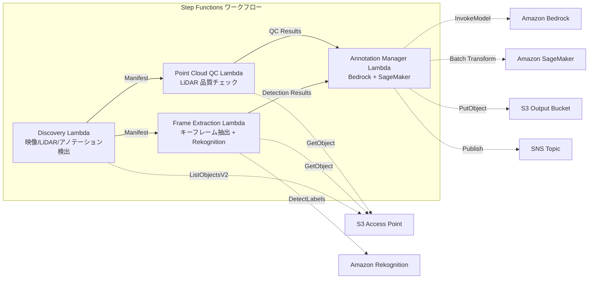

# UC9: Autonomous Driving / ADAS — Image and LiDAR Preprocessing, Quality Check, Annotation

🌐 **Language / 言語**: [日本語](README.md) | English | [한국어](README.ko.md) | [简体中文](README.zh-CN.md) | [繁體中文](README.zh-TW.md) | [Français](README.fr.md) | [Deutsch](README.de.md) | [Español](README.es.md)

📚 **Documentation**: [Architecture Diagram](docs/architecture.en.md) | [Demo Guide](docs/demo-guide.en.md)

## Overview
Leveraging S3 Access Points in Amazon FSx for NetApp ONTAP, this is a serverless workflow to automate the pre-processing, quality checks, and annotation management of dashcam footage and LiDAR point cloud data.
### When this pattern is suitable
- A large amount of dashcam footage and LiDAR point cloud data is being stored on FSx for NetApp ONTAP
- We want to automate keyframe extraction from the footage and object detection (vehicles, pedestrians, traffic signs)
- We want to regularly perform quality checks on the LiDAR point cloud (point density, coordinate consistency)
- We want to manage annotation metadata in COCO-compatible format
- We want to incorporate point cloud segmentation inference with SageMaker Batch Transform
### Cases where this pattern is not suitable
- A real-time automated driving inference pipeline is required
- Large-scale video transcoding (MediaConvert / EC2 is suitable)
- Complete LiDAR SLAM processing (HPC cluster is suitable)
- Environments where network reachability to the ONTAP REST API cannot be ensured
### Main Features
- Automatic detection of videos (.mp4,.avi,.mkv), LiDAR (.pcd,.las, .laz, .ply), and annotations (.json) via S3 AP
- Object detection (vehicles, pedestrians, traffic signs, lane markings) using Rekognition DetectLabels
- Quality check of LiDAR point clouds (point_count, coordinate_bounds, point_density, NaN validation)
- Generation of annotation suggestions using Bedrock
- Point cloud segmentation inference using SageMaker Batch Transform
- Annotation output in COCO compatible JSON format
## Architecture



### Workflow Steps
1. **Discovery**: Detect images, LiDAR, and annotation files from S3 AP
2. **Frame Extraction**: Extract key frames from images and perform object detection with Rekognition
3. **Point Cloud QC**: Extract header metadata from LiDAR point clouds and verify quality
4. **Annotation Manager**: Generate annotation suggestions with Bedrock, perform point cloud segmentation with SageMaker
## Prerequisites
- AWS account and appropriate IAM permissions
- FSx for NetApp ONTAP file system (ONTAP 9.17.1P4D3 or later)
- S3 Access Point enabled volume (to store imagery and LiDAR data)
- VPC, private subnets
- Amazon Bedrock model access enabled (Claude / Nova)
- SageMaker endpoint (point cloud segmentation model) — Optional
## Deployment steps

### 1. CloudFormation Deployment

```bash
aws cloudformation deploy \
  --template-file autonomous-driving/template.yaml \
  --stack-name fsxn-autonomous-driving \
  --parameter-overrides \
    S3AccessPointAlias=<your-volume-ext-s3alias> \
    S3AccessPointName=<your-s3ap-name> \
    VpcId=<your-vpc-id> \
    PrivateSubnetIds=<subnet-1>,<subnet-2> \
    ScheduleExpression="rate(1 hour)" \
    NotificationEmail=<your-email@example.com> \
    EnableVpcEndpoints=false \
    EnableCloudWatchAlarms=false \
  --capabilities CAPABILITY_IAM CAPABILITY_AUTO_EXPAND \
  --region ap-northeast-1
```

## List of Configuration Parameters

| パラメータ | 説明 | デフォルト | 必須 |
|-----------|------|----------|------|
| `S3AccessPointAlias` | FSx ONTAP S3 AP Alias（入力用） | — | ✅ |
| `S3AccessPointName` | S3 AP 名（ARN ベースの IAM 権限付与用。省略時は Alias ベースのみ） | `""` | ⚠️ 推奨 |
| `ScheduleExpression` | EventBridge Scheduler のスケジュール式 | `rate(1 hour)` | |
| `VpcId` | VPC ID | — | ✅ |
| `PrivateSubnetIds` | プライベートサブネット ID リスト | — | ✅ |
| `NotificationEmail` | SNS 通知先メールアドレス | — | ✅ |
| `FrameExtractionInterval` | キーフレーム抽出間隔（秒） | `5` | |
| `MapConcurrency` | Map ステートの並列実行数 | `5` | |
| `LambdaMemorySize` | Lambda メモリサイズ (MB) | `2048` | |
| `LambdaTimeout` | Lambda タイムアウト (秒) | `600` | |
| `EnableVpcEndpoints` | Interface VPC Endpoints の有効化 | `false` | |
| `EnableCloudWatchAlarms` | CloudWatch Alarms の有効化 | `false` | |
| `EnableSnapStart` | Enable Lambda SnapStart (cold start reduction) | `false` | |

## Cleanup

```bash
aws s3 rm s3://fsxn-autonomous-driving-output-${AWS_ACCOUNT_ID} --recursive

aws cloudformation delete-stack \
  --stack-name fsxn-autonomous-driving \
  --region ap-northeast-1

aws cloudformation wait stack-delete-complete \
  --stack-name fsxn-autonomous-driving \
  --region ap-northeast-1
```

## References
- [FSx for NetApp ONTAP S3 Access Points Overview](https://docs.aws.amazon.com/fsx/latest/ONTAPGuide/accessing-data-via-s3-access-points.html)
- [Amazon Rekognition Label Detection](https://docs.aws.amazon.com/rekognition/latest/dg/labels.html)
- [Amazon SageMaker Batch Transform](https://docs.aws.amazon.com/sagemaker/latest/dg/batch-transform.html)
- [COCO Dataset Format](https://cocodataset.org/#format-data)
- [LAS File Format Specifications](https://www.asprs.org/divisions-committees/lidar-division/laser-las-file-format-exchange-activities)
## Integration of SageMaker Batch Transform (Phase 3)
In Phase 3, **LiDAR point cloud segmentation inference with SageMaker Batch Transform** is available as an opt-in feature. It uses the Callback Pattern (`.waitForTaskToken`) of AWS Step Functions to wait asynchronously for the completion of batch inference jobs.
### Activation

```bash
aws cloudformation deploy \
  --template-file autonomous-driving/template.yaml \
  --stack-name fsxn-autonomous-driving \
  --parameter-overrides \
    EnableSageMakerTransform=true \
    MockMode=true \
    ... # 他のパラメータ
  --capabilities CAPABILITY_IAM CAPABILITY_AUTO_EXPAND
```

### Workflow

```
Discovery → Frame Extraction → Point Cloud QC
  → [EnableSageMakerTransform=true] SageMaker Invoke (.waitForTaskToken)
  → SageMaker Batch Transform Job
  → EventBridge (job state change) → SageMaker Callback (SendTaskSuccess/Failure)
  → Annotation Manager (Rekognition + SageMaker 結果統合)
```

### Mock Mode
In the test environment, using `MockMode=true` (default), you can verify the data flow of the Callback Pattern without actually deploying a SageMaker model.

- **MockMode=true**: Generates mock segmentation output (random labels with the same number as the input `point_count`) without calling the SageMaker API, and directly calls `SendTaskSuccess`
- **MockMode=false**: Executes the actual SageMaker `CreateTransformJob`. The model needs to be deployed beforehand.
### Configuration Parameters (Added in Phase 3)

| パラメータ | 説明 | デフォルト |
|-----------|------|----------|
| `EnableSageMakerTransform` | SageMaker Batch Transform の有効化 | `false` |
| `MockMode` | モックモード（テスト用） | `true` |
| `SageMakerModelName` | SageMaker モデル名 | — |
| `SageMakerInstanceType` | Batch Transform インスタンスタイプ | `ml.m5.xlarge` |

## Supported Regions
UC9 uses the following services:
| サービス | リージョン制約 |
|---------|-------------|
| Amazon Rekognition | ほぼ全リージョンで利用可能 |
| Amazon Bedrock | 対応リージョンを確認（[Bedrock 対応リージョン](https://docs.aws.amazon.com/general/latest/gr/bedrock.html)） |
| SageMaker Batch Transform | ほぼ全リージョンで利用可能（インスタンスタイプの可用性はリージョンにより異なる） |
| AWS X-Ray | ほぼ全リージョンで利用可能 |
| CloudWatch EMF | ほぼ全リージョンで利用可能 |
> If enabling SageMaker Batch Transform, please verify the instance type availability in the target region before deployment using the [AWS Regional Services List](https://aws.amazon.com/about-aws/global-infrastructure/regional-product-services/). For more details, refer to the [region compatibility matrix](../docs/region-compatibility.md).