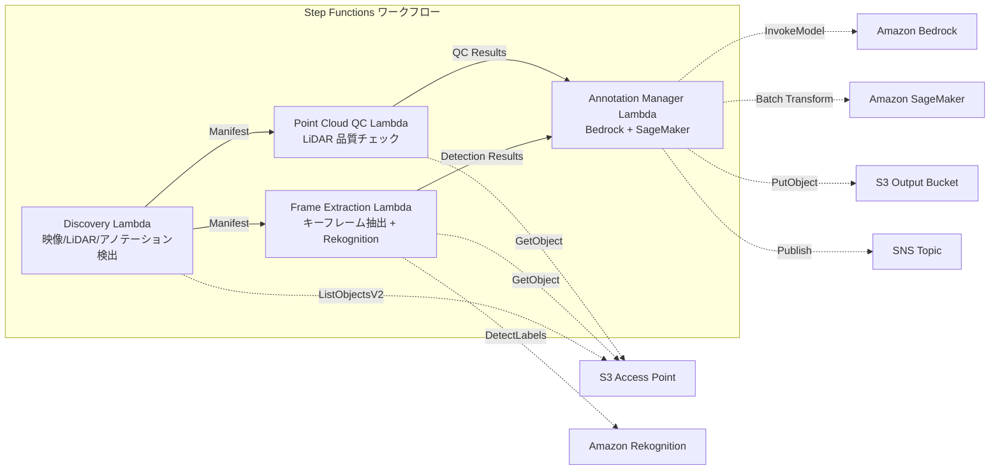

# UC9: Autoconducción / ADAS — Preprocesamiento de imágenes y LiDAR, verificación de calidad, anotación

🌐 **Language / 言語**: [日本語](README.md) | [English](README.en.md) | [한국어](README.ko.md) | [简体中文](README.zh-CN.md) | [繁體中文](README.zh-TW.md) | [Français](README.fr.md) | [Deutsch](README.de.md) | Español

## Descripción general
Un flujo de trabajo sin servidor que aprovecha los Puntos de Acceso S3 de FSx for NetApp ONTAP para automatizar el preprocesamiento, la verificación de calidad y la gestión de anotaciones de imágenes de dashcam y datos de nube de puntos LiDAR.
### Casos en los que este patrón es adecuado
- Las imágenes de la dashcam y los datos de nubes de puntos LiDAR están almacenados en grandes cantidades en FSx ONTAP
- Quiero automatizar la extracción de fotogramas clave y la detección de objetos (vehículos, peatones, señales de tráfico) de las imágenes
- Quiero realizar verificaciones de calidad periódicas de las nubes de puntos LiDAR (densidad de puntos, integridad de coordenadas)
- Quiero gestionar los metadatos de anotación en formato COCO compatible
- Quiero incorporar la inferencia de segmentación de nubes de puntos mediante SageMaker Batch Transform
### Casos donde este patrón no es adecuado
- Se necesita un pipeline de inferencia de conducción autónoma en tiempo real
- Transcodificación de video a gran escala (MediaConvert / EC2 es adecuado)
- Procesamiento completo de LiDAR SLAM (un clúster HPC es adecuado)
- Entornos donde no se puede garantizar el acceso a la red a la API REST de ONTAP
### Principales características
- Detección automática de video (.mp4,.avi, .mkv), LiDAR (.pcd,.las, .laz, .ply), y anotaciones (.json) a través de S3 AP
- Detección de objetos (vehículos, peatones, señales de tráfico, marcas de carril) mediante Rekognition DetectLabels
- Verificación de calidad del punto nube de LiDAR (point_count, coordinate_bounds, point_density, verificación de NaN)
- Generación de propuestas de anotación mediante Bedrock
- Inferencia de segmentación de punto nube mediante SageMaker Batch Transform
- Salida de anotaciones en formato JSON compatible con COCO
## Arquitectura



### Paso del flujo de trabajo
1. **Descubrimiento**: Detectar imágenes, LiDAR y archivos de anotación desde S3 AP
2. **Extracción de fotogramas**: Extraer fotogramas clave de las imágenes y detectar objetos con Rekognition
3. **Control de calidad de nubes de puntos**: Extraer metadatos de encabezado de nubes de puntos LiDAR y verificar la calidad
4. **Administrador de anotaciones**: Generar propuestas de anotaciones con Bedrock y segmentar nubes de puntos con SageMaker
## Requisitos previos
- Cuenta de AWS y permisos de IAM adecuados
- Sistema de archivos FSx for NetApp ONTAP (ONTAP 9.17.1P4D3 o superior)
- Punto de acceso S3 habilitado en el volumen (para almacenar imágenes y datos LiDAR)
- VPC, subredes privadas
- Acceso a modelos de Amazon Bedrock habilitado (Claude / Nova)
- Punto de enlace de SageMaker (modelo de segmentación de nubes de puntos): opcional
## Pasos de implementación

### 1. Despliegue de CloudFormation

```bash
aws cloudformation deploy \
  --template-file autonomous-driving/template.yaml \
  --stack-name fsxn-autonomous-driving \
  --parameter-overrides \
    S3AccessPointAlias=<your-volume-ext-s3alias> \
    S3AccessPointName=<your-s3ap-name> \
    VpcId=<your-vpc-id> \
    PrivateSubnetIds=<subnet-1>,<subnet-2> \
    ScheduleExpression="rate(1 hour)" \
    NotificationEmail=<your-email@example.com> \
    EnableVpcEndpoints=false \
    EnableCloudWatchAlarms=false \
  --capabilities CAPABILITY_IAM CAPABILITY_AUTO_EXPAND \
  --region ap-northeast-1
```

## Lista de parámetros de configuración

| パラメータ | 説明 | デフォルト | 必須 |
|-----------|------|----------|------|
| `S3AccessPointAlias` | FSx ONTAP S3 AP Alias（入力用） | — | ✅ |
| `S3AccessPointName` | S3 AP 名（ARN ベースの IAM 権限付与用。省略時は Alias ベースのみ） | `""` | ⚠️ 推奨 |
| `ScheduleExpression` | EventBridge Scheduler のスケジュール式 | `rate(1 hour)` | |
| `VpcId` | VPC ID | — | ✅ |
| `PrivateSubnetIds` | プライベートサブネット ID リスト | — | ✅ |
| `NotificationEmail` | SNS 通知先メールアドレス | — | ✅ |
| `FrameExtractionInterval` | キーフレーム抽出間隔（秒） | `5` | |
| `MapConcurrency` | Map ステートの並列実行数 | `5` | |
| `LambdaMemorySize` | Lambda メモリサイズ (MB) | `2048` | |
| `LambdaTimeout` | Lambda タイムアウト (秒) | `600` | |
| `EnableVpcEndpoints` | Interface VPC Endpoints の有効化 | `false` | |
| `EnableCloudWatchAlarms` | CloudWatch Alarms の有効化 | `false` | |

## Limpieza

```bash
aws s3 rm s3://fsxn-autonomous-driving-output-${AWS_ACCOUNT_ID} --recursive

aws cloudformation delete-stack \
  --stack-name fsxn-autonomous-driving \
  --region ap-northeast-1

aws cloudformation wait stack-delete-complete \
  --stack-name fsxn-autonomous-driving \
  --region ap-northeast-1
```

## Enlaces de referencia
- [Puntos de acceso a S3 de FSx ONTAP - 概要](https://docs.aws.amazon.com/fsx/latest/ONTAPGuide/accessing-data-via-s3-access-points.html)
- [Detección de etiquetas con Amazon Rekognition](https://docs.aws.amazon.com/rekognition/latest/dg/labels.html)
- [Transformación por lotes de Amazon SageMaker](https://docs.aws.amazon.com/sagemaker/latest/dg/batch-transform.html)
- [Formato de datos COCO](https://cocodataset.org/#format-data)
- [Especificación del formato de archivo LAS](https://www.asprs.org/divisions-committees/lidar-division/laser-las-file-format-exchange-activities)
## Integración de SageMaker Batch Transform (Fase 3)
En la **Fase 3**, la **inferencia de segmentación de nubes de puntos LiDAR con SageMaker Batch Transform** está disponible como opción. Se utiliza el Patrón de Callback de Step Functions (`.waitForTaskToken`) para esperar de manera asíncrona la finalización del trabajo de inferencia por lotes.
### Activación

```bash
aws cloudformation deploy \
  --template-file autonomous-driving/template.yaml \
  --stack-name fsxn-autonomous-driving \
  --parameter-overrides \
    EnableSageMakerTransform=true \
    MockMode=true \
    ... # 他のパラメータ
  --capabilities CAPABILITY_IAM CAPABILITY_AUTO_EXPAND
```

### Flujo de trabajo

```
Discovery → Frame Extraction → Point Cloud QC
  → [EnableSageMakerTransform=true] SageMaker Invoke (.waitForTaskToken)
  → SageMaker Batch Transform Job
  → EventBridge (job state change) → SageMaker Callback (SendTaskSuccess/Failure)
  → Annotation Manager (Rekognition + SageMaker 結果統合)
```

### Modo de simulación
En el entorno de prueba, el uso de `MockMode=true` (predeterminado) permite validar el flujo de datos del Patrón de Callback sin el despliegue real del modelo SageMaker.

- **MockMode=true**: Sin invocar la API de SageMaker, genera salida de segmentación simulada (etiquetas aleatorias iguales al número de point_count de entrada) y llama directamente a SendTaskSuccess
- **MockMode=false**: Ejecuta el trabajo real de CreateTransformJob de SageMaker. Requiere el despliegue previo del modelo
### Parámetros de configuración (agregados en la Fase 3)

| パラメータ | 説明 | デフォルト |
|-----------|------|----------|
| `EnableSageMakerTransform` | SageMaker Batch Transform の有効化 | `false` |
| `MockMode` | モックモード（テスト用） | `true` |
| `SageMakerModelName` | SageMaker モデル名 | — |
| `SageMakerInstanceType` | Batch Transform インスタンスタイプ | `ml.m5.xlarge` |

## Regiones admitidas
UC9 utiliza los siguientes servicios:
| サービス | リージョン制約 |
|---------|-------------|
| Amazon Rekognition | ほぼ全リージョンで利用可能 |
| Amazon Bedrock | 対応リージョンを確認（[Bedrock 対応リージョン](https://docs.aws.amazon.com/general/latest/gr/bedrock.html)） |
| SageMaker Batch Transform | ほぼ全リージョンで利用可能（インスタンスタイプの可用性はリージョンにより異なる） |
| AWS X-Ray | ほぼ全リージョンで利用可能 |
| CloudWatch EMF | ほぼ全リージョンで利用可能 |
> Cuando habilites SageMaker Batch Transform, verifica la disponibilidad del tipo de instancia en la región objetivo en la [Lista de servicios regionales de AWS](https://aws.amazon.com/about-aws/global-infrastructure/regional-product-services/) antes del despliegue. Para más detalles, consulta la [Matriz de compatibilidad regional](../docs/region-compatibility.md).