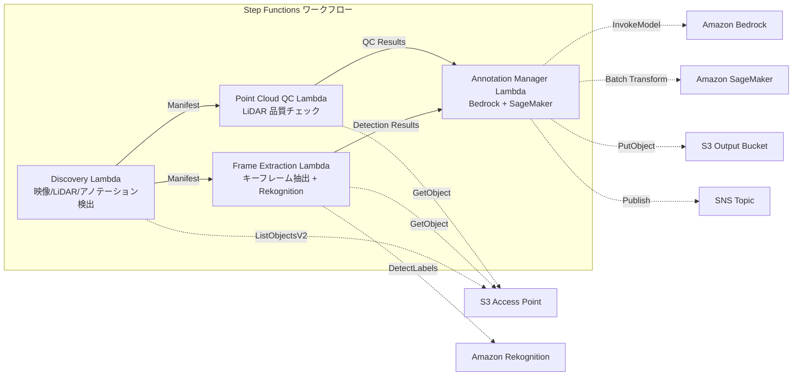

# UC9: Autonomie / ADAS — Prétraitement d'images et LiDAR, vérification de la qualité et annotation

🌐 **Language / 言語**: [日本語](README.md) | [English](README.en.md) | [한국어](README.ko.md) | [简体中文](README.zh-CN.md) | [繁體中文](README.zh-TW.md) | Français | [Deutsch](README.de.md) | [Español](README.es.md)

## Aperçu
FSx for NetApp ONTAP utilise les points d'accès S3 pour automatiser les workflows sans serveur de prétraitrage, de vérification de la qualité et de gestion des annotations des vidéos dashcam et des données LiDAR.
### Cas où ce modèle est approprié
- Des vidéos de dashcam et des données de nuages de points LiDAR sont stockées en masse sur FSx ONTAP
- Nous souhaitons automatiser l'extraction des images clés et la détection d'objets (véhicules, piétons, panneaux de signalisation) à partir des vidéos
- Nous souhaitons effectuer régulièrement des vérifications de qualité des nuages de points LiDAR (densité de points, intégrité des coordonnées)
- Nous voulons gérer les métadonnées d'annotation au format COCO compatible
- Nous voulons intégrer l'inférence de segmentation de nuages de points avec SageMaker Batch Transform
### Cas où ce modèle ne convient pas
- Nécessité d'un pipeline d'inférence pour la conduite autonome en temps réel
- Transcodage d'images à grande échelle (MediaConvert / EC2 est approprié)
- Traitement complet LiDAR SLAM (un cluster HPC est approprié)
- Environnements où la connectivité réseau à l'API REST ONTAP n'est pas assurée
### Principales fonctionnalités
- Détection automatique des vidéos (.mp4,.avi,.mkv), des données LiDAR (.pcd,.las, .laz, .ply) et des annotations (.json) via l'AP S3
- Détection d'objets avec Rekognition DetectLabels (véhicules, piétons, panneaux de signalisation, marquages de ligne)
- Contrôle de la qualité des nuages de points LiDAR (point_count, coordinate_bounds, point_density, vérification NaN)
- Génération de propositions d'annotations avec Bedrock
- Inférence de segmentation de nuages de points avec SageMaker Batch Transform
- Sortie d'annotations au format JSON compatible COCO
## Architecture



### Étapes du flux de travail
1. **Découverte** : Détection des vidéos, LiDAR, fichiers d'annotation depuis S3 AP
2. **Extraction d'images** : Extraction des images clés à partir des vidéos et détection d'objets avec Rekognition
3. **Contrôle qualité du nuage de points** : Extraction des métadonnées d'en-tête du nuage de points LiDAR et vérification de qualité
4. **Gestionnaire d'annotations** : Génération de suggestions d'annotation avec Bedrock, segmentation du nuage de points avec SageMaker
## Conditions préalables
- Compte AWS et permissions IAM appropriées
- Système de fichiers FSx for NetApp ONTAP (ONTAP 9.17.1P4D3 ou supérieur)
- Point d'accès S3 activé pour les volumes (stockage des images et données LiDAR)
- VPC, sous-réseaux privés
- Accès aux modèles Amazon Bedrock activé (Claude / Nova)
- Point de terminaison SageMaker (modèle de segmentation de nuages de points) — Facultatif
## Étapes de déploiement

### 1. Déploiement CloudFormation

```bash
aws cloudformation deploy \
  --template-file autonomous-driving/template.yaml \
  --stack-name fsxn-autonomous-driving \
  --parameter-overrides \
    S3AccessPointAlias=<your-volume-ext-s3alias> \
    S3AccessPointName=<your-s3ap-name> \
    VpcId=<your-vpc-id> \
    PrivateSubnetIds=<subnet-1>,<subnet-2> \
    ScheduleExpression="rate(1 hour)" \
    NotificationEmail=<your-email@example.com> \
    EnableVpcEndpoints=false \
    EnableCloudWatchAlarms=false \
  --capabilities CAPABILITY_IAM CAPABILITY_AUTO_EXPAND \
  --region ap-northeast-1
```

## Liste des paramètres de configuration

| パラメータ | 説明 | デフォルト | 必須 |
|-----------|------|----------|------|
| `S3AccessPointAlias` | FSx ONTAP S3 AP Alias（入力用） | — | ✅ |
| `S3AccessPointName` | S3 AP 名（ARN ベースの IAM 権限付与用。省略時は Alias ベースのみ） | `""` | ⚠️ 推奨 |
| `ScheduleExpression` | EventBridge Scheduler のスケジュール式 | `rate(1 hour)` | |
| `VpcId` | VPC ID | — | ✅ |
| `PrivateSubnetIds` | プライベートサブネット ID リスト | — | ✅ |
| `NotificationEmail` | SNS 通知先メールアドレス | — | ✅ |
| `FrameExtractionInterval` | キーフレーム抽出間隔（秒） | `5` | |
| `MapConcurrency` | Map ステートの並列実行数 | `5` | |
| `LambdaMemorySize` | Lambda メモリサイズ (MB) | `2048` | |
| `LambdaTimeout` | Lambda タイムアウト (秒) | `600` | |
| `EnableVpcEndpoints` | Interface VPC Endpoints の有効化 | `false` | |
| `EnableCloudWatchAlarms` | CloudWatch Alarms の有効化 | `false` | |

## Nettoyage

```bash
aws s3 rm s3://fsxn-autonomous-driving-output-${AWS_ACCOUNT_ID} --recursive

aws cloudformation delete-stack \
  --stack-name fsxn-autonomous-driving \
  --region ap-northeast-1

aws cloudformation wait stack-delete-complete \
  --stack-name fsxn-autonomous-driving \
  --region ap-northeast-1
```

## Liens de référence
- [FSx ONTAP S3 Access Points 概要](https://docs.aws.amazon.com/fsx/latest/ONTAPGuide/accessing-data-via-s3-access-points.html)
- [Détection de labels avec Amazon Rekognition](https://docs.aws.amazon.com/rekognition/latest/dg/labels.html)
- [Transformation par lots avec Amazon SageMaker](https://docs.aws.amazon.com/sagemaker/latest/dg/batch-transform.html)
- [Format de données COCO](https://cocodataset.org/#format-data)
- [Spécifications du format de fichier LAS](https://www.asprs.org/divisions-committees/lidar-division/laser-las-file-format-exchange-activities)
## Intégration de SageMaker Batch Transform (Phase 3)
Lors de la phase 3, vous pouvez opter pour l’**inférence de segmentation de nuages de points LiDAR avec SageMaker Batch Transform**. Utilisez le modèle de rappel de Step Functions (`.waitForTaskToken`) pour attendre de manière asynchrone la fin des travaux d'inférence par lots.
### Activation

```bash
aws cloudformation deploy \
  --template-file autonomous-driving/template.yaml \
  --stack-name fsxn-autonomous-driving \
  --parameter-overrides \
    EnableSageMakerTransform=true \
    MockMode=true \
    ... # 他のパラメータ
  --capabilities CAPABILITY_IAM CAPABILITY_AUTO_EXPAND
```

### Flux de travail

```
Discovery → Frame Extraction → Point Cloud QC
  → [EnableSageMakerTransform=true] SageMaker Invoke (.waitForTaskToken)
  → SageMaker Batch Transform Job
  → EventBridge (job state change) → SageMaker Callback (SendTaskSuccess/Failure)
  → Annotation Manager (Rekognition + SageMaker 結果統合)
```

### Mode simulé
Dans l'environnement de test, l'utilisation de `MockMode=true` (par défaut) permet de valider le flux de données du modèle Callback sans déployer réellement le modèle SageMaker.

- **MockMode=true**: Ne pas appeler l'API SageMaker, générer une sortie de segmentation de simulation (étiquettes aléatoires correspondant au nombre de point_count en entrée) et appeler directement SendTaskSuccess
- **MockMode=false**: Exécuter le vrai CreateTransformJob de SageMaker. Le déploiement du modèle est requis au préalable.
### Paramètres de configuration (ajoutés dans la phase 3)

| パラメータ | 説明 | デフォルト |
|-----------|------|----------|
| `EnableSageMakerTransform` | SageMaker Batch Transform の有効化 | `false` |
| `MockMode` | モックモード（テスト用） | `true` |
| `SageMakerModelName` | SageMaker モデル名 | — |
| `SageMakerInstanceType` | Batch Transform インスタンスタイプ | `ml.m5.xlarge` |

## Régions prises en charge
UC9 utilise les services suivants :
| サービス | リージョン制約 |
|---------|-------------|
| Amazon Rekognition | ほぼ全リージョンで利用可能 |
| Amazon Bedrock | 対応リージョンを確認（[Bedrock 対応リージョン](https://docs.aws.amazon.com/general/latest/gr/bedrock.html)） |
| SageMaker Batch Transform | ほぼ全リージョンで利用可能（インスタンスタイプの可用性はリージョンにより異なる） |
| AWS X-Ray | ほぼ全リージョンで利用可能 |
| CloudWatch EMF | ほぼ全リージョンで利用可能 |
> Si vous activez SageMaker Batch Transform, veuillez vérifier la disponibilité des types d'instances pour la région cible dans la [Liste des services régionaux AWS](https://aws.amazon.com/about-aws/global-infrastructure/regional-product-services/) avant le déploiement. Pour plus de détails, consultez la [Matrice de compatibilité des régions](../docs/region-compatibility.md).