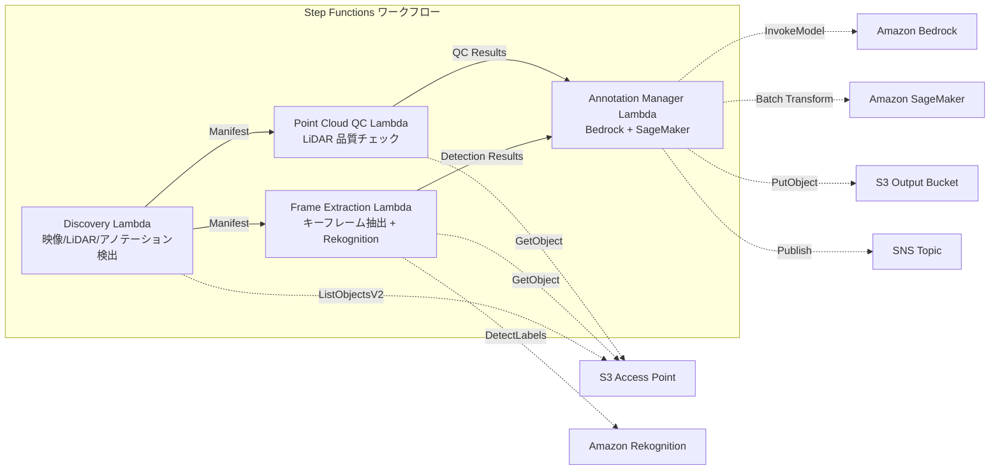

# UC9: 자율 주행 / ADAS — 이미지 및 LiDAR 사전 처리, 품질 검사, 주석 작성

🌐 **Language / 言語**: [日本語](README.md) | [English](README.en.md) | 한국어 | [简体中文](README.zh-CN.md) | [繁體中文](README.zh-TW.md) | [Français](README.fr.md) | [Deutsch](README.de.md) | [Español](README.es.md)

## 개요
FSx for NetApp ONTAP의 S3 액세스 포인트를 활용하여 다시캠 영상과 LiDAR 포인트 클라우드 데이터의 전처리, 품질 검사, 어노테이션 관리를 자동화하는 서버리스 워크플로입니다.
### 이 패턴이 적합한 경우
- 다시 카메라 영상 및 LiDAR 포인트 클라우드 데이터가 Amazon FSx for NetApp ONTAP에 대량으로 저장되어 있습니다.
- 영상에서 키프레임 추출 및 물체 감지(차량, 보행자, 교통 표지판)를 자동화하고 싶습니다.
- LiDAR 포인트 클라우드의 품질 검사(포인트 밀도, 좌표 일관성)를 정기적으로 실시하고 싶습니다.
- COCO 호환 형식으로 어노테이션 메타데이터를 관리하고 싶습니다.
- SageMaker Batch Transform을 통한 포인트 클라우드 분할 추론을 통합하고 싶습니다.
### 이 패턴이 적합하지 않은 경우
- 실시간 자율 주행 추론 파이프라인이 필요합니다
- 대규모 영상 트랜스코딩(MediaConvert / EC2가 적합)
- 완전한 LiDAR SLAM 처리(HPC 클러스터가 적합)
- ONTAP REST API에 대한 네트워크 접근성을 보장할 수 없는 환경
### 주요 기능
- S3 AP를 통해 영상(.mp4,.avi,.mkv), LiDAR(.pcd,.las,.laz,.ply), 주석(.json)을 자동 검출
- Rekognition DetectLabels를 통한 물체 검출(차량, 보행자, 교통 표지판, 차선 마킹)
- LiDAR 포인트 클라우드의 품질 검사(point_count, coordinate_bounds, point_density, NaN 검증)
- Bedrock을 통한 주석 제안 생성
- SageMaker Batch Transform을 통한 포인트 클라우드 분할 추론
- COCO 호환 JSON 형식의 주석 출력
## 아키텍처



### 워크플로우 단계
1. **Discovery**: S3 AP에서 영상, LiDAR, 주석 파일 검색
2. **프레임 추출**: 영상에서 키프레임을 추출하고, Rekognition으로 물체 검출
3. **포인트 클라우드 QC**: LiDAR 포인트 클라우드의 헤더 메타데이터 추출 및 품질 검증
4. **주석 관리자**: Bedrock에서 주석 제안 생성, SageMaker에서 포인트 클라우드 분할
## 전제 조건
- AWS 계정 및 적절한 IAM 권한
- NetApp ONTAP용 FSx 파일 시스템 (ONTAP 9.17.1P4D3 이상)
- S3 액세스 포인트가 활성화된 볼륨 (영상 및 LiDAR 데이터 저장)
- VPC, 프라이빗 서브넷
- Amazon Bedrock 모델 액세스 활성화 (Claude / Nova)
- SageMaker 엔드포인트 (포인트 클라우드 세그멘테이션 모델) — 선택 사항
## 배포 절차

### 1. CloudFormation 배포

규칙:
- AWS 서비스 이름은 영어로 유지(Amazon Bedrock, AWS Step Functions, Amazon Athena, Amazon S3, AWS Lambda, Amazon FSx for NetApp ONTAP, Amazon CloudWatch, AWS CloudFormation 등)
- 기술 용어는 미번역(GDSII, DRC, OASIS, GDS, Lambda, tapeout 등)
- 인라인 코드(`...`)는 미번역
- 파일 경로 및 URL은 미번역
- 자연스럽게 번역하고, 직역하지 않음
- 설명 없이 번역문만 반환

```bash
aws cloudformation deploy \
  --template-file autonomous-driving/template.yaml \
  --stack-name fsxn-autonomous-driving \
  --parameter-overrides \
    S3AccessPointAlias=<your-volume-ext-s3alias> \
    S3AccessPointName=<your-s3ap-name> \
    VpcId=<your-vpc-id> \
    PrivateSubnetIds=<subnet-1>,<subnet-2> \
    ScheduleExpression="rate(1 hour)" \
    NotificationEmail=<your-email@example.com> \
    EnableVpcEndpoints=false \
    EnableCloudWatchAlarms=false \
  --capabilities CAPABILITY_IAM CAPABILITY_AUTO_EXPAND \
  --region ap-northeast-1
```

## 설정 파라미터 목록

| パラメータ | 説明 | デフォルト | 必須 |
|-----------|------|----------|------|
| `S3AccessPointAlias` | FSx ONTAP S3 AP Alias（入力用） | — | ✅ |
| `S3AccessPointName` | S3 AP 名（ARN ベースの IAM 権限付与用。省略時は Alias ベースのみ） | `""` | ⚠️ 推奨 |
| `ScheduleExpression` | EventBridge Scheduler のスケジュール式 | `rate(1 hour)` | |
| `VpcId` | VPC ID | — | ✅ |
| `PrivateSubnetIds` | プライベートサブネット ID リスト | — | ✅ |
| `NotificationEmail` | SNS 通知先メールアドレス | — | ✅ |
| `FrameExtractionInterval` | キーフレーム抽出間隔（秒） | `5` | |
| `MapConcurrency` | Map ステートの並列実行数 | `5` | |
| `LambdaMemorySize` | Lambda メモリサイズ (MB) | `2048` | |
| `LambdaTimeout` | Lambda タイムアウト (秒) | `600` | |
| `EnableVpcEndpoints` | Interface VPC Endpoints の有効化 | `false` | |
| `EnableCloudWatchAlarms` | CloudWatch Alarms の有効化 | `false` | |

## 정리

```bash
aws s3 rm s3://fsxn-autonomous-driving-output-${AWS_ACCOUNT_ID} --recursive

aws cloudformation delete-stack \
  --stack-name fsxn-autonomous-driving \
  --region ap-northeast-1

aws cloudformation wait stack-delete-complete \
  --stack-name fsxn-autonomous-driving \
  --region ap-northeast-1
```

## 참조 링크
- [FSx ONTAP S3 액세스 포인트 개요](https://docs.aws.amazon.com/fsx/latest/ONTAPGuide/accessing-data-via-s3-access-points.html)
- [Amazon Rekognition 레이블 검출](https://docs.aws.amazon.com/rekognition/latest/dg/labels.html)
- [Amazon SageMaker 배치 변환](https://docs.aws.amazon.com/sagemaker/latest/dg/batch-transform.html)
- [COCO 데이터 형식](https://cocodataset.org/#format-data)
- [LAS 파일 형식 사양](https://www.asprs.org/divisions-committees/lidar-division/laser-las-file-format-exchange-activities)
## SageMaker Batch Transform 통합(3단계)
3단계에서는 **SageMaker Batch Transform을 사용한 LiDAR 포인트 클라우드 세그멘테이션 추론**을 선택적으로 이용할 수 있습니다. Step Functions의 Callback Pattern(`.waitForTaskToken`)을 사용하여 비동기적으로 배치 추론 작업의 완료를 대기합니다.
### 활성화

```bash
aws cloudformation deploy \
  --template-file autonomous-driving/template.yaml \
  --stack-name fsxn-autonomous-driving \
  --parameter-overrides \
    EnableSageMakerTransform=true \
    MockMode=true \
    ... # 他のパラメータ
  --capabilities CAPABILITY_IAM CAPABILITY_AUTO_EXPAND
```

### 워크플로우

```
Discovery → Frame Extraction → Point Cloud QC
  → [EnableSageMakerTransform=true] SageMaker Invoke (.waitForTaskToken)
  → SageMaker Batch Transform Job
  → EventBridge (job state change) → SageMaker Callback (SendTaskSuccess/Failure)
  → Annotation Manager (Rekognition + SageMaker 結果統合)
```

### 모의 모드
테스트 환경에서는 `MockMode=true` (기본값)을 사용하여 실제 SageMaker 모델 배포 없이 Callback Pattern의 데이터 흐름을 검증할 수 있습니다.

- **MockMode=true**: SageMaker API를 호출하지 않고, 모의 세그멘테이션 출력(입력 point_count와 동일한 수의 랜덤 라벨)을 생성하고 직접 SendTaskSuccess를 호출합니다
- **MockMode=false**: 실제 SageMaker CreateTransformJob을 실행합니다. 사전에 모델의 배포가 필요합니다
### 설정 매개변수 (3단계 추가)

| パラメータ | 説明 | デフォルト |
|-----------|------|----------|
| `EnableSageMakerTransform` | SageMaker Batch Transform の有効化 | `false` |
| `MockMode` | モックモード（テスト用） | `true` |
| `SageMakerModelName` | SageMaker モデル名 | — |
| `SageMakerInstanceType` | Batch Transform インスタンスタイプ | `ml.m5.xlarge` |

## 지원되는 리전
UC9는 다음 서비스를 사용합니다: Amazon Bedrock, AWS Step Functions, Amazon Athena, Amazon S3, AWS Lambda, Amazon FSx for NetApp ONTAP, Amazon CloudWatch, AWS CloudFormation 등.
| サービス | リージョン制約 |
|---------|-------------|
| Amazon Rekognition | ほぼ全リージョンで利用可能 |
| Amazon Bedrock | 対応リージョンを確認（[Bedrock 対応リージョン](https://docs.aws.amazon.com/general/latest/gr/bedrock.html)） |
| SageMaker Batch Transform | ほぼ全リージョンで利用可能（インスタンスタイプの可用性はリージョンにより異なる） |
| AWS X-Ray | ほぼ全リージョンで利用可能 |
| CloudWatch EMF | ほぼ全リージョンで利用可能 |
> SageMaker Batch Transform을 활성화할 경우, 배포 전에 [AWS Regional Services List](https://aws.amazon.com/about-aws/global-infrastructure/regional-product-services/)에서 대상 리전의 인스턴스 타입 가용성을 확인하세요. 자세한 내용은 [리전 호환성 매트릭스](../docs/region-compatibility.md)를 참조하세요.